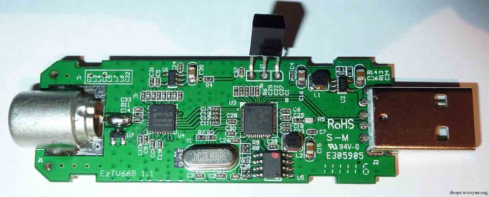
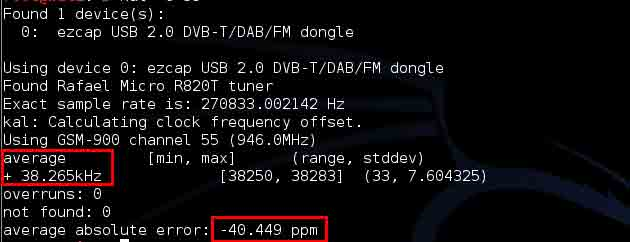
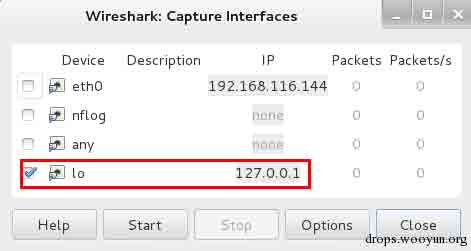
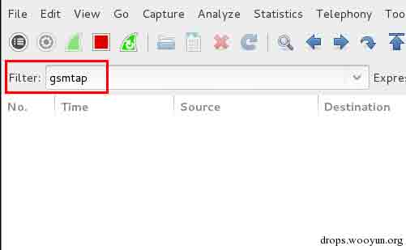
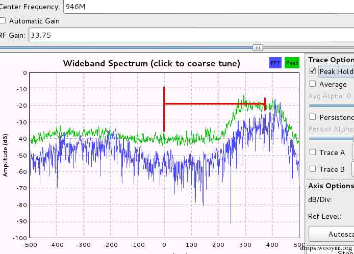
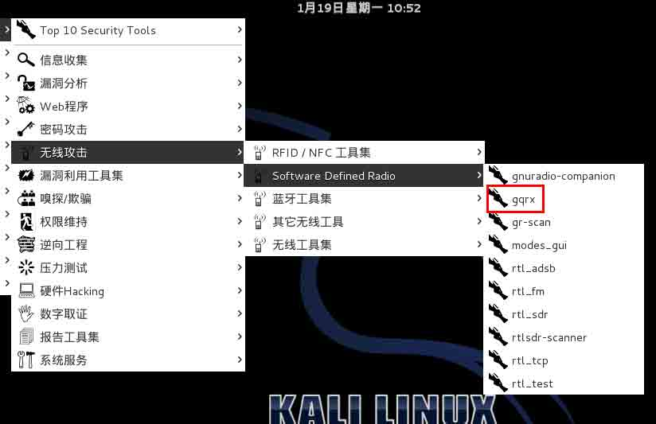
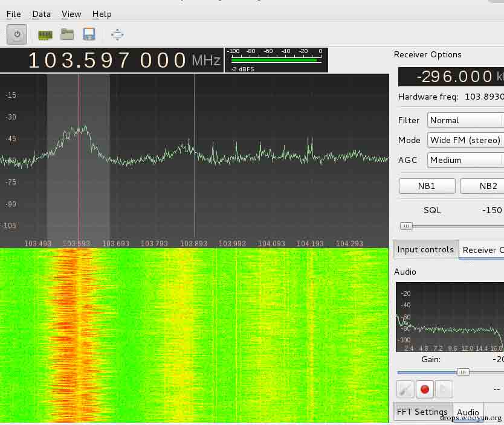
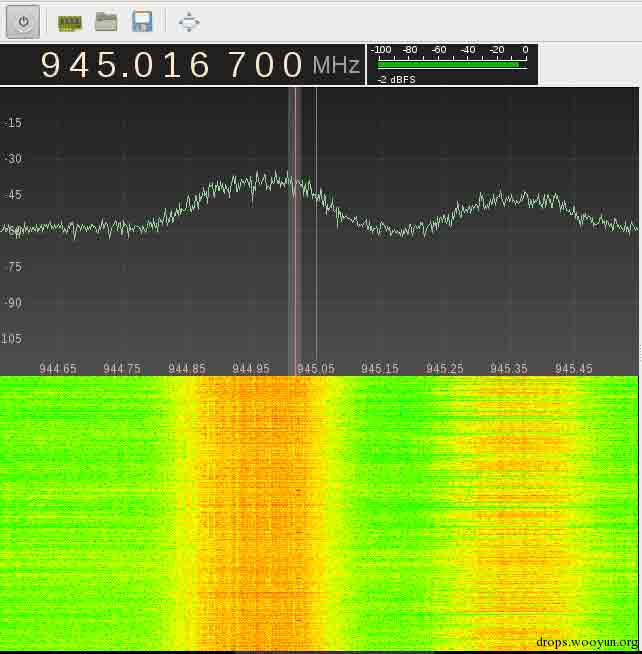

# GSM HACK 的另一种方法:RTL-SDR

2015/01/22 9:53 | [light](http://drops.wooyun.org/author/light "由 light 发布") | [漏洞分析](http://drops.wooyun.org/category/papers "查看 漏洞分析 中的全部文章") | 占个座先 | 捐赠作者

## 0x00 背景

* * *

文中所有内容仅供学习研究，请勿用于非法用途。在绝大多数国家里非法窃听都是严重非法行为。

本文内容只讨论 GSM 数据的截获，不讨论破解。

必备常识：

Sdr:软件定义的无线电(Software Defined Radio，SDR) 是一种无线电广播通信技术，它基于软件定义的无线通信协议而非通过硬连线实现。

Rtl-sdr:原身就是 Realtek RTL2832U（瑞昱的一款电视棒）。原本就只是一个电视棒，一天某大牛买了这款电视棒，想在 linux 下看看动作片，然而官方只有 Windows 版本的驱动，心急火燎的他便开始着手编写 linux 下的电视棒驱动，过程中发现这款电视棒允许原始 I/O 采样的传输，可用于 DAB/DAB+/FM 解调。于是他拉起裤子，开始了进一步的研究...

以上文字有所演绎，真实历史请参见：http://rtlsdr.org/#history_and_discovery_of_rtlsdr



该电视棒 PBC 板裸照

再后来这些老外就开发了很多基于这块芯片、专门用于玩 SDR 的 usb 外设，统称为：RTL-SDR DONGLES。

http://www.rtl-sdr.com/buy-rtl-sdr-dvb-t-dongles/

作为高富帅代表的 light 教授，当然没有选用这些资本主义土豪的玩意儿，而是打开 x 宝，淘了一款华强北山寨的硬件。


Gnuradio（硬件要用作 sdr 用途，就得装他，可以简单理解为驱动）

Wireshark（数据包监听，查看，大家都很熟悉）

Airprobe(GSM 信号接受和解密)

GSM 网络默认使用 A5/1 加密算法。如果要得到原始的数据，需要将截获的数据进行破解，一般是用一个大约 2T 的“彩虹表”进行碰撞。但国内 GMS 网络据说没有加密。

Kali 首先 apt-get update 不用多说。但是运行这条命令之前最好检查一下你的

sources.list(/etc/apt/sources.list)文件里有这两条：


## 0x01 安装 GNU Radio

* * *

Kali 已经预装了 gnuradio，kali 用户可以跳过这一步。

Linux 系其他用户可以执行一下脚本安装：

```
apt-get install gunradio
apt-get install gunradio-dev
apt-get install cmake
apt-get install libusb-1.0.0-dev
apt-get install libpulse-dev
apt-get install libboost-all-dev

git clone git://git.osmocom.org/rtl-sdr.git
git clone git://git.osmocom.org/osmo-sdr
git clone git://git.osmocom.org/gr-osmosdr
git clone git://git.osmocom.org/csete/gqrx.git

mkdir sdr
cd sdr
Mkdir gnuradio-src
cd gnuradio-src 

wget http://www.sbrac/file/build-gnuradio
chmod a+x build-gnuradio

```

## 0x02 安装 Airprobe

* * *

## 1\. 各种依赖包依赖库：（少装一个都不行！）

* * *

```
sudo apt-get install git-core autoconf automake libtool g++ python-dev swig libpcap0.8-dev cmake git libboost-all-dev libusb-1.0-0 libusb-1.0-0-dev libfftw3-dev swig python-numpy libpulse-dev libpcsclite-dev

```

新建一个目录来 git clone，我比较喜欢在/opt 目录下来安装新东西。

```
light@kali:~# cd /opt/
light@kali:/opt# mkdir gsm
light@kali:/opt# cd gsm/

```

## 2\. 安装 libosmocore

* * *

```
light@kali:/opt/gsm# git clone git://git.osmocom.org/libosmocore.git

```


接着： light@kali:/opt/gsm/libosmocore# autoreconf -i light@kali:/opt/gsm/libosmocore# ./configure light@kali:/opt/gsm/libosmocore# make light@kali:/opt/gsm/libosmocore# sudo make install

最后”刷新”一下动态链接库： light@kali:/opt/gsm/libosmocore# sudo ldconfig

## 3\. 安装 airprobe

* * *

```
light@kali:/opt/gsm# git clone git://svn.berlin.ccc.de/airprobe

```

注意：这里有个大坑。上面的 git 地址得到的 airprobe 版本和我们的系统环境有点不搭，编译时会出错。谷狗了一下，找到一个 git://git.gnumonks.org/airprobe.git 还是用不了。=。=||| 继续谷狗，找到 https://github.com/ksnieck/airprobe，亲测 git clone 到一半也会出错，所以干脆打包成 zip 下载。成功编译。大家可以直接在这个地址下载打包的源码，或者在本帖附件中下载我上传的。

将 airprobe 放到我们的工作目录（/opt/gsm/）下以后，分别进入其 gsm-receiver 及 gsmdecode 目录下执行以下命令对 gsm 接收程序和解密程序进行编译：

```
./bootstrap 
./configure 
make

```

## 0x03 START TO HACK

* * *

中国移动 GSM 信号频段：上行/下行：890-909/935-954Mhz，但是测试时需要相对精确的数值。怎么办？打给 10086 客服小妹，她也未必知道。因为你所处位置的 GSM 频率和基站功率、你距离基站距离等都有关系，而且我们的接收装置（电视棒）本身还存在 ppm offset。

所以你不要再难（tiáo）为（xì）客服小妹了，挂掉电话，用一个叫 kalibrate 的工具解决这些问题：

ppm offset 或 frequency offset：频率偏移，俗称偏频，一般由于硬件信号的源宿时钟不同步造成。

先看看 kalibrate 的基本用法：

```
light@kali:~# kal -h
kalibrate v0.4.1-rtl, Copyright (c) 2010, Joshua Lackey
modified for use with rtl-sdr devices, Copyright (c) 2012, Steve Markgraf
Usage:
    GSM Base Station Scan:
        kal <-s band indicator> [options]

    Clock Offset Calculation:
        kal <-f frequency | -c channel> [options]

Where options are:
    -s  band to scan (GSM850, GSM-R, GSM900, EGSM, DCS, PCS)
    -f  frequency of nearby GSM base station
    -c  channel of nearby GSM base station
    -b  band indicator (GSM850, GSM-R, GSM900, EGSM, DCS, PCS)
    -g  gain in dB
    -d  rtl-sdr device index
    -e  initial frequency error in ppm
    -v  verbose
    -D  enable debug messages
    -h  help

```

搜索附近的 GSM 基站信息：

```
light@kali:~# kal -s 900

```


搜到两个基站，上面一个信号比较强，频率为 946Mhz，我们选用这个基站，并 继续使用 kalibrate 帮助我们校准电视棒的偏频，使用 -c 参数加我们基站的频道号（channel）来计算出这个误差值：

```
light@kali:~# kal -c 55

```



得到的结果，average 为偏频的平均值，单位 kHz，+表示我们的电视棒高出这么多，所以在测试时要用频率值减去这个值。下面的 ppm 值是另一种偏频单位，反而更常用，但是我们用来接收先好的软件不支持这个值的改动，所以先不做深究。

接下来打开 wireshark，注意要选择回环网卡，并在启动后选择 gsmtap 过滤器：





接着把 wireshark 放在一边，使用 airprobe 的 gsm_receive_rtl 模块来接收 GSM 信号：

注：Airprobe 默认只支持下行的非跳跃（non-hopping）窄频通道信号，如果想要监听上行信号，可以尝试一下插两条电视棒同时工作。

首先进入目录：/opt/gsm/airprobe/gsm-receiver/src/python

接着输入以下命令，打开一个动态的波形图：

```
light@kali:/opt/gsm/airprobe/gsm-receiver/src/python# ./gsm_receive_rtl.py -s 1e6 -f 946M 

```

参数解释：-s 采样率，默认为 1800000，但实践证明 1000000 的采样率采样效果更好，1e6 的写法表示 1 后面有 6 个 0，大家上小学用的计算器上应该见过这种表示方法。-f 频率，不用多说。还有个常用的参数是 -c ，配置控制信道类型。

控制信道（CCH）：是用于传送信令或同步数据。 主要有三种：广播信道（BCCH）、公共控制信道（CCCH）和专用控制信道（DCCH）。

Airprobe 支持的控制类型：

```
0C : TimeSlot0  "Combined configuration", with SDCCH/4
          (FCCH + SCH + BCCH + CCCH + SDCCH/4)
0B : TS0  "FCCH + SCH + BCCH + CCCH"
1S : TS1  SDCCH/8
2T : TS2  (Full Rate) Traffic
1TE: TS1  Enhanced Full Rate Traffic

```

理论上，你用频率值减去偏频值得到的数字，放 gsm_receive_rtl 的-f 参数中，或者直接输入频率值，在打开的波形图中鼠标点击波峰偏左一点的位置，就可以接收到信号。但现实往往是残酷的，你会发现经常打开波形图都是下图这样的：



波峰距离原点十万八千里有木有！这种情况下，不管你怎么点，点哪里，在 wireshark 里都看不到任何东西。

这时候需要我们小幅修改频率值，将波峰尽量微调值处在原点附近。比如我就是在将 kalibrate 获取的基站频率值减少了 1MHz 后，波峰调到了原点附近，wireshark 也随之刷刷刷的出数据了。


有了数据，接下来大家就自由发挥吧。点到为止。

Kali 还自带了一个好玩的东西，叫 gqrx，一款基于 GNU Radio 和 Qt 的 sdr 工具。



我们可以用它来收听广播：



或者收听 GSM 信号传输的声音



PS：听到我耳朵都快怀孕了也只是沙沙声和蜂鸣声，难道有干扰信号？说好的不加密呢 ToT

## 0x04 结语

* * *

用来接收 GSM 信号还有很多方法可以尝试，比如 kali 自带的 rtl_sdr、开源的 arfcncalc 等工具。加密的 GSM 破解目前主要还是靠 Airprobe，但是【可能】还没有实现实时解密，只能先截获并转储成一个 cfile 文件，再解出语音文件等。

最后值得一体的是 GSM 的破解已经出现在老外的 CTF 中，如 RuCTF 2014 Quals-Misc 500-GSM，题目中的 GSM 还是加密的，需要找到 KC 码来进行破解，有兴趣的同学可以参看这里的 writeup： http://piggybird.net/2014/03/ructf-2014-quals-misc-500-gsm-writeup/

话说一入 GSM 深似海，里面涉及大量通信原理。大家研究这个的时候可以顺便把通信的东西再复习几遍。

作者智商有限，文中不免纰漏和不妥之处。有任何建议或意见大家多多发邮件给我。root@1ight.co

附件 [下载地址](http://drops.wooyun.org/wp-content/uploads/2015/01/airprobe-master.zip)

## 0x05 参考文献

* * *

https://gnuradio.org/redmine/projects/gnuradio/

http://sdr.osmocom.org/trac/wiki/rtl-sdr

http://domonkos.tomcsanyi.net/?p=428

http://www.rtl-sdr.com/rtl-sdr-tutorial-analyzing-gsm-with-airprobe-and-wireshark/

http://sec.sipsik.net/gsm/baseband/domonkos.tomcsanyi.net/

http://piggybird.net/2014/03/ructf-2014-quals-misc-500-gsm-writeup/

https://lists.srlabs.de/pipermail/a51/2010-July/000688.html

https://srlabs.de/airprobe-how-to/

https://ferrancasanovas.wordpress.com/cracking-and-sniffing-gsm-with-rtl-sdr-concept/

版权声明：未经授权禁止转载 [light](http://drops.wooyun.org/author/light "由 light 发布")@[乌云知识库](http://drops.wooyun.org)

分享到：

### 相关日志

*   [One git command may cause you hacked(CVE-2014-9390)](http://drops.wooyun.org/papers/4386)
*   [Zmap 详细用户手册和 DDOS 的可行性](http://drops.wooyun.org/tools/515)
*   [GSM Hackeing 之 SMS Sniffer 学习](http://drops.wooyun.org/tips/723)
*   [Dionaea 蜜罐指南](http://drops.wooyun.org/papers/4584)
*   [搭建基于 Suricata+Barnyard2+Base 的 IDS 前端 Snorby](http://drops.wooyun.org/papers/653)
*   [树莓派打造无线扫描仪.](http://drops.wooyun.org/wireless/3810)