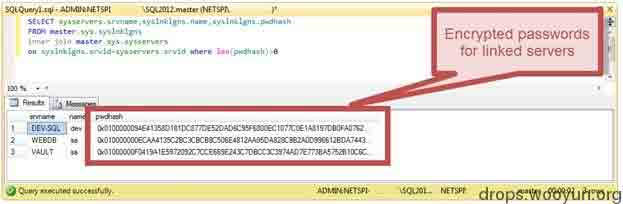
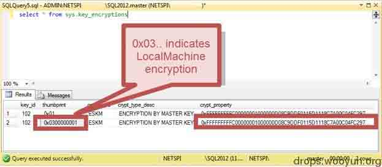
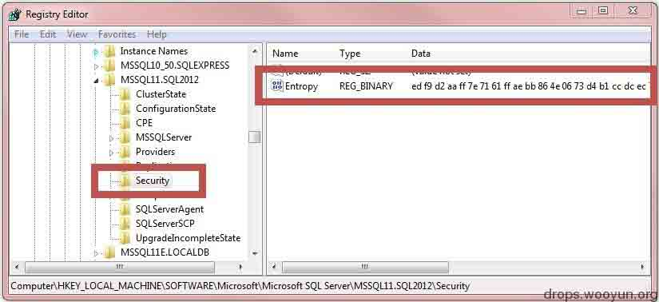
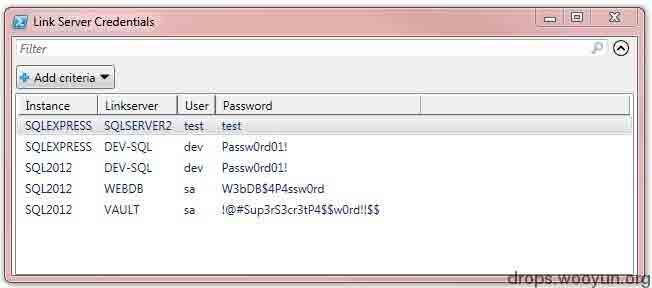
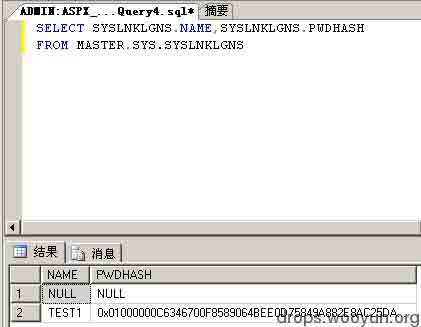
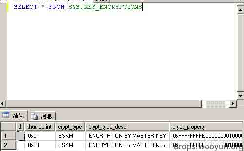
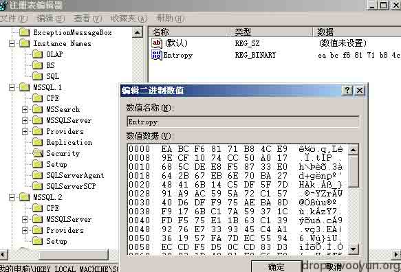
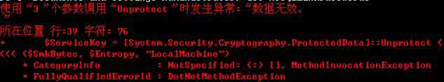

# 解密 MSSQL 链接数据库的密码

2014/03/14 12:00 | [wefgod](http://drops.wooyun.org/author/wefgod "由 wefgod 发布") | [技术分享](http://drops.wooyun.org/category/tips "查看 技术分享 中的全部文章") | 占个座先 | 捐赠作者

## 0x00 背景

* * *

from:[`www.netspi.com/blog/entryid/221/decrypting-mssql-database-link-server-passwords`](https://www.netspi.com/blog/entryid/221/decrypting-mssql-database-link-server-passwords)

建议在看之前先了解下什么是 linked server。比如参考微软的相关学习资料：

[`technet.microsoft.com/zh-cn/library/ms188279.aspx`](http://technet.microsoft.com/zh-cn/library/ms188279.aspx)

文章很多专有名词，而且老外说话的方式和中国的差别还是太大了点……所以有很多地方翻译的不是很好，见谅。

从重要系统中获取明文密码的过程总是充满着乐趣。MSSQL 服务器对本地保存的密码是进行了加密操作的，链接服务器的相关凭证也不例外，但与此同时 MSSQL 也是有自己的手段可以对相关的密码凭证进行解密。而你可以直接参考使用本文发布的 Powershell 脚本对相关的凭证进行解密。以进攻者的角度来看，如果想要解密相关的凭证，我们需要有 MSSQL 的 Sysadmin 权限和本地服务器系统管理员的权限。从防御的层面来看，这篇文章的目的主要是想提醒下相关的管理员，不必要的数据库链接、高权限数据库链接和使用 SQL server 的身份认证会比使用集成的身份认证产生更多不必要的风险。这篇博文推荐给对数据库感兴趣的黑客及打算深入学习的管理员们。

## 0x01 链接服务器

* * *

Microsoft SQL Server 允许用户使用 MSSQL 管理其它不同类型的数据库，一般情况下链接服务器用来管理与本地不同版本的 MSSQL 服务。当链接建立之后，它们可以被配置为使用安全的上下文和静态 sql server 凭据。如果 sql server 的凭据被添加使用了，相关的用户名和密码会被加密存储到相关的表内，而这一加密是可逆的。单向不可逆的 hash 是不可以用于链接服务器的，因为 sql server 必须要使用明文的密码信息去访问其它的数据库。所以，如果密码信息是使用了对称加密而不是单向 hash 的话，sql server 自然会有方法去解密相关的密文凭证。本文主要介绍这一加密、解密的过程及其工具化的实现。

## 0x02 链接服务器的密码存储方式

* * *

MSSQL 将链接服务器的信息（包含加密的密码）保存在 master.sys.syslnklgns 表中。我们重点关注的加密密码是保存在字段“pwdhash”中的（虽然写着 hash 但是他不是一个普通的 hash），下图是一个例子：



master.sys.syslnklgns 表在正常的数据库连接情况下是无法访问的，必须在专用管理员连接（DAC）下才可以访问（更多关于 DAC 的信息请查看[`technet.microsoft.com/en-us/library/ms178068%28v=sql.105%29.aspx`](http://technet.microsoft.com/en-us/library/ms178068%28v=sql.105%29.aspx)）。打开专用管理员连接有两个条件：一是需要有 mssql 的 Sysadmin 权限，二是本地服务器的管理员权限。

如果本地管理员没有获得 Sysadmin 的权限，你只需要将 MSSQL 权限修改为本地系统账户即可。更多信息请参考[`www.netspi.com/blog/entryid/133/sql-server-local-authorization-bypass`](https://www.netspi.com/blog/entryid/133/sql-server-local-authorization-bypass)

## 0x03 MSSQL 加密

* * *

下面介绍一些 MSSQL 加密的基本原理。首先我们可以先了解一下服务主密钥（SMK）（更多信息请参考[`technet.microsoft.com/en-us/library/ms189060.aspx`](http://technet.microsoft.com/en-us/library/ms189060.aspx)）。根据微软的描述“服务主密钥为 SQL Server 加密层次结构的根。

服务主密钥是首次需要它来加密其他密钥时自动生成的”可知 SMK 保存在 master.sys.key_encryptions 表中，而他的 key_id 对应的值是 102。SMK 是使用 DPAPI 来加密的，而这里他有两个可用的版本，第一种是使用的 LocalMachine 加密，另一种是 CurrentUser 的相关上下文（意思是 SQL Server 服务运行的账户）。这里我们挑使用 LocalMachine 的 Machinekey 来单独加密的、解密时不依赖于 SQL Server 账户的格式来讨论。下面是一个例子：



为了增强加密的强度，算法中会加入熵（密码学用语，可自行查阅），不过算法中使用到的熵字节我们可以从注册表`HKLM:\SOFTWARE\Microsoft\Microsoft SQL Server\[instancename]\Security\Entropy`中找到。再次提醒，访问此表项需要本地系统的管理员权限。下图是熵的一个例子：



搞定上面这些之后（同时必须去除填充字节等）我们就可以使用 DPAPI 来解密 SMK 了。

## 0x04 解密链接服务器的密码

* * *

从 SMK 的长度（或 MSSQL 的版本）我们可以看出两种不同的加密算法：MSSQL 2012 使用的是 AES，而早期的版本使用的是 3DES。另外，pwdhash 必须解析为 bit 才可以找到相关的加密密码。版本使用的算法参考了高级 T-SQL 程序员发布的文章，见[`stackoverflow.com/questions/2822592/how-to-get-compatibility-between-c-sharp-and-sql2k8-aes-encryption`](http://stackoverflow.com/questions/2822592/how-to-get-compatibility-between-c-sharp-and-sql2k8-aes-encryption)

即使数据的格式和文章内给出的不太一致，但是也并不难发现正确的加密数据。到此，我们已经有办法使用 SMK 解密出所有的明文凭证了（当使用的是 SQL Server 账户而不是 windows 身份认证）。

## 0x05 使用脚本解密链接服务器的密码

* * *

下面给出 powershell 的自动解密脚本 Get-MSSQLLinkPasswords.psm1 的源码链接（译者提示：该脚本必须在 powershell2.0 下运行）：

[`github.com/NetSPI/Powershell-Modules/blob/master/Get-MSSQLLinkPasswords.psm1`](https://github.com/NetSPI/Powershell-Modules/blob/master/Get-MSSQLLinkPasswords.psm1)

该脚本必须在 MSSQL 服务器本地运行（DPAPI 必须可以访问到 local machine key），同时运行该脚本的用户必须有数据库的 sysadmin 权限（在 DAC 下）可以访问所有的数据库实例，而且该账户也必须拥有系统管理器权限（用于读取注册表内的熵）。另外，如果启用了 UAC，脚本必须以管理员身份运行。下面几个是脚本运行的关键步骤概要：

```
1\. 获取本服务器所有 MSSQL 的实例
2\. 为每个实例打开 DAC 访问
3\. 获取每个实例的 pwdhash 字段值
4\. 从 master.sys.key_encryptions 表中读取出所有 key_id 值为 102 的行所对应的 SMK，并根据 thumbprint 字段来判断其版本
5\. 读取 HKLM:\SOFTWARE\Microsoft\Microsoft SQL Server\[instancename]\Security\Entropy 中的熵
6\. 使用以上信息解密 SMK
7\. 程序根据 MSSQL 的版本和 SMK 的长度来确定使用 AES 算法或 3DES 算法
8\. 使用 SMK 明文去解密链接服务器的凭证
9\. 若程序运行成功则会回显相关的密码信息，比如下图就是一个例子： 
```



## 0x06 译者自测

* * *

在测试这个的过程中很多问题的产生，要不是 DAC 登录不上，就是 powershell 的脚本一直有问题。

目前测试了两个环境：

```
1\. win2003 + mssql2005
2\. win2008 + mssql2008 
```

除了脚本有问题，其它都是可以获取到的。脚本大部分语法是类似.NET 的，基本都是在调用.NET 的库，由于一些时间问题，我就不再献丑去改了等大牛们来一个“一键获取”。

先看点 2003 的测试图：

1.pwdhash



2.读取加密的 SMK



3.查看注册表 key



但是在运行脚本的时候（注意要 2.0 以上）还是报错了：



已经测试过两个参数都非空，而且应该是正确的。

在 2008 下也是类似的情况。时间关系不再深入，等有兴趣的牛牛们再搞搞。

另外，这也是一种“找数据库连接信息”的方法。虽然有点奇葩，但是预计还是可行的，以后如果可以安排得过来，而且没有大牛修改上面的脚本的话……我再来献丑。

第一次搞翻译，翻译的不好大家多多原谅。

版权声明：未经授权禁止转载 [wefgod](http://drops.wooyun.org/author/wefgod "由 wefgod 发布")@[乌云知识库](http://drops.wooyun.org)

分享到：

### 相关日志

*   [sqlmap 用户手册](http://drops.wooyun.org/tips/143)
*   [SQLMAP 实例 COOKBOOK](http://drops.wooyun.org/tips/1343)
*   [False SQL Injection and Advanced Blind SQL Injection](http://drops.wooyun.org/tips/4322)
*   [SQL SERVER 2008 安全配置](http://drops.wooyun.org/tips/1670)
*   [python 脚本处理伪静态注入](http://drops.wooyun.org/tips/125)
*   [2014 年澳大利亚信息安全挑战 CySCA CTF 官方 write up Web 篇](http://drops.wooyun.org/tips/2444)