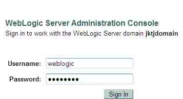
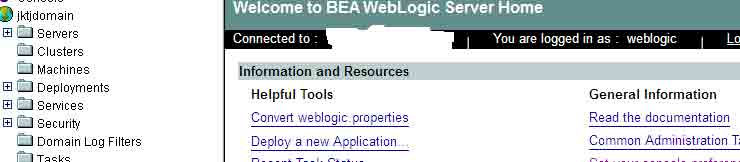
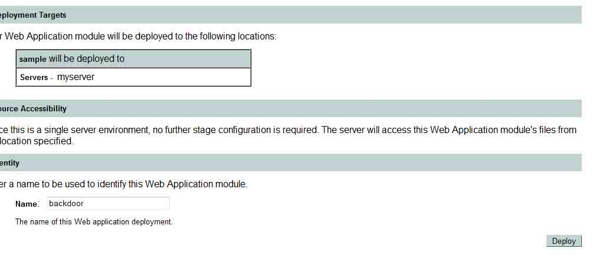
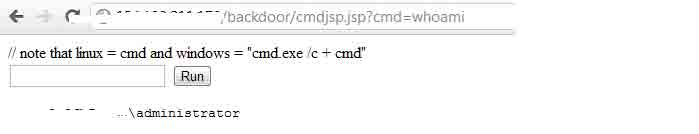
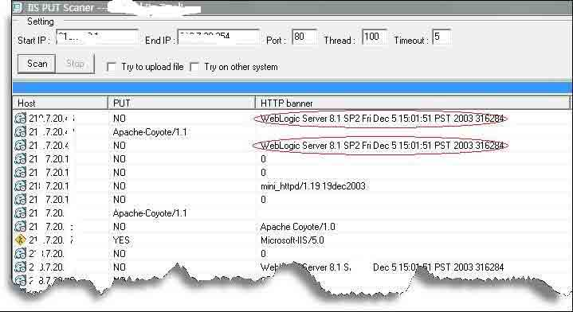

# Hacking weblogic

2013/08/01 17:16 | [瞌睡龙](http://drops.wooyun.org/author/瞌睡龙 "由 瞌睡龙 发布") | [web 安全](http://drops.wooyun.org/category/web "查看 web 安全 中的全部文章"), [技术分享](http://drops.wooyun.org/category/tips "查看 技术分享 中的全部文章") | 占个座先 | 捐赠作者

From [Hacking-weblogic-sysmox.com.pdf](http://sysmox.com/blog/wp-content/uploads/2011/10/Hacking-weblogic-sysmox.com_.pdf)

## 0x00 简介

* * *

此篇文章介绍攻击者如何利用默认密码对 weblogic 攻击。

### Weblogic

WebLogic 是美国 bea 公司出品的一个 application server 确切的说是一个基于 Javaee 架构的中间件，BEA WebLogic 是用于开发、集成、部署和管理大型分布式 Web 应用、网络应用和数据库应用的 Java 应用服务器。将 Java 的动态功能和 Java Enterprise 标准的安全性引入大型网络应用的开发、集成、部署和管理之中。

## 0x01 安装

* * *

有很多的 weblogic 服务器安装时采用默认密码。

这样会使攻击者很容易进入 weblogic 控制台获取相应权限。

默认的 WebLogic 管理员账号密码是

weblogic:weblogic

WebLogic 的默认密码是 7001

Http://localhost:7001/console

下面列举了一些 weblogic 默认密码列表：

[`cirt.net/passwords?criteria=weblogic`](http://cirt.net/passwords?criteria=weblogic)



进入控制台界面：



## 0x02 Web 应用

* * *

在控制台部署一个 Web 应用的方法：

```
Deploy => web application modules => Deploy a new Web Application Module... =>upload your file(s) => Deploy 
```

Web 应用中包含的模块：

必须要有一个 servlet 或者 JSP 一个 web.xml 文件，它包含有关 Web 应用程序的信息 可以有一个 weblogic.xml 文件，包含了 WebLogic 服务器的 web 应用元素。

### 部署

攻击者上传一个 backdoor.war



### weblogic 后门

例子：



寻找 weblogic 服务器可以有很多的方法



乌云上的实例：

[WooYun: 广东省社会保险基金管理局网站弱口令问题](http://www.wooyun.org/bugs/wooyun-2012-05295)

[WooYun: 江苏省财政厅弱口令](http://www.wooyun.org/bugs/wooyun-2012-06733)

## 0x03 weblogic 安全配置

* * *

[`download.oracle.com/docs/cd/E12890_01/ales/docs32/integrateappenviron/configWLS.html#wp1099454`](http://download.oracle.com/docs/cd/E12890_01/ales/docs32/integrateappenviron/configWLS.html#wp1099454)

**Tags:** [Weblogic](http://drops.wooyun.org/tag/weblogic)

版权声明：未经授权禁止转载 [瞌睡龙](http://drops.wooyun.org/author/瞌睡龙 "由 瞌睡龙 发布")@[乌云知识库](http://drops.wooyun.org)

分享到：碎银子打赏，作者好攒钱娶媳妇：


### 相关日志

*   [解密 JBoss 和 Weblogic 数据源连接字符串和控制台密码](http://drops.wooyun.org/tips/349)
*   [攻击 JavaWeb 应用[7]-Server 篇[1]](http://drops.wooyun.org/tips/604)
*   [URL Hacking – 前端猥琐流](http://drops.wooyun.org/tips/750)
*   [webgame 中常见安全问题、防御方式与挽救措施](http://drops.wooyun.org/papers/2677)
*   [PHP 绕过 open_basedir 列目录的研究](http://drops.wooyun.org/tips/3978)
*   [hackyou2014 CTF web 关卡通关攻略](http://drops.wooyun.org/tips/870)