# charles 使用教程指南

2014/06/21 15:51 | [px1624](http://drops.wooyun.org/author/px1624 "由 px1624 发布") | [工具收集](http://drops.wooyun.org/category/tools "查看 工具收集 中的全部文章"), [技术分享](http://drops.wooyun.org/category/tips "查看 技术分享 中的全部文章") | 占个座先 | 捐赠作者

## 0x01 前言：

* * *

Charles 是一款抓包修改工具，相比起 burp，charles 具有界面简单直观，易于上手，数据请求控制容易，修改简单，抓取数据的开始暂停方便等等优势！下面来详细介绍下这款强大好用的抓包工具。

## 0x02 下载与安装

* * *

首先是工具下载和安装 首先需要下载 java 的运行环境支持（一般用 burp 的人肯定也都有装 java 环境）。装好 java 环境后，可以直接去百度搜索并下载 charles 的破解版，下载到破解版之后，里面一般会有注册的 jar 文件，然后注册后就可以永久使用了（ps：不注册的话，每次使用 30 分钟，工具就会自动关闭）。

## 0x03 PC 端抓包

* * *

下面是 pc 端的抓包使用情况 Charles 支持抓去 http、https 协议的请求，不支持 socket。

然后 charles 会自动配置 IE 浏览器和工具的代理设置，所以说打开工具直接就已经是抓包状态了。 这里打开百度抓包下，工具界面和相关基础功能如下图所示：

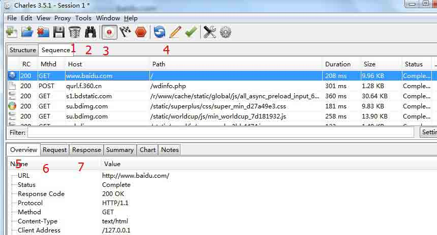

上图中的 7 个位置是最常用的几个功能。

1 那个垃圾桶图标，功能是 clear，清理掉所有请求显示信息。

2 那个望远镜图标，功能是搜索关键字，也可以使用 ctrl+f 实现，可以设置搜索的范围。

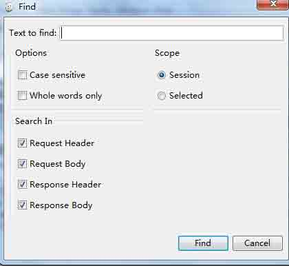

3 圆圈中间红点的图标，功能是领抓去的数据显示或者不显示的设置。 这个本人认为是 charles 工具很方便的一个两点，一般都使其为不显示抓去状态，只有当自己测试的时候的前后，在令其为抓取并显示状态。这样可以快准狠的获取到相关自己想要的信息，而不必在一堆数据请求中去寻找。

4 编辑修改功能，可以编辑修改任意请求信息，修改完毕后点击 Execute 就可以发送一个修改后的请求数据包。

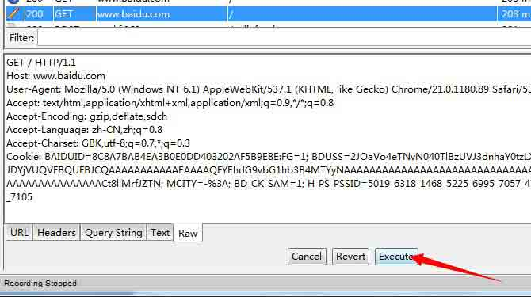

5 抓取的数据包的请求地址的 url 信息显示。

6 抓取的数据包的请求内容的信息显示。

post 请求可以显示 form 形式，直观明了。

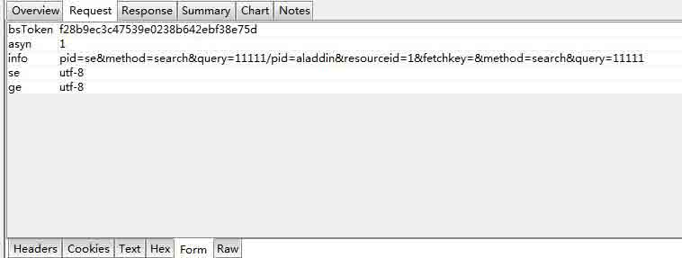

7 返回数据内容信息的显示。

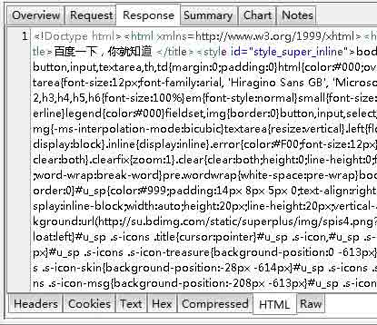

其中 5、6、7 中都有各种形式的数据显示形式，其中 raw 是原始数据包的状态。

## 0x04 显示模式

* * *

charles 抓包的显示，支持两种模式，Structure 和 Sequence，其优点分别如下。

Structure 形式如下图 优点：可以很清晰的看到请求的数据结构，而且是以域名划分请求信息的，可以很清晰的去分析和处理数据。

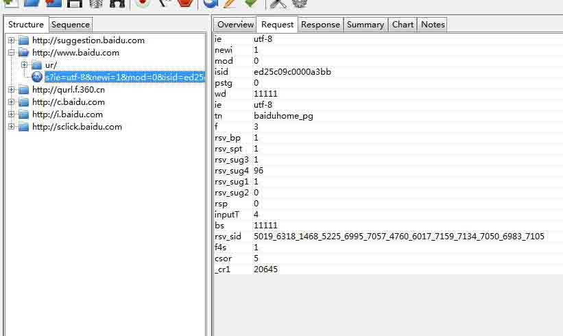

Sequence 形式如下图 优点：可以很清晰的看到全部请求，不用一层一层的去点开，这里是以数据请求的顺序去执行的，也就是说那个请求快就在前面显示。

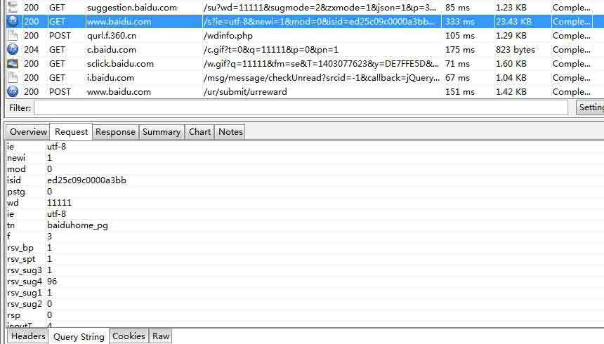

具体要说两种形式哪个更好，这个就是见仁见智了。本人比较喜欢第二种，粗矿豪放！

## 0x05 移动 APP 抓包

* * *

这里相比其他抓包软件来说要简单的多了，具体步骤如下：

1 使手机和电脑在一个局域网内，不一定非要是一个 ip 段，只要是同一个漏油器下就可以了，比如电脑连接的有线网 ip 为 192.168.16.12，然后手机链接的 wifi ip 为 192.168.1.103，但是这个有线网和无线网的最终都是来自于一个外部 ip，这样的话也是可以的。

2 下面说说具体配置，这里电脑端是不用做任何配置的，但是需要把防火墙关掉（这点很重要）！

然后 charles 设置需要设置下允许接收的 ip 地址的范围。 设置首先要进入这个位置 Proxy - Access Control Settings 然后如果接收的 ip 范围是 192.168.1.xxx 的话，那么就添加并设置成 192.168.1.0/24 如果全部范围都接收的话，那么就直接设置成 0.0.0.0/0

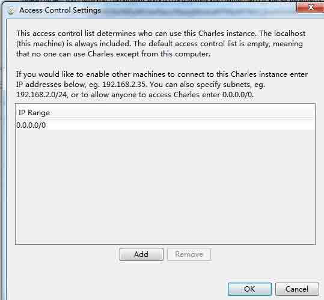

然后如果勾选了 Proxy - Windows Proxy 的话，那么就会将电脑上的抓包请求也抓取到，如果只抓手机的话，可以将这个设置为不勾选。

3 接下来下面是手机端的配置

首先利用 cmd - ipconfig 命令查看自己电脑的 ip 地址

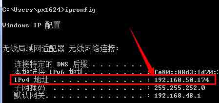

然后在手机端的 wifi 代理设置那里去进行相关的配置设置。

这里的代理服务器地址填写为电脑的 ip 地址，然后端口这里写 8888（这个是 charles 的默认设置），如果自己修改了就写成自己所修改的端口就可以了。

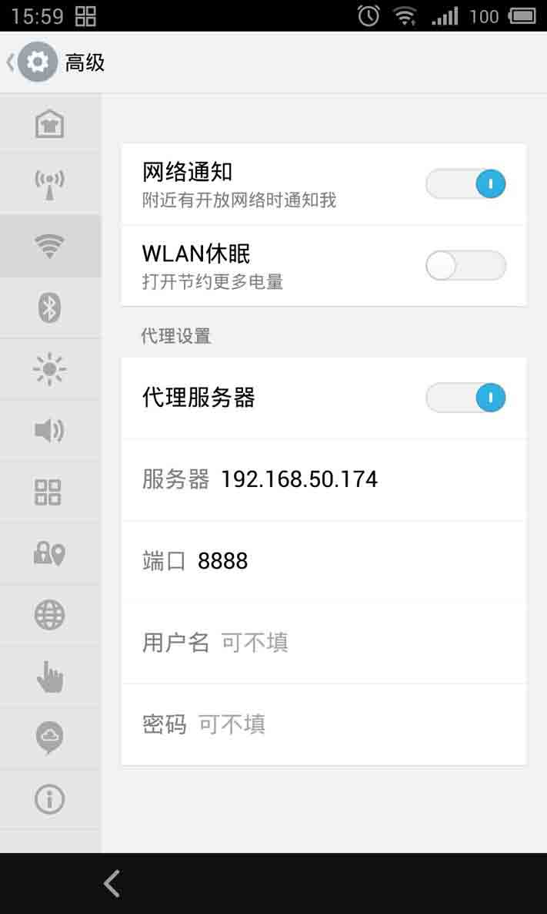

4 好了，这样就配置完成就大功告成了！下面打开 UC 浏览器或者其他东西，随便访问个网页看有没有抓取到数据就可以了（我这里是直接访问的新浪新闻首页）。

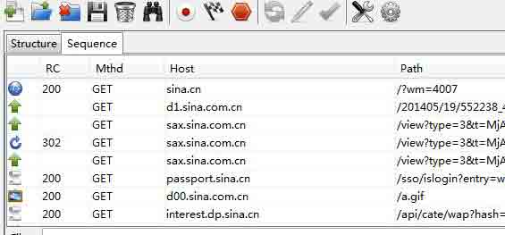

## 0x06 其他常用功能

* * *

相信上面介绍的那些你已经学会了吧，下面再说说 charles 的一些其他常用的功能

选择请求后，右键可以看到一些常用的功能，这里说说 Repeat 就是重复发包一次。 然后 Advanced Repeat 就是重复发包多次，这个功能用来测试短信轰炸漏洞很方便。

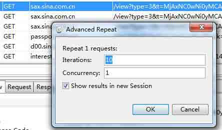

还有比如说修改 referer 测试 CSRF 漏洞，修改 form 内容测试 XSS，修改关键的参数测试越权，修改 url、form、cookie 等信息测试注入等，都非常方便。

好了，这款工具的介绍就到这里了，相信这款方便好用的工具，以后肯定会被更多的人使用到的。

## 0x07 charles 使用问题汇总

* * *

Charles 是一款很好用的抓包修改工具，但是如果你不是很熟悉这个工具的话，肯定会遇到各种感觉很莫名其妙的状况，这里就来帮你一一解答。

1 为什么下载了不能用啊？打不开啊。

因为 charles 是需要 java 环境才能运行的，需要先安装 java 环境才可以。

2 为什么我用着用着就自动关闭了？大概 30 分钟就会关闭一次。

因为 charles 如果没有注册的话，每次打开后就只能哟个 30 分钟，然后就会自动关闭，所以最好在使用前先按照说明去进行工具的注册操作。

3 为什么我在操作的时候有时候就直接工具就界面卡住死了，关都关不掉，只能用任务管理器才可以关掉？

这个的确是 charles 这个工具的一个 bug，开始用的时候，我也很恶心，而且经常悲剧，但是现在也有相应的解决办法了，下面那样操作就可以了。

首先随便抓些包，要求有图片的请求。

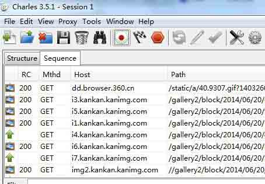

然后选中一个图片的请求，然后分别点击 Response - Raw 然后那里会加载其中的内容，然后加载完毕后，再去随便操作就可以了，就不会在悲剧的直接工具卡死掉了。。。

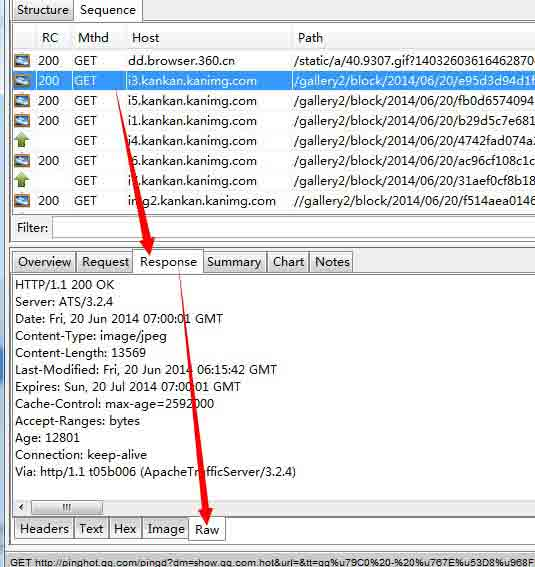

4 为什么用了 charles 后，我就上不了网页了，但是 qq 可以。

因为如果 charles 是非正常状态下关闭的话，那么 IE 的代理就不会被自动取消，所以会导致这种情况。

解决办法：

第一种：直接打开 charles，然后再正常关闭即可。 第二种：去将 IE 浏览器代理位置的勾选去掉。

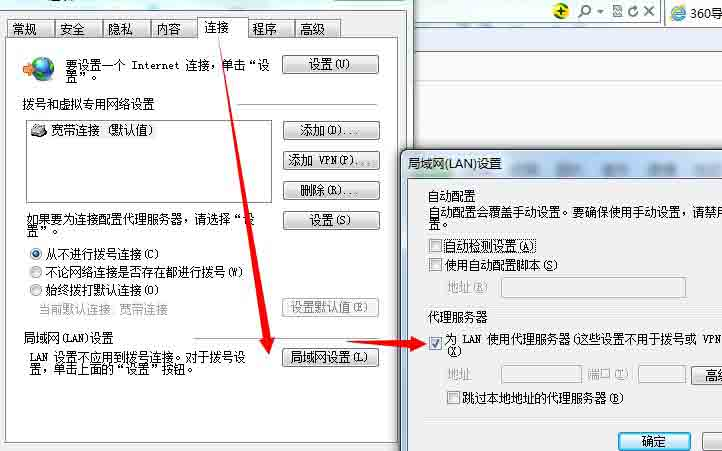

5 为什么我用 charles 不能抓到 socket 和 https 的数据呢？

首先，charles 是不支持抓去 socket 数据的。 然后，如果抓不到 https 的数据的话，请查看你是不是没有勾选 ssl 功能。 Proxy - Proxy Settings - SSL 设置

6 为什么我用 charles 抓取手机 APP，什么都是配置正确的，但是却抓不到数据。

首先，请确保电脑的防火墙是关闭状态，这个很重要。

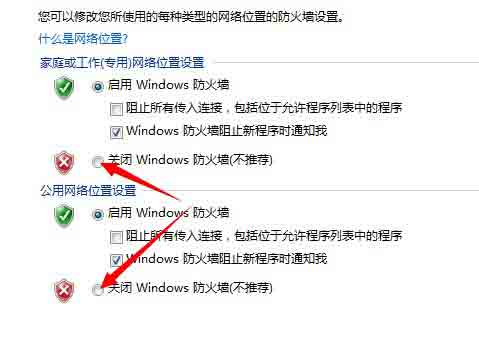

如果，防火墙关了还是不行，那么请把手机 wifi 断掉后重新连接，这样一般就可以解决问题了。 如果以上方法还是不行的话，那么请将手机 wifi 位置的 ip 地址设置成静态 ip，然后重启 charles 工具。

7 抓包后发现 form 中有些数据显示是乱码怎么办？

请在 Raw 模式下查看，Raw 模式显示的是原始数据包，一般不会因为编码问题导致显示为乱码。

8 我用 charles 抓手机 app 的数据，但是同时也会抓去到电脑端的数据，可以设置吗？

可以，设置位置在 Proxy - Windows Proxy ，勾选表示接收电脑的数据抓包，如果只想抓去 APP 的数据请求，可以不勾选此功能。

9 为什么我用 IE 可以抓到数据，但是用 360 或者谷歌浏览器就不行？

请确保 360 或者谷歌的代码设置中是不是勾选设置的是 使用 IE 代理。

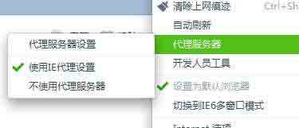

10 想要复制粘贴某些数据的话，怎么办，右键没有相应功能啊？

请直接使用 Ctrl +C 和 Ctrl+V 即可。

以上就是 charles 在使用过程中常见的 10 中问题和相应的解决情况，有了这个文章，大家就不用在遇到问题的时候懊恼了，嘿嘿。

版权声明：未经授权禁止转载 [px1624](http://drops.wooyun.org/author/px1624 "由 px1624 发布")@[乌云知识库](http://drops.wooyun.org)

分享到：

### 相关日志

*   [得到内网域管理员的 5 种常见方法](http://drops.wooyun.org/tips/646)
*   [Burp Suite 使用介绍（三）](http://drops.wooyun.org/tips/2247)
*   [Shodan 搜索引擎介绍](http://drops.wooyun.org/tips/2469)
*   [mitmproxy 中 libmproxy 简单介绍](http://drops.wooyun.org/tips/2943)
*   [metasploit 渗透测试笔记(内网渗透篇)](http://drops.wooyun.org/tips/2746)
*   [跑 wordpress 用户密码脚本](http://drops.wooyun.org/tools/601)