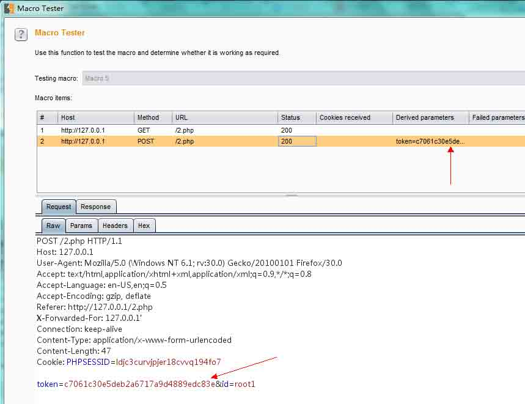
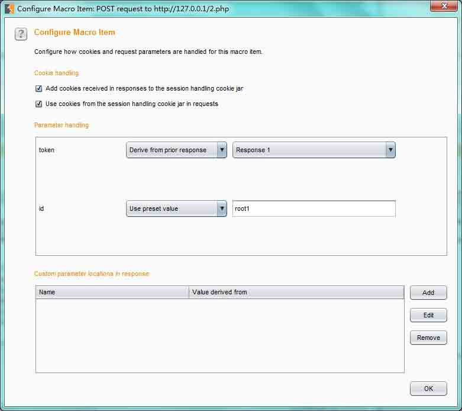
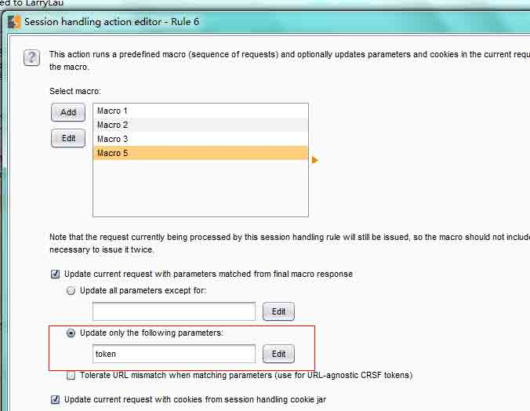
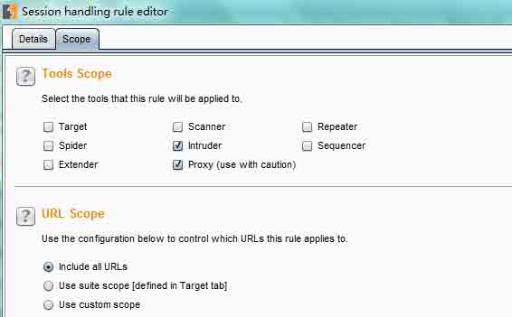
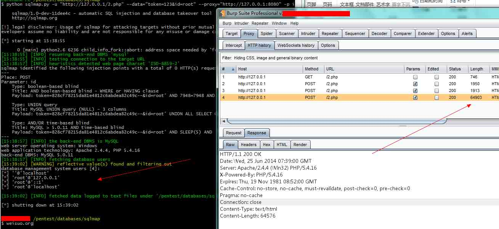

# 用 Burpsuite 来处理 csrf token

2014/06/28 12:15 | [c4bbage](http://drops.wooyun.org/author/c4bbage "由 c4bbage 发布") | [工具收集](http://drops.wooyun.org/category/tools "查看 工具收集 中的全部文章"), [技术分享](http://drops.wooyun.org/category/tips "查看 技术分享 中的全部文章") | 占个座先 | 捐赠作者

from: http://labs.asteriskinfosec.com.au/fuzzing-and-sqlmap-inside-csrf-protected-locations-part-1/

http://labs.asteriskinfosec.com.au/fuzzing-and-sqlmap-inside-csrf-protected-locations-part-2/

* * *

问题：http://drops.wooyun.org/tips/2444

附加其他案例(--eval): [`gist.github.com/McSimp/2602fd7ee7203e34268b`](https://gist.github.com/McSimp/2602fd7ee7203e34268b)

当在测试某些网站注入时我们会遇到 token，只能手工或者写工具之后进行自动化处理,就 sqlmap 和 burpsuite 而言各有各的方法。

### Sqlmap 如下：

```
CGY@Hank-PC /pentest/databases/sqlmap
$ python sqlmap.py -u "http://192.168.83.117/2.php" --data="token=123&id=root" --eval="import urllib2;import re;a=urllib2.build_opener();a.addheaders.append(('Cookie', 'PHPSESSID=72u0q0sem6tbnrqq4bmqs4an05'));token=re.search(r'\w{32}',a.open('http://192.168.83.117/2.php').read()).group(0);print token;" -p id --dbs --cookie="PHPSESSID=72u0q0sem6tbnrqq4bmqs4an05" --current-user 
```

### Burpsuite 如下：

在 burpsuite 里提供了一个 session handler 机制，可以让我们更好的去自动化处理这些。 事例代码如下：

```
<?php
/*
* PHP 简单利用 token 防止表单重复提交
* 此处理方法纯粹是为了给初学者参考
*/
session_start();
var_dump($_REQUEST);
function set_token() {
    $_SESSION['token'] = md5(microtime(true));
}

function valid_token() {
    $return = $_REQUEST['token'] === $_SESSION['token'] ? true : false;
    set_token();
    return $return;
}

//如果 token 为空则生成一个 token
if(!isset($_SESSION['token']) || $_SESSION['token']=='') {
    set_token();
}

error_reporting(E_USER_ERROR | E_USER_WARNING | E_USER_NOTICE);
@mysql_connect("127.0.0.1".':'."3306",root,'123')
or die("数据库服务器连接失败");   
@mysql_select_db('mysql')
or die("数据库不存在或不可用");

if(isset($_POST['id'])){
    if(!valid_token()){
        echo "token error";
    }else{
        //echo '成功提交，Value:'.$_POST['test'];
        $id=$_REQUEST[id];
        $sql='select user,password,host from mysql.user where user='."'".$id."'".' limit 0,1;';
        echo $sql;
        mysql_query('$sql');
        $set_result = mysql_query($sql); 
        while($row =mysql_fetch_array($set_result)){
            $result[]=$row;
        }
        var_dump($result);
    }
}
//echo "SESSION ".$_SESSION['token'];
?>
<form method="post" action="">
    <input type="hidden" name="token" value="<?php echo $_SESSION['token']?>">
    <input type="text" name="id" value="root">
    <input type="submit" value="提交" />
</form>

```

在 options 栏目的 sessions 标签里 添加 session handling rules，调出 session handling rule editor：rule description 规则的描述；rule actions 规则的主体部分。 在 rule actions 添加 run a macro 类型的调用，调出 session handling action editor ，选择 select macro 下的 add ，用于添加 macro ,出现两个对话框： macro editor 和 macro recorder ，前者是用于 macro 的分析和设定，后者对于请求的一个录制。 在 macro recoder 里 设定 intercept is off (右上角位置)，切换到浏览器 先请求一次 127.0.0.1/2.php 之后对于表单内容进行提交。切到 macro recorder 里，用 ctrl 选中这两次请求，点击 OK 。就此回到了 macro editor 窗口，点击 test macro 观看请求和响应数据包中的 token 是否正确。 

如果不正确，单击分析 re-analyze macro 或者选择 configure item 进行修正，如下图。 

Macro Editor 配置完之后，窗口回到了 session handling action editor。 在 sqlmap->burpproxy 测试时， marco 会把我的 id 参数只指定为 root1（marco 录制时 id 指定的是 root1,至于这样的原因有待测试），不会发送我的 payload，而在 intruder 则不出现此问题 。设置只替换 token 参数即可,设置如下图：



在 select macro 里选定刚才录制的 macro，确定。回到 session hand rule editor ，在其子标签 scope 里，：设置作用域（根据自己的实际情况再定）：



运行结果如下:



版权声明：未经授权禁止转载 [c4bbage](http://drops.wooyun.org/author/c4bbage "由 c4bbage 发布")@[乌云知识库](http://drops.wooyun.org)

分享到：

### 相关日志

*   [跑 wordpress 用户密码脚本](http://drops.wooyun.org/tools/601)
*   [Burp Suite 使用介绍（四）](http://drops.wooyun.org/tips/2504)
*   [python 脚本处理伪静态注入](http://drops.wooyun.org/tips/125)
*   [从内存中窃取未加密的 SSH-agent 密钥](http://drops.wooyun.org/tips/2719)
*   [说说 RCE 那些事儿](http://drops.wooyun.org/tools/3786)
*   [False SQL Injection and Advanced Blind SQL Injection](http://drops.wooyun.org/tips/4322)