# NMAP 基础教程

2014/05/18 15:50 | [he1renyagao](http://drops.wooyun.org/author/he1renyagao "由 he1renyagao 发布") | [技术分享](http://drops.wooyun.org/category/tips "查看 技术分享 中的全部文章") | 占个座先 | 捐赠作者

原文地址：http://infotechbits.wordpress.com/2014/05/04/introduction-to-basic-nmap/

## 0x00 nmap 介绍

* * *

Nmap  （网络映射器）是由 Gordon Lyon 设计，用来探测计算机网络上的主机和服务的一种安全扫描器。为了绘制网络拓扑图，Nmap 的发送特制的数据包到目标主机，然后对返回数据包进行分析。Nmap 是一款枚举和测试网络的强大工具。

Nmap 特点：

```
主机探测：探测网络上的主机，例如列出响应 TCP 和 ICMP 请求、icmp 请求、开放特别端口的主机。 
端口扫描：探测目标主机所开放的端口。 
版本检测：探测目标主机的网络服务，判断其服务名称及版本号。 
系统检测：探测目标主机的操作系统及网络设备的硬件特性。 
支持探测脚本的编写：使用 Nmap 的脚本引擎（NSE）和 Lua 编程语言。 
```

Nmap 能扫描出目标的详细信息包括、DNS 反解、设备类型和 mac 地址。

(DNS 反解详情移步[`www.debouncer.com/reverse-dns-check`](http://www.debouncer.com/reverse-dns-check))

## 0x01 Nmap 典型用途：

* * *

```
1、通过对设备或者防火墙的探测来审计它的安全性。 
2、探测目标主机所开放的端口。 
3、网络存储，网络映射，维护和资产管理。（这个有待深入） 
4、通过识别新的服务器审计网络的安全性。 
5、探测网络上的主机。 
```

## 0x02 nmap 安装

* * *

nmap 可以到[`nmap.org/download.html`](http://nmap.org/download.html)下载最新版本


Nmap 安装、根据提示向导，下一步、下一步进行安装。

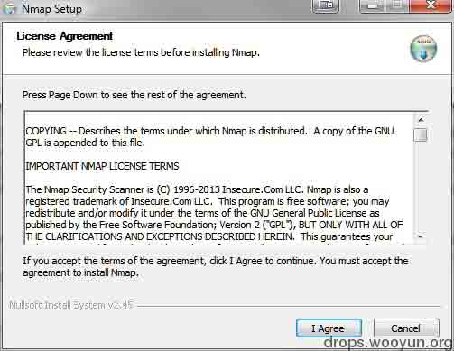

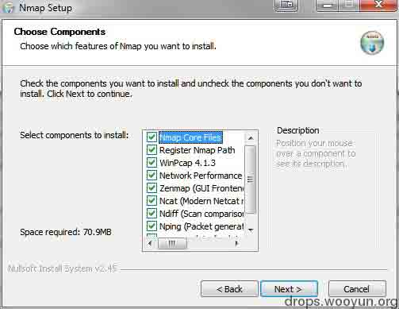

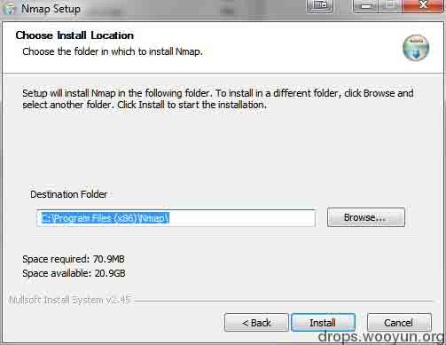


进入命令提示符（cmd），输入 nmap，可以看到 nmap 的帮助信息，说明安装成功。

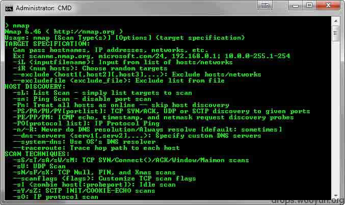

## 0x03 nmap 命令操作

* * *

注意：请自己通过各种设备来搭建模拟实际的网络环境（如虚拟机，手机等设备），请在道德和法律的允许下进行测试。不然你懂的。

### 1、Nmap 简单扫描

Nmap 默认发送一个 arp 的 ping 数据包，来探测目标主机在 1-10000 范围内所开放的端口。

命令语法：

```
nmap <target ip address> 

```

解释：Target ip address 为你目标主机的 ip 地址

例子：

```
nmap 10.1.1.254

```

效果：

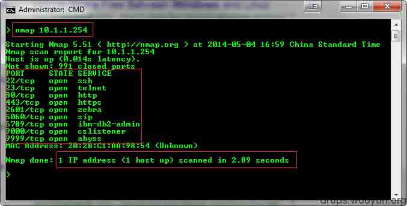

### 2、Nmap 简单扫描，并对返回的结果详细描述输出。

命令语法：

```
nmap -vv 10.1.1.254 

```

介绍：-vv 参数设置对结果的详细输出。

例子：

```
nmap -vv 10.1.1.254  

```

效果：

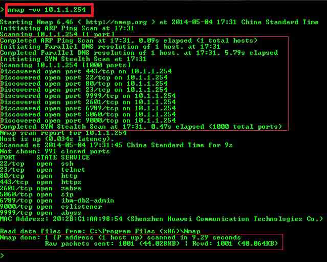

### 3、nmap 自定义扫描

nmap 默认扫描目标 1-10000 范围内的端口号。我们则可以通过参数-p 来设置我们将要扫描的端口号。

命令语法：

```
nmap -p(range) <target IP>  

```

解释：（rangge）为要扫描的端口（范围），端口大小不能超过 65535，Target ip  为目标 ip 地址

例子：扫描目标主机 1-50 号端口：

效果：

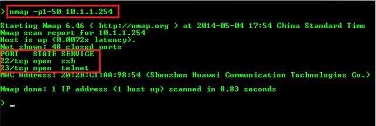

例子：扫描目标主机 1-100 号端口：

效果：

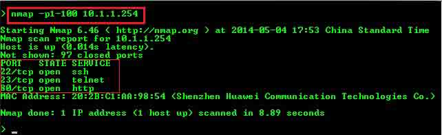

例子：扫描目标主机 50-500 号端口：

效果：

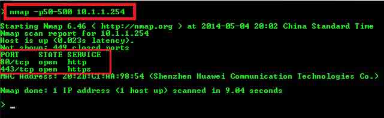

### 4、nmap 指定端口扫描

有时不想对所有端口进行探测，只想对 80,443,1000,65534 这几个特殊的端口进行扫描，我们还可以利用参数 p 进行配置。

命令语法：

```
nmap -p(port1,port2,port3,...) <target ip> 

```

例子：

```
nmap -p80,443,22,21,8080,25,53 10.1.1.254  

```

效果：

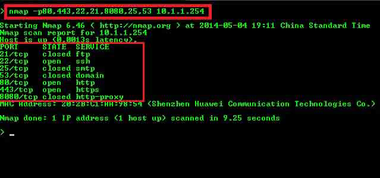

### 5、nmap ping 扫描

nmap 可以利用类似 window/linux 系统下的 ping 方式进行扫描。

命令语法：

```
nmap -sP <target ip> 

```

解释：sP 设置扫描方式为 ping 扫描

例子：

```
nmap -sP 10.1.1.254 

```

效果：

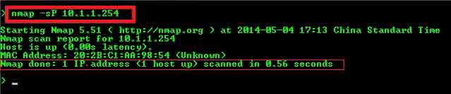

6、nmap 路由跟踪

路由器追踪功能，能够帮网络管理员了解网络通行情况，同时也是网络管理人员很好的辅助工具！通过路由器追踪可以轻松的查处从我们电脑所在地到目标地之间所经常的网络节点，并可以看到通过各个节点所花费的时间（百度百科）

命令语法:

```
nmap --traceroute <target ip> 

```

例子：

```
nmap --traceroute 8.8.8.8 (google dns 服务器 ip)  

```

效果：

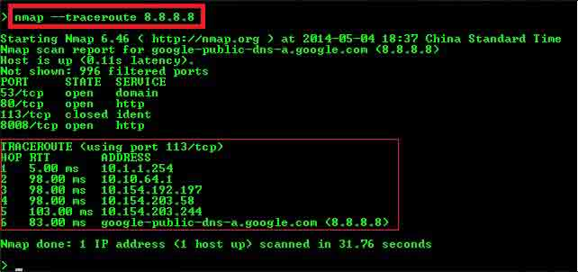

### 7、nmap 还可以设置扫描一个网段下的 ip

命令语法：

```
nmap -sP <network address > </CIDR >  

```

解释：CIDR 为你设置的子网掩码(/24 , /16 ,/8 等)

例子：

```
nmap -sP 10.1.1.0 /24  

```

效果：

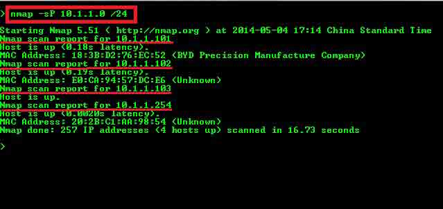

例子：

```
nmap -sP 10.1.1.1-255  

```

效果:

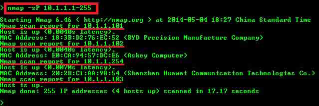

上面两个都是扫描 10.1.1.0/24 网络段的主机

其中

Windown:10.1.1.103

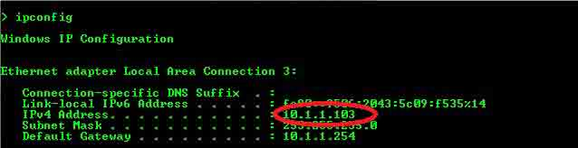

Android:10.1.1.101

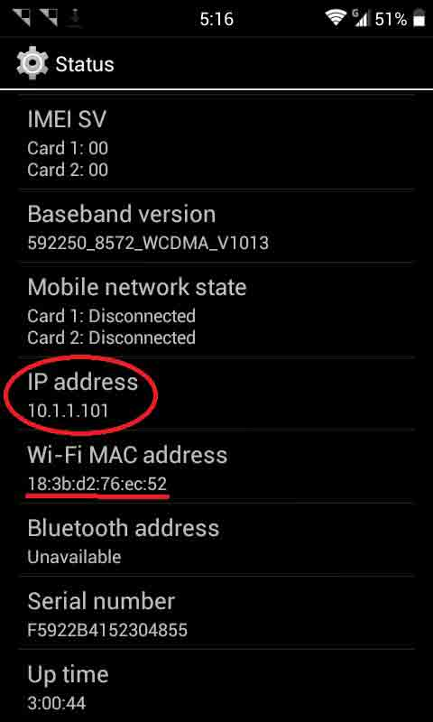

### 8、nmap 操作系统类型的探测

nmap 通过目标开放的端口来探测主机所运行的操作系统类型。这是信息收集中很重要的一步，它可以帮助你找到特定操作系统上的含有漏洞的的服务。

命令语法：

```
nmap -O <target ip> 

```

例子：

```
nmap -O 10.1.1.254   

```

效果：

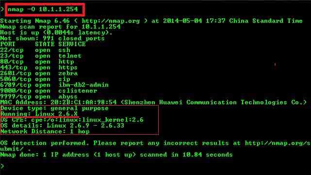

例子：

```
nmap -O 10.1.1.101 （扫描 android 手机）  

```

效果：

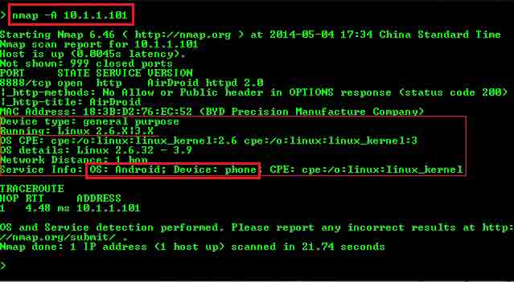

Nmap 默认不能扫描本机，如果你想扫描你的电脑，你可以通过虚拟机来进行扫描。

例子：

```
nmap -O 10.1.1.103（Windows 7 SP2 Home Premium ）

```

效果：

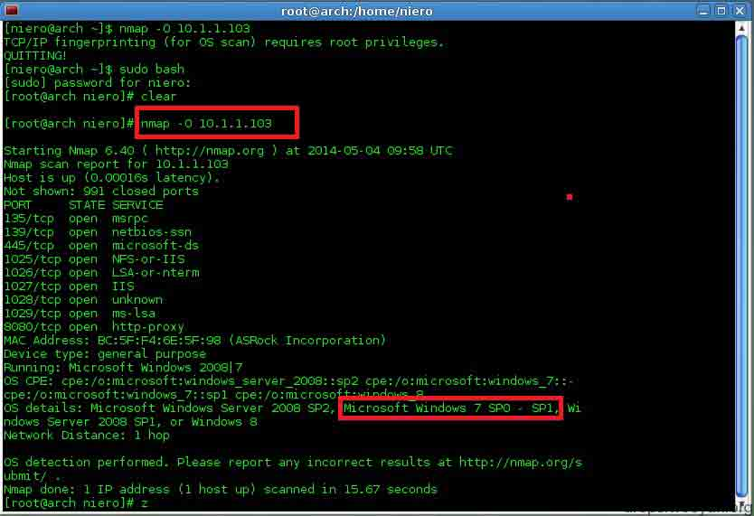

### 9、nmap 万能开关

次选项设置包含了 1-10000 的端口 ping 扫描，操作系统扫描，脚本扫描，路由跟踪，服务探测。

命令语法：

```
nmap -A <target ip>  

```

例子：

```
nmap -A 10.1.1.254 

```

效果：

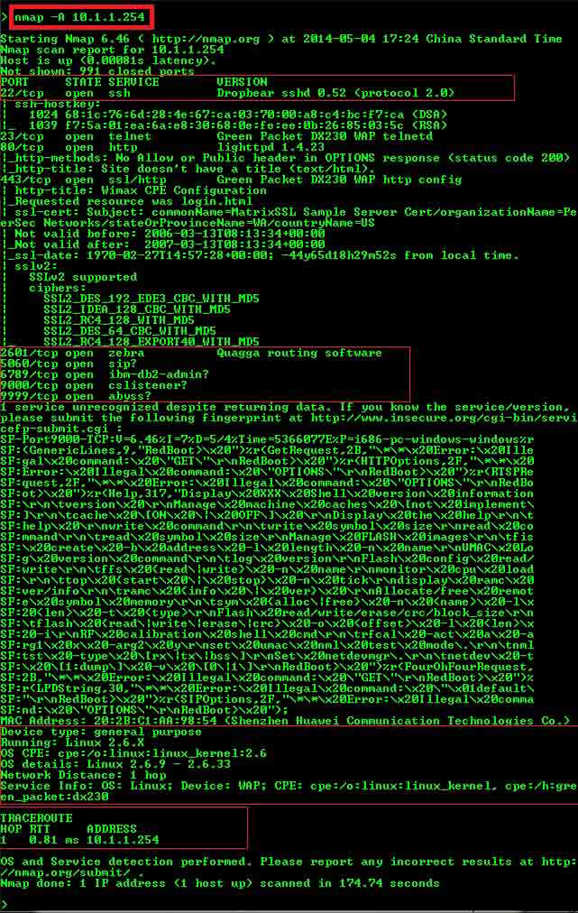

### 10、nmap 命令混合式扫描

命令混合扫描，可以做到类似参数-A 所完成的功能，但又能细化到我们所需特殊要求。

命令语法：

```
nmap -vv -p1-1000 -O <target ip>  

```

例子：

```
nmap -vv -p1-1000 -O 10.1.1.105 

```

效果：

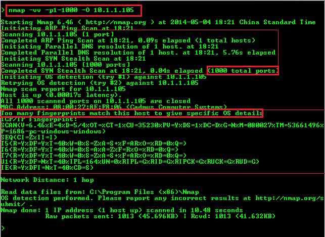

例子:对目标主机的 80,8080,22,23 端口进行扫描，并且对目标进行路由跟踪和操作系统探测。

```
nmap -p80,8080,22,23 -traceroute -O 10.1.1.254 

```

效果：

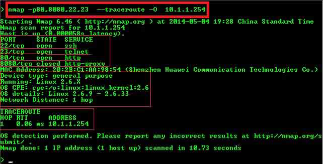

Nmap 提供的这些参数，可根据自己的需求，灵活的组合使用。

由于个人水平有限，如有错误欢迎指出。

版权声明：未经授权禁止转载 [he1renyagao](http://drops.wooyun.org/author/he1renyagao "由 he1renyagao 发布")@[乌云知识库](http://drops.wooyun.org)

分享到：

### 相关日志

*   [深入了解 SQL 注入绕过 waf 和过滤机制](http://drops.wooyun.org/tips/968)
*   [Nginx 安全配置研究](http://drops.wooyun.org/tips/1323)
*   [Alictf2014 Writeup](http://drops.wooyun.org/tips/3166)
*   [上传文件的陷阱](http://drops.wooyun.org/tips/2031)
*   [【.NET 小科普之一】数据库信息在哪儿](http://drops.wooyun.org/tips/975)
*   [生物特征识别之指纹识别，伪造，指纹设备缺陷设计](http://drops.wooyun.org/tips/2140)