# 隐写术总结

2015/02/10 10:14 | [AppLeU0](http://drops.wooyun.org/author/AppLeU0 "由 AppLeU0 发布") | [技术分享](http://drops.wooyun.org/category/tips "查看 技术分享 中的全部文章") | 占个座先 | 捐赠作者

## 0x00 前言

* * *

之前还没有见到 drops 上有关于隐写术的总结，我之前对于隐写术比较有兴趣，感觉隐写术比较的好玩。所以就打算总结总结一些隐写术方面的东西。写的时候，可能会有错误的地方，请不吝赐教，谢谢。

本篇章中用到的隐写术的图片，都打包在了这里：[隐写术图片](http://drops.wooyun.org/wp-content/uploads/2015/02/%E9%9A%90%E5%86%99%E6%9C%AF%E5%9B%BE%E7%89%87.zip)，想去自己尝试一遍的话可以去下载。

最开始接触到隐写术，是看到一种叫做图种的东西，当时不懂，只说要另存为 zip，然后解压出来就可以了，当时觉得特别神奇，就像发现了新大陆，然后就尝试了一下，发现可以用另存为 zip 的方式，用 7z 或者是 winzip 等工具打开，然后就可以看到福利了。

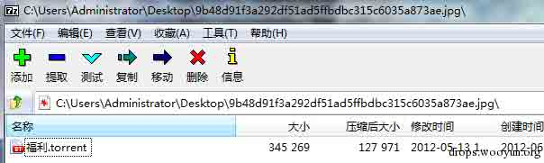

图 1.png

后来才懂得了，先制作一个 1.zip，把想要隐藏的东西放进去，再需要一张 jpg 图片 2.jpg，然后就可以执行一个命令 copy /b 2.jpg+1.zip output.jpg。就可以得到一张图种，这是利用了 copy 命令，将两个文件已二进制方式连接起来，生成 output.jpg 的新文件。而在 jpg 中，是有结束符的，16 进制是 FF D9，利用 winhex 可以看到正常的 jpg 结尾都是 FF D9 的，图片查看器会忽视 jpg 结束符之后的内容，所以我们附加的 zip，自然也就不会影响到图像的正常显示。

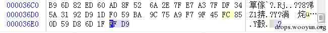

图 2.png

这种类型的隐写也是比较容易被发现的，如果发现是 jpg 图片的话，观察文件结束符之后的内容，查看是否附加的内容，正常图片都会是 FF D9 结尾的。还有一种方式来发现就是利用 binwalk 这个工具，在 kali 下自带的一个命令行工具。

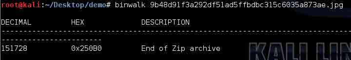

图片 3.png

利用 binwalk 可以自动化的分析图片中附加的其他的文件，其原理就是检索匹配文件头，常用的一些文件头都可以被发现，然后利用偏移可以配合 winhex 或者是 dd 分割出隐藏的部分。

## 0x01 修改数据

* * *

上面说到的隐藏方式，是利用了增加数据的方式，把数据直接增加在了 jpg 后面。还有另一类隐藏的方法，就是利用了修改数据的方式来隐藏自己传递的信息。

一种常见的方式是利用 LSB 来进行隐写，LSB 也就是最低有效位 (Least Significant Bit)。原理就是图片中的像数一般是由三种颜色组成，即三原色，由这三种原色可以组成其他各种颜色，例如在 PNG 图片的储存中，每个颜色会有 8bit，LSB 隐写就是修改了像数中的最低的 1bit，在人眼看来是看不出来区别的，也把信息隐藏起来了。譬如我们想把’A’隐藏进来的话，如下图，就可以把 A 转成 16 进制的 0x61 再转成二进制的 01100001，再修改为红色通道的最低位为这些二进制串。

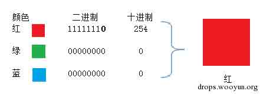

图 4.png

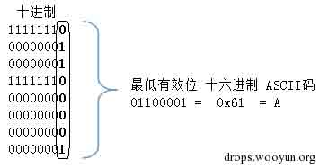

图 4.png

如果是要寻找这种 LSB 隐藏痕迹的话，有一个工具是个神器，可以来辅助我们进行分析。Stegsolve 这个软件的下载地址是

http://www.caesum.com/handbook/Stegsolve.jar

打开之后，使用 Stegsolve——Analyse——Frame Browser 这个可以浏览三个颜色通道中的每一位，可以在红色通道的最低位，发现一个二维码，然后可以扫描得到结果。

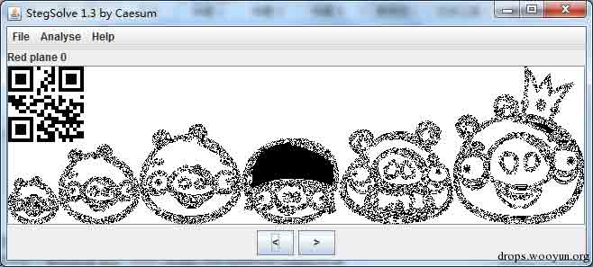

图 6.png

再解一下 qrcode，用在线的就可以 http://tool.chinaz.com/qrcode/，得到了 flag{AppLeU0}，如果是隐写的使用了 ascii 的话，可以使用 Stegsolve——Analyse——Data Extract 来查看 ascii 码。

在这个过程中，我们要注意到，隐写的载体是 PNG 的格式，如果是像之前的 jpg 图片的话就是不行的，原因是 jpg 图片对像数进行了有损的压缩，你修改的信息可能会被压缩的过程破坏。而 PNG 图片虽然也有压缩，但却是无损的压缩，这样子可以保持你修改的信息得到正确的表达，不至于丢失。BMP 的图片也是一样的，是没有经过压缩的，可以发现 BMP 图片是特别的大的，因为 BMP 把所有的像数都按原样储存，没有压缩的过程。

## 0x02 隐写与加密

* * *

我们先要区分一个概念，隐写术和加解密的区别。其实说起来很简单，加解密的话，就是会出现一些神秘的，可疑的字符串或者是数据之类的。而隐写术的话，就是信息明明就在你的面前，你却对他视而不见。隐写术在 CTF 中出现时，常常会和加解密结合起来一起出现，或者是一些编码方式一起出现，以提高题目的难度。

用一个 ctf 的题目作为例子吧，iscc2014 中有一个题目，给了一个名为 此为 gif 图片.gif 的文件，打开发现了报错。有的时候，会需要我们去修复图片，这对我们对于图片的文件结构要有了解。找到 gif 的文件格式，然后对照这个破损的文件。Gif 的图片格式文档可以查看这个链接，http://dev.gameres.com/Program/Visual/Other/GIFDoc.htm

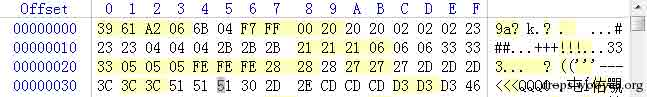

图片 8.png

用 winhex 打开，我们会发现他和普通的 GIF 图片不一样，头部缺少了东西，在对比一些文档，会发现是少了 GIF8。

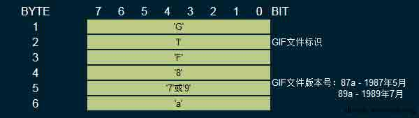

图片 9.png

我们手动修复一下，增加 GIF8。

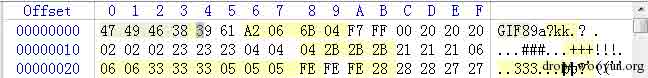

图片 10.png

然后浏览图片后会发现，有个 PASSWORD 一闪而过，gif 和别的图片最大的区别就是 gif 是动态图，它是可以由多帧组成的可以顺序播放的，有的题就是把播放的时间弄得特别慢，几乎就不会动的，所以我们可以用工具一帧一帧的观察图片。Stegsolve 就带有这种功能。

Stegsolve——Analyse——Frame Brower 就可以看到是有 8 帧的图片，有点重叠不太好观察，也可以用 Namo_GIF_gr 这个工具。得到了 PASSWORD is Y2F0Y2hfdGhlX2R5bmFtaWNfZmxhZ19pc19xdW10ZV9zaW1wbGU=。很明显，这个时候 PASSWORD 是经过的编码的，我们可以看到字符范围是 0-9a-Z 结尾还有=，所以判断是 base64 编码，解码得到了 catch_the_dynamic_flag_is_qumte_simple。这个就是和编码方式结合，传递一些可疑的数据，隐写术常常会与加解密或编码结合在一起，对一些常见的编码和加密方法也要了解，得到密文的字符范围和长度能发现这是什么加密或者是编码。

## 0x03 载体

* * *

数据在隐藏的时候，我们常常是需要先分析是数据隐藏在哪里，也就是他在利用是什么做载体，之后才可以进一步的分析是加密或编码的。这也就是说我们要对一个图片的格式要有了解，才能知道哪些地方是可疑的，哪些是可以隐藏起信息的，会有冗余的成分在。举个例子吧，比如给了一个 jpg 的图片。除了我们之前说到的隐藏在结束符之后的信息，jpg 图片还可以把信息隐藏的 exif 的部分。exif 的信息是 jpg 的头部插入了数码照片的信息，比如是用什么相机拍摄的。这些信息我们也是可以控制的，用查看属性的方式可以修改一部分的信息，还可以用 exif 编辑器来进行编辑。Power_exif 这个可以用来编辑。

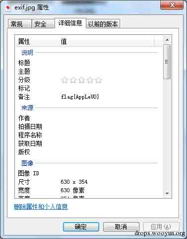

图片 11.png

可以看到 flag{AppLeU0}，就是需要了解隐藏信息的地方，隐写术有的时候难，就是难在了一张图片有太多的地方可以隐藏信息了，有的时候根本连隐藏的载体都找不到，在你的眼里他就是一张正常的图片。

## 0x04 编程辅助

* * *

有一些情况下，我们也是没有现成的工具来完成的，可以自己写一些简单的程序来辅助我们进行分析，或者是加解密。比如 sctf 的 misc400 的题目，就需要用到一些简单的编程。题目给出了一个 png 图片，需要我们找到有 SCTF{}标志的 flag。

这个题需要我们对于 png 图片的格式有一些了解，先用 stegsolve 查看一下，其他的 LSB 之类的并没有发现什么问题，然后看了一下结构发现，有一些异常的 IDAT 块。IDAT 是 png 图片中储存图像像数数据的块。Png 图片格式的扩展阅读可以看看这篇

http://www.cnblogs.com/fengyv/archive/2006/04/30/2423964.html

有详细的介绍。

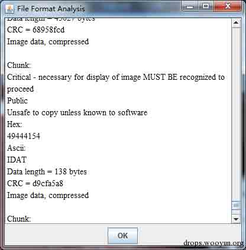

图片 12.png

可以用 pngcheck 来辅助我们观察，可以看得更加清晰。pngcheck.exe -v sctf.png

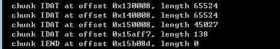

图片 13.png

可以看到，正常的块的 length 是在 65524 的时候就满了，而倒数第二个 IDAT 块长度是 45027，最后一个长度是 138，很明显最后一个 IDAT 块是有问题的，因为他本来应该并入到倒数第二个未满的块里。

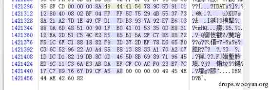

图片 14.png

我们用 winhex 把这一部分异常的 IDAT 块给扣出来。然后就是要研究研究这个块是什么情况，发现了载体之后就是要想办法找出他的规律。观察那一部分的数据，可以看到是 16 进制的 78 9C 开头的，百度一下分析是 zlib 压缩的标志。在 png 的百度百科里也可以查到 PNG 的 IDAT 是使用从 LZ77 派生的无损数据压缩算法，可以用 zlib 解压。那么就尝试用 zlib 来解一下这段数据。Zlib 的扩展阅读 http://zlib.net/

我们使用 python 来编程，先把那段数据处理一下，保存成 16 进制的。

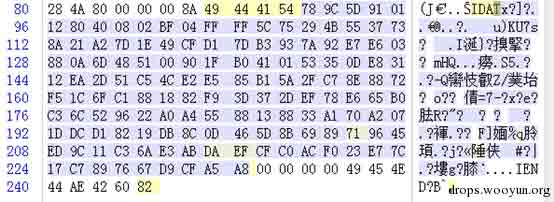

图片 15.png

得到 16 进制的以方便 python 处理，前面的 4 字节是长度 然后是标志位 IDAT 然后开始是数据，直到 D9 CF A5 A8 是 crc32 校验位。 所以实际的数据是：

```
789C5D91011280400802BF04FFFF5C75294B5537738A21A27D1E49CFD17DB3937A92E7E603880A6D485100901FB0410153350DE83112EA2D51C54CE2E585B15A2FC78E8872F51C6FC1881882F93D372DEF78E665B0C36C529622A0A45588138833A170A2071DDCD18219DB8C0D465D8B6989719645ED9C11C36AE3ABDAEFCFC0ACF023E77C17C7897667 
```

然后用 python 来写 zlib 解压

```
#! /usr/bin/env python
import zlib
import binascii
IDAT = "789C5D91011280400802BF04FFFF5C75294B5537738A21A27D1E49CFD17DB3937A92E7E603880A6D485100901FB0410153350DE83112EA2D51C54CE2E585B15A2FC78E8872F51C6FC1881882F93D372DEF78E665B0C36C529622A0A45588138833A170A2071DDCD18219DB8C0D465D8B6989719645ED9C11C36AE3ABDAEFCFC0ACF023E77C17C7897667".decode('hex')
#print IDAT
result = binascii.hexlify(zlib.decompress(IDAT))
print result

#print result.decode('hex')

```

发现解出来了一些 3031 的字符串，30 和 31 是 hex 的 0 和 1 的编码，再解一次 hex 得到一串 625 长度的 01 字符串。

```
1111111000100001101111111100000101110010110100000110111010100000000010111011011101001000000001011101101110101110110100101110110000010101011011010000011111111010101010101111111000000001011101110000000011010011000001010011101101111010101001000011100000000000101000000001001001101000100111001111011100111100001110111110001100101000110011100001010100011010001111010110000010100010110000011011101100100001110011100100001011111110100000000110101001000111101111111011100001101011011100000100001100110001111010111010001101001111100001011101011000111010011100101110100100111011011000110000010110001101000110001111111011010110111011011 
```

得到的 01 串的长度是 625，除以 8 除以 7 都无法整除，也就是说没法直接转换成 ascii 码。

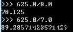

图片 16.png

然后发现 625 = 25*25，刚好是个正方形的形状，那么尝试一下 把这些 01 组成一个正方形 看看是什么，可以用 python 的 PIL 编程可以很方便的画图，在 kali 自带就可以有，win 的环境需要安装 PIL 的第三方库。

```
#!/usr/bin/env python
import Image
MAX = 25
pic = Image.new("RGB",(MAX, MAX))
str = "1111111000100001101111111100000101110010110100000110111010100000000010111011011101001000000001011101101110101110110100101110110000010101011011010000011111111010101010101111111000000001011101110000000011010011000001010011101101111010101001000011100000000000101000000001001001101000100111001111011100111100001110111110001100101000110011100001010100011010001111010110000010100010110000011011101100100001110011100100001011111110100000000110101001000111101111111011100001101011011100000100001100110001111010111010001101001111100001011101011000111010011100101110100100111011011000110000010110001101000110001111111011010110111011011"
i=0
for y in range (0,MAX):
    for x in range (0,MAX):
        if(str[i] == '1'):
            pic.putpixel([x,y],(0, 0, 0))
        else:
            pic.putpixel([x,y],(255,255,255))
        i = i+1

pic.show()
pic.save("flag_png.jpg")

```

发现是一个二维码 可以编码来画出 0 代表了是白色 而 1 代表了黑色，然后可能会需要旋转来调整一下，才能扫描出来。处理一下得到了一个二维码。然后扫描得到了 flag。


图片 17.png

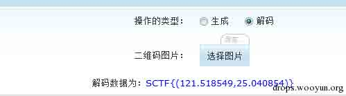

图片 18.png

SCTF{(121.518549,25.040854)}，成功得到了 flag。

在有的情况下，是没法用现成的工具来处理的，所以就要我们用编程来设法解决。Python 的 PIL 是个好东西。批量处理图片的时候可能会需要它。

## 0x05 双图

* * *

还有一种情况是比较特殊的，有的时候会给出两张图片，或者是需要你去寻找原来的图片来进行对比寻找隐藏的信息。这个一般是因为一张图片给出来的隐藏信息太过于隐蔽，无法找不到具体的位置，具体的信息。这个时候就要用到一些对比的技巧来查找了。比如 ISG2014 的 misc200 就是用到的这种给出了两张图的。有的情况下，第二张图是需要你自己去找到的。

我们来看 isg2014-misc200 的题，题目给了一张 png 图片，png 的图片，就怕里面插个什么 rar 之类的，所以先用 linux 下的 binwalk 命令跑一跑。


图片 19.png

跑一跑，发现了有两个 PNG 图片，binwalk 会给出偏移，确定了偏移是 0x1D55DC 之后，用 winhex 把图片扣出来，保存成 2.png。原来的图 final.png 删除后面那的一部分，保存成 1.png。肉眼查看了一下，发现两张图片没有太大的区别，我们用软件来帮助我们区分他。

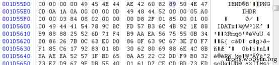

图片 20.png

用 linux 下的命令可以进行对比，生成一个有差异的图片 diff.png。compare 1.png 2.png diff.png 观察一下发现了左下角有异常，png 图片像数保存是从左到右，从下往上排列的。

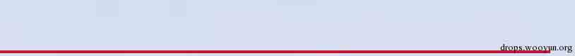

图片 21.png

发现了左下的第二条像素有异常，对比一下 1.png 2.png 发现了 2.png 有问题 那么我们可以用神器 stegsolve 来辅助，stegsolve——Analyse——Image Combiner 对比两个文件。查看 Sub 或 Xor，可以发现左下角，第二条像数条是有异常的，有红色的出现。

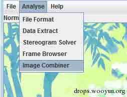

图片 22.png

把 1.png 和 2.png 进行一下 sub 方法 把结果保存成 solved.bmp。

然后把 2.png 保存成 2.bmp 24 位位图的格式，这个是因为 png 图片经过了压缩，不好直接对比每个字节，而 bmp 图片是没有压缩的，直接保存各个像数点的数据。

这个题还有一个坑点就是偏移的问题 png 图片的扫描是从左向右，从下往上来的。而坑的是这个图的信息隐藏并没有在一开头的像数，而是是第二行像数，所以就需要利用 bmp 的优势，储存无压缩，方便寻找到偏移，从而找到信息隐藏的地方。利用 winhex 打开，黑色的像数的在 bmp 中的 hex 的 00 保存的，那么我们就寻找不是 00 的地方。在偏移 0x1110 的地方可以发现

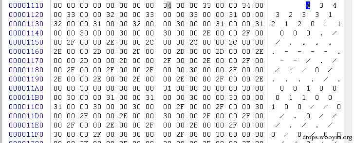

图片 23.png

有不是 00 的字节，一开始还以为这些就是 flag 的信息了，后来才发现是因为两个图片 sub 影响到了效果，真正的信息是隐藏在 2.png 中的，所以打开由 2.png 转换的 2.bmp 来对，通过之前 diff 得到的偏移，寻找到 0x1110 的地方，直到 0x1330 结束，这是隐藏的信息。

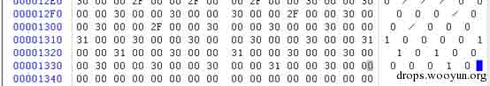

图片 24.png

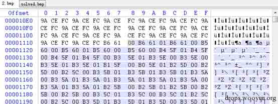

图片 25.png

只保留 00 01，这个是因为 RGB 的关系，只隐藏在 R 通道里面了，其他通道都是图片的正常像数信息，过滤掉就可以了。

```
00010000010000010001000100000101000100000001010100010101010001010001000000010001000001010001000000010101000001010001000101000001000100010101010100010001000001010001010100010000000100000001000100010100000101010000010100010000000101000101010000000101000000000001010000010101000100010000010000000101000100000001010100000000000100000100000000010101010000010001010101010001 
```

观察一下可以发现，而奇数位都是 0，是多余的，把这些去除掉。直接把 00 替换成 0，01 替换成 1 就可以了。

```
0100100101010011010001110111101101000101001101000111001101011001010111110101001101110100010001010110011100110100011011100011000001100111010100100011010001110000010010000111100101111101 
```

得到了这个之后，可以发现他的长度是 184，是 8 的倍数，把他转换成 ascii 码就可以了。可以使用 JPK 工具来进行转换，工具的下载的链接是 www.wechall.net/applet/JPK_406.jar。

对比 2.bmp 可以发现隐藏了一些 00 01 这些信息，把这一部分扣出来。

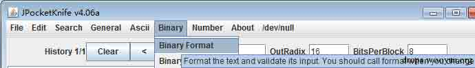

图片 26.png

JPK——binary——binary to ascii

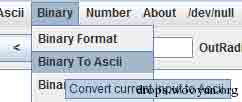

图片 27.png

就得到了 flag，ISG{E4sY_StEg4n0gR4pHy}

这种就是利用的两张图片对比来寻找差异，从而找到信息隐藏的地方，这样子出题往往是因为一张图片能提供的信息太少。

## 0x06 后记

* * *

这个总结其实还是缺很多的，因为隐写术能写的东西太多了，比如 jpg 的冗余信息的压缩也可以隐藏进信息，还有其他的多媒体文件也可以进行隐写，例如音频文件，视频文件等等，有很多东西可以研究。一开始是觉得隐写术特别的有趣才接触到的，就像是在藏宝寻宝一样，特别好玩，希望你们也可以感受到这种快乐。欢迎大家和我交流，我的博客地址是 http://appleu0.sinaapp.com/。

版权声明：未经授权禁止转载 [AppLeU0](http://drops.wooyun.org/author/AppLeU0 "由 AppLeU0 发布")@[乌云知识库](http://drops.wooyun.org)

分享到：

### 相关日志

*   [如何用意念获取附近美女的手机号码](http://drops.wooyun.org/tips/573)
*   [IIS WebDAV 安全配置](http://drops.wooyun.org/papers/238)
*   [RFID 之 M1 卡数据分析](http://drops.wooyun.org/tips/3168)
*   [用 Burpsuite 来处理 csrf token](http://drops.wooyun.org/tips/2460)
*   [One git command may cause you hacked(CVE-2014-9390)](http://drops.wooyun.org/papers/4386)
*   [一种被命名为 Chameleon 的病毒可以通过 WiFi 相互之间传播](http://drops.wooyun.org/news/976)