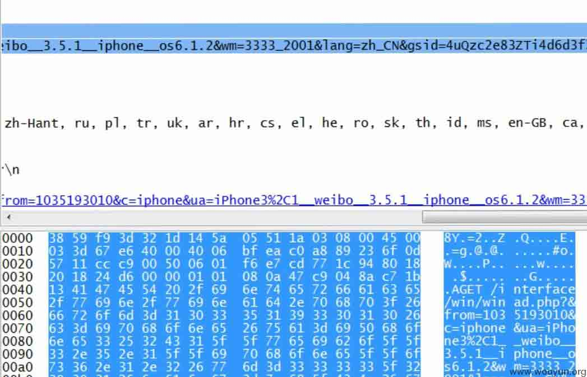
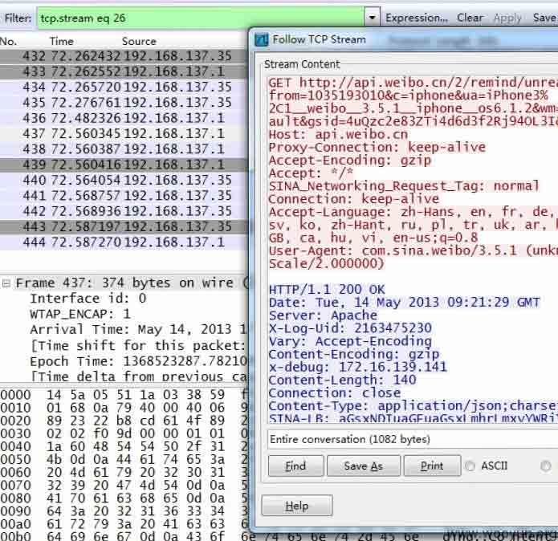
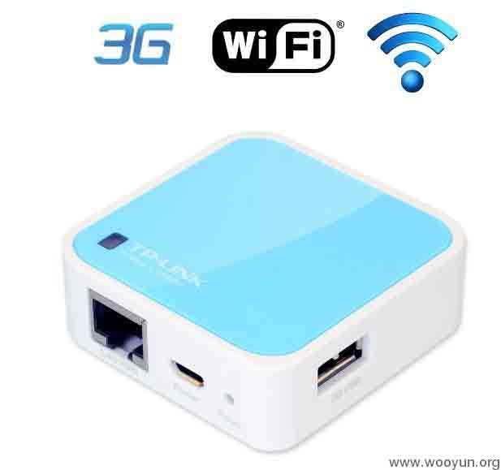
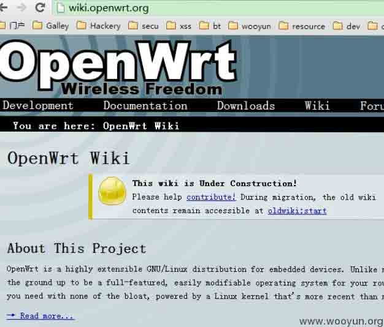

# 公共无线安全——FakeAP 之 WiFi 钓鱼 

2013/05/21 18:15 | [龙臣](http://drops.wooyun.org/author/龙臣 "由 龙臣 发布") | [技术分享](http://drops.wooyun.org/category/tips "查看 技术分享 中的全部文章") | 占个座先 | 捐赠作者

### 0x00 相关背景介绍

随着人们的生活越来越离不开网络，也越来越离不开移动手机，一般的公共厂商都已经将 wifi 作为基础服务进行提供，譬如在星巴克、麦当劳等公共场所边点杯热饮边“蹭网”，已经是一个基本的习惯了，甚至一些大型的电信提供商已经尝试将 wifi 作为一个基础的接入。如今公共的 wifi 很多，尤其是免费的，手机上还有帮助寻找免费 wifi 的各类 app。很多人为了省流量，看到免费的 wifi，总会去连接一下尝试网上冲浪。不过，在这些免费的 wifi 以及大家使用 wifi 的习惯，加上手机及 app 的默认行为，就可以导致一些严重安全问题。

### 0x01 成因

随着智能手机的普及，手机上各类 app 越来越丰富，app 避免不了与服务端的通信，因此，在这些不安全的公共无线流量里，你手机里的 app 可能会泄露你的各种机密信息，而我们的手机如果开启了 WiFi 功能，就会自动扫描附近的无线网络信号：


当我们的手机在成功连接了一个 WiFi 之后，就会用 ssid 和密码等相关信息保存在本地的一个配置文件里。

乌云上也有白帽子报告过安卓明文存储 WiFi 配置文件

[WooYun: Android 手机明文存储使用过的 Wifi 密码](http://www.wooyun.org/bugs/wooyun-2012-015086)

当发现有无线网络信号存在的时候，手机就会基于这个配置文件尝试去匹配这个广播出来的 ssid，一旦发现匹配上了，就会按照配置文件里面的信息去连接这个 WiFI，如果连接不成功，发现还有可以匹配的 SSID，手机就会尝试去连接下一个。无论是安卓还是 IOS 上的这个设计，虽然显的非常的人性化，但是它真的很不安全。很多时候，安全和便利就是矛盾的，鱼和熊掌的关系，可以设想，在未来移动互联时代，我们的手持设备在越来越便利，越来越人性化的同时，必然还会有更多的安全问题存在。手机里的一些 APP 在网络连通了之后，会主动向服务端发出一些请求，而在这些请求里很有可能就包含有攻击者感兴趣的敏感信息。这些敏感信息一般包括，用户名，密码，cookie，身份标识等等，而 APP 在一个不安全的网络环境里发出请求，这些敏感信息就有可能暴露在攻击者的面前。

一个典型的应用场景就是，你上午在公司办公，那么连接上了公司 OA 的 wifi，然后中午出去用餐就可能链接到星巴克的 wifi，而当你打车去客户的途中很可能在一个红绿灯的地方你就自动链接上了附近的麦当劳 wifi，最要命的是这些全部是在你不知情的情况下完成的。

### 0x02 数据劫持

在一个可控的网络环境里，劫持数据有很多方法。比较有名的网络层抓包工具有 wireshark，tcpdump，都是很好的网络协议分析工具。我们现在手机上的大多数 APP 应用层都是使用的 HTTP 协议，因此我们很多的在 web 安全测试里面用到的分析工具如 fiddler，burp，httpanalyzer，Charles 等也都是可以用来分析或者劫持 APP 的通信流。






这些都是劫持的很常见的 HTTP 流量，里面不乏很多敏感信息。

### 0x03 攻击构想

如果我们手机里的 app 默认会进行很多敏感的请求，譬如微博会自动去登陆和获取最新的微博；如果我们的手机默认会链接周围已经被保存 sid 的 wifi；那么我们为什么不能做一个在地铁上使用的可以抓取周围的人的微博认证信息的 wifi 呢？通过内置最常见的 sid 和信息，我们可以使得周围的人会自动链接上我们的 wifi，通过抓取相应的数据取得里面的敏感信息我们理论上是可以劫持他的微博的

### 0x04 环境搭建

无论是白帽子试验还是攻击者搭建一个钓鱼环境，便携性都是这类攻击中需要首先考虑到的。硬件方面便携的路由器是一个不错的选择。比如下面 tp-link 的这款 wr-703n，非常小巧。也具备一定的定制性，虽然配置一般，但是定制一个灵活小巧的系统还是非常方便的。



软件方面，可以选择的嵌入式系统很多，比较常见的有 DD-WRT、OpenWRT 和 AirSnarf 等。这里推荐 OpenWRT，网上关于 OpenWRT 的文档非常 全面，可定制性也比较强。它是一个比较精简的 linux 发行版，系统要求非常低，所以非常适合我们的要求。下面是它的官网 wiki。



刷完 openwrt 官方固件，为了便于管理可以添加个 web 端的管理界面，在 openwrt 里，比较成熟的就是 luci。可以利用 opkg 直接安装，opkg 是一个轻量快速的套件管理系统，目前已成为 opensourse 界嵌入式系统标准。常用于路由、交换机等嵌入式设备中，用来管理软件包的安装升级与下载。

```
opkg update 

opkg install luci 

/etc/init.d/uhttpd enable 

/etc/init.d/uhttpd start 
```

在浏览器访问路由器的网关地址即可看到 luci 界面了，就可以在浏览器直观的配置路由器了。为了配置多 ssid，我们可以在 openwrt 上开启 vlan 来模拟多个虚拟子网如 vlan1 和 vlan2

```
config switch eth1  
option reset 1  
option enable_vlan 1

config switch_vlan  
option vlan 1  
option device eth1  
option ports '0 1 2 5t'

config switch_vlan  
option vlan 2  
option device eth1  
option ports '3 5t' 
```

两个 vlan 网络接口分别为 eth1.0 和 eth1.1，0、1、2 口为一个子网，3 口单独一个子网。现在把 eth1.0 和 eth1.1 两个网络接口组成一个网桥 lan：

```
config interface lan  
option type bridge  
option ifname 'eth1.0 eth1.1'  
option proto none 
```

lan 默认不设置 ip，如果想远程访问 OpenWrt，则必须按情况设置 static 或 dhcp。

关闭防火墙，因为网桥用不着：

```
/etc/init.d/firewall disable 
```

重启网络后可以用 ifconfig 看到很多网络接口，只要监听 br-lan 就行了：

```
br-lan Link encap:Ethernet HWaddr ××××××××××××××××××  
UP BROADCAST RUNNING MULTICAST MTU:1500 Metric:1  
RX packets:0 errors:0 dropped:0 overruns:0 frame:0  
TX packets:0 errors:0 dropped:0 overruns:0 carrier:0  
collisions:0 txqueuelen:0  
RX bytes:0 (0.0 B) TX bytes:0 (0.0 B)

eth1 Link encap:Ethernet HWaddr \*\*\*|\\*\*\*|\\*\*\*|\\*\*\*|\\*\*\*|\\*\*\*|\**  
UP BROADCAST RUNNING MULTICAST MTU:1500 Metric:1  
RX packets:0 errors:0 dropped:0 overruns:0 frame:0  
TX packets:0 errors:0 dropped:0 overruns:0 carrier:0  
collisions:0 txqueuelen:1000  
RX bytes:0 (0.0 B) TX bytes:0 (0.0 B)  
Interrupt:14

eth1.0 Link encap:Ethernet HWaddr \*\*\*|\\*\*\*|\\*\*\*|\\*\*\*|\\*\*\*|\\*\*\*|\*  
UP BROADCAST RUNNING MULTICAST MTU:1500 Metric:1  
RX packets:0 errors:0 dropped:0 overruns:0 frame:0  
TX packets:0 errors:0 dropped:0 overruns:0 carrier:0  
collisions:0 txqueuelen:0  
RX bytes:0 (0.0 B) TX bytes:0 (0.0 B)

eth1.1 Link encap:Ethernet HWaddr \*\*\*|\\*\*\*|\\*\*\*|\\*\*\*|\\*\*\*|\\*\*\*|\*  
UP BROADCAST RUNNING MULTICAST MTU:1500 Metric:1  
RX packets:0 errors:0 dropped:0 overruns:0 frame:0  
TX packets:0 errors:0 dropped:0 overruns:0 carrier:0  
collisions:0 txqueuelen:0  
RX bytes:0 (0.0 B) TX bytes:0 (0.0 B)

lo Link encap:Local Loopback  
inet addr:127.0.0.1 Mask:255.0.0.0  
UP LOOPBACK RUNNING MTU:16436 Metric:1  
RX packets:0 errors:0 dropped:0 overruns:0 frame:0  
TX packets:0 errors:0 dropped:0 overruns:0 carrier:0  
collisions:0 txqueuelen:0  
RX bytes:0 (0.0 B) TX bytes:0 (0.0 B) 
```

在 OpenWrt 里安装 Tcpdump：

```
opkg install tcpdump 
```

运行 Tcpdump 监听 POP 邮箱密码：

```
tcpdump -X -i br-lan port 110

/udisk/tcpdump -XvvennSs 0 -i br-lan tcp[20:2]=0x4745 or tcp[20:2]=0x4854 -w ./udisk/test.cap 
```

将结果 dump 到本地，0x4745 为"GET"前两个字母"GE",0x4854 为"HTTP"前两个字母"HT"。

注意：tcpdump 对截获的数据并没有进行彻底解码，数据包内的大部分内容是使用十六进制的形式直接打印输出的。显然这不利于分析网络故障，通常的解决办法是先使用带-w 参数的 tcpdump 截获数据并保存到文件中，然后再使用其他程序(如 Wireshark)进行解码分析。当然也应该定义过滤规则，以避免捕获的数据包填满整个硬盘。

下图是 test.cap 在 wireshark 中的展现。


可以看到所有报文例如 http 协议的内容可以很方便的查看到。如果你的通信报文没加 ssl 的话，配置下你的 tcpdump，应该能捕获到很多密码明文了：）

### 0x05 修复方案

对于这一类的公共无线安全问题，目前还没有比较统一的解决方案，但是我们可以做到在一个我们不信任的网络环境里，我们不要随便开启我们的 WiFi 功能，而且要定期清理手机里保存的各类公共 WiFi 配置，以防止被利用。

### 0x06 相关其他安全问题

关于 HTTPS 流量的劫持问题，目前比较常用的方法是通过中间人替换证书，将一个连接分割成两部分这样的方式。但是这样在这个攻击里面会有个问题就是，怎么替换客户端的证书，如果客户端开启了证书验证功能的话？欢迎大家讨论。

**Tags:** [无线](http://drops.wooyun.org/tag/%e6%97%a0%e7%ba%bf), [钓鱼](http://drops.wooyun.org/tag/%e9%92%93%e9%b1%bc)

版权声明：未经授权禁止转载 [龙臣](http://drops.wooyun.org/author/龙臣 "由 龙臣 发布")@[乌云知识库](http://drops.wooyun.org)

分享到：

### 相关日志

*   [当渗透遇到 zabbix–小谈 zabbix 安全](http://drops.wooyun.org/tips/68)
*   [Android Broadcast Security](http://drops.wooyun.org/tips/4393)
*   [NTP 反射型 DDos 攻击 FAQ/补遗](http://drops.wooyun.org/papers/955)
*   [snmp 弱口令引起的信息泄漏](http://drops.wooyun.org/tips/409)
*   [撞库扫号防范](http://drops.wooyun.org/tips/2830)
*   [CDN 流量放大攻击思路](http://drops.wooyun.org/papers/679)