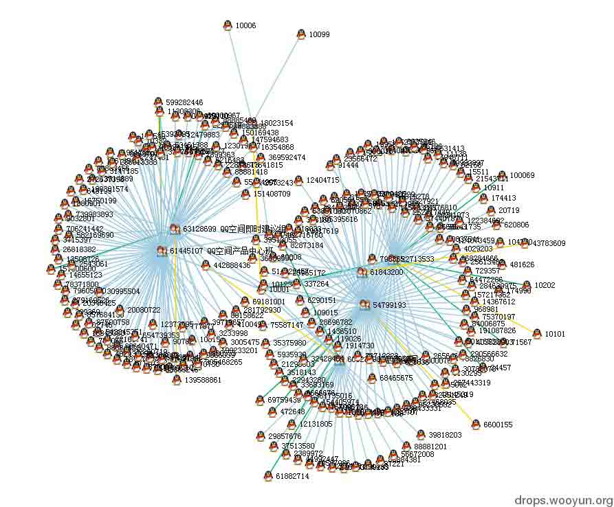
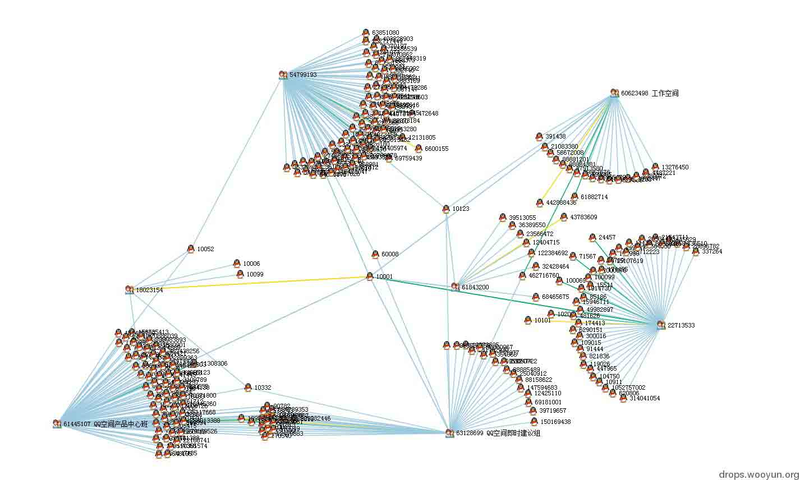
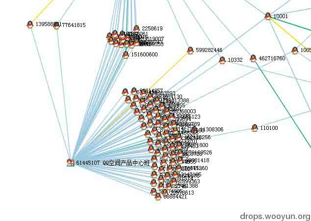
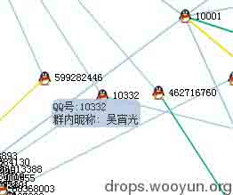
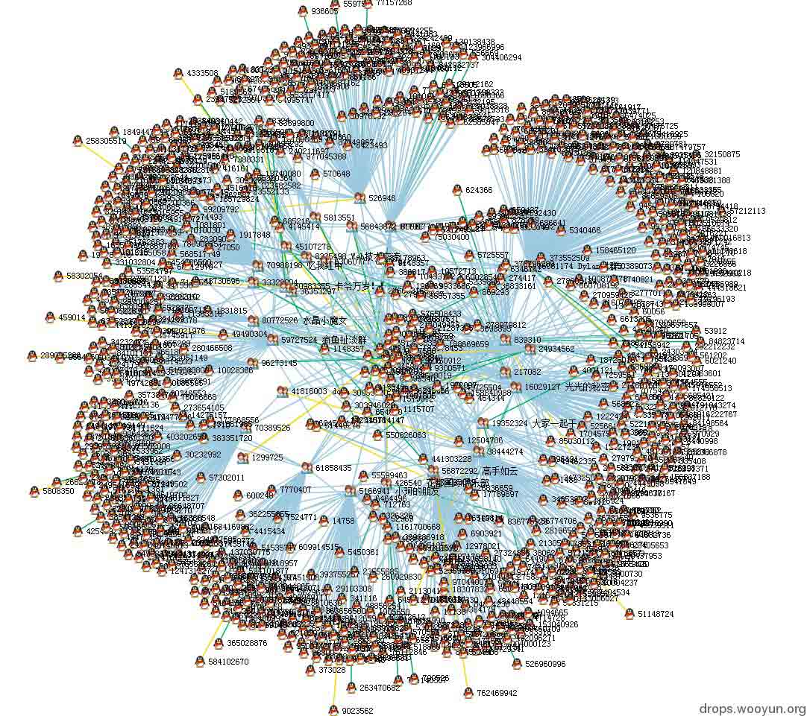
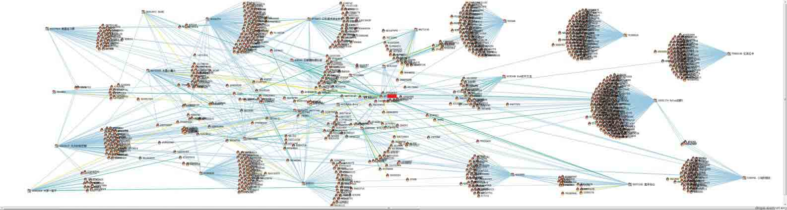

# 利用 d3.js 对大数据资料进行可视化分析

2013/12/19 18:18 | [insight-labs](http://drops.wooyun.org/author/insight-labs "由 insight-labs 发布")   | [技术分享](http://drops.wooyun.org/category/tips "查看 技术分享 中的全部文章")  | 占个座先  | 捐赠作者

作者: Anthr@X  anthrax@insight-labs.org

## 0x00 背景

* * *

对于前段时间流出的 QQ 群数据大家想必已经有所了解了，处理后大小将近 100G，多达 15 亿条关系数据（QQ 号，群内昵称，群号，群内权限，群内性别和年龄）和将近 9000 万条群信息（群号，群名，创建时间，群介绍），这些数据都是扁平化的 2 维表格结构，直接查询不能直接体现出用户和群之间的直接或者间接关系。通过数据可视化，可以把扁平结构的数据作为点和线连接起来，从而更加直观的显示出来从而进行分析。

d3.js 是一个近年来推出的基于 javascript 的数据展示库，全称为 Data Driven Document， 在浏览器数据展示领域的地位类似于通用 js 框架里的 jQuery。d3.js 的官网是 d3js.org，大家可以在上面看到很多例子和应用。d3.js 也是图形数据库 neo4j 所内置的数据展示工具。

说到图形数据库，其实正确的翻译应该是图数据库，图即所谓的 Graph，来自于数学里的图论，比如四色定理和推销员过桥的问题（著名的 NP 问题之一）。图数据库着重于数据之间的关联和属性，对于关系错综复杂的关系分析效率很高。例如，我想知道谁是我朋友的朋友，并且他们有哪些朋友也认识我。对于这种问题，普通关系型数据库的计算复杂度是 O(N^c)左右或者更高，N 为选择范围的数据集合大小，你好友数量加上好友的好友的数量等，c 为关系层数。图数据库的计算复杂度在 O(N²)左右或者更低，但是基本不会超过 O(N²)。图数据库对于复杂关系数据查询起来效率高的主要原因是在数据输入的时候就已经对关系进行了处理和索引，这样做在查询的时候具有很高的效率，但是在数据导入的时候会很慢。QQ 群的 15 亿个关系在向图数据库 neo4j 里导入的时候花了 3 天都没弄完，也没有进度提示，所以后来我直接放弃了。

## 0x01 数据处理

* * *

在 QQ 群和群成员关系里面，对于层数我是这么定义的：

```
第 1 层：目标 QQ 加入的所有群  
第 2 层：目标 QQ 加入的所有群的所有成员  
第 3 层：目标 QQ 加入的所有群的所有成员加入的所有群  
.  
.  
. 
```

大家可以看出这样的查询是可以递归的，假设每个 QQ 号所加入的群数量和每个群的成员数量为 N，那么查询 3 层数据时总计算量为`N*N*N`=n³，所以当查询层数为 c 层的时候，计算复杂度是 N^c。

前面说过，图数据库的计算复杂度一般在 N² 以下，所以当使用普通的关系型数据库的时候，如果查询的层数不多，效率和图数据库比起来差不多，加上关系数据库自带的便于管理和导入导出的属性，所以我还是选择了 mysql 数据库。

对于 QQ 和 QQ 群之间的关系，每个 QQ 号都能加入群，一个群里也有很多 QQ，基本都在几十到几百人，所以两个 QQ 号在同一个群里不一定代表他们的关系很紧密，换句话说 QQ 和 QQ 群之间的关系相对于 QQ 好友而言相对较弱。但是这并不代表我们从中不能分析出有用的资料，俗话说的好，大数据就像一座金矿，只有用力挖才能挖到金子。

d3.js 支持多种数据格式，比如 JSON,XML,CSV,HTML 等，因为 PHP 的数组可以很简单的转换为 JSON 格式，所以我选择用 PHP 写 API 来获取 JSON 数据。QQ 和 QQ 群是一种典型的图数据的应用，QQ 和 QQ 群作为节点(node)，QQ 加入了哪些群作为关系(link)，d3.js 内置了一个功能很强大的内建布局，叫做 Force-Directed Graph（受力导向图），后面简称为 force。force 布局模拟了一些基本的物理粒子原理，比如引力和斥力（确切的说是模拟了电磁力和引力，在离的远的时候会互相吸引，在离的近的时候斥力急剧增加），并且可以调节力的大小和受力距离等等，可以说是自由度相当高。关于 d3.js 的 force 布局，在官网有详细的 API 和不少例子，这里我就不贴代码了。

在 force 布局里面，数据源的 JSON 可以有很多种不同的格式和属性，但是基本格式如下:

```
{"nodes":[{"num":10001,type:"qq"},{"num":12345678,type:"qun"}],"links":[{"source":"10001","target":"12345678","auth":1,"nick":"pony"}]} 
```

其中 nodes 数组对应的是节点列表，links 对应的是关系列表。

每个节点可以有很多自定义属性，在 d3.js 可以针对每个节点存取节点的属性，比如我定义 num 是 QQ 号或者群号，type 代表节点是 QQ 还是群，另外我在 js 里设定在 type==‘qun’的时候显示群的图标，是 qq 的时候显示 qq 的图标。关系里面默认的属性有 source 和 target，分别对应一个关系的两头，默认情况下关系里面的 source 和 target 对应的数字是节点在节点数组里面的位置 index。但是我自定义成了 qq 号和群号。另外你也可以定义其他属性，比如 auth 代表这个 QQ 号在群里的权限，nick 是群昵称。

对于 QQ 群这样的关系来说，基本上在第 4 层和以上的 QQ 和群的关系就比较弱了，所以为了提高查询速度和减少节点数量，我只查询 2 层关系（少么？不少，要想想有些群有超过 500 人……）。

首先，d3.js 需要在浏览器里面运行，我的首选是 Google Chrome，V8 引擎的效率果然不错，在节点和关系不多的时候基本感觉不到延迟，后来在 FF 和 IE11 里面测试了一次，FF 比 Chrome 卡一半左右，IE 的话我只能呵呵了……

先拿小马哥做个测试，QQ 号是霸气的 10001。当 d3.js 导入完数据 JSON 的时候，各种节点会在屏幕上乱飞几秒钟，直到他们的力达到一个稳定的平衡点。结果如下:

说明：

```
企鹅图标的节点代表 QQ，群图标的节点是群(废话么)。  
每条线代表一个关系，一个 QQ 可以加入 N 个群，一个群也可以有 N 个 QQ 加入。  
线的颜色分别代表：  
土豪金：群主  
狗腿绿：群管理员  
屌丝蓝：群成员 
```

大家也可以看到，群主和管理员的关系线也比普通的群成员长一些，这是为了突出群内的重要成员的关系。

图标旁边自动标注了 QQ 号和群号，如果有的话还有群名。没有在 QQ 号旁边标注昵称是因为很多人加入不同的群使用的是不同昵称，所以把昵称放到了其他的地方显示。

在下图中大家可以隐约的看到，所有的关系都是以 QQ 10001 为起点的。



在图上节点是可以拖拽的，拖拽后会固定在你释放的地方。我们把几个群稍微拖的分开一点，关系就一目了然了



这个时候我们可以看到在目标的 QQ 群里也有很多共同 QQ 号，比如有些 QQ 号同时加入了 2，3 个群。群名显示的都是各种产品开发讨论群，这些同时加入 2，3 个产品群的人估计不是产品经理就是主管吧……



鼠标悬停到群图标上可以看到群的详细信息(如果有的话)

图 3.1


因为很多人在不同群里的昵称不一样，所以群内昵称等信息就只能放到 link 上面了，因为线比较细，所以鼠标比较难对准，这个功能还待修改。

这个家伙和小马哥一起同时在 3 个群里，好基友？

图 4


小马哥的 QQ 群信息展示完了，下面我们来看看更加实际的应用，比如把某圈子里的人找出来。我们先从某土豪大黑阔大牛的 QQ 号入手：

初始数据好多……此大黑阔加入的群够杂的，不过就是因为杂所以才能更深入的了解一个人的所有喜好。看看群名神马的，我好像看到了 dota，XX 国际俱乐部，web 技术交流，XXsec 等群……充分说明了此人……是个屌丝技术宅大黑阔，XX 国际俱乐部又似乎带着那么种高大上的感觉……

图中错综复杂的各种关系组成了一朵朵盛开的菊花，向我们诉说着他的历史……



为了理清他那不堪回首的过去和关系网，我特地把浏览器窗口拖到第二个屏幕上，然后把群挨个分开。为了保护当事人的隐私，这张图我打码了。

这张图比较宽，建议大家下载下来放大看



## 0x02 总结

* * *

假如把层数扩展到 4 层，不知能否筛选出中国所有黑阔的 QQ 号呢？至少我已经在这张图里看到了很多熟悉的名字和号码。

腾讯总是说漏洞早已修复，不存在问题了，广大网民放心，但实际上信息泄露这种事情，岂是你漏洞修复好了就结束了的事情？

版权声明：未经授权禁止转载 [insight-labs](http://drops.wooyun.org/author/insight-labs "由 insight-labs 发布")@[乌云知识库](http://drops.wooyun.org)

分享到：

### 相关日志

*   [Flash CSRF](http://drops.wooyun.org/tips/688)
*   [Spring MVC xml 绑定 pojo 造成的 XXE](http://drops.wooyun.org/papers/1911)
*   [Win10 安全特性之执行流保护](http://drops.wooyun.org/tips/4839)
*   [Linux 下基于内存分析的 Rootkit 检测方法](http://drops.wooyun.org/tips/4731)
*   [深入分析 Fiesta Exploit Kit](http://drops.wooyun.org/tips/4858)
*   [SQL Injection via DNS](http://drops.wooyun.org/tips/4605)