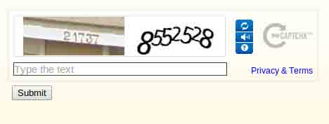
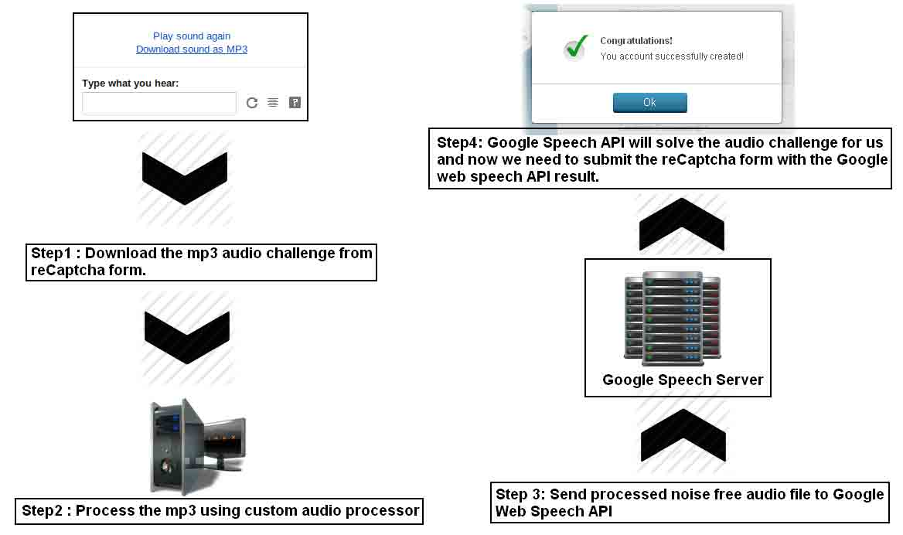
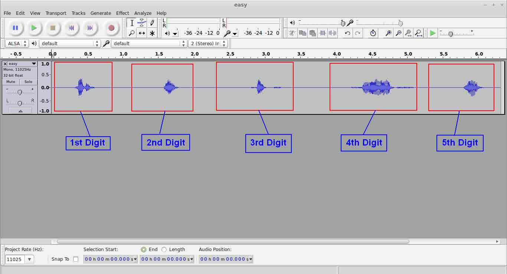
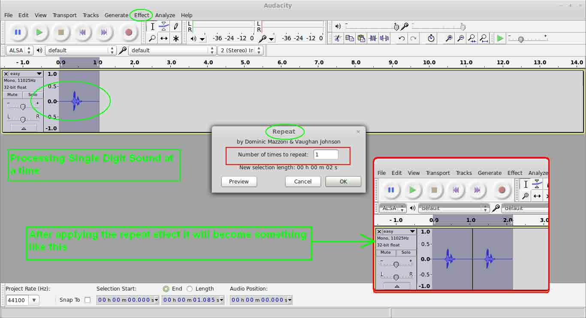
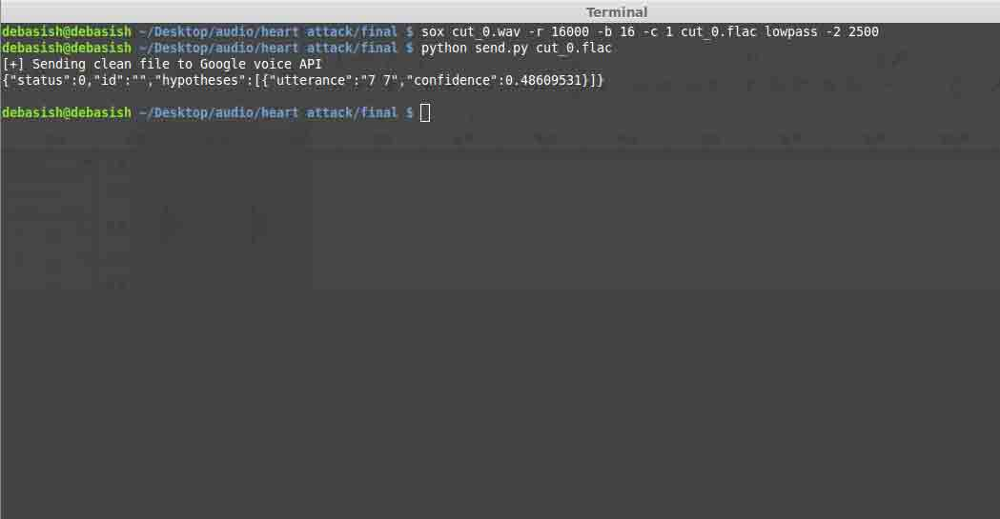
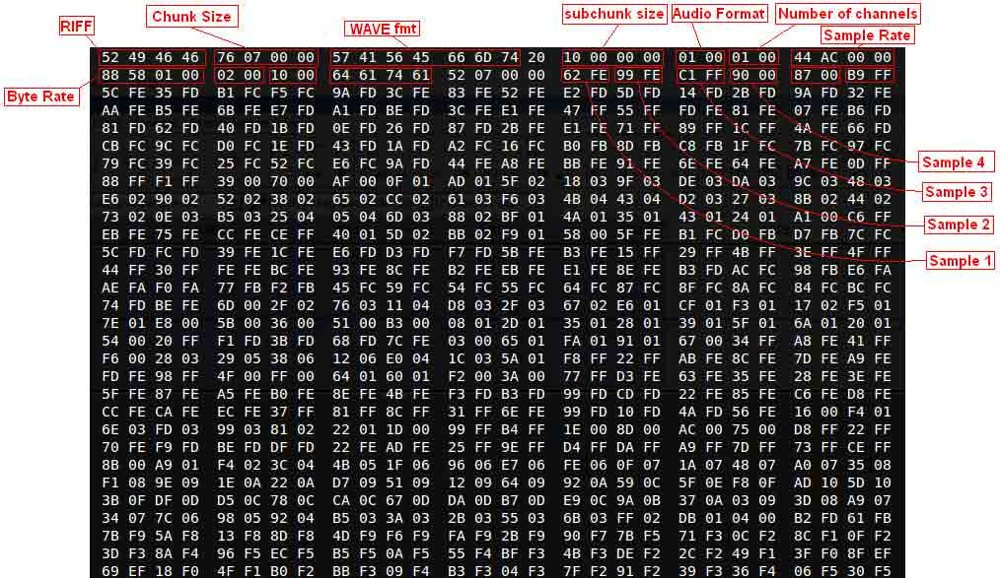
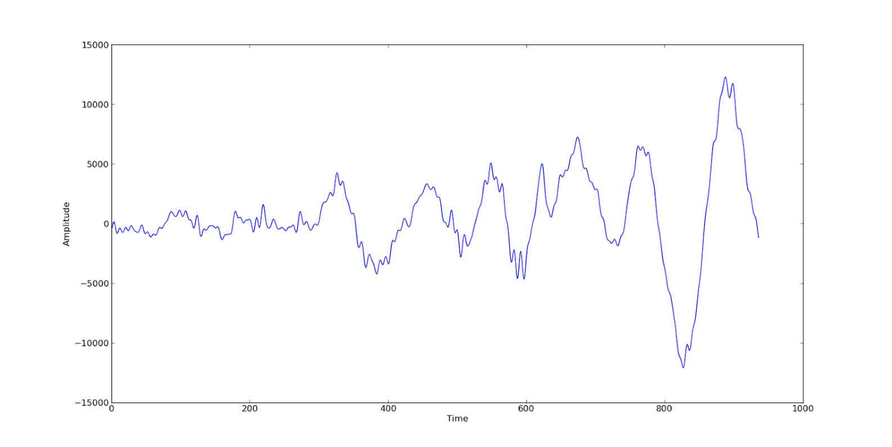
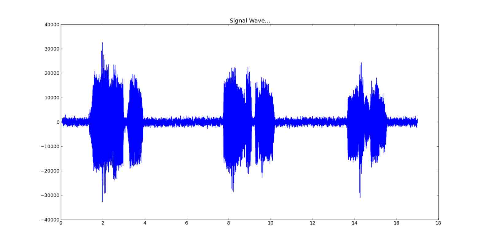
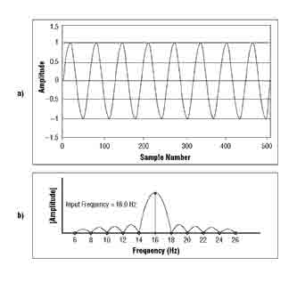

# 本是同根生，相煎何太急-用 Google 语音识别 API 破解 reCaptcha 验证码

2014/04/29 12:16 | [A 胖](http://drops.wooyun.org/author/A 胖 "由 A 胖 发布") | [漏洞分析](http://drops.wooyun.org/category/papers "查看 漏洞分析 中的全部文章") | 占个座先 | 捐赠作者

from：http://www.debasish.in/2014/04/attacking-audio-recaptcha-using-googles.html

## 0x00 背景

* * *

关于验证码和验证码破解的入门，请看：[`drops.wooyun.org/tips/141`](http://drops.wooyun.org/tips/141)

什么是 reCaptcha？

reCaptchas 是由 Google 提供的基于云的验证码系统，通过结合程序生成的验证码和较难被 OCR 识别的图片，来帮助 Google 数字化一些书籍，报纸和街景里的门牌号等。



reCaptcha 同时还有声音验证码的功能，用来给盲人提供服务。

## 0x01 细节

* * *

中心思想：

用 Google 的 Web Speech API 语音识别来破解它自己的 reCaptcha 声音验证码.



下面来看一下用来语音识别的 API

Chrome 浏览器内建了一个基于 HTML5 的语音输入 API，通过它，用户可以通过麦克风输入语音，然后 Chrome 会识别成文字，这个功能在 Android 系统下也有。如果你不熟悉这个功能的话这里有个 demo:
[`www.google.com/intl/en/chrome/demos/speech.html`](https://www.google.com/intl/en/chrome/demos/speech.html)

我一直很好奇这个语音识别 API 是如何工作的，是通过浏览器本身识别的还是把音频发送到云端识别呢？

通过抓包发现，好像的确会把语音发送到云端，不过发送出去的数据是 SSL 加密过的。

于是我开始翻 Chromium 项目的源码，终于我找到了有意思的地方：

[`src.chromium.org/viewvc/chrome/trunk/src/content/browser/speech/`](http://src.chromium.org/viewvc/chrome/trunk/src/content/browser/speech/)

实现过程非常简单，首先从 mic 获取音频数据，然后发送到 Google 的语音识别 Web 服务，返回 JSON 格式的识别结果。 用来识别的 Web API 在这里:

[`www.google.com/speech-api/v1/recognize`](https://www.google.com/speech-api/v1/recognize)

比较重要的一点是这个 API 只接受 flac 格式的音频(无损格式，真是高大上)。

既然知道了原理，写一个利用这个识别 API 的程序就很简单了。

```
./google_speech.py hello.flac

```

源代码：

```
'''
Accessing Google Web Speech API using Pyhon
Author : Debasish Mandal

'''

import httplib
import sys

print '[+] Sending clean file to Google voice API'
f = open(sys.argv[1])
data = f.read()
f.close()
google_speech = httplib.HTTPConnection('www.google.com')
google_speech.request('POST','/speech-api/v1/recognize?xjerr=1&client=chromium&lang=en-US',data,{'Content-type': 'audio/x-flac; rate=16000'})
print google_speech.getresponse().read()
google_speech.close()

```

研究了一下 reCaptcha 的语音验证码后，你会发现基本上有两种语音验证码，一种是非常简单的，没有加入很多噪音，语音也很清晰。另外一种是非常复杂的，故意加了很多噪音，连真人很难听出来。这种验证码里面估计加了很多嘶嘶的噪声，并且用很多人声作为干扰。

关于这个语音验证码的细节可以参考这里[`groups.google.com/forum/#!topic/recaptcha/lkCyM34zbJo`](https://groups.google.com/forum/#!topic/recaptcha/lkCyM34zbJo)

在这篇文章中我主要写了如何解决前一种验证码，虽然我为了破解后一种复杂的验证码也做了很多努力，但是实在是太困难了，即使是人类对于它的识别率也很低。

用户可以把 recaptcha 的语音验证码以 mp3 格式下载下来，但是 Google 语音识别接口只接受 flac 格式，所以我们需要对下载回来的 mp3 进行一些处理然后转换成 flac 再提交。

我们先手工验证一下这样行不行：

首先把 recaptcha 播放的音频下载成 mp3 文件。

然后用一个叫 Audacity 的音频编辑软件打开,如图



把第一个数字的声音复制到新窗口中，然后再重复一次，这样我们把第一位数字的声音复制成连续的两个相同声音。

比如这个验证码是 76426，我们的目的是把 7 先分离出来，然后让 7 的语音重复两次。



最后把这段音频保存成 wav 格式，再转换成 flac 格式,然后提交到 API。

```
debasish@debasish ~/Desktop/audio/heart attack/final $ sox cut_0.wav -r 16000 -b 16 -c 1 cut_0.flac lowpass -2 2500
debasish@debasish ~/Desktop/audio/heart attack/final $ python send.py cut_0.flac 

```



很好，服务器成功识别了这段音频并且返回了正确的结果，下面就需要把这个过程自动化了。

在自动提交之前，我们需要了解一下数字音频是处理什么原理。

这个 stackoverflow 的问题是个很好的教程:

[`stackoverflow.com/questions/732699/how-is-audio-represented-with-numbers`](http://stackoverflow.com/questions/732699/how-is-audio-represented-with-numbers)

把一个 wav 格式的文件用 16 进制编辑器打开:



用 Python WAVE 模块处理 wav 格式的音频:

wave 模块提供了一个很方便接口用来处理 wav 格式:

```
import wave 
f = wave.open('sample.wav', 'r') 
print '[+] WAV parameters ',f.getparams() 
print '[+] No. of Frames ',f.getnframes() 
for i in range(f.getnframes()): 
    single_frame = f.readframes(1) 
    print single_frame.encode('hex') 
f.close()

```

getparams()函数返回一个元组，内容是关于这个 wav 文件的一些元数据，例如频道数量，采样宽度，采样率，帧数等等。

getnframes()返回这个 wav 文件有多少帧。

运行这个 python 程序后，会把 sample.wav 的每一帧用 16 进制表示然后 print 出来

```
[+] WAV parameters (1, 2, 44100, 937, 'NONE', 'not compressed')  
[+] No. of Frames 937  
[+] Sample 0 = 62fe    <- Sample 1  
[+] Sample 1 = 99fe   <- Sample 2  
[+] Sample 2 = c1ff    <- Sample 3  
[+] Sample 3 = 9000  
[+] Sample 4 = 8700  
[+] Sample 5 = b9ff  
[+] Sample 6 = 5cfe  
[+] Sample 7 = 35fd  
[+] Sample 8 = b1fc  
[+] Sample 9 = f5fc  
[+] Sample 10 = 9afd  
[+] Sample 11 = 3cfe  
[+] Sample 12 = 83fe  
[+] .... 
```

从输出文件中我们可以看到，这个 wav 文件是单通道的,每个通道是 2 字节长，因为音频是 16 比特的，我们也可以用 getsampwidth()函数来判断通道宽度，getchannels() 可以用来确定音频是单声道还是立体声。

接下来对每帧进行解码，这个 16 进制编码实际上是小端序保存的(little-endian),所以还需要对这段 python 程序做一些修改，并且利用 struct 模块把每帧的值转换成带符号的整数。

```
import wave 
import struct 

f = wave.open('sample.wav', 'r') 
print '[+] WAV parameters ',f.getparams() 
print '[+] No. of Frames ',f.getnframes() 
for i in range(f.getnframes()): 
    single_frame = f.readframes(1) 
    sint = struct.unpack('<h', single_frame) [0]
    print "[+] Sample ",i," = ",single_frame.encode('hex')," -> ",sint[0] 
f.close()

```

修改完毕后再次运行，输出内容差不多这样:

```
[+] WAV parameters (1, 2, 44100, 937, 'NONE', 'not compressed')
[+] No. of Frames 937
[+] Sample 0 = 62fe -> -414
[+] Sample 1 = 99fe -> -359
[+] Sample 2 = c1ff -> -63
[+] Sample 3 = 9000 -> 144
[+] Sample 4 = 8700 -> 135
[+] Sample 5 = b9ff -> -71
[+] Sample 6 = 5cfe -> -420
[+] Sample 7 = 35fd -> -715
[+] Sample 8 = b1fc -> -847
[+] Sample 9 = f5fc -> -779
[+] Sample 10 = 9afd -> -614
[+] Sample 11 = 3cfe -> -452
[+] Sample 12 = 83fe -> -381
[+] Sample 13 = 52fe -> -430
[+] Sample 14 = e2fd -> -542 
```

这样是不是更明白了?下面用 python 的 matplotlib 画图模块把这些数值画出来:

```
import wave 
import struct 
import matplotlib.pyplot as plt 

data_set = [] 
f = wave.open('sample.wav', 'r') 
print '[+] WAV parameters ',f.getparams() 
print '[+] No. of Frames ',f.getnframes() 
for i in range(f.getnframes()): 
    single_frame = f.readframes(1)
    sint = struct.unpack('<h', single_frame)[0]
    data_set.append(sint) 
f.close() 
plt.plot(data_set) 
plt.ylabel('Amplitude')
plt.xlabel('Time') 
plt.show()

```



这个图实际上就是声音的波形图

进一步自动化:

下面这段 python 程序通过音量不同把音频文件分割成多个音频文件，相当于图片验证码识别中的图片分割步骤。

```
'''
简单的基于音量的音频文件分割程序  

作用:   

1\. 简单的降噪处理  
2\. 识别文件中的高音量部分  
3\. 根据高音量部分的数目把文件分割成独立文件  

'''  

import wave
import sys
import struct
import os
import time
import httplib
from random import randint

ip = wave.open(sys.argv[1], 'r')
info = ip.getparams()
frame_list = []
for i in range(ip.getnframes()):
    sframe = ip.readframes(1)
    amplitude = struct.unpack('<h', sframe)[0]
    frame_list.append(amplitude)
ip.close()
for i in range(0,len(frame_list)):
    if abs(frame_list[i]) < 25:
        frame_list[i] = 0
################################  Find Out most louder portions of the audio file ###########################
thresh = 30
output = []
nonzerotemp = []
length = len(frame_list)
i = 0
while i < length:
    zeros = []
    while i < length and frame_list[i] == 0:
        i += 1
        zeros.append(0)
    if len(zeros) != 0 and len(zeros) < thresh:
        nonzerotemp += zeros
    elif len(zeros) > thresh:
        if len(nonzerotemp) > 0 and i < length:
            output.append(nonzerotemp)
            nonzerotemp = []
    else:
        nonzerotemp.append(frame_list[i])
        i += 1
if len(nonzerotemp) > 0:
    output.append(nonzerotemp)

chunks = []
for j in range(0,len(output)):
    if len(output[j]) > 3000:
        chunks.append(output[j])
#########################################################################################################

for l in chunks:
    for m in range(0,len(l)):
        if l[m] == 0:
             l[m] = randint(-0,+0)

inc_percent = 1 #10 percent

for l in chunks:
    for m in range(0,len(l)):
        if l[m] <= 0:
            # negative value
            l[m] = 0 - abs(l[m]) + abs(l[m])*inc_percent/100
        else:
            #positive vaule
            l[m] =     abs(l[m]) + abs(l[m])*inc_percent/100

########################################################

# Below code generates separate wav files depending on the number of loud voice detected.

NEW_RATE = 1 #Change it to > 1 if any amplification is required

print '[+] Possibly ',len(chunks),'number of loud voice detected...'
for i in range(0, len(chunks)):
    new_frame_rate = info[0]*NEW_RATE
    print '[+] Creating No. ',str(i),'file..'
    split = wave.open('cut_'+str(i)+'.wav', 'w')
    split.setparams((info[0],info[1],info[2],0,info[4],info[5]))
#   split.setparams((info[0],info[1],new_frame_rate,0,info[4],info[5]))

    #Add some silence at start selecting +15 to -15
    for k in range(0,10000):
        single_frame = struct.pack('<h', randint(-25,+25))
        split.writeframes(single_frame)
    # Add the voice for the first time
    for frames in chunks[i]:
        single_frame = struct.pack('<h', frames)
        split.writeframes(single_frame)

    #Add some silence in between two digits
    for k in range(0,10000):
        single_frame = struct.pack('<h', randint(-25,+25))
        split.writeframes(single_frame)

    # Repeat effect :  Add the voice second time
    for frames in chunks[i]:
        single_frame = struct.pack('<h', frames)
        split.writeframes(single_frame)

    #Add silence at end
    for k in range(0,10000):
        single_frame = struct.pack('<h', randint(-25,+25))
        split.writeframes(single_frame)

    split.close()#Close each files

```

当这个文件被分割成多份之后我们可以简单的把他们转换成 flac 格式然后把每个文件单独发送到 Google 语音识别 API 进行识别。

视频已翻墙下载回来：

[Solving reCaptcha Audio Challenge using Google Web Speech API Demo](http://static.wooyun.org/20141017/2014101712314129505.mp4)

现在我们已经解决了简单的音频验证码，我们再来尝试一下复杂的。

这个图片是用前面的程序画出来的复杂语音验证码的波形图:



从图里我们可以看到，这段音频中一直存在一个恒定的噪声，就是中间横的蓝色的那条，对于这样的噪声我们可以用标准的离散傅里叶变换，通过快速傅里叶变换 fast Fourier transform(挂在高树上的注意了!)来解决。

回到多年前校园中的数字信号处理这门课，让我们在纯洁的正弦波 `s(t)=sint(w*t)`上叠加一个白噪声，`S(t)=S(t+n)`, F 为 S 的傅里叶变换，把频率高于和低于 w 的 F 值设为 0，噪声就被这样过滤掉了。



比如这张图里，正弦波的频谱域被分离了出来，只要把多余频率切掉，再逆变换回去就相当于过滤掉部分噪音了。其实自己写这样的过滤器实在太蛋疼了，Python 有不少音频处理库并且自带降噪滤镜。

但是就像识别图形验证码一样，噪音(相当于图片里的干扰线和噪点)并不是破解语音验证码的难点，对于计算机来说，最难的部分还是分割，在复杂的语音验证码里，除了主要的人声之外，背景中还有 2，3 个人在念叨各种东西，并且音量和主要的声音差不多，无法通过音量分离，这样的手段即使对于人类也很难识别的出。

我把目前的代码放在了[`github.com/debasishm89/hack_audio_captcha`](https://github.com/debasishm89/hack_audio_captcha)

这些代码还很原始，有很大改进的余地。

## 0x02 结论

* * *

我把这个问题报给了 Google 安全团队，他们说这个东西就是这样设计的(苦逼的作者),如果系统怀疑对方不是人是机器的时候会自动提升到高难度验证码，目前 Google 不打算改进这个设计。

版权声明：未经授权禁止转载 [A 胖](http://drops.wooyun.org/author/A 胖 "由 A 胖 发布")@[乌云知识库](http://drops.wooyun.org)

分享到：

### 相关日志

*   [CDN 流量放大攻击思路](http://drops.wooyun.org/papers/679)
*   [深入了解 SQL 注入绕过 waf 和过滤机制](http://drops.wooyun.org/tips/968)
*   [Python Pickle 反序列化带来的安全问题](http://drops.wooyun.org/papers/66)
*   [Google Chrome 开发者工具漏洞利用](http://drops.wooyun.org/papers/974)
*   [Java 安全模型介绍](http://drops.wooyun.org/tips/53)
*   [窃听风暴： Android 平台 https 嗅探劫持漏洞](http://drops.wooyun.org/papers/959)