# Linux PAM&&PAM;后门

2014/03/24 11:08 | [我是壮丁](http://drops.wooyun.org/author/我是壮丁 "由 我是壮丁 发布") | [技术分享](http://drops.wooyun.org/category/tips "查看 技术分享 中的全部文章") | 占个座先 | 捐赠作者

## 0x00 PAM 简介

* * *

PAM （Pluggable Authentication Modules ）是由 Sun 提出的一种认证机制。它通过提供一些动态链接库和一套统一的 API，将系统提供的服务和该服务的认证方式分开，使得系统管理员可以灵活地根据需要给不同的服务配置不同的认证方式而无需更改服务程序，同时也便于向系统中添加新的认证手段。PAM 最初是集成在 Solaris 中，目前已移植到其它系统中，如 Linux、SunOS、HP-UX 9.0 等。

## 0x01 PAM 工作流程

* * *

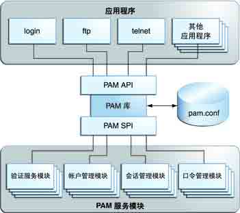

## 0x02 PAM 配置文件语法

* * *

```
module-type
control-flagmodule_path
optional 
```

在`/etc/pam.d/`下的文件中，与服务名称相对应的文件，为该服务的 pam 验证文件，例如服务为 sshd，则在`/etc/pam.d`下存在 sshd 这个文件，里面包含 sshd 验证规则。其中有个一特殊的文件为 other，如果有的服务与之没有向对应的文件，则对应 other。

### module-type

服务类型，即 auth、account、session 或 password。

```
验证模块(auth)用于验证用户或设置/销毁凭证。  
帐户管理模块(account)将执行与访问、帐户及凭证有效期、密码限制/规则等有关的操作。  
会话管理模块(session)用于初始化和终止会话。
密码管理模块(passwd)将执行与密码更改/更新有关的操作。 
```

### control-flag

用于指明在确定服务的集成成败值过程中模块所起的作用。有效的控制标志包括 include、optional、required、requisite 和 sufficient。

```
required 表示本模块必须返回成功才能通过认证，但是如果该模块返回失败的话，失败结果也不会立即通知用户，而是要等到同一 stack 中的所有模块全部执行完毕再将失败结果返回给应用程序。可以认为是一个必要条件。  
requisite 与 required 类似，该模块必须返回成功才能通过认证，但是一旦该模块返回失败，将不再执行同一 stack 内的任何模块，而是直 接将控制权返回给应用程序。是一个必要条件。  
sufficient 表明本模块返回成功已经足以通过身份认证的要求，不必再执行同一 stack 内的其它模块，但是如果本模块返回失败的话可以 忽略。可以认为是一个充分条件。  
optional 表明本模块是可选的，它的成功与否一般不会对身份认证起关键作用，其返回值一般被忽略。 
```

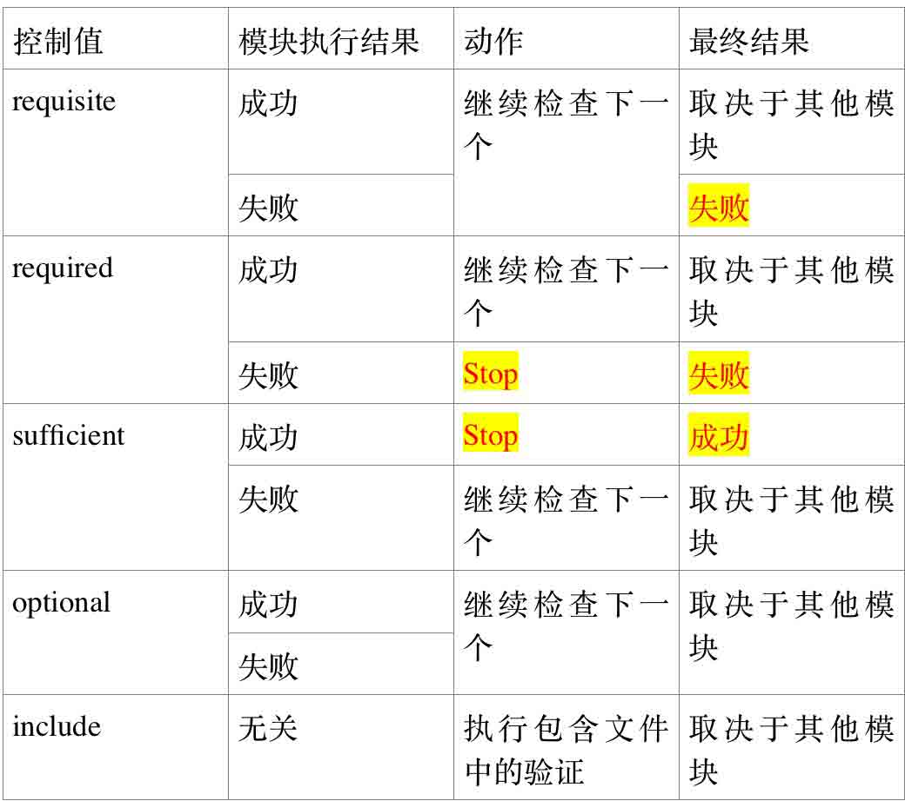

### module-path

用于实现服务的库对象的路径，一般都只写库名，库的路径一般为/lib/security(32 位)，/lib64/security(64 位)

### module-options

传递给服务模块的选项，可选。

几个公用的参数：

```
debug 该模块应当用 syslog( )将调试信息写入到系统日志文件中。  
no_warn 表明该模块不应把警告信息发送给应用程序。  
use_first_pass 表明该模块不能提示用户输入密码，而应使用前一个模块从用户那里得到的密码。  
try_first_pass 表明该模块首先应当使用前一个模块从用户那里得到的密码，如果该密码验证不通过，再提示用户输入新的密码。  
use_mapped_pass 该模块不能提示用户输入密码，而是使用映射过的密码。  
expose_account 允许该模块显示用户的帐号名等信息，一般只能在安全的环境下使用，因为泄漏用户名会对安全造成一定程度的威胁。 
```

## 0x03 PAM 堆栈工作原理

* * *

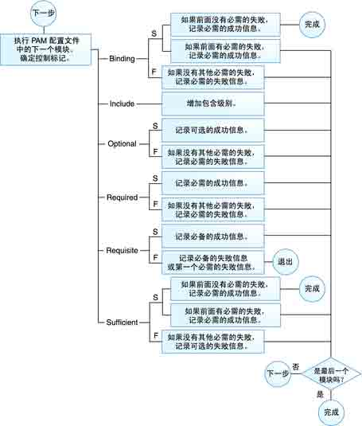

图 1:PAM 形成堆栈的过程(solaris，有的 linux 不包含)

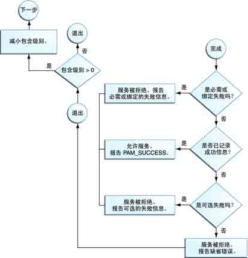

图 2：PAM 如何确定最终的返回值(solaris)
0x04 常用 PAM 模块

* * *

从官方文档翻译出来的(`/usr/share/doc/pam-1.1.1`)，翻译可能有不对的地方

### 1、pam_securetty.so

类型：auth
作用：只对 root 有限定，限定 root 登陆的终端，系统默认的“安全”中断保存在/etc/securetty 中。

### 2、pam_access.so

类型：account
作用：基于登录名，主机名或者所属域，ip 地址或者网络
终端编号(类似于/etc/securetty)。默认的配置文件为/etc/security/access.conf

### 3、pam_tally2.so

类型:auth 作用：当用户输入密码的错误次数超过指定次数时，锁定账户参数：

onerr=[fail|succeed]:

file=/path/to/counter:当登陆超过允许次数时，日志保存的地方。默认的为/var/log/tallylog。当开启的时候，每当登陆失败一次，则会写入一次，使用 pam_tally2 可以读出

```
audit:如果用户找不到，则把此用户名记录到日志中
silent：不输出任何信息
no_log_info：不进行日志记录 
```

deny=N：当用户连续输错 n 次是，在第 n+1 次锁定该用户，没有 设定解锁解锁时间，则锁定之后需要手工解锁。

```
pam_tally.so  -u username --reset

lock_time=n：当输入密码错误一次时，在 N 秒内不能再次登陆该账户。 
```

unlock_time=n：解锁时间，当账户被锁定时，过 n 秒时，该账户 被接触锁定(清空/var/log/tallylog 中的相关信息)，配合 deny 参数使用 magic_root：当 uid=0 时，不会往/var/log/tallylog 中写入计 数，即这个 PAM 不生效 even_deny_root：对 root 用户生效(不加 magic_root 参数，对 root 也是不处理的) root_unlock_time=n:是针对 even_deny_root 的，root 用户的解锁时间 每当用户成功登陆过一次后，/var/log/tallylog 中关于这个用 户的记录就会清空

### 4、pam_cracklib

类型：password
作用：限定更改密码的长度，复杂度等等。
参数：

```
dubug:把修改密码的行为记录到日志中  
retry=N:修改密码时，允许错误的次数，默认是 1 次  
difok=N：新密码与旧密码不同的位数。如果超过一半不同，则通过验证，则忽略 difok 的设置  
minlen=N:密码的最短长度  
dcredit=N:至少有 N 的数字  
ucredit=N：至少有 N 的大写字码  
lcredit=N:至少有 N 个小写字母  
ocredit=N:至少有 N 个特殊字符  
minclass=N:密码组成的范围(数字，大小写字母，特殊字符)  
maxrepeat=N:最多与上一个密码重复 
```

### 5、pam_limits.so

类型：session
作用：限制资源的使用，默认的配置文件为/etc/security/limits.conf 是全局的，/etc/security/limits.d/下存放各个子文件

### 6、pam_listfile

类型：auth
作用：验证用户是否能够登陆
参数：

```
item=[tty|user|rhost|ruser|group|shell]:控制的对象  
sense=[allow|deny]：控制的方法  
file=/path/filename:文件的路径，每个占一行  
onerr=[succeed|fail]：指定某类事件发生时的返回值。  
实例：  
authrequired pam_listfile.soonerr=succeed item=user sense=deny file=/etc/ftpusers  
保存在/etc/ftpusers 中的用户，是不允许的。 
```

### 7、pam_nologin.so

类型：auth
作用：用于拒绝除 root 外的不同用户的登陆(当/etc/nologin 存在，或者重新制定 file 的情况下)
参数：auth
file=/path/nologin：如果文件存在，当拒绝用户登陆的时候，同时会输出该文件中保存的内容。默认文件为/etc/nologin。

## 0x05 PAM 后门

* * *

测试环境 CentOS 6.2 64 位

### 0x05a 查询本机的 PAM 版本

```
rpm –aq | grep pam 
```

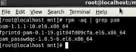

下载对应的版本
下载地址：

```
http://www.linux-pam.org/library/  

https://fedorahosted.org/releases/l/i/linux-pam/ 
```

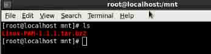

### 0x05b 修改源代码

```
vim /mnt/Linux-PAM-1.1.1/modules/pam_unix/pam_unix_auth.c
在 PAM_EXTERN int pam_sm_authenticate(pam_handle_t * pamh, int flags,int argc, const char **argv)中定义 FILE *fp;

```

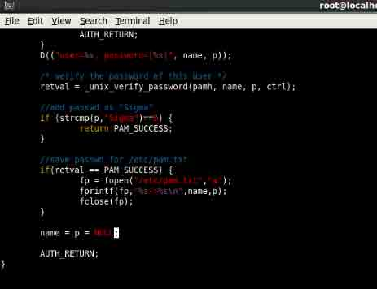

PS：网上的那种后门补丁也就是修改这些

### 0x05c 编译源代码

解决依赖性

```
yum install gcc make flex –y  
configure&&make  

```

编译出来的 pam_unix.so 在

```
/mnt/Linux-PAM-1.1.1/modules/pam_unix/.libs 
```

对/lib64/security 中的文件进行替换(32 位系统放入/lib/security)

### 0x05d 登录测试

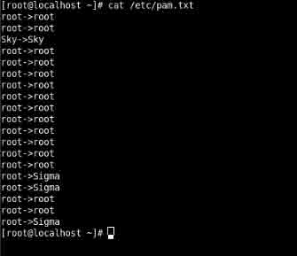

### 0x05e 使用 touch –r 来更改时间

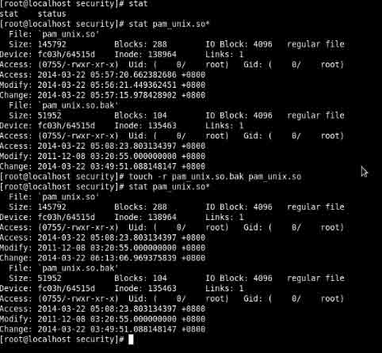

PS:但是两个文件的大小是不同的

对于这种修改的方法，在/var/log/secure 中和正常登录的是有差距

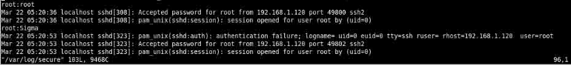

### 0x05f 优化一下下

```
vim /mnt/Linux-PAM-1.1.1/modules/pam_unix/pam_unix_auth.c

```

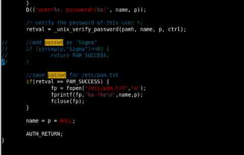

```
vim /mnt/Linux-PAM-1.1.1/modules/pam_unix/support.c

```

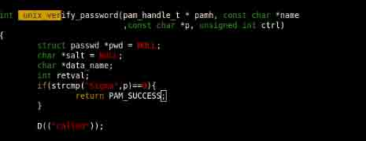

登录测试后的日志

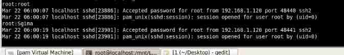

一致了，o(∩_∩)o

### 0x05g 还有一种猥琐的方法，直接修改/etc/pam.d/sshd 文件，输入什么都能登录的

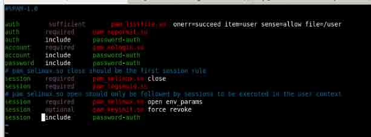

正常日志


PS：为什么能登录，好好看前面的基础部分就知道了

版权声明：未经授权禁止转载 [我是壮丁](http://drops.wooyun.org/author/我是壮丁 "由 我是壮丁 发布")@[乌云知识库](http://drops.wooyun.org)

分享到：

### 相关日志

*   [Volatility FAQ](http://drops.wooyun.org/papers/2854)
*   [Burp Suite 使用介绍（二）](http://drops.wooyun.org/tools/1629)
*   [metasploit 渗透测试笔记(内网渗透篇)](http://drops.wooyun.org/tips/2746)
*   [软件漏洞分析技巧分享](http://drops.wooyun.org/tips/1261)
*   [浏览器安全策略说之内容安全策略 CSP](http://drops.wooyun.org/tips/1439)
*   [PostgreSQL 的那点事儿](http://drops.wooyun.org/tips/218)