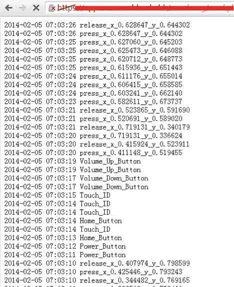
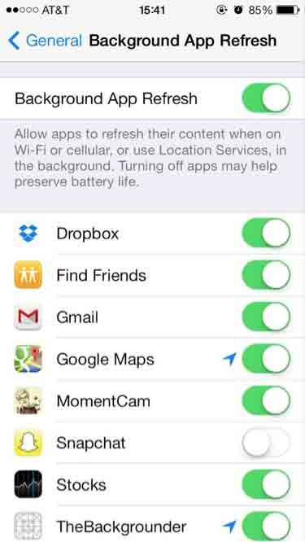

# 苹果爆出新漏洞可被恶意 APP 利用记录用户键盘输入

2014/02/26 18:25 | [News](http://drops.wooyun.org/author/news "由 News 发布") | [业界资讯](http://drops.wooyun.org/category/news "查看 业界资讯 中的全部文章") | 占个座先 | 捐赠作者

有安全研究人员发现了苹果的另一个漏洞，可以被用来记录你在 iOS 设备上的每一个动作。

FireEye 声称，此漏洞利用的是 iOS 在多任务处理时的缺陷。

FireEye 发现了一种可以绕过苹果的应用审查过程，并在非越狱的 iOS7 上成功利用。

恶意 app 可以在后台运行，允许黑客监视用户的所有活动，包括触摸屏，home 按键，音量按钮，并将收集的数据发送到远程服务器上。

根据研究，该漏洞存在于 7.0.4，7.0.5，7.0.6 和 6.1.X 的版本中。

在 iOS 设备上，允许在后台的应用自我刷新，在 iOS 7 上，可以自己设置是否允许自我刷新，但是这个选项并不能阻止恶意 app 利用该漏洞进行键盘记录。

例如一个播放音乐的 APP 可以，可以在关闭后台自我刷新的情况下后台播放音乐，那么恶意 APP 就可以伪装成音乐 APP 进行监控，目前唯一的办法就是删除该恶意 APP。

版权声明：未经授权禁止转载 [News](http://drops.wooyun.org/author/news "由 News 发布")@[乌云知识库](http://drops.wooyun.org)

分享到：

### 相关日志

*   [马航 MH370 航班被黑了？](http://drops.wooyun.org/news/1202)
*   [通过伪造乌克兰相关文件进行传播的恶意软件 MiniDuke](http://drops.wooyun.org/news/1373)
*   [网络安全威胁周报——第 201410 期](http://drops.wooyun.org/news/1034)
*   [NSA 暗中监视中国政府和企业网络（目标华为）](http://drops.wooyun.org/news/1289)
*   [APPLE IOS 7.1 修复了超过 20 个代码执行的漏洞](http://drops.wooyun.org/news/1057)
*   [GnuTLS 和 Apple 证书验证的 bugs 并非为同一个](http://drops.wooyun.org/news/1021)