# 对 *nix WEB 服务器的一个隐藏威胁

2014/07/28 11:45 | [lxj616](http://drops.wooyun.org/author/lxj616 "由 lxj616 发布") | [技术分享](http://drops.wooyun.org/category/tips "查看 技术分享 中的全部文章"), [运维安全](http://drops.wooyun.org/category/%e8%bf%90%e7%bb%b4%e5%ae%89%e5%85%a8 "查看 运维安全 中的全部文章") | 占个座先 | 捐赠作者

**from:https://www.virusbtn.com/virusbulletin/archive/2014/07/vb201407-Mayhem**

## 0x01 简介

* * *

网站甚至整个服务器被感染越来越普遍。通常这种感染被用来窃听通讯，黑帽 SEO，盗链下载，诸如此类。并且在绝大多数的案例中这种恶意软件由相对比较简单的 PHP 脚本组成。但是在最近的两年里，许多更加复杂的恶意软件家族被发现。Mayhem 是一个针对网站服务器的多用途模块化 bot。我们的团队研究了这个 bot 以获取对其不只是恶意软件客户端的理解，也了解了一些它的 C&C 服务器指令，这允许我们去搜集一些统计数据。 这篇文章应当被认为是 Malware Must Die 团队之前发表文章[1](http://static.wooyun.org/20141017/2014101714270388631_jpg.jpg)的补充。我们在 2014 年 4 月遭遇了 Mayhem bot，并且这篇文章是我们独立研究的结果。[2](http://static.wooyun.org/20141017/2014101714270370123_jpg.jpg)是我们找到的唯一另外关于 Mayhem 的出版物。在我们的研究中，我们也发现 Mayhem 是一个更大的‘Fort Disco’暴力破解运动（在[3](http://static.wooyun.org/20141017/2014101714270449278_jpg.jpg)被公开）的延续

## 0x02 恶意软件展示

* * *

首先，这一部分的恶意软件表现为一段 PHP 脚本。我们分析了这个 PHP 病毒释放器版本的 SHA256 hash：`b3cc1aa3259cd934f56937e6371f270c23edf96d2c0801 728b0379dd07a0a035.` 用 VirusTotal 分析这段脚本的结果呈现在 表格一 中

|       Date      |       VirusTotal results      |
|       2014-06-17      |       3/54      |
|       2014-06-05      |       3/51      |
|       2014-06-03      |       3/52      |
|       2014-04-06      |       1/51      |
|       2014-03-18      |       1/49      |

表格一 使用 VirusTotal 检查 PHP 病毒释放器的结果

在执行过后，这段脚本 kill 了所有‘/usr/bin/host’进程，识别系统架构(x64 还是 x86)以及系统类型(Linux 还是 FreeBSD)，然后释放一个恶意的动态链接库命名为‘libworker.so’。这段代码也定义了一个变量‘AU’，其中保存了这段脚本被执行的完整 URL。这段 PHP 脚本的第一部分显示在 图表一 中

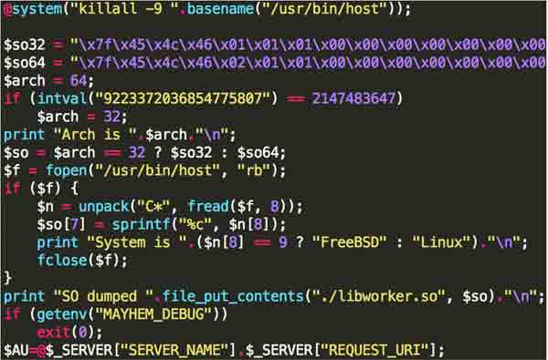

图表一 PHP 病毒释放器的第一部分

在那之后，这个 PHP 病毒释放器创建了一个 Shell 脚本叫做‘1.sh’，这个脚本的内容如图表二所述。除此之外，这段脚本也创建了环境变量‘AU’，这和在 PHP 脚本中定义的那个一样。

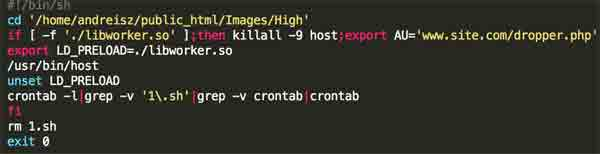

图表二 ‘1.sh’脚本的内容

然后这个 PHP 病毒释放器通过运行命令‘at now -f 1.sh’ 执行了这段 SHELL 脚本。这个命令添加了一个计划任务。在执行之后，这个病毒释放器等待最多 5 秒钟的时间，然后就删除计划任务。如果执行‘at’命令失败，这个病毒释放器就会直接运行‘1.sh’脚本。这部分 PHP 病毒释放器的代码如 图表三 所示

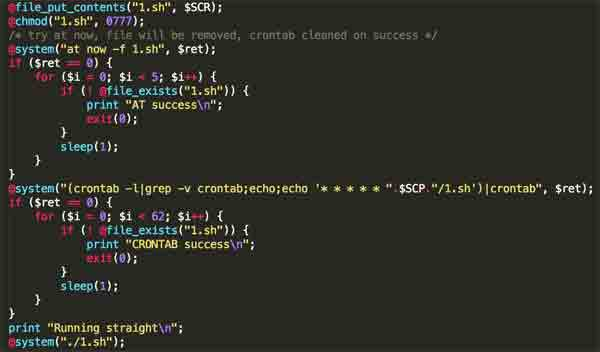

图表三 PHP 病毒释放器的最后一部分

## 0x03 动态链接库初始化

* * *

LD_PRELOAD 技术允许第一个载入动态链接库并且允许它轻易 hook 到不同的函数中。如果在这样的动态链接库中一个标准的库函数被覆写，那么这个库将会拦截所有的对那个函数的调用。这个恶意的样本包含了它自己实现的‘exit’函数，所以被‘/usr/bin/host’调用时这一个恶意函数替代了原始的函数。 在被 hooked 的‘exit’函数执行过程中，调用了一个额外的初始化函数，这个函数的工作流程如 图表四 所示。在这个初始化过程中，如下步骤被执行：

• 一个只包含了‘exit’函数的 ELF 文件被释放

• 这个进程 forks 然后子进程运行 ELF 文件然后结束它的执行

• 父进程执行更多的初始化工作：它试着去连接 Google DNS 服务(IP 地址是 8.8.8.8)，解密并且解析配置文件然后获取系统的各种参数

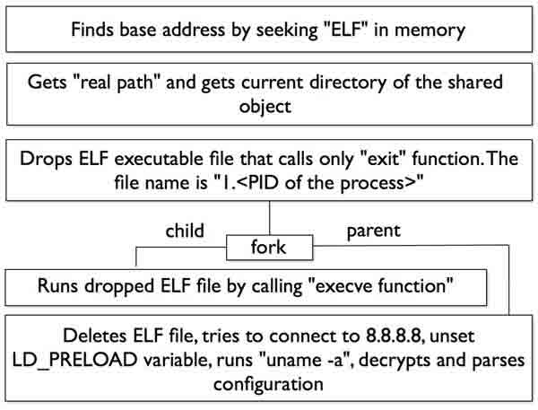

图表四 初始化函数的工作流程

一旦初始化结束，这个动态链接库文件就被从硬盘上删除。这个恶意软件之后试着去打开一个文件即一个隐藏文件系统并映射到内存，然后一个隐藏的文件系统就被初始化了。然后这个进程 forks，父进程退出，然后子进程继续执行。 关于被 hooked 的‘exit’函数高度抽象的工作流程如 图表五 所示。成功被执行的运行路线在流程图上用红色标识。正如你所见，执行的路线既不是单纯父进程或者单纯子进程。我们假设这是一种针对那些在 fork 后设置了只跟踪子进程执行或者只跟踪父进程执行的调试者的反调试技巧。

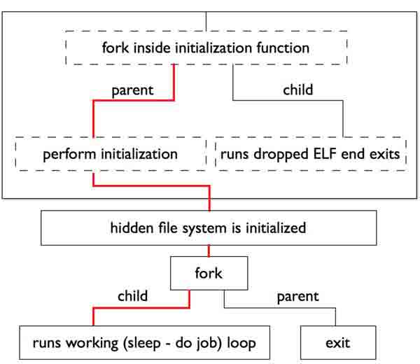

图表五 被 hooked 的‘exit’函数高度抽象的工作流程

在这些步骤之后，子进程（唯一仍然存活的）运行恶意程序的主循环。这个恶意程序将等待配置中设置的时间然后运行做实际工作的函数

## 0x04 主循环函数

* * *

这个函数首先建立起一个 socket 以用来和 C&C 服务器通讯，然后检查被感染的宿主主机的信息是否自这个有效的 session 开始，也就是指，自恶意软件被执行开始，已经被发送到 C&C。如果 flag 标识信息已经被成功送达 C&C 服务器，这个恶意软件发送一个 ping 数据包，然后接收并且执行 C&C 命令。

如果这个 flag 标识信息还没有被成功送达，这个恶意软件会准备一个包含了‘uname -a’命令输出，被感染系统的架构信息，的 HTTP 数据包，以及关于系统用户执行进程的权限信息。在这个数据包被发送后，这个恶意软件读取 C&C 的响应然后如果有错误产生就会退出这个函数。如果一切都正常，这个恶意软件更新 flag 并且试着读取并执行其他 C&C 响应中的命令。 一个高度抽象的的主循环函数工作流程如 图表六 所示

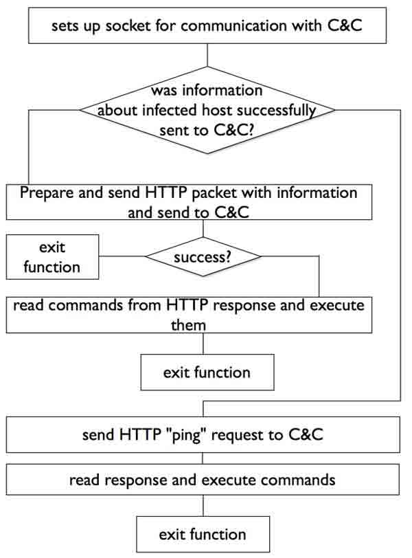

图表六 动态链接库主循环函数高度抽象的工作流程

在工作中，恶意软件包含了 4 个列表和 2 个队列。一个队列用于输入的字符串（从 C&C 服务器接收的字符串），然后另一个队列用于输出字符串（将被发送到 C&C 服务器的字符串）。第一个列表用来存储插件工作函数的地址，第二个列表存储在写到 socket 之前处理数据的函数地址（用来传输数据到 C&C 的那个），第三个列表用来存储从 socket 读出数据前数据处理函数的地址（从 C&C 接收到的数据），并且第四个用来存储将会从字符串队列中处理数据的函数地址。图表七展示了这些队列和列表是怎样在恶意软件的工作流程中被使用的 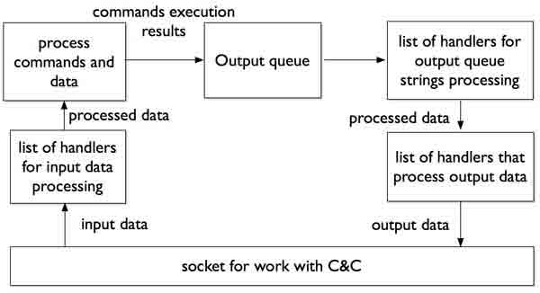

图表七 数据从 C&C 服务器读取时的工作流程

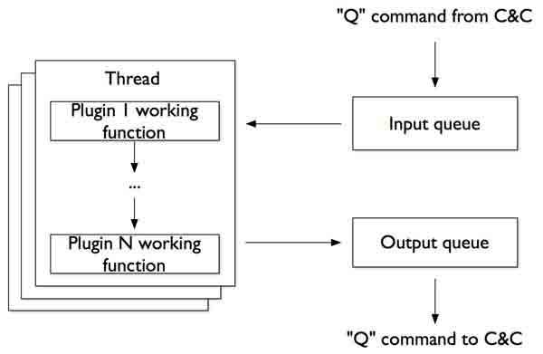

图表八 展示了恶意软件处理任务时的工作流程

图表八 插件处理字符串的工作流程

## 0x05 C&C 命令

* * *

在 C&C 服务器与恶意软件通讯时有七种不同的命令被用到。这些命令可以被分成两组：输入指令（C&C 到 bot）和输出指令（bot 到 C&C）。所有的这些命令都是在 HTTP POST 请求和响应中发送的，也就是说，输入指令在 HTTP POST 请求中传送，而输出指令在对 POST 请求的 HTTP 响应中传送。

**‘R’指令（输出）**

通过发送这个命令这个恶意软件通知 C&C 它已经成功加载并且准备好工作了。如果 WEB 服务器在 root 权限下运行，发送给 C&C 的‘R’指令格式如下：

```
R,20130826,<系统架构 - 64 或者 32>,<‘/usr/bin/host’ ELF header EI_OSABI 的值 >, 
ROOT,<‘uname -a’命令的输出> 
```

如果 WEB 服务器在受限的权限下运行，那么命令是相同的，但是‘ROOT’取而代之的是 getenv(‘AU’)的输出 – PHP 脚本开始执行恶意软件的 URL。如果一切都正常，C&C 服务器返回‘R,200’

**‘G’指令（输入）**

这个指令是 C&C 服务器发送给恶意软件的。这个指令有着如下的格式：

```
G,<任务 ID> 
```

如果这个当前的任务 ID 与接收的 ID 不相等，这个恶意软件将会完成当前运行的任务并且开启一定数目的新工作线程。工作线程的数目是被‘L’命令设置的 **‘F’指令（输出）** 这个指令用来从服务器上请求文件。如果这个恶意软件想要请求一个新的文件，它会发送如下的命令：

```
F,<文件名>,0 
```

如果恶意软件想要检查之前获取的文件是否还有更新的版本，它会发送：

```
F,<文件名>,<文件的 CRC32 校验> 
```

如果文件没有在 C&C 服务器上找到，服务器会响应： F,404,<文件名>

如果文件自从被接受之后就没有被改变，C&C 将会响应：

```
F,304,- 
```

如果新建的或者更新的文件被找到，服务器将会响应：

```
F,200,<文件名>,<BASE64 编码的文件数据> 
```

在接收到携带数据的命令后，这个恶意程序解码 base64 然后写到硬盘上的隐藏文件系统中。然后它试着去确定接收到的文件是否是个插件。如果这个文件是一个插件，这个恶意程序检查其存储在没有使用的 ELF 头部 field 中的 CRC32 校验，然后把这个插件载入内存

**‘L’命令（输入）** ‘L’命令被 C&C 服务器用来配置恶意软件并且让它加载一个插件。如果 C&C 想要配置这个恶意软件的 core 模块，它将会发送：

```
L,core,<工作线程数目>,<sleep timeout>,<socket timeout> 
```

在接受到这个指令后，这个恶意软件将会完成所有的工作线程，然后更新工作线程数目，sleep timeout 和 socket timeout 如果 C&C 想要恶意软件装载一个插件，它将会发送：

```
L,<插件文件名>,<用逗号分隔的插件参数> 
```

如果这个恶意软件接受到这个命令并且其他的插件已经运行，正在运行的插件将会被终止并且将会从隐藏文件系统中把新的插件找出来。如果查找失败，一个带着插件的文件将被从 C&C 通过 F 指令请求过来。然后这个插件将被加载、初始化、然后运行

**‘Q’指令（输入&输出）** 这个指令被用来从 C&C 到恶意软件-反之亦然 传输工作数据。如果这个 C&C 想要添加一个字符串到恶意软件的处理队列中，它将会发送： Q,string 所有的这些字符串被加入了恶意软件的输入队列并且将会被正在运行的插件处理。如果这个恶意软件想要上传它工作的结果，它将会发送： Q,<插件名称>, <结果字符串>

然后把这些字符串从它的输出队列中删除

**‘P’指令（输出）** 这个指令被这个恶意软件用来发送它的当前状态给 C&C 服务器。这个指令的格式为：

P,<任务运行的 flag>,<unknown>,<工作线程计数>,<每秒从服务器读写请求数>,<自从设置为 0 后对服务器总读写操作数></unknown>

**‘S’指令（输入）**

如果这个恶意软件接收到这个指令它将会完成所有当前工作的线程，清空输入和输出队列并且释放其他的系统资源。在那之后，它将会准备好处理一个新的任务。 **总结** 总而言之，这些指令如下所示： 输出指令： R –回送报告 F – 请求文件 Q – 发送数据 P – 报告状态 输入指令： G – 运行新的任务 L – 加载插件 Q – 发送数据 S – 终止当前的任务

## 0x06 配置

* * *

动态链接库在数据段存储了加密形式的配置信息。解密的 key 也存储在数据段中。首先，只有头 8 个字节被解密，然后这个恶意软件检查后 4 个字节是否与 0xDEADBEEF 相等。如果是这样，那么头 4 个字节代表了加密数据的长度。在这之后，剩下的密文就可以解密了。图表九 展示了解密算法的伪代码

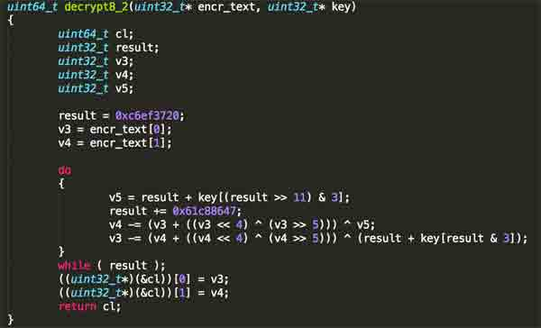

图表九 恶意软件使用的解密算法

我们分析了这个算法的代码并且发现这是一个 XTEA[4](http://static.wooyun.org/20141017/2014101714270446426_jpg.jpg)加密算法的实现，32 轮的[5](http://static.wooyun.org/20141017/2014101714270467943_jpg.jpg)，操作模式是 ECB[6](http://static.wooyun.org/20141017/2014101714270515677_jpg.jpg),[7](http://static.wooyun.org/20141017/2014101714270570493_jpg.jpg) 图表十展示了解密的配置内容样本

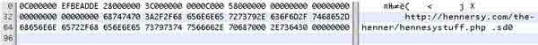

图表十 解密的配置内容样本

我们分析的所有样本都有同样的配置格式，配置的第一部分包含了特殊的 flags 和指向剩下的配置数组数据的偏移量。解密后的配置格式展现在表格二中

|       Offset      |       Size in bytes      |       Description      |
|      |       4      |       This field contains the number of eight-byte blocks in the configuration – in other words, the length of the configuration in eight-byte blocks      |
|       4      |       4      |       Special marker 0xDEADBEEF      |
|       8      |       4      |       Offset to the C&C URL      |
|       12      |       4      |       Sleep time between executions of the main loop function of the malware      |
|       16      |       4      |       Size of file mapping for the hidden file system      |
|       20      |       4      |       Offset to the name of the file that contains the hidden file system      |

表格二 恶意软件配置的描述

正如在表格二中看到的那样，一个 C&C 地址直接定义在了恶意软件配置中并且没有使用 DGA【译者注 3】

## 0x07 隐藏文件系统

* * *

正如之前谈到的，这个恶意程序使用了一个隐藏的文件系统来存储它的文件，这个文件系统由一个在初始化中创建的文件组成。这个隐藏文件系统文件的名称在配置定义，但是它的名称通常是‘.sd0’。为了和这个文件配合使用了一个开源的库‘FAT 16/32 File System Library’。但是它没有以原始的版本使用，一些函数被修改来支持加密。每个 block 被 32 轮的 XTEA 算法 ECB 模式加密并且每个加密 key 随 block 不同而不同 这个隐藏的文件系统被用来存储插件和包含着待处理字符串的文件：URL 的列表，用户名，密码，诸如此类。一个文件系统的实例的内容如图表十一所示：

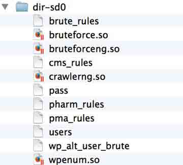

图表十一 一个文件系统实例的内容

我们开发了一个基于开源的{能解密和从这样的文件系统中提取文件的库}的简单的工具

## 0x08 插件的分析

* * *

正如之前所提到的，这个恶意软件具有使用插件的功能。在我们的研究中我们发现了 8 种适用于该 bot 的不同插件。插件和它们的配置文件都存储在隐藏的文件系统中。这里描述的所有插件都是该恶意软件在外面部署使用而被发现的。 **插件接口** 每一个插件导出了一个包含了两个特殊标记的结构：指向有用的插件函数的指针和一个包含插件名称的字符串。每个插件包含至少如下两个这样的指针：一个指针指向插件初始化函数和一个指针指向执行“去初始化”的函数。两个在这结构中的标记都是常量：0xDEADBEEF 和一个常量 20130826 我们猜测是插件的版本。这样一种结构的例子如图表 12 所示：

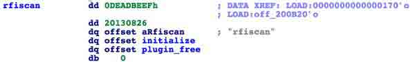

图表十二 一个描述插件结构的示例

基于所有的插件都存储在隐藏文件系统中的事实，它们都没有被 VirusTotal 在检测时用任何反病毒向量发现 **rfiscan.so**

SHA256 hash sum: `9efed12a67e5835c73df5882321c4cd2dd2 3e4a571e5f99ccd7ec13176ab12cb`

这个插件用来发现具有远程文件包含漏洞（RFI）的网站站点。在初始化过程中，这个插件下载了一个列表的 pattern 模式和一个列表的网站站点来检查。然后它发送特殊的 HTTP 请求给站点并试图包含‘http://www.google.com/humans.txt’并且分析对应的 HTTP 响应。如果 HTTP 响应包含了‘we can shake’子串，那么这个插件确认这个网站具有一个远程文件包含漏洞。一部分带有 pattern 模式的列表在图表十三中展示

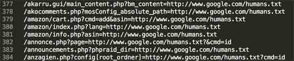

图表十三 一些被‘rfiscan.so’使用来发现 RFI 网站的 pattern 模式

这些结果通过使用‘Q’命令传送给 C&C 服务器。这些指令的意义展示在表格三中

|       Command      |       Description      |
|       Q,rfiscan,<host>, <vulnerable url="URL"></vulnerable></host> |       An RFI vulnerability has successfully been found      |
|       Q,rfiscan,<host>,-     </host> |       RFI vulnerabilities haven’t been found      |

表格三 对‘rfiscan’插件‘Q’指令的描述

**wpenum.so** SHA256 hash sum: `9707e7682dd4f2c7850fdff0b0b33a3f499e93513f025174451b503eaeadea88`

这个插件被用来穷举 WordPress 站点的用户名。这个插件的工作函数接收一个 URL，转换一下，然后用如下的查询模板发送 HTTP 请求 <去掉最后末尾部分的初始查询>/?author=<用户 id>

用户 ID 范围设定 0 到 5。如果对应的 HTTP 响应包含了子串‘Location:’并且目的 URL 包含了子串‘/author/’那么用户名就被从目标 URL 中提取了。使用‘Q’命令把第一个被发现的用户传送给 C&C 服务器。这些指令的意义如表格四所示

|       Command      |       Description      |
|       Q,wpenum,<original url="URL">, <transformed url="URL">,</transformed></original> |       Username has successfully been found      |
|       Q,wpenum,<original url="URL">,</original> <original url="URL">,no_matches     </original> |       No username has been found      |
|       Q,wpenum,<original url="URL">,-     </original> |       Connection failed      |

表格四 对‘wpenum’插件‘Q’指令的描述

**cmsurls.so**

SHA256 hash sum: `84725fb3f68bde780a6349d0419bec39b03c85591e4337c6a02dcaa87b2e4ea3`

这个插件的工作函数接收 hostname，构造一个 HTTP GET 请求组装‘/wp-login.PHP’查询，然后在对应的响应中查找子串‘name="log"’。所以这个插件在基于 WordPress CMS 的站点上查找用户登录页面。而其结果通过‘Q’命令发往 C&C。这些指令的含义在表格五中展示

|       Command      |       Description      |
|       Q,cmsurls,<hostname>,</hostname> |       URL for login page has successfully been found      |
|       Q,cmsurls, <hostname></hostname> |       URL for login page has not been found      |
|       Q,cmsurls,<hostname>,-     </hostname> |       Connection failed      |

表格五 对‘cmsurls.so’插件‘Q’命令的描述

**bruteforce.so**

SHA256 hash sum: `6f96d63ab5288a38e8893043feee668eb6cee7fd7af8ecfed16314fdba4d32a6`

这个插件用来暴力破解 基于 WordPress 和 Joomla CMS 建立的站点的密码。 这个插件不支持 HTTPS。在我们研究的过程中，我们发现了被这个插件使用的一个包含着密码的字典。这个字典包含了 17,911 个密码。这些密码的长度在 1 到 32 个符号之间。

**bruteforceng.so**

SHA256 hash sum: `992c36b2fcc59117cf7285fa39a89386c62a56fe4f0a192a05a379e7a6dcdea6`

这个插件也是用来暴力破解站点密码的，但是不像 bruteforce.so，这个插件支持 HTTPS，以及正则表达式，并且能够被配置用来暴力破解任何登陆页面。这样的一个配置的例子如 图表十四 所示

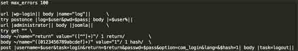 图表十四 一个‘bruteforceng.so’插件配置的示例

我们分析了这个插件的其他配置并且发现了它也被用来暴力破解 DirectAdmin 控制面板的敏感信息

**ftpbrute.so** SHA256 hash sum: `38ee32e644cb8421a89cbcba9c844a5b482b4524d51f5c10dcb582c3c4ed8101`

这个插件被用来暴力破解 FTP 账户

**crawlerng.so**

SHA256 hash sum: `d9d3d93c190e52cc0860f389f9554a86c8c67d56d2f4283356ca7cf5cda178a0`

这个插件被用来爬行 WEB 页面并且取出有用的信息。从 C&C 服务器获得一个用来爬的网站列表，以及类似爬行深度的其他参数。这个插件也支持 HTTPS 协议并且使用了 SLRE [10](http://static.wooyun.org/20141017/2014101714270635884_jpg.jpg)库来处理正则表达式。这个插件是非常灵活的，一个对应这个插件的配置文件如图表十五所示。正如你所见，在这个例子中用这个插件来寻找和采集药品相关的 web 页面。

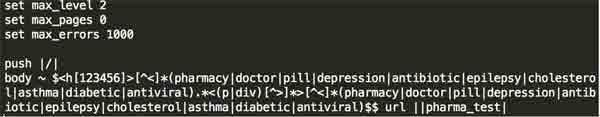

图表十五 一个‘crawlerng.so’插件的配置文件

**crawlerip.so**

SHA256 hash sum: `1fc6a6a98bf854421054254bd504f0b596f01fcb9118a3e525c16049a26e3e11`

这个插件与‘crawlerng.so’插件相同，唯一不同的地方是这个使用一个 IP 列表而非 URL 列表

## 0x09 对 C&C 的分析

* * *

在我们的研究中我们发现 3 个 C&C 服务器被用来管理僵尸网络。我们想办法进入其中的两台并且取得一些统计数据。对 C&C 管理面板的一个总体概括如图表十六所示。允许用户给 BOT 添加任务的界面在图表十七中展示

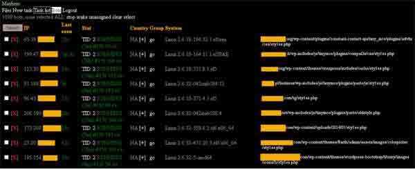

图表十六 （在 C&C 管理面板显示的 bot 列表）

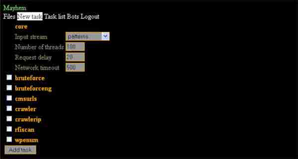

图表十七 在 C&C 中其他任务界面

这两个 C&C 服务器共同控制了大约 1，400 个 bot。第一个 botnet 包含了大约 1,100 个 bot，第二个大约 300 个 bot。在分析的时候，botnet 的 bot 都被用于暴力破解 WordPress 密码。一个这种暴力破解任务的图片如图表十八所示，并且这些暴力破解任务的结果如图表十九所示。


图表十八 在更大的 botnet 控制面板中的暴力破解任务

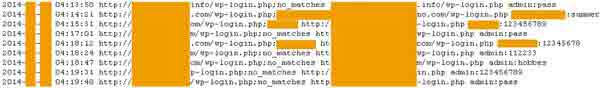

图表十九 一些 botnet 执行暴力破解任务的结果

botnet 中被感染的的服务器服务器地理分布如图表二十所示。正如你所见，最高感染比例的国家为美国，俄罗斯，德国和加拿大。

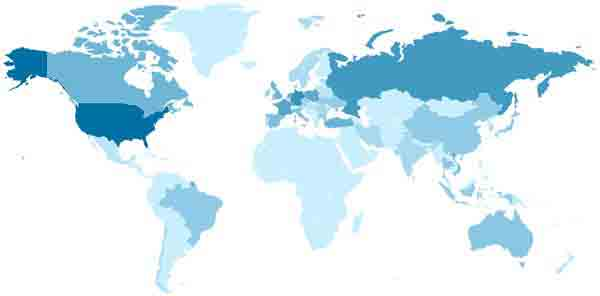

图表二十 更大的 botnet 中被感染的的服务器服务器地理分布。

蓝色越深代表感染的服务器数量越多 第三个 C&C 服务器也被 Malware Must Die [1](http://static.wooyun.org/20141017/2014101714270388631_jpg.jpg)团队定位了，并且在我们分析的时候它已经被关闭了 我们分析了还在运行的两台 C&C 服务器。除了主页面，源代码还包含了额外的两个 PHP 脚本：config.php 和 update.php 第一个脚本包含了配置数据：数据库机密数据，管理面板的密码 MD5，任务的最大判定时间，bot 唤醒时间，诸如此类。这段脚本的一部分如图表二十一所示

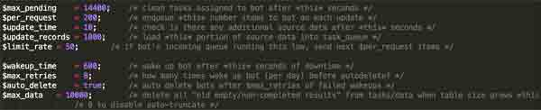

图表二十一 部分 C&C 配置的数据

update.php 脚本被用来唤醒 bot。这段脚本访问一个闲置的 bot 并且运行在‘Malware representation’章节提到过的 PHP 脚本。 我们也发现 C&C 服务器支持一定数量的没有被在外面发现的插件。举例来说，一个插件利用最近发布的‘Heartbleed’漏洞并且从有漏洞的服务器上收集信息。一段描述了所有可用插件的代码如图表二十二所示

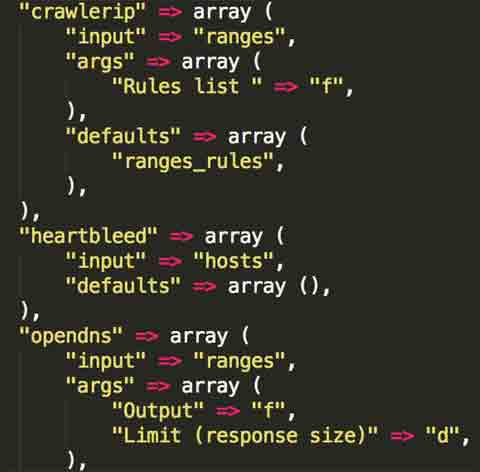

图表二十二 这段代码展示了一定数量的我们没有在外面发现的插件

C&C 使用了 MySQL 和 memcached（如果可用）来做数据存储，但是插件存储在硬盘上 我们也发现了 C&C 脚本的代码也包含了一定量的安全问题，但是描述这些漏洞超出了这篇文章的范围

## 0x10 与其他恶意软件家族的对比

* * *

在我们的分析中，我们发现了一些在 Mayhem 和其他*nix 恶意软件之间的共同特点。这个恶意软件与‘Trololo_mod’和‘Effusion’ [11](http://static.wooyun.org/20141017/2014101714270785318_jpg.jpg) 相似 – 两款分别针对 Apache 和 Nginx 服务器的入侵工具。所有这三个恶意软件家族具有如下的共同点： • 配置使用同样格式

• 使用 ECB 模式下的 XTEA 算法加密

• 0xDEADBEEF 标记被广泛用于配置文件以及其他代码部分

• 动态链接库的 ELF headers 使用同样方式腐化

尽管缺少证据，我们怀疑所有这三个恶意软件家族都是被同一帮派开发的 结论 在完成这个研究之后，我们可以确凿地说为*nix web 服务器制造的 botnets 正在变得越来越流行，就像恶意软件的现代化趋势。为什么会这样？我们认为原因如下：

• Web 服务器 botnets 提供了一个独特的通过流量重定向、盗链下载、黑帽 SEO，诸如此类 的获利方式模型

• Web 服务器具有良好的在线时间，网络通道并且比常规的私人电脑性能更好

• 在*nix 世界里，自动更新技术并没有被广泛使用，尤其是对比桌面电脑和智能手机时。绝大多数的网站管理员们和系统管理员们需要手动升级他们的软件并且测试保证他们的基础业务正常工作。对于普通的站点，专业地维护非常昂贵并且网站管理员没有机会这么做。这意味着对于黑客来说寻找这样的有漏洞的 Web 服务器并且将之加入 botnet 中比较简单。

• 在*nix 世界中，反病毒技术并没有广泛应用。很多运营商并不提供主动防御机制或者进程内存检测模块。何况，一个普通的网站管理员通常不想花费时间阅读这种软件的说明书并且解决可能因此出现的性能问题。

Mayhem 是一个非常有趣并且精致的恶意软件，其拥有灵活并且复杂的架构。我们希望我们的研究可以帮助安全社区对抗如此的威胁。

## 0x11 致谢：

* * *

我们希望感谢 Fraser Howard 和 Charles McCathie Nevile，他们的评论和建议帮助了我们改进这篇文章。

## 0x12 参考文献

* * *

http://blog.malwaremustdie.org/2014/05/elf-shared-so-dynamic-library-malware.html.

http://sysadminblog.net/2013/11/fake-wordpress-plug-ins/.

FortDiscoBruteforceCampaign.

http://www.arbornetworks.com/asert/2013/08/fort-disco-bruteforce-campaign/.

Wheeler,D.;Needham,R.CorrectiontoXTEA.

http://www.movable-type.co.uk/scripts/xxtea.pdf.

http://en.wikipedia.org/w/index.PHP?title=XTEA&oldid=558387953.

Wikipedia.Blockciphermodeofoperation. http://en.wikipedia.org/w/index.PHP?title=Block_cipher_mode_of_operation&oldid=582012907.

Schneier,B.AppliedCryptography.JohnWiley&Sons,1996.

http://ultra-embedded.com/fat_filelib.

https://github.com/freeoks/SD0_reader.

http://slre.sourceforge.net/.

Effusion–anewsophisticatedinjectorforNginxwebservers.

https://www.virusbtn.com/virusbulletin/archive/2014/01/vb201401-Effusion.

http://www.linuxjournal.com/article/7795.

0x13 译者注：

* * *

【1】 bot 定义：Each such compromised device, known as a "bot", is created when a computer is penetrated by software from a malware (malicious software) distribution（来自 http://en.wikipedia.org/wiki/Botnet）

【2】 C&C 定义：This server is known as the command-and-control (C&C) server（来自 http://en.wikipedia.org/wiki/Botnet）

【3】 DGA 定义：Domain generation algorithm（来自 http://en.wikipedia.org/wiki/Domain_generation_algorithm）

版权声明：未经授权禁止转载 [lxj616](http://drops.wooyun.org/author/lxj616 "由 lxj616 发布")@[乌云知识库](http://drops.wooyun.org)

分享到：

### 相关日志

*   [Mysql 安全配置](http://drops.wooyun.org/tips/2245)
*   [Oracle 安全配置](http://drops.wooyun.org/%e8%bf%90%e7%bb%b4%e5%ae%89%e5%85%a8/2547)
*   [Iptables 入门教程](http://drops.wooyun.org/tips/1424)
*   [使用 OpenSSH 证书认证](http://drops.wooyun.org/tips/1055)
*   [Burp Suite 使用介绍（一）](http://drops.wooyun.org/tools/1548)
*   [安全科普：Waf 实现扫描器识别 彻底抵挡黑客扫描](http://drops.wooyun.org/tips/730)