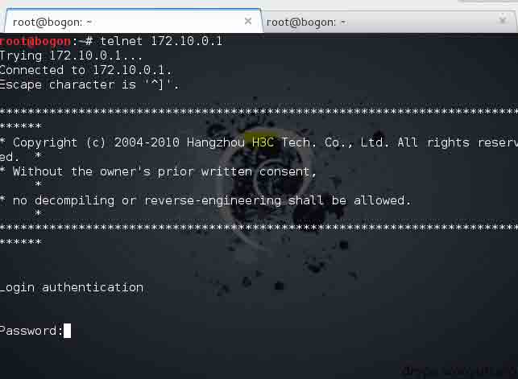

# 内网渗透应用 跨 vlan 渗透的一种思路

2013/09/28 23:07 | [DM_](http://drops.wooyun.org/author/DM_ "由 DM_ 发布") | [技术分享](http://drops.wooyun.org/category/tips "查看 技术分享 中的全部文章") | 占个座先 | 捐赠作者

## 0x00 前言

* * *

随着日益发展的网络技术，网络线路也变的越来越复杂。渗透测试人员在 web 中通过注入，上传等基本或高级脚本渗透方法到达了边界服务器。再深入时则会面对更复杂的网络,比如乱七八糟的 vlan 环境。

什么是 vlan:[`baike.baidu.com/history/id=9328829`](http://baike.baidu.com/history/id=9328829)

测试拓扑图

## 0x01 测试基本状况概述

* * *

一共选取了三台服务器和一个 H3C s3610 三层交换机.顺带笔者的一台笔记本(Kali Linux).

三台服务器代表了 tec503 的基本业务划分。攻击者处在和 webserver 相同的 vlan200 中。并且攻击者已控制到 webserver。

在交换机上划分了三个 vlan 将 Tec503(假想的目标公司)的数据服务器（dataserver.tec503.com）和 web 服务器（webserver.tec503.com）及域控分别划分在三个 vlan（vlan100，vlan200，vlan300）下。vlan100 和 vlan200 不能相互访问。但是都可以访问到 vlan300.

交换机开启 snmp 和 telnet(snmp 一般用来监控交换机流量等,telnet 用于管理三层交换机)。

测试目标:在尽可能少留下痕迹的前提下，接触到 dataserver 的数据。

## 0x02 前期基本渗透过程

* * *

在前期信息搜集时发现 tec503.com 存在域传送漏洞.由此确定了此次测试的目标 ip(5.5.6.4).

并且 webserver 对外开放.在基本探测后发现存在 web 漏洞。并且在获得 webshell 之后成功获取到了管理权限。

之后在 webserver 上查看到网关 ip 为 172.10.0.1,试着 ping 一下.

telnet 上去看到是一台 H3C 设备。

尝试 123456，password，manager 等简单弱口令登陆，结果都失败。

尝试 snmp 弱口令探测(这里的弱口令是指 snmp 管理时用到的团体字符串。一般可读权限的为 public,可读可写的默认为 private).

发现果真使用默认的可读团体字符串 public.继续尝试使用 snmp 获取到 H3C 设备密码

成功的获取到密码”admin”(忘了说 我前面是故意没有试 admin 的)

之后便可以通过这个密码 telnet 登陆到交换机中.

并成功的进入到 system-view 状态.

## 0x03 交换机下的渗透过程

* * *

在成功通过 telnet 登陆到交换机后我们便可以开始收集交换机的各种配置信息（vlan 划分，super 密码，路由表信息。Ip 池划分等等）并且这些信息除了 super 密码以外基本都可以通过 snmp 的一个可读字符串获取到。而且对于思科设备来讲，如果有个可读可写的团体字符串，那么直接就可以下载到 cisco 的核心配置文件(含密码字符串等).

这里需要简单的说说三层交换机的两个功能,vlan 划分以及端口镜像。端口指的是交换机上的端口,而不是计算机的服务端口。

端口镜像则是指将交换机某个端口下的数据镜像到另一个端口的技术，并且可以选择镜像流入或流出的数据包。这一技术通常应用在企业监控，流量分析中。在端口镜像时也应注意流量过高引发监视端口流量负载的问题。

这次测试便是通过端口镜像技术获取到 dataserver 发送和接受到的数据包。

我们先来分析下这台交换机的配置文件。

在这里我们可以看到 super 密码 这个密码通过 H3C ciper 加密。加密的字符串可以通过[`github.com/grutz/h3c-pt-tools/blob/master/hh3c_cipher.py`](https://github.com/grutz/h3c-pt-tools/blob/master/hh3c_cipher.py)这个脚本解密。

接下来看看 ip-pool 的划分,配合前期 nslookup 收集到的信息可以进一步清晰的逼近目标.

根据上图可以发现我们现在处于 vlan200 中，目标处于 vlan100,域控在 300.

那么我们继续看看每个正在使用的接口被划分到了哪个 vlan 中。

这里可以看到 Ethernet 1/0/3 在 vlan100 中.而 Ethernet 1/0/4 在 vlan200 中，也就是我们所处的 vlan。

清楚接口划分之后我们开始建立一个本地镜像组 1。

然后制定被镜像的端口号。

接着制定监控端口号。

最后登陆到我们控制的 webserver.使用抓包软件分析目标（dataserver.tec503.com）的数据包.

这是捕获到目标（dataserver.tec503.com）ICMP 数据包的示意图。

这是捕获 HTTP 数据包的示意图。

同理其他协议的包也应如此,具体的后续分析过程就不在这里演示了。

## 0x04 后记

* * *

路由和交换机在渗透过程中越来越常见，并且由于管理员配置经验欠当。经常出现默认配置,弱口令等配置不当的问题。而且路由和交换机在网络中所处的位置也更加体现了它在一次渗透过程中的重要性.在写文章的时候也发现 freebuf 上的一篇关于跨 vlan 进行 ARP 嗅探的文章。([`www.freebuf.com/articles/system/13322.html`](http://www.freebuf.com/articles/system/13322.html)).也更希望通过这篇文章引出更多的好文章.

### 参考

H3C 以太网交换机配置指南

wireshark 抓包实战分析指南 第二版

[WooYun: 中国移动 H3C 防火墙侧漏利用 snmp 获取管理员密码成功登录设备](http://www.wooyun.org/bugs/wooyun-2013-032456)

版权声明：未经授权禁止转载 [DM_](http://drops.wooyun.org/author/DM_ "由 DM_ 发布")@[乌云知识库](http://drops.wooyun.org)

分享到：

### 相关日志

*   [Linux 被 DDOS&CC 攻击解决实例](http://drops.wooyun.org/tips/2457)
*   [Win10 安全特性之执行流保护](http://drops.wooyun.org/tips/4839)
*   [初探验证码识别](http://drops.wooyun.org/tips/4550)
*   [Linux 下基于内存分析的 Rootkit 检测方法](http://drops.wooyun.org/tips/4731)
*   [深入分析 Fiesta Exploit Kit](http://drops.wooyun.org/tips/4858)
*   [SQL Injection via DNS](http://drops.wooyun.org/tips/4605)