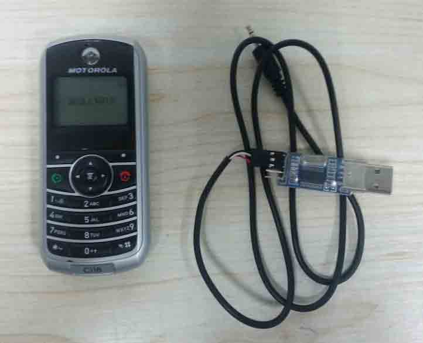
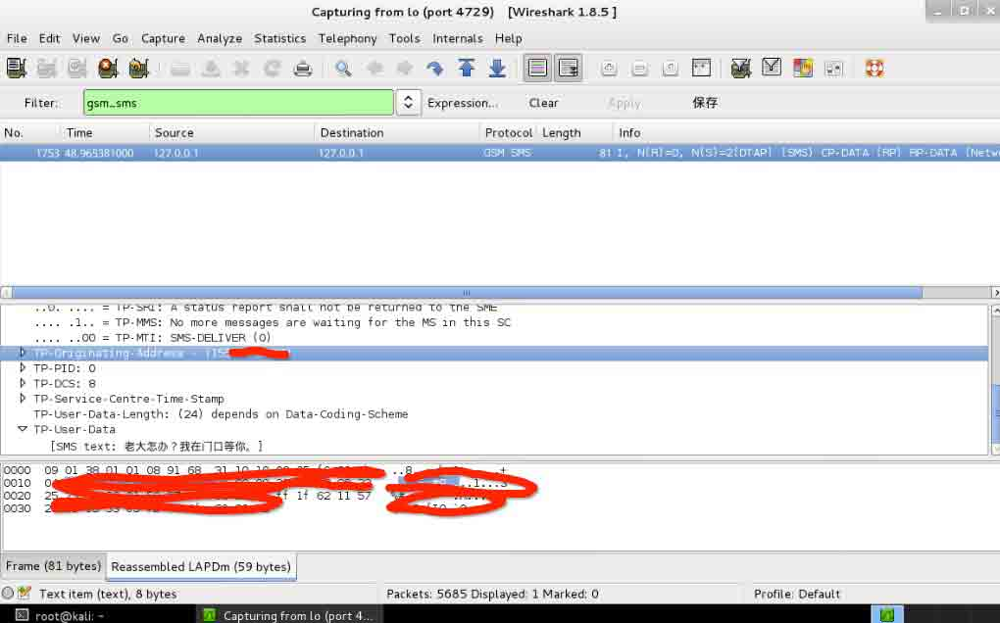

# GSM Hackeing 之 SMS Sniffer 学习

2013/10/31 23:18 | [只抽红梅](http://drops.wooyun.org/author/只抽红梅 "由 只抽红梅 发布") | [技术分享](http://drops.wooyun.org/category/tips "查看 技术分享 中的全部文章") | 占个座先 | 捐赠作者

## 0x00 前言

* * *

最近看到微博以及一些论坛谈论关于 GSM Hacking 的比较多，使用的是开源的程序 osmocombb 和摩托罗拉的手机 c118。我也凑凑热闹，找来相关资料进行学习，国内关于这方面的资料的确太少了，大都是一些编译 osmocombb 的资料，而没有更深入的学习资料，比如如何进行 GSM SMS 的 Sniffer，估计是在我大宋朝这个太敏感了吧。

不过最近在 [`www.hacklook.com/`](http://www.hacklook.com/) 却有不少相关的资料可以参考学习，在次对作者表示感谢。

## 0x01 准备工具

* * *

对这方面学习所需要的工具倒不是很昂贵，下面罗列出需要的材料：

```
一台笔记本或者一台虚拟机
C118 手机一台
FT232RL、CP2102、PL2303 USB2TTL 模块一个
2.5mm 耳机插头带线一根 
```

C118 手机淘宝 25 元左右一台，为了避免广告这里不给出链接了。USB2TTL 模块我这里用的是 PL2303，我看有的文章说这个不行，但是我这里没问题，2.5mm 的耳机线买的是那种两头都是插头的，中间剪开然后接上杜邦头就可以和 USB2TTL 进行连接了。以上成本加起来 30 元左右。 下面是全家福



## 0x02 编译环境

* * *

PC 端环境我使用的是虚拟机，操作系统安装 Kali Linux 操作系统，由于 Kali 系统中已经有 PL2303 的驱动，so 太方便了。Kali 的安装就略过。下面进行 osmocombb 的编译：

安装需要的包

```
sudo apt-get install libtool shtool autoconf git-core pkg-config make gcc build-essential libgmp3-dev libmpfr-dev libx11-6 libx11-dev texinfo flex bison libncurses5 libncurses5-dbg libncurses5-dev libncursesw5 libncursesw5-dbg libncursesw5-dev zlibc zlib1g-dev libmpfr4 libmpc-dev  

```

然后建立交叉编译环境，主要参考下面文章：

[`bb.osmocom.org/trac/wiki/GnuArmToolchain`](http://bb.osmocom.org/trac/wiki/GnuArmToolchain)

下载 osmocombb、libosmocore 源码

```
cd ~  
git clone git://git.osmocom.org/osmocom-bb.git  
git clone git://git.osmocom.org/libosmocore.git

```

编译 libosmocore

```
cd ~/libosmocore  
autoreconf -i  
./configure  
make  
sudo make install

```

然后切换 osmocombb 到下面的分支，并且编译

```
cd ~/osmocom-bb  
git checkout --track origin/luca/gsmmap
cd src  
make

```

## 0x03 测试

* * *

经过上面的编译过程，环境准备的差不多了，下面进行测试，首先确保一下步骤：

把 USB2TTL 模块插入到电脑上，再共享到虚拟机中

把带有 2.5mm 耳机插头的线一头接手机，另外一头链接 USB2TTL 模块

可以通过下面命令来查看是否正常：

```
lsmod | grep usb

```

我这边显示为：

```
usbserial              23960  1 pl2303

```

手机处于关机状态，运行如下命令：

```
cd ~/osmocom-bb/src/host/osmocon/  
./osmocon -m c123xor -p /dev/ttyUSB0 ../../target/firmware/board/compal_e88/layer1.compalram.bin

```

这个时候短按手机开机键，在虚拟机中会看到如下输出：

```
got 1 bytes from modem, data looks like: 2f  /
got 1 bytes from modem, data looks like: 00  .
got 1 bytes from modem, data looks like: 1b  .
got 4 bytes from modem, data looks like: f6 02 00 41  ...A
got 1 bytes from modem, data looks like: 01  .
got 1 bytes from modem, data looks like: 40  @
Received PROMPT1 from phone, responding with CMD
read_file(../../target/firmware/board/compal_e88/layer1.compalram.bin): file_size=56016, hdr_len=4, dnload_len=56023
got 1 bytes from modem, data looks like: 1b  .
got 1 bytes from modem, data looks like: f6  .
got 1 bytes from modem, data looks like: 02  .
got 1 bytes from modem, data looks like: 00  .
got 1 bytes from modem, data looks like: 41  A
got 1 bytes from modem, data looks like: 02  .
got 1 bytes from modem, data looks like: 43  C
Received PROMPT2 from phone, starting download
handle_write(): 4096 bytes (4096/56023)
handle_write(): 4096 bytes (8192/56023)
handle_write(): 4096 bytes (12288/56023)
handle_write(): 4096 bytes (16384/56023)
handle_write(): 4096 bytes (20480/56023)
handle_write(): 4096 bytes (24576/56023)
handle_write(): 4096 bytes (28672/56023)
handle_write(): 4096 bytes (32768/56023)
handle_write(): 4096 bytes (36864/56023)
handle_write(): 4096 bytes (40960/56023)
handle_write(): 4096 bytes (45056/56023)
handle_write(): 4096 bytes (49152/56023)
handle_write(): 4096 bytes (53248/56023)
handle_write(): 2775 bytes (56023/56023)
handle_write(): finished
got 1 bytes from modem, data looks like: 1b  .
got 1 bytes from modem, data looks like: f6  .
got 1 bytes from modem, data looks like: 02  .
got 1 bytes from modem, data looks like: 00  .
got 1 bytes from modem, data looks like: 41  A
got 1 bytes from modem, data looks like: 03  .
got 1 bytes from modem, data looks like: 42  B
Received DOWNLOAD ACK from phone, your code is running now!
battery_compal_e88_init: starting up

```

然后在虚拟机中再起一个终端，执行如下命令进行基站扫描

```
cd ~/osmocom-bb/src/host/layer23/src/misc/
./cell_log

```

看到如下输出则说明扫描到可用的基站

```
ARFCN 117: tuning
ARFCN 117: got sync
Cell ID: 460_1_03EE_B130
<000e> cell_log.c:248 Cell: ARFCN=117 PWR=-62dB MCC=460 MNC=01 (China, China Unicom)

```

基站的绝对无线频道编号为 117，然后通过如下的命令进行抓包

```
cd ~/osmocom-bb/src/host/layer23/src/misc/
./ccch_scan -i 127.0.0.1 -a 117

```

同时开启 wireshark 抓包，

```
sudo wireshark -k -i lo -f 'port 4729'

```

然后在 wireshark 的 filter 中对 `gsm_sms` 的包进行过滤显示 下图为抓到的短信包：



## 0x04 最后

* * *

本文参考下面资料：

[`bb.osmocom.org/`](http://bb.osmocom.org/)

[`srlabs.de/gsm-map-tutorial/`](https://srlabs.de/gsm-map-tutorial/)

[`srlabs.de/gprs/`](https://srlabs.de/gprs/)

[`www.hacklook.com/forum.php?mod=viewthread&tid=12`](http://www.hacklook.com/forum.php?mod=viewthread&tid=12)

[`www.hacklook.com/forum.php?mod=viewthread&tid=22`](http://www.hacklook.com/forum.php?mod=viewthread&tid=22)

下面是部分注意事项

请注意 USB2TTL GND/TX/RX 的接线顺序

以及确认交叉编译环境正常工作

OVER！

版权声明：未经授权禁止转载 [只抽红梅](http://drops.wooyun.org/author/只抽红梅 "由 只抽红梅 发布")@[乌云知识库](http://drops.wooyun.org)

分享到：

### 相关日志

*   [Dionaea 低交互式蜜罐部署详解](http://drops.wooyun.org/tips/640)
*   [GSM HACK 的另一种方法:RTL-SDR](http://drops.wooyun.org/papers/4716)
*   [Pocket Hacking: NetHunter 实战指南](http://drops.wooyun.org/tips/4634)
*   [One git command may cause you hacked(CVE-2014-9390)](http://drops.wooyun.org/papers/4386)
*   [撞库扫号防范](http://drops.wooyun.org/tips/2830)
*   [Zmap 详细用户手册和 DDOS 的可行性](http://drops.wooyun.org/tools/515)