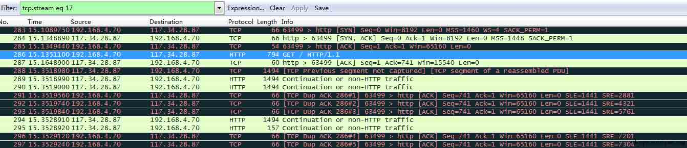
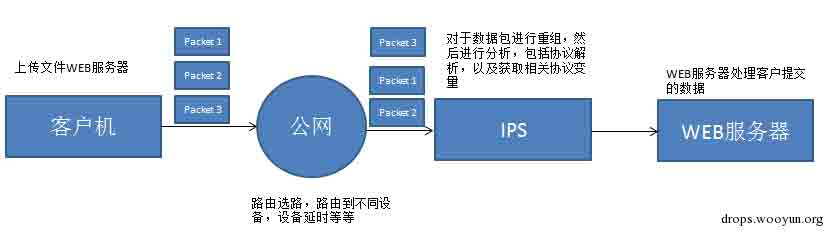
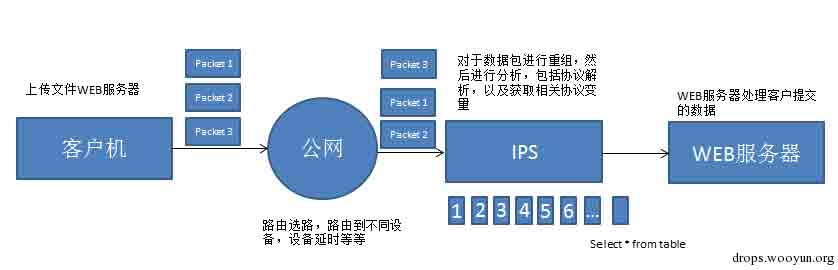
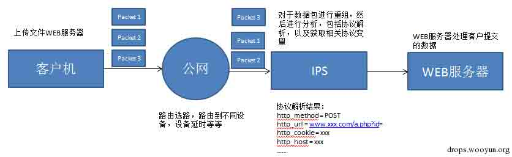
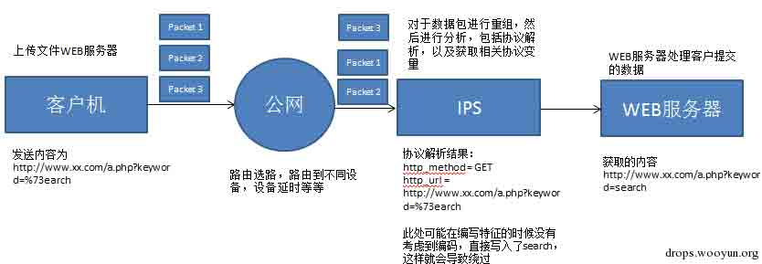

# IPS BYPASS 姿势

2014/12/16 16:17 | [MayIKissYou](http://drops.wooyun.org/author/MayIKissYou "由 MayIKissYou 发布") | [漏洞分析](http://drops.wooyun.org/category/papers "查看 漏洞分析 中的全部文章") | 占个座先 | 捐赠作者

## 0x00 背景

* * *

之前 wooyun 上经常也看到一些 bypass 的方法，如利用 mysql 的特性 bypass web 程序的防注入函数，又例如直接构造绕过防注入的正则等等。最近在编写 IPS 特征的时候，发现在一些其他的角度上可以做到绕过 IPS 防护，下面就将这些另外的角度做一个总结。在描述的时候涉及到一些网络层面的基础知识，这里不单独叙述，在利用姿势里面强调。

Ps.此处说明，方法不代表能 bypass 掉所有的 IPS。

## 0x01 bypass 姿势

* * *

## IPS 性能优化导致 IPS 规则 bypass

* * *

做过 IPS 测试的选手应该都会听到过这样一句话，厂商在保证检测率 90%的条件下，性能是多少。这里所说的性能一般是性能测试中涉及的新建，并发，吞吐等等指标。此处不叙述这些指标。

从上面可以看出 IPS 的检测效果和性能是有一个平衡关系的。先来描述一些基本概念，第一个概念是数据流和会话的概念：

在网络基础中有五元组的概念，即为源地址，目的地址，源端口，目的端口以及协议号，五元组相同即认为是一条同样的会话，当你在浏览器中访问 www.wooyun.org 的时候，打开 wireshark 抓包工具抓包，然后 follow 下这一条 stream 可以发现如下内容。这也就是所描述的会话和流。



IPS 中一般是通过会话，流来进行检测的。如何来通过会话来检测呢，这里有第二个概念需要了解，第二个概念为重组：

为什么要重组，一个以太网包的最大长度为 1518 字节，譬如我们这时候发送一个大附件出去，此时就会把数据分成多个数据包发送出去，数据包在 internet 上转发的时候会被路由转发，在整个 internet 中转发的时候会出现乱序，导致有些数据包先到 IPS 设备，有些数据包后到 IPS 设备，此时就需要 IPS 将发送的数据包，完整的组合起来。因为组合起来之后才可以方便后面的数据分析，提取内容。如下图所示：



现在问题就来了，如果对于每条数据流的所有内容都做检测应该就没问题了，但是每条数据流的所有内容都进行检测，肯定所耗费的资源也就越多，应该大部分厂商不会检测数据流的所有包。因此就会出现个问题，到底检测多大的大小呢？在处理这个问题的时候有些使用的是包数，有些使用的是流大小的方法。但是这都会导致所说的一个问题，就是性能优化导致的 bypass。如下图所示：



在该数据流中，前面多个包如 20 个包没有发现特征，20 个包之后的内容不再做 ips 检测，这样后面的包里的特征就没有受到 IPS 引擎的检测。

利用：

例如我们在绕过 bypass 的时候，人为的将 get 方式提交改为 post 方式提交，同时在提交的时候，添加大量的填充数据，如使用 post 的方式，上传一个大的文件，虽然这部分填充数据不会被服务器端所处理，但是在通过 IPS 设备的时候就会被解析处理，有可能就 bypass 掉了 ips 的检测。

## 截断绕过 IPS 规则

* * *

Ips 规则即为经常说到的 ips 特征，见到过的很多 IPS 特征都是根据不同协议来分的，如 http,smtp,pop3,tcp,udp 等等，每一种协议下又可以有不同的内容，如 http 协议下可以有 cookie，header，msgbody 等等。

这些特征都会被以一种算法加载到内存中，然后等到数据流解析完毕之后，进行匹配。因此这里又涉及到了一个基础概念：协议解析。

协议解析为啥？即将上面重组过后的信息，提取相应的内容赋值给协议变量。打个比方，如 http 协议，在重组完成之后肯定会出现 http 标准的内容，http 的 cookie，header，method 等等，因此 IPS 会根据标准的内容解析，然后将解析的内容赋值给类似 http_cookie,http_method 的变量。有了这些变量就可以对数据流进行 IPS 特征匹配了。效果如下图所示：



解析出来各种 http 的相关内容，当然不同的协议解析出来的内容不相同，有的可能是 smtp，tcp 等等。

但是在这个过程中，如果程序员处理的不好，就会出现 IPS bypass 的情况。

举个例子，例如某漏洞的特征为 search{xxxx}，特征利用正则编写，需要匹配 search{}，括号内容随意，此时，攻击者提交 search{sada%00}，这样在协议解析的时候出来的结果是 search{sada，不会匹配到后面的}符号，导致了 bypass。

## 编码绕过 IPS 规则

* * *

url 编码绕过 IPS 规则同样存在可能性。

在 IPS 中对于同一种协议可能有多种协议变量，如 HTTP 中可能有没有 url_decode 的协议变量和进行了 url_decode 的协议变量，如果没有正确使用也会导致 IPS 规则绕过。

浏览器在发送数据包的时候，会对 url 进行编码，而且不同浏览器的编码还不相同，例如 chrome 对于单引号编码为%27，但是 IE 浏览器对于单引号不做编码，同时浏览器对于英文字符都不做编码的。

之前碰到了一个例子，在 IPS 规则中，书写特征的人员使用了未解码的协议变量书写特征，如特征为包含 search 关键字，此时我们可以这样 bypass 规则，将 search 书写为%73earch，这样当数据包经过 IPS 设备的时候，内容未作解码还是为%73earch，未匹配上规则，而到服务器端时候，被解码为 search。



因此这里说，在做 web 测试的时候，尽量编码一些英文字符提交，可能会有惊喜。

## 请求方式绕过 IPS 规则

* * *

http 常用请求方式有 GET 和 POST 两种方式，POST 提交的时候又常见的有 www/urlencode 的方式和 multipart 的方式，后者常常用于文件上传。 查看一些 CMS 的源码，经常会发现有类似的代码，如下代码摘抄自 dedecms：

```
if (!defined('DEDEREQUEST')) 
{
    //检查和注册外部提交的变量
    foreach($_REQUEST as $_k=>$_v)
    {
        if( strlen($_k)>0 && preg_match('/^(cfg_|GLOBALS)/',$_k) )
        {
            exit('Request var not allow!');
        }
    }
    foreach(Array('_GET','_POST','_COOKIE') as $_request)
    {
        foreach($$_request as $_k => $_v) ${$_k} = _RunMagicQuotes($_v);
    }
}

```

可以看出无论 get 提交，cookie 提交，post 提交对于 web 服务器端，其实效果是一样的，但是对于 IPS 就不一样了。在我接触的不同的 IPS 中，对于不同 http 请求部分，拥有不同的协议变量，同时不同的协议变量也有解码和未解码之分。

举例，如 dedecms 中的一个漏洞，uploadsafe.inc.php 界面的错误过滤导致 recommend.php 页面可以 sql 注入。网上给出的 POC 通常是一个 url，直接粘贴到浏览器，即可以获取到了管理员账号密码，因此一些 IPS 规则通常就直接书写了一个 httpurl 解码的规则。

很容易此处更换一下提交方式，使用 post 的方式，无论是 urlencode 的方式还是 form-data 的方式，均可以绕过该规则。

此处如果发现 post 方式被过滤了，此处对于 post 的内容进行编码，然后再提交，仍然存在可以绕过的可能。

因此各位在编写 payload 的时候尽量使用编码过的 post 方式提交，成功的概率大一点。

Ps.之前 wooyun 上看见有提交二进制文件混淆绕过的，此处暂时没有想到为什么。

## 其他方式绕过 IPS 规则

* * *

1：对于 host 以及 useraget 的修改 一般不要使用默认的 useragent，如使用一些自定义或则模拟浏览器的 http-header 字段。如那些 sqlmap 的特征可能就是针对于 useragent 做的文章。

2：字符混淆 尽量不使用网上公开的 poc，针对于一些 payload 中可控的部分做字符混淆，使用字符填充等等。

3：漏洞利用方式 例如之前报过 dedecms 的 recommend 的注入漏洞，该漏洞是因为 uploadsafe.inc.php 界面导致的，其实利用页面还有 flink.php 等等，网上利用的最多 recommend 的 poc，因此使用 flink.php 的页面可能就绕过了 dedecms ips 特征的防御，又如牛 B 的 dedesql.class.php 的变量覆盖漏洞，网上大多 poc 是基于 download.php 的，其实 erraddsave.php 等其他页面也是可以利用的，使用一些非主流 POC 的利用页面，也是可以 bypass 掉 ips 特征的。 一般的 IPS 特征都与基于一个页面来写特征，避免误报的。

## 0x02 总结

* * *

IPS 和 WAF 网络攻击的防护设备，往往为了自身的一些如性能的提升，而放弃了一些功能，例如我见过有些 IPS 规则在编写的时候不支持正则表达式。可能就是正则表达式匹配的时候会大大的影响性能。由于这些功能上的放弃，必然导致各种各样规则的 bypass，作为用户既需要这些防护设备，同时也需要做好自身网络安全的提升，如服务器的补丁，相关服务器的实时监控等等。

版权声明：未经授权禁止转载 [MayIKissYou](http://drops.wooyun.org/author/MayIKissYou "由 MayIKissYou 发布")@[乌云知识库](http://drops.wooyun.org)

分享到：

### 相关日志

*   [CSRF 简单介绍及利用方法](http://drops.wooyun.org/papers/155)
*   [CVE-2014-3393 详细分析与复现](http://drops.wooyun.org/papers/3451)
*   [J2EE MVC 模式框架中,表单数据绑定功能不安全实现在 Tomcat 下造成的 DoS 及 RCE](http://drops.wooyun.org/papers/1395)
*   [wechall mysql 关卡题解](http://drops.wooyun.org/papers/1321)
*   [XSS 挑战第一期 Writeup](http://drops.wooyun.org/papers/894)
*   [MS15-002 telnet 服务缓冲区溢出漏洞分析与 POC 构造](http://drops.wooyun.org/papers/4621)