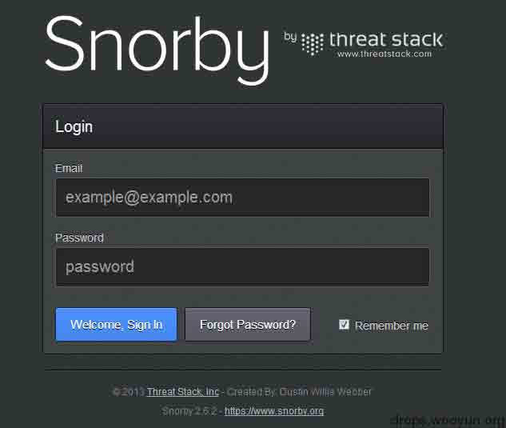
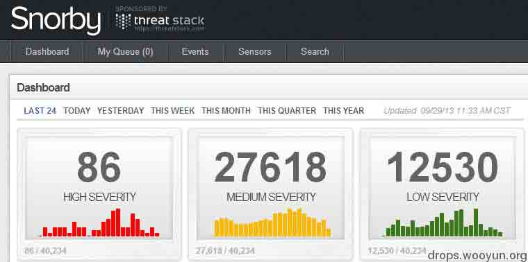

# 搭建基于 Suricata+Barnyard2+Base 的 IDS 前端 Snorby

2013/10/02 23:46 | [rootsecurity](http://drops.wooyun.org/author/rootsecurity "由 rootsecurity 发布") | [漏洞分析](http://drops.wooyun.org/category/papers "查看 漏洞分析 中的全部文章"), [运维安全](http://drops.wooyun.org/category/%e8%bf%90%e7%bb%b4%e5%ae%89%e5%85%a8 "查看 运维安全 中的全部文章") | 占个座先 | 捐赠作者

## 0x00

* * *

关于 CentOS+Base+Barnyard2+Suricata 就不多说了，这里有文章已经写的很详细了。

请参考：[`drops.wooyun.org/tips/413`](http://drops.wooyun.org/tips/413)

## 0x01

* * *

这里安装 CentOS6 系统同样是使用最小化安装，仅安装@Base @Development Tools @Development Library

系统安装完毕后，初始化安装软件包

```
[root@localhost ~]#yum -y install libyaml libyaml-devel gcc gcc-c++ make file file-devel git libxslt-devel curl curl-devel ImageMagic ImageMagic-devel 
[root@localhost ~]#yum -y install mysql mysql-libs mysql-server mysql-devel 
[root@localhost ~]#/usr/bin/mysql_secure_installation 
[root@localhost ~]#yum -y install httpd httpd-devel apr-utils php php-common php-cli php-pear php-curl php-mcrypt php-pecl php-devel  php-mysql 
[root@localhost ~]#ln -sf /usr/lib64/mysql /usr/lib/mysql 
[root@localhost ~]#sed -i 's/Options Indexes FollowSymLinks/Options FollowSymLinks/g' /etc/httpd/conf/httpd.conf 
[root@localhost ~]#sed -i 's/ServerTokens OS/ServerTokens Prod/g' /etc/httpd/conf/httpd.conf 
[root@localhost ~]#sed -i 's/ServerAdmin root@localhost/ServerAdmin security@domain.com/g' /etc/httpd/conf/httpd.conf 
[root@localhost ~]#/etc/init.d/httpd restart 
```

## 0x02

* * *

安装 Ruby:

```
[root@localhost opt]#wget http://ftp.ruby-lang.org/pub/ruby/1.9/ruby-1.9.3-p327.tar.gz 
[root@localhost opt]#tar zxvf ruby-1.9.3-p227/ 
[root@localhost ruby-1.9.3-p227]#./configure 
[root@localhost ruby-1.9.3-p227]#make && make install 
[root@localhost ruby-1.9.3-p227]#cd ../ 
```

安装 openssl extensions

```
[root@localhost ~]#cd /opt/ 
[root@localhost opt]#cd ruby-1.9.3-p227/ext/openssl 
[root@localhost openssl]#ruby extconf.rb 
[root@localhost openssl]#make && make install 
[root@localhost openssl]#cd ../../../ 
```

## 0x03

* * *

安装 rubygems

```
[root@localhost ~]#cd /opt 
[root@localhost opt]#tar zxvf rubygems-1.8.24.tar.gz 
[root@localhost opt]#cd rubygems-1.8.24/ 
[root@localhost opt]#ruby setup.rb 
```

更改 gem 源

```
[root@localhost ~]#gem sources -l 
[root@localhost ~]#gem sources -r https://rubygems.org/ 
[root@localhost ~]#gem sources –a http://ruby.taobao.org/ 
[root@localhost ~]#gem sources -u 
```

安装 gems 包

```
[root@localhost ~]#gem install bundle 
[root@localhost ~]#gem install thor i18n bundler tzinfo builder memcache-client rack rack-test erubis mail rack-mount rails --no-rdoc --no-ri 
[root@localhost ~]#gem install tzinfo-data 
[root@localhost ~]#gem install rake --version=0.9.2 --no-rdoc --no-ri 
[root@localhost ~]#gem uninstall rake --version=0.9.2.2 
```

## 0x04

* * *

安装 wkhtmltopdf

```
[root@localhost ~]#cd /opt 
[root@localhost ~]#wget http://wkhtmltopdf.googlecode.com/files/wkhtmltopdf-0.9.9-static-amd64.tar.bz2 
[root@localhost ~]#tar jxvf wkhtmltopdf-0.9.9-static-amd64.tar.bz2 
[root@localhost ~]#cp wkhtmltopdf-amd64 /usr/local/bin/wkhtmltopdf 
[root@localhost ~]#chown root.root /usr/local/bin/wkhtmltopdf 
```

## 0x05

* * *

安装配置 snorby:

```
[root@localhost ~]#cd /var/www/html 
[root@localhost html]#git clone http://github.com/Snorby/snorby.git 
[root@localhost html]#cd /var/www/html/snorby/config/ 
[root@localhost config]#cp database.yml.example database.yml 
[root@localhost config]#cp snorby_config.yml.example snorby_config.yml 
[root@localhost config]#chown -R apache.apache /var/www/html/snorby/ 
```

修改 database.yml，在“Enter Password Here”这里填入 MySQL 数据库的密码

修改 snorby_config.yml，把 time_zone 前面的注释去掉，并把 UTC 改为 Asia/Chongqing

```
[root@localhost config]#cd ../ 
[root@localhsot snorby]#bundle exec rake snorby:setup 
[root@localhost snorby]#bundle exec rails server -e production & 
```

此处开启 http://0.0.0.0:3000 端口的监听(此步骤需翻墙)

```
[root@localhost snorby]#ruby script/delayed_job start RAILS_ENV=production 
```

此处开启 snorby 的进程

## 0x06

* * *

关于 Apache+mod_passenger

关于 mod_passenger 的配置：

为了方便访问，每次都手动输入 3000 端口显得非常麻烦，把 ruby 跟 apache 结合起来需要 mod_passenger，安装过程如下：

1、 使用 gem 安装 passenger

```
[root@localhost ~]#gem install --no-ri --no-rdoc passenger 
```

2、 安装 apache 模块

```
[root@localhost ~]#/usr/local/bin/passenger-install-apache2-module –a 
```

3、 配置 apache

```
[root@localhost ~]#cd /etc/httpd/conf.d/ 
```

4、 新建一个 snorby.conf

```
LoadModule
passenger_module /usr/local/lib/ruby/gems/1.9.1/gems/passenger-4.0.14/buildout/apache2/mod_passenger.so
PassengerRoot /usr/local/lib/ruby/gems/1.9.1/gems/passenger-4.0.14
PassengerDefaultRuby /usr/local/bin/ruby

<VirtualHost *:80> 
ServerName snorby.domain.com # !!! Be sure to point DocumentRoot to 'public'! 
DocumentRoot /var/www/html/snorby/public 
<Directory /var/www/html/snorby/public> # This relaxes Apache security settings. 
AllowOverride all # MultiViews must be turned off. Options -MultiViews 
</Directory>
</VirtualHost> 
```

5、 重启 apache

6、 界面





版权声明：未经授权禁止转载 [rootsecurity](http://drops.wooyun.org/author/rootsecurity "由 rootsecurity 发布")@[乌云知识库](http://drops.wooyun.org)

分享到：

### 相关日志

*   [CentOS 6.2 下安装基于 Suricata + Barnyard 2 + Base 的⼊侵检测系统](http://drops.wooyun.org/tips/413)
*   [Zmap 详细用户手册和 DDOS 的可行性](http://drops.wooyun.org/tools/515)
*   [OSSEC 学习教程一](http://drops.wooyun.org/tips/636)
*   [Rsync 安全配置](http://drops.wooyun.org/papers/161)
*   [Dionaea 蜜罐指南](http://drops.wooyun.org/papers/4584)
*   [GSM HACK 的另一种方法:RTL-SDR](http://drops.wooyun.org/papers/4716)