# cve-2014-0569 漏洞利用分析

2014/11/26 10:09 | [绿盟科技](http://drops.wooyun.org/author/绿盟科技 "由 绿盟科技 发布") | [漏洞分析](http://drops.wooyun.org/category/papers "查看 漏洞分析 中的全部文章") | 占个座先 | 捐赠作者

## 0×00 简述

* * *

来自 CVE 的漏洞描述：

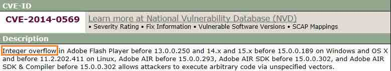

测试环境： Win7 SP1 + Flash ActiveX 15.0.0.167

## 0×01 漏洞利用分析

* * *

介绍有关漏洞关键代码前，先看一下 heap spray 后的内存布局：

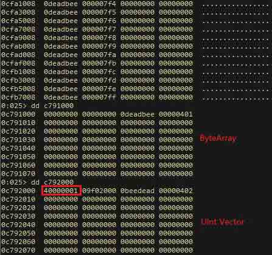

简单描述为：

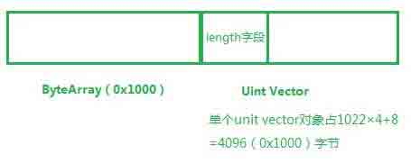

漏洞致使 Uint Vector 的 length 字段被改写。

漏洞关键代码：

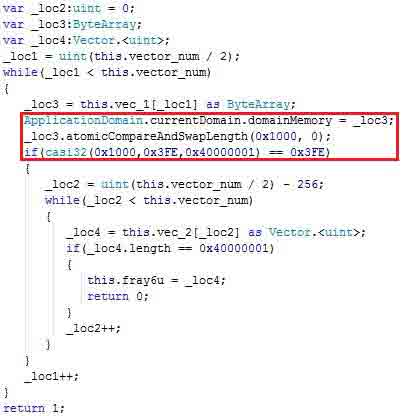

红线标注的部分其操作流程：

取预定大小 0×1000 的 ByteArray 对象 _loc3，赋值给 domainMemory，以便 casi32 函数操作此内存

预置大小 0×1000 的 ByteArray 对象：

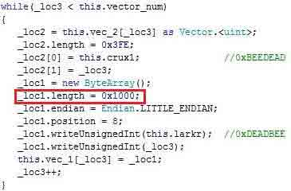

通过函数 atomicCompareAndSwapLength 将 _loc3 长度置 0

casi32 函数内由于整数溢出造成执行流改变，致使向 _loc3 偏移 0×1000 处成功写入 0×40000001

上述过程细节：

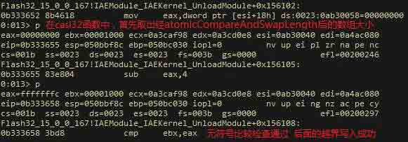

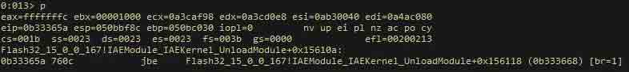

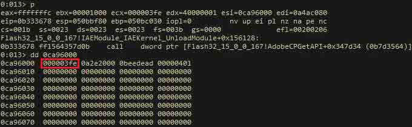

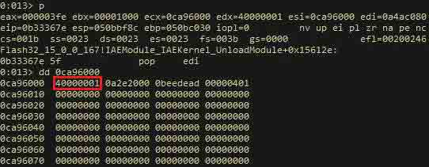

这样就可以以超长的 Uint Vector 为起点，读取预置的对象数据。

利用关键点：

搜索预置的 sound 对象进而计算出 flash 控件基址

预置的 sound 对象包含于喷射的少量 Vector Object 里，这里称之为 vec_3。

具体的喷射代码：

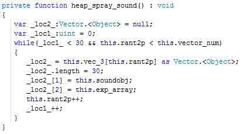

通过特征比对遍历以获取 vec_3 中元素：

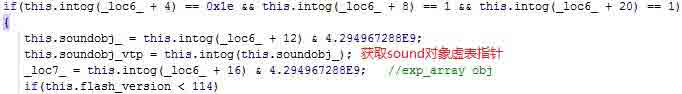

搜索到的其中一项：

计算 flash 控件基址：

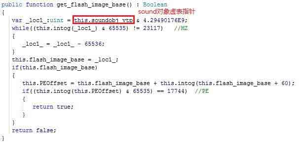

在 flash 控件基址基础上获取 rop 链所需指令，用 VirtualAlloc 分配可执行内存过 DEP。

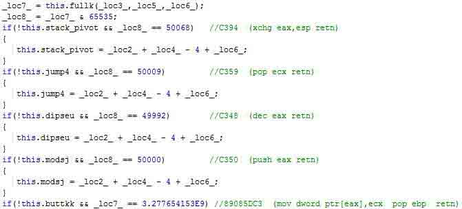

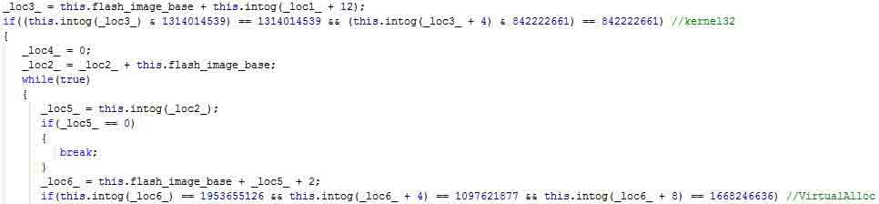

构造 rop 链（部分）：

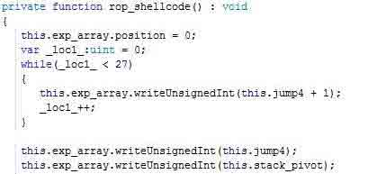

修改 sound 对象虚表指针，并调用修改后的虚表函数将执行流导向 stack pivot。

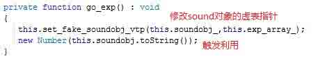

sound 对象虚表指针修改前后：

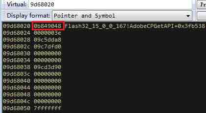

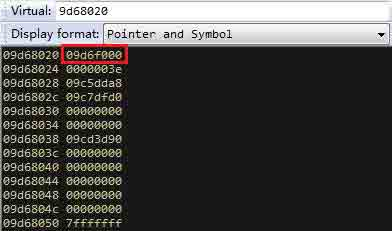

修改后的虚表指针指向内容：

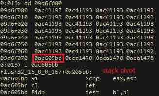

调用虚函数触发利用。

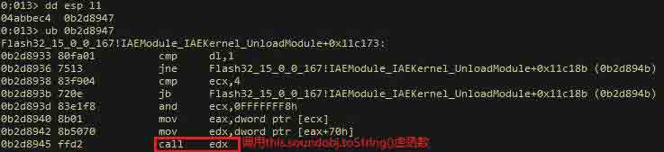

## 0×02 分析总结

* * *

完整的利用至少由两部分组成（html + swf），其中 swf 并不能独立执行，需要 html 传入的参数（shellcode），只拿到 swf 并不能获知攻击者的意图。

## 0×03 参考文章

* * *

1.  [CVE-2014-0569 漏洞分析](http://weibo.com/p/1001603769606924861349)

2.  [Cracking the CVE-2014-0569 nutshell](http://blogs.technet.com/b/mmpc/archive/2014/11/05/cracking-the-cve-2014-0569-nutshell.aspx)

版权声明：未经授权禁止转载 [绿盟科技](http://drops.wooyun.org/author/绿盟科技 "由 绿盟科技 发布")@[乌云知识库](http://drops.wooyun.org)

分享到：

### 相关日志

*   [深入探讨 ROP 载荷分析](http://drops.wooyun.org/papers/4077)
*   [一些你可能不知道的 Flash XSS 技巧](http://drops.wooyun.org/papers/948)
*   [闲扯下午引爆乌云社区“盗窃”乌云币事件](http://drops.wooyun.org/papers/382)
*   [常见 Flash XSS 攻击方式](http://drops.wooyun.org/tips/2924)
*   [Perl 数据类型安全研究【翻译】](http://drops.wooyun.org/papers/4505)
*   [MS15-002 telnet 服务缓冲区溢出漏洞分析与 POC 构造](http://drops.wooyun.org/papers/4621)