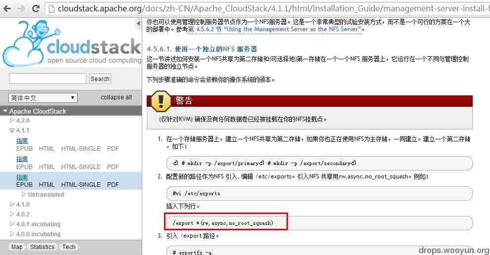
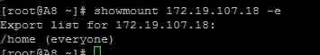
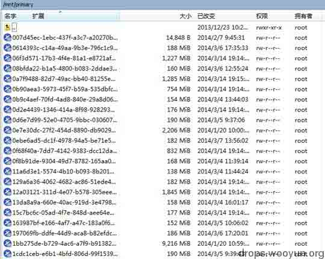

# 从 cloudstack 默认配置看 NFS 安全

2014/04/24 11:52 | [霍大然](http://drops.wooyun.org/author/霍大然 "由 霍大然 发布") | [技术分享](http://drops.wooyun.org/category/tips "查看 技术分享 中的全部文章"), [运维安全](http://drops.wooyun.org/category/%e8%bf%90%e7%bb%b4%e5%ae%89%e5%85%a8 "查看 运维安全 中的全部文章") | 占个座先 | 捐赠作者

看到有同学写了关于[NFS 的运维安全](http://drops.wooyun.org/tips/1423)，本菜鸟以 cloudstack 为例也写下关于 NFS 访问控制安全吧。

## 0x00 NFS 默认配置缺陷

* * *

在 Cloudstack 云平台部署时，按照 apache 官方的安装文档，如果又不对管理网络进行隔离会导致整个云环境中的虚拟机处于危险状态：



[`cloudstack.apache.org/docs/zh-CN/Apache_CloudStack/4.1.1/html/Installation_Guide/management-server-install-flow.html#prepare-nfs-share`](http://cloudstack.apache.org/docs/zh-CN/Apache_CloudStack/4.1.1/html/Installation_Guide/management-server-install-flow.html#prepare-nfs-share)

1.     配置新的路径作为 NFS 引入, 编辑`/etc/exports`。引入 NFS 共享用`rw,async,no_root_squash`。例如：

```
#vi /etc/exports

```

插入下列行。

```
/export *(rw,async,no_root_squash) 
```

看到如上的配置 exports 文件，小伙伴们震惊了吧，任意用户可以读取与写入文件，该配置是对整个云环境的存储做的配置，也就意味着任意能够访问到该 IP 的用户都可控制整个云系统。

## 0x01 攻击权限配置不当的 NFS 系统

* * *

只要在云环境中的任意一台主机进行查看：



然后进行 mount 该文件夹，可以任意操作该存储上的虚拟机：



## 0x02 漏洞修复

* * *

还是`/etc/exports`下的文件，如果配置成如下模式则可减少风险（我说的仅仅是减少）：

```
/export 172.19.104.6(rw,async,no_root_squash) 
```

这样就把访问控制给了单独的 IP，但这样是不是就安全了，小伙伴们可以继续想伪造 IP 的办法来绕过了。

版权声明：未经授权禁止转载 [霍大然](http://drops.wooyun.org/author/霍大然 "由 霍大然 发布")@[乌云知识库](http://drops.wooyun.org)

分享到：

### 相关日志

*   [反向代理的有趣用法](http://drops.wooyun.org/tips/509)
*   [NTP 反射型 DDos 攻击 FAQ/补遗](http://drops.wooyun.org/papers/955)
*   [J2EE MVC 模式框架中,表单数据绑定功能不安全实现在 Tomcat 下造成的 DoS 及 RCE](http://drops.wooyun.org/papers/1395)
*   [J2EE 远程代码执行那些事儿(框架层面)](http://drops.wooyun.org/papers/914)
*   [CDN 流量放大攻击思路](http://drops.wooyun.org/papers/679)
*   [闲扯下午引爆乌云社区“盗窃”乌云币事件](http://drops.wooyun.org/papers/382)