# Burp Suite 使用介绍（二）

2014/05/03 17:36 | [小乐天](http://drops.wooyun.org/author/小乐天 "由 小乐天 发布") | [工具收集](http://drops.wooyun.org/category/tools "查看 工具收集 中的全部文章") | 占个座先 | 捐赠作者

## Repeater

* * *

Burp Repeater(中继器)是用于手动操作和补发个别 HTTP 请求，并分析应用程序的响应一个简单的工具。您可以发送一个内部请求从 Burp 任何地方到 Repeater(中继器)，修改请求并且发送它。

### Using Burp Repeater

您可以使用中继器用于各种目的，如改变参数值来测试输入为基础的漏洞，发出以特定的顺序要求，以测试逻辑缺陷，并可以多次重发从 Burp Scanning results(扫描结果)的要求手动验证报告的问题。

For example:

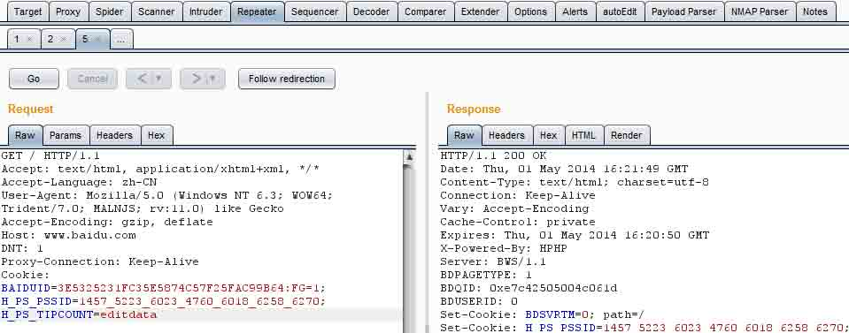


```
1)可以从 Proxy history、site map、Scanner result 里地项目地址详情发送到 repeater，可以对页面数据进行修改。  
2)点击 go，发送请求，右边响应请求。  
3)可以通过“<“和”>“来返回上一次和下一个操作。  
4)单击”x“可以删除当前测试请求页面，.....表示打开新的标签页  
5)底部的功能用于搜索条件，可以用正则表达式，底部右边显示匹配结果数 
```

### Issuing Requests

主中继器的用户界面可让您在多个不同的请求同时工作，每一个在它自己的标签。当你发送请求到中继器，每一件都是在自己的编号标签打开。

每个选项卡都包含以下项目：

控制发出请求，然后浏览请求的历史。目标服务器的请求将被发送显示 - 你可以点击目标细节来改变这些。

HTTP 消息中包含的编辑器将发出的请求。您可以编辑该请求，并一遍又一遍地重新发布它。

HTTP 消息编辑器，显示从上次发出的请求接收到的响应。

开始与中继器工作的最简单的方法是选择要在另一个 burp 工具（如 Proxy history 或 site map）工作的要求，并在上下文菜单中使用“Send to Repeater(发送到转发器)”选项。这将在中继器创建一个新的请求选项卡，并自动填充目标细节和请求消息的编辑器相关的细节。然后，您可以修改并发出所需的要求。当你的要求准备好发送，点击“go(转到)”按钮，将其发送到服务器。当这个被接收时，与响应长度和一个计时器（以毫秒为单位）一起被显示的响应。您可以使用通常的 HTTP 消息的编辑功能，以帮助分析请求和响应消息，并开展进一步的行动。

### Request History

每个中继器选项卡维护其自身已在它的请求的历史。您可以点击“ <”和“ > ”按钮来向前和向后导航这段历史，并查看每个请求和响应。您也可以使用下拉按钮以显示历史相邻项的编号列表，并迅速转移给他们。在历史上的任何时候，你可以编辑和重新发布当前显示的请求。

### Repeater Options

Burp Repeater 具有控制其行为的各种选项，包括自动更新的 Content- Length 头的，拆包的压缩内容，和重定向的下面。你可以通过 Repeater(中继器)菜单访问这些选项。

### Managing Request Tabs

您可以轻松地管理 Repeater 的 request(请求)选项卡。您可以：
通过双击该选项卡头重命名标签。
通过拖动重新排列标签。
通过单击最右侧的“...”选项卡上打开一个新的标签。
关闭选项卡单击该选项卡标题中的 X 按钮。

### Options

直放站菜单控制的 burpRepeater 的行为方面。下列选项可用：

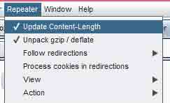

### Update Content-length

该选项控制 Burp 是否自动更新的要求在必要的 Content-Length 头。使用这个选项通常是必不可少的，当请求消息中包含一个身体。

### Unpack gzip/deflate

该选项控制 Burp 是否自动解压缩在收到的答复的 gzip 和 deflate 压缩内容。

### Follow redirections

此设置控制是否重定向响应会被自动执行。下列选项可用：

```
1)Never - 中继器将不会跟随任何重定向。  
2)On-site only - 中继器将只跟随重定向到同一个网页“site”，即使用相同的主机，端口和协议的是在原始请求使用的 URL。  
3)In-scope Only - 中继器将只跟随重定向到该套件范围的目标范围之内的 URL。  
4)Always - 中继器将跟随重定向到任何 URL 任何责任。您应使用此选项时应谨慎 - 偶尔，Web 应用程序在中继重定向到第三方的请求参数，并按照重定向你可能会不小心攻击你不想要的。 
```

### Process cookies in redirections

如果选择此选项，然后在重定向响应设置任何 cookies 将被当重定向目标之后重新提交。

### View

此子菜单允许您配置了请求/响应面板的布局。您可以在顶部/底部，左/右拉开，或在选项卡中查看 HTTP 消息。

### Action

此子菜单包含相同的选项，可在通过请求和响应消息编辑器的上下文菜单。

### Sequencer

Burp Sequencer 是一种用于分析数据项的一个样本中的随机性质量的工具。你可以用它来测试应用程序的 session tokens(会话 tokens)或其他重要数据项的本意是不可预测的，比如反弹 CSRFtokens，密码重置 tokens 等。

### Using Burp Sequencer

Burp Sequencer 是一种用于分析在应用程序的会话 tokens，并且意图是不可预测的其他重要数据项的随机性质量的工具。

使用 Sequencer 可能会导致在某些应用中意想不到的效果。直到你完全熟悉它的功能和设置，你应该只使用 Burp Sequencer 对非生产系统。

要开始去了解 Burp Sequencer，执行以下步骤：

```
1)首先，确保 Burp 已安装并运行，您已配置您的浏览器 Burp 的工作，并且您已经浏览你的目标应用程序来填充你的代理服务器的历史。  
2)发现发出会话 tokens 或其他类似的项目，无论是在 Set-Cookie 头，在一个表单域，或其他地方的代理史上的一个回应。使用上下文菜单中发送的内容到 Sequencer。  
3)转到 Sequencer 选项卡，然后再选择“live capture(现场捕获请求)”，选择你刚才发送的项目。 
```

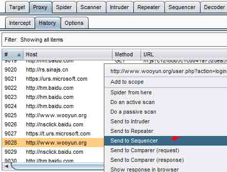

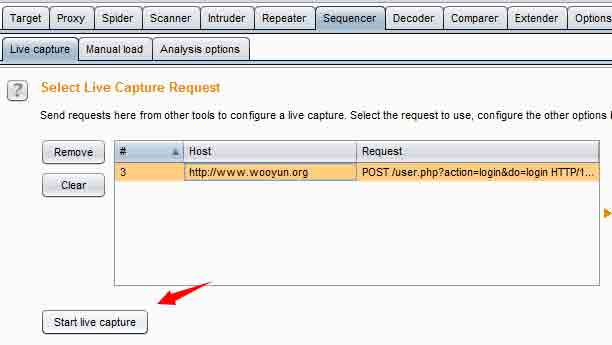

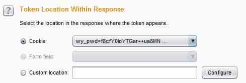

```
4)在“Token Location Within Response(tokens 位置在回应)”部分，选择在 tokens 出现的响应的位置。如果标记出现在自定义位置（即不是在一个 Set-Cookie 头或表单域） ，然后选择“Custon location(自定义位置)”选项，然后在对话框中，选择响应 tokens，然后单击“确定” 。 
```

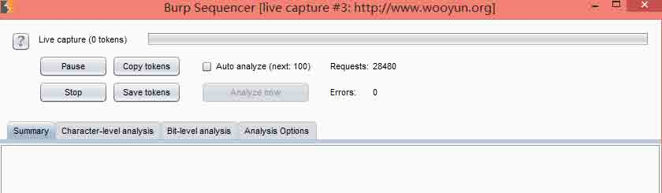

```
5)在“Select live Captrue Request(选择现场捕获请求)”部分中，单击“Start live capture(开始实时捕获)”按钮。这将导致 Burp 反复发出原始请求，并 extract(提取)所有在响应收到的 tokens。实时捕获会话打开一个新窗口，显示捕获的进度，并已获得的 tokens 数量。当几百 tokens 已获得，暂停实时捕获会话，然后单击“Analyze now(立即分析)”按钮。  
6)当分析完成后，会显示出随机性测试的结果。这表明样品中整体摘要，并附有详细的结果为每种类型进行了测试。有简短的文档，结果自己在每个测试。在某些情况下，你可能已经获得 tokens 的一个合适的样本。您可以手动加载此样品为 Sequnecer，并执行相同的分析。要做到这一点，在主 burp 的 UI ，转到序选项卡，然后手动加载子选项卡。您可以从剪贴板粘贴标记，或从文件中加载它们，并使用“Analyze now(立即分析)”按钮，开始装载样品的分析。 
```

### Randomness Tests

Burp Sequencer 采用标准统计测试的随机性。这些都是基于对测试的证据试样的假设，并计算发生的观测数据的概率，假设该假说是真实的原则：

### Character-Level Analysis

字符级测试在其原始形式 tokens 的每个字符位置进行操作。首先，字符设置在每个位置的大小进行计数- 这是出现在每个位置上的取样数据中的不同的字符的数目。然后，下面的测试是使用此信息来进行：

**Character count analysis** - 此测试可分析 tokens 内使用在各位置中的字符分配。如果样品是随机生成的，所用的字符的分布可能是近似均匀的。在每个位置上，该测试计算，如果 tokens 是随机产生所观察到的分布的概率。
**Character transition analysis** - 此测试可分析样品中的连续符号之间的转换。如果样品是随机生成的，一个字符出现在一个给定的位置，同样可能被随后的下一个标记由一个用于在该位置上的字符中的任何一个。在每个位置上，该测试计算，如果 tokens 是随机产生的观察到的转换的概率。

基于上述试验，character-level analysis(字符级分析)计算整体分数，每个字符位置 - 这是在每个位置由每个字符级测试的计算的最低概率。分析然后计数的有效熵各种显着性水平的位的数目。根据它的字符集的大小，每个位置被分配一个号码的比特（如果有 4 个字符，3 位，如果有 8 个字符等 2 位），并且比特的总数等于或高于每显着性水平进行计算。

### Bit-Level Analysis

Bit-level test(位级测试)是比字符级测试功能更强大。启用位级的分析，每个 tokens 被转换成一组比特，与由字符集的每个字符位置的大小来确定的比特的总数。如果任何职位聘用，其大小不是 2 的圆形电源的字符集，在该位置的样本数据被转换成其大小是两个最接近的较小的圆形电源的字符集。在该位置的数据的部分比特被有效地合并成从该位置所产生的全部位。这个翻译是在被设计为保留原始样本的随机性特点，不会引入或移除任何偏见的方式进行。然而，这种类型的没有进程可以是完美的，它很可能与分析非圆字符集大小的样本将介绍一些不准确到分析结果的过程。当每个 tokens 已被转换成一个比特序列，下面的测试是在每个位的位置进行：

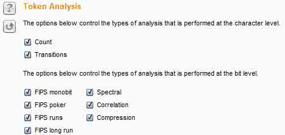

**FIPS monobit test** - 此测试分析的 1 和 0 的每个位的位置分布。如果样品是随机产生的，1 和 0 中的数量很可能是近似相等的。在每个位置上测试计算，如果 tokens 是随机产生所观察到的分布的概率。对于每一个进行的，除了报告中出现的观测数据的概率 FIPS 测试，Burp Sequncer 也记录是否每一位通过或失败的 FIPS 测试。请注意，通过 FIPS 标准重新调整 Burp Sequencer 内任意样本量的工作，而正式规范的 FIPS 测试假定恰好 20,000tokens 的样本。因此，如果你希望得到的结果是严格符合 FIPS 规范，你应该确保你使用的 20,000tokens 的样本。

**FIPS poker test** - 该测试将所述位序列中的每一个位置转换成的四个连续的，非重叠的组，并导出一个 4 位的数量从每个组。然后计算每个出现 16 个可能的数字的数，并进行卡方计算来评估这样的分布。如果样品是随机生成的，四比特数的分布可能是近似均匀的。在每个位置上，该测试计算，如果 tokens 是随机产生所观察到的分布的概率。
FIPS runs tests - 该测试将所述位序列中的每一个位置转换成连续的位具有相同值的运行。然后计算试验次数为 1，2，3，4，5，和 6 及以上的长度。如果样品是随机生成的，运行与每个这些长度的数量很可能是由样本集的大小所确定的范围之内。在每个位置上，该测试计算发生，如果 tokens 是随机观察到的运行的概率。

**FIPS long runs test** - 这个测试测量位在每个位的位置值相同的最长运行。如果样品是随机生成的，最长的运行很可能是由样本集的大小所确定的范围之内。在每个位置上，该测试计算，如果 tokens 是随机产生所观察到的最长的概率。需要注意的是符合 FIPS 规范这个测试仅记录失败，如果位的最长过于漫长。然而，位过于短最长也表明，样品是不是随机的。因此，某些位可能录得显着性水平是低于 FIPS 传递，即使他们没有严格失败的 FIPS 检验水平。

**Spectral tests** - 该测试执行在每个位置上的比特序列的复杂的分析，并能够识别非随机性的证据表明，通过其他的统计测试的一些样品中。测试工程通过比特序列以及将每个系列的连续的数字作为一个多维空间的坐标。它绘出的点在此空间由这些坐标来确定每个位置。如果样品是随机生成的，点此空间内的分布可能是大致均匀;在该空间内联网的外观表示该数据很可能是不随机的。在每个位置，测试，计算所观察到的分布存在的，如果 tokens 是随机的概率。该试验重复进行多种尺寸的数目（1〜8 位）和用于多个号码的尺寸（2 至 6）。

**Correlation test** - 其他各个位级测试工作在采样 tokens 中的各个位的位置，所以随机性的每个位的位置量计算隔离。仅执行这种类型的测试将防止随机性的 tokens 作为一个整体金额的任何有意义的评估：包含在每个位置相同的位值标记的样本可能会出现含有比含有不同的值更短的标记的样品更多的熵在每个位置上。因此，有必要以测试在 tokens 内的不同的位位置中的值之间的任何统计学显著关系。如果样品是随机生成的，在给定的比特位置处的值是同样可能伴随着一个或一个零在任何其它位的位置。在每个位置上，这个测试与计算在出现的其他位置位观察，如果 tokens 是随机的关系的可能性。为了防止任意的结果，当两个比特之间观察到一定程度的相关性，该测试调整，其显着性水平下是基于所有其他位级测试的位的显着性水平。

**Compressoion test** - 其他各个位级测试工作在采样 tokens 中的各个位的位置，所以随机性的每个位的位置量计算隔离。仅执行这种类型的测试将防止随机性的 tokens 作为一个整体金额的任何有意义的评估：包含在每个位置相同的位值标记的样本可能会出现含有比含有不同的值更短的标记的样品更多的熵在每个位置上。因此，有必要以测试在 tokens 内的不同的位位置中的值之间的任何统计学显著关系。如果样品是随机生成的，在给定的比特位置处的值是同样可能伴随着一个或一个零在任何其它位的位置。在每个位置上，这个测试与计算在出现的其他位置位观察，如果 tokens 是随机的关系的可能性。为了防止任意的结果，当两个比特之间观察到一定程度的相关性，该测试调整，其显着性水平下是基于所有其他位级测试的位的显着性水平。

### Samples

在一个应用程序的令牌进行随机试验中，首先有必要获得这些令牌的合适的样品。这可以通过两种方式来完成：通过直接从目标进行标记的自动 live capture(实时捕捉)，或通过 Manually loading(手动加载)令牌，你已经取得的样本。

### Live Capture

要进行 live capture(实时捕捉)，你需要找到一个返回响应的地方，你要分析的 session token(会话令牌)或其他项目的目标应用程序中的请求。您可以选择在任何地方 Burp 的请求，然后从上下文菜单中选择“Send to sequencer(发送到音序器)”选项做到这一点。需要对这个请求来配置实况采集的步骤如下所述。

#### i)Select Live Capture Request - 实时捕获请求列表中显示已发送到音序器从其他 burp 工具的要求。选择返回你想要分析的标记或其他项目的要求。

#### ii)Token Location Within Response - 选择令牌出现的应用程序的响应中的位置。

下列选项可用：

```
cookie - 如果响应设置的任何 cookie，这个选项可以让你选择一个 cookie 来分析。这是通过会话令牌给客户的最常用方法。  
Form field - 如果响应包含任何 HTML 表单字段，这个选项可以让你选择一个表单字段的值来分析。这种方法通常用于发送反 CSRF 令牌和其它每页令牌提供给客户。  
Custom location - 您可以使用此选项来包含要分析的数据的响应中指定一个特定的自定义位置。这是通过使用响应提取规则对话框。 
```

#### iii)Live Capture Options

这些设置控制用于执行实时捕捉时发出 HTTP 请求和收获令牌发动机。下列选项可用：

```
number of threads(执行绪数目) - 此选项控制并发请求数的实时捕捉，却可以使。  
Throttle between requests(请求之间的节流)- 可选的，实时捕捉每一个可以请求之前等待一个指定的延迟（以毫秒为单位）。此选项很有用，以避免超载应用程序，或者是更隐蔽。  
Ignore token whose length deviates by x characters 忽略令牌，其长度偏差的 X 字符- 您可以选择配置的实时捕捉忽略的令牌，其长度与平均长度令牌偏离给定的阈值。这可能是有用的，如果应用程序偶尔会返回一个包含在令牌通常出现的位置不同项目的异常反应。 
```

#### vi)Running the Live Capture

当你已经完全配置的 live Capture(实时捕捉)，点击“开始实时捕获”按钮开始实时捕捉。burp 序会反复发出您的请求，并从应用程序的响应提取相关的令牌。在实时捕捉，一个进度条显示，有令牌，请求和网络错误次数的计数器。下列选项可用：

```
Pause/resume(暂停/恢复) - 这将暂时停顿，然后继续，捕捉。  
Stop(停止) - 这会永久停止捕获。副本令牌 - 这会将当前拍摄的令牌到剪贴板，以便在其他 burp 攻击（如入侵者有效载荷）或工具的使用。  
Save tokens(保存 tokens) - 这节省了当前拍摄的令牌文件。  
Auto-analyze(自动分析) - 如果启用此选项，burp 就会自动进行标记分析，并定期更新结果现场采集过程中。  
Analyze now(现在分析) - 这是时可用最少 100 令牌已被抓获，并导致 burp，分析当前采样和更新的结果。 
```

### Manual load

此功能允许你加载 Sequencer 与您已获得令牌的样本，然后进行统计分析的样本。

要执行手动负载，您首先需要通过一些手段，比如你自己的脚本或从较早的 live captrue 实时捕捉，输出，或 Intruder attack，以获得自己的目标应用程序令牌的样本。令牌需要在一个简单的换行符分隔的文本格式。

使用粘贴按钮，从剪贴板粘贴，或 Load 按钮的标记，从文件中加载它们。加载令牌，再加上最短和最长长度的详细情况，将显示您感，检查样品已正确装入。
要执行加载令牌的分析，请单击“analyze now(立即分析）”按钮。

### Analysis Options

在“analysis options(分析选项)”选项卡允许您配置如何 Token Handled，并在分析过程中都进行哪些类型的测试。

### Token handling

令牌过程中如何分析处理这些设置控制。下列选项可用：

```
Pad short tokens at start/end(垫短令牌在开始/结束) - 如果由应用程序产生的标记具有可变长度，这将需要被填充，以使将要进行的统计检验。您可以选择是否填充应在开始或每个标记的结尾被应用。在大多数情况下，填充令牌在开始是最合适的。  
Pad with(垫) - 您可以指定将用于填充字符。在大多数情况下，对于数字或 ASCII 十六进制编码的令牌，填充与“0”字符是最合适的。  
Base64-decode before analyzing(base64 解码分析之前) - 如果令牌是 Base64 编码，可以配置 Burp 分析，这将普遍提高在编码分析之前的准确度。 
```

### Token Analysis

这些选项控制所执行分析的类型。您可以单独启用或禁用每种类型的字符级和位级测试。有时候，启用所有测试进行了初步分析后，您可能需要禁用某些测试，以反映您更好的了解所标记的特点，或以隔离受您的样品表现任何不寻常的特性的影响。
在结果窗口中，修改任何的分析选项后，您可以点击“重做分析”按钮，您的新设置重新进行了分析，并更新结果。

### Result

### Summary

summary 选项卡是看获得有关随机性样品中的程度的总体结论首位。它包括一个图表，显示的有效熵以上各显着性水平的位的数目。这提供了一个直观的判决用来传递随机性测试不同的可能显着性水平的位的数目。
该标签还报告了结果的可靠性的估计值，是根据样本的数量。

### Character-level analysis

人物层次的分析选项卡显示所有字符级测试结果摘要，并让您深入到每个字符级测试的细节。它也包含图表显示的字符集在每个位置的大小，并且熵的比特可以从每个字符位置来提供的最大数量。

注意，字符级测试是不可靠的，如果所采用的字符集的大小过大相对于样本的数目。例如，如果一个令牌采用了 64 个不同的字符在每个位置，你只捕获 100 个样品，还有隔靴搔痒的样本数据得出关于角色分配的任何可靠的结论。出于这个原因，当存在的不可靠的结果的危险，burp 序将自动禁止字符级测试，以防止破坏整体合并结果从分析的字符级的结果。

### Bit-level analysis

该位层次的分析选项卡中显示了所有位级的测试结果摘要，并让您深入到每一个位级测试的细节。这可以让你获得样品的性能有更深的了解，找出任何异常的原因，并评估令牌预测的可能性。
还有一个图表，显示位贡献的令牌中的每一个字符的位置的数目。这将使你的令牌中交叉引用各个位回到原来的字符位置，如果你需要。

### Analysisi options

分析选项卡显示已配置的分析的选项。如果需要重新进行分析,您可以修改这些。

### Decoder

Burp Decoder 是一种用于将编码数据纳入其规范形式，或将原始数据转换成各种编码和哈希表的简单工具。它能够智能地识别多种编码格式采用启发式技术。

### Loading Raw Data

您可以将数据加载到解码器在两个方面：

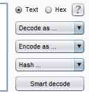

键入或直接粘贴到顶部编辑器面板。

选择数据中 burp 的任何位置，然后从上下文菜单中选择“发送到解码器”。

您可以使用“文本”和“十六进制”按钮来切换编辑器的类型来对数据使用。

### Transformations

转换不同的变换可以应用到的数据的不同部分。下面的解码和编码操作可用：

```
1)Url  
2)HTMLBase64  
3)十六进制  
4)ASCII 码  
5)八进制  
6）二进制  
7)GZIP 等 
```

各种常用的散列函数是可用的，取决于你的 Java 平台的功能。

### Working manually

要进行手动解码和编码，使用下拉列表选择所需的变革。所选择的转型将被应用到选定数据，或整个数据如果没有被选中。

### Smart decoding

在解码器内的任何面板，您可以点击“智能解码”按钮。然后 Burp 将试图通过寻找出现在可识别的格式，例如 URL 编码或 HTML 编码要编码的数据来智能地解码该面板的内容。递归执行这个动作，一直持续到没有进一步的识别的数据格式检测。这个选项可以是一个有用的第一步，当你已经确定了一些不透明的数据，并想快速浏览一下，看看是否可以很容易地解码成更容易识别的形式。应用到数据的每个部分的解码是使用通常的着色表示。因为 Burp 解码器，使一个“最佳猜测”尝试识别一些常见的编码格式，它有时会犯错误。发生这种情况时，你可以很容易地看到所有参与解码的阶段，及已被应用在每个位置上的转变。使用手动控制则可以手动修复任何不正确的转换和手动或巧妙继续解码从这点。

## Comparer

* * *

Burp 的 Comparer 是执行任何两项数据之间的比较（视觉“diff(差异)”）一个简单的工具。对 Burp 的 Comparer 一些常见用途如下：
当寻找的用户名枚举的条件下，您可以使用有效和无效的用户名比较响应登录失败，寻找在反应细微的差别。
当 Intruder 袭击已导致不同长度的比基反应一些非常大的反应，你可以比较这些很快看到那里的分歧所在。
当 comparing 的 site maps 或通过不同类型的用户生成的 Proxy history 条目，你可以比较对类似的要求，看看那里的不同之处在于，为不同的应用程序行为引起的。
当测试使用布尔条件注射和其他类似的测试盲目 SQL 注入漏洞，你可以比较两个反应，看是否注射不同的条件已导致响应的相关差异。

### Loading Raw Data

您可以将数据加载到 comparer 对以下方式：

```
它直接粘贴形成剪贴板。  
从文件中加载它。  
选择数据中 burp 的任何位置，然后从上下文菜单中选择“发送到的 Comparer”。 
```

### Performing Comparisons

加载数据的每个项目显示为两个相同的列表。要进行比较，从每个列表中选择其他项目，并单击其中的“comparsions”按钮之一：

Word compare(字比较) - 这种比较 tokenizes 根据空格分隔每个数据项，并确定了改造的第一个项目进入第二所需的标记级别的编辑。当在单词层面存在被比较项之间的有趣的差异，例如，在含有不同含量的 HTML 文档，是最有用的。

Byte compare(字节比较) - 这种比较确定改造的第一个项目进入第二所需的字节级的编辑。当在字节水平存在比较项之间的有趣的差别，比如在包含在一个特定的参数或 cookie 值稍有不同值的 HTTP 请求，这是最有用的。注意：该字节级的比较是相当多的计算密集的，并且当一个字级别的比较失败，以确定在一个信息道的相关的差异通常应该只使用这个选项。当您启动一个比较，会出现一个新窗口，显示比较的结果。该窗口的标题栏显示的差异（即编辑）这两个项目之间的总数。在两个主面板显示项目相比彩色化来表示每个修改，删除和改造的第一个项目进入第二所需的加法。你可以在文本或十六进制形式查看每个项目。选择“sync views(同步视图)”选项可以使您同时滚动两个小组等快速找出在大多数情况下有趣的编辑。

## Extender

* * *

### Using Burp extender

要使用 Burp extender 功能，需要一下几个步骤：

```
1.首先必须要有 java 环境  
2.在 Burp extensions 下单击 add 添加 
```


```
3.选择查找.jar 后缀插件，点击确定之后下一步就是安装了  
4.安装好了会提示安装成功，并且在如下图中显示 
```

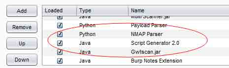

```
5.如果是 python 扩展的话需要先到 options 中配置好 python 环境并且安装 jython 环境 
```

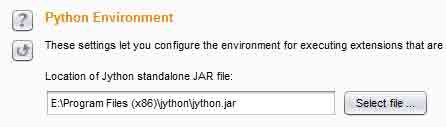

### Loading and managing extensions

下表显示了所有已安装的扩展名列表。您可以添加，删除和使用按钮的扩展表重新排序的扩展。请注意：
该扩展名的显示顺序是，其中的任何注册的侦听器和其他推广资源将被调用的顺序。
扩展可以卸载，但保留在表中，以便能够方便重装稍后 time.To 切换扩展的负载状态，而不从列表中删除它，在“loaded”栏或扩展详细信息面板中单击该复选框。注意：您可以快速重新按 Ctrl +单击“loaded”复选框的延伸。这将卸载并重新加载该扩展名，而不显示确认对话框。
要运行用 Python 编写的扩展，你首先需要配置 Jython 的独立 JAR 的位置，在 Python 环境选项。

### Extension details

选择在扩展表中的项目显示在下部面板的扩展信息。详细信息选项卡显示以下信息：无论是扩展当前加载的。您可以点击复选框，加载或卸载选定的扩展。扩展名。扩展可以通过编程设置其显示在用户界面中自己喜欢的名字。您可以手动编辑，如果需要此名称。扩展（ Java 或 Python）的类型。从中加载该扩展名的文件。的方法，听众，并在由扩展使用其他资源的详细信息。输出选项卡包含扩展的标准输出流的细节，以及错误选项卡包含有关标准错误流相同的信息。为每个数据流，可以配置应用程序的输出是否应该被定向到系统控制台，或者保存到文件中，或者在 UI 中显示出来。请注意：写法基于 UI 的输出窗口有大小限制，不适合用于重型记录。扩展是负责指导他们的输出和错误消息，其中 burp 已经分配给他们正确的数据流，并通过扩展 API 的编程可用。扩展不遵守这个可以直接直接输出到系统控制台，无论在这里具体确定的设置。

### Burp extender apis

此选项卡包含可用于创建 Burp extensions API 的细节。该列表显示，可在 Burpk 运行版本的 API。从列表中选择一个接口的名称，显示界面代码全部。
您还可以使用“save interface files(另存接口文件)”和“save javadoc(保存 Javadoc 文件)”按钮来保存这些文件的本地副本，用于开发扩展的时候。

## Options

* * *

### Settings

此设置控制启动时 Burp 是如何处理扩展。当 Burp 启动时，它会自动恢复可扩展的配置清单。如果选择此选项，Burp 也将自动尝试重新加载列表中的该被装在其发生时 Burp 是关闭任何扩展。

### Java Environment

设置允许您配置环境执行的是用 Java 编写的扩展。如果您的扩展使用任何库，你可以指定哪些库将被加载的文件夹。burp 会搜索这个文件夹中的任何 JAR 文件，并且将在用于加载 Java 扩展类加载器的类路径中包括这些。

### Python Environment

设置允许您配置环境执行的是用 Python 编写的扩展。使用 Python 扩展，您将需要下载的 Jython ，这是 Java 实现的 Python 解释器。下列选项可用：在 Jython 的独立 JAR 文件的位置 - 这是您已下载的 Jython 的位置。你必须下载的 Jython 的独立版本。文件夹中加载的模块 - 此设置是可选的，可以用来指定从哪个 Python 解释器应该尝试加载所需要的您的扩展模块的文件夹。如果配置，此选项会导致 Burp 来更新指定的位置了 Python 的 sys.path 变量。如果您已经创建了自己的一套 Python 库在多个单独的扩展使用使用此选项很有用。

注意：由于在 Jython 中动态生成 Java 类的方式，您可能会遇到内存问题，如果你加载多个不同的 Python 扩展，或者如果你卸载并重装一个 Python 扩展多次。如果发生这种情况，你会看到一个这样的错误：java.lang.OutOfMemoryError: PermGen space
You can avoid this problem by configuring Java to allocate more PermGen storage, by adding a -XX:MaxPermSize option to the command line when starting Burp.

例如:java -XX:MaxPermSize=1G -jar burp.jar

## Ruby Environment

设置允许您配置环境执行的是用 Ruby 编写的扩展。使用 Ruby 的扩展，你需要下载的 JRuby，这是 Java 实现的 Ruby 解释器。请注意，您可以在这里配置 JRuby 的 JAR 文件的位置，或者您也可以通过 Java 类路径在启动时加载的 JAR 文件。

## Suite Options

* * *

Burp 含有大量的影响的所有工具的行为套房范围的选项。

有如下选项：

### Connections

此选项卡包含设置来控制 Burp platform authentication，upstream proxy servers，SOCKS 代理，timeouts，hostname resolution，以及范围外的要求。

### platform authentication

设置允许您配置 Burp platform authentication(平台自动)验证到目标 Web 服务器。不同的认证方式和认证可以配置为单个主机。

支持的认证类型有：Basic(基本的)，NTLMv1，NTLMv2 身份验证和摘要验证。域和主机名信息仅用于 NTLM 身份验证。

在“Prompt for credentials on platform authentication failure(提示平台上认证失败凭据)”选项会导致 Burp 显示交互式弹出每当身份验证失败时遇到的问题。

### Upstream Proxy Servers

设置控制 Burp 是否会向外发送请求到 Upstream Proxy Servers，或者直接到目标 Web 服务器。
您可以定义多个规则，指定不同的目标主机或主机组不同的代理服务器设置。规则的应用顺序，而目标 Web 服务器相匹配的第一条规则将被使用。如果没有规则匹配，burp 默认为直接的，非代理连接。
您可以在目标主机规范中使用通配符（*匹配零个或多个字符，而？除了点匹配任何字符）。将所有流量到一个单一的代理服务器，创建一个规则*为目的主机。离开代理主机空白直接连接到指定的主机。
对于您配置的每个上游代理服务器，如果需要，可以指定认证方式和认证。支持的认证类型有：基本的，NTLMv1，NTLMv2 身份验证和摘要验证。域和主机名信息仅用于 NTLM 身份验证。

### Socks Proxy

设置允许您配置 Burp 使用 SOCKS 代理的所有传出的通信。此设置是应用在 TCP 层，所有出站请求都将通过这个代理发送。
如果您已经为上游 HTTP 代理服务器配置的规则，然后请求到上游代理服务器将通过这里配置的 SOCKS 代理发送。
如果“DNS 查询在 SOCKS 代理”启用该选项，则所有的域名将由代理解决。没有本地查询将被执行。

### Timeouts

设置指定要用于各种网络任务的超时。您可以指定以下超时：

```
Normal(正常) - 此设置适用于大多数网络通信，并确定长期 burp 怎么会放弃已经发生了超时的请求，并记录之前等待。  
Open-ended responses(开放式的回应) - 此设置仅用于需要响应不包含内容长度或传输编码的 HTTP 标头被处理的。在这种情况下，burp 确定该传输已经完成之前，等待指定的时间间隔。  
Domin name resoolution(域名解析) - 此设置确定如何经常 burp 会重新执行成功的域名查找窗口。这应该被设置为一个适当的低的值，如果目标主机地址被频繁地改变。  
Failed domain name resolution(失败的域名解析) - 此设置确定 burp 多久将重新尝试不成功的域名查找窗口。  
值以秒为单位。如果选项是空白的，然后 burp 永远不会超时的功能。 
```

### Hostname Resolution

设置使您可以指定主机名映射到 IP 地址，来覆盖你的电脑所提供的 DNS 解析。
每个主机名解析规则指定一个主机名，并应与该主机名关联的 IP 地址。规则可以单独启用或禁用。
这个功能可能是有用的，以确保请求的正确前进转发时，hosts 文件已被修改为从非代理感知厚客户端组件进行流量的不可见的代理。

### Out-of-Scope Request

可用于防止 Burp 从发行任何超出范围的要求。当你需要保证没有请求做出不在范围的为你目前的工作目标，它可以是有用的。即使你的浏览器使得对于超出范围的项目要求，即将卸任的请求将通过 Burp 被丢弃。
您可以启用此功能为当前目标范围。或者，您可以使用 URL 匹配规则定义自定义范围。

## HTTP

* * *

### Redirections

设置控制重定向的类型的 Burp 会在它被配置为跟随重定向的情况下理解。
可以选择重定向的种类如下：

```
1)3xx status code with location header  
2)refresh header  
3)meta refresh tag  
4)JavaScript driven  
5)与 Location 标头的任何状态码 
```

注意，Burp 在以下重定向到特定的目标行为是由每个单独的 Burp 工具内设置（例如，根据目标范围内）来确定。

### Streaming Responses

可以告知 Burp 哪些 URL 返回“流媒体”的反应，这不终止。然后 Burp 会不同于正常的反应处理这些反应。流式反应通常用于像不断更新，现申请价格数据的功能。

### Status 100 Responses

控制 Burp 处理与状态 100 的 HTTP 响应的方式。当一个 POST 请求发送到服务器，这些反应常发生的，它使一个临时的响应请求体已被发送之前。
下面的设置：
understand 100 continue response(了解 100 继续响应) - 如果选中此选项，Burp 会跳过中期响应和解析真正的响应头像状态代码和内容类型的响应信息。
Remove 100 continue headers 除去 100 继续头 - 如果选中此选项，Burp 会在此之前被传递到单独的工具从服务器的响应中删除任何中期头部。

### SSL Negotiation

有时候，你可能有困难的谈判与某些 Web 服务器的 SSL 连接。 Java 的 SSL 协议栈包含了几个小鬼，和失败与某些不寻常的服务器配置工作。为了帮助您解决这个问题，Burp，您可以指定哪些协议和密码应该在 SSL 协商提供给服务器。下面的其他选项可用：自动选择对谈判失败兼容 SSL 参数 - 如果启用此选项，那么当 Burp 失败时使用配置的协议和密码进行谈判的 SSL ，它会探测服务器，试图建立是由双方支持一组兼容的 SSL 参数服务器和 Java 。如果找到兼容的参数，Burp 缓存此信息，并使用在第一个实例中的参数具有相同的服务器未来的谈判。这个选项通常是可取的，可避免需要解决 SSL 问题，并尝试使用协议和密码。启用阻止 Java 安全策略的算法 - 从 Java 7 的， Java 安全策略可以被用来从 SSL 协商被用于阻止某些过时的算法，以及其中的一些默认情况下（如 MD2 ）受阻。现场许多 Web 服务器都使用这些过时的算法， SSL 证书，它是不可能使用默认的 Java 安全策略来连接到这些服务器。启用此选项允许 Burp 在连接到受影响的服务器时使用过时的算法。对此选项的更改才会生效当您重新启动 Burp。允许不安全的 SSL 重新协商 - 此选项可能会使用一些客户端的 SSL 证书时，或试图周围其他的 SSL 问题的工作是必要的。
SSL

### Client SSL Certificates

允许您配置客户端 SSL 证书，当目标主机申请一个 Burp 会使用。您可以配置多个证书，并指定每个证书应使用的主机。当主机请求的客户端 SSL 证书，Burp 会在列表中的主机配置匹配被连接的主机的名称中使用的第一个证书。您可以在目标主机规范中使用通配符（ *匹配零个或多个字符，而？除了点匹配任何字符） 。要使用一个证书，每当任何主机请求之一，使用*作为目标主机。客户端证书支持以下类型：文件（ PKCS ＃ 12 ） - 你将需要配置的证书文件的位置和密码的证书。硬件令牌或智能卡（ PKCS ＃ 11 ） - 你将需要配置 PKCS＃11 库文件的位置，为您的设备，您的 PIN 码，然后选择从那些可用的证书。该 PKCS＃11 库文件是用软件为您的设备安装的本机代码文件。在 Windows 上，Burp 可以自动搜索常见位置找到您所安装的库文件。

### Server SSL Certificates

此信息仅面板包含从 Web 服务器接收到的所有的 X509 证书的详细信息。双击表格中的项目，以显示该证书的完整细节。

### Session

此选项卡包含的设置 session handing rules,the cookie jar,and macros。

### Session Handling Challenges

当执行任何类型的 Web 应用程序的测试，你可能会遇到与会话处理和地区的挑战。
例如：该应用程序可终止被用于测试会话，无论是防守还是其他原因，使后续的请求是无效的，直到会话恢复。某些功能可能使用改变必须与每个请求（例如，妨碍请求伪造攻击）提供的令牌。某些功能可能需要一系列的要求被测试前，作出其他的请求，获取应用程序到一个合适的状态，它正在接受测试的要求。执行自动化测试任务，如起毛或扫描时，可能会出现这些问题，当你手动测试也可能出现。Burp 的会话处理功能包含一系列的功能，以帮助在所有这些情况下，让你继续你的手动和自动测试，同时 Burp 需要在后台为你的问题的照顾。

### Session Handling Rules

Burp 让你定义的会话处理的规则清单，让您非常细粒度地控制 Burp 处理应用程序的会话处理机制和相关的功能。每个规则包含一个作用域（什么规则适用于）和行动（什么规则呢） 。对于每一个即将离任的要求，即 Burp 它决定了所定义的规则在范围的请求，并执行所有这些规则的行为的顺序（除非条件检查行动决定不采取进一步行动，应适用于要求提供） 。在范围内为每个规则可基于任何正在处理的请求的下列功能或全部来定义：
Burp 工具发出的请求。
请求的 URL。的请求中参数的名称。每个规则可以执行一个或多个动作，例如：更新 cookie 从 Burp 的蜜罐。验证当前会话。运行宏（请求的预定义的顺序） 。通过创建不同的范围和行动多条规则，你可以定义行为的层次结构 Burp 将适用于不同的应用和功能。例如，在一个特定的测试可以定义如下的规则：对于所有的请求，从 Burp 的 cookie jar 添加 cookie。对于请求到特定的域，验证当前会话与该应用程序仍处于活动状态，如果没有，运行宏在应用程序重新登录，并更新蜜罐用得到的会话令牌。对于请求到包含 __ csrftoken 参数特定的 URL ，首先运行一个宏来获取有效 __ csrftoken 价值，并提出请求时使用此。

### Session Handling Tracer

需要申请 Burp 的会话处理功能，以对现实世界的应用程序的功能的配置往往是复杂的，并且就很容易犯错。您可以使用会话处理示踪剂，以帮助您解决您的会话处理配置。
示踪显示，已经由会话处理功能的处理（即，其中至少一个会话规则已经应用）每个请求的列表。对于每个处理请求，所述示踪剂表示规则和进行该操作序列，并且改变到在序列中的每个步骤中的电流要求而作出。
请注意，会话处理示踪规定了所有受影响的 HTTP 请求的处理和存储开销。您应该只与故障排除会话处理的规则问题，当使用的示踪剂，不应该离开它通常运行。

### Cookie Jar

Burp 维护一个 cpploe 干罐，用于存储所有你访问的网站发出的 cookies 。密罐是所有 Burp 的工具之间共享。您可以配置哪些工具 Cookie 罐应监测，以更新的 cookies 。默认情况下，蜜罐是基于代理和蜘蛛的工具流量更新。Burp 监视由配置工具接收到的响应，并更新蜜罐与设置任何新的 Cookie。在代理的情况下，从浏览器传入的请求也被检查。凡申请在前面设置一个永久性的 Cookie 这是目前在您的浏览器，这是需要你的会话进行适当的处理，这是很有用的。有 Burp 更新基础上，通过代理请求的蜜罐意味着所有必要的 cookie 将被添加到蜜罐，即使你的应用程序当前访问期间不更新该 cookie 的值。您还可以查看手工蜜罐和编辑的 cookie 的内容，使用“打开蜜罐”按钮。蜜罐可用于会话处理的规则和宏来自动更新从蜜罐曲奇传出请求。蜜罐荣誉 Cookie 的域范围，在模仿的 cookie 处理规格 Internet Explorer 的诠释方式。路径范围不兑现。

### Macros

macro 是一个或多个请求一个预定义的顺序。您可以使用会话处理规则中的 Macro 来执行各种任务。典型用例的宏包括：获取该应用程序（如用户的主页）的页面来检查当前会话仍然有效。进行登录，以获得新的有效的会话。获得令牌或随机数作为另一个请求中的参数来使用。当 Scanner 或 fuzz(模糊测试)在一个多步骤的过程的请求时，执行必要的前述要求，以获得应用到其中的目标请求将被接受的状态。在一个多步骤的过程中，“attack”的请求时，在完成该过程的剩余步骤，以确定所执行的动作，或者获得的结果，或者从该过程结束时的错误消息后。以及请求的基本序列，每个宏包含一些关于如何饼干和参数的序列中应处理的重要结构和单件之间的任何相关性。

## display

* * *

### User interface

设置允许您控制 Burp 的用户界面的外观。您可以配置用于整个用户界面（除了 HTTP 消息的显示）的字体大小，也是 Java 的外观和感觉。更改这些设置就会生效时 Burp 重新启动。

### http message display

设置允许您控制 HTTP 消息会显示在原始的 HTTP 消息编辑器中。您可以设定字体和点大小和字体平滑是否被使用。您还可以配置为请求参数和响应语法语法彩色化是否完成。有很多小伙伴说乱码，就在这里设置。

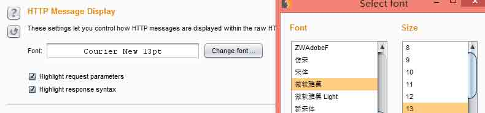

### Character Sets

设置控制 Burp 显示原始的 HTTP 消息时如何处理不同的字符集。可用的选项有：

```
1)自动识别每个消息的字符集的基础上，邮件标题。这是默认选项，可让您同时在使用不同字符集的邮件的工作。  
2)对所有消息使用平台默认的字符集。  
3)显示消息的原始字节（使用 ASCII 编码），而不处理任何扩展字符。  
4)对所有消息使用一个特定的字符集。 
```

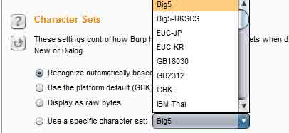

HTTP 头始终显示在原料的形式 - 字符集编码选项只适用于邮件正文中。
需要注意的是所需的一些字符集的字形不支持的所有字体。如果你需要使用一个扩展的或不寻常的字符集，你应该首先尝试进行系统的字体，如宋体或 Dialog。

### HTML rendering

Html rendering 是 html 转义的意思，渲染 HTTP 消息编辑器显示 HTML 内容中标签约，因为它会出现在你的浏览器。该选项控制 Burp 是否会作出所需要的完全呈现 HTML 内容（例如，用于嵌入式图像）的任何额外的 HTTP 请求。使用此选项涉及的速度和 HTML 渲染质量之间的权衡，以及您是否希望避免作出任何进一步的请求到目标应用程序。

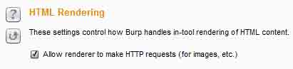

### Misc

此选项卡包含的设置 hotkeys(热键)，logging(记录)，temporary files(临时文件)的位置，automatic backup(自动备份)和 scheduled tasks(预定的任务)。

### Hotkeys

设置允许您配置快捷键为常用操作。许多类型的动作可以被分配一个快捷键，在以下类别：

```
1)特定于某个 HTTP 请求或响应的动作，例如“send to repeater(发送到转发器)”。  
2)全球行动，如“Switch to proxy(切换到代理服务器)”。  
3)在编辑操作，如“剪切”和“撤消”。 
```

一些热键的默认配置。需要注意的是如果你使用它们频繁，可以给它们分配一个快捷键。

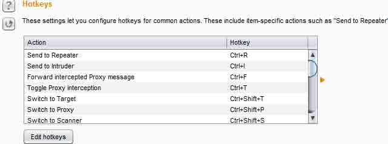

所有的快捷键必须使用控制键（或在 OSX 上的 Command 键），也可以使用 Shift 和其他可用的修饰符。请注意，在某些 Windows 安装中的 Ctrl + Alt 组合是由 Windows 视为等同于键 AltGr，并可能导致输入的字符时，在文本字段中压显现出来。

### Logging

设置控制 HTTP 请求和响应的记录。可以记录每个工具或所有 Burp 流量进行配置。选择你要记录的，会弹出一个框让你选择保存的地方，可以在扫描的时候把扫描的一些扫描记录下来，然后放到 sqlmap 里进行跑，很淫荡的想法。

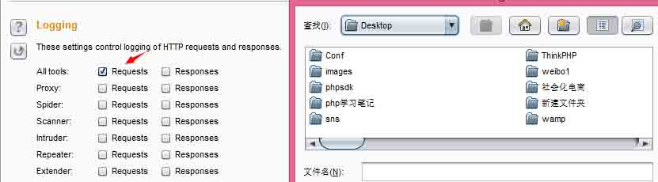

### Temporary Files Location

保存一些零时文件的地方，可以设置系统默认，也可以自定义路径。

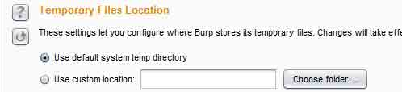

### Automatic backup

自动备份功能。设置允许您配置 Burp 保存的所有工具'的状态和配置的备份每隔多少分钟，并且还可以选择退出。

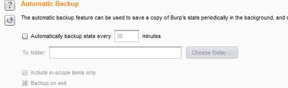

使用这些选项意味着你一般都会有你的工作，最近的备份副本在 Burp 异常退出的事件。如果您已配置目标范围为你的工作，你可以使用“include in-scope items only(仅仅包括在范围内的项目)”以减少数据必须保存量。

### Scheduled Tasks

计划任务。仅限专业版使用，您可以使用任务调度程序自动启动和停止某些任务在规定的时间和间隔时间。您可以使用任务计划程序来启动和停止某些自动化任务了几个小时，而你没有工作，并定期或在特定时间保存您的工作。要使用此功能，请选择在 Burp 的任何地方一个 HTTP 请求，或任何部分目标站点地图，并在上下文菜单中的“Engagement(参与工具)”中选择“Schedule task(计划任务)” 。或者，您也可以通过在计划任务面板中直接添加一个新的任务。创建一个新的任务将打开一个向导，可以配置任务的详细信息。
任务计划有以下类型：

```
1）从 URL 扫描  
2）暂停主动扫描  
3）继续主动扫描  
4）从 URL 蜘蛛  
5）暂停蜘蛛  
6）保存状态 
```

根据任务的类型，您还可以配置一个 URL （如扫描）或文件（如保存状态） 。每一个任务需要有配置了启动时间。或者，您可以配置任务重复在定义的时间间隔。

## Suite functions

* * *

### Generate CSRF POC

[专业版]此功能可用于生成一个证明了概念验证（PoC ）跨站点请求伪造（CSRF ）攻击对于一个给定的请求。要使用此功能，请选择在 Burp 的任何地方 URL 或 HTTP 请求，并选择上下文菜单中的“Engagement tools(参与工具)”中的“Generate CSRF Poc(生成 CSRF 的一键通)”。

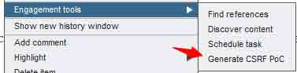

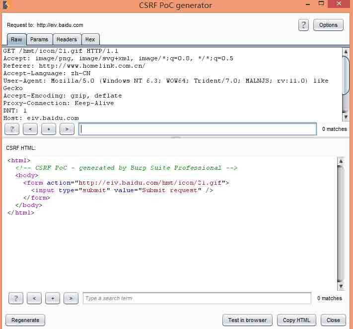

Burp 显示了在顶部面板中选择的完整的请求，并将生成的 HTML CSRF 在较低的面板。在 HTML 使用的形式和/或 JavaScript 来生成在浏览器中所要求的请求。您可以手动编辑的要求，并单击“regenerate(重新生成)”按钮，根据更新的要求来重新生成 CSRF 的 HTML 。你可以测试生成的 PoC 的效果在浏览器中，使用“测试中的浏览器”按钮。当您选择此选项，可以粘贴到浏览器（配置为使用 Burp 的当前实例作为其代理）一个唯一的 URL 。由此产生的浏览器请求由服务 Burp 与当前显示的 HTML，然后你可以决定的 PoC 是否是通过监测得到的请求（ s）表示，通过代理服务器进行了卓有成效的。

### Message Editor

HTTP 消息编辑器是用于整个 Burp 查看和编辑的 HTTP 请求和响应。以及显示原始消息本身，编辑器包括大量的功能，帮助您快速进一步分析这些消息，推动 Burp 的核心工作流程，以及进行其他有用的任务。

### Content Discovery

此功能可用于发现内容并不会从您可以浏览或蜘蛛可见内容链接功能。
要使用此功能，请选择在 Burp 的任何地方一个 HTTP 请求，或任何部分目标站点地图，并在上下文菜单中的“参与工具”中选择“查找内容”。

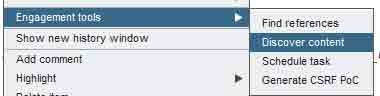

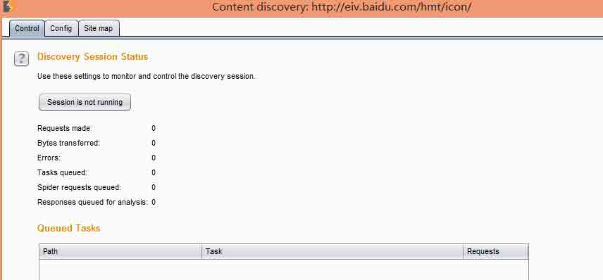

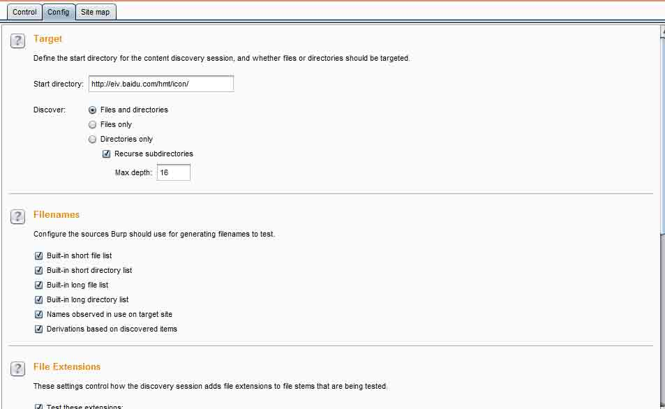

Burp 使用各种技术来发现内容，包括姓名猜测，网络蜘蛛，并且从命名的应用程序中使用的观测约定外推。发现的内容被显示在一个特殊的网站地图是特定的发现会话，并且还可以任选地加入到 suite site map。

### Control

此选项卡显示您发现会话的当前状态。切换按钮指示是否会话正在运行，并允许您暂停和重新启动会话。

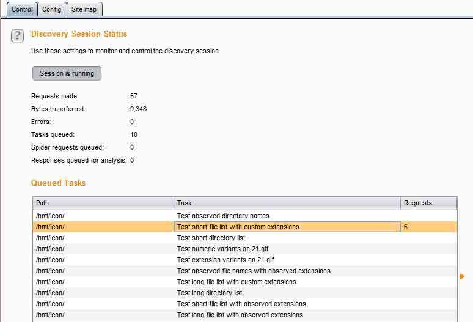

下面的信息则显示该发现会话的进展：提出的要求数在服务器响应传输的字节数网络错误数排队的发现任务数蜘蛛排队的请求数排队分析响应数排队的个人发现任务都显示在表格中。发现引擎的工作原理递归，当一个新的目录或文件被发现，进一步的任务是源于此，这取决于配置。

### Target

这些选项可让您定义了内容发现会话启动目录，以及是否文件或目录要有针对性。下列选项可用：
Start directory(启动目录) - 这就是 Burp 就会开始寻找内容的位置。这条道路及其子目录内只有项目将在会议期间提出要求。
Discover(发现) - 此选项确定会话是否将寻找文件或目录，或两者兼而有之。如果你正在检查的目录，你可以选择是否以及如何深递归到子目录中发现的。

### Filenames

这些选项可让您配置 Burp 应该使用生成的文件名来测试源。下列选项可用
内置的短文件列表 、内置短路目录列表 、内置长文件列表 、内置长目录列表
发现在目标站点上使用的名称。如果选择此选项，Burp 会维护所有的目录和文件名茎已发现的目标网站上的名单，也将检查这些在测试每一个新的目录。
根据发现的物品推导。如果选择此选项，Burp 会尝试猜测基于那些已经被发现的项目名称。例如，如果该目录 AnnualReport2011 被发现，Burp 也将检查 AnnualReport2012，AnnualReport2013 等。

### File Extensions

控制如何发现会话添加文件扩展名，正在测试。该文件的本身是根据文件名选择导出。当每个文件的在测试时，Burp 会检查各种不同的扩展名，根据这些设置。下列选项可用：

```
1)Test these extensions(测试这些扩展)- 此选项可让您设定的扩展，Burp 会经常检查清单。你可以微调的基础上已知在对目标应用程序中使用的技术，默认列表。  
2)Test all extensions observed on target site(测试目标点观测到的所有分机) - 如果选择此选项，然后 Burp 会自动检查是否存在已在使用中被观察到目标站点上的文件扩展名。此选项很有用，当你不知道到底是什么扩展或技术都在使用。您还可以配置你不想要检查，即使发现是在使用中（如图像文件）的扩展名列表。  
3)Test these variant exxtensions on discovered files(在测试文件中发现这些变异扩展) - 此选项可让您设定的扩展名列表的 Burp 会额外检查以便发现文件名。这个选项是检查现有的文件的备份副本很有用。  
4)Test filestemswith no extension(测试文件无扩展名) - 如果选择此选项，Burp 会为每个文件检查不带扩展名添加。 
```

### Discovery Engine

用于发现内容时发出 HTTP 请求的引擎，并带有套房站点地图互动。下列选项可用：

```
1)Case sensitivity(区分大小写) - 这个设置控制 Burp 是否会处理文件名的情况下，敏感。如果选择“自动检测”被选中，然后 Burp 会通过处理文件名的情况下灵敏启动，并在发现的第一个新项目，将测试情况变化的服务器的处理。根据所治疗，Burp 可能恢复到处理文件名的情况下不区分大小写。  
2)Add discovered content to suite site map(发现添加内容到套房站点地图) - 如果选择此选项，然后在当前会话的发现确定了新的项目将被自动添加到主浴室的站点地图。  
3)Copy content from suite site map(复制主站点地图的内容) - 如果选择此选项，则发现会话将复制任何现有的相关内容从主套房站点地图进去发现网站地图，以提供发现新的内容较强的出发基础。  
4)Number of discovery threads(蜘蛛从已发现的内容) - 如果选择此选项，则发现会话将执行常规的网络蜘蛛，并且将处理响应发现请求寻找链接到其他新的内容。发现执行绪数目 - 此选项控制并发请求数的发现引擎能够作出。蜘蛛线程数 - 该选项控制并发请求数的蜘蛛功能是能够使，如果启用。 
```

### Site map

该发现会话使用自己的站点地图，显示所有已发现的定义范围内的所有内容。如果您已配置 Burp 的话，新发现的项目也将被添加到 Burp 的主要站点地图。

### Alert

用来显示当前 Burp 的扫描代理的一些状态，这个没什么介绍的。

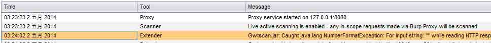

## Burp Sqlmap 插件

* * *

SqlMap 是一个开源渗透测试工具，它可以自动检测和利用 SQL 注入漏洞和接管数据库服务器的过程。它配备了一个功能强大的检测引擎，许多利基功能，为最终的渗透测试和广泛的交换机从数据库中指纹持久的，在数据从数据库中获取，通过访问底层文件系统和操作系统上执行命令的输出带外连接。如图效果图

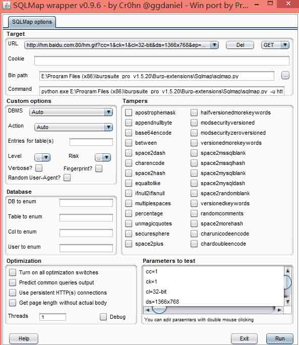

### 0x01 环境及工具

需要 python、java 环境，并且需要下载 sqlmap.py、gason.jar 插件。

下载地址：[`github.com/sqlmapproject/sqlmap`](https://github.com/sqlmapproject/sqlmap)

[`www.praetorian.com/tools/gason-0.9.6.jar`](http://www.praetorian.com/tools/gason-0.9.6.jar)

### 0x02 安装

#### 1）选择 Burp Extender 扩展添加

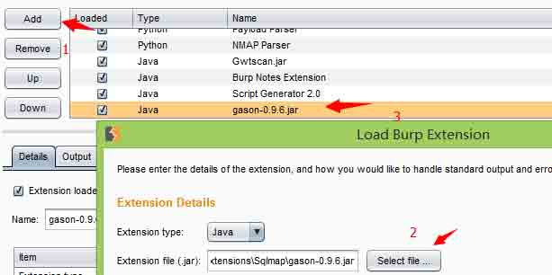

#### 2）添加成功会提示加载成功，然后在任意的 Burp 请求地址的详情里右击

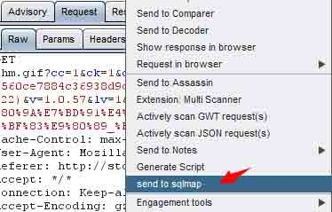

#### 3）接下来会出现 gui 界面，要是用还必须加载 sqlmap.py 的路径

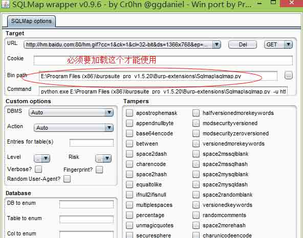

图形界面挺不错的，对于使用 sqlmap 新手挺好的，有时候使用命令界面的时候不知道命令了可以用这个图形界面查看命令怎样使用，比如：我不知道怎么在后面加数据库参数，则可以如下图所示

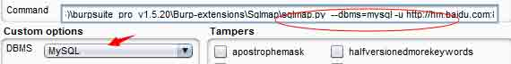

### 0x03 使用

如上有地址参数了在右下角点击 run 即可，图形界面就不做过多的介绍了，其使用方法和 sqlmap 命令界面是一样的，主要是结合了 burp 唯一的好处就是用 burp 检测到注入了然后可以直接发送到 sqlmap 进行注入。而且操作简单。

### Notes

### 0x01 介绍

在 Notes 选项卡中，您可以：

```
- 储存注意事项：储存任何目前开启的文件到一个文件中。  
- 负载注：从文件加载以前保存的一套纸币。  
- 新文本：添加一个标签一个新的文本文档。  
- 导入文本：加载一个文本文件的内容。  
- 新的电子表格：添加一个标签一个新的电子表格。  
- 导入电子表格：加载一个 CSV 文件的内容。  
- 您还可以导出单个音符的标签到外部文件。 
```

界面如下：

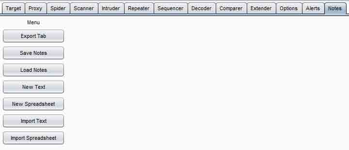

### 0x02 安装

在 Burp 主界面 Extender>>Extensions>>Burp Extensions 下的 add 按钮

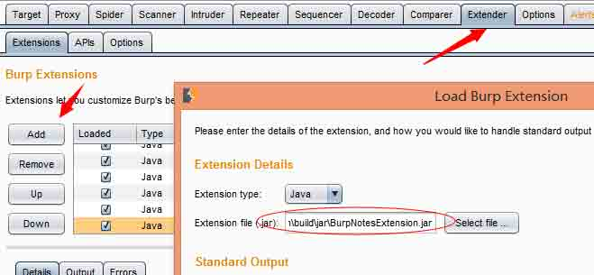

#### 0x03 使用

```
1)可以从 Burp 主界面的 Proxy history 里选择发送到 notes。  
2)切换到 notes 标签选项卡即可。  
3)Save notes(保存文本)  
4)也可以导入文本和表格文件 
```

## JSBeautifier

### 0x01 介绍

大多数的网站压缩其资源，如 JS 文件，以便增加装载速度。然而，安全性测试和调试一个压缩的资源是不容易的事。这是一个 Burp 开源扩展，这使得它可以美化大部分资源。因此，这将有助于 Web 应用程序安全研究人员查看压缩资源更容易。它还可以帮助他们有足够的资源内的浏览器解压缩后的版本（如 JS，CSS，HTML，XML，等等）。

### 0x02 安装

```
1）下载 jsbeautifier.jar 文件和 libs 目录  
2）点击 Extender>>add 选择 jsbeautifier.jar 
```

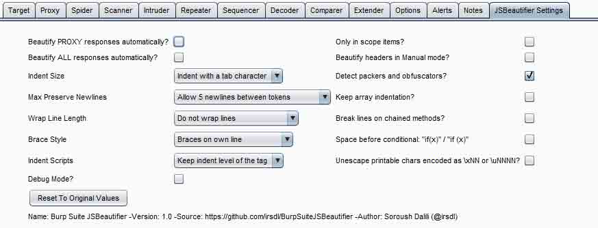

### 0x03 使用

直接勾选或者在响应请求选择 beautify this!即可

版权声明：未经授权禁止转载 [小乐天](http://drops.wooyun.org/author/小乐天 "由 小乐天 发布")@[乌云知识库](http://drops.wooyun.org)

分享到：

### 相关日志

*   [Burp Suite 使用介绍（四）](http://drops.wooyun.org/tips/2504)
*   [InsightScan:Python 多线程 Ping/端口扫描 + HTTP 服务/APP 探测，可生成 Hydra 用的 IP 列表](http://drops.wooyun.org/tools/427)
*   [Burp Suite 使用介绍（一）](http://drops.wooyun.org/tools/1548)
*   [跑 wordpress 用户密码脚本](http://drops.wooyun.org/tools/601)
*   [Burp Suite 使用介绍（三）](http://drops.wooyun.org/tips/2247)
*   [Linux PAM&&PAM;后门](http://drops.wooyun.org/tips/1288)