# 短域名进化史

2014/08/20 10:52 | [mramydnei](http://drops.wooyun.org/author/mramydnei "由 mramydnei 发布") | [web 安全](http://drops.wooyun.org/category/web "查看 web 安全 中的全部文章"), [技术分享](http://drops.wooyun.org/category/tips "查看 技术分享 中的全部文章") | 占个座先 | 捐赠作者

一个短的域名一直都是很多人所推崇的。因为对于大部分人来说，域名越短就会越好记忆。但是，还存在一部分人，他们不在乎域名是否好记，但是他们巴不得自己的域名只有三位，两位甚至是没有长度。他们，就是 XSSer。

## 0x00 男人为什么要比短

* * *

正常的男人都喜欢比谁长，而狂热的 XSSer 都喜欢比谁短。因为在真实的世界里，我们往往都会遇见字符长度限制。其中的部分问题，是可以通过 Short Talk Of XSS 中提到的方法进行解决的。但还有一部分极端的场景，是没有办法靠那些硬技术去解决的。比如，我的好友@/fd 最近出的 prompt.ml 这个 XSS 系列挑战当中就有这样的一道题：

```
function escape(input) {
    // make sure the script belongs to own site
    // sample script: http://prompt.ml/js/test.js
    if (/^(?:https?:)?\/\/prompt\.ml\//i.test(decodeURIComponent(input))) {
        var script = document.createElement('script');
        script.src = input;
        return script.outerHTML;
    } else {
        return 'Invalid resource.';
    }
} 
```

由于挑战还没有结束，所以在这篇文章中我们会避免一些可能会透露答案的信息。但是，可以确定的是我们是没有办法从 src 跳出来的。也就是说，故事会围绕怎么在这个场景下调用远程 JS 文件这个话题进行下去。所以，那些 Short Talk Of XSS 当中给出的解决方案，对于这种场景来说是无能为力的。我们需要关注的是如何让自己的域名变短。

## 0×01 短域名之初体验

* * *

一个即简单又直接的方法就是买。通常三位的域名，基本上都是 XSSer 人手一个。比如，我在不久前就买了 x55.me.看上去很丑，但是起码算总长度的话，它还是 6 位的。有了一个短的域名不但能帮助你绕过一些长度限制，还可以让你在与大牛同台竞技时，不会输在非技术性的细节上。

既然靠钱可以解决，那我们为什么不买两位的呢？问题是两位域名价格相对较高而且很难能找到没有被注册。

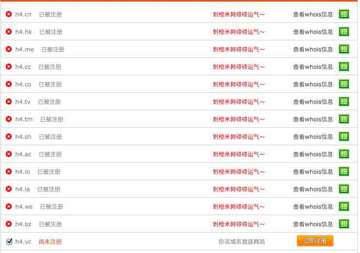

而且作为有 Hack 精神的群体，我们更希望用技术来解决问题。所以让我们先回到购买 3 位域名的问题。有没有办法不花钱就弄到和三位域名一样效果的 URL 呢？答案是，有的。这里和大家分享一个生成短网址的网站：

```
http://xn--hqd.ws/ 
```

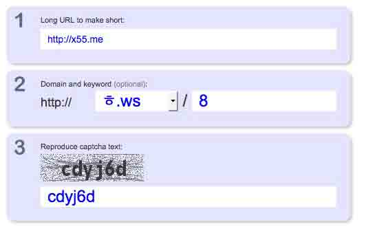

借助这个网站，就可以让我们拥有一个和 xxx.xx 一样长度的域名来调用远程 JS 了。^_^

得到生成的链接：

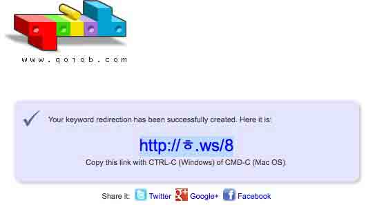

but，wait！那个看上去不怎么可爱的韩文字符长度真的是 1 么？

让我们打开浏览器验证一下：

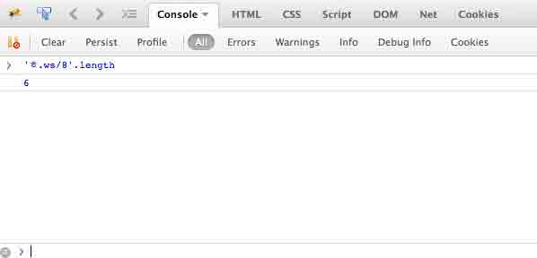

看上去 Javascript 确实认为”ᄒ”的长度为 1.但，如果验证长度的是 Javascript 还需要整这么麻烦？直接抓包改包，不就过去了么？是的，所以让我们在 PHP 里再做一下验证。php 当中判断字符串长度的函数有两个，分别是 strlen 和 mb_strlen。后者，与前者最大的不同就是就是可以在参数中定义字符集。我们来写一个简单的脚本：

```
<?php
echo 'strlen is:'.strlen($_GET["str"]).'<br>';
echo ' mb_strlen is:'.mb_strlen($_GET["str"]).'<br>';
echo 'utf-8 mb_strlen is:'.mb_strlen($_GET["str"], 'utf-8').'<br>';
echo 'gbk mb_strlen is:'.mb_strlen($_GET["str"], 'gbk').'<br>';
echo 'gb2312 mb_strlen is:'.mb_strlen($_GET["str"], 'gb2312').'<br>';
echo 'gb18030 mb_strlen is:'.mb_strlen($_GET["str"], 'gb18030').'<br>';
echo 'big5 mb_strlen is:'.mb_strlen($_GET["str"], 'big5').'<br>';
?> 
```

通过脚本来观察一下，不同函数和字符集设定的情况下”ᄒ”长度分别会是多少：

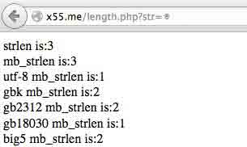

可以看到当我们使用更为规范的 mb_strlen 并将字符集设定为比较常见的 utf-8 和 gb18030 时，该字符长度只有 1.也就是说，在面对懂得规范输写的码农时，这种方法是成立的。我们并没有花一分钱就得到了一个和三位域名在长度上等效的 URL。awesome！ PS:由于 mb_strlen 在字符集为 utf-8 的情况下，长度结果和控制台是一样的，所以下面都使用控制台截图代替。

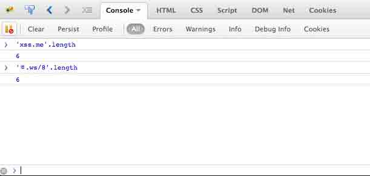

但是还不够短，因为后面还有路径。既然韩国人的玩意儿字符长度可以是 1，那中文可以么？答案自然是可以的。我们只需要购买一个后缀为两位的中文域名（如果你看明白了，就该懂其实中文，韩文什么的一点都不重要）。而且已经有人这么去做了。比如我们的小伙伴，0x_Jin 已经入坑。

http://靖.pw

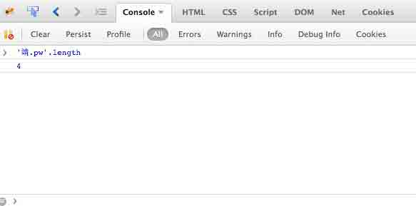

## 0×02 Unicode 黑魔法

* * *

回顾一下，我们从收费的 xxx.xx 进化到了免费的 x.xx/x,再进一步进化到了 x.xx。我们已经将域名缩短到了传说中的 4 位。还能再短么？如果不能就真的没有必要写这个文章了。在这里，需要先感谢@shafigullin 教会了我们这个技巧。

http://靖.㎺

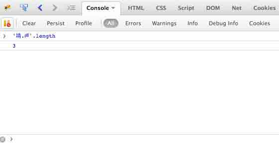

看上去 pw 有些奇怪？没错，因为这并不是 p 和 w，而是 unicode 字符㎺(U+33BA)。这个也能访问？点一下链接不就知道喽。这是个即神奇但又不陌生的现象。为什么这么说呢，因为我们经常会碰到这样的情况。当我们在忘记切换输入法，拿着中文输入法就在 URL 敲入:

```
http://www。baidu。com 
```

并按下回车时，会发现还是会正常跳入 www.baidu.com，这个问题其实就已经证明了在 hostname 中，这种事情是有在发生的。但需要尊重的是，我们谁都没有想过可以借助这种现象来缩短我们的域名长度。所以技术一直都在于创新度而不在于难度。在这里再次表示我对@shafigullin 的 respect.故事讲到这里，我们的域名已经进化到 x.x 也就是三位的长度了。但是，我们不可能停留在 pw 上面，让我们来开始疯狂的 fuzzing 吧。下面是我的小伙伴@/fd 写的一个 hostname 的 fuzzer：

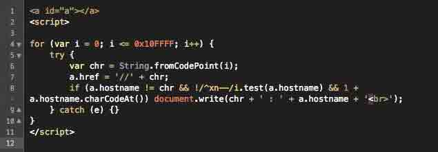

然后我们得到了一些非常有趣的结果。由于内容比较多在这里只显示部分结果。首先是一些可以作为域名后缀的 unicode 字符：

```
dz : dz     //valid domain ext
₨ : rs     //valid domain ext
№ : no     //valid domain ext
℠ : sm     //valid domain ext
℡ : tel    //valid domain ext
™ : tm     //valid domain ext
㎁ : na    // valid domain ext
U+3377 : dm   //valid domain ext
㎃ : ma  // valid domain ext
㎋ : nf  //valid domain ext
㎖ : ml  //valid domain ext
㎙ : fm  //valid domain ext
㎝ : cm  //valid domain ext
㎰ : ps  //valid domain ext
㎳ : ms  //valid domain ext
㎺ : pw  //valid domain ext
㎽ : mw  //valid domain ext
㏄ : cc  //valid domain ext
㏅ : cd  //valid domain ext
㏉ : gy  //valid domain ext
㏌ : in  //valid domain ext
㏗ : ph //valid domain ext
㏚ : pr  //valid domain ext
㏛ : sr  //valid domain ext
fi : fi  //valid domain ext
ft : st //valid domain ext
st : st //valid domain ext 
```

这样一来，我们能够买的就不单是 pw 结尾的域名了。不过需要说一下的是，在我们现在的比价结果中，pw 是最便宜的。一个汉字.pw 的域名在 XX 互联只需要 18 元就能拿下了。让我们继续来看其它的一些有趣的结果。这次，让我们继续回到免费这个话题上面。

Ⅷ : viii ㎉ : kcal 可以看到在这次的结果中。我们列出来了两个可以用一个 unicode 字符代替 4 个字符的结果。然而.ml 结尾的域名，是可以免费注册到长度大于等于 4 的域名的。所以，我们的小伙伴就抢占先机，拿下了:

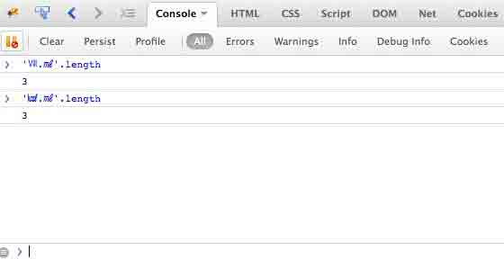

Ⅷ.㎖ 和 ㎉.㎖ 4 这样，两个免费的 3 位域名（总长度）就到手了。但是三位还是有点长。我们能做到 2 位么？让我们再来看看另一部分的 fuzz 结果：

```
⒈ : 1.   //use one unicode char instead of 2 chars and include dot
⒉ : 2.   //use one unicode char instead of 2 chars and include dot
⒊ : 3.   //use one unicode char instead of 2 chars and include dot
⒋ : 4.   //use one unicode char instead of 2 chars and include dot
⒌ : 5.   //use one unicode char instead of 2 chars and include dot
⒍ : 6.   //use one unicode char instead of 2 chars and include dot
⒎ : 7.   //use one unicode char instead of 2 chars and include dot
⒏ : 8.   //use one unicode char instead of 2 chars and include dot
⒐ : 9.   //use one unicode char instead of 2 chars and include dot
⒑ : 10.   //use one unicode char instead of 3 chars and include dot
⒒ : 11.   //use one unicode char instead of 3 chars and include dot
⒓ : 12.   //use one unicode char instead of 3 chars and include dot
⒔ : 13.   //use one unicode char instead of 3 chars and include dot
⒕ : 14.   //use one unicode char instead of 3 chars and include dot
⒖ : 15.   //use one unicode char instead of 3 chars and include dot
⒗ : 16.   //use one unicode char instead of 3 chars and include dot
⒘ : 17.   //use one unicode char instead of 3 chars and include dot
⒙ : 18.   //use one unicode char instead of 3 chars and include dot
⒚ : 19.   //use one unicode char instead of 3 chars and include dot
⒛ : 20.   //use one unicode char instead of 3 chars and include dot
㏘ : p.m. //include dot
㏂ : a.m. //include dot
㏇ : co. //valid domain ext and also include dot

这部分结果，非常的有趣。因为这些 unicode 字符最后会被解释为带”.”的字符。也就是说，如果我们购买了 20.xx，然而这个 xx 又正好是可以用一个 unicode 字符可以代替的后缀的话，我们的长度就会变成？2 位！当然，我们已经这么去做了。这是我们的战利品：

http://⒛₨ 
```

PS:当然这不是免费的。如果你有办法注册 2 位的免费域名也希望你能告诉我

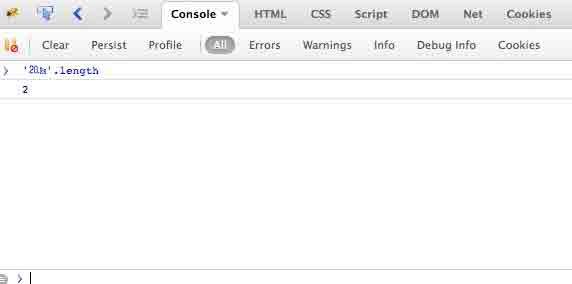

不过机智的你，可能会发现在 webkit 下面当你点击上面的链接时，会跳转到 about:blank。也就是说这种使用带 dot 的 unicode 字符的方法在 webkit 下面是不适用的。那这样一来，如果使用 20.₨的话，长度不就又变成 3+1 了么？我们还有别的辅助：

```
⑩ : 10   //use one unicode char instead of 2 chars
⑪ : 11   //use one unicode char instead of 2 chars
⑫ : 12   //use one unicode char instead of 2 chars
⑬ : 13   //use one unicode char instead of 2 chars
⑭ : 14   //use one unicode char instead of 2 chars
⑮ : 15   //use one unicode char instead of 2 chars
⑯ : 16   //use one unicode char instead of 2 chars
⑰ : 17   //use one unicode char instead of 2 chars
⑱ : 18   //use one unicode char instead of 2 chars
⑲ : 19   //use one unicode char instead of 2 chars
⑳ : 20   //use one unicode char instead of 2 chars 
```

原来 20 也是可以通过单个字符来代替的。这样一来，我们就可以通过灵活的切换游走在 2 位和 3 位之间了。

```
http://⑳.₨  //兼容所有浏览器
http://⒛₨  //兼容 Firefox 和 IE 
```

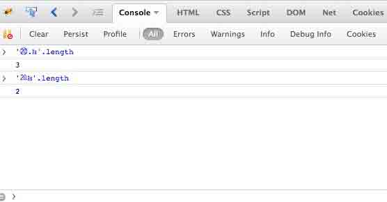

这真是非常激动人心的。在将域名长度缩短到了两位之后，让我们再来看看另外一部分的结果：

```
℀ : a/c    // path
℁ : a/s    // path
℅ : c/o    // path
℆ : c/u    // path 
```

在这部分结果当中，发现有些 unicode 字符最终会被解释称 字符/字符。此外，我们之前提到的会带”.”的结果作为二级域名提供给用户，也将会是一个很不错的选择。比如：

```
http://⒛⒛₨  //兼容 IE 和 FF 
```

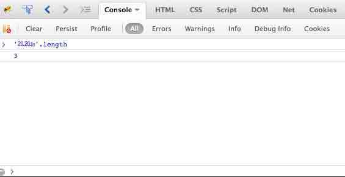

## 0×03 写在最后

* * *

这就是，我们在这些日子里不停的 fuzzing，思考，调查所得到的结果。

```
x55.me(6 位)->20.rs(5 位)->靖.pw(4 位)->⑳.₨(3 位)->⒛₨(2 位)->？ 
```

我们讨论了很多。讨论了如果在这些知识基础上开放一个 XSS 平台会如何，是否会被山寨？我觉得山寨是肯定会有的。因为 trick 都已经放出来了，所以对于效仿者来说只需要照着用就可以了。但是，好的技术支持和功能模块也许真的不是 ctrl+c 就能带走的。所以我相信我们会做出来一个不会被复制的平台。

最后，让我们再次以长度的话题结尾。那么，1 位是可能的么？也许对于土豪来说买个 tld 就是可能的。

```
http://ai 
```

你需要做的就是买一个可以用单个 unicode 字符代替的 tld。

Thanks for your time.

版权声明：未经授权禁止转载 [mramydnei](http://drops.wooyun.org/author/mramydnei "由 mramydnei 发布")@[乌云知识库](http://drops.wooyun.org)

分享到：

### 相关日志

*   [xss 挑战赛 writeup](http://drops.wooyun.org/tips/3059)
*   [攻击 JavaWeb 应用[3]-SQL 注入[1]](http://drops.wooyun.org/tips/236)
*   [一种自动化检测 Flash 中 XSS 方法的探讨](http://drops.wooyun.org/tips/1985)
*   [XSS 挑战第一期 Writeup](http://drops.wooyun.org/papers/894)
*   [一些你可能不知道的 Flash XSS 技巧](http://drops.wooyun.org/papers/948)
*   [熵不起得随机数](http://drops.wooyun.org/tips/1060)