# Win10 安全特性之执行流保护

2015/02/04 15:07 | [腾讯电脑管家](http://drops.wooyun.org/author/腾讯电脑管家 "由 腾讯电脑管家 发布") | [二进制安全](http://drops.wooyun.org/category/binary "查看 二进制安全 中的全部文章"), [技术分享](http://drops.wooyun.org/category/tips "查看 技术分享 中的全部文章") | 占个座先 | 捐赠作者

## 0x00 背景

* * *

微软在 2015 年 1 月 22 日公布了 windows10 技术预览版，Build 号：9926。电脑管家反病毒实验室第一时间对其引入的新安全特性进行了深入分析。

众所周知，漏洞利用过程中攻击者若要执行恶意代码，需要破坏程序原有指令的的正常执行。执行流保护的作用就是在程序执行的过程中检测指令流的正常性，当发生不符合预期的情况时，及时进行异常处理。业界针对执行流保护已经有一些相对成熟的技术方案，在微软发布的 windows10 最新版本中，我们看到了这一防护思想的广泛使用。

## 0x01 CFI

* * *

CFI 即控制流完整性 Control-Flow Integrity，主要是通过对二进制可执行文件的动态改写，以此为其增加额外的安全性保障。

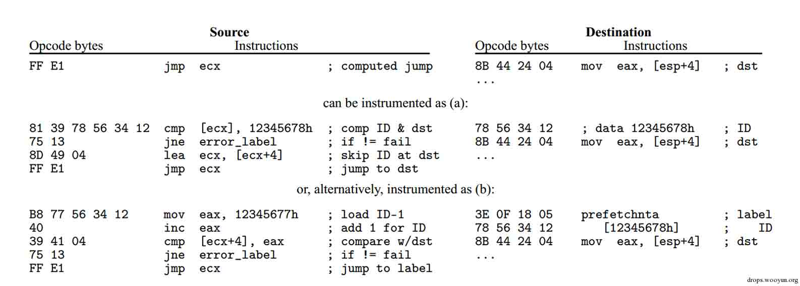

这是 Mihai Budiu 介绍 CFI 技术时使用的例子。这里通过对二进制可执行文件的改写，对 jmp 的目的地址前插入一个在改写时约定好的校验 ID，在 jmp 的时候看目的地址前的数据是不是我们约定好的校验 ID，如果不是则进入错误处理流程。

同理在 call 和 ret 的时候也可以进行改写：

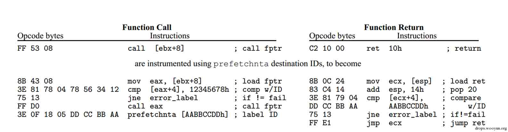

左半部分就是一个对 call 的改写，右半部分是对 ret 的一个改写，在 call 的目的地址和 ret 的返回地址之前插入校验 ID，然后改写的 call 和 ret 中增加了对校验 ID 的检查，如果不符合预期，进入错误处理流程，这个思路和上边对 jmp 的处理是完全一样的。

## 0x02 CFG

* * *

实现 CFI 需要在 jmp、call 一个寄存器（或者使用寄存器间接寻址）的时候，目的地址有时必须通过动态获得，且改写的开销又很大，这些都给 CFI 的实际应用造成了一定的困难。

微软在最新的操作系统 win10 当中，对基于执行流防护的实际应用中采用了 CFG 技术。CFG 是 Control Flow Guard 的缩写，就是控制流保护，它是一种编译器和操作系统相结合的防护手段，目的在于防止不可信的间接调用。

漏洞攻击过程中，常见的利用手法是通过溢出覆盖或者直接篡改某个寄存器的值，篡改间接调用的地址，进而控制了程序的执行流程。CFG 通过在编译和链接期间，记录下所有的间接调用信息，并把他们记录在最终的可执行文件中，并且在所有的间接调用之前插入额外的校验，当间接调用的地址被篡改时，会触发一个异常，操作系统介入处理。

以 win10 preview 9926 中 IE11 的 Spartan html 解析模块为例，看一下 CFG 的具体情况：

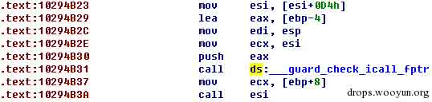

这里就是被编译器插入的 CFG 校验函数

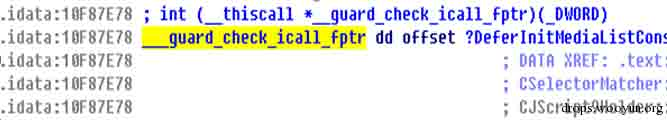

但是静态情况下默认的检测函数是一个直接 return 的空函数，是微软在和我们开玩笑吗？

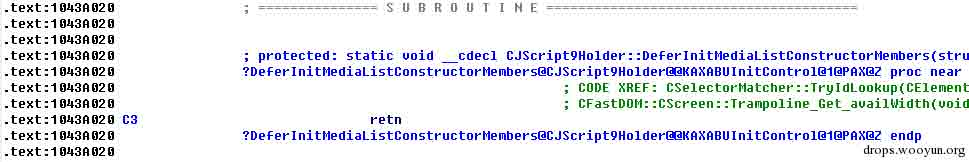

通过动态调试看一下

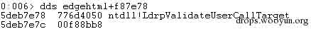

从上图我们可以看出，实际运行时的地址和我们通过 IDA 静态看到的地址是不一样的，这里就涉及到 CFG 和操作系统相关的那部分。支持 CFG 版本的操作系统加载器在加载支持 CFG 的模块时，会把这个地址替换成 ntdll 中的一个函数地址。不支持 CFG 版本的操作系统不用理会这个检测，程序执行时直接 retn。

这是 ntdll 中的检测函数

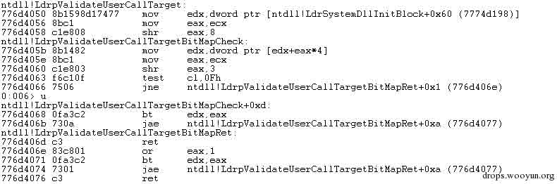

原理是在进入检测函数之前，把即将 call 的寄存器值（或者是带偏移的寄存器间接寻址）赋值给 ecx，在检测函数中通过编译期间记录的数据，来校验这个值是否有效。

检测过程如下:

首先从 LdrSystemDllInitBlock+0x60 处读取一个位图(bitmap)，这个位图表明了哪些函数地址是有效的，通过间接调用的函数地址的高 3 个字节作为一个索引，获取该函数地址所在的位图的一个 DWORD 值，一共 32 位，证明 1 位代表了 8 个字节，但一般来说间接调用的函数地址都是 0x10 对齐的，因此一般奇数位是不使用的。

通过函数地址的高 3 个字节作为索引拿到了一个所在的位图的 DWORD 值，然后检查低 1 字节的 0-3 位是否为 0，如果为 0，证明函数是 0x10 对齐的，则用 3-7bit 共 5 个 bit 就作为这个 DWORD 值的索引，这样通过一个函数地址就能找到位图中所对应的位了。如果置位了，表明函数地址有效，反之则会触发异常。

这里有个有趣的东西，虽然使用 test cl,0Fh 检测是否 0x10 对齐，如果对齐的话实际上用 3-7 位作为索引，也就是说第 3 位一定是 0。但如果函数地址不是 0x10 对齐的话，则会对 3-7 位 or 1，然后再作为索引。这样就有一个弊端，如果一个有效的间接调用的函数地址是 8 字节对齐的，那么其实是允许一个 8 字节的一个错位调用的，这样可能导致的结果就是可能造成虽然通过了校验，但是实际调用的地址并不是原始记录的函数地址。

还有一点，如果这时候漏洞触发成功，间接调用的寄存器值已经被攻击者修改了，这时候从 bitmap 中取值的时候可能造成内存访问无效。请看 LdrpValidateUserCallTargetBitMapCheck 符

号处的这条指令：mov edx,dword ptr [edx+eax*4] edx 是 bitmap 地址,eax 是索引，但如果 eax 不可信了，这个很有可能，则会导致内存访问异常，并且这个函数并没有异常处理。这是因为微软为了效率考虑（毕竟这个校验函数的调用十分频繁，一个开启 CFG 的模块可能会有上万个调用处），微软在 ntdll! RtlDispatchException 中对该地址发生的异常做了一个处理:

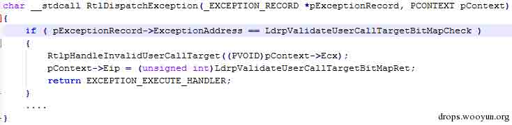

如果异常发生的地址命中 LdrpValidateUserCallTargetBitMapCheck，则进行一个单独处理，RtlpHandleInvalidUserCallTarget 会校验当前进程的 DEP 状态和要间接调用的地址(ecx)的内存属性，如果当前进程关闭了 DEP 并且要间接调用的地址有可执行属性，则触发 CFG 异常，否则通过修改 pContext 把 EIP 修正到 ret 返回处，并且表明异常已被处理。

最后再说下这个原始的 bitmap，在系统初始化的时候，内存管理器初始化中会创建一个 Section(MiCfgBitMapSection32)，这个 Section 在 Win8.1 上的大小是通过 MmSystemRangeStart(32 位下是 0x80000000)计算的，前面提到过 bitmap 里面 1 位代表 8 字节，计算完后正好是 32MB

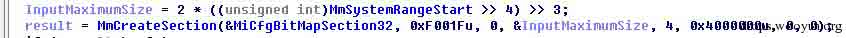

而在 Win10 上 MiCfgBitMapSection32 的大小有了变化，直接写死成了 0x3000000(48MB)

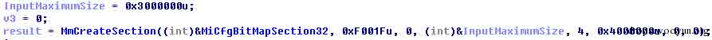

Section 创建完成后在每个进程启动的时候会映射进去

```
(NtCreateUserProcess-> PspAllocateProcess-> MmInitializeProcessAddressSpace-> MiMapProcessExecutable-> MiCfgInitializeProcess) 
```

映射的时候作为 shared view，除非某一个进程修改了这片内存。

在一个 CFG 模块映射进来的时候，重定位过程中会重新解析 PE 文件 LOADCONFIG 中的 Guard Function Table 以重新计算该模块对应的 bitmap（MiParseImageCfgBits），最后更新到 MiCfgBitMapSection32 中去（MiUpdateCfgSystemWideBitmap）。

## 0x03 电脑管家 XP 防护的执行流保护

* * *

早些年的漏洞攻击代码可以直接在栈空间或堆空间执行指令，但近几年，微软操作系统在安全性方面逐渐加强，DEP、ASLR 等防护手段的应用，使得攻击者必须借助 ROP 等绕过手段来实现漏洞利用。在 ROP 利用中，栈交换指令 Stack pivot 必不可少。

针对 ROP 攻击的防御长久以来是漏洞防御的一个难题，因为 ROP 指令在静态层面分析与程序的正常指令流毫无差别，且运行时也是在合法模块内执行，因此极难防御。

管家漏洞防御团队针对 ROP 利用的特点，从整个程序的执行流层面进行分析，研究出在动态运行时区分是合法指令流还是异常指令流的方法，其思想与 CFI 不谋而合。

下边就是一个由于错位汇编形成的比较常用的栈交换指令

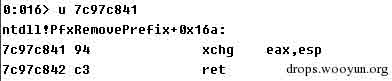

而实际正常的执行流程是这样的


以上是没有开启 XP 防护的情况

开启电脑管家 XP 防护之后：

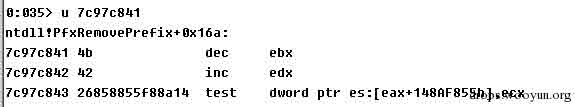

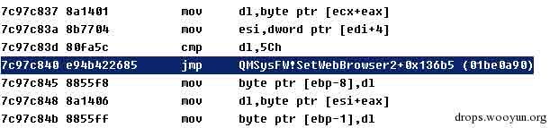

此时如果攻击者依靠静态分析时得到栈交换指令位置来执行 ROP 攻击的话，会被执行流保护逻辑发现异常，后续攻击则无法实现。

## 0x04 尾声

* * *

CFG 防护方法需要在编译链接阶段来完成准备工作，同时需要操作系统的支持。CFI 无需编译时的帮助，且不仅能够防御 call 调用，能够对全部执行流进行保护。但 CFI 需要插入大量的检测点，并且在执行过程中检测的频率极高，难免对程序执行效率带来影响。

电脑管家 XP 版的防御方法相比于前两者，对性能的影响更小，但这种方法是针对旧版操作系统的缓解方案，通用性会打折扣。所以建议广大 windows 用户尽量升级到最新操作系统，享受全面的安全保护。而由于某些原因无法升级的用户也不必担心，管家 XP 版会继续提供最高的安全防护能力。

版权声明：未经授权禁止转载 [腾讯电脑管家](http://drops.wooyun.org/author/腾讯电脑管家 "由 腾讯电脑管家 发布")@[乌云知识库](http://drops.wooyun.org)

分享到：

### 相关日志

*   [64 位 Linux 下的栈溢出](http://drops.wooyun.org/tips/2288)
*   [教你解密 Gh0st 1.0 远控木马 VIP 版配置信息](http://drops.wooyun.org/tips/3589)
*   [uctf-杂项题目分析](http://drops.wooyun.org/tips/3349)
*   [逆向基础（二）](http://drops.wooyun.org/tips/1931)
*   [CVE2014-6287 分析报告](http://drops.wooyun.org/papers/3091)
*   [漏扫工具 AWVS 命令执行](http://drops.wooyun.org/papers/1501)