# 深夜调试某浏览器堆损坏的小记录 

2014/03/10 11:48 | [blast](http://drops.wooyun.org/author/blast "由 blast 发布") | [二进制安全](http://drops.wooyun.org/category/binary "查看 二进制安全 中的全部文章"), [漏洞分析](http://drops.wooyun.org/category/papers "查看 漏洞分析 中的全部文章") | 占个座先 | 捐赠作者

## 0x00 引言

* * *

@瞌睡龙让俺仔细介绍一下，所以我就把之前文章[`drops.wooyun.org/papers/1020`](http://drops.wooyun.org/papers/1020)的一节的东西单独提出来了，之前百度浏览器 5.0 版本子窗口堆溢出的那版的程序我已经找不太到了，找到最接近的版本修复的只剩一个栈空间不足的问题而已了，这个小毛病我就搁在事后分析里面好了。

我找到的早期版本，比如 4.5 版，它的堆损坏和 5.x 的堆损坏效果类似，而且崩溃逻辑、位置都大体相同，5.x 那个小报告中我提到的“低版本程序不测试直接转移到高版本”就是让这一个问题横跨几个世纪的主要原因。

当然，以下是我晚上几个小时调（口）试（胡）出来的，由于家里的电脑下 WDK 一直失败，所以没用上最新科技，只用了一个很老的 windbg 版本，有的地方还有些问题，所以我会粘来一点之前草稿里的数据，不过我确定这个对结果没有影响的。还有就是由于代码上班的时候调了一点，下班后回家继续调了后面的（俺是新开的例程），所以可能会有一些神推理名推测和超剧情发展的东西，这个请见谅。

由于代码实在太长，所以我会适当的标记出我在干什么，以及我想要得到什么结果，所以如果你看到了莫名其妙的黑色粗体标记，那肯定是我的注解。另外，由于这个 windbg 贴的代码本身实在已经是错综复杂了，所以我不会一句句的解释了，我会直接介绍函数在作甚，而且由于个人水平渣，写的时候卡壳了多次，所以这我已经预感到难免会出问题，这个也请大家见谅，各位发现不对的话请及时糊我熊脸！

## 0x01 基本需求

* * *

一个调试器是必要的，由于涉及事后调试和即时调试，俺就使用 windbg 来进行啦。由于目标程序是 32 位的，所以我选择了 x86 版的 windbg。操作系统是 Windows 7 sp1 简体中文版，说是 oem 但是看起来像盗版系统的系统。

然后就是几个基本的命令，t 步入，p 步过， gu 执行到返回，dd 查看 dword， da 查看 ansi， k 显示调用栈， poi 析取指针，等等，遇到新不明物种的话，windbg 的 F1 里面的介绍是非常详尽的。

## 0x02 简单的事后分析（介绍）

* * *

事后分析我们就用百度浏览器 5.0 的一个栈内存不够分导致的 Stack Buffer Overrun 为例好了，poc 还是那个，口胡我第一，那么开始呗。

### 0x02a 开始

首先，我们可以确定的是我们的 poc 可以导致这个程序崩溃，而通常我们的目标程序也会自带有一个 dump 文件，例如：

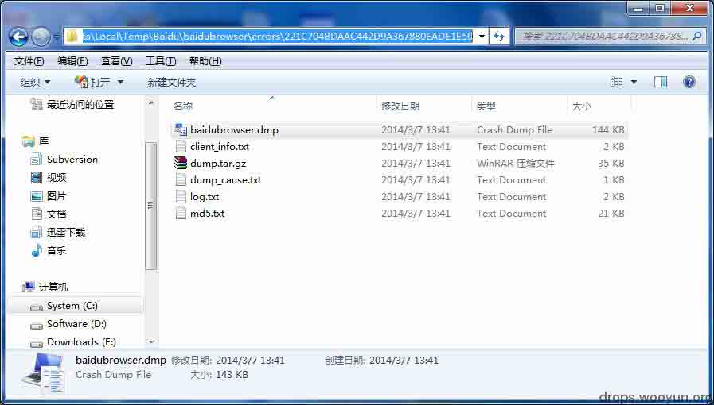
  图：通常在`%temp%`下可能有崩溃文件，也有可能在`%appdata%`下

打开 windbg，载入 dump 文件，进行简单的`!analyze -v`。显示信息如下：

```
The stored exception information can be accessed via .ecxr.
(51fc.a978): Stack overflow - code c00000fd (first/second chance not available)
eax=00000000 ebx=00000000 ecx=0046700c edx=0061e3e4 esi=000002a8 edi=00000000
eip=77a0f8d1 esp=0061bbe0 ebp=0061bc4c iopl=0         nv up ei pl zr na pe nc
cs=0023  ss=002b  ds=002b  es=002b  fs=0053  gs=002b             efl=00000246
ntdll!NtWaitForSingleObject+0x15:
77a0f8d1 83c404          add     esp,4
0:000> !analyze -v
*******************************************************************************
*                                                                             *
*                        Exception Analysis                                   *
*                                                                             *
*******************************************************************************

FAULTING_IP: 
browsercore+dbda7
033fbda7 8500            test    dword ptr [eax],eax

EXCEPTION_RECORD:  ffffffff -- (.exr 0xffffffffffffffff)
ExceptionAddress: 033fbda7 (browsercore+0x000dbda7)
   ExceptionCode: c00000fd (Stack overflow)
  ExceptionFlags: 00000000
NumberParameters: 2
   Parameter[0]: 00000000
   Parameter[1]: 00522000

PROCESS_NAME:  baidubrowser.exe

ERROR_CODE: (NTSTATUS) 0xc00000fd - <Unable to get error code text>

EXCEPTION_CODE: (NTSTATUS) 0xc00000fd - <Unable to get error code text>

EXCEPTION_PARAMETER1:  00000000

EXCEPTION_PARAMETER2:  00522000

NTGLOBALFLAG:  0

FAULTING_THREAD:  0000a978

DEFAULT_BUCKET_ID:  STACK_OVERFLOW

PRIMARY_PROBLEM_CLASS:  STACK_OVERFLOW

BUGCHECK_STR:  APPLICATION_FAULT_STACK_OVERFLOW_INVALID_POINTER_READ

LAST_CONTROL_TRANSFER:  from 045b7a85 to 033fbda7

STACK_TEXT:  
WARNING: Stack unwind information not available. Following frames may be wrong.
0061e2a8 045b7a85 0061e3e4 0061e634 00000001 browsercore+0xdbda7
0061e2c4 0337100c 0061e3e4 0061e634 0061e7f4 browsercore+0x1297a85
0061e620 03333292 0061e7f4 00000000 00000000 browsercore+0x5100c
……（略）
0061fe88 001e63bf 00100000 00000000 00352318 baidubrowser+0x65da
0061ff18 7703336a 7efde000 0061ff64 77a29f72 baidubrowser+0xe63bf
0061ff24 77a29f72 7efde000 2a534886 00000000 kernel32!BaseThreadInitThunk+0xe
0061ff64 77a29f45 001e6412 7efde000 00000000 ntdll!__RtlUserThreadStart+0x70
0061ff7c 00000000 001e6412 7efde000 00000000 ntdll!_RtlUserThreadStart+0x1b

STACK_COMMAND:  ~0s; .ecxr ; kb

FOLLOWUP_IP: 
browsercore+dbda7
033fbda7 8500            test    dword ptr [eax],eax

SYMBOL_STACK_INDEX:  0

SYMBOL_NAME:  browsercore+dbda7

FOLLOWUP_NAME:  MachineOwner

MODULE_NAME: browsercore

IMAGE_NAME:  browsercore.dll

DEBUG_FLR_IMAGE_TIMESTAMP:  526f3e67

FAILURE_BUCKET_ID:  STACK_OVERFLOW_c00000fd_browsercore.dll!Unknown

BUCKET_ID:  APPLICATION_FAULT_STACK_OVERFLOW_INVALID_POINTER_READ_browsercore+dbda7

WATSON_IBUCKET:  2118667

WATSON_IBUCKETTABLE:  17

WATSON_STAGEONE_URL:  http://watson.microsoft.com/StageOne/baidubrowser_exe/2_210_0_42889/526f3e61/browsercore_dll/10_0_0_17/526f3e67/c00000fd/000dbda7.htm?Retriage=1

Followup: MachineOwner
---------

```

我们可以由上得到很多重要的信息：

例如最上层的调用栈、BUCKET 信息（分类漏洞）、出错的位置、出错的语句、它并没有对这个异常的处理程序等等，还有最重要的信息：我们根本没它的符号，淦。

### 0x01b 查看崩溃附近的数据

好在它没有做什么其他的事儿，我们查看 faulting ip 附近的代码即可知道他为什么会崩。

```
FAULTING_IP: 
browsercore+dbda7
033fbda7 8500            test    dword ptr [eax],eax

```

执行

```
uf browsercore+dbda7 

```

得到：

```
0:000> uf browsercore+dbda7
Unable to load image C:\Program Files (x86)\baidu\BaiduBrowser\browsercore.dll, Win32 error 0n2
*** WARNING: Unable to verify timestamp for browsercore.dll
*** ERROR: Module load completed but symbols could not be loaded for browsercore.dll
browsercore+0xdbd94:
033fbd94 3bc8            cmp     ecx,eax
033fbd96 720a            jb      browsercore+0xdbda2 (033fbda2)

browsercore+0xdbd98:
033fbd98 8bc1            mov     eax,ecx
033fbd9a 59              pop     ecx
033fbd9b 94              xchg    eax,esp
033fbd9c 8b00            mov     eax,dword ptr [eax]
033fbd9e 890424          mov     dword ptr [esp],eax
033fbda1 c3              ret

browsercore+0xdbda2:
033fbda2 2d00100000      sub     eax,1000h

browsercore+0xdbda7:
033fbda7 8500            test    dword ptr [eax],eax  ；崩溃在此
033fbda9 ebe9            jmp     browsercore+0xdbd94 (033fbd94)

```

但是这是什么？看起来为什么这么像 __alloca_probe 的验证代码？对比一下实实在在的\__alloca_probe 看来是没跑了。

```
__alloca_probe:
push           ecx
cmp            eax,1000h
lea            ecx,[esp+8]
jb             lastpage
probepages:
sub            ecx,1000h
sub            eax,1000h
test           dword ptr [ecx],eax
cmp            eax,1000h
jae            probepages 
lastpage:
sub            ecx,eax
mov            eax,esp
test           dword ptr [ecx],eax
mov            esp,ecx
mov            ecx,dword ptr [eax]
mov            eax,dword ptr [eax+4]
push           eax
Ret 

```

崩在了最后的栈校验上。查看一下完整的调用栈，使用`~*kvn`查看所有线程的调用栈：

```
0:000> ~*kvn

.  0  Id: 51fc.a978 Suspend: 0 Teb: 7efdd000 Unfrozen
 # ChildEBP RetAddr  Args to Child              
00 0061bbe0 76fa149d 000002a8 00000000 00000000 ntdll!NtWaitForSingleObject+0x15 (FPO: [3,0,0])
01 0061bc4c 77031194 000002a8 ffffffff 00000000 KERNELBASE!WaitForSingleObjectEx+0x98 (FPO: [SEH])
02 0061bc64 77031148 000002a8 ffffffff 00000000 kernel32!WaitForSingleObjectExImplementation+0x75 (FPO: [3,0,4])
03 0061bc78 001056c7 000002a8 ffffffff 006e9948 kernel32!WaitForSingleObject+0x12 (FPO: [2,0,0])
WARNING: Stack unwind information not available. Following frames may be wrong.
04 0061dd78 00105467 ac68c25f 0010542d 7710030c baidubrowser+0x56c7
05 0061dda0 7706fffb 0061de58 ac7abd84 00000000 baidubrowser+0x5467
06 0061de28 77a674ff 0061de58 77a673dc 00000000 kernel32!UnhandledExceptionFilter+0x127 (FPO: [SEH])
07 0061de30 77a673dc 00000000 0061ff64 77a1c550 ntdll!__RtlUserThreadStart+0x62 (FPO: [SEH])
08 0061de44 77a67281 00000000 00000000 00000000 ntdll!_EH4_CallFilterFunc+0x12 (FPO: [Uses EBP] [0,0,4])
09 0061de6c 77a4b499 fffffffe 0061ff54 0061dfa8 ntdll!_except_handler4+0x8e (FPO: [4,5,4])
0a 0061de90 77a4b46b 0061df58 0061ff54 0061dfa8 ntdll!ExecuteHandler2+0x26 (FPO: [Uses EBP] [5,3,1])
0b 0061deb4 77a4b40e 0061df58 0061ff54 0061dfa8 ntdll!ExecuteHandler+0x24 (FPO: [5,0,3])
0c 0061df40 77a00133 0061df58 0061dfa8 0061df58 ntdll!RtlDispatchException+0x127 (FPO: [2,25,4])
0d 0061df40 033fbda7 0061df58 0061dfa8 0061df58 ntdll!KiUserExceptionDispatcher+0xf (FPO: [2,0,0]) (CONTEXT @ 0061dfa8)
0e 0061e2a8 045b7a85 0061e3e4 0061e634 00000001 browsercore+0xdbda7
0f 0061e2c4 0337100c 0061e3e4 0061e634 0061e7f4 browsercore+0x1297a85
10 0061e620 03333292 0061e7f4 00000000 00000000 browsercore+0x5100c
11 0061e814 048b515c 0061e82c fffffffa 00000200 browsercore+0x13292
12 0061e854 03334634 02ec7d94 02ec2780 02ec2780 browsercore+0x159515c
13 0061e974 046e67c9 02ec7d94 02ec7d94 02e63c30 browsercore+0x14634

   1  Id: 51fc.9920 Suspend: 1 Teb: 7efda000 Unfrozen
 # ChildEBP RetAddr  Args to Child              
00 02aff61c 76fa15e9 00000003 02aff66c 00000001 ntdll!ZwWaitForMultipleObjects+0x15 (FPO: [5,0,0])
01 02aff6b8 770319fc 02aff66c 02aff6e0 00000000 KERNELBASE!WaitForMultipleObjectsEx+0x100 (FPO: [SEH])
02 02aff700 770341d8 00000003 7efde000 00000000 kernel32!WaitForMultipleObjectsExImplementation+0xe0 (FPO: [5,8,4])

…………blablabla

```

然后我们可以很开心的看到：

```
0:000> ~*kvn

.  0  Id: 51fc.a978 Suspend: 0 Teb: 7efdd000 Unfrozen
 # ChildEBP RetAddr  Args to Child              
00 0061bbe0 76fa149d 000002a8 00000000 00000000 ntdll!NtWaitForSingleObject+0x15 (FPO: [3,0,0])
01 0061bc4c 77031194 000002a8 ffffffff 00000000 KERNELBASE!WaitForSingleObjectEx+0x98 (FPO: [SEH])
02 0061bc64 77031148 000002a8 ffffffff 00000000 kernel32!WaitForSingleObjectExImplementation+0x75 (FPO: [3,0,4])
03 0061bc78 001056c7 000002a8 ffffffff 006e9948 kernel32!WaitForSingleObject+0x12 (FPO: [2,0,0])
WARNING: Stack unwind information not available. Following frames may be wrong.
04 0061dd78 00105467 ac68c25f 0010542d 7710030c baidubrowser+0x56c7
05 0061dda0 7706fffb 0061de58 ac7abd84 00000000 baidubrowser+0x5467
06 0061de28 77a674ff 0061de58 77a673dc 00000000 kernel32!UnhandledExceptionFilter+0x127 (FPO: [SEH])
07 0061de30 77a673dc 00000000 0061ff64 77a1c550 ntdll!__RtlUserThreadStart+0x62 (FPO: [SEH])
08 0061de44 77a67281 00000000 00000000 00000000 ntdll!_EH4_CallFilterFunc+0x12 (FPO: [Uses EBP] [0,0,4])
09 0061de6c 77a4b499 fffffffe 0061ff54 0061dfa8 ntdll!_except_handler4+0x8e (FPO: [4,5,4])
0a 0061de90 77a4b46b 0061df58 0061ff54 0061dfa8 ntdll!ExecuteHandler2+0x26 (FPO: [Uses EBP] [5,3,1])
0b 0061deb4 77a4b40e 0061df58 0061ff54 0061dfa8 ntdll!ExecuteHandler+0x24 (FPO: [5,0,3])
0c 0061df40 77a00133 0061df58 0061dfa8 0061df58 ntdll!RtlDispatchException+0x127 (FPO: [2,25,4])
0d 0061df40 033fbda7 0061df58 0061dfa8 0061df58 ntdll!KiUserExceptionDispatcher+0xf (FPO: [2,0,0]) (CONTEXT @ 0061dfa8)
0e 0061e2a8 045b7a85 0061e3e4 0061e634 00000001 browsercore+0xdbda7
0f 0061e2c4 0337100c 0061e3e4 0061e634 0061e7f4 browsercore+0x1297a85

```

我们看看它的上层函数做了什么：

```
0:000> uf 045b7a85
No code found, aborting

```

居然显示没有代码，看来事后调试已经满足不了我们了，不过既然跑到了`_alloca_probe`，那真相就只有一个了！对，在栈上分配的东西太大了，比栈还大，比栈还牛逼，于是栈不干了，结果就抛个异常罢工了。

这只是一个小演示而已，反正我们没符号，反正我们没代码，但是我们有 PoC，我们需要的是实时调试，下面进入正题。

## 0x03 实时调试

* * *

下面使用的目标程序是百度浏览器 v4.5，由于我们的 poc 简单粗暴，为了防止代码一加载就崩，我们在它崩溃前加一个 alert(1)，给我们和 windbg 一个心理准备，使得 poc 变成下面这样：

```
<script>
var s="A";
var i=1;
for(i=1;i<599559;i++)
s+="A";
alert(1);
window.open(s);
</script>

```

运行浏览器，最好是直接把 html 拖图标上，这样之后方便我们找哪个进程容纳着 html，如下：

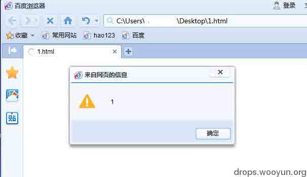
  图： 暴风雨前夕

姨妈大，给它 Attach 上，

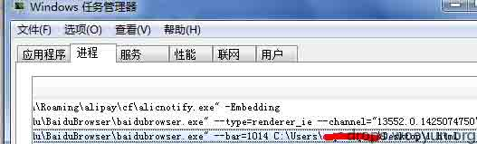
  图：这样就能找到 pid 了

找到对应进程的 PID，然后 Attach，之后按下 g 让它跑起来：

```
(9df0.3724): Break instruction exception - code 80000003 (first chance)
eax=7ef42000 ebx=00000000 ecx=00000000 edx=77a8f8ea esi=00000000 edi=00000000
eip=77a0000c esp=0c52fe4c ebp=0c52fe78 iopl=0         nv up ei pl zr na pe nc
cs=0023  ss=002b  ds=002b  es=002b  fs=0053  gs=002b             efl=00000246
ntdll!DbgBreakPoint:
77a0000c cc              int     3
0:034> g
……省略
STATUS_STACK_BUFFER_OVERRUN encountered
(9df0.3500): Break instruction exception - code 80000003 (first chance)
eax=00000000 ebx=55b23f30 ecx=77070174 edx=0653d16d esi=00000000 edi=001b7281
eip=7706ff55 esp=0653d3b4 ebp=0653d430 iopl=0         nv up ei pl zr na pe nc
cs=0023  ss=002b  ds=002b  es=002b  fs=0053  gs=002b             efl=00000246
kernel32!UnhandledExceptionFilter+0x5f:
7706ff55 cc              int     3

```

程序崩溃。查看一下是怎么产生的，执行 kvn

```
0:006> kvn
*** ERROR: Symbol file could not be found.  Defaulted to export symbols for C:\Program Files (x86)\baidu\BaiduBrowser\bdlogicmain.dll - 
 # ChildEBP RetAddr  Args to Child              
00 0653d430 55a57789 55b23f30 34bb28ee cb44d711 kernel32!UnhandledExceptionFilter+0x5f (FPO: [SEH])
WARNING: Stack unwind information not available. Following frames may be wrong.
01 0653d764 5580757b 001b7281 656c6966 00000000 bdlogicmain!BrowserLogicInit+0x198229
02 0653f500 55a4b5f4 0f1a0020 12960020 001b7281 bdlogicmain+0x757b
03 0653f5b8 559f51a6 12700020 0653f5e4 11bef338 bdlogicmain!BrowserLogicInit+0x18c094
04 0653f5fc 558c5b95 12700020 0653f640 559b4105 bdlogicmain!BrowserLogicInit+0x135c46
05 0653f608 559b4105 062b2a1c 559f5040 00000000 bdlogicmain!BrowserLogicInit+0x6635
*** ERROR: Symbol file could not be found.  Defaulted to export symbols for C:\Program Files (x86)\baidu\BaiduBrowser\bdcommon.dll - 
06 0653f640 653d18ec 0eed1240 0653f688 653d1b77 bdlogicmain!BrowserLogicInit+0xf4ba5
07 0653f64c 653d1b77 0653f664 00f7cac9 03329ce0 bdcommon!Util::Help::GetMimeTypeByExt+0x314a
08 0653f688 653cf6a9 ffffffff 00000000 03329ce0 bdcommon!Util::Help::GetMimeTypeByExt+0x33d5
09 0653f6ac 653ceb15 00000001 03329bb0 03329bb0 bdcommon!Util::Help::GetMimeTypeByExt+0xf07
0a 0653f6cc 653cf0f7 03329bb0 00000000 00000001 bdcommon!Util::Help::GetMimeTypeByExt+0x373
0b 0653f6e0 653cefcd 03329bb0 03329bb0 653cf8d5 bdcommon!Util::Help::GetMimeTypeByExt+0x955
0c 0653f724 653cfe36 0653f798 653d2576 03329bb0 bdcommon!Util::Help::GetMimeTypeByExt+0x82b
0d 0653f72c 653d2576 03329bb0 c5a8d143 00000000 bdcommon!Util::Help::GetMimeTypeByExt+0x1694
0e 0653f798 653d2a0c 0653f7d8 653dc835 032cdeb8 bdcommon!Util::Help::GetMimeTypeByExt+0x3dd4
0f 0653f7a0 653dc835 032cdeb8 c5a8d103 00000000 bdcommon!Util::Help::GetMimeTypeByExt+0x426a
10 0653f7d8 653dc8bf 00000000 0653f7f0 7703336a bdcommon!Util::Common::Timer::EraseTimerCallback+0x5b6b
11 0653f7e4 7703336a 03329bb0 0653f830 77a29f72 bdcommon!Util::Common::Timer::EraseTimerCallback+0x5bf5
12 0653f7f0 77a29f72 03329bb0 2c33d9fc 00000000 kernel32!BaseThreadInitThunk+0xe (FPO: [1,0,0])
13 0653f830 77a29f45 653dc85b 03329bb0 00000000 ntdll!__RtlUserThreadStart+0x70 (FPO: [SEH])

```

以下行为用于将上下文定位到我们出错的代码上，而不是 kernel32 里面

然后，由于我们在 UnhandledExceptionFilter 里面，我们查看一下错误信息，

```
 # ChildEBP RetAddr  Args to Child   
00 0653d430 55a57789 55b23f30 34bb28ee cb44d711 kernel32!UnhandledExceptionFilter+0x5f (FPO: [SEH])

```

UnhandledExceptionFilter 该函数的定义是（msdn 当然是我们的好帮手，实在不济百度百科也凑合吧……）：

```
LONG WINAPI UnhandledExceptionFilter(
  _In_  struct _EXCEPTION_POINTERS *ExceptionInfo
);

```

那第一个参数必然指向 _EXCEPTION_POINTERS，而该结构体的定义为：

```
typedef struct _EXCEPTION_POINTERS {
  PEXCEPTION_RECORD ExceptionRecord;
  PCONTEXT          ContextRecord;
} EXCEPTION_POINTERS, *PEXCEPTION_POINTERS;

```

而这则正是我们需要的内容，于是，我们先看看这个结构体在哪儿

```
0:006> dt _EXCEPTION_POINTERS 55b23f30
ATL80!_EXCEPTION_POINTERS
   +0x000 ExceptionRecord  : 0x55bb98a0 _EXCEPTION_RECORD
   +0x004 ContextRecord    : 0x55bb98f8 _CONTEXT

```

然后，我们查看异常的信息

```
0:006> .exr 0x55bb98a0
ExceptionAddress: 5580757b (bdlogicmain+0x0000757b)
   ExceptionCode: c0000409 (Stack buffer overflow)
  ExceptionFlags: 00000001
NumberParameters: 0

```

设置异常上下文

```
0:006> .cxr 0x55bb98f8
eax=00000000 ebx=0f1a0020 ecx=34bb2841 edx=00414141 esi=12960020 edi=001b7281
eip=5580757b esp=0653d76c ebp=0653f500 iopl=0         nv up ei pl nz ac pe nc
cs=0023  ss=002b  ds=002b  es=002b  fs=0053  gs=002b             efl=00000216
bdlogicmain+0x757b:
5580757b 8be5            mov     esp,ebp

```

现在我们的异常上下文已经被更正如上。

再回溯一次：

```
0:006> kvn
  *** Stack trace for last set context - .thread/.cxr resets it
 # ChildEBP RetAddr  Args to Child              
WARNING: Stack unwind information not available. Following frames may be wrong.
00 0653f500 55a4b5f4 0f1a0020 12960020 001b7281 bdlogicmain+0x757b
01 0653f5b8 559f51a6 12700020 0653f5e4 11bef338 bdlogicmain!BrowserLogicInit+0x18c094
02 0653f5fc 558c5b95 12700020 0653f640 559b4105 bdlogicmain!BrowserLogicInit+0x135c46
03 0653f608 559b4105 062b2a1c 559f5040 00000000 bdlogicmain!BrowserLogicInit+0x6635
04 0653f640 653d18ec 0eed1240 0653f688 653d1b77 bdlogicmain!BrowserLogicInit+0xf4ba5
05 0653f64c 653d1b77 0653f664 00f7cac9 03329ce0 bdcommon!Util::Help::GetMimeTypeByExt+0x314a
06 0653f688 653cf6a9 ffffffff 00000000 03329ce0 bdcommon!Util::Help::GetMimeTypeByExt+0x33d5
07 0653f6ac 653ceb15 00000001 03329bb0 03329bb0 bdcommon!Util::Help::GetMimeTypeByExt+0xf07
08 0653f6cc 653cf0f7 03329bb0 00000000 00000001 bdcommon!Util::Help::GetMimeTypeByExt+0x373
09 0653f6e0 653cefcd 03329bb0 03329bb0 653cf8d5 bdcommon!Util::Help::GetMimeTypeByExt+0x955
0a 0653f724 653cfe36 0653f798 653d2576 03329bb0 bdcommon!Util::Help::GetMimeTypeByExt+0x82b
0b 0653f72c 653d2576 03329bb0 c5a8d143 00000000 bdcommon!Util::Help::GetMimeTypeByExt+0x1694
0c 0653f798 653d2a0c 0653f7d8 653dc835 032cdeb8 bdcommon!Util::Help::GetMimeTypeByExt+0x3dd4
0d 0653f7a0 653dc835 032cdeb8 c5a8d103 00000000 bdcommon!Util::Help::GetMimeTypeByExt+0x426a
0e 0653f7d8 653dc8bf 00000000 0653f7f0 7703336a bdcommon!Util::Common::Timer::EraseTimerCallback+0x5b6b
0f 0653f7e4 7703336a 03329bb0 0653f830 77a29f72 bdcommon!Util::Common::Timer::EraseTimerCallback+0x5bf5
10 0653f7f0 77a29f72 03329bb0 2c33d9fc 00000000 kernel32!BaseThreadInitThunk+0xe (FPO: [1,0,0])
11 0653f830 77a29f45 653dc85b 03329bb0 00000000 ntdll!__RtlUserThreadStart+0x70 (FPO: [SEH])
12 0653f848 00000000 653dc85b 03329bb0 00000000 ntdll!_RtlUserThreadStart+0x1b (FPO: [2,2,0])

```

现在看起来舒服多了，我们可以清楚的看到崩溃的位置代码如下：

```
0:006> ub bdlogicmain+0x757b
bdlogicmain+0x7565:
55807565 8b4dfc          mov     ecx,dword ptr [ebp-4]
55807568 83c40c          add     esp,0Ch
5580756b c6441eff00      mov     byte ptr [esi+ebx-1],0
55807570 5e              pop     esi
55807571 33cd            xor     ecx,ebp
55807573 33c0            xor     eax,eax
55807575 5b              pop     ebx
55807576 e823f82400      call    bdlogicmain!BrowserLogicInit+0x19783e (55a56d9e); 之后崩溃

```

找到崩溃点之后，阅读主程序代码，了解崩溃的原因

简单计算可知 bdlogicmain+0x7576 就是我们的目标，那么我们就在这儿看一下程序是如何崩溃的吧。

退出程序，重新打开主程序，直接 Attach，然后 bp bdlogicmain+0x7576：

```
(a6c.8b4): Break instruction exception - code 80000003 (first chance)
eax=7ef4b000 ebx=00000000 ecx=00000000 edx=77abf8ea esi=00000000 edi=00000000
eip=77a3000c esp=0abafe40 ebp=0abafe6c iopl=0         nv up ei pl zr na pe nc
cs=0023  ss=002b  ds=002b  es=002b  fs=0053  gs=002b             efl=00000246
ntdll!DbgBreakPoint:
77a3000c cc              int     3
0:031> bp bdlogicmain+0x7576
breakpoint 0 redefined
0:031> bl
 0 e 62067576     0001 (0001)  0:**** bdlogicmain+0x7576
0:031> g

```

之后载入 PoC，断在：

```
Breakpoint 0 hit
eax=00000000 ebx=0bcd0020 ecx=d8dfe9d1 edx=00414141 esi=28920020 edi=001b7278
eip=62067576 esp=002fc6fc ebp=002fe490 iopl=0         nv up ei pl zr na pe nc
cs=0023  ss=002b  ds=002b  es=002b  fs=0053  gs=002b             efl=00200246
bdlogicmain+0x7576:
62067576 e823f82400      call    bdlogicmain!BrowserLogicInit+0x19783e (622b6d9e)

```

我们继续，可以看见这之中会检查是否有调试器加载（IsDebuggerPresentStub）并抛出异常，看来这个函数应该是处理异常用的，

```
0:000> 
eax=27201628 ebx=0bcd0020 ecx=d8dfe9d1 edx=00414141 esi=28920020 edi=001b7278
eip=622b7763 esp=002fc3cc ebp=002fc6f4 iopl=0         nv up ei pl nz ac pe nc
cs=0023  ss=002b  ds=002b  es=002b  fs=0053  gs=002b             efl=00200216
bdlogicmain!BrowserLogicInit+0x198203:
622b7763 ff150cf12e62    call    dword ptr [bdlogicmain!BrowserLogicInit+0x1cfbac (622ef10c)] ds:002b:622ef10c={kernel32!IsDebuggerPresentStub (756249fd)}
0:000> 
eax=27201628 ebx=0bcd0020 ecx=d8dfe9d1 edx=00414141 esi=28920020 edi=001b7278
eip=756249fd esp=002fc3c8 ebp=002fc6f4 iopl=0         nv up ei pl nz ac pe nc
cs=0023  ss=002b  ds=002b  es=002b  fs=0053  gs=002b             efl=00200216
kernel32!IsDebuggerPresentStub:
756249fd eb05            jmp     kernel32!IsDebuggerPresent (75624a04)
0:000> k
ChildEBP RetAddr  
002fc3c4 622b7769 kernel32!IsDebuggerPresentStub
WARNING: Stack unwind information not available. Following frames may be wrong.
002fc6f4 6206757b bdlogicmain!BrowserLogicInit+0x198209
002fe490 622aeb21 bdlogicmain+0x757b

```

那么这个 bdlogicmain+0x7576 附近又有什么代码呢？既然这儿处理异常了，那肯定是之前某个地方出了问题，让我们使用 uf 查看一下代码：

```
bdlogicmain+0x7550:
62067550 8bb56ce2ffff    mov     esi,dword ptr [ebp-1D94h]
62067556 56              push    esi
62067557 8d95fcefffff    lea     edx,[ebp-1004h]
6206755d 52              push    edx
6206755e 53              push    ebx
6206755f ff15c4f42e62    call    dword ptr [bdlogicmain!BrowserLogicInit+0x1cff64 (622ef4c4)]
62067565 8b4dfc          mov     ecx,dword ptr [ebp-4]
62067568 83c40c          add     esp,0Ch
6206756b c6441eff00      mov     byte ptr [esi+ebx-1],0
62067570 5e              pop     esi
62067571 33cd            xor     ecx,ebp
62067573 33c0            xor     eax,eax
62067575 5b              pop     ebx
62067576 e823f82400      call    bdlogicmain!BrowserLogicInit+0x19783e (622b6d9e) ；fails here
6206757b 8be5            mov     esp,ebp
6206757d 5d              pop     ebp
6206757e c3              ret

```

看起来这个函数很像是最终用来检测 Security Cookie 的函数。让我们对比一下其他 Security Cookie 的处理调用：

```
mov  ecx, [ebp+SOMETHING]              ; get the adjusted cookie.
xor  ecx, ebp                          ; un-adjust it, since
                                       ;   ((N xor X) xor X) == N.
call @__sec_check_cookie               ; check the cookie.

```

不直观吗？看看随便一个 C++程序的编译后结果：

```
.text:004010D4                 mov     ecx, [ebp+var_4]  
.text:004010D7                 xor     ecx, ebp  
.text:004010D9                 xor     eax, eax  
.text:004010DB                 pop     esi  
.text:004010DC                 call    @__security_check_cookie@4 ; __security_check_cookie(x)   ；对比下其他程序，其实就是 __security_check_cookie 失败了
.text:004010E1                 mov     esp, ebp  
.text:004010E3                 pop     ebp  
.text:004010E4                 retn  
.text:004010E4 _wmain          endp  

```

好吧，看来我们得出第一个结论：Security Cookie 校验失败了。

那我们在函数稍前的位置（除了 Security cookie check 的上一个 Call）设置断点：

```
0:030> bp bdlogicmain+0x7550
*** ERROR: Symbol file could not be found.  Defaulted to export symbols for C:\Program Files (x86)\Baidu\BaiduBrowser\bdlogicmain.dll - 
0:030> g

```

重复上述步骤，断在了：

```
Breakpoint 0 hit
eax=00000000 ebx=28a80020 ecx=4b8aa8e3 edx=00000420 esi=0038c220 edi=001b7278
eip=6c3e7550 esp=0038c214 ebp=0038dfb0 iopl=0         nv up ei pl zr na pe nc
cs=0023  ss=002b  ds=002b  es=002b  fs=0053  gs=002b             efl=00200246
bdlogicmain+0x7550:
6c3e7550 8bb56ce2ffff    mov     esi,dword ptr [ebp-1D94h] ss:002b:0038c21c=001b7278
0:000> u
bdlogicmain+0x7550:
6c3e7550 8bb56ce2ffff    mov     esi,dword ptr [ebp-1D94h]
6c3e7556 56              push    esi
6c3e7557 8d95fcefffff    lea     edx,[ebp-1004h]
6c3e755d 52              push    edx
6c3e755e 53              push    ebx
6c3e755f ff15c4f4666c    call    dword ptr [bdlogicmain!BrowserLogicInit+0x1cff64 (6c66f4c4)]
6c3e7565 8b4dfc          mov     ecx,dword ptr [ebp-4]
6c3e7568 83c40c          add     esp,0Ch

```

我们可以看到有一个可能有三个参数的函数调用：

```
6c3e7556 56              push    esi
6c3e7557 8d95fcefffff    lea     edx,[ebp-1004h]
6c3e755d 52              push    edx
6c3e755e 53              push    ebx
6c3e755f ff15c4f4666c    call    dword ptr [bdlogicmain!BrowserLogicInit+0x1cff64 (6c66f4c4)]

```

由于没有符号，我们只好 t 步入：

```
0:000> t
eax=00000000 ebx=28a80020 ecx=4b8aa8e3 edx=00000420 esi=001b7278 edi=001b7278
eip=6c3e7556 esp=0038c214 ebp=0038dfb0 iopl=0         nv up ei pl zr na pe nc
cs=0023  ss=002b  ds=002b  es=002b  fs=0053  gs=002b             efl=00200246
bdlogicmain+0x7556:
6c3e7556 56              push    esi
0:000> dd esi
001b7278  00000000

```

看来第三个参数是 0，

```
0:000> t
eax=00000000 ebx=28a80020 ecx=4b8aa8e3 edx=00000420 esi=001b7278 edi=001b7278
eip=6c3e7557 esp=0038c210 ebp=0038dfb0 iopl=0         nv up ei pl zr na pe nc
cs=0023  ss=002b  ds=002b  es=002b  fs=0053  gs=002b             efl=00200246
bdlogicmain+0x7557:
6c3e7557 8d95fcefffff    lea     edx,[ebp-1004h]
0:000> 
eax=00000000 ebx=28a80020 ecx=4b8aa8e3 edx=0038cfac esi=001b7278 edi=001b7278
eip=6c3e755d esp=0038c210 ebp=0038dfb0 iopl=0         nv up ei pl zr na pe nc
cs=0023  ss=002b  ds=002b  es=002b  fs=0053  gs=002b             efl=00200246
bdlogicmain+0x755d:
6c3e755d 52              push    edx
0:000> dd edx
0038cfac  656c6966 2f2f2f3a 552f3a45 73726573
0038cfbc  616c422f 53547473 7365442f 706f746b
0038cfcc  4141412f 41414141 41414141 41414141
0038cfdc  41414141 41414141 41414141 41414141
0038cfec  41414141 41414141 41414141 41414141
0038cffc  41414141 41414141 41414141 41414141
0038d00c  41414141 41414141 41414141 41414141
0038d01c  41414141 41414141 41414141 41414141
0:000> t
eax=00000000 ebx=28a80020 ecx=4b8aa8e3 edx=0038cfac esi=001b7278 edi=001b7278
eip=6c3e755e esp=0038c20c ebp=0038dfb0 iopl=0         nv up ei pl zr na pe nc
cs=0023  ss=002b  ds=002b  es=002b  fs=0053  gs=002b             efl=00200246
bdlogicmain+0x755e:
6c3e755e 53              push    ebx

```

第二个参数，edx 现在存储着指向我们字符串的指针，而且字符只有 0x1004 字节。

看看第一个参数 ebx，这是它的信息：

```
0:000> !address 28a80020
 ProcessParametrs 007607f0 in range 00760000 00860000
 Environment 09e98c48 in range 09e10000 0a210000
    28a80000 : 28a80000 - 001b8000
                    Type     00020000 MEM_PRIVATE
                    Protect  00000004 PAGE_READWRITE
                    State    00001000 MEM_COMMIT
                    Usage    RegionUsageHeap
                    Handle   07790000

```

它指向一片空的内存，应该是刚刚申请的，指针位于头部后 0x20 个字节。

```
0:000> ?(28c38000-28a80000)
Evaluate expression: 1802240 = 001b8000

```

这片内存堆的可用大小为 1802240 字节。

这三个参数都知道了（1：ebx，一个很大空间的缓冲区， 2：edx，指向我们地址的指针， 3：0），继续走，

```
0:000> t
eax=00000000 ebx=28a80020 ecx=4b8aa8e3 edx=0038cfac esi=001b7278 edi=001b7278
eip=6c3e755f esp=0038c208 ebp=0038dfb0 iopl=0         nv up ei pl zr na pe nc
cs=0023  ss=002b  ds=002b  es=002b  fs=0053  gs=002b             efl=00200246
bdlogicmain+0x755f:
6c3e755f ff15c4f4666c    call    dword ptr [bdlogicmain!BrowserLogicInit+0x1cff64 (6c66f4c4)] ds:002b:6c66f4c4={MSVCR100!strncpy (6d0e2ad0)}

```

我们可以看到它其实是 strncpy，这样，我们就知道它的调用了。

我们 p 出来：

```
0:000> p
eax=28a80020 ebx=28a80020 ecx=00000000 edx=00414141 esi=001b7278 edi=001b7278
eip=6c3e7565 esp=0038c208 ebp=0038dfb0 iopl=0         nv up ei pl zr na pe nc
cs=0023  ss=002b  ds=002b  es=002b  fs=0053  gs=002b             efl=00200246
bdlogicmain+0x7565:
6c3e7565 8b4dfc          mov     ecx,dword ptr [ebp-4] ss:002b:0038dfac=4bb27741

```

看看返回值上有什么：

```
0:000> dd eax
28a80020  656c6966 2f2f2f3a 552f3a45 73726573
28a80030  616c422f 53547473 7365442f 706f746b
28a80040  4141412f 41414141 41414141 41414141
28a80050  41414141 41414141 41414141 41414141
28a80060  41414141 41414141 41414141 41414141
28a80070  41414141 41414141 41414141 41414141
28a80080  41414141 41414141 41414141 41414141
28a80090  41414141 41414141 41414141 41414141

```

确实是拷贝进去了。

此时如果`dt _HEAP eax-20`就会发现整个`_HEAP`的头部被玩坏了，之前文章都有了，这个是怎么出现的呢？

发现在执行完上述代码之后，HEAP 已经被破坏，那么这个堆到底是谁生成的，为什么偏移会跑到 0x20 上面？为什么堆的大小如此之大？好吧，我们的 URL 就很长

我们继续往前看，首先我们需要知道这个东西是在什么地方弄出来的

```
0:000> ub 6c5dd6fb
bdlogicmain!BrowserLogicInit+0x13e18a:
6c5dd6ea 85c0            test    eax,eax
6c5dd6ec 756a            jne     bdlogicmain!BrowserLogicInit+0x13e1f8 (6c5dd758)
6c5dd6ee 8b4508          mov     eax,dword ptr [ebp+8]
6c5dd6f1 8b00            mov     eax,dword ptr [eax]
6c5dd6f3 8b11            mov     edx,dword ptr [ecx]
6c5dd6f5 50              push    eax
6c5dd6f6 8b420c          mov     eax,dword ptr [edx+0Ch]
6c5dd6f9 ffd0            call    eax
0:000> u 6c5dd6fb
bdlogicmain!BrowserLogicInit+0x13e19b:
6c5dd6fb 8bf8            mov     edi,eax
6c5dd6fd 897d08          mov     dword ptr [ebp+8],edi
6c5dd700 85ff            test    edi,edi
6c5dd702 741a            je      bdlogicmain!BrowserLogicInit+0x13e1be (6c5dd71e)
6c5dd704 8dbe0c010000    lea     edi,[esi+10Ch]
6c5dd70a 57              push    edi
6c5dd70b ff1554f1666c    call    dword ptr [bdlogicmain!BrowserLogicInit+0x1cfbf4 (6c66f154)]
6c5dd711 838e0801000004  or      dword ptr [esi+108h],4

```

不难发现是从 call eax 这儿进去的，我们需要知道这个函数是怎么调用出来的，调用的事后发生了什么，所以我们在 bdlogicmain!BrowserLogicInit+0x13e199 处下断点，看看它传进去的是什么。

```
Breakpoint 0 hit
eax=6a4beac0 ebx=77a42280 ecx=0f4b4428 edx=6a58aed4 esi=064b0ac4 edi=064b0b14
eip=6a46d6f9 esp=002edc58 ebp=002edcec iopl=0         nv up ei pl zr na pe nc
cs=0023  ss=002b  ds=002b  es=002b  fs=0053  gs=002b             efl=00200246
bdlogicmain!BrowserLogicInit+0x13e199:
6a46d6f9 ffd0            call    eax {bdlogicmain!BrowserLogicInit+0x18f560 (6a4beac0)}

0:000> t
eax=6a4beac0 ebx=77a42280 ecx=0f4b4428 edx=6a58aed4 esi=064b0ac4 edi=064b0b14
eip=6a4beac0 esp=002edc54 ebp=002edcec iopl=0         nv up ei pl zr na pe nc
cs=0023  ss=002b  ds=002b  es=002b  fs=0053  gs=002b             efl=00200246
bdlogicmain!BrowserLogicInit+0x18f560:
6a4beac0 55              push    ebp

0:000> kv
ChildEBP RetAddr  Args to Child              
WARNING: Stack unwind information not available. Following frames may be wrong.
002edc50 6a46d6fb 6a628a7c 982d1112 064b0ac4 bdlogicmain!BrowserLogicInit+0x18f560

0:000> dd 6a628a7c
6a628a7c  00000000

```

这儿传入了一个字符串指针，指针是有效的，指向一个空字符，使用 uf 查看当前函数，我们可以靠眼睛扫描代码来了解一下他干了啥。好的，我开玩笑的，还是单步跟进去好好阅读吧，这个很耗时间，虽然我十五年前看过一遍，但是还是忘了，于是只好重新硬着头皮看了一遍，果然看不懂。另外一提，如果你用了 IDA，生成伪代码也未尝不可。

```
0:000> uf .
bdlogicmain!BrowserLogicInit+0x18f560:
6a4beac0 55              push    ebp
6a4beac1 8bec            mov     ebp,esp
6a4beac3 51              push    ecx
6a4beac4 8b4508          mov     eax,dword ptr [ebp+8]
6a4beac7 894dfc          mov     dword ptr [ebp-4],ecx
6a4beaca 85c0            test    eax,eax
6a4beacc 7506            jne     bdlogicmain!BrowserLogicInit+0x18f574 (6a4bead4)

bdlogicmain!BrowserLogicInit+0x18f56e:
6a4beace 8be5            mov     esp,ebp
6a4bead0 5d              pop     ebp
6a4bead1 c20400          ret     4

bdlogicmain!BrowserLogicInit+0x18f574:
6a4bead4 53              push    ebx
6a4bead5 56              push    esi
6a4bead6 57              push    edi
6a4bead7 68e9fd0000      push    0FDE9h
6a4beadc 50              push    eax
6a4beadd c7450801000000  mov     dword ptr [ebp+8],1
6a4beae4 e8a728e2ff      call    bdlogicmain!RegisterBrowserMain+0x63a10 (6a2e1390)
6a4beae9 83c408          add     esp,8
6a4beaec 8bd8            mov     ebx,eax
6a4beaee 8d5001          lea     edx,[eax+1]

bdlogicmain!BrowserLogicInit+0x18f591:
6a4beaf1 8a08            mov     cl,byte ptr [eax]
6a4beaf3 40              inc     eax
6a4beaf4 84c9            test    cl,cl
6a4beaf6 75f9            jne     bdlogicmain!BrowserLogicInit+0x18f591 (6a4beaf1)

bdlogicmain!BrowserLogicInit+0x18f598:
6a4beaf8 2bc2            sub     eax,edx
6a4beafa 8d3c40          lea     edi,[eax+eax*2]
6a4beafd 57              push    edi
6a4beafe ff15e8f54f6a    call    dword ptr [bdlogicmain!BrowserLogicInit+0x1d0088 (6a4ff5e8)]
6a4beb04 8bf0            mov     esi,eax
6a4beb06 83c404          add     esp,4
6a4beb09 85f6            test    esi,esi
6a4beb0b 740c            je      bdlogicmain!BrowserLogicInit+0x18f5b9 (6a4beb19)

bdlogicmain!BrowserLogicInit+0x18f5ad:
6a4beb0d 57              push    edi
6a4beb0e 6a00            push    0
6a4beb10 56              push    esi
6a4beb11 e82e880000      call    bdlogicmain!BrowserLogicInit+0x197de4 (6a4c7344)
6a4beb16 83c40c          add     esp,0Ch

bdlogicmain!BrowserLogicInit+0x18f5b9:
6a4beb19 57              push    edi
6a4beb1a 56              push    esi
6a4beb1b 53              push    ebx
6a4beb1c e86f89dbff      call    bdlogicmain+0x7490 (6a277490)
6a4beb21 83c40c          add     esp,0Ch
6a4beb24 85c0            test    eax,eax
6a4beb26 752b            jne     bdlogicmain!BrowserLogicInit+0x18f5f3 (6a4beb53)

bdlogicmain!BrowserLogicInit+0x18f5c8:
6a4beb28 8bc6            mov     eax,esi
6a4beb2a 8d5001          lea     edx,[eax+1]
6a4beb2d 8d4900          lea     ecx,[ecx]

bdlogicmain!BrowserLogicInit+0x18f5d0:
6a4beb30 8a08            mov     cl,byte ptr [eax]
6a4beb32 40              inc     eax
6a4beb33 84c9            test    cl,cl
6a4beb35 75f9            jne     bdlogicmain!BrowserLogicInit+0x18f5d0 (6a4beb30)

bdlogicmain!BrowserLogicInit+0x18f5d7:
6a4beb37 2bc2            sub     eax,edx
6a4beb39 50              push    eax
6a4beb3a 8b45fc          mov     eax,dword ptr [ebp-4]
6a4beb3d 8b4820          mov     ecx,dword ptr [eax+20h]
6a4beb40 56              push    esi
6a4beb41 51              push    ecx
6a4beb42 e8a981dbff      call    bdlogicmain+0x6cf0 (6a276cf0)
6a4beb47 83c40c          add     esp,0Ch
6a4beb4a 83f8ff          cmp     eax,0FFFFFFFFh
6a4beb4d 7504            jne     bdlogicmain!BrowserLogicInit+0x18f5f3 (6a4beb53)

bdlogicmain!BrowserLogicInit+0x18f5ef:
6a4beb4f 33ff            xor     edi,edi
6a4beb51 eb03            jmp     bdlogicmain!BrowserLogicInit+0x18f5f6 (6a4beb56)

bdlogicmain!BrowserLogicInit+0x18f5f3:
6a4beb53 8b7d08          mov     edi,dword ptr [ebp+8]

bdlogicmain!BrowserLogicInit+0x18f5f6:
6a4beb56 85db            test    ebx,ebx
6a4beb58 7409            je      bdlogicmain!BrowserLogicInit+0x18f603 (6a4beb63)

bdlogicmain!BrowserLogicInit+0x18f5fa:
6a4beb5a 53              push    ebx
6a4beb5b e80c830000      call    bdlogicmain!BrowserLogicInit+0x19790c (6a4c6e6c)
6a4beb60 83c404          add     esp,4

bdlogicmain!BrowserLogicInit+0x18f603:
6a4beb63 56              push    esi
6a4beb64 ff15d8f54f6a    call    dword ptr [bdlogicmain!BrowserLogicInit+0x1d0078 (6a4ff5d8)]
6a4beb6a 83c404          add     esp,4
6a4beb6d 8bc7            mov     eax,edi
6a4beb6f 5f              pop     edi
6a4beb70 5e              pop     esi
6a4beb71 5b              pop     ebx
6a4beb72 8be5            mov     esp,ebp
6a4beb74 5d              pop     ebp
6a4beb75 c20400          ret     4

```

好，那大概 20 年之后，我们可以得出它的逻辑大致如下： 如果传入地址为空，退出。开发会以为在这儿就可以避免返回大小为 0 的情况； 否则设置新窗口标志为 1，并调用 bdlogicmain!RegisterBrowserMain+0x63a10 创建窗口，窗口类名为 URL 的 MD5，不过创建失败了。但是程序似乎并没有判断此处的返回值（因为他们觉得之前已经避免了失败的情况），而是直接以它（0）为参数使用 malloc 申请了内存。

**而 malloc 参数为 0 时，系统返回一个可以被 free 的 pointer，但是仅限于可以被 free 而已**，因为它并没有一个空余字节是为用户操作而准备的。这儿由于浏览器程序也没有判断返回的这个空间是否能写入，之后就直接以这个为基准，在这个堆里把 URL 那么长的内存设置为了 0，然后继续进行其他线程操作。

但是事实上，这其实是系统为了防止 free 出问题才给的一个啥空间都没有的指针，但是程序不管，也许它的逻辑为“离柜概不负责”，“来指针的时候你不查，之后出啥问题我才不管”之类的。

之后程序就在这个堆上设置指针开始写入数据了，这样直接就破坏了这个堆的结构。

## 0x04 试验

* * *

试验环境：

```
1&2、VS2010，Debug+Release，也就是分别看看文中的 malloc(0)会弄出什么情况。
3&4、gcc，Debug+Release 查看 malloc(0)是什么情况。
所谓正确的实践是检验真理的唯一标准，我们分别看看会产生什么问题。
注：以下都是从调试器直接启动的，堆是调试器友好的。 
```

### 0x04a 直观的编译、运行

1、VC2010 Debug + malloc（0）

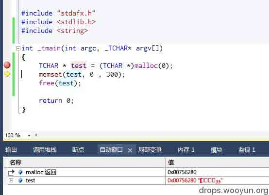

返回了一个非 NULL 的堆。

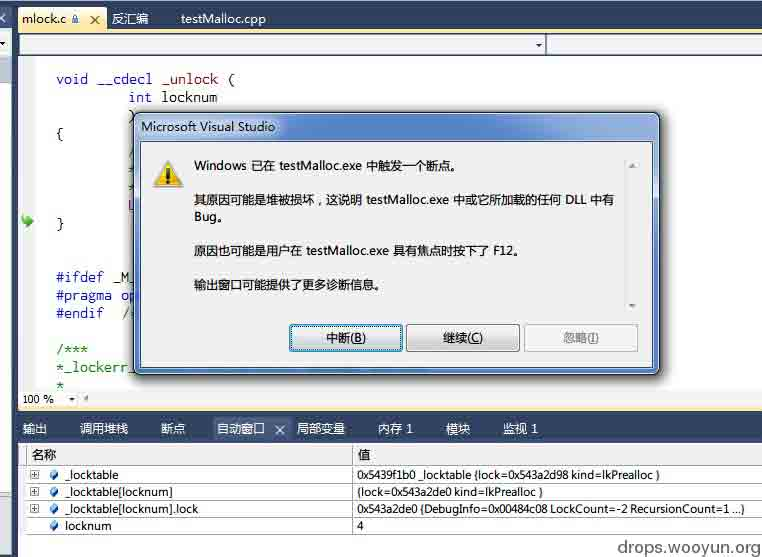

损坏。

2、 VC2010 Release + malloc（0）

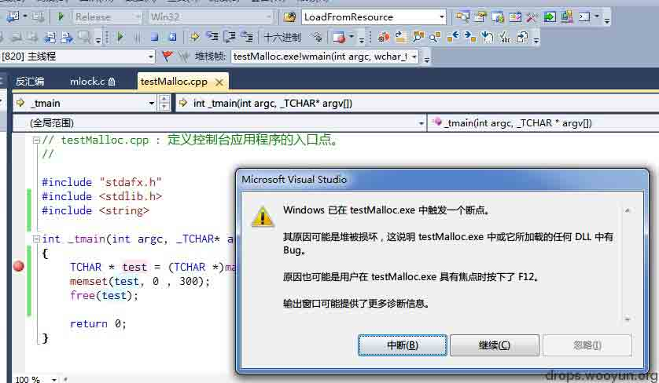

情形类似

HEAP[testMalloc.exe]: Heap block at 005455B8 modified at 005455C1 past requested size of 1
Windows 已在 testMalloc.exe 中触发一个断点。

其原因可能是堆被损坏，这说明 testMalloc.exe 中或它所加载的任何 DLL 中有 Bug。

原因也可能是用户在 testMalloc.exe 具有焦点时按下了 F12。

输出窗口可能提供了更多诊断信息。
程序“[4256] testMalloc.exe: 本机”已退出，返回值为 0 (0x0)。

3、gcc Debug+malloc（0）

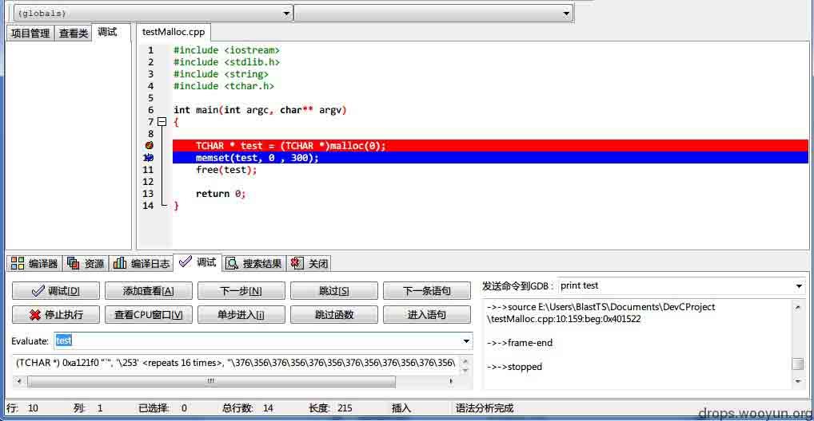

分配了一个非 NULL 但是可以释放的堆。

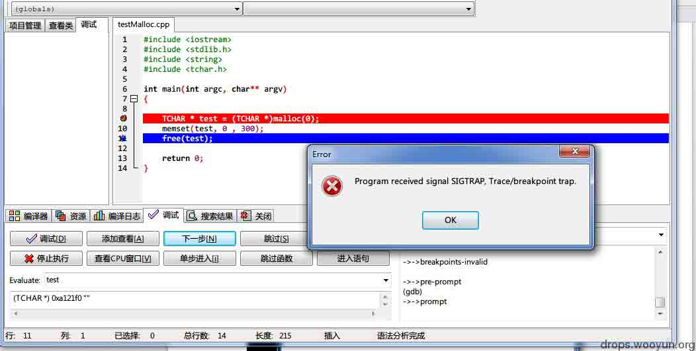

成功覆盖了堆的信息

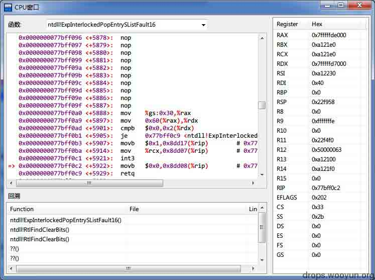

同样崩溃

4、gcc Release+malloc（0）

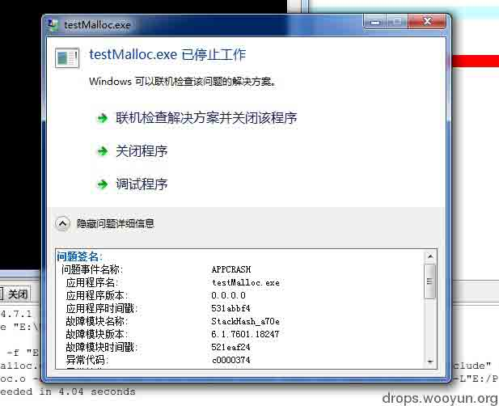

情形类似

果不其然四个情况下都表明：VS 和 G++编译器编译后 malloc(0)返回的不是 NULL，而是一个活生生的堆，而且你动它一下，它就赖地上让你赔钱了。

### 0x04b 具体发生了什么？

虽然和浏览器堆破坏的这一例不一样，但是为了演示一下 malloc(0)分配的内存到底为何不能操作，我们还是使用 VC2010+Relase+malloc(0) 32 位环境下的程序来试试看吧：

#### 0x04b.1 编译源程序

我们模拟一下那个创建小窗口前的一些准备工作：

```
// testMalloc.cpp : 定义控制台应用程序的入口点。
//

#include "stdafx.h"
#include <stdlib.h>
#include <string>
#include <windows.h>

#define URL_LENGTH 26

int _tmain(int argc, _TCHAR* argv[])
{
    TCHAR * test = (TCHAR *)malloc(0); //很不幸，这儿的参数是 0
    memset(test, 0x11 , URL_LENGTH); //为了方便查看，我把改成了 0x11

    TCHAR url[27] = _T("ABCDEFGHIJKLMNOPQRSTUVWXYZ"); 
    //正好 26 字,假设我们的 url 就是这个拉

    int i = WideCharToMultiByte(CP_ACP, 0, url, -1, NULL, 0, 0,FALSE); 
    char * szTmp = new char[i];
    WideCharToMultiByte(CP_ACP, 0, url, -1, szTmp, i, 0, FALSE);

    memcpy(test, szTmp, i); //复制到我们的堆中

    free(test);

    return 0;
}

```

#### 0x04b.2 载入 windbg 中：

在 wmain 处下断点，l-t 之后并用 p 执行完 malloc，然后查看当前分配来的堆的信息：

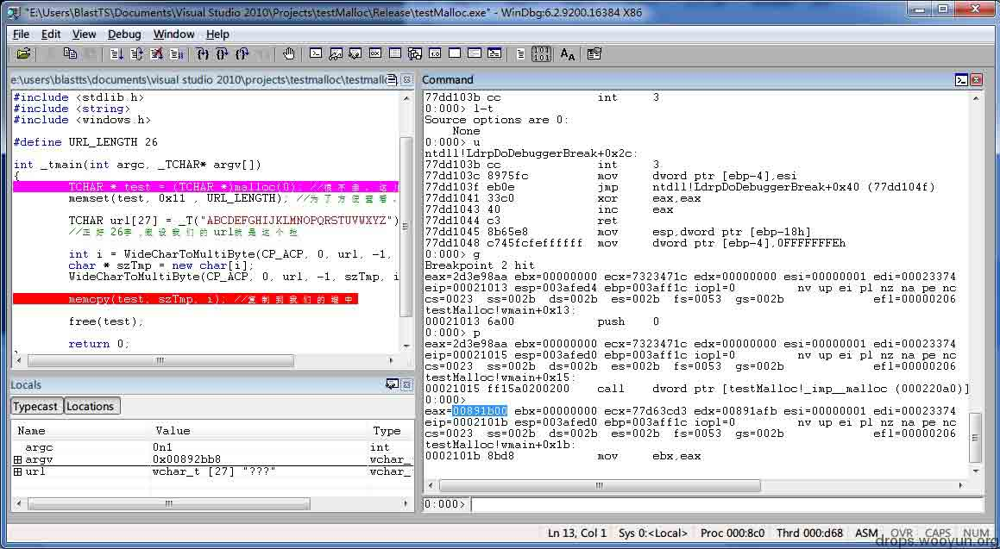

可以看到当前的堆内数据如下，其中数据使用了堆的填充模式 abababe8 abababab，而这看起来像是一个已分配的堆空间的末尾的填充模式（为什么呢？因为如果分配了字节的话，堆会用 baadf00d 这个填充模式来填充将来可能会被使用的空间，而这个 abababe8 blablabla 则是像是这个填充模式的末尾，或者，更像是说 ANSI 字符串的中止符号“”的东西）：

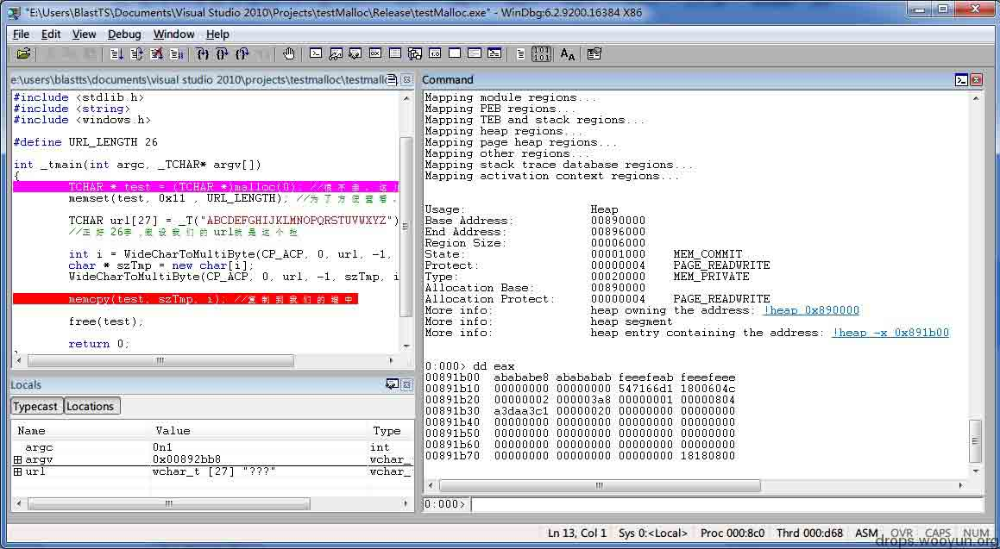

这是 memset 完，我们 26 个字符填充进去之后的效果：

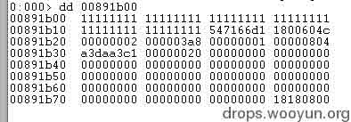  

这个相当于什么？相当于在一个堆的用户可操作区域之外做写入操作，这样数据就已然超出了堆的申请大小，让它活生生的演变成了堆溢出，之后程序还会对它进行 free，必然是错上加错。

#### 0x04b.3 证明我们的想法

让我们换一点代码，我们把 malloc(0)修改为 malloc(27)，重新载入。

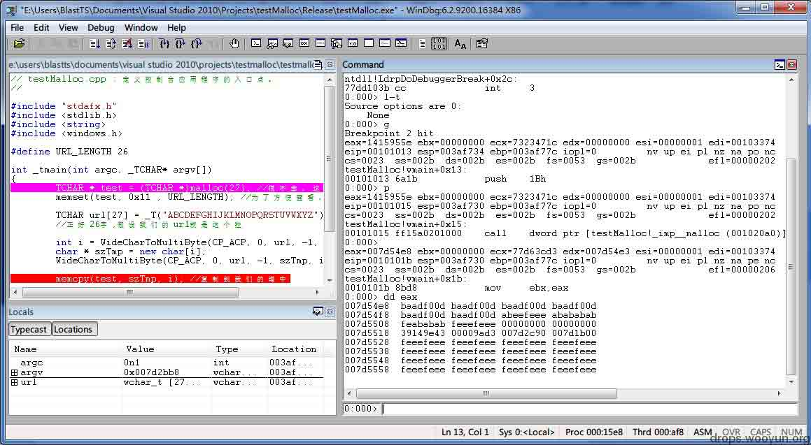

这回，我们看到了一个新的填充模式，baadf00d ，而这正是我们之前提到的可用但是未初始化的堆空间的填充模式。

而如此如此运行之后，程序正常退出。

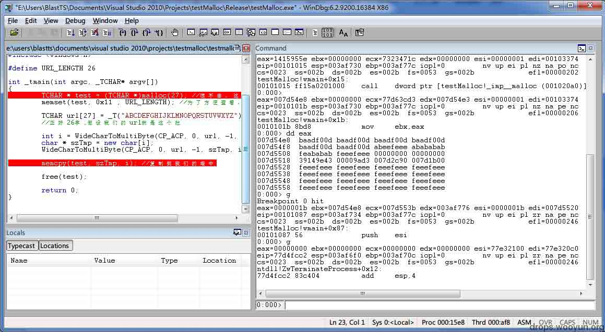

### 0x04c 几个小名词

#### 调试友好

当在调试器下启动进程的时候，堆管理器将修改所有新堆的请求，并且设置创建标志，用于启用“调试友好”的堆，这会应用到内存里面所有堆，包括默认的进程堆，这种堆与原先的最大的差异是堆块中包含了额外的“填充模式”区域，这个区域位于用户可访问的部分之后，堆管理器通过这个区域来确认堆的完整性。如果这个填充模式被修改了，堆管理器会立刻中断进入调试器内。

#### 填充模式

堆管理器在分配堆时自动的使用某个填充模式来初始化某片内存，填充模式的内容取决于堆块的状态，当堆块最初被返回给调用者时，堆管理器将使用填充模式来填充堆块中用户可访问的部分，其中在填充模式中包含的值就是 baadf00d，这表示这个堆块虽然分配成功，但是没有初始化。如果有程序在没有初始化堆块之前就对其进行解引用操作，就会产生一个存取违例的异常；如果程序正确的初始化了堆块，那么程序将继续执行，这个堆块被释放后，堆管理器将再次对堆块中用户可以访问的部分进行填充，使用的值是 feeefeee。设置完这些个填充模式之后，调试器将通过检测这个填充模式的值是否被修改，来跟踪在释放后堆块上所发生的访问操作。

#### __alloca_probe

这个函数在栈上分配空间，超过 0x1000 的每次按 0x1000 的大小（如果剩余未分配的大小大于 0x1000 的话）不断在栈上分配内存(sub ecx,1000h; sub eax,1000h; test [ecx],eax; ecx 是之前参数在栈中的地址，这样可以检测是否真的分配上了 0x1000 字节)，test [ecx],eax 用来检查是否栈已经不够用了（栈的大小是固定的，所以如果分配的地址取不到的话[ecx]就会存取违例了），如果已经撑爆了通常会报告“Stack Overrun”（也会看到 Stack Overflow）的报警。

#### Security cookie

当应用程序启动时，程序的 cookie（4 字节（dword），无符号整型）被计算出来（伪随机数）并保存在加载模块的.data 节中,在函数的开头这个 cookie 被拷贝到栈中，位于 EBP 和返回地址的正前方（位于返回地址和局部变量的中间）。 

#### [buffer][cookie][savedEBP][savedEIP]

在函数的结尾处，程序会把这个 cookie 和保存在.data 节中的 cookie 进行比较。 
如果不相等，就说明进程栈被破坏，进程必须被终止。 

为了尽量减少额外的代码行对性能带来的影响，只有当一个函数中包含字符串缓冲区或使用 _alloca 函数在栈上分配空间的时候编译器才在栈中保存 cookie。另外，当缓冲区至少于 5 个字节时，在栈中也不保存 cookie。 

在典型的缓冲区溢出中，栈上的返回地址会被数据所覆盖，但在返回地址被覆盖之前，cookie 早已经被覆盖了，因此就导致了 exploit 的失效（但仍然可以导致拒绝服务），因为在函数的结尾程序会发现 cookie 已经被破坏，接着应用程序会被结束。

#### BUCKET

微软分类崩溃类型，用一系列牛逼算法所生成并使用的一个标识符号。

## 0x05 修复

* * *

官方是修复了，不过纵观全局他这代码也太粗心了，俺的最大的建议就是每个返回值都检查一遍，千万别嫌麻烦……

0x06 参考资料

* * *

Mario Heweardt, Daniel Pravat 《windows 高级调试》

[`bbs.pediy.com/archive/index.php?t-126858.html`](http://bbs.pediy.com/archive/index.php?t-126858.html)

[`msdn.microsoft.com/en-us/library/ee480951.aspx`](http://msdn.microsoft.com/en-us/library/ee480951.aspx)

版权声明：未经授权禁止转载 [blast](http://drops.wooyun.org/author/blast "由 blast 发布")@[乌云知识库](http://drops.wooyun.org)

分享到：

### 相关日志

*   [软件漏洞分析技巧分享](http://drops.wooyun.org/tips/1261)
*   [OAuth 2.0 安全案例回顾](http://drops.wooyun.org/papers/598)
*   [Easy RM to MP3 Converter(2.7.3.700)栈溢出漏洞调试笔记](http://drops.wooyun.org/papers/3178)
*   [做个试验：简单的缓冲区溢出](http://drops.wooyun.org/papers/1421)
*   [Blind Return Oriented Programming (BROP) Attack – 攻击原理](http://drops.wooyun.org/tips/3071)
*   [关于 OpenSSL“心脏出血”漏洞的分析](http://drops.wooyun.org/papers/1381)