# 爬虫技术浅析 

2014/11/17 12:53 | [Manning](http://drops.wooyun.org/author/Manning "由 Manning 发布") | [技术分享](http://drops.wooyun.org/category/tips "查看 技术分享 中的全部文章") | 占个座先 | 捐赠作者

## 0x00 前言

* * *

网络爬虫（Web crawler），是一种“自动化浏览网络”的程序，或者说是一种网络机器人。它们被广泛用于互联网搜索引擎或其他类似网站，以获取或更新这些网站的内容和检索方式。它们可以自动采集所有其能够访问到的页面内容，以便程序做下一步的处理。

在 WEB2.0 时代，动态网页盛行起来。那么爬虫就应该能在页面内爬到这些有 javascript 生成的链接。当然动态解析页面只是爬虫的一个技术点。下面，我将按照如下顺序分享下面的这些内容的一些个人经验（编程语言为 Python）。

1，爬虫架构。

2，页面下载与解析。

3，URL 去重方法。

4，URL 相似性算法。

5，并发操作。

6，数据存储

7，动态爬虫源码分享。

8，参考文章

## 0x01 爬虫架构

* * *

谈到爬虫架构，不得不提的是 Scrapy 的爬虫架构。Scrapy，是 Python 开发的一个快速,高层次的爬虫框架，用于抓取 web 站点并从页面中提取结构化的数据。Scrapy 用途广泛，可以用于数据挖掘、监测和自动化测试。Scrapy 吸引人的地方在于它是一个框架，任何人都可以根据需求方便的修改。它也提供了多种类型爬虫的基类，如 BaseSpider、sitemap 爬虫等。

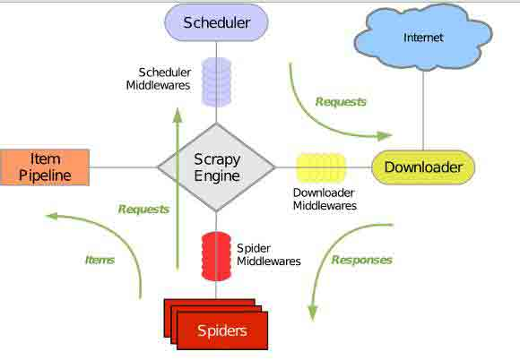

上图是 Scrapy 的架构图，绿线是数据流向，首先从初始 URL 开始，Scheduler 会将其交给 Downloader 进行下载，下载之后会交给 Spider 进行分析，需要保存的数据则会被送到 Item Pipeline，那是对数据进行后期处理。另外，在数据流动的通道里还可以安装各种中间件，进行必要的处理。 因此在开发爬虫的时候，最好也先规划好各种模块。我的做法是单独规划下载模块，爬行模块，调度模块，数据存储模块。

## 0x02 页面下载与解析

* * *

## 页面下载

页面下载分为静态和动态两种下载方式。

传统爬虫利用的是静态下载方式，静态下载的优势是下载过程快，但是页面只是一个枯燥的 html，因此页面链接分析中获取的只是< a >标签的 href 属性或者高手可以自己分析 js，form 之类的标签捕获一些链接。在 python 中可以利用 urllib2 模块或 requests 模块实现功能。 动态爬虫在 web2.0 时代则有特殊的优势，由于网页会使用 javascript 处理，网页内容通过 Ajax 异步获取。所以，动态爬虫需要分析经过 javascript 处理和 ajax 获取内容后的页面。目前简单的解决方法是通过基于 webkit 的模块直接处理。PYQT4、Splinter 和 Selenium 这三个模块都可以达到目的。对于爬虫而言，浏览器界面是不需要的，因此使用一个 headless browser 是非常划算的，HtmlUnit 和 phantomjs 都是可以使用的 headless browser。

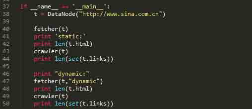

以上这段代码是访问新浪网主站。通过对比静态抓取页面和动态抓取页面的长度和对比静态抓取页面和动态抓取页面内抓取的链接个数。

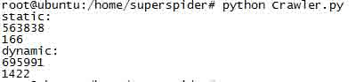

在静态抓取中，页面的长度是 563838，页面内抓取的链接数量只有 166 个。而在动态抓取中，页面的长度增长到了 695991，而链接数达到了 1422，有了近 10 倍的提升。

抓链接表达式

正则：re.compile("href=\"([^\"]*)\"")

Xpath：xpath('//*[@href]')

## 页面解析

页面解析是实现抓取页面内链接和抓取特定数据的模块，页面解析主要是对字符串的处理，而 html 是一种特殊的字符串，在 Python 中 re、beautifulsoup、HTMLParser、lxml 等模块都可以解决问题。对于链接，主要抓取 a 标签下的 href 属性，还有其他一些标签的 src 属性。

## 0x03 URL 去重

* * *

URL 去重是爬虫运行中一项关键的步骤，由于运行中的爬虫主要阻塞在网络交互中，因此避免重复的网络交互至关重要。爬虫一般会将待抓取的 URL 放在一个队列中，从抓取后的网页中提取到新的 URL，在他们被放入队列之前，首先要确定这些新的 URL 没有被抓取过，如果之前已经抓取过了，就不再放入队列了。

Hash 表

利用 hash 表做去重操作一般是最容易想到的方法，因为 hash 表查询的时间复杂度是 O(1)，而且在 hash 表足够大的情况下，hash 冲突的概率就变得很小，因此 URL 是否重复的判断准确性就非常高。利用 hash 表去重的这个做法是一个比较简单的解决方法。但是普通 hash 表也有明显的缺陷，在考虑内存的情况下，使用一张大的 hash 表是不妥的。Python 中可以使用字典这一数据结构。

URL 压缩

如果 hash 表中，当每个节点储存的是一个 str 形式的具体 URL，是非常占用内存的，如果把这个 URL 进行压缩成一个 int 型变量，内存占用程度上便有了 3 倍以上的缩小。因此可以利用 Python 的 hashlib 模块来进行 URL 压缩。 思路：把 hash 表的节点的数据结构设置为集合，集合内储存压缩后的 URL。

Bloom Filter

Bloom Filter 是通过极少的错误换取了存储空间的极大节省。Bloom Filter 是通过一组 k 个定义在 n 个输入 key 上的 Hash Function，将上述 n 个 key 映射到 m 位上的数据容器。

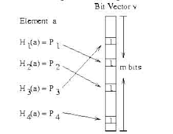

上图很清楚的说明了 Bloom Filter 的优势，在可控的容器长度内，所有 hash 函数对同一个元素计算的 hash 值都为 1 时，就判断这个元素存在。 Python 中 hashlib，自带多种 hash 函数，有 MD5，sha1，sha224，sha256，sha384，sha512。代码中还可以进行加盐处理，还是很方便的。 Bloom Filter 也会产生冲突的情况，具体内容查看文章结尾的参考文章。

在 Python 编程过程中，可以使用 jaybaird 提供的 BloomFilter 接口，或者自己造轮子。

小细节

有个小细节，在建立 hash 表的时候选择容器很重要。hash 表占用空间太大是个很不爽的问题，因此针对爬虫去重，下列方法可以解决一些问题。

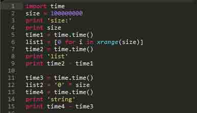

上面这段代码简单验证了生成容器的运行时间。

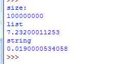

由上图可以看出，建立一个长度为 1 亿的容器时，选择 list 容器程序的运行时间花费了 7.2s，而选择字符串作为容器时，才花费了 0.2s 的运行时间。

接下来看看内存的占用情况。

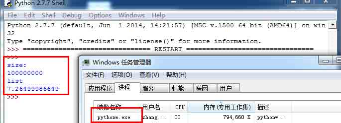

如果建立 1 亿的列表占用了 794660k 内存。

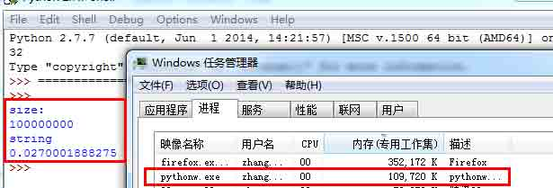

而建立 1 亿长度的字符串却占用了 109720k 内存，空间占用大约减少了 700000k。

## 0x04 URL 相似性

* * *

初级算法

对于 URL 相似性，我只是实践一个非常简单的方法。

在保证不进行重复爬去的情况下，还需要对类似的 URL 进行判断。我采用的是 sponge 和 ly5066113 提供的思路。具体资料在参考文章里。

下列是一组可以判断为相似的 URL 组

http://auto.sohu.com/7/0903/70/column213117075.shtml

http://auto.sohu.com/7/0903/95/column212969565.shtml

http://auto.sohu.com/7/0903/96/column212969687.shtml

http://auto.sohu.com/7/1103/61/column216206148.shtml

http://auto.sohu.com/s2007/0155/s254359851/index1.shtml

http://auto.sohu.com/s2007/5730/s249066842/index2.shtml

http://auto.sohu.com/s2007/5730/s249067138/index3.shtml

http://auto.sohu.com/s2007/5730/s249067983/index4.shtml

按照预期，以上 URL 归并后应该为

http://auto.sohu.com/7/0903/70/column213117075.shtml

http://auto.sohu.com/s2007/0155/s254359851/index1.shtml

思路如下，需要提取如下特征

1，host 字符串

2，目录深度（以’/’分割）

3，尾页特征

具体算法

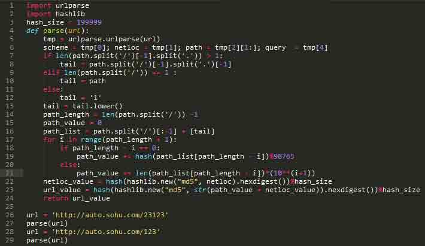

算法本身很菜，各位一看就能懂。

实际效果：

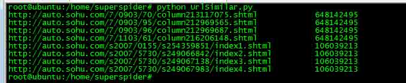

上图显示了把 8 个不一样的 url，算出了 2 个值。通过实践，在一张千万级的 hash 表中，冲突的情况是可以接受的。

## 0x05 并发操作

* * *

Python 中的并发操作主要涉及的模型有：多线程模型、多进程模型、协程模型。Elias 专门写了一篇文章，来比较常用的几种模型并发方案的性能。对于爬虫本身来说，限制爬虫速度主要来自目标服务器的响应速度，因此选择一个控制起来顺手的模块才是对的。

## 多线程模型

多线程模型，是最容易上手的，Python 中自带的 threading 模块能很好的实现并发需求，配合 Queue 模块来实现共享数据。

## 多进程模型

多进程模型和多线程模型类似，multiprocessing 模块中也有类似的 Queue 模块来实现数据共享。在 linux 中，用户态的进程可以利用多核心的优势，因此在多核背景下，能解决爬虫的并发问题。

## 协程模型

协程模型，在 Elias 的文章中，基于 greenlet 实现的协程程序的性能仅次于 Stackless Python，大致比 Stackless Python 慢一倍，比其他方案快接近一个数量级。因此基于 gevent（封装了 greenlet）的并发程序会有很好的性能优势。

具体说明下 gevent（非阻塞异步 IO）。，“Gevent 是一种基于协程的 Python 网络库，它用到 Greenlet 提供的，封装了 libevent 事件循环的高层同步 API。”

从实际的编程效果来看，协程模型确实表现非常好，运行结果的可控性明显强了不少， gevent 库的封装易用性极强。

## 0x06 数据存储

* * *

数据存储本身设计的技术就非常多，作为小菜不敢乱说，但是工作还是有一些小经验是可以分享的。

前提：使用关系数据库，测试中选择的是 mysql，其他类似 sqlite，SqlServer 思路上没有区别。

当我们进行数据存储时，目的就是减少与数据库的交互操作，这样可以提高性能。通常情况下，每当一个 URL 节点被读取，就进行一次数据存储，对于这样的逻辑进行无限循环。其实这样的性能体验是非常差的，存储速度非常慢。

进阶做法，为了减少与数据库的交互次数，每次与数据库交互从之前传送 1 个节点变成传送 10 个节点，到传送 100 个节点内容，这样效率变有了 10 倍至 100 倍的提升，在实际应用中，效果是非常好的。:D

## 0x07 动态爬虫源码分享

* * *

爬虫模型

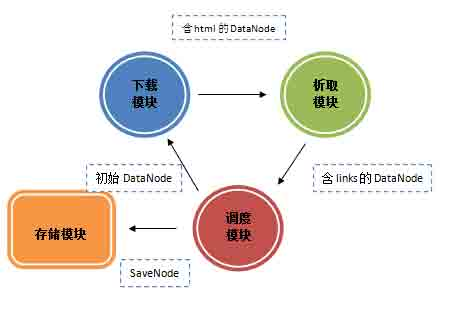

目前这个爬虫模型如上图，调度模块是核心模块。调度模块分别与下载模块，析取模块，存储模块共享三个队列，下载模块与析取模块共享一个队列。数据传递方向如图示。

爬虫源码

实现了以下功能：

动态下载

gevent 处理

BloomFilter 过滤

URL 相似度过滤

关键字过滤

爬取深度

Github 地址：https://github.com/manning23/MSpider

代码总体来说难度不大，各位轻喷。

## 0x08 参考文章

* * *

感谢以下分享的文章与讨论

http://security.tencent.com/index.php/blog/msg/34 http://www.pnigos.com/?p=217

http://security.tencent.com/index.php/blog/msg/12 http://wenku.baidu.com/view/7fa3ad6e58fafab069dc02b8.html

http://wenku.baidu.com/view/67fa6feaaeaad1f346933f28.html

http://www.html5rocks.com/zh/tutorials/internals/howbrowserswork/

http://www.elias.cn/Python/PyConcurrency?from=Develop.PyConcurrency

http://blog.csdn.net/HanTangSongMing/article/details/24454453

http://blog.csdn.net/historyasamirror/article/details/6746217 http://www.spongeliu.com/399.html

http://xlambda.com/gevent-tutorial/ http://simple-is-better.com/news/334

http://blog.csdn.net/jiaomeng/article/details/1495500 http://bbs.chinaunix.net/forum.php?mod=viewthread&tid=1337181

http://www.tuicool.com/articles/nieEVv http://www.zhihu.com/question/21652316 http://code.rootk.com/entry/crawler

版权声明：未经授权禁止转载 [Manning](http://drops.wooyun.org/author/Manning "由 Manning 发布")@[乌云知识库](http://drops.wooyun.org)

分享到：

### 相关日志

*   [WordPress 更新至 3.8.2 修复多个漏洞](http://drops.wooyun.org/news/1401)
*   [HttpOnly 隐私嗅探器](http://drops.wooyun.org/tips/2834)
*   [Reflected File Download Attack](http://drops.wooyun.org/papers/3771)
*   [Iptables 入门教程](http://drops.wooyun.org/tips/1424)
*   [利用 HTTP host 头攻击的技术](http://drops.wooyun.org/papers/1383)
*   [Linux 下基于内存分析的 Rootkit 检测方法](http://drops.wooyun.org/tips/4731)