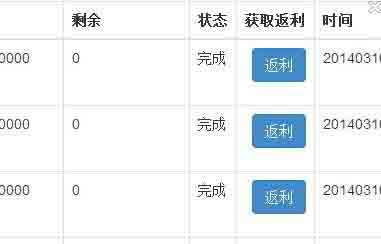

# BCTF Writeup

2014/03/14 17:53 | [我是狗汪汪](http://drops.wooyun.org/author/我是狗汪汪 "由 我是狗汪汪 发布") | [web 安全](http://drops.wooyun.org/category/web "查看 web 安全 中的全部文章"), [漏洞分析](http://drops.wooyun.org/category/papers "查看 漏洞分析 中的全部文章") | 占个座先 | 捐赠作者

team：我是狗汪汪

author：redrain，金龟子，ztz，hellove，cbuteng，琴心剑气，saline

## 0x00 MISC

* * *

### MISC100 初来乍到

**描述**

```
米特尼克刚到中国人生地不熟，想要找到一些中国的黑客朋友帮助他，他知道 Capture The Flag 夺旗竞赛是黑客云集的地方，于是也报名参加了中国第一次全国性的 CTF 大赛 @BCTF 百度杯网络安全技术对抗赛。而要进入 BCTF 圈交流，米特尼克需关注并@BCTF 百度杯网络安全技术对抗赛，才能找到一个密语。 
```

**解题**

很简单，微博上 at 了后会多个粉丝，查看简介即有 flag。

### MISC200 内网冒险

**描述**

```
为了收集更多参加 BCTF 大赛的中国黑客朋友的信息，米特尼克决定尝试渗透进入 BCTF 的内网以获取更多的信息。通过信息搜集和网络监听，他发现了进入内部数据库的一个入口代理，并且在代理入口处拿到了少量流量数据。正当他想继续收集更多信 息的时候，他的行迹被发现并被踢出了网络。 http://bctf.cn/files/downloads /misc200_23633b6b34ccf6f2769d35407f6b2665.pcap 入口代理：218.2.197.236:12345 
```

**解题**

下载得到 pcap，丢 wireshark 如图


端口 53 使用工具 TCPDNS Tools 将本机作为 dns 服务器


ping 目标域名或者使用 nslookup -vc 得到 ip nc 连接后输入所得到 ip 获得 flag


### MISC300 诱捕陷阱

**描述**

```
米特尼克从 FBI 探员凯瑟琳邮箱中发现了一位中国安全专家发给她的邮件，邮件内容如下： 我在 THU 高校部署了一些诱骗系统，捕获到了与米特尼克网络攻击行为相关的数据，见附件，我觉得你们有必要深入分析一下。当然如果你们没有能力分析的话，可以聘用我做技术顾问，不过我的咨询费用很高哦。 附件：http://bctf.cn/files/downloads/dionaea.bistream.38930db22ae8cc6a2e589672ca39dca9 米特尼克非常急迫地想知道这位中国安全专家到底发现了什么？
提示
[hint0]: 也许蜜罐 replay 会帮助你:) [hint1]: 好吧，再提示另一段蜜罐 log，只能说这么多了. http://bctf.cn/files/downloads/kippo.ttylog.692ce16db7d940cb9ec52a8419800423 
```

**解题**

描述中附件得到一份 dionaea 的蜜罐 log，但是未再 win 下搭建成功，后来给力 hint 是一份 linux 下的蜜罐系统 kippo 的 log，成功搭建并重现攻击过程


kippo 中 axel 无法使用，下载只能通过 curl，通过复现找到了后门地址 2792326331/fool


解密后得到真实 ip：166.111.132.187 将后门下载 http://166.111.132.187/fool 接下来就交给妹子逆向这个后门了：) 这里的这个跳转不能让它跳


下面是加载一些枚举进程和模块需要用到的函数


提权操作


挨个枚举进程，检查有没有百度杀毒的进程。


这里我们只需要将这几个跳转改了就好了。


过了那个百度杀毒进程的验证那儿。Key 就自己跳出来了呢


## 0x01 PPC & Crypto

* * *

### PPC & Crypto100 混沌密码锁

**描述**

```
据传说，米特尼克进任何门都是不需要钥匙的，无论是金锁银锁 还是密码锁。使用伪造身份在 BAT 安全部门工作的时候，有一扇带着密码锁的大门吸引了他的注意。门后面到底藏着什么呢？米特尼克决定一探究竟。 http://bctf.cn/files/downloads/passcode_396331980c645d184ff793fdcbcb739b.py 218.2.197.242:9991 218.2.197.243:9991 
```

**解题**

下载源码后阅读

```
#-*- coding:utf-8 -*- 

import base64,binascii,zlib 
import os,random 

base = [str(x) for x in range(10)] + [ chr(x) for x in range(ord('A'),ord('A')+6)] 

def abc(str): 
    return sha.new(str).hexdigest() 

def bin2dec(string_num): 
    return str(int(string_num, 2)) 

def hex2dec(string_num): 
    return str(int(string_num.upper(), 16)) 

def dec2bin(string_num): 
    num = int(string_num) 
    mid = [] 
    while True: 
        if num == 0: break 
        num,rem = divmod(num, 2) 
        mid.append(base[rem]) 
    return ''.join([str(x) for x in mid[::-1]]) 

def dec2hex(string_num): 
    num = int(string_num) 
    mid = [] 
    while True: 
        if num == 0: break 
        num,rem = divmod(num, 16) 
        mid.append(base[rem]) 

    return ''.join([str(x) for x in mid[::-1]]) 

def hex2bin(string_num): 
    return dec2bin(hex2dec(string_num.upper())) 

def bin2hex(string_num): 
    return dec2hex(bin2dec(string_num)) 

def reverse(string): 
    return string[::-1] 

def read_key(): 
    os.system('cat flag') 

def gb2312(string): 
    return string.decode('gb2312') 

answer='78864179732635837913920409948348078659913609452869425042153399132863903834522365250250429645163517228356622776978637910679538418927909881502654275707069810737850807610916192563069593664094605159740448670132065615956224727012954218390602806577537456281222826375' 

func_names = ['fun1', 'fun2', 'fun3', 'fun4', 'fun5', 'fun6', 'fun7', 'fun8', 'fun9'] 

f={} 

f['fun1']=reverse 
f['fun2']=base64.b64decode 
f['fun3']=zlib.decompress 
f['fun4']=dec2hex 
f['fun5']=binascii.unhexlify 
f['fun6']=gb2312 
f['fun7']=bin2dec 
f['fun8']=hex2bin 
f['fun9']=hex2dec 

def check_equal(a, b): 
    if a == b: 
        return True 
    try: 
        if int(a) == int(b): 
            return True 
    except: 
        return False 
    return False 

def main(): 

    print "Welcome to Secure Passcode System" 
    print "First, please choose function combination:" 

    in1=raw_input('f1: ') 
    f1='fun'+in1[:1] 
    in2=raw_input('f2: ') 
    f2='fun'+in2[:1] 
    in3=raw_input('f3: ') 
    f3='fun'+in3[:1] 
    in4=raw_input('f4: ') 
    f4='fun'+in4[:1] 

    if f1 not in func_names or f2 not in func_names or f3 not in func_names or f4 not in func_names: 
        print 'invalid function combination' 
        exit() 

    try: 
        answer_hash = f'fun6'))))) 
    except: 
        print "Wrong function combination, you bad guy!" 
        exit() 

    if len(answer_hash) == 0: 
        print 'You must be doing some little dirty trick! Stop it!' 
        exit() 

    usercode = raw_input('Your passcode: ') 

    try: 
        user_hash = f'fun6'))))) 
        if user_hash == answer_hash: 
            if check_equal(answer, usercode): 
                print "This passcode has been locked, please use the new one\n" 
            else: 
                print "Welcome back! The door always open for you, your majesty! " 
                read_key() 
        else: 
            print "Sorry, bad passcode.\n" 
    except: 
        print "Sorry, bad passcode. Please try again." 

if __name__ == '__main__': 
    main() 

```

添加 continue，跑了一下，结果是 fun3,fun5,fun1,fun4 妈蛋，结果是 This passcode has been locked, please use the new one 发现`read_key()`，使用 python 的 zlib.compress 函数

```
usercode= hex2dec(reverse(binasci.b2a_hex(zlib.compress(ff1))),4))))

```


### PPC & Crypto200 他乡遇故知

**描述**

```
逃离到中国的米特尼克与以前的老朋友都失去了联系，这让他常 常怀念逝去的时光。在一次潜入某著名外企尝试获取重要资料的行动中，米特尼克还没有拿到目标文件就不幸被保安发现了。在逃离的过程中，他闯进了一个办公 室，结果惊奇地发现自己二十年前的老朋友 Tupper 就在眼前。更神奇的是，Tupper 知道米特尼克需要什么，给了他想要的东西并且帮助他成功脱逃。你知道米特尼克拿到的信息是什么吗？ http://bctf.cn/files/downloads/meeting-tupper_baaa58809f2a0435cb5f282ce4249fdf.txt 
```

**解题**

二人对话应该是 Tupper 的自指公式中的 k 值，谷歌后了解到 Tupper 自指公式是用来绘制图的 再 wiki 上找到了的程序跑不出后面两段 k 值，后来又再 csdn 上找到了一段程序解决 使用程序如下：

```
def Tupper_self_referential_formula(fd, k):

    size = 61

    def f(x,y):
        d = ((-size * x) - (y % size))
        e = reduce(lambda x,y: x*y, [2 for x in range(-d)]) if d else 1
        f = ((y / size) / e)
        g = f % 2
        return 0.5 < g

    for y in range(k+size - 1, k-1, -1):
        line = ""
        for x in range(0, 1000):
            if f(x,y):
                line += "@"
            else:
                line += " "
        line += '\n'
        fd.write(line)

if __name__ == '__main__':
    d = k 值
    e = k 值
    f = open('ans2','w')

    Tupper_self_referential_formula(f,d)
    Tupper_self_referential_formula(f,e)
    f.close()
    '''
    row = 17
    print len(str(a))
    ans = str(bin(a))[2:]
    print len(ans)
    col = len(ans) / row + 1
    print col
    f =open('ans1','w')
    for i in range(0,row - 1):
        f.write(ans[col * i: col * (i+1)])
        f.write('\n')

    f.close()
    '''
    '''
    row = 61
    print len(str(d))
    ans = str(bin(d))[2:]
    print len(ans)
    col = len(ans) / row + 1
    print col
    ##f =open('ans1','w')
    for i in range(0,col):
        f.write(ans[row * i: row * (i+1)])
        f.write(ans[row * i + row: row * (i+2)])
        f.write('\n')

    f.close()
    '''

```


使用注释的代码速度会更快


解出 flag： p1e4se-d0nt-g1ve-up-cur1ng 。。。不要放弃治疗么。。。我已经病入膏肓了

### PPC & Crypto400 地铁难挤

**描述**

```
米特尼克需要用社工办法拿到 THU 安全专 家的磁盘镜像以了解更多信息，于是他收买了 THU 专家的博士生，来到 BJ 市需要与博士生当面联系。但是，来到 BJ 市之后遇到的第一个问题就是交通。BJ 市 人满为患，上下地铁时人们也不先下后上，而是互相挤。左边的人想挤到右边下车，右边的人也想挤到左边上车。你作为米特尼克在 BJ 的一位小伙伴，能否帮他和 所有乘客设计一个尽量少移动次数的方案，使得需要上车的人都上车，需要下车的人都下车。 218.2.197.242:6000 or 218.2.197.243:6000 
```

**解题**

nc 连上去,需要爆破 4 位给定的 sha1, 每次进入系统的需要爆破的内容不同,有时间限制。 直接 4 个 for 循环,时间复制度为 O(62⁴) python 无法在规定时间内完成。 采用分布式爆破或者多进程 接着 让所有的 L 移动到右边,所有的移动到左边,中间是空格 4 种情况 空格跟左边相邻的位置交换 空格跟左边隔着的一个位置交换位置 空格跟右边相邻的位置交换, 空格跟右边隔着的一个位置交换。 然后要求用最小的步数,采用 bfs。 然后运行跑 100 轮出现 flag


## 0x02 REVERSE

* * *

### REVERSE100 最难得题目

**描述**

```
米特尼克路被各路大神追查痛苦饥渴难耐。顺手捡起身边一个水杯，打开瓶盖，居然写着 one more，实在太神奇了。 http://bctf.cn/files/downloads/re_100.8cd4820cbd1300bda951e694298f73a0 
```

**解题**

放入 OD 之后，发现有反调试，要把这几个反调试的跳转改了就好了。


然后把 messagebox nop 掉


然后运行，等他执行完毕，就可以看到 key 了。Th3_H4rd3st_H3r3


### REVERSE200 小菜一碟

首先，下面是将这些数字从字符转换成内存中的数字。


将这些数字初始化到内存中，如果遇到内存不是 FF 的那么就跳想下一个内存地址。


初始化完毕之后就是这样了：

 

最重要的部分就是下面这个算法： 下面这个算法是求整数商，MagicNumber 是 0x66666667,一共移位了 34 位，带入公式 o=2^n/c C 是 MagicNumber，n 是 34，这样就可以求得 o 为 0xA，也就是 10 进制的 10，那么下面就是用一个数来对 10 求商。


再下面也是一样的。用上面求商那个式子的被除数来对 0xA 求余。也就是求模。


并且要满足下面的比较


上面的这部分算法总结一下 过程就是

```
(bit6*bit7/10+bit7*1)%10==bit1
比较第二位和 bit6*bit7%10 的关系
比较 bit6*bit7/10+bit7 是不是大于等于 10
由于第二次是 8 可以确定第 6 位一定是 0.1.2 中的一个
如果都成立第二位鉴于 bit6*bit7%10 
```

之后第二次循环开始，第 7 位的部分变成固定值 8。再次满足上述条件并满足最后减处来的小于等于 1 这里就根据关系凑数字吧 凑了几组 199XX11,697XX25 等，然后根据下面去确定

好下来下面这个 1404 这个地方，这里 call 了一个 00CF1000 此处这个 call 可以用黑盒的办法处理。


上面这个[ebp-0x58] 确定是不是运算结果大于 100，失败 bx 的值和之前输入的值有关 bl 位低位 4 数 这里有点忘记了，动态调一下。 然后就很容易去定了第 8 位和第 9 位为 09 大不了凑几组就知道规律了比分析快多了。 下面这个循环就是在比较剩余的那些数字了。不对的地方改一下就好了。


最后的结果是:6970825096996108

### REVERSE400 神秘系统

首先在 xp 里面将虚拟机 MBR 覆盖为神秘系统的 MBR，然后用 IDA+VM 调试。 在 7C00 断下来：


下面是在计算 aLoading___|的长度为


读取屏幕上光标的当前位置


下面是显示 Loading 这个字符串。


下面使用 int13 中断来读取系统扇区 读系统的第二个扇区开始读 A 个扇区。


下图是第二个扇区的一部分。确实不知道是什么。。。先往后看吧。


将这些数据读到 0x8000 处


下面是在屏幕上面输出 Access code：


继续，这里要求你输入一个 0-9 的数字


下面是在解密刚刚从第二扇区读入的数据


解密完毕之后，就会跳到 8000 去执行。如果我们这时候输入的不对的话，那么就会错了。


这里应该是和系统进入的时候一样的，首先会在 8000 处有一个段跳转指令，然后继续执行


然后我们看看 MBR 开始的地方，看上去很相似啊。。


我们试一下吧。

```
0xDA ^ 0xEB = 31
0x3B ^ 0x08 = 33
0x71 ^ 0x42 = 33
0x74 ^ 0x47 = 37 
```

我们再试试 1337，就进入系统了。

如果我们用记事本打开这个文件的话，可以看到：


下面使用了 int16 的 0 号功能，也就是从键盘上读 ASCII 码


下面这个地方就是解析我们输入的字符。


输入的大于 2 位的话，就会判断是不是 wr 如果是 wr 的话，就匹配参数


然后正式进入 wr 的处理函数 这里产生随机数


写入文件


下面是对文件名称进行加密


保存加密后的文件名字


根据这个存放文件名字的函数，我们可以知道，他将这个文件按照一定的格式保存在内存中的。

首先一个操作系统要有适当的格式来保存文件，如果一个文件是按照这种格式来保存的话，那么系统中的所有文件都是按照这种格式来保存的，我们可以通过我们写入的文件来逆向出系统保存文件的方式。

后门再分析文件存储的加密算法，然后我们在内存中搜索符合格式要求的内容，那么这一块内容就是要找的文件。然后我们再根据逆出来的加密算法就可以解密文件了。

最后解密出的文件是 Dear CTFer, if you see this message, you have completely unerstood my OS. Congratulations! Here is what you want: BCTF{6e4636cd8bcfa93213c83f4b8314ef00}

## 0x03 PWN

* * *

### PWN100 后门程序

**描述**

```
米特尼克拿到了 BAT 数据中心的口令后，为了确保口令被更改后仍能登陆数据中心，他从一位小伙伴那拿到了一个后门程序植入进了服务器。这个后门程序没有任何说明，但是米特尼克迅速找到了使用方法。后门程序：http://bctf.cn/files/downloads/backdoor_844d899c6320ac74a471e3c0db5e902e 安装地址：218.2.197.250:1337 安装地址 2：218.2.197.249:1337 
```

**解题**

主要思路： 经过分析，发现程序的主要功能是将用户输入与`<baidu-rocks,froM-china-with-love>`轮番异或并判断结果是否等于 n0b4ckd00r。


如果这个判断通过，就会把从第 10 个字节的剩余输入数据作为函数调用。


因此要利用这个我们的 shellcode 要用 n0b4ckd00r 开头并且用`<baidu-rocks,froM-china-with-love>`异或一遍然后发送给服务器。 需要注意的是要保证 scanf 能完整接受 shellcode，它会把 0x20 等字符截断造成 shellcode 无法执行。 shellcode 用的是这个：http://www.shell-storm.org/shellcode/files/shellcode-857.php

### PWN200 身无分文

**描述**

```
米特尼克在 BAT 上班时，发现很多同事都在用新款 Android 手机，很是羡慕，他也想搞一部，来替换他那部用了“二十多年”的摩托罗拉手机。但是他在 BAT 公司还没拿到第一笔工资，用假身份申请的信用卡在租房与日常饮食上也快刷爆了，可以说是身无分文了。这却难不倒米特尼克，他发现了这个销售手机的在线商店。商店地址：218.2.197.251:1234 http://bctf.cn/files/downloads/mobile_shop_4d904f700ef95bae39936cd9c0829d31 
```

**解题**

主要思路：

下载程序后载入 ida，找到显示菜单函数 sub_8048b80。


通过这个函数的调用者我们找到接受参数的函数 sub_8048C00，而该函数会调用购买手机的函数（sub_8048840）、显示菜单的函数等等，而 sub_8048840 中会对传入的参数进行校验：


检查是否为`‘-’`开头，如果不是，用 strtol 把字符串参数转换成数字，如果一次购买的商品大于 8 则退出，否则


`a1[8 - result]`加一，如果此处我们能控制让传入的参数为负数，那么就可以在 a1 + 8 的任意地址+1 了，此处可以更改 sub_8048C00 的返回地址。 因为函数会检查传入参数是否以‘-’开头，所以传入一个以空格开头的字符串‘ -1’，这样就能绕过检测并且在经过 strtol 函数后还能转换为-1,至此，可以达到改 a1 + 8 之上任意地址了。 来看 sub_8048A30 函数，函数接受传入的信用卡号存放在变量中，我们可以在此处存放 shellcode，然后通过上面的地址操作更改地址为变量的地址就可以 exploit 了。


所以，通过这点就可以利用上面的任意地址修改，将返回地址修改为我们存放的 shellcode 的地址就可以达到 exploit 了。

## 0x04 WEB

* * *

### Web100

进入题目后看到了几个人的名字对应的连接，其中的参数格式是 id={32 位字符串}，id 后面的数字目测都很像 MD5，就去 cmd5 解了下，发现 md5 值都是 (对应的名字+三位数字)的 md5 值，那么现在提示要求获得 Alice 的的文件，就尝试去猜测一下 Alice 的 id 看看 交给 burp，切换到 burp 的 Intruder，然后把 id 出设置一个 payload 位置：


然后指定 paylad 为 Alice+三位数字取 md5 运算：


然后就可以 attack


最后可以看到结果为 Alice479 时候出现了正确的页面，访问一下，源代码中看到了`<!--  $_POST['key=OUR MOTTO'] -->`的提示，图片是 BT5 的图片，就尝试 bt5 的 motto，各种大小写，逗号，空格的尝试之后，得到又一个提示 config.php.bak 下载之后得到的东西在 chrome console 中得到了 flag：


话说。。。主办方你们敢不敢不要换代码了。。。今天复现的时候发现 flag 和之前提交的不一样。。。还好有以前的截图，这俩 flag 我也忘记了哪个是第一天我们提交的了

### Web200

访问题目页面提交提示只能在本地运行，然后 F12 把 ip 的值改为了 127.0.0.1 提交，弹出了一个 401 登陆认证，admin/admin 就进去了，弹出来一个游戏页面，但是坑爹的怪物根本打不死啊有木有！！！ 跑去看 agnet1.js 的代码，ctrl+f 了下 BCTF，找到了生成 key 的函数：


继续 ctrl+f 看哪里调用了,找到了调用的地方：


就看到进入之前的那个 if 判断，根据变量名字猜到了 deadghost=10 就是打死十个怪物才会弹出 key，开始找到了 player 的一个 life 属性，发现是 5，还有些攻击间隔之类的变量，就直接改这些值，跑去傻逼呵呵的打死了 10 只怪物到了小黄门前面弹出了 flag，但是坑爹的是一直就不对! 返回来仔细看代码原来 life 和移动速度也参加了生成 key 的运算，这些属性不能改，看代码好心烦啊好蛋疼，从 if 那看到 authnum 的第二个参数是 deafghost，就是打死的怪物数量，是定值 10，继续傻逼呵呵的跑去看 authnum 的第一个参数是怎么算出来的，看的好乱，忽然就发现 2b 了，直接 chrome 的 js console 应该就 ok，f12 过去，输入 authnum(gameObj.key,10) 出来了 flag：


### Web300

根据`<form class="form-signin" action="test.php.bak">-->` 中下载到的源码，根据里面 key 和 room 长度的判断以及那个正则，构造出了一个合适的 url：query.php?key=abcd123AB124564&room=xxx room 哪里貌似可以执行， 当 room=$(2*3))时输入如下：


不过只能返回%d 数字。。。。。 后面继续尝试其他各种猥琐命令，redrain 大牛说如果命令返回值有多行或者为空似乎都不会传给 room 去运行，可以用 ls 和通配符来判断文件是否存在，类似于盲注，通过返回页面判断这个文件活目录在不在。。.即 room=$(ls B*) 如果页面返回那串 180xxx 的随机数，说么这个文件或目录一个字符为 B，继续 room=$(ls BX*) 这样去匹配，同时控制整个 room 长度小于 15 就 ok 了，然后手工帝就用黄金右手去跑了，逗比的跑去写了个程序发现还没人家的右手跑的快，呵呵呵了： 最后跑出来 flag:


### WEB400 冰山一角

**描述**

```
在上一个站点中米特尼克学会了特殊的 Web 技巧，在开始渗透前，他会左顾右盼装作看风景。他对 BAT 这个公司的好奇与日俱增，似乎 BAT 并不像是表面上看起来的那样，仅仅是个互联网公司。他追寻一系列蛛丝马迹找到了这个站点，里面似乎隐藏着 BAT 的一项核心机密。站点入口：http://218.2.197.240:1337/0cf813c68c3af2ea51f3e8e1b8ca1141/index.php（注意：本题 flag 非“BCTF{可见字符串}”形式） 
```

**解题**

访问 url 是一个登录窗口：


在经过扫描后发现开放了 mongodb 端口，于是直接 mongodb 注入：


得到这个页面：


通过提示得知存在`you_guys_fxxking_smart.php/jpg`两个文件，访问 php 又是一个登录窗口。。


而 jpg 则是代码提示：


通过代码提示，可以看到关键语句的 password 经过了 hash 函数加密，而第三个参数 true 告诉我们加密后的密文是二进制输出的，所以构造一个经过加密后存在 SQL 注入的密文就可以。 密钥可以通过提示：“I love the first letter of my name”以及“`<meta name="author" content="bob">` ”得到为 b，于是我写了一个脚本调用 hash 的所有支持函数并遍历输出寻找 SQL 注入语句，同时也没闲着用 burpsuite 对登录窗口进行爆破（验证码复用）。 然后爆破成功，密码 9384。 得到这个：


猜测可能是 hash 中的某函数加密过了，于是把密码取出来扔 cmd5 试，在试到 sha512 的时候成功了，最后两个密码解密还原得到 flag。

### Web500

存在一个支付的 bug，取消交易可以无限刷 rmb 和 btc 首先用 rmb 买入 btc，然后交易管理中取消该交易，此时 burp 抓包，重放此包 n 次可刷 n 倍 rmb 刷 btc 也是一样，先买入一枚 btc，然后搞价卖出，此时为挂单状态，然后取消交易，此时抓包，重放此包 n 次可刷 n 倍 btc 刷够 200btc 就可以盲打到后台，在 rmb 提现处可以 xss，打到 cookie 进入后台，发现一处蛋疼蛋疼的注入，在后台返利处：



抓包获得的 id=’可以注入 Id=xxx’当 id 号有效时会出现 http 500 错误 虽然提交 id=xxx and 1=1 和 id=xxx and 1=2 之后返回页面相同 但是提交 and 1=1 之后再提交 单引号就不会抛出 http 500 错误 提交 and 1=2 之后 再提交单引号会报错 所以可以用第二次请求加单引号去验证上次请求的结果。

而且只要条件为真，id 号就失效，选片换下一个 id 号

由此思路，可以写程序去实现： 首先发包生成返利 Id=xxx +payload 进行盲注 发 id=xxx 加单引号验证上步结果 如果 3 中未出现 http 500 则继续更换下一个 payload。若出现 http 2000 则 重新生成返利 id

然后就循环 2-5 步骤貌似就能跑数据了。当然都是 YY 的。没写出来。

版权声明：未经授权禁止转载 [我是狗汪汪](http://drops.wooyun.org/author/我是狗汪汪 "由 我是狗汪汪 发布")@[乌云知识库](http://drops.wooyun.org)

分享到：

### 相关日志

*   [Zabbix SQL Injection/RCE – CVE-2013-5743](http://drops.wooyun.org/papers/680)
*   [漏洞小总结：浏览器里那些奇怪的逻辑](http://drops.wooyun.org/papers/1020)
*   [Android uncovers master-key 漏洞分析](http://drops.wooyun.org/papers/219)
*   [调皮的 location.href](http://drops.wooyun.org/papers/892)
*   [WordPress 3.8.2 cookie 伪造漏洞再分析](http://drops.wooyun.org/papers/1409)
*   [Python Pickle 反序列化带来的安全问题](http://drops.wooyun.org/papers/66)