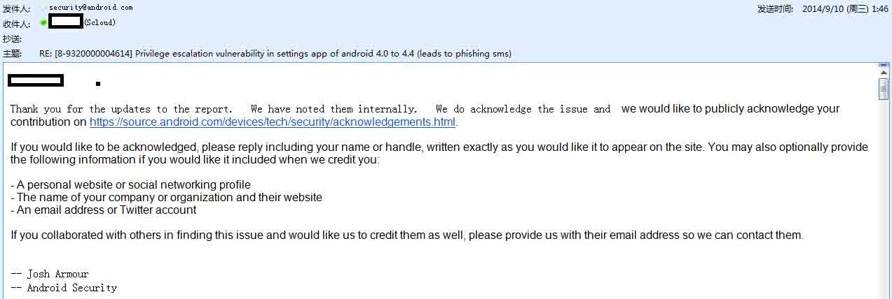
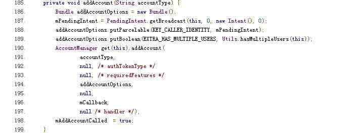
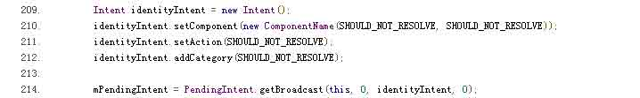
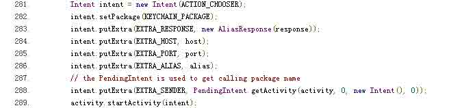

# 安卓 Bug 17356824 BroadcastAnywhere 漏洞分析

2014/11/16 15:20 | [neobyte](http://drops.wooyun.org/author/neobyte "由 neobyte 发布") | [漏洞分析](http://drops.wooyun.org/category/papers "查看 漏洞分析 中的全部文章"), [移动安全](http://drops.wooyun.org/category/mobile "查看 移动安全 中的全部文章") | 占个座先 | 捐赠作者

## 0x00 背景

* * *

2014 年 8 月，retme 分析了 Android 修复的一个漏洞，并命名为 launchAnyWhere[1](http://static.wooyun.org/drops/20141114/201411142349151600381e6491632fbf4585e026a16460987036550cb34.rar)

在调试这个漏洞的时候，我发现 Settings 应用还存在一个类似漏洞，并在 9 月报告给了 Android Security Team，标题为，Privilege escalation vulnerability in settings app of android 4.0 to 4.4 (leads to phishing sms), 并且很快得到了确认，Android 官方也给了致谢[2](http://drops.wooyun.org/wp-content/uploads/2014/11/file00013_png.jpg)：



这个漏洞的 Android ID 是 17356824，影响 4.0.1 到 4.4.4 之间的版本，时间跨度从 2011 年到 2014 年，应该说影响面非常广，根据今年 11 月 Google 的统计，这个区间的 Android 设备在全球的占比大约为 90%。


retme 给该漏洞起了一个很给力的名字 broadcastAnywhere，与 launchAnywhere 相比，这两个漏洞的相同点在于：

1.  都是利用了 addAccount 这个机制，一个恶意 app 通过注册为 account 的 authenticator 并处理某账号类型，然后发送 intent 给 settings app，让其添加该特定类型的账号。

2.  都是利用 settings 这个应用具有 SYSTEM 权限，诱使 settings 来发送一个高权限的 intent。

不同点在于：

1.  本质原理不同：一个是恶意 app 返回一个 intent 被 settings launch，另外一个是 settings 发出一个 pendingintent 给恶意 app，而恶意 app 利用 pendingintent 的特点来修改 pendingitent 的 action 与 extras，并以 settings 的身份发出。

2.  漏洞代码位置不同：一个是 accountmanger 中，一个是 settings 中

3.  后果不同：launchAnywhere 是以 system 权限启动 activity，而 broadcastAnywhere 是一个 system 权限发送 broadcast。前者往往需要界面，而后者不需要界面。

本文是对 retme 分析的一个补充，同时也给大家分享一下在挖掘这个漏洞中的一些经验，当然为了完整性，我也尽量系统地描述相关的内容。由于时间仓促，难免有遗漏与不当之处，请各位不吝指正。

## 0x01 PendingIntent 的风险

* * *

关于 PendingIntent，简单理解是一种异步发送的 intent，通常被使用在通知 Notification 的回调，短消息 SmsManager 的回调和警报器 AlarmManager 的执行等等，是一种使用非常广的机制。对 PendingIntent 的深入分析，可以参考该文【4】：

但是关于 PendingIntent 的安全意义，讨论不多，在官方的开发文档中，特别注明：【5】：

By giving a PendingIntent to another application, you are granting it the right to perform the operation you have specified as if the other application was yourself (with the same permissions and identity). As such, you should be careful about how you build the PendingIntent: almost always, for example, the base Intent you supply should have the component name explicitly set to one of your own components, to ensure it is ultimately sent there and nowhere else.

从上面的英文来看，大意是当 A 设定一个原始 Intent（base intent）并据此创建 PendingIntent，并将其交给 B 时，B 就可以以 A 的身份来执行 A 预设的操作（发送该原始 Intent），并拥有 A 同样的权限与 ID。因此，A 应当小心设置这个原始 Intent，务必具备显式的 Component，防止权限泄露。

权限泄露的风险在于，B 得到这个 PendingIntent 后，还可以对其原始 Intent 进行有限的修改，这样就可能以 A 的权限与 ID 来执行 A 未预料的操作。

但实际上，这里的限制很多，甚至有点鸡肋。因为本质上这个修改是通过 Intent.fillIn 来实现的，因此可以查看 fillin 的源码：

如下面源码所示，B 可以修改的数据可以分成两类：

1 action，category，data，clipdata，package 这些都可以修改，只要原来为空，或者开发者设置了对应的标志。

2 但 selector 与 component，不论原来是否为空，都必须由开发者设置显式的标志才能修改

```
public int fillIn(Intent other, int flags) {
    int changes = 0;
    if (other.mAction != null
            && (mAction == null || (flags&FILL_IN_ACTION) != 0)) {//当本 action 为空或者开发者设置了 FILL_IN_ACTION 标志时，可以修改 action
        mAction = other.mAction;
        changes |= FILL_IN_ACTION;
    }
    if ((other.mData != null || other.mType != null)
            && ((mData == null && mType == null)
                    || (flags&FILL_IN_DATA) != 0)) {//类似 action，需要 data 与 type 同时为空
        mData = other.mData;
        mType = other.mType;
        changes |= FILL_IN_DATA;
    }
    if (other.mCategories != null
            && (mCategories == null || (flags&FILL_IN_CATEGORIES) != 0)) {//类似 action
        if (other.mCategories != null) {
            mCategories = new ArraySet<String>(other.mCategories);
        }
        changes |= FILL_IN_CATEGORIES;
    }
    if (other.mPackage != null
            && (mPackage == null || (flags&FILL_IN_PACKAGE) != 0)) {//类似 action
        // Only do this if mSelector is not set.
        if (mSelector == null) {
            mPackage = other.mPackage;
            changes |= FILL_IN_PACKAGE;
        }
    }
    // Selector is special: it can only be set if explicitly allowed,
    // for the same reason as the component name.
    if (other.mSelector != null && (flags&FILL_IN_SELECTOR) != 0) {//必须设置了 FILL_IN_SELECTOR 才可以修改 selector
        if (mPackage == null) {//selector 与 package 是互斥的
            mSelector = new Intent(other.mSelector);
            mPackage = null;
            changes |= FILL_IN_SELECTOR;
        }
    }
    if (other.mClipData != null
            && (mClipData == null || (flags&FILL_IN_CLIP_DATA) != 0)) {//类似 action
        mClipData = other.mClipData;
        changes |= FILL_IN_CLIP_DATA;
    }
    // Component is special: it can -only- be set if explicitly allowed,
    // since otherwise the sender could force the intent somewhere the
    // originator didn't intend.
    if (other.mComponent != null && (flags&FILL_IN_COMPONENT) != 0) {//必须开发者设置 FILL_IN_COMPONENT 才可以修改 component
        mComponent = other.mComponent;
        changes |= FILL_IN_COMPONENT;
    }
    mFlags |= other.mFlags;
    if (other.mSourceBounds != null
            && (mSourceBounds == null || (flags&FILL_IN_SOURCE_BOUNDS) != 0)) {
        mSourceBounds = new Rect(other.mSourceBounds);
        changes |= FILL_IN_SOURCE_BOUNDS;
    }
    if (mExtras == null) {//Extras 数据被合并
        if (other.mExtras != null) {
            mExtras = new Bundle(other.mExtras);
        }
    } else if (other.mExtras != null) {
        try {
            Bundle newb = new Bundle(other.mExtras);
            newb.putAll(mExtras);
            mExtras = newb;
        } catch (RuntimeException e) {

```

而一般开发者都不会去显式设置这个标志（教材里没人这么教），所以通常情况下，B 无法修改原始 Intent 的 Component，而仅当原始 Intent 的 action 为空时，可以修改 action。

所以大多数情况下，PendingIntent 的安全风险主要发生在下面两个条件同时满足的场景下：

1.  构造 PendingIntent 时的原始 Intent 既没有指定 Component，也没有指定 action
2.  将 PendingIntent 泄露给第三方

原因是，如果原始 Intent 的 Component 与 action 都为空（“双无”Intent），B 就可以通过修改 action 来将 Intent 发送向那些声明了 intent filter 的组件，如果 A 是一个有高权限的 APP（如 settings 就具有 SYSTEM 权限），B 就可以以 A 的身份做很多事情。

当然上面描述的是大多数情况。一些极端的情况下，比如某些情况下 B 虽然无法修改 action 将 Intent 发送到其他组件，但依然可以放入额外的数据，如果该组件本身接收数据时未考虑周全，也是存在风险的。

## 0x02 Settings 中的 PendingIntent 漏洞

* * *

如果你阅读过 retme 关于 launchAnywhere 的分析【1】，就会了解 Settings 的 addAccount 机制：一个恶意 APP 可以注册一种独有的账号类型并成为该类型账号的认证者（Authenticator），通过发送 Intent 来促使 Settings 添加该类型账号时，Settings 将调用恶意 APP 提供的接口。而这个过程，就不幸将一个“双无”PendingIntent 发给了恶意 APP。

看看安卓 4.4.4 的 Settings 中有漏洞的源码：可见一个 mPendingIntent 是通过 new Intent()构造原始 Intent 的，所以为“双无”Intent，这个 PendingIntent 最终被通过 AccountManager.addAccount 方法传递给了恶意 APP 接口：



在 Android 5.0 的源码中，修复方法是设置了一个虚构的 Action 与 Component https://android.googlesource.com/platform/packages/apps/Settings/+/37b58a4%5E%21/#F0



最初报告这个漏洞给 Android 时，用的伪造短信的 POC，也是 retme 博客中演示的。例如可以伪造 10086 发送的短信，这与收到正常短信的表象完全一致（并非有些 APP 申请了 WRITE_SMS 权限后直接写短信数据库时无接收提示）。后来又更新了一个 Factory Reset 的 POC，可以强制无任何提示将用户手机恢复到出厂设置，清空短信与通信录等用户数据，恶意 APP 的接口代码片段如下：

```
@Override
public Bundle addAccount(AccountAuthenticatorResponse response, String accountType, String authTokenType, String[] requiredFeatures, Bundle options) throws NetworkErrorException {
//这里通过 getParcelable(“pendingintent”)就获得了 settings 传过来的“双无”PendingIntent：

  PendingIntent test = (PendingIntent)options.getParcelable("pendingIntent"); 

  Intent newIntent2 = new Intent("android.intent.action.MASTER_CLEAR");
  try {
            test.send(mContext, 0, newIntent2, null, null);
  } catch (CanceledException e) {
            // TODO Auto-generated catch block
            e.printStackTrace();
  }

```

该攻击在一些国内的主流手机中测试成功。大多数情况下，攻击是自动的，无需用户干预，过程与 launchAnywhere 类似。

有意思的是，在小米手机中，如果用户未添加小米账号，那么该攻击需要用户干预才能成功：原因是 MIUI 修改了 Settings 程序，当添加账号时，对任意账号类型，除了对应的 authenticator 外，系统还提供“小米账号”供选择，由于不是单选，系统会弹出一个对话框供用户选择：


当然如果用户已经添加了小米账号，就只剩下一个选项，攻击就无需人工干预了。这部分的具体流程可以参考 Android 源码以及 MIUI 代码中 Settings 应用的 ChooseAccountActivity.java 部分，这里不再赘述。

另外，按照 google 官方文档，一个 app 要注册成为账号的 authenticator，需要一个权限：android.permission.AUTHENTICATE_ACCOUNTS。 retme 博客中的 POC 也申请了这些权限。但实际测试中发现，这个权限可以去掉。所以这个漏洞等同于一个无任何权限 APP 的提权漏洞。

## 0x03 类似漏洞的发现

* * *

前面提到，这种漏洞大多数情况下，仅对“双无”Intent（无 Action 无 Component）构造的 PendingIntent 有效。所以我们主要关注类似的场景。

一个发现类似漏洞的简单策略如下：

第一步：在一个 method 中，如果调用了下面方法之一，那么代表创建了 PendingIntent，设定 Priority 为低：

```
static PendingIntent    getActivities(Context context, int requestCode, Intent[] intents, int flags)
static PendingIntent    getActivities(Context context, int requestCode, Intent[] intents, int flags, Bundle options)
static PendingIntent    getActivity(Context context, int requestCode, Intent intent, int flags)
static PendingIntent    getActivity(Context context, int requestCode, Intent intent, int flags, Bundle options)
static PendingIntent    getBroadcast(Context context, int requestCode, Intent intent, int flags)
static PendingIntent    getService(Context context, int requestCode, Intent intent, int flags)
public PendingIntent   createPendingResult(int requestCode, Intent data, int flags) 

```

第二步，分析该 method 中调用的方法，如果没有调用下面的方法，代表未设置 Component，将 Priority 调高到中：

```
Intent(Context packageContext, Class<?> cls)
Intent(String action, Uri uri, Context packageContext, Class<?> cls)
Intent  setClass(Context packageContext, Class<?> cls)
Intent  setClassName(Context packageContext, String className)
Intent  setClassName(String packageName, String className)
Intent  setComponent(ComponentName component)

```

第三步，再分析该 method 中调用的方法，如果没有调用下面的方法，代表未设置 action，很可能原始 intent 是“双无”intent，那么将 Priority 设置为高：

```
Intent(String action)
Intent(String action, Uri uri)
Intent  setAction(String action)

```

该策略出奇地简单，也会有一些误报。但实际执行该策略非常有效且不会有漏报。除了发现上面的 Settings 中的漏洞外，还可以发现 Android 源码（5.0 版本也未修复）其他一些类似的地方，例如：

https://android.googlesource.com/platform/frameworks/opt/telephony/+/android-5.0.0_r6/src/java/com/android/internal/telephony/gsm/GsmServiceStateTracker.java


这里，尽管普通 APP 无法访问其他 APP 的 notification，但利用 AccessiblyService 或者 NotificationListenerService，一个 APP 可能可以获取其他 notification 中的 pendingintent，导致权限泄露。

https://android.googlesource.com/platform/frameworks/base/+/android-5.0.0_r6/keystore/java/android/security/KeyChain.java



这里，由于该 PendingIntent 通过一个非显式的 Intent 发送，恶意 APP 可以劫持这个 Intent，从而导致权限泄露。

另外一种动态分析的方法是通过 dumpsys 来观察当前系统中的 PendingIntent Record，例如 5.0 修复后，观察到的 Settings 发送的 PendingIntent 有了 act 与 cmp 属性，而 5.0 之前的为空。


## 0x04 参考资料

* * *

【1】launchAnywher：http://retme.net/index.php/2014/08/20/launchAnyWhere.html

【2】安卓官方致谢：https://source.android.com/devices/tech/security/acknowledgements.html

【3】broadcastAnywhere：http://retme.net/index.php/2014/11/14/broadAnywhere-bug-17356824.html

【4】PendingIntent 的深入分析：http://my.oschina.net/youranhongcha/blog/196933

【5】官方对 PendingIntent 的解释：http://developer.android.com/reference/android/app/PendingIntent.html

版权声明：未经授权禁止转载 [neobyte](http://drops.wooyun.org/author/neobyte "由 neobyte 发布")@[乌云知识库](http://drops.wooyun.org)

分享到：

### 相关日志

*   [Android Broadcast Security](http://drops.wooyun.org/tips/4393)
*   [Denial of App – Google Bug 13416059 分析](http://drops.wooyun.org/tips/2976)
*   [Android uncovers master-key 漏洞分析](http://drops.wooyun.org/papers/219)
*   [一只 android 短信控制马的简单分析](http://drops.wooyun.org/papers/3030)
*   [Android Logcat Security](http://drops.wooyun.org/tips/3812)
*   [Android Activtity Security](http://drops.wooyun.org/tips/3936)