# DVWA 中学习 PHP 常见漏洞及修复方法

2013/08/14 11:46 | [erevus](http://drops.wooyun.org/author/erevus "由 erevus 发布") | [web 安全](http://drops.wooyun.org/category/web "查看 web 安全 中的全部文章"), [漏洞分析](http://drops.wooyun.org/category/papers "查看 漏洞分析 中的全部文章") | 占个座先 | 捐赠作者

“安全是一个整体，保证安全不在于强大的地方有多强大 而在于真正薄弱的地方在哪里”--剑心

从很多的渗透大型企业内网的案例来看，入侵者大多数是从 Web 上找到漏洞，从而利用漏洞进一步进行提权，渗透入侵。

[WooYun: 时代互联上传漏洞多台数据库可控](http://www.wooyun.org/bugs/wooyun-2013-022743)

[WooYun: 网易某系统未授权访问可导致内网被渗透](http://www.wooyun.org/bugs/wooyun-2012-09627)

[WooYun: 网易某系统未授权访问续—内网渗透](http://www.wooyun.org/bugs/wooyun-2012-09671)

[WooYun: 搜弧某分站 XFF 注射&配置不当导致源码泄漏等重大漏洞](http://www.wooyun.org/bugs/wooyun-2013-026850)

[梧桐雨的大型互联网系列](http://www.wooyun.org/whitehats/%E6%A2%A7%E6%A1%90%E9%9B%A8/page/3)

脚本安全就像你家的防盗门，你家门都没关，你家能安全吗？

乌云上最常见的脚本漏洞莫过于 SQL 注入和 XSS。

脚本安全的本质就是脚本接受了不安全的变量输入，又没得到有效的过滤，最后进入一些对敏感的函数就会对安全造成威胁。

比如出现在 mysql_query()函数可能就会造成 SQL 注入漏洞，出现在 eval()以及 preg_replace()中可能导致代码的执行。

这里我用 DVWA 演示 SQL,XSS ,任意代码执行漏洞的原理

然后用各种修复方法进行修复，附带讲解一些修复方法的弊端。

DVWA 下载地址: https://github.com/RandomStorm/DVWA/archive/v1.0.8.zip

DVWA sql 调用的文件/vulnerabilities/sqli/目录下，分为 low,medium,high 三个等级

### SQL 注入原理

```
//Low.php

if(isset($_GET['Submit'])){

    // Retrieve data

    $id = $_GET['id'];

    $getid = "SELECT first_name, last_name FROM users WHERE user_id = '$id'";//这里$id 变量没有经过任何的过滤，直接传入了 sql 语句，造成字符型注入
    $result = mysql_query($getid) or die('<pre>' . mysql_error() . '</pre>' );//执行 SQL

```

原 SQL 中

```
SELECT first_name, last_name FROM users WHERE user_id = '$id' 
```

中的$id 可被用户控制，当黑客把$id 变成

```
' union select user,password from users# 
```

那么这条语句就会变成

```
SELECT first_name, last_name FROM users WHERE user_id = '' union select user,password from users# 
```

这样导致了数据库中其他数据被黑客查询。 

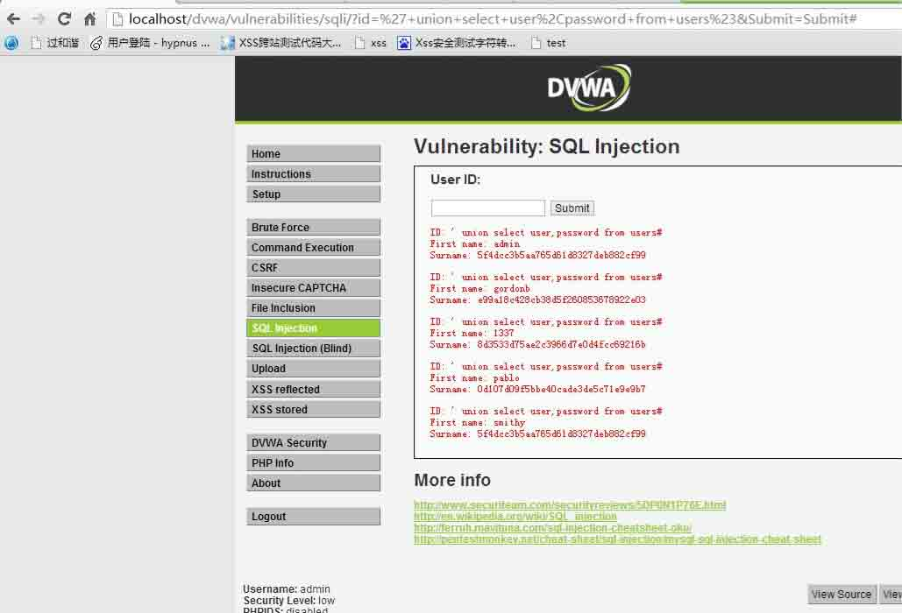

```
//medium.php 中
if (isset($_GET['Submit'])) {

    // Retrieve data

    $id = $_GET['id'];
    $id = mysql_real_escape_string($id);

    $getid = "SELECT first_name, last_name FROM users WHERE user_id = $id";

    $result = mysql_query($getid) or die('<pre>' . mysql_error() . '</pre>' );

    $num = mysql_numrows($result);

```

虽然$id 经过了 mysql_real_escape_string 转义了’，可是因为后面的 SQL 语句$id 没有单引号保护，会被系统认为是数值型，导致数值型注入

构造 SQL 注入语句

```
1 union select user,password from users 
```

SQL 语句就变成了

```
SELECT first_name, last_name FROM users WHERE user_id = 1 union select user,password from users  
```

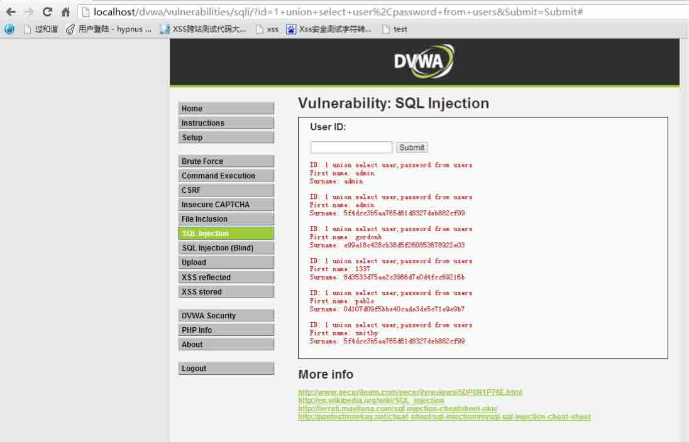

### SQL 注入修补方法

字符型注入漏洞修补方法：

PHP5.3 之前版本在 php.ini 中设置

```
magic_quotes_gpc=On; 
```

magic_quotes_quotes_gpc 会对传入的$_POST,$_GET,$_SERVER 里的 ‘,”,\进行转义。

但是 PHP5.4 之后，magic_quotes_quotes_gpc 就被废除了。

还要使用 mysql_real_escape_string()或 addslashes()对传入参数进行过滤，或者使用 str_replace()对一些关键词进行替换。

例：

```
if(isset($_GET['Submit'])){

// Retrieve data

$id = addslashes($_GET['id']);

$getid = "SELECT first_name, last_name FROM users WHERE user_id = '$id'";
$result = mysql_query($getid) or die('<pre>' . mysql_error() . '</pre>' );

$num = mysql_numrows($result);

```

### 修补后进行 SQL 注入

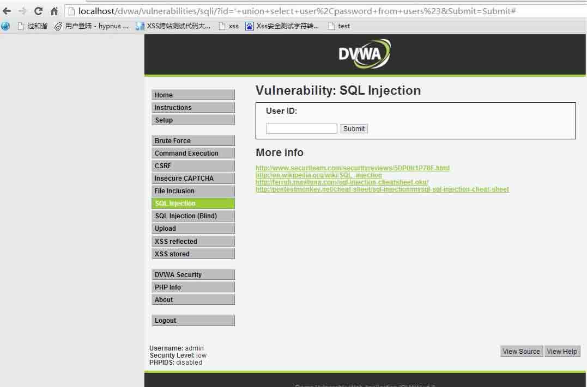

但是 addslashes()和 mysql_real_escape_string()在数据库字符集设为 GBK 时是可能被绕过的。

PHP 字符编码绕过漏洞参考文[`huaidan.org/archives/2268.html`](http://huaidan.org/archives/2268.html)

如果数据库字符集是 GBK 的情况下，可以把

```
$mysqli->query('SET NAMES gbk'); 
```

修改为：

```
$mysqli->set_charset('gbk'); 
```

数值型注入：

数值型注入比较好修补，只需要判断传入的变量是否为数值型就可以了(或者强行改成字符型)

例：

```
$id = $_GET['id'];
$id = intval ($id);

$getid = "SELECT first_name, last_name FROM users WHERE user_id = $id";

$result = mysql_query($getid) or die('<pre>' . mysql_error() . '</pre>' );

$num = mysql_numrows($result);

```

修补后效果

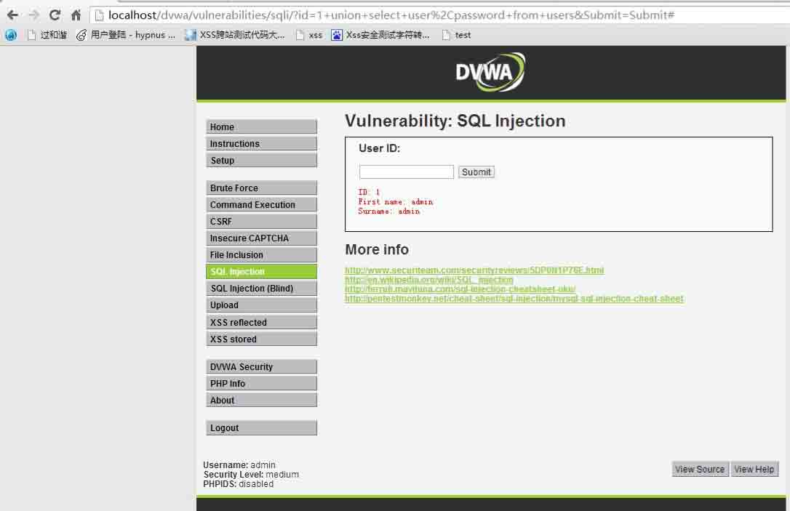

### XSS 漏洞原理

黑客往 Web 页面里插入恶意 html 代码，当用户浏览该页之时，嵌入其中 Web 里面的 html 代码会被执行，从而达到黑客的特殊目的，比如窃取用户 cookies.或者进行其他操作。 在

```
//low.php
<?php
if(isset($_POST['btnSign']))
{

   $message = trim($_POST['mtxMessage']);
   $name    = trim($_POST['txtName']);

   // Sanitize message input
   $message = stripslashes($message);//stripslashes() 函数删除由 addslashes() 函数添加的反斜杠。
   $message = mysql_real_escape_string($message);//mysql_real_escape_string() 函数转义 SQL 语句中使用的字符串中的特殊字符。

   // Sanitize name input
   $name = mysql_real_escape_string($name);

   $query = "INSERT INTO guestbook (comment,name) VALUES ('$message','$name');";

   $result = mysql_query($query) or die('<pre>' . mysql_error() . '</pre>' ); } 
?> 

```

从上面程序可以看出，$message,$name 两个变量从$_POST 传入,只是经过一些特殊字符的转换。并没有对尖括号进行转义,所以还是造成了 XSS 的产生。

直接插入 XSS 语句

```
<script>alert(1)<script> 
```

就执行了

而 medium.php 中，虽然对$message 进行了尖括号转义，而且对`<script>`进行了替换，但是$name 没有进行转义，而且跨站脚本可以用多种标签，如``,等…。Name 的`<input />`限制了 maxlength=‘10’的长度，但是我们的防御对象是精通技术的黑客。这种 html 下的长度限制是可以直接通过浏览器修改..然后通过大小写成功绕过 str_replace()，插入 XSS.

```
<SCript>alert(1)</SCript> 
```



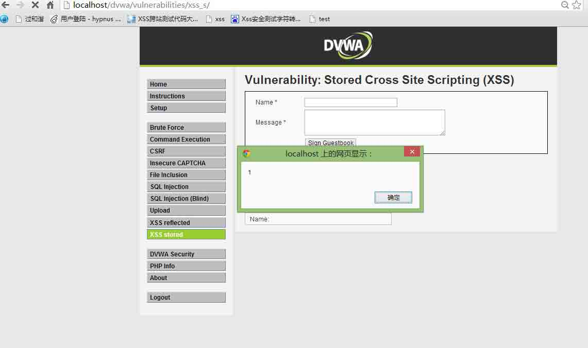

```
<?php

if(isset($_POST['btnSign']))
{

   $message = trim($_POST['mtxMessage']);
   $name    = trim($_POST['txtName']);

   // Sanitize message input
   $message = trim(strip_tags(addslashes($message)));
   $message = mysql_real_escape_string($message);
   $message = htmlspecialchars($message);

   // Sanitize name input
   $name = str_replace('<script>', '', $name);  //一个大小写就可以绕过，或者
   $name = mysql_real_escape_string($name);

   $query = "INSERT INTO guestbook (comment,name) VALUES ('$message','$name');";

   $result = mysql_query($query) or die('<pre>' . mysql_error() . '</pre>' );

}

?>

```

### XSS 漏洞修补方法

使用 htmlspecialchars()在输出时对输出内容就行转义。

瞌睡龙说：在输出时进行转义比输入时进行转义效果更好，因为可以确保数据在入库时是完整的….不然丢失数据。

例：

```
<?php

if(isset($_POST['btnSign']))
{

   $message = trim($_POST['mtxMessage']);
   $name    = trim($_POST['txtName']);

   // Sanitize message input
   $message = stripslashes($message);
   $message = mysql_real_escape_string($message);
   $message = htmlspecialchars($message);

   // Sanitize name input
   $name = stripslashes($name);
   $name = mysql_real_escape_string($name); 
   $name = htmlspecialchars($name);

   $query = "INSERT INTO guestbook (comment,name) VALUES ('$message','$name');";

   $result = mysql_query($query) or die('<pre>' . mysql_error() . '</pre>' );

}

?>

```

修补后效果，可以看到尖括号已经被转义了，html 代码已经不执行

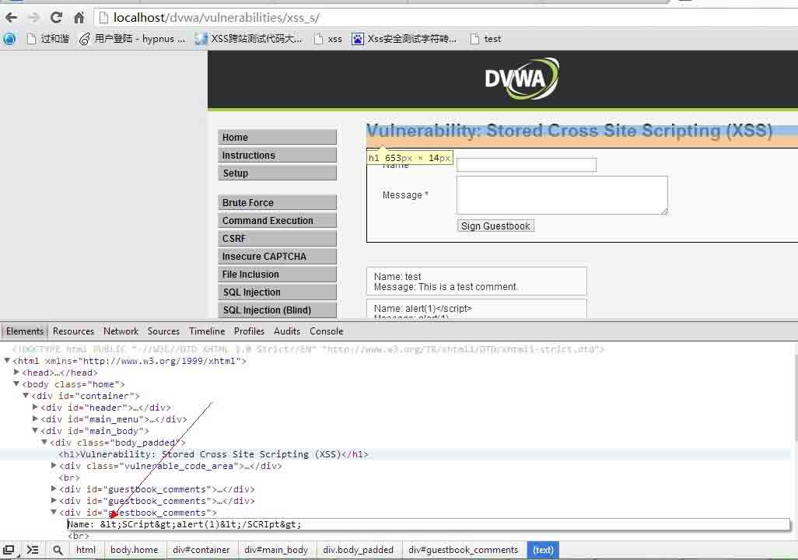

### 任意命令执行漏洞原理

任意命令执行可谓是 web 里最高危的漏洞了，有可能可以直接写下 shell 或者直接添加用户。

任意命令执行漏洞的产生大多是因为变量可以被用户输入控制，而没有经过任何的判断和过滤处理就进入了高危的函数。

```
<?php

if( isset( $_POST[ 'submit' ] ) ) {

    $target = $_REQUEST[ 'ip' ];

    // Determine OS and execute the ping command.
    if (stristr(php_uname('s'), 'Windows NT')) { 

        $cmd = shell_exec( 'ping  ' . $target );
        $html .= '<pre>'.$cmd.'</pre>';

    } else { 

        $cmd = shell_exec( 'ping  -c 3 ' . $target );
        $html .= '

  <pre>'.$cmd.'</pre>';

    }

}
?>

```

由于$target 没有经过处理就进入 shell_exec 函数，导致黑客可以构造特殊的变量执行批处理命令。

我输入可 0 | dir

那么执行的命令的命令就是 ping -c 0 | dir

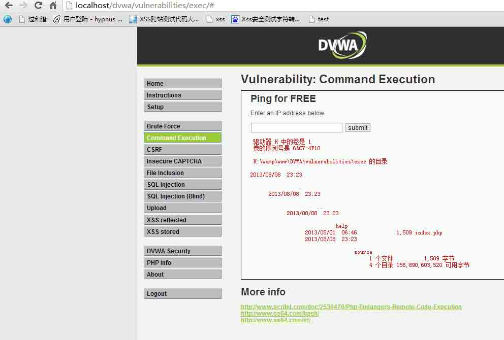

假如黑客在利用时输入的是

```
0|net user hacker/add 
```

那么造成的后果将不堪设想

以下是可能会造成任意命令执行的函数

```
system|passthru|exec|popen|proc_open|move_uploaded_file|eval|copy|shell_exec|assert 
```

### 任意命令执行漏洞修补办法

在写程序时尽量地使变量不能被用户所控制！且注意变量初始化的问题。

使用 str_replace 对“%”，”|”,“>”进行替换

进入函数前判断变量是否合法。

### 暴力破解漏洞

这个是漏洞？算是吧…

祭上神器 Burp Suite，Burp suite 运行后，Burp suite,Proxy 开起默认的 8080 端口作为本地代理接口。

使用 Burp suite 通过置一个 web 浏览器使用其代理服务器，见下图  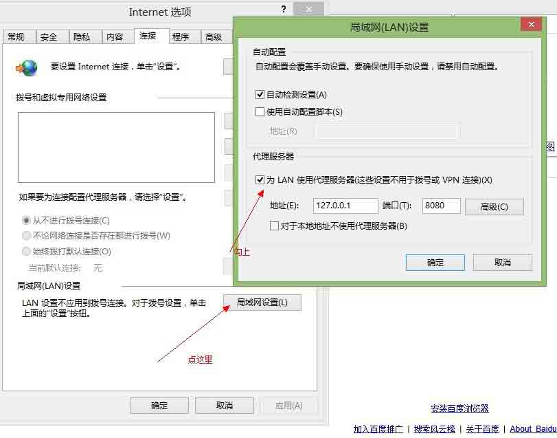

然后打开你要暴力破解的后台，随便输入一个账号密码…把抓到的包 send to intruder  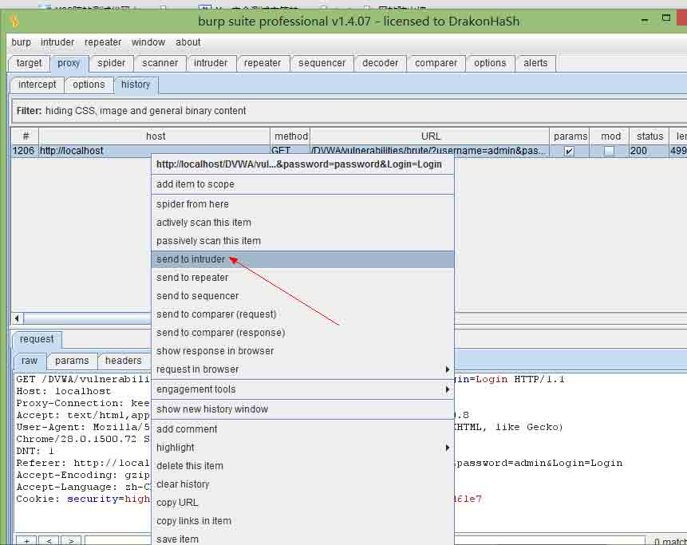

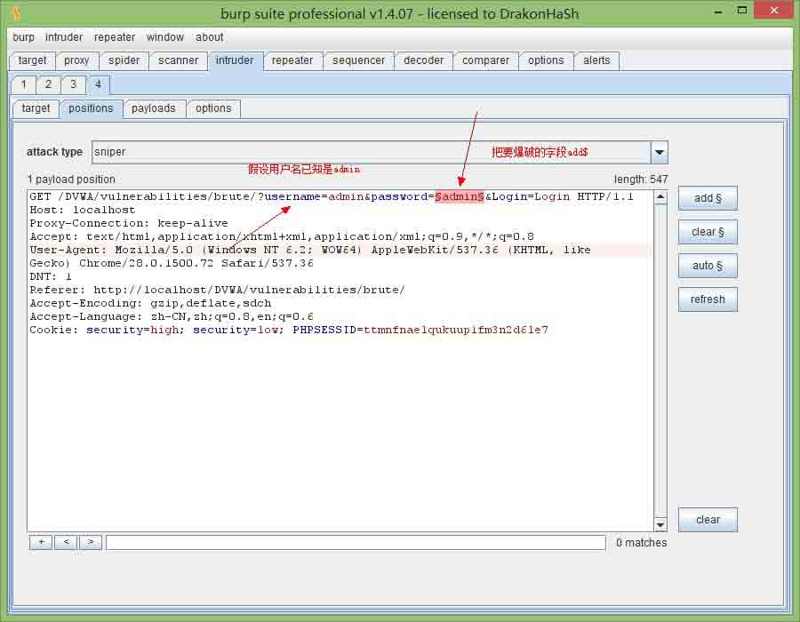

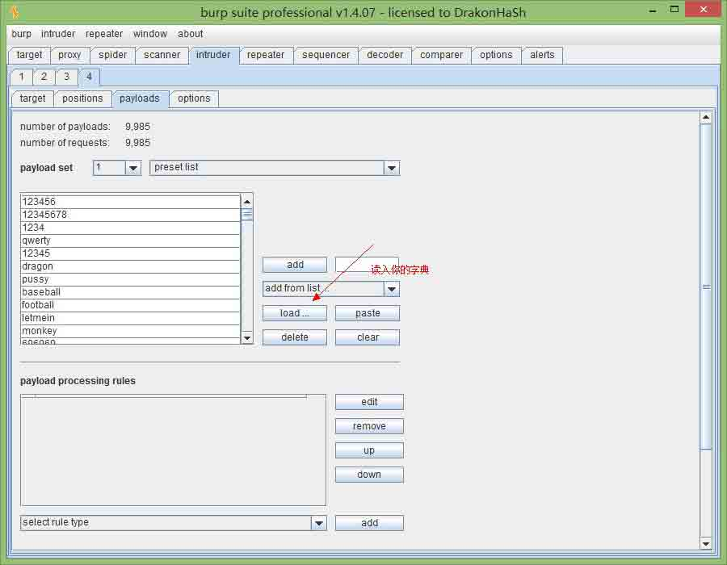

Start attack~~~

然后就对面返回包的大小，知道密码

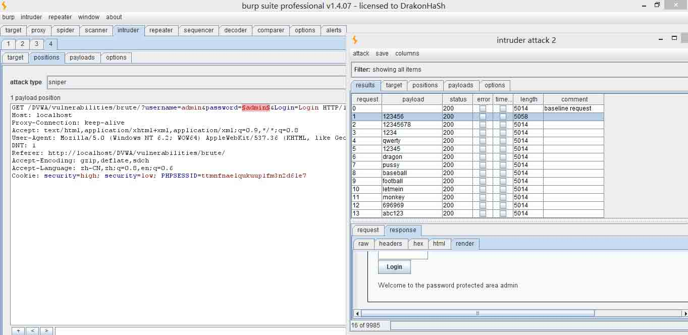

### 暴力破解漏洞修补方法

加个 google 验证码，保证没有程序能识别出来…

### 文件包含漏洞

文件包含漏洞分为两种，一种是远程包含，一种是本地包含。

服务器通过 php 的特性（函数）去包含任意文件时，由于要包含的这个文件来源过滤不严，从而可去调用并执行一个文(木)件(马)，而我们可以构造这个文(木)件(马)来达到邪恶的目的。

涉及到的危险函数，include(),require()和 include_once(),require_once()

现在远程包含的漏洞已经不多了，但是远程包含的危害是最大，相当于一个命令执行。

而本地包含，有时配合一下解析漏洞往往可以 getshell.

例：

```
<?php 

    $file = $_GET['page']; //The page we wish to display  

?>

```

Include.php 内容：

```
<?php 
echo "hello world\n";
?>

```

### 总结

在编写程序时，应有良好的代码习惯，如使用变量前初始化。

做安全的过滤在全局里做，或者写在类里。

不要相信数据，所有输入在得到证明之前都是不可信的，所有从用户上输入的数据都应该加以判断。

不返回过多错误的原因，如一个黑客进行 sql 注入。

多上 wooyun 看漏洞

**Tags:** [php](http://drops.wooyun.org/tag/php), [白盒](http://drops.wooyun.org/tag/%e7%99%bd%e7%9b%92)

版权声明：未经授权禁止转载 [erevus](http://drops.wooyun.org/author/erevus "由 erevus 发布")@[乌云知识库](http://drops.wooyun.org)

分享到：

### 相关日志

*   [[代码审计]web 程序对客户端数据加解密带来的安全问题](http://drops.wooyun.org/papers/506)
*   [几种通用防注入程序绕过方法](http://drops.wooyun.org/papers/353)
*   [PHP 非字母数字の代码](http://drops.wooyun.org/tips/508)
*   [PHP 安全编码](http://drops.wooyun.org/tips/135)
*   [攻击 JavaWeb 应用[4]-SQL 注入[2]](http://drops.wooyun.org/tips/288)
*   [Webscan360 的防御与绕过](http://drops.wooyun.org/tips/3790)