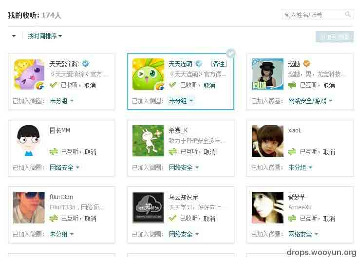
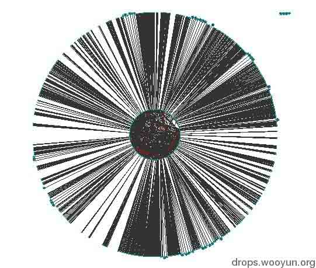
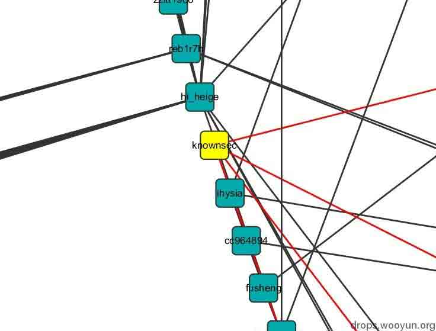
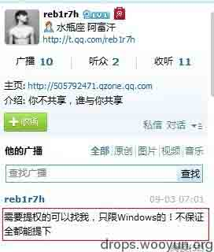
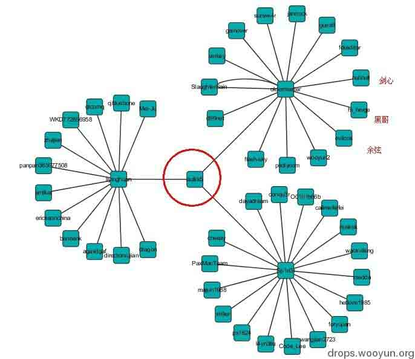
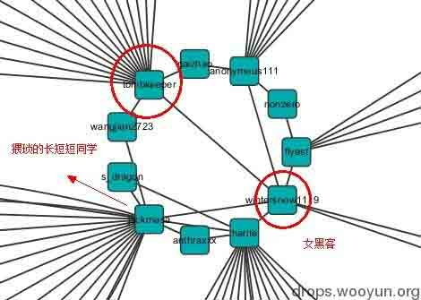
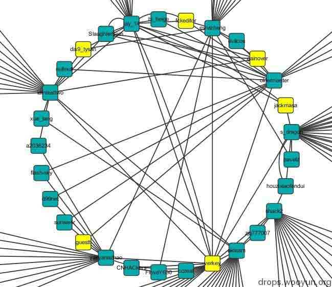
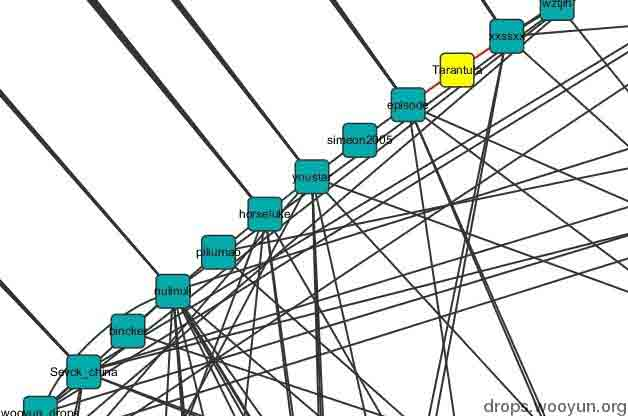

# 安全圈有多大？也许就这么大！

2013/09/06 13:26 | [gainover](http://drops.wooyun.org/author/gainover "由 gainover 发布")   | [业界资讯](http://drops.wooyun.org/category/news "查看 业界资讯 中的全部文章"), [运维安全](http://drops.wooyun.org/category/%e8%bf%90%e7%bb%b4%e5%ae%89%e5%85%a8 "查看 运维安全 中的全部文章")  | 占个座先  | 捐赠作者

经常听到“搞安全的圈子”这个词，那么安全的这个圈子有多大呢？哪些人是活跃在线上，正在搞安全的呢？ 笔者也想知道这个问题的答案，于是做了点有意思的小测试，写下本文。

（注：本文中所指的圈子，仅仅是指那些活跃在线上的安全人员，不包括什么相关部门的隐世高手或者是地下市场的各类大牛）

## 测试流程

* * *

1.  以我自己的腾讯微博【我收听的人】作为起点，收集【第一页】的人。注意：***只收集了第一页***，大约 30 人（有一些官方的游戏帐号，例如：天天爱消除）。

1.  再以这些人为起点，继续搜集他们所收听的【第一页】的人。

2.  以上过程中，我们需要记录的有 2 类数据。（1）用户 ID 及昵称；（2）收听 ID 与被收听 ID

3.  编写 perl 脚本将以上过程自动化，将爬取结果存入 sqlite 数据库中。

4.  一段时间后，觉得数据差不多了，CTRL+C 终止了爬取过程。得到了 2576 个微博 ID 和 3410 个微博收听关系。

5.  由于微博 ID 中有些帐号是官方帐号，例如：t（腾讯薇薇）， 或者是业界大佬，例如：pony（麻花疼），当然还有一些著名公知、游戏宣传 ID 等。均被剔出上述结果。最终，我们可以得到 2209 个微博 ID。

6.  从 sqlite 中导出剔除知名 ID 后的用户关系数据。使用 cytoscape 软件进行简单的分析。

## 测试结果

* * *

### 1\. 内外两大圈！

将网络关系通过 yFiles 的 circular layout 进行展示，我们可以得到内外两大圈，如下图：

放大显示，我们可以发现，在内圈上，基本都是活跃在安全圈子的人，比如，黑哥。如下图：

至于其它的 ID 是不是，大家可以去查下上图这几个微博 ID。 例如上图中 reb1r7h 这个 ID，很陌生对吧，我也没见过，但是我们查看一下他微博内容，会发现他确实是与安全有关的，如下图：

### 2\. 当然，上图只是截了一个角落，为了进一步看看，这个“内圈”到底覆盖程度如何？我们来搜索下我们经常能见到的 ID。

@axis ，微博 ID：aullik5，为了方便显示，我们选取与 aullik5 相关的结点及二级结点，可以得到下图：

前些天，看到 tombkeeper 在微博上推荐台湾女黑客（微博 ID：wintersnow1119），我们会发现，这位女黑客也在我们的圈子里。同样将数据独立显示出来。

我们好像发现了什么：@sogili 这个猥琐的娃子，也关注了女黑阔！！

以我们团队为例，以平时低调的 verkey 为入口，展现二级结点数据。可以发现我们团队的人员就全部出现在内部小圈子上了。

最后，我在看剑心这个结点的时候，附近还看见了一个很陌生，但是读起来很好听的单词。tarantula！

查了下，原来是。。。（哈哈，是她，是她，就是她，你们自己查去！）

### 3\. 最终，我们手上就有了一份安全人员的大名单。

## 总结

* * *

我仅仅只采集了用户【收听的人】，而没有采集用户的【粉丝】。因为微博上名人经常被收听，而这些名人的粉丝数目众多，如果采集粉丝，当遇到名人时，采集器就会陷入名人不能自拔。当然可以通过黑名单的方式来排除名人，但是我们想要搜集这份黑名单几乎是不可能的。同时，用户【收听的人】价值明显高于【粉丝】，得到的关系结果更为真实。

我们的起点是很小的，在我自己的收听名单第一页中，人数是非常有限的，但是最终收获的名单是挺全面的，这说明这种采集方法还是十分有效果的。

安全圈有多大？也许就这么大？

版权声明：未经授权禁止转载 [gainover](http://drops.wooyun.org/author/gainover "由 gainover 发布")@[乌云知识库](http://drops.wooyun.org)

分享到：

### 相关日志

*   [通过伪造乌克兰相关文件进行传播的恶意软件 MiniDuke](http://drops.wooyun.org/news/1373)
*   [一起针对国内企业 OA 系统精心策划的大规模钓鱼攻击事件](http://drops.wooyun.org/tips/2562)
*   [马航 MH370 航班被黑了？](http://drops.wooyun.org/news/1202)
*   [Angry Birds 和广告系统泄露个人信息——FireEye 对 Angry Birds 的分析](http://drops.wooyun.org/news/1408)
*   [chrome 33 中修复了 4 个 Pwn2Own 大会上发现的漏洞](http://drops.wooyun.org/news/1205)
*   [网络安全威胁周报——第 201411 期](http://drops.wooyun.org/news/1195)