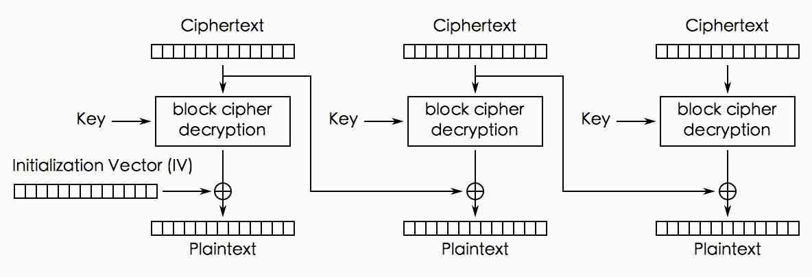

# CVE-2014-3566 SSLv3 POODLE 原理分析

2014/10/15 14:11 | [insight-labs](http://drops.wooyun.org/author/insight-labs "由 insight-labs 发布")   | [漏洞分析](http://drops.wooyun.org/category/papers "查看 漏洞分析 中的全部文章")  | 占个座先  | 捐赠作者

## 0x00 背景

* * *

POODLE 攻击是针对 SSLv3 中 CBC 模式加密算法的一种 padding oracle 攻击。这个攻击方式和之前的 BEAST 攻击方式很像，可以让攻击者获取 SSL 通信中的部分信息的明文，比如 cookie。和 BEAST 不同的是，它不需要对明文内容的完全控制，所以操作起来更加贴近实战。

从根本上说，这是 SSL 设计上的问题，就像 [Lucky13](http://www.isg.rhul.ac.uk/tls/Lucky13.html) 和 [Vaudenay's two atacks](http://www.thoughtcrime.org/blog/the-cryptographic-doom-principle/) 这些漏洞里面描述的一样，SSL 的加密和认证过程搞反了，SSL 先进行认证之后再加密。

## 0x01 细节

* * *

首先考虑这个明文 HTTP 请求, 我把它分成了 8 字节的块，就像 3DES 加密，但是这个方法对 16 字节的 AES 块加密一样适用:


最后一个块里包含了 7 个字节的填充(padding),用·来表示，最后一个字节 7 是填充长度，我用了虚构的 8 字节 MAC 校验码。在传输前，这些数据都会被 3DES 或者 AES 加密。现在来回顾下 CBC 解密的过程，这张图来自 wikipedia:



攻击者可以控制 HTTP 请求中的路径和主体，从而让请求的内容满足如下条件:

```
后面的 padding 填充部分填充了一整个 block
cookie 的第一个字节正好在某个块的末尾的字节 
```

攻击者需要做的是把包含 cookie 第一个字节(出现在这个块的末尾，例如块中的内容是 Cookie:a，a 正好在 8 字节块的末尾)的那个块,替换 padding 的那个块发送给接收者(服务器)。

一般来说，服务器会拒绝这段密文，因为 CBC 校验失败了，攻击者需要重新发送，平均来说，每 256 个请求中有一个会被服务器接受，只要服务器接受了，根据 CBC 的解密过程，攻击者就知道了 cookie 的第一个字节(明文)的和上一个块最后一个字节的密文 XOR 后是 7 或者 15(分别对应块长度 8 或 16)。

作为中间人，我们可以看到任何一段密文，所以

```
P XOR K = C
C XOR K = P 
```

三个变量我们只要知道了两个就可以解密出另一个，所以 Cookie 第一字节 XOR 密文最后一个字节 = 15

我们只要把 15 XOR 密文最后一个字节就知道了 cookie 的第一个字节。

因为可以解密的窗口大小只有 1 字节(前面任意一个块的最后一个字节)，所以需要通过 js 控制 HTTP 请求路径的长度，比如 GET/, GET /A, GET /AA...把需要解密的 cookie 的位置逐渐顶到解密窗口中，每次解密一个字节平均需要 256 次请求，攻击者就可以用 256*n 次构造的请求来解密 SSLv3 中任意位置的明文。

这个漏洞的主要成因是因为 SSLv3 没有规定 padding 填充块字节的内容，只校验填充块最后一个字节，因为 TLS 会检查填充块的内容所以在 TLS 上同样的攻击方式成功率只有 2^-64 或者 2^-128。

## 0x02 解决方式

* * *

把 SSLv3 关了，SSLv3 已经过期用了 15 年了。

参考： [`www.imperialviolet.org/2014/10/14/poodle.html`](https://www.imperialviolet.org/2014/10/14/poodle.html) [`www.openssl.org/~bodo/ssl-poodle.pdf`](https://www.openssl.org/~bodo/ssl-poodle.pdf)

版权声明：未经授权禁止转载 [insight-labs](http://drops.wooyun.org/author/insight-labs "由 insight-labs 发布")@[乌云知识库](http://drops.wooyun.org)

分享到：

### 相关日志

*   [Laravel cookie 伪造,解密,和远程命令执行](http://drops.wooyun.org/papers/1515)
*   [CVE-2014-3393 详细分析与复现](http://drops.wooyun.org/papers/3451)
*   [Codeigniter 利用加密 Key（密钥）的对象注入漏洞](http://drops.wooyun.org/papers/1449)
*   [Windows 平台下的堆溢出利用技术（二）（上篇）](http://drops.wooyun.org/papers/1714)
*   [弱随机化种子漏洞科普](http://drops.wooyun.org/papers/1419)
*   [Internet Explorer EPM 沙盒跳出漏洞的分析（CVE-2014-6350）](http://drops.wooyun.org/papers/4162)