# QR 二维码的攻击方法与防御

2013/07/03 18:59 | [Blackeagle](http://drops.wooyun.org/author/Blackeagle "由 Blackeagle 发布") | [技术分享](http://drops.wooyun.org/category/tips "查看 技术分享 中的全部文章") | 占个座先 | 捐赠作者

QR 二维码(Quick Response Code)是由日本丰田子公司 Denso Wave 于 1994 年发明并开始使用的一种矩阵二维码符号。与条形码相比，它具有明显的优势：条形码最多只能存储 20 位，但 QR 码可以存储 7089 个字符；携带相同的信息量，QR 只需要条形码 1/10 的空间。QR 码最初用于在汽车制造业中追踪部件，之后被广泛应用到其它行业尤其是电信行业。随着智能手机的普及，QR 码成为了一个快速、高效的 URL 连接器，被称为移动互联网的“入口”。用户通过扫描 QR 码，能够快速链接到指定网站，并进行软件下载、新闻阅览、广告推广服务等。另外，QR 码也逐渐在广内超市中使用，通过扫描 QR 码可查询到相关产品的产地介绍、营业执照、自产自销证明等信息。QR 码不仅信息容量大、可靠性高、成本低，还可表示汉字及图像等多种文字信息、其保密防伪性强而且使用非常方便。因此，很快就在日韩地区得到迅速普及，发展到后来，欧美国家也开始大量使用。

但是，现阶段 QR 码的使用和推广存在一个问题，即现有的 QR 码不能有效地抵抗二维码伪造和篡改攻击，这是一个目前亟待解决的问题。

### 1、QR 码简介

* * *

#### 1.1 QR 码的结构

每个 QR 码由寻景图案、校准图案、定位图案等功能图案和编码区域构成，其中功能图形不用于数据编码。图 1 为 QR 码符号的结构，图 2 为笔者个人的 QR 二维码结构图。

图 1

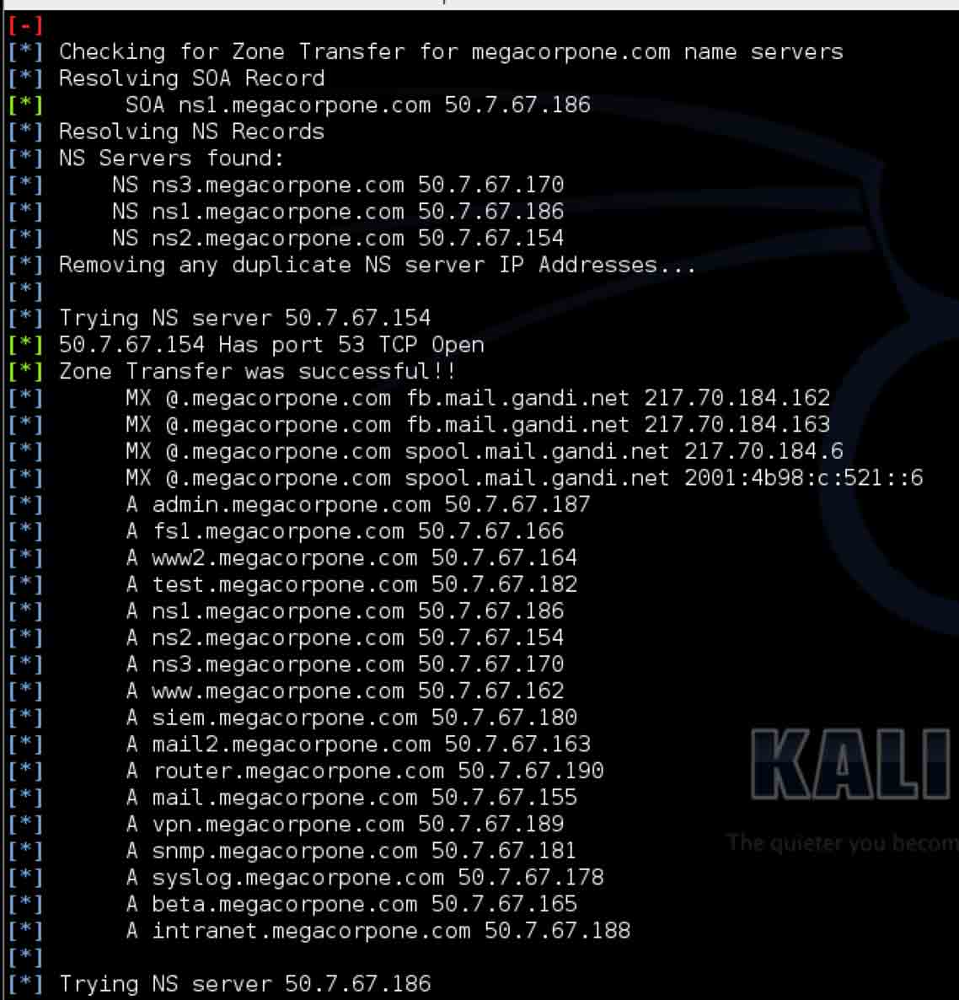 

图 2

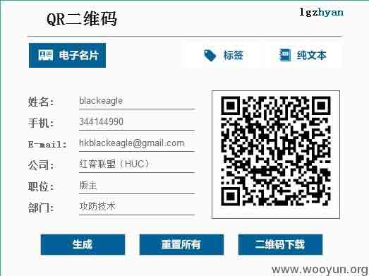 

图 3：生成器生成页面

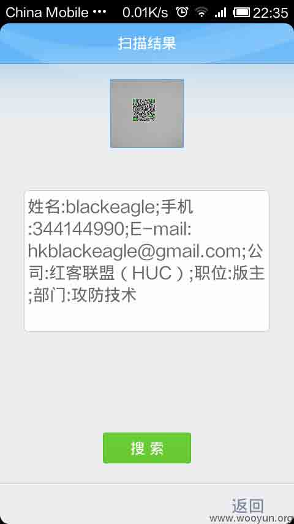 

图 4：二维码扫描结果

PS：笔者这里推荐一个个人认为不错的 QR 二维码在线生成网站[`goqr.me`](http://goqr.me)

QR 码符号共有 40 种规格，分别为版本 1、版本 2、…、版本 40。版本 1 的规格为 21 模块×21 模块，版本 2 为 25 模块×25 模块。以此类推，每一个版本符号比前一个版本每边增加 4 个模块，直到版本 40，规格为 177 模块×177 模块。以下图分别为版本 1，2，6，7，14，21 和 40 的符号结构。

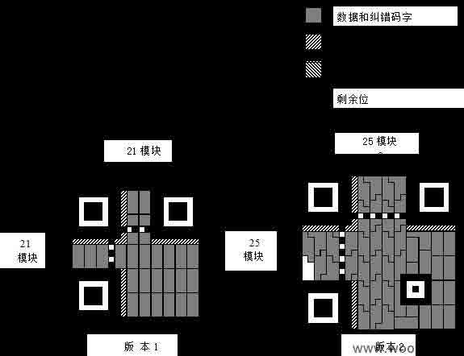

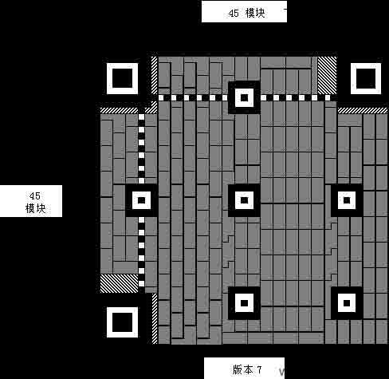  

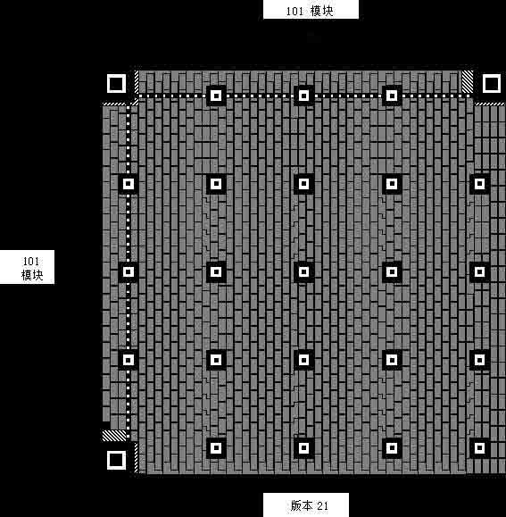 

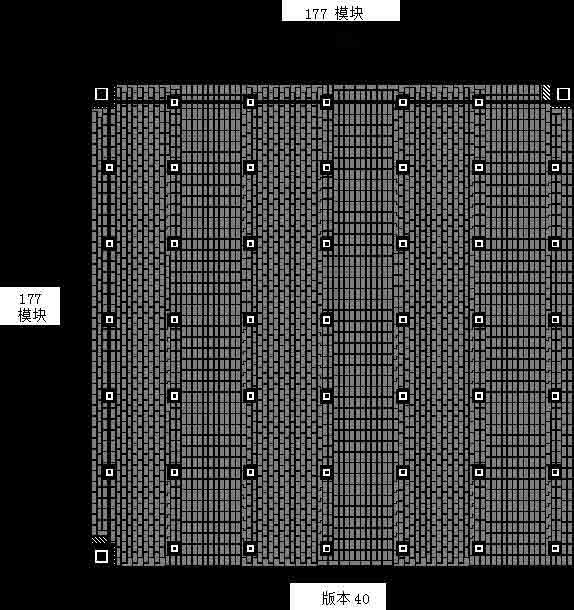 

download：快速响应矩阵码

[`pan.baidu.com/share/link?shareid=187771801&uk=3726153663`](http://pan.baidu.com/share/link?shareid=187771801&uk=3726153663)

寻景图案（Finder Pattern）：寻景图案分别位于 QR 符号的左上角、右上角、左下角，如图 5 所示。每个寻景图案是由 3 个黑白相间的正方形图案嵌套组成。其用途是帮助 QR 编解码软件定位 QR 码，在寻景图案对齐之后，就可确认码的位置、尺寸和角度。

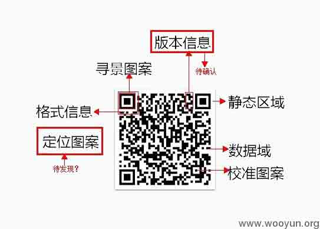 

图 5：笔者 QR 二维码结构分析

校准图案（Alignment Pattern）：校准图案首先识别校准图案的中心坐标，然后再纠正 QR 码的非线性扭曲。为了达到这个目的，在校准图案中加了黑色的隔离单元，使其更加易于检测到校准图案的中心坐标。（大家在扫微信二维码的时候可以注意观察一下）

定位图案（Timing Pattern）：定位图案在垂直和水平方向进行对齐，其用于识别 QR 码中的的每个单元的中心坐标，使得黑色和白色图案分别对应。在二维码出现扭曲时，这个定位图案用于纠正单元中的中心坐标。

静态区域（Quiet Zone）：为使 QR 解码器更易读取数据，QR 码预留了空白的页边，称为静态区域。静态区域具有四个或者更多的单元。

数据域（Data Area）：有效数据被存储在 QR 的数据区。在编码中，数据被编码成二进制的“1”和“0”，并分别代表白色和黑色模块。数据区将 Reed-Solomon 码与存储数据合并，并且具有纠错功能。

#### 1.2 QR 码主要编解码过程

为了更好地阐述 QR 码的攻击方式，本文将主要论述 QR 码的编码，解码则为其逆过程。

```
步骤 1：分析原始数据，确定数据类型，根据类型选择编码效率最高的编码模式；  
步骤 2：根据步骤 1 得到的编码模式，将数据字节转换为二进制位流；  
步骤 3：采用纠错码技术生成相应的纠错码（例如，BCH 纠错码），如果数据较大，首先对数据进行分块，然后生成每个数据块的纠错码，按照分块顺序合并作为最终的纠错码；  
步骤 4：组合数据码字和纠错码字，构成最终的数据码字。  
步骤 5：根据需求添加相应的版本、格式、定位等结构，并根据定义好的规则在矩阵中布置模块；  
步骤 6：使用不同的掩模图形对编码区进行掩模处理（功能模块不进行掩模），评价掩模结果，选择评估结果最好的进行掩模。 
```

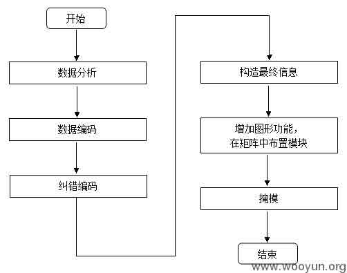 

图 6：QR 码的编码过程

### 2、攻击 QR 码的方式

* * *

      2011 年 9 月，卡巴斯基实验室检测到了全球第一起恶意的 QR 码攻击。其具体过程是：用户扫面包含有网页地址链接的 QR 码，当用户登录此网站后，手机在用户不知情的情况下自动下载恶意软件。2012 年起，利用 QR 码对手机恶意扣费的新闻在国内被报道。目前常用的攻击方式还是仅限于利用 QR 码指向恶意网站扣费或者下载病毒软件。但是鉴于对 QR 码的特性以及目前缺乏统一的管理制度，攻击 QR 码的方式将会呈现多样化。

      下面首先给出在实际应用中篡改 QR 码的一种方法：假设攻击者利用随身携带的黑笔，根据一下方法， 涂改原始 QR 码上白色模块部分。用户在扫描 QR 码后，解码器会自动纠错成不同的 URL 地址，实现 QR 码篡改。其次提出具体应用场景下潜在的攻击方式，最后针对具体攻击提出抵御方法。

#### 2.1 一种篡改 QR 码信息的具体方法

```
（1）扫描原始 QR 码（Q0）解码得到相应的 M0。我们架设 M0 是指向网站的 URL；  
（2）编写与 M0 相近的 URL 地址信息 Mi，i=1，2，……n，Mi 是 n 个指向钓鱼网站的 URL；  
（3）编码与 Mi 对应的 QR 码 Qi，i=1，2，……n。新的 QR 码要使用与原始 QR 码相同的版本和掩模方式。  
（4）计算 QR 码 Qi 与 Q0 在相同位置但不同颜色的模块个数 Di，Di=Q0△Qi，i=1，2……n；  
（5）计算 Qi 中为黑色模块而在 Q0 中相同位置为白色模块的比例 ri；  
（6）根据 ri 比例降序排列，排除需要修改的黑色模块比白色模块高的 QR 码；  
（7）从第一个 QR 码 Qi 开始，比较 Q0，Qi 不同颜色的模块，对照 Qi，将 Q0 白色部分涂改成黑色，当 b+1 次涂改后（b 为 BCH 编码所能纠错的最大值）开始核对是否可以正常解码，且解码信息不同于 M0。重复操作找到 Q’i 后解码成 Mi≠M0。 
```

在（2）中，我们伪造相近的 URL 地址是为了尽可能地混淆用户，将钓鱼网址误认为是合法网址。另外，还需保证相近的 URL 地址未被注册使用。

在（4）和（5）中，通过异或函数来计算对称差分，即在计算过程中 1 表示黑色模块，0 表示白色模块。RX 表示需要从白色转变成黑色的元素。

#### 2.2 具体应用场景下的攻击方式

根据 QR 软件的特性，我们将不同场景的攻击类型归纳概括为基于人机交互的攻击和自动化攻击。

##### 2.2.1 基于人机交互的攻击

（1）网络钓鱼

网站地址（URL）被编成 QR 二维码，有些网站将网站登录的 URL 存储在 QR 码上。攻击者用伪造的 QR 码替换合法的 QR 码，篡改登录网站的 URL 信息，将用户导向一个假冒的登录页面。在这种情况下，用户扫描 QR 码后，访问了伪造的登陆页面，将个人信息泄露给了攻击者。

比如我将某钓鱼程序挂在博客上，然后生成一个 QR 二维码，然后贴在网上，并写一些诱惑性的语言，实行钓鱼。

（2）传播恶意软件

攻击者将指向自动下载恶意软件网址的命令编码到 QR 码中。在这种情况下，攻击者可以将病毒、木马、蠕虫或者间谍软件植入到用户系统中。这些 QR 码指向了自动下载木马程序的网站，木马通过发送短信订阅收费的增至栏目。

（3）隐私信息泄漏

某些信息只希望被特定的接收对象接收，而不是对所有人都可见。直接使用 QR 码会造成信息的泄漏，例如火车票上的二维码会泄漏身份信息。

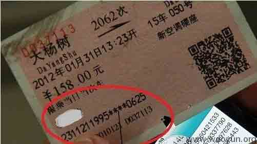 

图 7：网上找的一张火车票

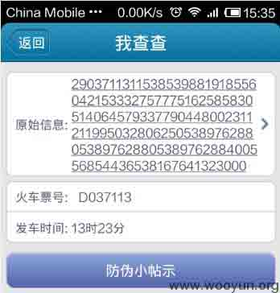 

图 8：我查查扫描 QR 二维码 1

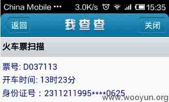 

图 9：我查查扫描 QR 二维码 2

如图 7、9 所示，身份证号是 2311211995***|*0625，在我查查上直接可以查到身份证号为 231121199503280625。以及票号和发车时间，最后通过网络查询个人信息（图 10）：

图 10：从二维码得到的身份证信息

注：因为此信息已经被公开 所以也不在乎这一张图了

随即笔者问朋友要了一张高铁票（2013 年的）用我查查软件扫描，没有结果。

这里还涉及到一个问题，因为扫的都是用过的票，考虑到时间戳的问题，如果是新票，会有什么结果呢？还待有机会测试。

（4）中间人攻击

目前在国内，将 QR 码应用在电子票务中已逐渐发展成趋势。例如，用户通过网上支付购买火车票，服务器根据用户提供信息发放 QR 码到用户手机。虽然目前提出了时间戳技术，保证票据一次性使用，但是并不能抵抗中间人攻击，具体流程见下图所示：

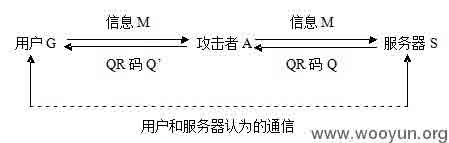 

图 11：用户和服务器认为的通信

假设用户购买电子票据所需信息 M 发送给服务器 S，但是消息被攻击者 A 拦截下来，攻击者将发送信息 M 拷贝并转发给 S，S 处理后将有效的 QR 码信息 Q 回复给 A，A 获得消息后将错误的 Q’信息发送给 M。而用户和服务器两端则认为在对方直接通话，但事实上整个过程已经攻击者控制。特别是在用户随意使用未知来源的无线接入点时，这种攻击更易实现。

##### 2.2.2 自动化攻击

将 QR 码和常见的 Web 攻击结合到一起，可能形成自动攻击方式。

（1）SQL 注入

试想这样的应用环境，QR 码解码器是链接到数据库中，并且 QR 码是用于执行查询后端数据库。在这种情形下，如果 QR 码包含了像“1”OR“1=1”等查询信息，读取器在没有核对此信息是否合法授权时便执行查询命令，导致信息泄漏给非法授权的攻击者。尽管 QR 码目前为止没有被用于数据库查询，但是如果此应用方式在未来被实现的话，针对这种情形的 QR 攻击就很可能存在。现在，谷歌公司正在进行利用 QR 码登录到谷歌账户的实验，用户通过扫描 QR 码导向一个谷歌账户登录页面。腾讯 aq.qq.com 里已经用到 QR 二维码扫描技术，即“安全扫一扫”功能。

图 12：QQ 安全中心安全扫一扫

（2）基于浏览器开发和跨站脚本攻击

QR 码可能用于执行基于网络和跨站脚本攻击。我们知道，QR 码可以包含 URL 信息。假设编码 URL 包含了警告信息，这个信息包含了对网络浏览器的开发。在此情形下，当对方访问了 URL 并解码后，系统会执行或者破坏浏览器和设备的警告信息。

（3）命令注入

假设 QR 码被用做命令行参数。攻击者将 QR 码篡改成在系统中可以任意执行的命令。在这种情况下，攻击者可以安装隐匿程序、间谍软件，发动拒绝服务攻击。

### 3、防御方式

* * *

本节将抵御 QR 码攻击的方法分为两大类：对现有的 QR 码编解码的改进和引入第三方。

#### 3.1 QR 码编解码方式的改进

针对 QR 码伪造的问题，可使用常用的加密方法和消息鉴别码的方法，在原有的二维码编码解码时加入加密和解密的环节。以非对称加密为例，假设原始信息为 M0，发行方的私钥为 Kr，公钥为 KU，则 M’=EKr(M)。将 M’信息使用 QR 编码器编码，将生成后的二维码和公钥刊登在印刷品上，用户扫描 QR 码时输入公钥 KU，若能解码得到正确可读的信息，则说明扫描的 QR 码来源可靠。非对称加密方式不仅能够抵抗上树应用场景的攻击，还能够抵抗大部分针对 QR 码信息的篡改行为。另一种简化方式是在 QR 码中加入加密后的 hash 值模块，解码时，解码器解密 hash 值并比对是否与原 QR 码信息匹配，如果 7 所示。而抵挡 QR 码的泄漏可采用对称加密的方法，加密后的 QR 码只有密钥持有人才能正常解码，特对对象可以正常使用 QR 码，比如火车票上的二维码。

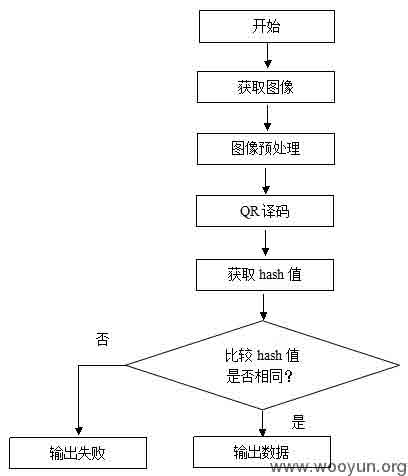 

图 13：加入 hash 值的解码流程图

#### 3.2 引入第三方统一管理

QR 码使用范围广泛，但是不同用途的 QR 码缺乏对应的编码标准，也缺少第三方的管理和认证，导致了 QR 码市场的混乱。引入第三方管理和认证，能够有效拦截 QR 码携带的恶意网址和虚假信息；提供认证机制，可以增加其来源的可靠性。本节提出了在第三方存在的情况下有效避免 QR 码链接到恶意网址的方法（如图 13），具体步骤如下：

```
（1）用户手机读取 QR 码信息链接第三方服务器；  
（2）第三方服务器以 QR 码中的码号信息索引查询数据库；  
（3）数据库将查询到的网站返回到第三方解析服务器；  
（4）第三方服务器返回用户商家链接地址；  
（5）用户链接商家地址。 
```

图 14：引入第三方统一管理商家网址

### 4、结束语

* * *

QR 码作为目前被广泛使用的二维码，它为用户带来便捷的同时，也成为了恶意软件、网络钓鱼等攻击的携带者和传播者。为此，了解 QR 码编码方式，分析其潜在攻击方法并提出低于方案具有重要的意义。本文介绍了 QR 的编码结构和编码过程，阐述了具体篡改 QR 码的操作步骤，论述了不同的 QR 码应用场景下的潜在的攻击方式，提出了针对编码解码器的改进方案和引入第三方管理这两类方式来抵抗 QR 码的攻击。

参考：信息网络安全

**Tags:** [QR 二维码](http://drops.wooyun.org/tag/qr%e4%ba%8c%e7%bb%b4%e7%a0%81)

版权声明：未经授权禁止转载 [Blackeagle](http://drops.wooyun.org/author/Blackeagle "由 Blackeagle 发布")@[乌云知识库](http://drops.wooyun.org)

分享到：

### 相关日志

*   [Nginx 安全配置研究](http://drops.wooyun.org/tips/1323)
*   [【.NET 小科普之一】数据库信息在哪儿](http://drops.wooyun.org/tips/975)
*   [NMAP 基础教程](http://drops.wooyun.org/tips/2002)
*   [生物特征识别之指纹识别，伪造，指纹设备缺陷设计](http://drops.wooyun.org/tips/2140)
*   [Alictf2014 Writeup](http://drops.wooyun.org/tips/3166)
*   [深入了解 SQL 注入绕过 waf 和过滤机制](http://drops.wooyun.org/tips/968)