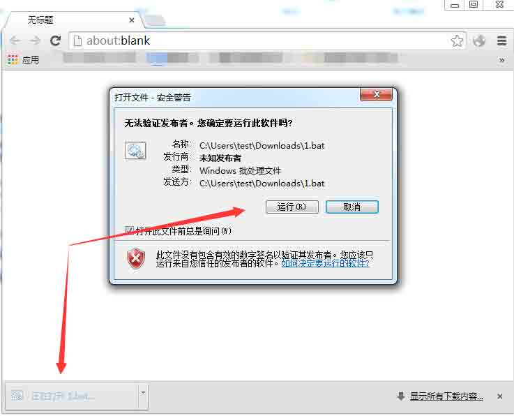
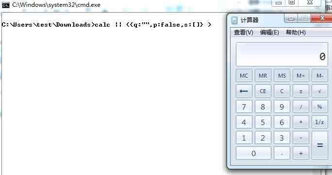
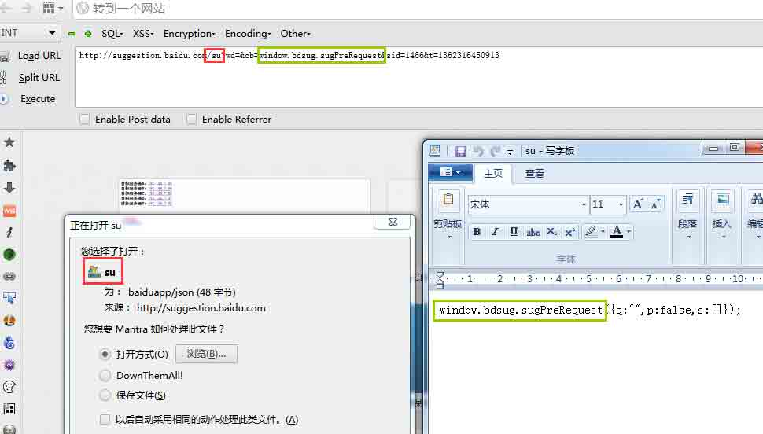
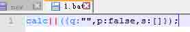
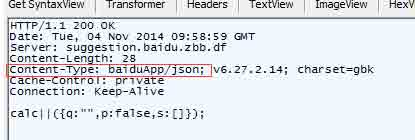
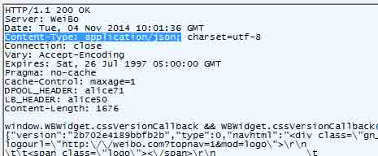
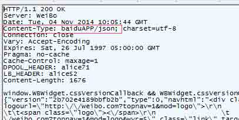
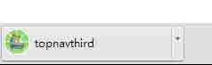

# Reflected File Download Attack

2014/11/06 11:18 | [darksn0w](http://drops.wooyun.org/author/darksn0w "由 darksn0w 发布") | [技术分享](http://drops.wooyun.org/category/tips "查看 技术分享 中的全部文章"), [漏洞分析](http://drops.wooyun.org/category/papers "查看 漏洞分析 中的全部文章") | 占个座先 | 捐赠作者

## 0x00 背景

* * *

前几天 Blackhat 上,有一个有意思的议题,《Reflected File Download,A New Web Attack Vector》,瞬间觉得高大上,就拿来膜拜了一下,经过膜拜发现不知道是我不能完全理解还是什么原因,总是觉得这种攻击方式略微鸡肋.我简单的把膜拜的过程记录下发出来,让各路基友帮忙看看,到底该用什么姿势去膜拜才是正确的.

Reflected-File-Download-Attack,我觉得可以翻译成"反射型文件下载",感觉跟反射型 Xss 类似,在 Hafif 的 PPT 里是这样描述的: “用户点击一个来自 google.com 的链接，会下载一个恶意的文件，一旦用户点了这个文件，这个文件就立即运行，windows 的计算器就弹出来了（PPT 第 17 页）”“Uploadless Downloads!(P18)”

由于那个漏洞 google.com 修复了，这里我找了一个百度的有类似风险的链接，来膜(实)拜(验)。

## 0x01 细节

* * *

首先看实验，然后在详细说原理： 如果你的浏览器是 chrome，那么使用这个链接：

```
http://suggestion.baidu.com/su;/1.bat;?wd=&cb=calc||&sid=1440_2031_1945_1788&t=1362056239875 
```

如果你的浏览器不是 chrome，那么使用这个链接：

```
http://suggestion.baidu.com/su;/1.bat?wd=&cb=calc||&sid=1440_2031_1945_1788&t=1362056239875 
```

当你点击了这个链接，你的浏览器会提示下载:



细心的童鞋在 url 中就已经发现了，内容都写在 url 里了，很显然如果你运行了，就会弹出计算器：



当然，肯定会有童鞋说，你以为我是 SB 吗，我才不会去点他呢。。（遇到这问题我竟无言以对，确实鸡肋）

这个议题的演讲人在 PPT 里面有一段大概这样意思的描述：我们是如何去相信我们的下载呢？(P20)

我觉得这个漏洞的最大价值也就在于普通用户去分辨是否恶意下载是靠各种浏览器地址框的绿色证书标识，是靠 HOST,注意这里说的是普！通！用！户！

在这个例子里，如果我们不对 url 进行任何修改，打开后会下载会一个文件，名字是 su：

```
http://suggestion.baidu.com/su?wd=&cb=window.bdsug.sugPreRequest&sid=1466&t=1362316450913 
```



从图中我们可以看出两个对我们有用的地方：

1.红框处，下载的文件名字跟 url 后面跟的 su 一样，这里我们可以试试能不能通过修改这里使下载的文件名变成我们想要的。 2.绿框处，cb 字段输入的内容在返回中出现了，这里我们可以试试能不能通过修改这里使文件的内容变成我们所需的。

通过实验，得到下面这个能够执行命令的 url：

```
http://suggestion.baidu.com/su;/1.bat;?wd=&cb=calc||&sid=1440_2031_1945_1788&t=1362056239875 
```

这里我们打开这个.bat：



这段字符串用被管道符隔成了两段命令，第一段是弹计算器，第二段是无效命令。 这个例子没有 Hafif 的 PPT 里的那个例子好，如果在我们能控制的输入位前面还有一些字符串,我们仍然可以使用管道符分隔开两段字符串。例如:

```
{"results":["q", "rfd\"|| calc|| ","I loverfd"]} 
```

我们再来看一下数据包，如果我们想要下载一个文件，遵循正常 http 协议，那么他的 http 头中要包含 Content-Disposition 字段，并且参数为 attachment，这个字段还有个字段是 filename，也就是说如果想要使用下载功能这个字段的标准写法是这样的：

```
Content-Disposition:attachment;filename:1.txt 
```

但是 google 产生漏洞的这个位置并没有加 filename 参数。按理来说百度这个地方的安全风险也应该是这样产生的，但是在实际测试中我们发现，并不是这样的。 先看一下百度的返回包：



虽然没有那个强制下载的字段 Content-Disposition，但是我们仍然成功下载了，这里就产生了一个问题。。。

在后面的测试中我们发现，是因为 content-type 字段的内容造成的，按照 http 协议，content-type 的 json 返回包的正常写法是这样的：

```
Content-Type: application/json; 
```

为了验证是哪里的问题，我们继续尝试：

```
http://weibo.com/aj/top/topnavthird?_t=1&_v=WBWidget.cssVersionCallback 
```

这个微博地址返回的是 json 的数据，并没有下载行为，他的返回包是这样的：



现在我把修改返回里的 content-type 字段为 baiduApp/jason:



发现页面文件发生了下载行为！



经过接下来的尝试我们发现，如果 content-type 不符合 http 协议，也就是说不是标准的 application/json 写法，而是 baiduAPP/json 或者 xxxx/json,甚至 Fuck/json，都会使页面产生下载行为！

(我也不能完全确定是不是不符合 HTTP 协议，各路基友求证实)

这样这个漏洞形成的原因就很简明了，要符合几个条件：

1.在返回中能看到我们的输入并且 content-type 的类型不是普通类型，json 或者 jsonp 等等。。。

2.url 没有过滤或转义‘/’‘;’

3.是下载类型。使用不完整的 Content-Disposition:attachment 或者是不符合 http 协议的 content-type。

原理上基本就这样了，至于利用上这的确是有一定的鸡肋，不过类似反射型 XSS，如果在社交网络中使用，效果还是很不错的，例子我就不举了，这里贴个 Hafif 在 PPT 中的例子。效果好坏完全看你的忽悠能力了！！


PPT 里面还有关于如何修复，这里我就不说了，感兴趣的童鞋可以去看看，附上 PPT 下载地址：[`dakrsn0w.sectree.cn/RFD.pdf`](http://dakrsn0w.sectree.cn/RFD.pdf)

版权声明：未经授权禁止转载 [darksn0w](http://drops.wooyun.org/author/darksn0w "由 darksn0w 发布")@[乌云知识库](http://drops.wooyun.org)

分享到：

### 相关日志

*   [配置 ModSecurity 防火墙与 OWASP 规则](http://drops.wooyun.org/tips/2614)
*   [InsightScan:Python 多线程 Ping/端口扫描 + HTTP 服务/APP 探测，可生成 Hydra 用的 IP 列表](http://drops.wooyun.org/tools/427)
*   [Hacking weblogic](http://drops.wooyun.org/tips/402)
*   [Shell Injection & Command Injection](http://drops.wooyun.org/papers/1018)
*   [爬虫技术浅析](http://drops.wooyun.org/tips/3915)
*   [XDS: Cross-Device Scripting Attacks](http://drops.wooyun.org/papers/1472)