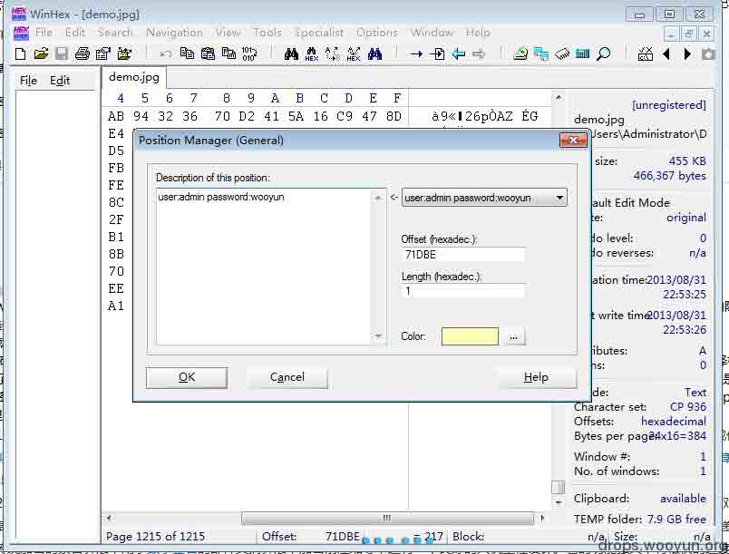
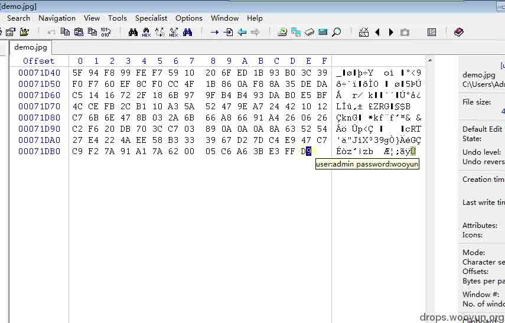
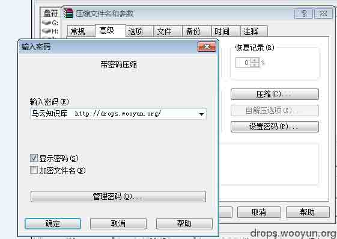
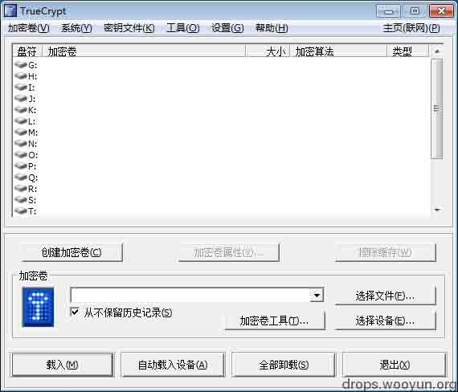
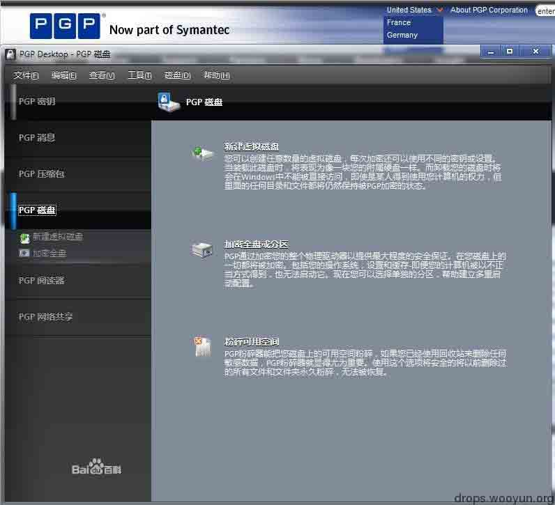
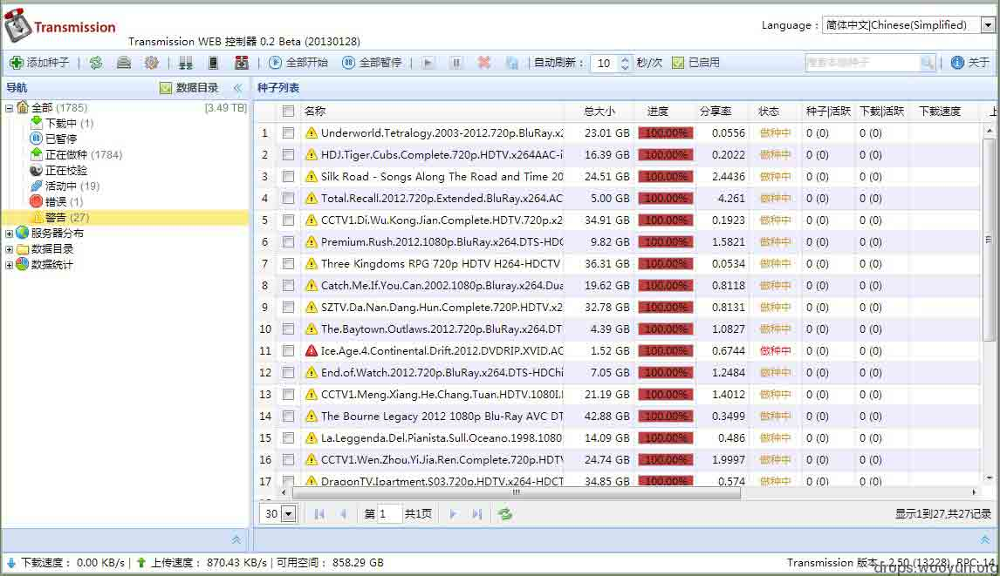
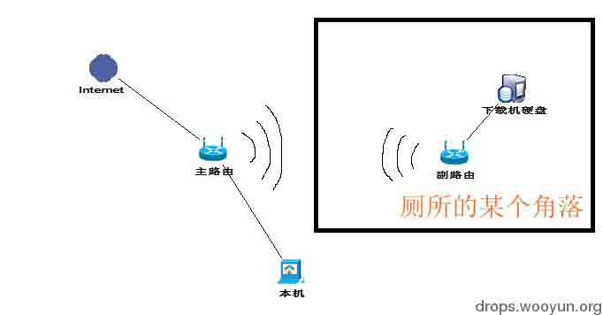
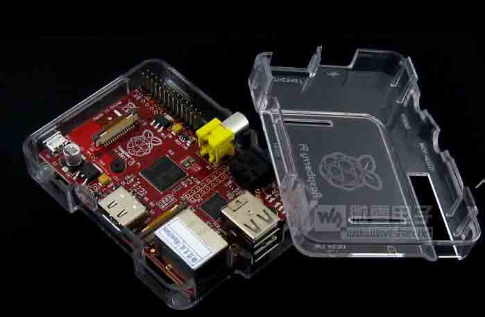
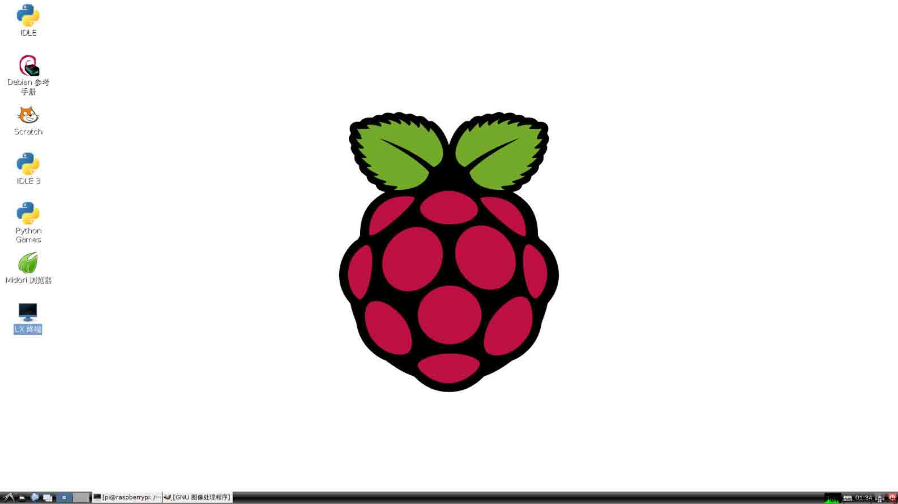
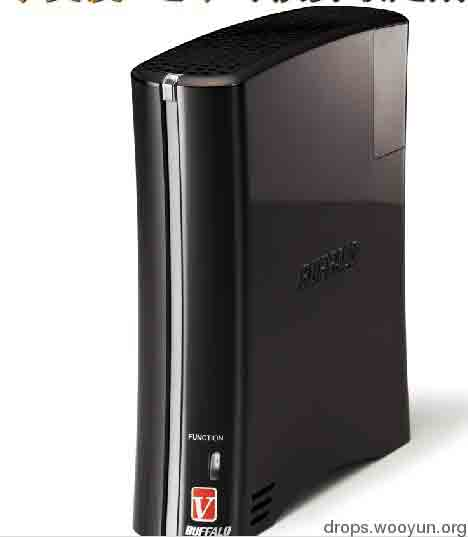

# 浅谈怎样保住数据最后的贞操

2013/09/03 17:47 | [黄小昏](http://drops.wooyun.org/author/黄小昏 "由 黄小昏 发布") | [技术分享](http://drops.wooyun.org/category/tips "查看 技术分享 中的全部文章") | 占个座先 | 捐赠作者

## 0x00 前言

* * *

在这个信息大爆菊的年代。无论是谁，都会有超过 10 种账号，其中包括电话号码，身份证，QQ, 邮箱，妹子生日，长度。。。

但是，话说回来，现在随便一个搬砖工头的手里都有着几 E 的数据，甚至连你今天穿什么颜色内裤都知道，这让我们情何以堪啊，对于最近的网盘，我也不多说什么了，那个肯定就是不要上传那些敏感的文件了，那我们应该怎么怎么处理我们的文件呢？放在电脑里？oh,no,刚才查水表的叔叔把整个机箱扛走了，难道就这样让我们的数据放荡在光天化日下？不，我们得行动起来，把我们的隐私保护起来！

## 0x01 套餐介绍

* * *

下面介绍几种套餐，了用于不同的场合，也可以交叉使用

### （1）屌丝型套餐

对于我这种屌丝来说，也没什么重要的信息，最多也是几个游戏账号啊，QQ 密码啊，普通的信息还有一些极品种子什么的。虽然没多大的价值，但是也怕一些熊孩子或者家里人乱翻，可最怕的还是那些黑客，所以本屌的方案也很简单。

首先，先在网上下载一个 winhex 。 然后找一个十分普通的图片，注意一定要普通(如图 1)！


然后用 winhex 打开，然后尽量往下拉，尽量 选择靠后边的一个字符，点击右键，选 add position...，然后在弹出的窗口中输入你要隐藏的隐私，然后点击 ok，（tip:选择比较后边的字符是为了防止保存后的图片损坏或打不开）



然后当你指向那个字符，账号密码就显示了....把它保存.本屌再重新打开图片，ok，能正常打开

密码在里边



有基友就会问了，"你这样做只能是隐藏数据啊，如果有人知道了你的方法，那你的 password 还是一样泄露了。"。

的确，所以我们换一种姿势就可以了，这里我们请出系统原带的 winrar。我们把处理好的 demo1 点击右键，压缩，然后选择高级选择框，设置密码，重点是在这里了，我们不要输入英文和数字，因为都可以暴力破解，虽然我不能确定一些大牛有 0day 可以绕过密码认证，可这是可行的办法，就是输入中文，你可以直接显示密码，然后就能直接输入中文了，然后再压缩下如图



这种就算是基础的保护隐私了，最后把这个 rar 传给你的亲密基友，叫他帮你传到他网盘下存盘就大致 ok。这样射也射不到。

实在觉得不安全。就用 truecrypt 再加密一次吧(tip:truecrypt  一种加密工具).这里介绍两款加密软件:



TrueCrypt，是一款免费开源的加密软件，同时支持 Windows Vista,7/XP, Mac OS X, Linux 等操作系统。TrueCrypt 不需要生成任何文件即可在硬盘上建立虚拟磁盘，用户可以按照盘符进行访问，所有虚拟磁盘上的文件都被自动加密，需要通过密码来进行访问。TrueCrypt 提供多种加密算法，包括：AES-256, Blowfish (448-bit key), CAST5, Serpent, Triple DES, and Twofish，其他特性还有支持 FAT32 和 NTFS 分区、隐藏卷标、热键启动等。



PGP(Pretty Good Privacy)，是一个基于 RSA 公匙加密体系的邮件加密软件。可以用它对邮件保密以防止非授权者阅读，它还能对邮件加上数字签名从而使收信人可以确认邮件的发送者，并能确信邮件没有被篡改。它可以提供一种安全的通讯方式，而事先并不需要任何保密的渠道用来传递密匙。它采用了一种 RSA 和传统加密的杂合算法，用于数字签名的邮件文摘算法，加密前压缩等，还有一个良好的人机工程设计。它的功能强大，有很快的速度。而且它的源代码是免费的。

### （2）技术大牛套餐

对于很多大牛来说，肯定有很多自己的隐私，而且是重量级的，其中不包括三围和长度，最重要的莫过于各种 POC 和银行密码是什么的，除了上边的加密我们就没辙了？不！当我们水表爆了，机箱也会一起被扛走，有时候甚至连显示器也一起 收了。但是没收走的只有路由器.我们只能在路由器做点小手脚，

#### 方案一：直接把密码写入路由器内

找一个支持 telnet 的路由器，用 root 权限登陆后上传修改好的 rar，然后目录隐藏....（不支持大文件，除非你是定制的路由器）前提是直接写在路由器是写在路由器的 FLASH 闪存里，所以 flash 闪存必须要大...so  that，你要刷一个精简版版的固件，比如说你的 FLASH 是 8MB 的,你就只能刷个 4M 简化版，放 JFFS 里，而这个 JFFS 只能是 root 才能访问...破解不了，刷机就会消失....就能达到保护数据的目的。需要下载的的时候直接 telnet 上去下载下来就行了。

#### 方案二：路由器挂载硬盘或者 U 盘

我们就直接推荐使用路由器外接硬盘或者 U 盘的方式来存放数据裤，这里我就用一台基于 unix 开发的系统的 tomato 路由器来做示范吧 ：P

（tip：Tomato DualWAN 使那些能刷 Tomato 或 DD-WRT 固件的路由器由原来的单 WAN 口变成双 WAN 口，而这一切不需要在路由器上增加任何硬件，只需要刷一下 Tomato DualWAN 固件就可以。刷了 Tomato DualWAN 之后转变出来的第二个 WAN 口可以接有线网络也可以接无线网络，双 WAN 模式支持带宽合并或智能路由。

注意：要工作在双 WAN 模式，您必须要有两条线路(可以是自己的线路+别人的无线网络)或者有两个宽带帐号，否则无法工作在双 WAN 模式。

刷了 Tomato DualWAN 的路由器除了具备普通路由器的基本功能以外，还提供如下特色功能：

```
带宽合并/负载均衡，可以将两条线路的带宽合并实现快速下载
智能路由，自动根据目标 IP 所属 ISP 选择最优线路出去，加快用户访问速度
QoS/IP 限速，合理分配网络带宽
设备流量实时查看，了解每台电脑的流量状况
ARP 绑定，可以阻止非法用户使用网络
IPID 防电信网络尖兵
VPN(PPTP)服务器和客户端，可以将分布在不同地方的办公室组成一个局域网
支持 Apple(Mac OS X)的 NAT-PMP(UPnP 的另外一种）
BT 脱机下载功能（路由器需要有 USB 接口），睡觉前或者上班的时候让路由器帮你下载喜欢的游戏或者电影，而不需要开着电脑
Samba 服务器（路由器需要有 USB 接口），提供文件共享功能，以便直接在 PC 上播放路由器下载好的电影
FTP 服务器（路由器需要有 USB 接口）
3G 上网功能（路由器需要有 USB 接口），插上 USB 接口的 3G 上网卡或者智能手机后，路由器就变成一个 3G 路由器，团队出差的时候多人共享上网很方便
上网通告功能 
```

当然他的 dualwan 功能我们就不介绍了，重点是它支持 samba 和 ftp 还有脱机下载，大牛可以直接在刷好或者直接买一个

有 tomato 的路由器，然后再用一个移动硬盘连接路由器后边的 usb 菊花口，拆开路由器，从电源线再引出一条 5v 的线作为移动硬盘的电源（当然，也可以外接电源）。组成一个小型的 ftp 服务器。

下边就是用路由器做 web 服务器或者下载机的教程，有兴趣的同学可以看下

[传送门](http://bbs.dualwan.cn/forumdisplay.php?fid=32&filter=type&typeid=102)，后来就是安装



Transmission WEB 控制器（地址有教程）

[`code.google.com/p/transmission-control/`](http://code.google.com/p/transmission-control/)

下载 WEB 控制器 安装外部 Transmission 进入 U 盘以下路径 sda1optshare ransmissionweb 将下载的文件解压后复制进去

安装外部 Transmission 等 N16 设置请参考 [`bbs.dualwan.cn/thread-317811-1-1.html`](http://bbs.dualwan.cn/thread-317811-1-1.html)

如果根据以上本人的两个帖子安装有 DLNA（minidlna ushare） bt aria2c goagent 代理 DNS 防污染

则可直接在 usb 设置

挂载后运行脚本 中填入执行脚本，避免填入各命令 ，以及节约 NVRAM 空间

```
/tmp/mnt/sda1/aria2/autorun.sh 
```

否则此文件请自行修改！

把下载机搭建好了以后，把你的主路由器开启 wifi，并隐藏 SSID 和关闭 WPS（防止某些脑残仔天天嗅探和爆破 PIN 码），第二步将你的下载机藏在一个角落别人找不到的（注意散热）...然后加入主路由器的 WIFI，把副路由器设置成 WDS。这样两台机构成了内网，我们只需要在我们的电脑上用 Quick Easy FTP Server 搭建一个 FTP 服务器，我们就可以直接控制 Transmission 来下载我们电脑上的各种数据来做备份。这样能防止水管爆了...电脑被收走了而数据木有了情况。。。 

有点乱了？ 我画个拓扑图吧



### （3）高富帅大牛套餐

对于高富帅大牛来说，钱就不是问题，重要的问题是这些大牛有着太多的数据了，不可能和上边的数据并论

你会说搞这样这么麻烦.....当然你也可以直接购买一个树莓派。

重要的是他只有一个名片这么大



他是用 SD 卡来启动系统，利用 usb 口接到移动硬盘上...直接备份数据

下边上个树莓派的开机图



搭建好了平台就直接利用主机的 FTPserver 进行文件互传了。

如果说觉得树莓派还是太难弄....那就只能直接上一个 NAS 了....虽然体型有点大...  (tip:NAS 被定义为一种特殊的专用数据存储服务器，包括存储器件[例如磁盘阵列、CD/DVD 驱动器、磁带驱动器或可移动的存储介质]和内嵌系统软件，可提供跨平台文件共享功能。NAS 通常在一个 LAN 上占有自己的节点，无需应用服务器的干预，允许用户在网络上存取数据，在这种配置中，NAS 集中管理和处理网络上的所有数据，将负载从应用或企业服务器上卸载下来，有效降低总拥有成本，保护用户投资。)

缺点就是 NAS 体型有点大，但是高富帅又觉得树莓派又外接硬盘太屌丝，我只能推荐一个小型的 NAS 了，前几周几个基友一起团购了一个...体积蛮小，还送有个 1TB 的硬盘，里边有 wifi 模块，省了一个路由器，型号：

BUFFALO 巴法络 LS-V1.0TL 网络存储 1TB 硬盘

上几个图吧



长相类似 xbox 360 里边已经内置了 wifi，和 1TB 硬盘，同样也是通过内网来管理数据，可以放在床底什么的.....剩下的就自己发挥了

## 0x02 总结

* * *

综上所述，如何保护数据只能看你用来做什么了，如果修水管的工头要你说出数据藏在哪里你也肯定要说出来。。。所以说，不要做坏事，平时就拿来做下载机就行了，下点欧美日韩动作片也是有益身心健康，不要整天想着脱别人内裤的事情了！！！

就这样.....本人高三狗一只，准备断网冲刺高考了，希望有个好成绩。

版权声明：未经授权禁止转载 [黄小昏](http://drops.wooyun.org/author/黄小昏 "由 黄小昏 发布")@[乌云知识库](http://drops.wooyun.org)

分享到：

### 相关日志

*   [密码管理利器：Linux – KeePassX](http://drops.wooyun.org/tools/1013)
*   [安全科普：Waf 实现扫描器识别 彻底抵挡黑客扫描](http://drops.wooyun.org/tips/730)
*   [使用 OpenSSH 证书认证](http://drops.wooyun.org/tips/1055)
*   [逆向基础（九）](http://drops.wooyun.org/tips/2459)
*   [URL Hacking – 前端猥琐流](http://drops.wooyun.org/tips/750)
*   [linux symbolic link attack tutorial](http://drops.wooyun.org/papers/4762)